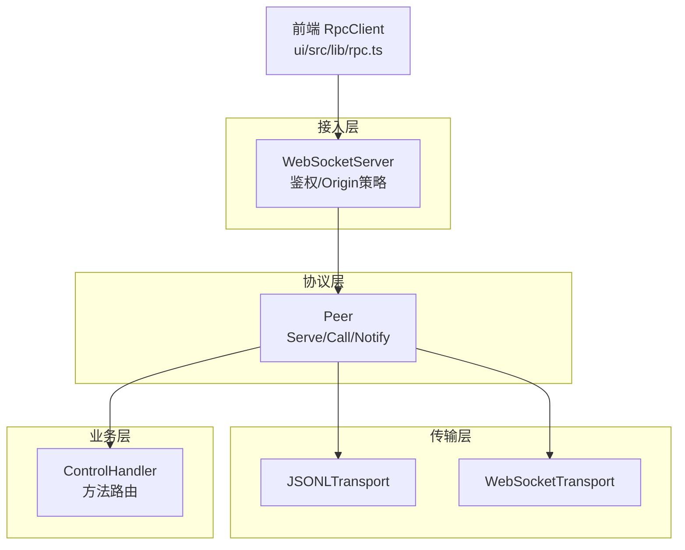
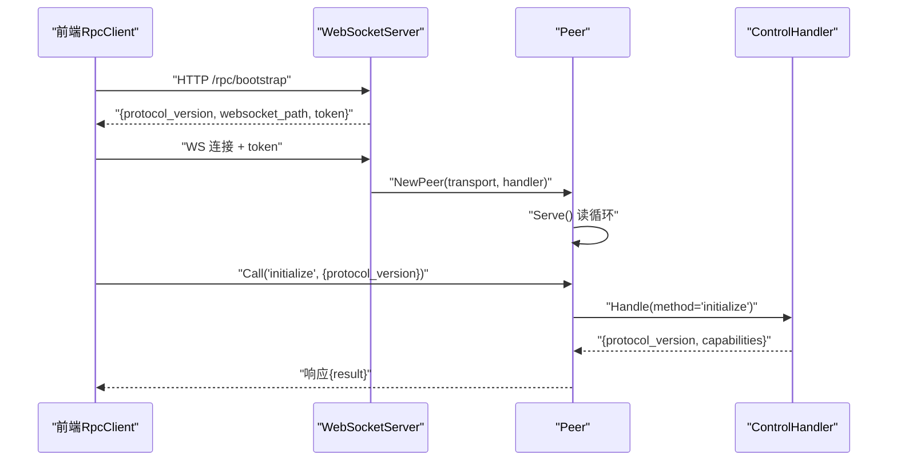
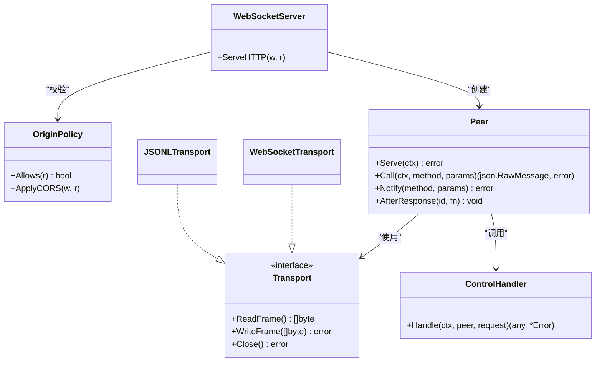
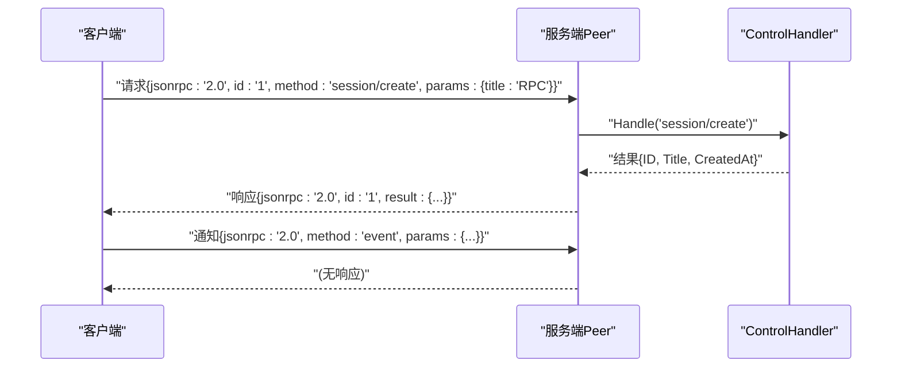

# JSON-RPC协议规范

<cite>
**本文引用的文件**
- [internal/rpc/protocol.go](file://internal/rpc/protocol.go)
- [internal/rpc/control.go](file://internal/rpc/control.go)
- [internal/rpc/transport.go](file://internal/rpc/transport.go)
- [internal/rpc/websocket.go](file://internal/rpc/websocket.go)
- [internal/rpc/origin.go](file://internal/rpc/origin.go)
- [ui/src/lib/rpc.ts](file://ui/src/lib/rpc.ts)
- [internal/rpc/protocol_test.go](file://internal/rpc/protocol_test.go)
- [internal/rpc/control_test.go](file://internal/rpc/control_test.go)
</cite>

## 目录
1. [简介](#简介)
2. [项目结构](#项目结构)
3. [核心组件](#核心组件)
4. [架构总览](#架构总览)
5. [详细组件分析](#详细组件分析)
6. [依赖关系分析](#依赖关系分析)
7. [性能与背压](#性能与背压)
8. [故障排查指南](#故障排查指南)
9. [结论](#结论)
10. [附录：客户端集成与消息示例](#附录客户端集成与消息示例)

## 简介
本规范定义 Vivy 的自定义 JSON-RPC 控制平面协议。该协议基于 JSON-RPC 2.0，采用帧级传输（JSON Lines 或 WebSocket Text），提供会话、运行、事件订阅、审批/问答、评估、设置等能力。协议通过版本化能力协商、严格错误码和有序响应机制，保证跨进程/浏览器客户端的稳定交互。

## 项目结构
Vivy 的 RPC 子系统位于 internal/rpc，负责协议解析、分发、背压与传输抽象；control.go 实现业务方法路由；websocket.go 提供 HTTP 升级接入；transport.go 提供 JSONL 与 WebSocket 两种传输；ui/src/lib/rpc.ts 为前端客户端实现。

图表来源
- [internal/rpc/transport.go:12-85](file://internal/rpc/transport.go#L12-L85)
- [internal/rpc/protocol.go:92-164](file://internal/rpc/protocol.go#L92-L164)
- [internal/rpc/control.go:253-353](file://internal/rpc/control.go#L253-L353)
- [internal/rpc/websocket.go:12-47](file://internal/rpc/websocket.go#L12-L47)
- [ui/src/lib/rpc.ts:38-141](file://ui/src/lib/rpc.ts#L38-L141)

章节来源
- [internal/rpc/protocol.go:1-374](file://internal/rpc/protocol.go#L1-L374)
- [internal/rpc/transport.go:1-85](file://internal/rpc/transport.go#L1-L85)
- [internal/rpc/websocket.go:1-56](file://internal/rpc/websocket.go#L1-L56)
- [internal/rpc/control.go:1-800](file://internal/rpc/control.go#L1-L800)
- [ui/src/lib/rpc.ts:1-155](file://ui/src/lib/rpc.ts#L1-L155)

## 核心组件
- 协议常量与错误码：定义协议版本标识、标准错误码及扩展错误码。
- Request/Response 结构：遵循 JSON-RPC 2.0，支持请求、响应、通知三种消息类型。
- Peer：封装读循环、写队列、请求派发、响应等待、回调执行。
- Transport：抽象帧读写，支持 JSONL 与 WebSocket。
- ControlHandler：业务方法路由与参数校验，返回结果或错误。
- WebSocketServer：HTTP 升级、Token 鉴权、Origin 策略。
- 前端 RpcClient：连接引导、能力协商、调用与通知处理。

章节来源
- [internal/rpc/protocol.go:18-52](file://internal/rpc/protocol.go#L18-L52)
- [internal/rpc/protocol.go:92-164](file://internal/rpc/protocol.go#L92-L164)
- [internal/rpc/transport.go:12-85](file://internal/rpc/transport.go#L12-L85)
- [internal/rpc/control.go:253-353](file://internal/rpc/control.go#L253-L353)
- [internal/rpc/websocket.go:12-56](file://internal/rpc/websocket.go#L12-L56)
- [ui/src/lib/rpc.ts:38-141](file://ui/src/lib/rpc.ts#L38-L141)

## 架构总览
协议以“传输无关”的 Peer 为核心，统一承载 JSON-RPC 语义。服务端通过 WebSocketServer 接收连接，使用 OriginPolicy 与 Token 进行安全校验，随后创建 Peer 并启动 Serve 循环。业务方法由 ControlHandler 路由到具体实现。客户端通过前端 RpcClient 发起调用，自动维护 id、等待响应、处理通知与关闭事件。

图表来源
- [internal/rpc/websocket.go:27-47](file://internal/rpc/websocket.go#L27-L47)
- [internal/rpc/protocol.go:120-164](file://internal/rpc/protocol.go#L120-L164)
- [internal/rpc/control.go:253-266](file://internal/rpc/control.go#L253-L266)
- [ui/src/lib/rpc.ts:55-99](file://ui/src/lib/rpc.ts#L55-L99)

## 详细组件分析

### 协议版本与能力协商
- 协议版本标识：在 initialize/capabilities 中返回 protocol_version，用于客户端能力检测与兼容性判断。
- 能力列表：capabilities 声明当前服务支持的 RPC 方法族，如 session、turn、run.subscribe、child.*、settings.* 等。
- 客户端行为：前端在建立连接后调用 initialize，获取并缓存协议版本与能力集。

章节来源
- [internal/rpc/control.go:253-266](file://internal/rpc/control.go#L253-L266)
- [ui/src/lib/rpc.ts:94-99](file://ui/src/lib/rpc.ts#L94-L99)

### 消息格式定义
- 请求（Request）：包含 jsonrpc="2.0"、可选 id、method、params。
- 响应（Response）：包含 jsonrpc="2.0"、id、result 或 error。
- 通知（Notification）：无 id 的请求，服务端无需回复。
- 帧格式：JSONL（换行分隔）或 WebSocket Text 帧。

章节来源
- [internal/rpc/protocol.go:47-52](file://internal/rpc/protocol.go#L47-L52)
- [internal/rpc/protocol.go:85-90](file://internal/rpc/protocol.go#L85-L90)
- [internal/rpc/transport.go:31-54](file://internal/rpc/transport.go#L31-L54)
- [internal/rpc/transport.go:67-82](file://internal/rpc/transport.go#L67-L82)

### 错误代码规范
- 标准错误码：
  - ParseError：-32700，JSON 解析失败。
  - InvalidRequest：-32600，非 JSON-RPC 2.0 或缺少 method。
  - MethodNotFound：-32601，未注册的方法。
  - InvalidParams：-32602，参数校验失败。
  - InternalError：-32603，内部错误。
  - ServerOverload：-32001，服务器过载（预留）。
- 业务扩展错误码：
  - CodeNotFound：-32004，资源不存在。
  - CodeConflict：-32009，冲突（如重复操作）。
- 错误对象：包含 code、message、可选 data。

章节来源
- [internal/rpc/protocol.go:20-27](file://internal/rpc/protocol.go#L20-L27)
- [internal/rpc/protocol.go:34-45](file://internal/rpc/protocol.go#L34-L45)
- [internal/rpc/control.go:22-25](file://internal/rpc/control.go#L22-L25)

### Request/Response 设计与 ID 生成
- ID 生成机制：
  - 服务端侧：使用原子计数器生成自增数字字符串作为 id，确保唯一性与顺序性。
  - 客户端侧：前端维护 nextId 自增，发送时附带 id，用于匹配响应。
- 方法调用模式：
  - Call：带 id 的请求，等待对应响应或错误。
  - Notify：无 id 的通知，不期待响应。
- 参数传递方式：
  - params 为任意 JSON 值，服务端按方法反序列化为具体结构体进行校验。

章节来源
- [internal/rpc/protocol.go:289-328](file://internal/rpc/protocol.go#L289-L328)
- [ui/src/lib/rpc.ts:101-112](file://ui/src/lib/rpc.ts#L101-L112)
- [internal/rpc/control.go:253-353](file://internal/rpc/control.go#L253-L353)

### 标准错误处理流程
- 解析失败：收到非法 JSON 时，立即返回 ParseError。
- 无效请求：jsonrpc 非 "2.0" 或 method 为空，返回 InvalidRequest。
- 方法未找到：路由未命中，返回 MethodNotFound。
- 参数校验失败：反序列化或业务校验失败，返回 InvalidParams。
- 内部错误：底层异常或不可恢复错误，返回 InternalError。
- 资源/状态错误：根据业务返回 CodeNotFound 或 CodeConflict。

章节来源
- [internal/rpc/protocol.go:181-205](file://internal/rpc/protocol.go#L181-L205)
- [internal/rpc/protocol.go:208-230](file://internal/rpc/protocol.go#L208-L230)
- [internal/rpc/control.go:350-353](file://internal/rpc/control.go#L350-L353)

### 业务方法概览（节选）
- 会话管理：session/create、session/list、session/get、session/rename、session/delete、session/messages
- 运行控制：preflight/run、turn/start、run/get、run/cancel、run/subscribe、run/log
- 审批/问答：approval/list、approval/respond、question/list、question/respond
- 审核：review/list、review/get、review/respond
- 后台任务：background/recover、background/list、background/attach
- 子任务：child/start、child/get、child/list、child/wait、child/cancel
- 模型产物：generations/list、generations/get、generations/create、generations/reject
- 评估：evals/list、evals/record、evals/start
- 发布：promotions/list、promotions/promote
- 物种检查：species/inspect
- 设置：settings/get、settings/update

章节来源
- [internal/rpc/control.go:253-353](file://internal/rpc/control.go#L253-L353)

### 传输与安全
- JSONL 传输：适用于进程内管道或标准流，逐行读取/写入。
- WebSocket 传输：浏览器/远程客户端通过文本帧传输。
- 鉴权：
  - Token：URL 查询参数或 Authorization: Bearer 头。
  - Origin 策略：仅允许同域或配置的白名单 origin，防止跨站滥用。
- 升级：HTTP 升级为 WebSocket 后交由 Peer.Serve 接管。

章节来源
- [internal/rpc/transport.go:12-85](file://internal/rpc/transport.go#L12-L85)
- [internal/rpc/websocket.go:27-56](file://internal/rpc/websocket.go#L27-L56)
- [internal/rpc/origin.go:13-54](file://internal/rpc/origin.go#L13-L54)

## 依赖关系分析
- Peer 依赖 Transport 进行帧读写，依赖 Handler 进行方法处理。
- ControlHandler 依赖存储、运行时服务、事件总线、Studio、评估器等后端能力。
- WebSocketServer 依赖 OriginPolicy 与 Token 进行访问控制。
- 前端 RpcClient 依赖 bootstrap 接口获取连接信息，再建立 WebSocket 并协商能力。

图表来源
- [internal/rpc/protocol.go:92-164](file://internal/rpc/protocol.go#L92-L164)
- [internal/rpc/transport.go:12-85](file://internal/rpc/transport.go#L12-L85)
- [internal/rpc/control.go:253-353](file://internal/rpc/control.go#L253-L353)
- [internal/rpc/websocket.go:12-47](file://internal/rpc/websocket.go#L12-L47)
- [internal/rpc/origin.go:13-54](file://internal/rpc/origin.go#L13-L54)

章节来源
- [internal/rpc/protocol.go:92-164](file://internal/rpc/protocol.go#L92-L164)
- [internal/rpc/transport.go:12-85](file://internal/rpc/transport.go#L12-L85)
- [internal/rpc/control.go:253-353](file://internal/rpc/control.go#L253-L353)
- [internal/rpc/websocket.go:12-47](file://internal/rpc/websocket.go#L12-L47)
- [internal/rpc/origin.go:13-54](file://internal/rpc/origin.go#L13-L54)

## 性能与背压
- 出队缓冲：Peer 维护有界 out 通道，默认大小可配置；当队列满时返回 ErrOverloaded，避免内存膨胀。
- 写串行化：writeLoop 单 goroutine 串行写出，保证帧顺序。
- 最大帧限制：超过 MaxFrameBytes 的消息将被拒绝并返回 InvalidRequest。
- 并发处理：请求处理并发执行，但响应写入串行化，兼顾吞吐与一致性。

章节来源
- [internal/rpc/protocol.go:70-83](file://internal/rpc/protocol.go#L70-L83)
- [internal/rpc/protocol.go:166-179](file://internal/rpc/protocol.go#L166-L179)
- [internal/rpc/protocol.go:257-273](file://internal/rpc/protocol.go#L257-L273)
- [internal/rpc/protocol.go:158-162](file://internal/rpc/protocol.go#L158-L162)

## 故障排查指南
- 无法连接控制面：
  - 检查 /rpc/bootstrap 是否返回有效 JSON，包含 websocket_path 与 token。
  - 确认 Origin 策略与 Token 校验通过。
- 解析错误：
  - 检查发送的帧是否为合法 JSON，且符合 JSON-RPC 2.0 格式。
- 方法未找到：
  - 核对 capabilities 列表，确认方法名正确。
- 参数错误：
  - 检查 params 字段是否符合方法定义，缺失必填字段将返回 InvalidParams。
- 连接断开：
  - 前端 onclose 会拒绝所有 pending 请求，需重连并重新协商能力。

章节来源
- [ui/src/lib/rpc.ts:55-99](file://ui/src/lib/rpc.ts#L55-L99)
- [internal/rpc/websocket.go:27-56](file://internal/rpc/websocket.go#L27-L56)
- [internal/rpc/protocol.go:181-205](file://internal/rpc/protocol.go#L181-L205)
- [internal/rpc/protocol.go:208-230](file://internal/rpc/protocol.go#L208-L230)

## 结论
Vivy 的 JSON-RPC 协议以简洁、可扩展、安全为核心设计目标。通过版本化能力协商、严格的错误码体系、有序的响应与背压机制，以及传输无关的抽象，实现了稳定可靠的本地控制平面。前端客户端通过统一的 RpcClient 简化了连接、调用与通知处理，便于快速集成。

## 附录：客户端集成与消息示例

### 初始化与能力协商
- 客户端先调用 /rpc/bootstrap 获取协议版本、WebSocket 路径与 token。
- 建立 WebSocket 连接，携带 token。
- 调用 initialize 方法，传入协议版本，获取 capabilities。

章节来源
- [ui/src/lib/rpc.ts:55-99](file://ui/src/lib/rpc.ts#L55-L99)
- [internal/rpc/control.go:253-266](file://internal/rpc/control.go#L253-L266)

### 请求-响应模式
- 客户端发送带 id 的请求，服务端处理后返回对应 id 的响应或错误。
- 服务端内部使用原子计数器生成 id，确保唯一性。

章节来源
- [internal/rpc/protocol.go:289-328](file://internal/rpc/protocol.go#L289-L328)
- [internal/rpc/protocol.go:181-205](file://internal/rpc/protocol.go#L181-L205)

### 通知模式
- 客户端或服务端发送无 id 的请求（即通知），服务端无需回复。
- 前端通过 onNotification 监听指定方法的通知。

章节来源
- [internal/rpc/protocol.go:330-340](file://internal/rpc/protocol.go#L330-L340)
- [ui/src/lib/rpc.ts:114-119](file://ui/src/lib/rpc.ts#L114-L119)

### 错误处理流程
- 解析失败：返回 ParseError。
- 无效请求：返回 InvalidRequest。
- 方法未找到：返回 MethodNotFound。
- 参数错误：返回 InvalidParams。
- 内部错误：返回 InternalError。
- 资源/状态错误：返回 CodeNotFound 或 CodeConflict。

章节来源
- [internal/rpc/protocol.go:20-27](file://internal/rpc/protocol.go#L20-L27)
- [internal/rpc/control.go:22-25](file://internal/rpc/control.go#L22-L25)

### 消息序列示例（概念图）

[此图为概念示意，不直接映射具体源码]

### 向后兼容性与扩展点
- 版本化：initialize 返回 protocol_version，客户端据此选择能力集。
- 能力声明：capabilities 列出可用方法族，新增方法应加入能力列表。
- 错误码：保留 ServerOverload 等扩展位，便于未来扩展。
- 参数演进：params 使用 json.RawMessage 解析，允许逐步引入新字段并保持旧客户端兼容。

章节来源
- [internal/rpc/control.go:253-266](file://internal/rpc/control.go#L253-L266)
- [internal/rpc/protocol.go:20-27](file://internal/rpc/protocol.go#L20-L27)
- [internal/rpc/protocol.go:47-52](file://internal/rpc/protocol.go#L47-L52)

### 客户端集成要点
- 连接引导：从 /rpc/bootstrap 获取连接信息，建立 WebSocket。
- 能力协商：调用 initialize 获取 capabilities，缓存协议版本。
- 调用封装：call 方法自动分配 id，等待响应或错误。
- 通知处理：onNotification 注册监听器，处理服务端推送。
- 关闭处理：onclose 清理 pending 请求，必要时重连。

章节来源
- [ui/src/lib/rpc.ts:55-141](file://ui/src/lib/rpc.ts#L55-L141)