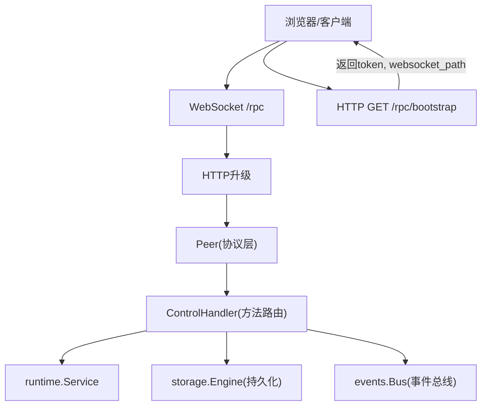
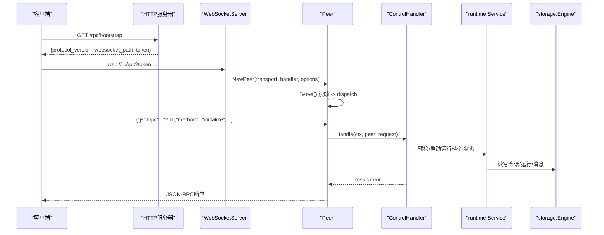
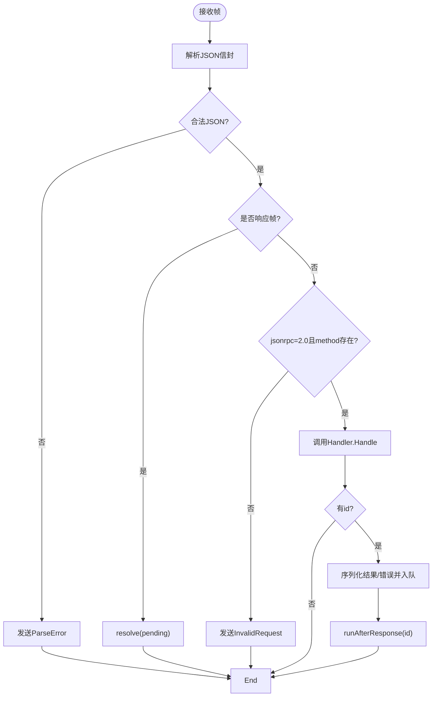
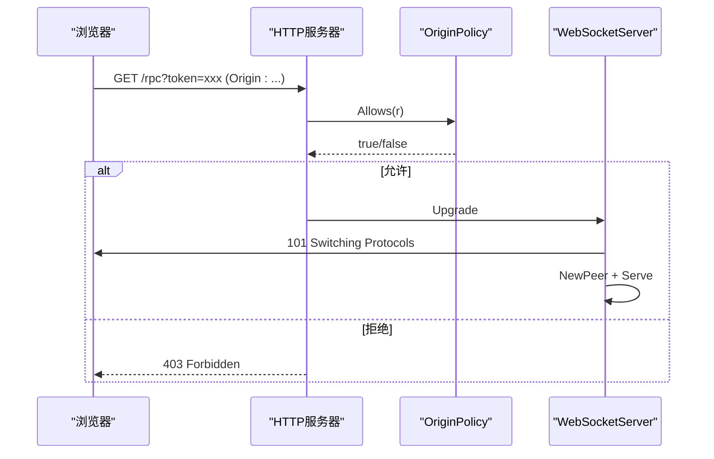
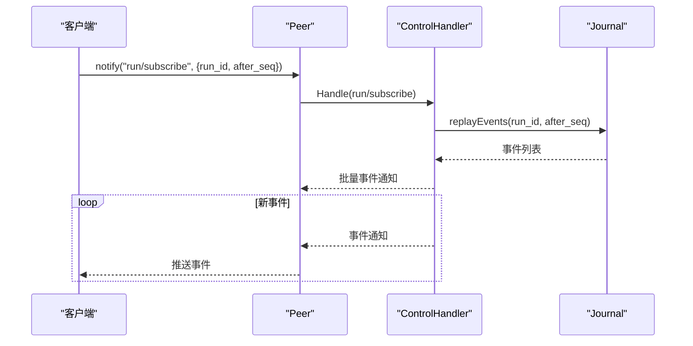
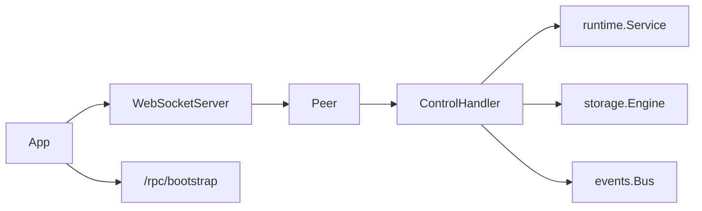

# RPC控制平面

<cite>
**本文引用的文件**
- [internal/rpc/protocol.go](file://internal/rpc/protocol.go)
- [internal/rpc/control.go](file://internal/rpc/control.go)
- [internal/rpc/websocket.go](file://internal/rpc/websocket.go)
- [internal/rpc/transport.go](file://internal/rpc/transport.go)
- [internal/rpc/origin.go](file://internal/rpc/origin.go)
- [internal/app/app.go](file://internal/app/app.go)
- [config.example.yaml](file://config.example.yaml)
- [ui/src/lib/rpc.ts](file://ui/src/lib/rpc.ts)
</cite>

## 目录
1. [简介](#简介)
2. [项目结构](#项目结构)
3. [核心组件](#核心组件)
4. [架构总览](#架构总览)
5. [详细组件分析](#详细组件分析)
6. [依赖关系分析](#依赖关系分析)
7. [性能与背压](#性能与背压)
8. [调试与监控](#调试与监控)
9. [故障排查指南](#故障排查指南)
10. [结论](#结论)
11. [附录：API参考](#附录api参考)

## 简介
本文件面向Vivy的RPC控制平面，覆盖JSON-RPC协议规范、消息格式、错误码、WebSocket连接管理、认证授权、跨域策略、HTTP REST端点、事件订阅与重放、客户端集成流程、协议版本管理与向后兼容、以及调试与排障要点。目标是帮助开发者快速理解并正确接入该控制平面。

## 项目结构
控制平面由以下模块组成：
- 协议与编解码：定义JSON-RPC帧、错误码、请求/响应结构、Peer生命周期与背压。
- 传输层：支持标准输入输出（JSONL）与WebSocket两种传输。
- 控制处理器：实现所有业务方法（会话、运行、审批、问题、评测、设置等）。
- HTTP服务装配：注册WebSocket路径、Bootstrap接口与健康检查。
- 跨域与认证：Origin白名单校验、Token鉴权。
- 前端客户端：浏览器侧封装了连接建立、能力协商、调用与通知处理。

图表来源
- [internal/app/app.go:325-348](file://internal/app/app.go#L325-L348)
- [internal/rpc/websocket.go:27-47](file://internal/rpc/websocket.go#L27-L47)
- [internal/rpc/protocol.go:120-164](file://internal/rpc/protocol.go#L120-L164)
- [internal/rpc/control.go:253-353](file://internal/rpc/control.go#L253-L353)

章节来源
- [internal/app/app.go:325-348](file://internal/app/app.go#L325-L348)
- [internal/rpc/websocket.go:27-47](file://internal/rpc/websocket.go#L27-L47)
- [internal/rpc/protocol.go:120-164](file://internal/rpc/protocol.go#L120-L164)
- [internal/rpc/control.go:253-353](file://internal/rpc/control.go#L253-L353)

## 核心组件
- JSON-RPC协议与Peer：统一的消息解析、分发、响应序列化、异步Call/Notify、AfterResponse顺序保证、过载保护。
- 传输抽象：JSONLTransport用于进程内或stdio；WebSocketTransport用于浏览器。
- WebSocketServer：校验Origin、Token，升级连接，创建Peer并启动Serve循环。
- ControlHandler：集中路由所有控制面方法，对接运行时、存储、事件总线、Studio、评测等子系统。
- OriginPolicy：规范化Origin、允许列表匹配、CORS头注入。
- App装配：构建HTTP Mux，挂载/rpc、/rpc/bootstrap、/healthz，生成随机Token并注入到WebSocketServer。

章节来源
- [internal/rpc/protocol.go:18-32](file://internal/rpc/protocol.go#L18-L32)
- [internal/rpc/protocol.go:92-118](file://internal/rpc/protocol.go#L92-L118)
- [internal/rpc/transport.go:12-85](file://internal/rpc/transport.go#L12-L85)
- [internal/rpc/websocket.go:12-55](file://internal/rpc/websocket.go#L12-L55)
- [internal/rpc/origin.go:13-65](file://internal/rpc/origin.go#L13-L65)
- [internal/app/app.go:292-348](file://internal/app/app.go#L292-L348)

## 架构总览
控制平面采用“传输无关”的设计：上层Protocol/Peer不关心底层是WebSocket还是JSONL，从而复用同一套协议与背压逻辑。HTTP层仅负责握手与鉴权，真正的双向通信通过WebSocket进行。

图表来源
- [internal/app/app.go:325-348](file://internal/app/app.go#L325-L348)
- [internal/rpc/websocket.go:27-47](file://internal/rpc/websocket.go#L27-L47)
- [internal/rpc/protocol.go:120-164](file://internal/rpc/protocol.go#L120-L164)
- [internal/rpc/control.go:253-353](file://internal/rpc/control.go#L253-L353)

## 详细组件分析

### JSON-RPC协议与消息格式
- 协议版本常量：vivy.rpc.v1。
- 请求体字段：jsonrpc="2.0"、id（可选）、method、params。
- 响应体字段：jsonrpc="2.0"、id、result或error（二选一）。
- 通知：无id的请求为通知，服务端无需回复。
- 错误对象：code、message、data（可选）。
- 内置错误码：ParseError(-32700)、InvalidRequest(-32600)、MethodNotFound(-32601)、InvalidParams(-32602)、InternalError(-32603)、ServerOverload(-32001)。
- 自定义错误码：CodeNotFound(-32004)、CodeConflict(-32009)。

章节来源
- [internal/rpc/protocol.go:18-32](file://internal/rpc/protocol.go#L18-L32)
- [internal/rpc/protocol.go:47-52](file://internal/rpc/protocol.go#L47-L52)
- [internal/rpc/protocol.go:85-90](file://internal/rpc/protocol.go#L85-L90)
- [internal/rpc/control.go:22-25](file://internal/rpc/control.go#L22-L25)

### Peer与消息路由
- Serve循环：读取帧、大小限制、分发给dispatch。
- dispatch：解析信封，区分响应帧与方法调用；非法JSON返回ParseError；非2.0或缺method返回InvalidRequest。
- handleRequest：调用Handler.Handle，按id回写结果或错误；无id的通知直接丢弃。
- AfterResponse：在响应进入出站队列后执行回调，确保“先响应后事件”的顺序。
- Call/Notify：线程安全的请求发送与等待；并发安全地维护pending映射与序列号。

图表来源
- [internal/rpc/protocol.go:120-164](file://internal/rpc/protocol.go#L120-L164)
- [internal/rpc/protocol.go:181-230](file://internal/rpc/protocol.go#L181-L230)
- [internal/rpc/protocol.go:232-251](file://internal/rpc/protocol.go#L232-L251)

章节来源
- [internal/rpc/protocol.go:120-164](file://internal/rpc/protocol.go#L120-L164)
- [internal/rpc/protocol.go:181-230](file://internal/rpc/protocol.go#L181-L230)
- [internal/rpc/protocol.go:232-251](file://internal/rpc/protocol.go#L232-L251)

### WebSocket连接管理与认证授权
- 入口：/rpc路径由WebSocketServer.ServeHTTP处理。
- 跨域：基于OriginPolicy.Allows判断是否放行；对浏览器请求可附加CORS头。
- 认证：支持URL参数token与Authorization: Bearer <token>两种方式；未配置token时拒绝。
- 升级：使用gorilla/websocket将HTTP升级为WebSocket，仅接受TextMessage。
- 连接生命周期：创建Peer并启动Serve，直到对端关闭或上下文取消。

图表来源
- [internal/rpc/websocket.go:27-47](file://internal/rpc/websocket.go#L27-L47)
- [internal/rpc/origin.go:38-65](file://internal/rpc/origin.go#L38-L65)
- [internal/rpc/transport.go:67-85](file://internal/rpc/transport.go#L67-L85)

章节来源
- [internal/rpc/websocket.go:27-55](file://internal/rpc/websocket.go#L27-L55)
- [internal/rpc/origin.go:38-65](file://internal/rpc/origin.go#L38-L65)
- [internal/rpc/transport.go:67-85](file://internal/rpc/transport.go#L67-L85)

### 心跳机制
当前实现未包含显式心跳/保活帧。建议：
- 若需长连接保活，可在应用层周期性发送空通知或Ping/Pong语义（需扩展协议与客户端配合）。
- 利用网络层超时与客户端重连策略保障健壮性。

[本节为通用建议，不直接分析具体代码]

### 事件订阅与重放
- run/subscribe：建立订阅，后续事件以通知形式推送给客户端。
- run/log：拉取指定run的事件日志，支持after_seq游标增量获取。
- 事件重放：服务端根据after_seq从Journal回放历史事件，保证一致性。
- 顺序保证：AfterResponse确保“响应先于事件”到达客户端，避免UI时序错乱。

图表来源
- [internal/rpc/control.go:287-290](file://internal/rpc/control.go#L287-L290)
- [internal/rpc/control.go:661-671](file://internal/rpc/control.go#L661-L671)
- [internal/rpc/protocol.go:232-251](file://internal/rpc/protocol.go#L232-L251)

章节来源
- [internal/rpc/control.go:287-290](file://internal/rpc/control.go#L287-L290)
- [internal/rpc/control.go:661-671](file://internal/rpc/control.go#L661-L671)
- [internal/rpc/protocol.go:232-251](file://internal/rpc/protocol.go#L232-L251)

### HTTP REST API端点
- GET /rpc/bootstrap：返回协议版本、WebSocket路径与一次性Token。
- GET /healthz：健康检查，返回服务阶段信息。
- 其他REST端点：控制平面主要通过WebSocket交互，REST仅用于引导与健康检查。

章节来源
- [internal/app/app.go:325-348](file://internal/app/app.go#L325-L348)

### 跨域配置
- allowed_origins：配置允许的浏览器Origin列表；为空时默认同域访问。
- OriginPolicy：严格校验Origin格式，禁止携带用户信息、路径、查询与片段；仅http/https。
- CORS头：对允许的跨域请求自动设置Access-Control-Allow-Origin与Vary。

章节来源
- [config.example.yaml:5-11](file://config.example.yaml#L5-L11)
- [internal/rpc/origin.go:13-65](file://internal/rpc/origin.go#L13-L65)

### 客户端集成指南
- 连接建立：
  - 调用GET /rpc/bootstrap获取token与websocket_path。
  - 使用ws/wss连接/rpc，附带token查询参数或Authorization头。
  - 发送initialize请求协商协议版本与能力集。
- 消息发送：
  - 使用call(method, params)发起请求，内部维护id与等待响应。
  - 使用onNotification监听服务端通知（如事件推送）。
- 事件订阅：
  - 通过run/subscribe订阅特定run的事件流。
  - 使用run/log按after_seq增量拉取历史事件。
- 断开与重连：
  - 监听close事件，清理待处理请求并重试连接。

章节来源
- [ui/src/lib/rpc.ts:55-99](file://ui/src/lib/rpc.ts#L55-L99)
- [ui/src/lib/rpc.ts:101-140](file://ui/src/lib/rpc.ts#L101-L140)

### 协议版本管理与向后兼容
- 版本常量：ProtocolVersion用于声明控制平面版本。
- initialize/capabilities：客户端与服务端交换能力集，便于渐进升级。
- 向后兼容建议：
  - 新增字段应标记为可选，旧客户端忽略未知字段。
  - 变更方法名或必填字段时，提供兼容层或新版本方法。
  - 通过capabilities暴露可用能力，客户端按需启用。

章节来源
- [internal/rpc/protocol.go:18](file://internal/rpc/protocol.go#L18)
- [internal/rpc/control.go:253-266](file://internal/rpc/control.go#L253-L266)
- [ui/src/lib/rpc.ts:94-98](file://ui/src/lib/rpc.ts#L94-L98)

## 依赖关系分析
- app组装：创建OriginPolicy、Storage、Runtime Service、ControlHandler，并注册HTTP路由。
- ControlHandler依赖：Sessions/Messages/Runs/Journal/Approvals/Questions/Reviews/Bug/Service/Studio/Eval/Children等。
- 传输解耦：Peer仅依赖Transport接口，可替换为JSONL或WebSocket。
- 事件总线：通过events.Bus将运行时事件广播至订阅者。

图表来源
- [internal/app/app.go:292-348](file://internal/app/app.go#L292-L348)
- [internal/rpc/protocol.go:92-118](file://internal/rpc/protocol.go#L92-L118)
- [internal/rpc/control.go:27-50](file://internal/rpc/control.go#L27-L50)

章节来源
- [internal/app/app.go:292-348](file://internal/app/app.go#L292-L348)
- [internal/rpc/control.go:27-50](file://internal/rpc/control.go#L27-L50)

## 性能与背压
- 最大帧大小：默认1MB，超过则返回InvalidRequest并终止连接。
- 出站缓冲：默认64条，满时返回ErrOverloaded，调用方应退避重试。
- 写入串行化：writeLoop单协程串行写出，避免并发写竞争。
- 事件负载上限：可通过配置限制事件payload大小，防止内存膨胀。
- 流缓冲：stream_buffer控制事件流缓冲，影响实时性与内存占用。

章节来源
- [internal/rpc/protocol.go:70-83](file://internal/rpc/protocol.go#L70-L83)
- [internal/rpc/protocol.go:158-161](file://internal/rpc/protocol.go#L158-L161)
- [internal/rpc/protocol.go:257-273](file://internal/rpc/protocol.go#L257-L273)
- [config.example.yaml:43-49](file://config.example.yaml#L43-L49)

## 调试与监控
- 健康检查：GET /healthz返回服务阶段，可用于探针。
- Bootstrap调试：确认返回的protocol_version、websocket_path、token是否正确。
- 日志与审计：运行时钩子可记录审计日志，便于追踪审批/工具调用。
- 事件回放：使用run/log按after_seq逐步回放，定位问题。
- 客户端断线：前端会抛出RpcClientError，检查网络、Token与Origin配置。

章节来源
- [internal/app/app.go:342-345](file://internal/app/app.go#L342-L345)
- [ui/src/lib/rpc.ts:10-15](file://ui/src/lib/rpc.ts#L10-L15)
- [ui/src/lib/rpc.ts:46-52](file://ui/src/lib/rpc.ts#L46-L52)

## 故障排查指南
- 403 Forbidden：Origin不在允许列表或配置错误。
- 401 Unauthorized：Token缺失或不匹配。
- Invalid JSON：客户端发送的JSON格式不正确。
- Method not found：方法名错误或能力不支持。
- Server overloaded：出站队列满，客户端应退避重试。
- 连接断开：检查网络、代理、证书（wss）与后端存活。

章节来源
- [internal/rpc/websocket.go:27-35](file://internal/rpc/websocket.go#L27-L35)
- [internal/rpc/protocol.go:181-205](file://internal/rpc/protocol.go#L181-L205)
- [internal/rpc/protocol.go:257-273](file://internal/rpc/protocol.go#L257-L273)

## 结论
Vivy的RPC控制平面以JSON-RPC为核心，通过传输解耦与严格的背压控制，实现了稳定高效的本地控制通道。结合Origin白名单与Token鉴权，保障了安全性；通过事件总线与游标重放，提供了可靠的状态同步能力。前端客户端封装了连接、能力协商与通知处理，简化集成复杂度。

## 附录：API参考

### HTTP端点
- GET /rpc/bootstrap
  - 作用：返回协议版本、WebSocket路径与Token。
  - 成功响应示例字段：protocol_version、websocket_path、token。
  - 失败：非JSON或无法连接。
- GET /healthz
  - 作用：健康检查。
  - 成功响应示例字段：status、stage。

章节来源
- [internal/app/app.go:325-348](file://internal/app/app.go#L325-L348)

### WebSocket方法（JSON-RPC）
- initialize/capabilities
  - 作用：协商协议版本与能力集。
  - 响应字段：protocol_version、capabilities。
- session/create、session/list、session/get、session/rename、session/delete、session/messages
  - 作用：会话生命周期与消息列表。
- preflight/run
  - 作用：运行前预检，返回策略、工具选择、警告与阻塞项。
- turn/start、turn/interrupt、run/cancel、run/get、run/log
  - 作用：启动/中断运行、查询运行状态、回放事件日志。
- run/subscribe、run/unsubscribe
  - 作用：订阅/取消订阅运行事件流。
- approval/list、approval/respond
  - 作用：列出待审批项并响应。
- question/list、question/respond
  - 作用：列出待回答问题并回答。
- review/list、review/get、review/respond
  - 作用：审查项的查询与响应。
- background/recover、background/list、background/attach
  - 作用：后台运行恢复、列表与附加。
- child/start、child/get、child/list、child/wait、child/cancel
  - 作用：子运行生命周期管理。
- generations/list、generations/get、generations/create、generations/reject
  - 作用：生成品管理。
- evals/list、evals/record、evals/start
  - 作用：评测相关操作。
- promotions/list、promotions/promote
  - 作用：晋升相关操作。
- species/inspect
  - 作用：物种检查。
- settings/get、settings/update
  - 作用：查看/更新模型提供者设置（受SettingsPath控制读写模式）。

注意：
- 所有方法均遵循JSON-RPC 2.0格式。
- 错误码见“协议与消息格式”小节。
- 能力集通过initialize返回，客户端应据此决定调用哪些方法。

章节来源
- [internal/rpc/control.go:253-353](file://internal/rpc/control.go#L253-L353)
- [internal/rpc/protocol.go:18-32](file://internal/rpc/protocol.go#L18-L32)