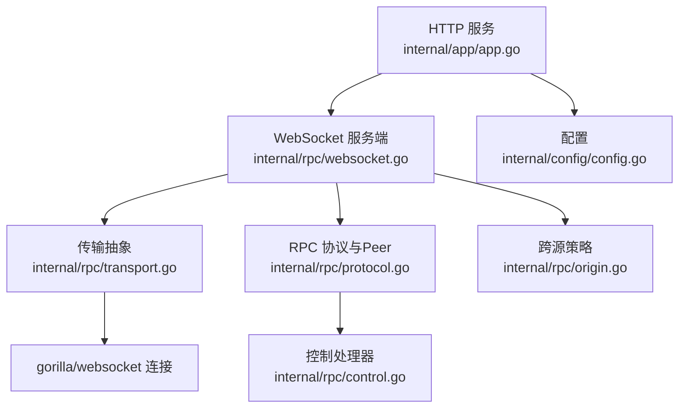
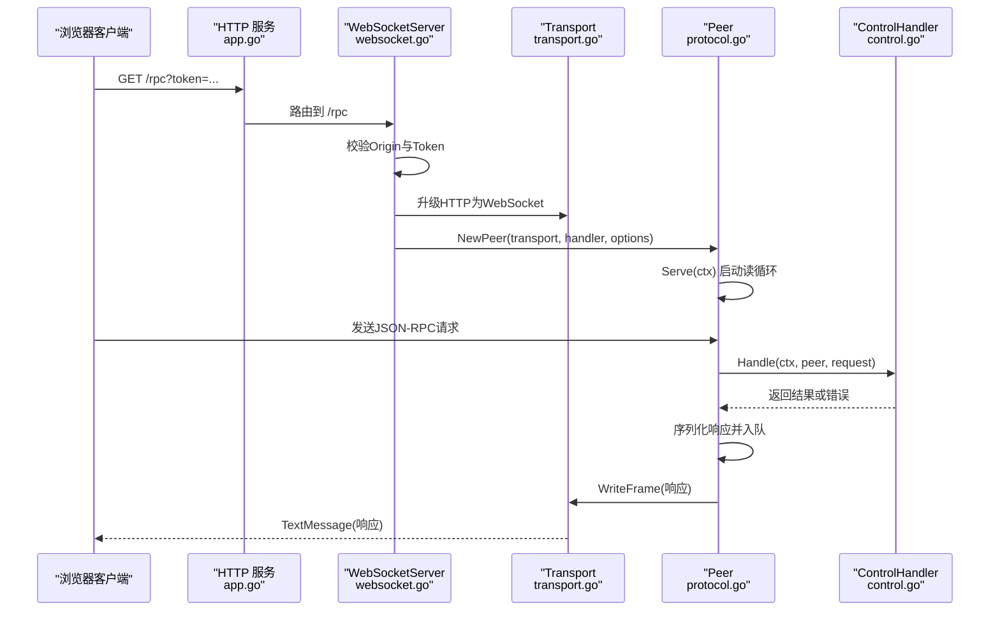
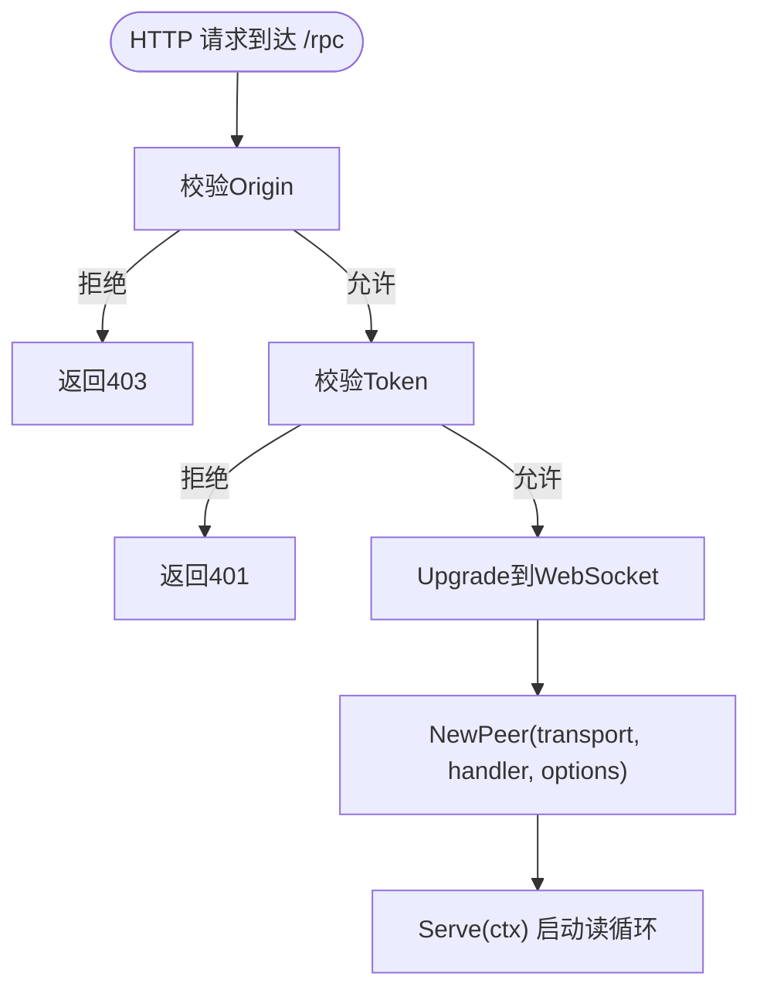
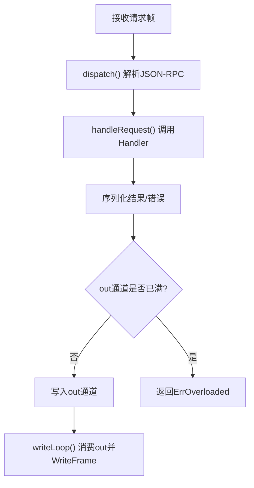
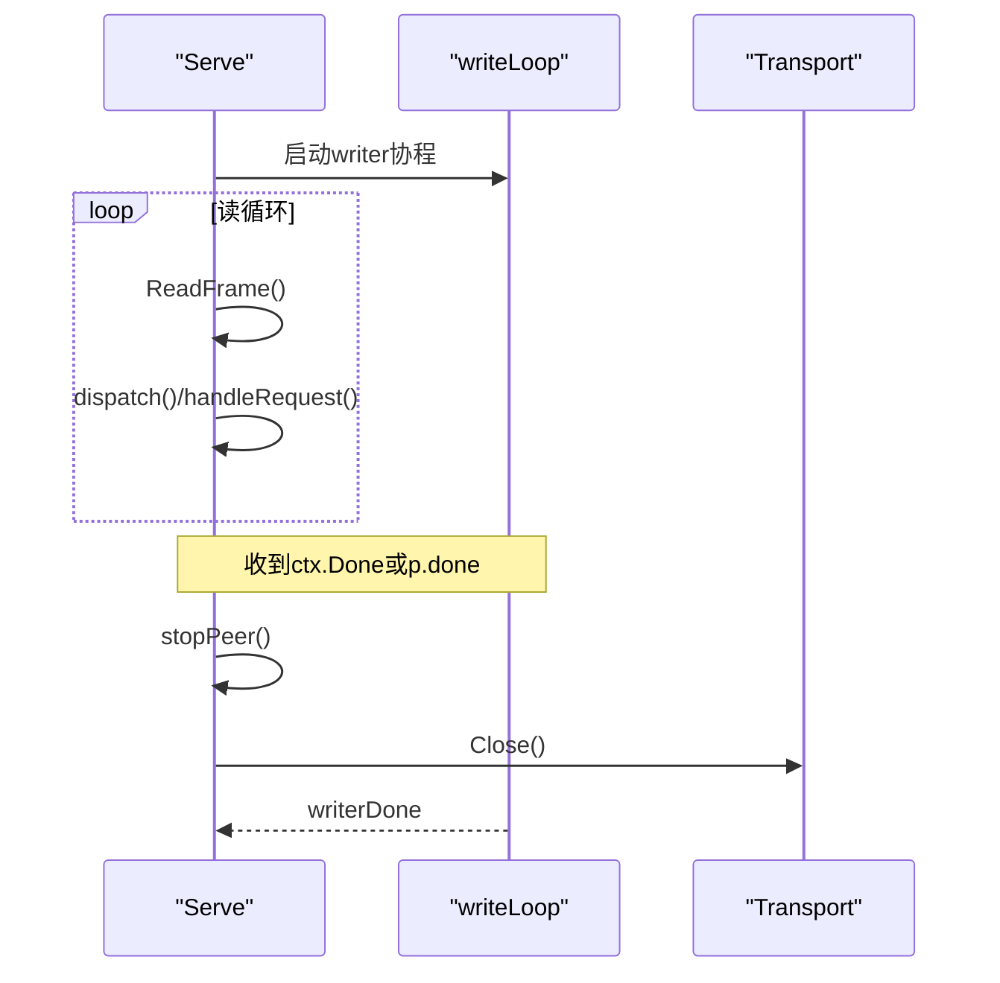
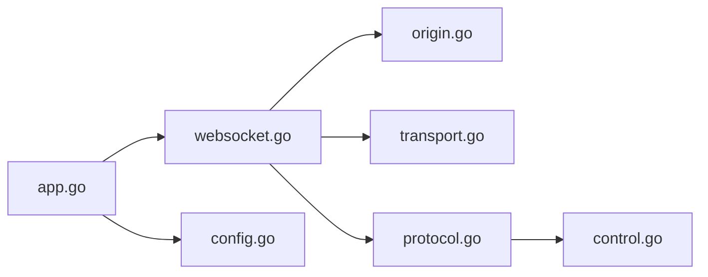

# WebSocket通信

<cite>
**本文引用的文件**
- [internal/rpc/websocket.go](file://internal/rpc/websocket.go)
- [internal/rpc/transport.go](file://internal/rpc/transport.go)
- [internal/rpc/protocol.go](file://internal/rpc/protocol.go)
- [internal/rpc/control.go](file://internal/rpc/control.go)
- [internal/rpc/origin.go](file://internal/rpc/origin.go)
- [internal/app/app.go](file://internal/app/app.go)
- [internal/config/config.go](file://internal/config/config.go)
- [internal/rpc/websocket_test.go](file://internal/rpc/websocket_test.go)
</cite>

## 目录
1. [简介](#简介)
2. [项目结构](#项目结构)
3. [核心组件](#核心组件)
4. [架构总览](#架构总览)
5. [详细组件分析](#详细组件分析)
6. [依赖关系分析](#依赖关系分析)
7. [性能与并发设计](#性能与并发设计)
8. [连接配置选项](#连接配置选项)
9. [故障排查指南](#故障排查指南)
10. [客户端连接示例](#客户端连接示例)
11. [结论](#结论)

## 简介
本文件围绕 Vivy 的本地控制平面 WebSocket 通信进行系统化说明，覆盖连接建立、握手校验、帧传输机制、背压与缓冲区管理、优雅关闭、以及配置项与排障要点。该实现将 HTTP 升级至 WebSocket，并通过 JSON-RPC 协议在浏览器与内核之间进行双向通信；同时提供跨源策略与令牌鉴权，确保本地开发场景下的安全边界。

## 项目结构
WebSocket 相关能力集中在 internal/rpc 包中，由应用层 internal/app 暴露 HTTP 路由，并通过 internal/config 提供可配置的服务器地址与允许的跨源列表。



图表来源
- [internal/app/app.go:325-341](file://internal/app/app.go#L325-L341)
- [internal/rpc/websocket.go:27-46](file://internal/rpc/websocket.go#L27-L46)
- [internal/rpc/transport.go:58-84](file://internal/rpc/transport.go#L58-L84)
- [internal/rpc/protocol.go:92-118](file://internal/rpc/protocol.go#L92-L118)
- [internal/rpc/control.go:253-353](file://internal/rpc/control.go#L253-L353)
- [internal/rpc/origin.go:13-54](file://internal/rpc/origin.go#L13-L54)
- [internal/config/config.go:61-68](file://internal/config/config.go#L61-L68)

章节来源
- [internal/app/app.go:325-341](file://internal/app/app.go#L325-L341)
- [internal/rpc/websocket.go:27-46](file://internal/rpc/websocket.go#L27-L46)
- [internal/rpc/transport.go:58-84](file://internal/rpc/transport.go#L58-L84)
- [internal/rpc/protocol.go:92-118](file://internal/rpc/protocol.go#L92-L118)
- [internal/rpc/control.go:253-353](file://internal/rpc/control.go#L253-L353)
- [internal/rpc/origin.go:13-54](file://internal/rpc/origin.go#L13-L54)
- [internal/config/config.go:61-68](file://internal/config/config.go#L61-L68)

## 核心组件
- WebSocketServer：负责 HTTP 请求到 WebSocket 的升级、跨源校验、令牌鉴权，并创建 Peer 启动读写循环。
- Transport 接口与实现：JSONLTransport（基于行分隔文本）与 WebSocketTransport（基于 gorilla/websocket），统一 ReadFrame/WriteFrame/Close。
- Peer：封装 RPC 协议处理、请求分发、响应队列、背压控制、AfterResponse 回调顺序保证、优雅关闭。
- ControlHandler：实现具体业务方法（会话、运行、事件订阅等）。
- OriginPolicy：跨源策略，支持同域与白名单跨域，并提供 CORS 头设置。
- 配置：Server.Addr 与 AllowedOrigins 控制监听地址与允许的来源。

章节来源
- [internal/rpc/websocket.go:12-55](file://internal/rpc/websocket.go#L12-L55)
- [internal/rpc/transport.go:12-84](file://internal/rpc/transport.go#L12-L84)
- [internal/rpc/protocol.go:64-118](file://internal/rpc/protocol.go#L64-L118)
- [internal/rpc/control.go:253-353](file://internal/rpc/control.go#L253-L353)
- [internal/rpc/origin.go:13-54](file://internal/rpc/origin.go#L13-L54)
- [internal/config/config.go:61-68](file://internal/config/config.go#L61-L68)

## 架构总览
下图展示了从浏览器发起 WebSocket 连接到服务端处理的完整链路，包括鉴权、协议解析、请求分发与响应序列化。



图表来源
- [internal/app/app.go:325-341](file://internal/app/app.go#L325-L341)
- [internal/rpc/websocket.go:27-46](file://internal/rpc/websocket.go#L27-L46)
- [internal/rpc/transport.go:67-84](file://internal/rpc/transport.go#L67-L84)
- [internal/rpc/protocol.go:120-179](file://internal/rpc/protocol.go#L120-L179)
- [internal/rpc/control.go:253-353](file://internal/rpc/control.go#L253-L353)

## 详细组件分析

### WebSocket 连接建立与握手
- 路由挂载：/rpc 由 WebSocketServer 处理，/rpc/bootstrap 返回协议版本与 token。
- 跨源校验：通过 OriginPolicy.Allows 检查请求来源，必要时 ApplyCORS 设置响应头。
- 令牌鉴权：支持 URL 查询参数 token 与 Authorization: Bearer <token> 两种形式。
- 升级与缓冲：使用 gorilla/websocket Upgrader 进行协议升级，默认读写缓冲各 32KB。
- 生命周期：升级成功后构造 WebSocketTransport 与 Peer，调用 Serve 进入主循环。



图表来源
- [internal/rpc/websocket.go:27-46](file://internal/rpc/websocket.go#L27-L46)
- [internal/rpc/origin.go:38-65](file://internal/rpc/origin.go#L38-L65)
- [internal/app/app.go:325-341](file://internal/app/app.go#L325-L341)

章节来源
- [internal/rpc/websocket.go:27-55](file://internal/rpc/websocket.go#L27-L55)
- [internal/rpc/origin.go:38-65](file://internal/rpc/origin.go#L38-L65)
- [internal/app/app.go:325-341](file://internal/app/app.go#L325-L341)

### 帧传输机制与协议
- 传输抽象：Transport 定义 ReadFrame/WriteFrame/Close，WebSocketTransport 以 TextMessage 收发字节帧。
- 协议格式：JSON-RPC 2.0，包含 jsonrpc、id、method、params/result/error 字段。
- 帧大小限制：Peer 在读取后校验帧长度，超过 MaxFrameBytes 则返回 InvalidRequest 并终止连接。
- 错误码：ParseError、InvalidRequest、MethodNotFound、InvalidParams、InternalError、ServerOverload。

```mermaid
classDiagram
class Transport {
+ReadFrame() []byte
+WriteFrame([]byte) error
+Close() error
}
class WebSocketTransport {
-conn *websocket.Conn
-mu sync.Mutex
+ReadFrame() []byte
+WriteFrame([]byte) error
+Close() error
}
class Peer {
-transport Transport
-handler Handler
-options Options
-out chan []byte
-done chan struct{}
-pending map[string]chan responseFrame
+Serve(ctx) error
+Call(ctx, method, params) (json.RawMessage, error)
+Notify(method, params) error
}
Transport <|.. WebSocketTransport
Peer --> Transport : "使用"
```

图表来源
- [internal/rpc/transport.go:12-84](file://internal/rpc/transport.go#L12-L84)
- [internal/rpc/protocol.go:64-118](file://internal/rpc/protocol.go#L64-L118)

章节来源
- [internal/rpc/transport.go:67-84](file://internal/rpc/transport.go#L67-L84)
- [internal/rpc/protocol.go:18-32](file://internal/rpc/protocol.go#L18-L32)
- [internal/rpc/protocol.go:150-163](file://internal/rpc/protocol.go#L150-L163)

### 并发安全与背压控制
- 读写分离：Serve 独占读循环，writeLoop 独占写通道 out，避免竞争。
- 写锁保护：WebSocketTransport.WriteFrame 使用互斥锁串行化写入。
- 背压与限流：out 通道容量来自 Options.OutgoingBuffer；enqueue/enqueueRaw 在通道满时返回 ErrOverloaded，调用方可据此退避或上报。
- 最大帧限制：MaxFrameBytes 防止过大消息导致内存压力。
- 有序回调：AfterResponse 保证“先响应、后事件”的顺序，用于订阅场景。



图表来源
- [internal/rpc/protocol.go:120-179](file://internal/rpc/protocol.go#L120-L179)
- [internal/rpc/protocol.go:257-351](file://internal/rpc/protocol.go#L257-L351)
- [internal/rpc/transport.go:78-84](file://internal/rpc/transport.go#L78-L84)

章节来源
- [internal/rpc/protocol.go:120-179](file://internal/rpc/protocol.go#L120-L179)
- [internal/rpc/protocol.go:257-351](file://internal/rpc/protocol.go#L257-L351)
- [internal/rpc/transport.go:78-84](file://internal/rpc/transport.go#L78-L84)

### 连接生命周期管理与优雅关闭
- 停止信号：stopPeer 使用 sync.Once 确保只执行一次，关闭 done 通道并关闭底层 transport。
- 挂起请求清理：stopPeer 会向 pending waiters 注入 InternalError，避免阻塞等待。
- 上下文取消：Serve 监听 ctx.Done，退出时触发 stopPeer。
- 资源释放：writeLoop 结束后 writerDone 被通知，Serve 等待其退出再返回。



图表来源
- [internal/rpc/protocol.go:120-179](file://internal/rpc/protocol.go#L120-L179)
- [internal/rpc/protocol.go:359-373](file://internal/rpc/protocol.go#L359-L373)

章节来源
- [internal/rpc/protocol.go:120-179](file://internal/rpc/protocol.go#L120-L179)
- [internal/rpc/protocol.go:359-373](file://internal/rpc/protocol.go#L359-L373)

### 心跳检测与断线重连
- 服务端侧：当前实现未内置应用层心跳；连接健康由底层 gorilla/websocket 与网络栈保障。
- 客户端侧：建议在客户端实现心跳与重试逻辑（例如周期性 Ping/Pong 或应用层心跳消息），并在失败时采用指数退避重连。
- 建议策略：
  - 心跳间隔：根据网络质量与业务容忍度配置。
  - 超时判定：连续 N 次无 ACK 视为断线。
  - 重连退避：初始延迟递增，上限封顶，避免风暴。
  - 状态恢复：重连后通过 run/subscribe 的 after_seq 游标回放事件，保证一致性。

[本节为通用实践建议，不直接映射到具体代码文件]

### 连接池管理与资源清理
- 连接模型：每个 HTTP 请求对应一个 WebSocket 连接，由 Peer 独立管理生命周期。
- 资源清理：stopPeer 统一关闭 transport 并清理 pending 等待者；writeLoop 退出后释放 goroutine。
- 进程级关闭：应用 Run 阶段按逆序关闭服务、存储，确保事件终态持久化后再释放资源。

章节来源
- [internal/rpc/protocol.go:359-373](file://internal/rpc/protocol.go#L359-L373)
- [internal/app/app.go:470-519](file://internal/app/app.go#L470-L519)

## 依赖关系分析
- WebSocketServer 依赖 OriginPolicy 与 Token 校验，使用 gorilla/websocket 进行协议升级。
- Peer 依赖 Transport 抽象，屏蔽底层差异，使 stdio 与 WebSocket 共享同一协议与背压实现。
- ControlHandler 依赖运行时、存储、事件总线等，提供业务方法。
- 配置层提供 Server.Addr 与 AllowedOrigins，影响服务监听与跨源策略。



图表来源
- [internal/app/app.go:325-341](file://internal/app/app.go#L325-L341)
- [internal/rpc/websocket.go:27-46](file://internal/rpc/websocket.go#L27-L46)
- [internal/rpc/origin.go:13-54](file://internal/rpc/origin.go#L13-L54)
- [internal/rpc/transport.go:58-84](file://internal/rpc/transport.go#L58-L84)
- [internal/rpc/protocol.go:92-118](file://internal/rpc/protocol.go#L92-L118)
- [internal/rpc/control.go:253-353](file://internal/rpc/control.go#L253-L353)
- [internal/config/config.go:61-68](file://internal/config/config.go#L61-L68)

章节来源
- [internal/rpc/protocol.go:1-5](file://internal/rpc/protocol.go#L1-L5)
- [internal/rpc/websocket.go:27-46](file://internal/rpc/websocket.go#L27-L46)
- [internal/rpc/origin.go:13-54](file://internal/rpc/origin.go#L13-L54)
- [internal/config/config.go:61-68](file://internal/config/config.go#L61-L68)

## 性能与并发设计
- 读写分离：读循环与写循环解耦，降低锁粒度，提升吞吐。
- 背压控制：OutgoingBuffer 限制出站队列，避免内存膨胀；超限时返回 ErrOverloaded，上层可据此限速或告警。
- 帧大小限制：MaxFrameBytes 防止恶意或异常大消息造成资源耗尽。
- 序列化开销：响应编码在 handleRequest 中进行，错误路径快速返回，减少不必要分配。
- 缓冲优化：WebSocket 读写缓冲默认 32KB，可根据消息规模调整。

章节来源
- [internal/rpc/protocol.go:70-83](file://internal/rpc/protocol.go#L70-L83)
- [internal/rpc/protocol.go:150-163](file://internal/rpc/protocol.go#L150-L163)
- [internal/rpc/protocol.go:257-351](file://internal/rpc/protocol.go#L257-L351)
- [internal/rpc/websocket.go:36-40](file://internal/rpc/websocket.go#L36-L40)

## 连接配置选项
- 服务器地址：Server.Addr，默认 127.0.0.1:8787。
- 允许来源：Server.AllowedOrigins，空值仅允许同源；非空时精确匹配白名单。
- 令牌：WebSocketServer.Token，支持 URL 查询参数与 Authorization 头两种方式。
- 帧大小：Options.MaxFrameBytes，默认 1MB，超出返回 InvalidRequest。
- 出站缓冲：Options.OutgoingBuffer，默认 64，控制背压阈值。
- 缓冲大小：Upgrader.ReadBufferSize/WriteBufferSize，默认 32KB。

章节来源
- [internal/config/config.go:61-68](file://internal/config/config.go#L61-L68)
- [internal/rpc/websocket.go:12-17](file://internal/rpc/websocket.go#L12-L17)
- [internal/rpc/websocket.go:36-40](file://internal/rpc/websocket.go#L36-L40)
- [internal/rpc/protocol.go:70-83](file://internal/rpc/protocol.go#L70-L83)

## 故障排查指南
- 403 禁止访问：Origin 不在白名单或未携带有效来源；检查 AllowedOrigins 与浏览器 Origin 头。
- 401 未授权：Token 缺失或不匹配；确认 URL 查询参数或 Authorization 头是否正确传递。
- 帧过大：收到 InvalidRequest 并断开；检查 MaxFrameBytes 与消息体积。
- 背压过载：频繁出现 ErrOverloaded；增大 OutgoingBuffer 或优化上游生产速率。
- 连接中断：底层网络错误或客户端主动关闭；客户端应实现心跳与重连。
- 方法不存在：MethodNotFound；核对调用方法与注册表。
- 参数无效：InvalidParams；检查请求体结构与必填字段。
- 内部错误：InternalError；查看服务端日志与堆栈定位。

章节来源
- [internal/rpc/websocket.go:27-55](file://internal/rpc/websocket.go#L27-L55)
- [internal/rpc/protocol.go:18-32](file://internal/rpc/protocol.go#L18-L32)
- [internal/rpc/protocol.go:150-163](file://internal/rpc/protocol.go#L150-L163)
- [internal/rpc/protocol.go:257-351](file://internal/rpc/protocol.go#L257-L351)

## 客户端连接示例
以下示例展示如何在浏览器中建立稳定的 WebSocket 连接，完成初始化、调用方法与处理响应。实际使用时请替换协议版本、路径与令牌。

- 获取引导信息：GET /rpc/bootstrap，读取 protocol_version 与 token。
- 建立连接：ws://host/rpc?token=xxx，设置适当的超时与重连策略。
- 初始化：发送 JSON-RPC 请求 initialize，等待响应。
- 业务调用：按需调用 session/create、turn/start、run/subscribe 等方法。
- 心跳与重连：客户端定时发送心跳（如每 30 秒），若连续 N 次无响应则触发重连；重连后通过 run/subscribe 的 after_seq 回放事件。
- 错误处理：对 ParseError、InvalidRequest、MethodNotFound、InvalidParams、InternalError、ServerOverload 分别处理。

参考测试用例中的连接与调用流程，可验证最小可用路径。

章节来源
- [internal/rpc/websocket_test.go:15-54](file://internal/rpc/websocket_test.go#L15-L54)
- [internal/rpc/websocket_test.go:56-85](file://internal/rpc/websocket_test.go#L56-L85)
- [internal/app/app.go:325-341](file://internal/app/app.go#L325-L341)

## 结论
Vivy 的 WebSocket 控制平面以简洁而稳健的方式实现了本地安全的跨源通信：通过 OriginPolicy 与 Token 双重校验保障接入安全；以 Transport 抽象与 Peer 实现统一协议与背压；通过读写分离与有界队列确保并发安全与资源可控。结合客户端的心跳与重连策略，可在不稳定网络下维持稳定连接。建议在生产环境中合理配置帧大小、缓冲与超时参数，并完善监控与告警，以提升整体可靠性。