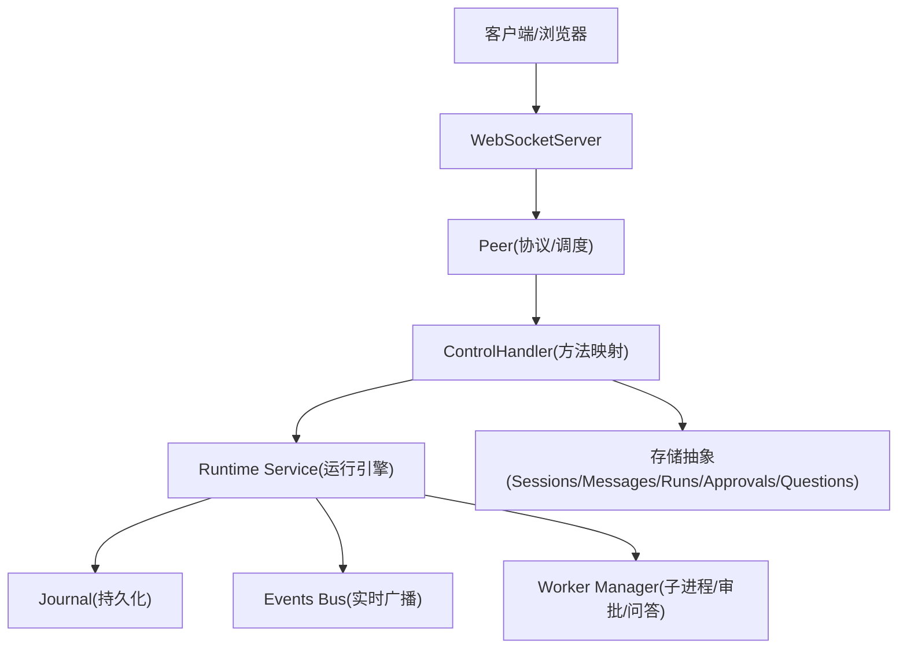
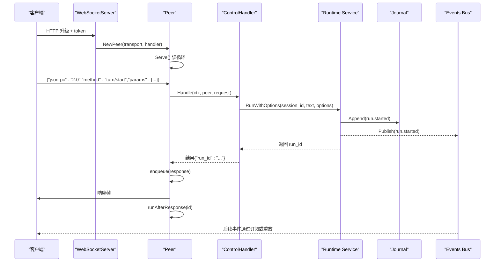
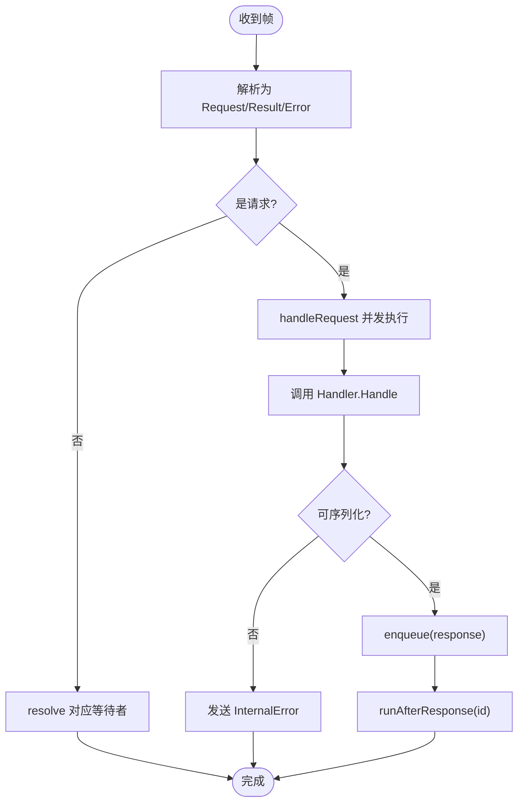
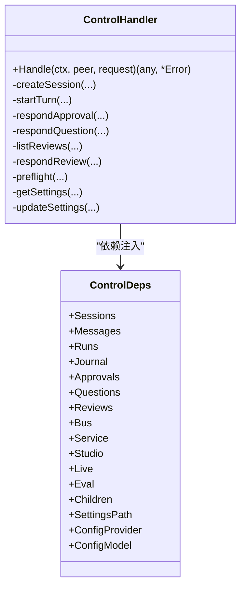
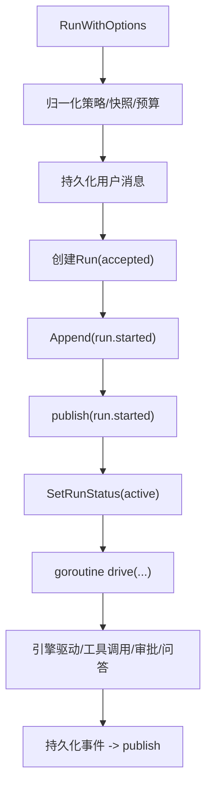
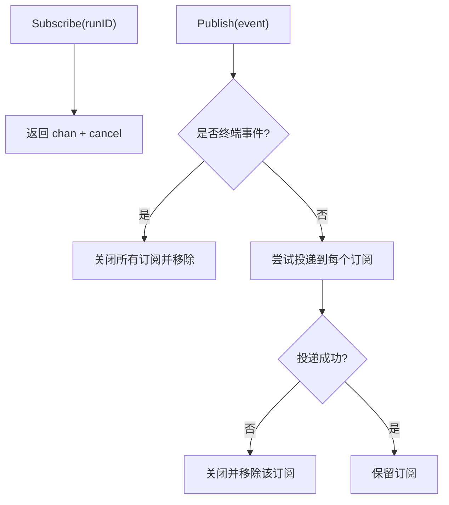
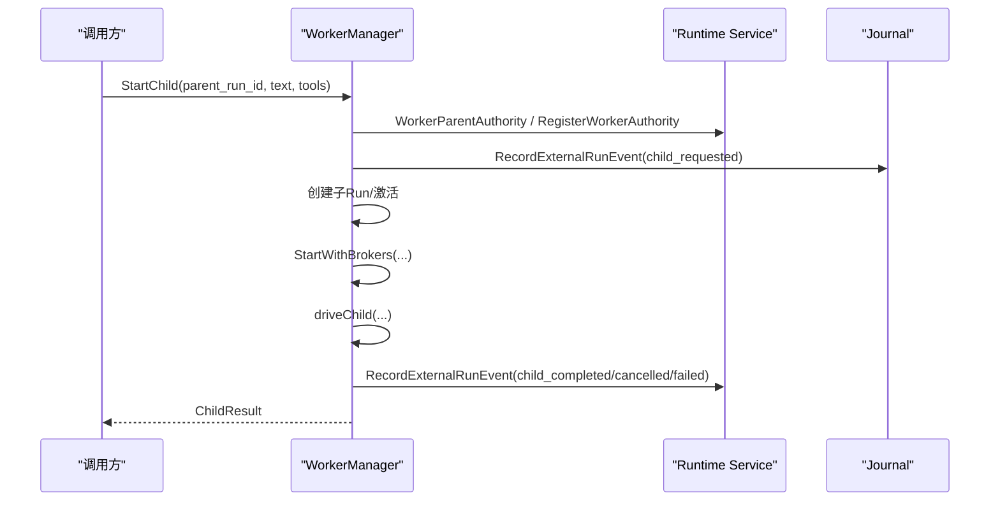
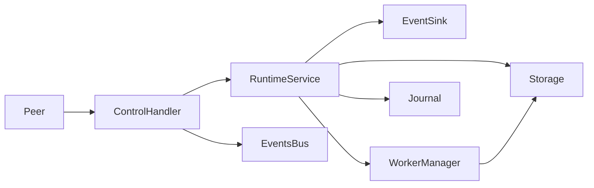

# 消息路由与处理

<cite>
**本文引用的文件**
- [protocol.go](file://internal/rpc/protocol.go)
- [control.go](file://internal/rpc/control.go)
- [transport.go](file://internal/rpc/transport.go)
- [websocket.go](file://internal/rpc/websocket.go)
- [bus.go](file://internal/events/bus.go)
- [service.go](file://internal/runtime/service.go)
- [worker.go](file://internal/app/worker.go)
</cite>

## 目录
1. [简介](#简介)
2. [项目结构](#项目结构)
3. [核心组件](#核心组件)
4. [架构总览](#架构总览)
5. [详细组件分析](#详细组件分析)
6. [依赖关系分析](#依赖关系分析)
7. [性能考量](#性能考量)
8. [故障排查指南](#故障排查指南)
9. [结论](#结论)
10. [附录：处理器开发指南与示例](#附录处理器开发指南与示例)

## 简介
本文件聚焦 Vivy 的“消息路由与处理”子系统，围绕 JSON-RPC 控制面、运行时服务、事件总线与子进程工作器展开，系统说明：
- 消息分发机制：请求帧如何被解析、路由到方法、并发执行并回写响应。
- 处理器注册表与方法映射表：集中式 switch 路由与能力声明。
- Handler 接口设计、请求上下文管理、参数校验流程。
- 异步处理模式、回调机制、AfterResponse 钩子函数。
- 优先级、负载均衡、限流控制的实现现状与建议。
- 处理器开发指南与最佳实践，含错误处理、性能优化（批量、缓存、内存）。
- 完整处理器示例路径指引，便于扩展复杂业务逻辑。

## 项目结构
Vivy 的消息路由与处理由三层组成：
- 传输层：JSONL 与 WebSocket 两种 Transport，负责帧读写与连接生命周期。
- 协议与调度层：Peer 统一解析 JSON-RPC 帧，分派到 Handler；维护 pending 请求、Outgoing 队列与 AfterResponse 钩子。
- 业务层：ControlHandler 将方法名映射到具体业务处理；Runtime Service 驱动 Run 生命周期；Events Bus 将持久化事件广播给订阅者；Worker Manager 管理子进程工作树与审批/问答恢复。

图表来源
- [websocket.go:27-47](file://internal/rpc/websocket.go#L27-L47)
- [protocol.go:120-230](file://internal/rpc/protocol.go#L120-L230)
- [control.go:253-353](file://internal/rpc/control.go#L253-L353)
- [service.go:212-300](file://internal/runtime/service.go#L212-L300)
- [bus.go:42-75](file://internal/events/bus.go#L42-L75)
- [worker.go:87-197](file://internal/app/worker.go#L87-L197)

章节来源
- [websocket.go:27-47](file://internal/rpc/websocket.go#L27-L47)
- [protocol.go:120-230](file://internal/rpc/protocol.go#L120-L230)
- [control.go:253-353](file://internal/rpc/control.go#L253-L353)
- [service.go:212-300](file://internal/runtime/service.go#L212-L300)
- [bus.go:42-75](file://internal/events/bus.go#L42-L75)
- [worker.go:87-197](file://internal/app/worker.go#L87-L197)

## 核心组件
- 传输层
  - JSONLTransport：按行读取/写入 JSON 帧，支持 flush。
  - WebSocketTransport：基于 gorilla/websocket 文本帧读写。
- 协议与调度
  - Peer：读循环 + 单写协程；请求并发处理；Outgoing 有界缓冲；AfterResponse 钩子；Call/Notify 支持。
- 方法映射与控制器
  - ControlHandler：集中 switch 路由，声明 capabilities，调用 runtime/storage。
- 运行时服务
  - Service：Run 启动、取消、恢复、预算、审批/问答挂起与恢复、事件持久化与发布。
- 事件总线
  - Bus：按 runID 广播 RunEvent，终端事件关闭订阅，慢消费者丢弃并重放。
- 子进程与工作树
  - WorkerManager：创建/等待/取消子 Run，工具调用审批/策略评估，记录事件。

章节来源
- [transport.go:12-85](file://internal/rpc/transport.go#L12-L85)
- [protocol.go:54-118](file://internal/rpc/protocol.go#L54-L118)
- [control.go:253-353](file://internal/rpc/control.go#L253-L353)
- [service.go:96-169](file://internal/runtime/service.go#L96-L169)
- [bus.go:10-40](file://internal/events/bus.go#L10-L40)
- [worker.go:28-85](file://internal/app/worker.go#L28-L85)

## 架构总览
下图展示一次“开始对话”的请求从接入到落库、再到实时推送的全链路：

图表来源
- [websocket.go:27-47](file://internal/rpc/websocket.go#L27-L47)
- [protocol.go:120-230](file://internal/rpc/protocol.go#L120-L230)
- [control.go:618-633](file://internal/rpc/control.go#L618-L633)
- [service.go:212-300](file://internal/runtime/service.go#L212-L300)
- [bus.go:42-75](file://internal/events/bus.go#L42-L75)

## 详细组件分析

### 协议与调度：Peer
- 职责
  - 读循环：接收帧，校验大小，解析 JSON-RPC，分发到 handleRequest。
  - 写循环：单协程串行写出，避免竞争。
  - 请求处理：调用 Handler.Handle，序列化结果，入队响应，执行 AfterResponse 钩子。
  - 双向通信：Call/Notify 支持在处理器内发起新请求或通知。
- 关键特性
  - OutgoingBuffer 默认 64，满时返回 ErrOverloaded，体现背压。
  - MaxFrameBytes 默认 1MB，超限直接拒绝。
  - AfterResponse：保证“响应先于事件”的顺序性，适合订阅场景。
  - Pending 请求映射：Call 的 ID -> waiter 通道，超时/关闭清理。

图表来源
- [protocol.go:181-230](file://internal/rpc/protocol.go#L181-L230)
- [protocol.go:257-287](file://internal/rpc/protocol.go#L257-L287)
- [protocol.go:289-351](file://internal/rpc/protocol.go#L289-L351)

章节来源
- [protocol.go:18-32](file://internal/rpc/protocol.go#L18-L32)
- [protocol.go:70-118](file://internal/rpc/protocol.go#L70-L118)
- [protocol.go:120-230](file://internal/rpc/protocol.go#L120-L230)
- [protocol.go:257-287](file://internal/rpc/protocol.go#L257-L287)
- [protocol.go:289-351](file://internal/rpc/protocol.go#L289-L351)

### 方法映射与控制器：ControlHandler
- 职责
  - 声明 capabilities（session/turn/run/preflight/approval/question/review/background/child/evals/promotions/species/settings）。
  - 将 method 字符串映射到具体处理函数，进行参数解码与校验。
  - 调用 Runtime Service、存储、Studio、Eval 等依赖。
- 典型流程
  - turn/start：参数校验 -> Service.RunWithOptions -> 持久化 run.started -> 返回 run_id。
  - approval/respond、question/respond：参数校验 -> Service.Decide/Answer -> 返回确认。
  - review/list/get/respond：条件查询/更新，空 store 返回 MethodNotFound。
- 错误处理
  - 参数缺失/非法 -> InvalidParams。
  - 资源不存在 -> CodeNotFound。
  - 内部错误 -> internalError。

图表来源
- [control.go:27-50](file://internal/rpc/control.go#L27-L50)
- [control.go:253-353](file://internal/rpc/control.go#L253-L353)

章节来源
- [control.go:253-353](file://internal/rpc/control.go#L253-L353)
- [control.go:618-633](file://internal/rpc/control.go#L618-L633)
- [control.go:685-723](file://internal/rpc/control.go#L685-L723)
- [control.go:725-800](file://internal/rpc/control.go#L725-L800)

### 运行时服务：Service
- 职责
  - 编排 Run 生命周期：用户消息 -> run 行 -> journal.run.started -> 激活 run -> 异步驱动引擎。
  - 取消/恢复：Cancel/CancelAll 安全终止；Recover 重启后重建 pending 状态。
  - 审批/问答：挂起 run 等待外部决策，支持过期回收与恢复。
  - 事件：先持久化再发布，确保“可见性不超前于持久化”。
- 关键流程
  - RunWithOptions：参数归一化 -> 预算预留 -> 分配工作空间 -> 持久化消息/Run -> 写入 run.started -> 发布 -> 启动驱动协程。
  - Cancel：对 active 取消上下文；对 pending 取消审批/问答并结束。
  - RecoverBackground：拒绝 busy 状态；遍历 active runs 分类处理。

图表来源
- [service.go:212-300](file://internal/runtime/service.go#L212-L300)
- [service.go:302-387](file://internal/runtime/service.go#L302-L387)
- [service.go:465-576](file://internal/runtime/service.go#L465-L576)

章节来源
- [service.go:96-169](file://internal/runtime/service.go#L96-L169)
- [service.go:212-300](file://internal/runtime/service.go#L212-L300)
- [service.go:302-387](file://internal/runtime/service.go#L302-L387)
- [service.go:465-576](file://internal/runtime/service.go#L465-L576)

### 事件总线：Bus
- 职责
  - 按 runID 广播 RunEvent，终端事件关闭订阅。
  - 慢消费者丢弃并关闭通道，后续通过 RPC 重放历史。
- 行为
  - Subscribe：创建带缓冲 channel 的订阅。
  - Publish：无订阅则跳过；终端事件关闭所有订阅并移除；非终端事件尝试投递，失败则丢弃并记录告警。

图表来源
- [bus.go:42-75](file://internal/events/bus.go#L42-L75)
- [bus.go:77-106](file://internal/events/bus.go#L77-L106)

章节来源
- [bus.go:10-40](file://internal/events/bus.go#L10-L40)
- [bus.go:42-75](file://internal/events/bus.go#L42-L75)
- [bus.go:77-106](file://internal/events/bus.go#L77-L106)

### 子进程与工作树：WorkerManager
- 职责
  - 创建/查询/等待/取消子 Run，限制深度与并发。
  - 工具调用审批/策略评估，记录事件，恢复审批/问答。
- 关键点
  - 父子权限继承：父级快照与预算账本传递给子级，禁止越权。
  - 工具执行：参数校验、安全校验、策略评估、审批/拒绝/执行、事件记录。
  - 生命周期：finishChild 幂等收尾，释放父级计数，注销权限。

图表来源
- [worker.go:87-197](file://internal/app/worker.go#L87-L197)
- [worker.go:199-245](file://internal/app/worker.go#L199-L245)
- [worker.go:457-538](file://internal/app/worker.go#L457-L538)

章节来源
- [worker.go:87-197](file://internal/app/worker.go#L87-L197)
- [worker.go:199-245](file://internal/app/worker.go#L199-L245)
- [worker.go:457-538](file://internal/app/worker.go#L457-L538)

## 依赖关系分析
- 耦合与内聚
  - Peer 与 Transport 解耦，便于替换底层 IO。
  - ControlHandler 仅依赖抽象接口（storage、runtime、events），高内聚低耦合。
  - Service 通过 EventSink 接口屏蔽 events 包，避免循环依赖。
- 外部依赖
  - gorilla/websocket 用于 WebSocket 传输。
  - cloudwego/eino 仅在 runtime 与 provider 中允许使用（遵循架构红线）。
- 潜在环与风险
  - Service 与 workerManager 通过 ChildApprovalRouter 松耦合，避免循环引用。
  - 事件总线只负责 fan-out，历史由 Journal 提供，避免状态不一致。

图表来源
- [protocol.go:54-118](file://internal/rpc/protocol.go#L54-L118)
- [control.go:27-50](file://internal/rpc/control.go#L27-L50)
- [service.go:29-40](file://internal/runtime/service.go#L29-L40)
- [worker.go:28-85](file://internal/app/worker.go#L28-L85)

章节来源
- [protocol.go:54-118](file://internal/rpc/protocol.go#L54-L118)
- [control.go:27-50](file://internal/rpc/control.go#L27-L50)
- [service.go:29-40](file://internal/runtime/service.go#L29-L40)
- [worker.go:28-85](file://internal/app/worker.go#L28-L85)

## 性能考量
- 背压与限流
  - Peer.OutgoingBuffer 默认 64，超出返回 ErrOverloaded，防止写放大。
  - 建议：根据 QPS 与消息体积调优 OutgoingBuffer；对慢客户端断开或降级。
- 批量处理
  - 当前以单条事件持久化为主；可在批处理点聚合事件（如模型增量）以减少 I/O。
  - 注意：必须保持“先持久化再发布”的约束，且终端事件唯一性（D-008）。
- 缓存策略
  - 对频繁查询（如 session/messages）可引入本地缓存，但需考虑一致性窗口。
  - 事件重放走 Journal，避免缓存陈旧。
- 内存管理
  - 大帧保护：MaxFrameBytes 默认 1MB，防止 OOM。
  - 事件 payload 限制：engine.cfg.MaxEventPayloadBytes 控制事件体大小。
  - 预算与配额：BudgetLedger 限制事件与工具调用，防止滥用。
- 优先级与负载均衡
  - 当前未实现显式优先级队列；可通过多 Peer/多连接并行处理不同会话。
  - 建议：按 run/session 维度做软隔离，避免热点会话阻塞其他任务。

[本节为通用指导，无需特定文件来源]

## 故障排查指南
- 常见错误码
  - ParseError(-32700)：JSON 解析失败。
  - InvalidRequest(-32600)：非 JSON-RPC 2.0 或缺 method。
  - MethodNotFound(-32601)：未注册方法。
  - InvalidParams(-32602)：参数缺失/非法。
  - InternalError(-32603)：服务端内部错误。
  - ServerOverload(-32001)：出站队列已满。
- 定位步骤
  - 检查帧大小是否超过 MaxFrameBytes。
  - 检查 OutgoingBuffer 是否频繁触发 ErrOverloaded。
  - 查看 ControlHandler 的参数校验分支，确认字段必填。
  - 关注 Bus 的慢消费者告警，必要时重连并 replay from seq。
  - 对子进程：检查 child depth/concurrency 限制与审批/问答超时。
- 恢复与重放
  - 使用 run/log 或 run/subscribe 配合 after_seq 重放历史。
  - 重启后通过 Recover/RecoverBackground 恢复挂起状态。

章节来源
- [protocol.go:20-32](file://internal/rpc/protocol.go#L20-L32)
- [protocol.go:158-163](file://internal/rpc/protocol.go#L158-L163)
- [protocol.go:257-287](file://internal/rpc/protocol.go#L257-L287)
- [control.go:661-671](file://internal/rpc/control.go#L661-L671)
- [bus.go:62-75](file://internal/events/bus.go#L62-L75)
- [service.go:465-576](file://internal/runtime/service.go#L465-L576)

## 结论
Vivy 的消息路由与处理采用“传输-协议-控制器-运行时-事件总线”的分层设计，具备：
- 清晰的 JSON-RPC 方法与能力声明，易于扩展。
- 强一致的事件持久化与可见性顺序保障。
- 健壮的背压与错误码体系，便于客户端重试与降级。
- 完善的子进程工作树与审批/问答恢复机制。
建议在现有基础上按需引入批量、缓存与优先级策略，并结合监控指标持续优化吞吐与延迟。

[本节为总结，无需特定文件来源]

## 附录：处理器开发指南与示例

### 处理器接口与上下文
- Handler 接口：Handle(ctx, peer, request) 返回结果或错误。
- Peer 提供：
  - Call(method, params)：同步调用远端方法。
  - Notify(method, params)：单向通知。
  - AfterResponse(id, fn)：在响应进入队列后执行回调，保证顺序。
- 上下文：ctx 来自上层，应支持取消与超时；不要泄露到持久化之外。

章节来源
- [protocol.go:54-62](file://internal/rpc/protocol.go#L54-L62)
- [protocol.go:289-351](file://internal/rpc/protocol.go#L289-L351)
- [protocol.go:232-251](file://internal/rpc/protocol.go#L232-L251)

### 方法映射与注册
- 新增方法：在 ControlHandler.Handle 的 switch 中添加 case，并在 capabilities 中声明。
- 参数校验：使用 decodeParams 解析结构体，校验必填字段，返回 InvalidParams。
- 错误映射：业务错误 -> internalError；未找到 -> CodeNotFound。

章节来源
- [control.go:253-353](file://internal/rpc/control.go#L253-L353)

### 请求上下文与参数验证
- 上下文：传递 ctx 到存储与运行时，确保取消传播。
- 参数验证：
  - 必填字段校验（如 session_id、text、run_id）。
  - 类型与范围校验（如 mode/profile）。
  - 安全校验（如工具参数白名单、长度限制）。

章节来源
- [control.go:618-633](file://internal/rpc/control.go#L618-L633)
- [control.go:685-723](file://internal/rpc/control.go#L685-L723)

### 异步处理与回调
- 异步：Service.RunWithOptions 立即返回 run_id，实际工作在独立 goroutine。
- 回调：AfterResponse 用于订阅/事件顺序保证；也可在处理器内用 Call/Notify 发起后续交互。

章节来源
- [service.go:212-300](file://internal/runtime/service.go#L212-L300)
- [protocol.go:232-251](file://internal/rpc/protocol.go#L232-L251)

### 错误处理最佳实践
- 明确错误码：区分客户端错误与服务端错误。
- 幂等性：对重复提交做去重或条件更新。
- 可恢复：对网络/IO 错误提供重试与降级策略。
- 审计：关键操作记录事件与日志（脱敏密钥）。

章节来源
- [protocol.go:20-32](file://internal/rpc/protocol.go#L20-L32)
- [control.go:685-723](file://internal/rpc/control.go#L685-L723)

### 性能优化建议
- 批量：合并小事件为批次写入 Journal，减少锁竞争与 I/O。
- 缓存：对只读数据加短 TTL 缓存，命中后再落盘。
- 内存：限制事件 payload 大小，避免大对象常驻内存。
- 背压：合理设置 OutgoingBuffer，监控 ErrOverloaded 频率。

[本节为通用指导，无需特定文件来源]

### 完整处理器示例（路径指引）
- 新建方法：在 control.go 的 switch 中添加 case，实现参数解析与业务调用。
- 调用运行时：通过 deps.Service 启动 Run、审批/问答、恢复等。
- 事件与订阅：结合 Bus 与 RPC 订阅，实现实时反馈。
- 子进程协作：通过 ChildController 启动/等待/取消子 Run。

章节来源
- [control.go:253-353](file://internal/rpc/control.go#L253-L353)
- [control.go:618-633](file://internal/rpc/control.go#L618-L633)
- [worker.go:87-197](file://internal/app/worker.go#L87-L197)