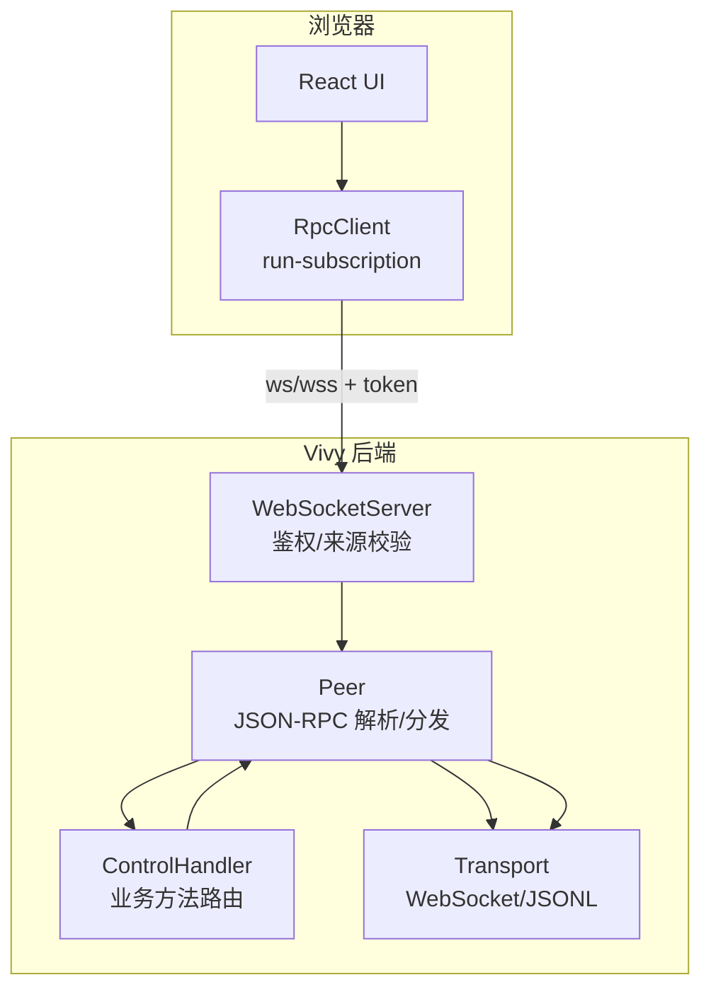
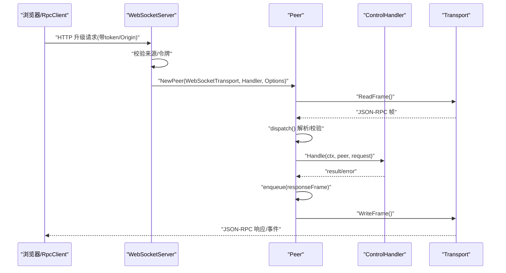
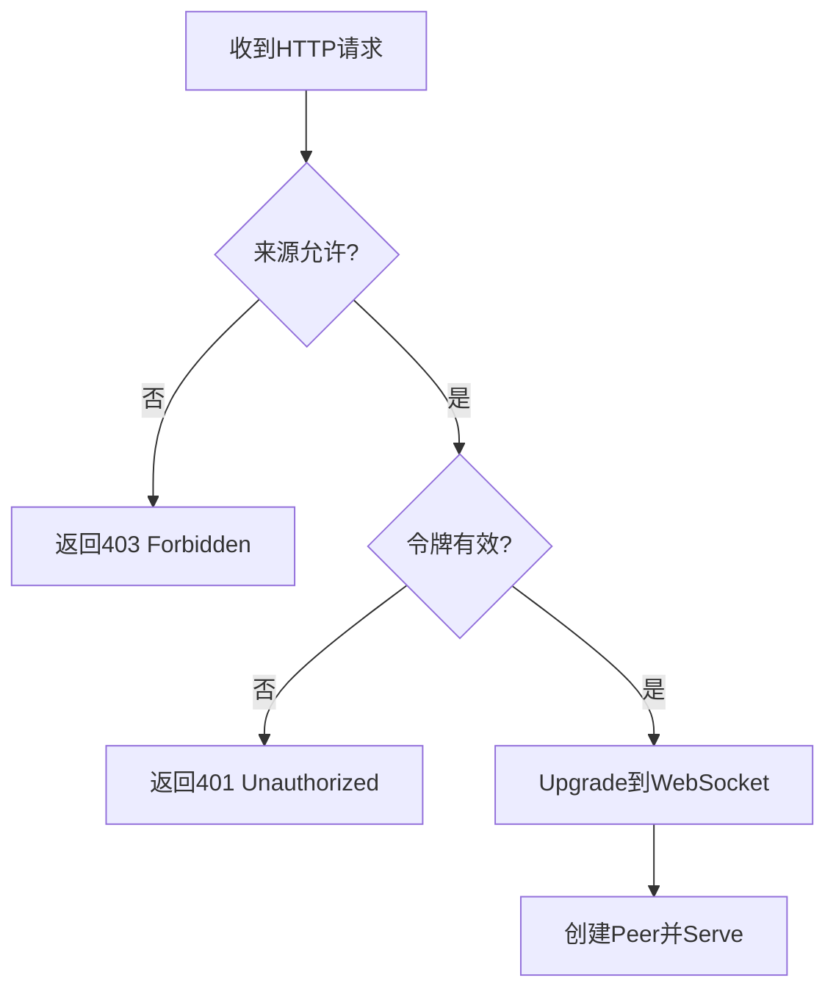
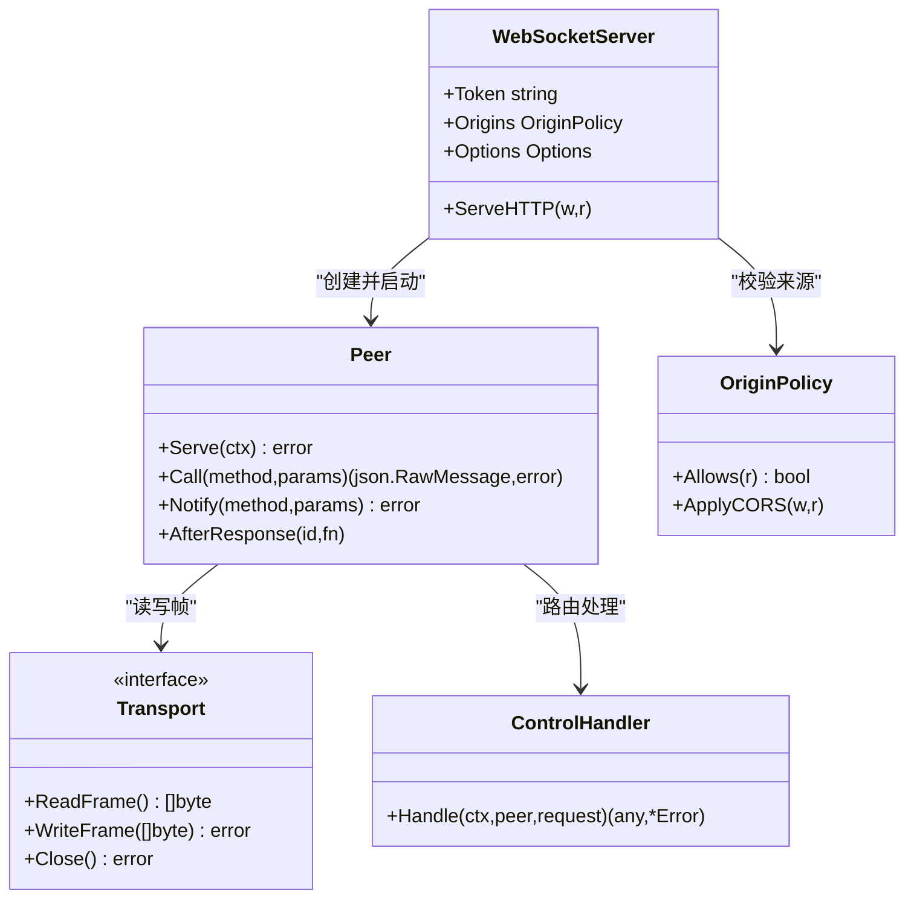

# WebSocket实时通信

<cite>
**本文引用的文件**
- [internal/rpc/websocket.go](file://internal/rpc/websocket.go)
- [internal/rpc/protocol.go](file://internal/rpc/protocol.go)
- [internal/rpc/transport.go](file://internal/rpc/transport.go)
- [internal/rpc/control.go](file://internal/rpc/control.go)
- [internal/rpc/origin.go](file://internal/rpc/origin.go)
- [ui/src/lib/rpc.ts](file://ui/src/lib/rpc.ts)
- [ui/src/lib/run-subscription.ts](file://ui/src/lib/run-subscription.ts)
- [internal/config/config.go](file://internal/config/config.go)
</cite>

## 目录
1. [简介](#简介)
2. [项目结构](#项目结构)
3. [核心组件](#核心组件)
4. [架构总览](#架构总览)
5. [详细组件分析](#详细组件分析)
6. [依赖关系分析](#依赖关系分析)
7. [性能考量](#性能考量)
8. [故障排查指南](#故障排查指南)
9. [结论](#结论)
10. [附录](#附录)

## 简介
本文件围绕 Vivy 的 WebSocket 实时通信实现，系统性说明连接建立、握手与鉴权、消息协议（JSON-RPC）、路由与处理、错误处理、订阅与事件回放、断线重连、队列与背压、安全策略（来源校验、令牌认证、输入输出边界），以及前端客户端集成与性能优化建议。内容严格基于仓库内源码与测试用例进行提炼，便于不同技术背景的读者理解与落地。

## 项目结构
WebSocket 实时通信由后端 RPC 层与前端 UI 客户端共同构成：
- 后端
  - WebSocket 服务入口与鉴权：internal/rpc/websocket.go
  - JSON-RPC 协议、Peer 调度、出站队列与背压：internal/rpc/protocol.go
  - 传输抽象（JSONL、WebSocket）：internal/rpc/transport.go
  - 控制面方法（会话、运行、审批、问题、审查、子进程等）：internal/rpc/control.go
  - 来源策略与 CORS：internal/rpc/origin.go
  - 配置边界（服务器地址、允许的来源等）：internal/config/config.go
- 前端
  - RPC 客户端封装、能力协商、通知监听、关闭回调：ui/src/lib/rpc.ts
  - 运行事件订阅与断线重连、游标续传：ui/src/lib/run-subscription.ts

图表来源
- [internal/rpc/websocket.go:27-46](file://internal/rpc/websocket.go#L27-L46)
- [internal/rpc/protocol.go:120-164](file://internal/rpc/protocol.go#L120-L164)
- [internal/rpc/transport.go:58-85](file://internal/rpc/transport.go#L58-L85)
- [internal/rpc/control.go:253-353](file://internal/rpc/control.go#L253-L353)
- [ui/src/lib/rpc.ts:55-99](file://ui/src/lib/rpc.ts#L55-L99)

章节来源
- [internal/rpc/websocket.go:12-55](file://internal/rpc/websocket.go#L12-L55)
- [internal/rpc/protocol.go:18-374](file://internal/rpc/protocol.go#L18-L374)
- [internal/rpc/transport.go:12-85](file://internal/rpc/transport.go#L12-L85)
- [internal/rpc/control.go:27-353](file://internal/rpc/control.go#L27-L353)
- [internal/rpc/origin.go:13-65](file://internal/rpc/origin.go#L13-L65)
- [ui/src/lib/rpc.ts:3-155](file://ui/src/lib/rpc.ts#L3-L155)
- [ui/src/lib/run-subscription.ts:1-71](file://ui/src/lib/run-subscription.ts#L1-L71)
- [internal/config/config.go:52-68](file://internal/config/config.go#L52-L68)

## 核心组件
- WebSocketServer：负责 HTTP 升级、来源校验、令牌认证、创建 Peer 并启动读写循环。
- Peer：JSON-RPC 帧的读取、解析、分发；请求并发处理；响应序列化与出站队列；错误码映射；AfterResponse 回调保证“先响应后事件”的顺序。
- Transport：统一 ReadFrame/WriteFrame/Close 接口，支持 JSONL（用于测试/管道）与 WebSocket（文本帧）。
- ControlHandler：集中注册所有 RPC 方法（session、turn、run、approval、question、review、child、evals、settings 等），将请求委派给运行时、存储、事件总线等子系统。
- OriginPolicy：校验浏览器来源，支持同域与白名单来源，提供最小化 CORS 头设置。
- RpcClient（前端）：通过 /rpc/bootstrap 获取 websocket_path 与 token，建立 ws/wss 连接，调用 initialize 协商能力，封装 call/onNotification/onClose/close。
- run-subscription（前端）：订阅 run/event 流，维护 after_seq 游标，处理 run/stream_error 与连接断开后的自动重连。

章节来源
- [internal/rpc/websocket.go:12-55](file://internal/rpc/websocket.go#L12-L55)
- [internal/rpc/protocol.go:64-118](file://internal/rpc/protocol.go#L64-L118)
- [internal/rpc/transport.go:12-85](file://internal/rpc/transport.go#L12-L85)
- [internal/rpc/control.go:27-353](file://internal/rpc/control.go#L27-L353)
- [internal/rpc/origin.go:13-65](file://internal/rpc/origin.go#L13-L65)
- [ui/src/lib/rpc.ts:3-155](file://ui/src/lib/rpc.ts#L3-L155)
- [ui/src/lib/run-subscription.ts:1-71](file://ui/src/lib/run-subscription.ts#L1-L71)

## 架构总览
后端以 Peer 为中心，将传输层与协议层解耦：
- 入站：Serve 循环读取帧 -> dispatch 解析为 Request -> 按 method 路由到 ControlHandler -> 返回结果或错误。
- 出站：writeLoop 从有界通道 out 串行写出，避免写竞争；enqueue/Notify 失败时返回 ErrOverloaded 表示背压。
- 顺序性：AfterResponse 确保在响应进入出站队列后再执行后续事件推送，保障“先响应后事件”。

图表来源
- [internal/rpc/websocket.go:27-46](file://internal/rpc/websocket.go#L27-L46)
- [internal/rpc/protocol.go:120-164](file://internal/rpc/protocol.go#L120-L164)
- [internal/rpc/protocol.go:181-230](file://internal/rpc/protocol.go#L181-L230)
- [internal/rpc/transport.go:67-82](file://internal/rpc/transport.go#L67-L82)
- [internal/rpc/control.go:253-353](file://internal/rpc/control.go#L253-L353)

## 详细组件分析

### WebSocket 连接建立与握手
- 来源校验：WebSocketServer 使用 OriginPolicy.Allows 检查 Origin，未携带 Origin 的请求保留给本地 CLI/测试。
- 令牌认证：支持 URL 查询参数 token 与 Authorization: Bearer <token> 两种形式，空 Token 时拒绝。
- 升级与选项：使用 gorilla/websocket Upgrader，设置读写缓冲；CheckOrigin 在已做来源策略的前提下放行。
- 会话生命周期：成功升级后创建 Peer 并启动 Serve，上下文取消或连接关闭时清理资源。

图表来源
- [internal/rpc/websocket.go:27-46](file://internal/rpc/websocket.go#L27-L46)
- [internal/rpc/websocket.go:49-55](file://internal/rpc/websocket.go#L49-L55)
- [internal/rpc/origin.go:38-65](file://internal/rpc/origin.go#L38-L65)

章节来源
- [internal/rpc/websocket.go:27-55](file://internal/rpc/websocket.go#L27-L55)
- [internal/rpc/origin.go:38-65](file://internal/rpc/origin.go#L38-L65)

### JSON-RPC 协议与消息格式
- 版本与常量：ProtocolVersion = "vivy.rpc.v1"；标准 JSON-RPC 2.0 字段 jsonrpc/method/id/params/result/error。
- 错误码：ParseError(-32700)、InvalidRequest(-32600)、MethodNotFound(-32601)、InvalidParams(-32602)、InternalError(-32603)、ServerOverload(-32001)。
- 帧大小限制：MaxFrameBytes 默认 1MB，超限返回 InvalidRequest。
- 出站队列：OutgoingBuffer 默认 64，满时 enqueue/Notify 返回 ErrOverloaded，调用方应据此退避重试。
- 顺序保证：AfterResponse(id, fn) 在响应进入出站队列后执行回调，确保订阅事件晚于对应请求响应。

章节来源
- [internal/rpc/protocol.go:18-32](file://internal/rpc/protocol.go#L18-L32)
- [internal/rpc/protocol.go:70-83](file://internal/rpc/protocol.go#L70-L83)
- [internal/rpc/protocol.go:158-163](file://internal/rpc/protocol.go#L158-L163)
- [internal/rpc/protocol.go:232-251](file://internal/rpc/protocol.go#L232-L251)
- [internal/rpc/protocol.go:257-273](file://internal/rpc/protocol.go#L257-L273)

### 消息路由与处理
- 路由表：ControlHandler.Handle 根据 method 分派到具体处理器（session、turn、run、approval、question、review、child、evals、settings 等）。
- 参数校验：各 handler 内部对必要字段进行校验，缺失返回 InvalidParams。
- 错误映射：存储不存在返回 CodeNotFound；运行时错误映射为 runtimeError/internalError。
- 能力协商：initialize/capabilities 返回支持的协议版本与方法列表，供客户端适配。

章节来源
- [internal/rpc/control.go:253-353](file://internal/rpc/control.go#L253-L353)

### 订阅机制与事件回放
- 订阅：run/subscribe 接收 run_id 与 after_seq，返回 subscription_id。
- 事件推送：服务端通过 Notify("run/event", {subscription_id, event}) 推送事件，客户端需过滤非当前订阅或旧游标事件。
- 错误流：run/stream_error 通知订阅失败原因，客户端应主动 unsubscribe 并重试。
- 终止条件：当事件类型为 run.completed/run.failed/run.cancelled 时，客户端可关闭订阅。

章节来源
- [ui/src/lib/run-subscription.ts:8-71](file://ui/src/lib/run-subscription.ts#L8-L71)

### 心跳、断线重连与消息队列管理
- 心跳：代码中未内置显式心跳帧；可通过上层应用层定时发送轻量 notify 或 ping/pong 扩展。
- 断线重连：前端 run-subscription 在 onclose 或 run/stream_error 时延迟 1s 重连，并使用 lastSeq 恢复游标继续回放。
- 队列管理：后端出站队列有界，溢出时返回 ErrOverloaded；客户端应捕获并退避重试，避免雪崩。

章节来源
- [internal/rpc/protocol.go:257-273](file://internal/rpc/protocol.go#L257-L273)
- [ui/src/lib/run-subscription.ts:18-69](file://ui/src/lib/run-subscription.ts#L18-L69)

### 安全性考虑
- 来源校验：OriginPolicy 仅允许同域或配置的 loopback 来源，防止跨站滥用。
- 令牌认证：WebSocket 升级前校验 token，支持 query 与 Bearer 两种方式。
- 输入验证：JSON-RPC 帧长度限制、method/params 必填校验、类型转换错误返回 InvalidParams。
- 输出过滤：配置层遵循密钥不持久化原则，敏感信息不在日志/快照/事件中明文出现。

章节来源
- [internal/rpc/origin.go:13-65](file://internal/rpc/origin.go#L13-L65)
- [internal/rpc/websocket.go:27-55](file://internal/rpc/websocket.go#L27-L55)
- [internal/rpc/protocol.go:158-163](file://internal/rpc/protocol.go#L158-L163)
- [internal/config/config.go:1-13](file://internal/config/config.go#L1-L13)

### 客户端集成指南（前端）
- 连接建立：通过 /rpc/bootstrap 获取 websocket_path 与 token，构造 ws/wss URL，建立连接。
- 能力协商：调用 initialize 获取 protocol_version 与 capabilities，用于功能探测。
- 消息收发：call(method, params) 发送请求并等待响应；onNotification(method, listener) 订阅事件；onClose(listener) 监听连接关闭。
- 错误重试：捕获网络错误与 RPC 错误，结合 run-subscription 的重连逻辑，基于 after_seq 恢复事件流。
- 最佳实践：
  - 单例连接：getRpcClient 返回 Promise<RpcClient>，避免重复建链。
  - 超时与取消：为长耗时操作设置 context/超时，避免悬挂请求。
  - 降级策略：当连续重连失败时提示用户并引导刷新页面。

章节来源
- [ui/src/lib/rpc.ts:55-99](file://ui/src/lib/rpc.ts#L55-L99)
- [ui/src/lib/rpc.ts:101-140](file://ui/src/lib/rpc.ts#L101-L140)
- [ui/src/lib/run-subscription.ts:8-71](file://ui/src/lib/run-subscription.ts#L8-L71)

## 依赖关系分析
- WebSocketServer 依赖 OriginPolicy 与 Token 进行访问控制，并通过 NewPeer 组合 Transport 与 Handler。
- Peer 依赖 Transport 抽象，屏蔽底层差异；依赖 Handler 完成业务路由。
- ControlHandler 依赖运行时、存储、事件总线等子系统，形成清晰的分层。
- 前端 RpcClient 依赖 bootstrap 接口与 WebSocket API，封装了能力协商与通知机制。

图表来源
- [internal/rpc/websocket.go:12-46](file://internal/rpc/websocket.go#L12-L46)
- [internal/rpc/protocol.go:92-118](file://internal/rpc/protocol.go#L92-L118)
- [internal/rpc/transport.go:12-85](file://internal/rpc/transport.go#L12-L85)
- [internal/rpc/control.go:27-89](file://internal/rpc/control.go#L27-L89)
- [internal/rpc/origin.go:13-65](file://internal/rpc/origin.go#L13-L65)

章节来源
- [internal/rpc/websocket.go:12-46](file://internal/rpc/websocket.go#L12-L46)
- [internal/rpc/protocol.go:92-118](file://internal/rpc/protocol.go#L92-L118)
- [internal/rpc/transport.go:12-85](file://internal/rpc/transport.go#L12-L85)
- [internal/rpc/control.go:27-89](file://internal/rpc/control.go#L27-L89)
- [internal/rpc/origin.go:13-65](file://internal/rpc/origin.go#L13-L65)

## 性能考量
- 连接复用：前端使用 getRpcClient 单例连接，减少握手开销与资源占用。
- 批量处理：后端出站队列有界，避免内存膨胀；必要时可在应用层合并多个事件再推送。
- 内存管理：
  - 帧大小限制 MaxFrameBytes 防止超大消息导致 OOM。
  - 出站缓冲 OutgoingBuffer 控制并发写入压力。
  - 事件回放使用 after_seq 游标，避免全量重放。
- 背压与重试：
  - 后端返回 ErrOverloaded 时，客户端应指数退避重试。
  - 前端 run-subscription 在连接中断后延迟重连，降低瞬时压力。
- 配置调优：
  - 合理设置 stream_buffer、max_event_payload_bytes 等运行时参数，平衡吞吐与延迟。
  - 限制历史消息与事件数量，避免长期运行内存增长。

章节来源
- [internal/rpc/protocol.go:70-83](file://internal/rpc/protocol.go#L70-L83)
- [internal/rpc/protocol.go:257-273](file://internal/rpc/protocol.go#L257-L273)
- [ui/src/lib/rpc.ts:143-155](file://ui/src/lib/rpc.ts#L143-L155)
- [ui/src/lib/run-subscription.ts:18-69](file://ui/src/lib/run-subscription.ts#L18-L69)
- [internal/config/config.go:110-153](file://internal/config/config.go#L110-L153)

## 故障排查指南
- 无法建立 WebSocket：
  - 检查 /rpc/bootstrap 是否返回有效的 websocket_path 与 token。
  - 确认浏览器来源是否在允许列表中，或为同域。
  - 确认 token 是否正确传递（URL 查询或 Authorization 头）。
- 连接频繁断开：
  - 观察 run/stream_error 消息，定位服务端侧订阅失败原因。
  - 检查后端出站队列是否频繁溢出（ErrOverloaded），适当增大 OutgoingBuffer 或降低事件频率。
- 事件丢失或乱序：
  - 确认客户端维护 after_seq 游标，并在重连时从上次位置继续。
  - 利用 AfterResponse 保证“先响应后事件”，避免事件早于响应到达。
- 权限与安全问题：
  - 若来源被拒绝，检查 OriginPolicy 配置与请求头。
  - 若令牌无效，检查客户端注入方式与服务端期望值。

章节来源
- [ui/src/lib/rpc.ts:55-99](file://ui/src/lib/rpc.ts#L55-L99)
- [ui/src/lib/run-subscription.ts:18-69](file://ui/src/lib/run-subscription.ts#L18-L69)
- [internal/rpc/protocol.go:232-251](file://internal/rpc/protocol.go#L232-L251)
- [internal/rpc/origin.go:38-65](file://internal/rpc/origin.go#L38-L65)
- [internal/rpc/websocket.go:27-55](file://internal/rpc/websocket.go#L27-L55)

## 结论
该 WebSocket 实时通信方案以 JSON-RPC 为核心，通过 Peer 统一协议与传输，配合严格的来源校验与令牌认证，实现了安全可控的实时控制平面。后端采用有界出站队列与帧大小限制保障稳定性，前端通过单例连接、能力协商与游标续传实现可靠的事件流消费。建议在部署时合理配置来源白名单、令牌策略与运行时参数，以获得更好的性能与可维护性。

## 附录
- 关键方法清单（后端）
  - session/create、session/list、session/get、session/rename、session/delete、session/messages
  - preflight/run、turn/start、turn/interrupt、run/cancel、run/get、run/subscribe、run/unsubscribe、run/log
  - approval/list、approval/respond、question/list、question/respond
  - review/list、review/get、review/respond
  - background/recover、background/list、background/attach
  - child/start、child/get、child/list、child/wait、child/cancel
  - generations/list、generations/get、generations/create、generations/reject
  - evals/list、evals/record、evals/start
  - promotions/list、promotions/promote
  - species/inspect
  - settings/get、settings/update
- 前端能力协商
  - initialize：返回 protocol_version 与 capabilities，用于功能探测与兼容。

章节来源
- [internal/rpc/control.go:253-353](file://internal/rpc/control.go#L253-L353)
- [ui/src/lib/rpc.ts:94-98](file://ui/src/lib/rpc.ts#L94-L98)