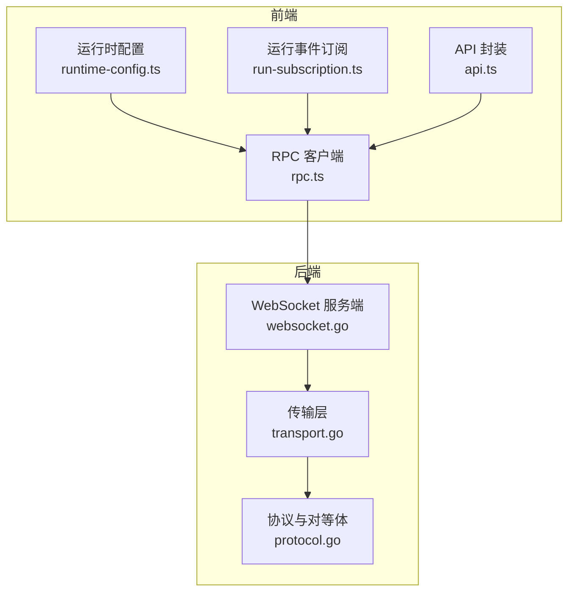
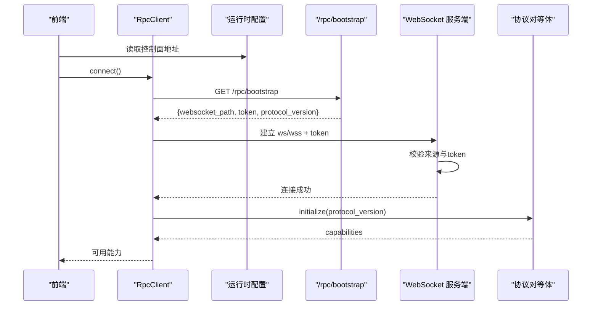
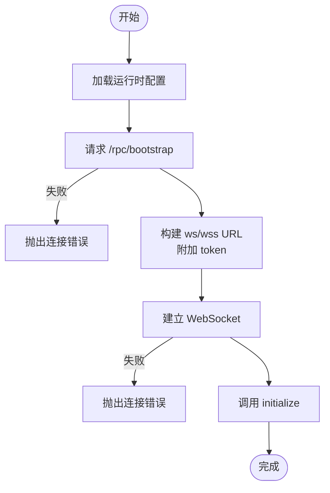
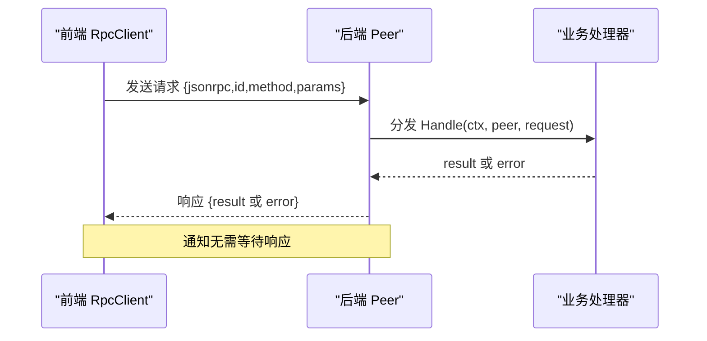
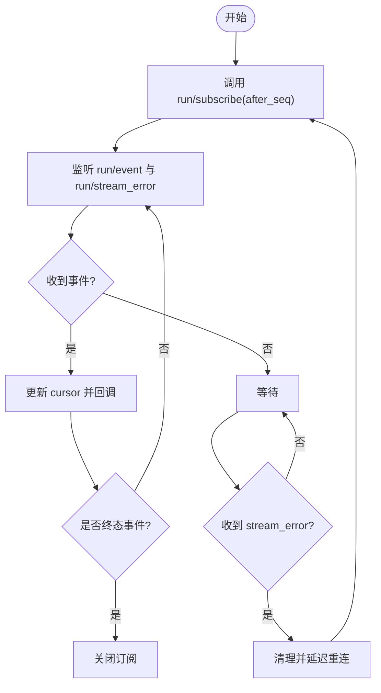
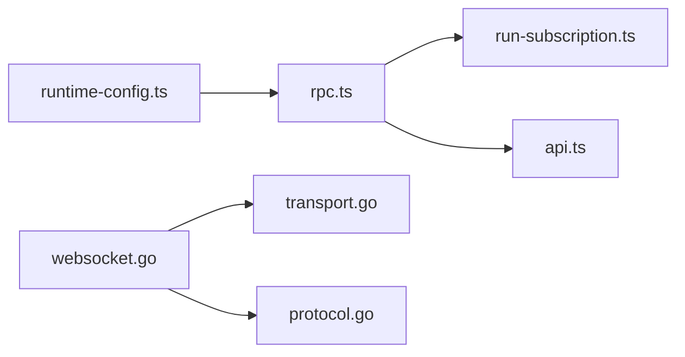

# 客户端集成

<cite>
**本文引用的文件**
- [websocket.go](file://internal/rpc/websocket.go)
- [transport.go](file://internal/rpc/transport.go)
- [protocol.go](file://internal/rpc/protocol.go)
- [rpc.ts](file://ui/src/lib/rpc.ts)
- [runtime-config.ts](file://ui/src/lib/runtime-config.ts)
- [run-subscription.ts](file://ui/src/lib/run-subscription.ts)
- [api.ts](file://ui/src/lib/api.ts)
</cite>

## 目录
1. [简介](#简介)
2. [项目结构](#项目结构)
3. [核心组件](#核心组件)
4. [架构总览](#架构总览)
5. [详细组件分析](#详细组件分析)
6. [依赖关系分析](#依赖关系分析)
7. [性能考量](#性能考量)
8. [故障排查指南](#故障排查指南)
9. [结论](#结论)
10. [附录：客户端代码示例与最佳实践](#附录客户端代码示例与最佳实践)

## 简介
本文件面向需要在浏览器或前端环境中集成 Vivy 控制面 WebSocket 的开发者，系统性说明客户端连接建立、认证参数、消息收发机制、事件订阅、连接状态管理、重连策略、错误处理与恢复，以及性能优化建议。内容基于仓库中后端 RPC/WebSocket 实现与前端 TypeScript 客户端实现进行梳理，确保前后端契约一致、可维护且可扩展。

## 项目结构
Vivy 的控制面采用 JSON-RPC over WebSocket 的双向通信协议。后端通过 HTTP 升级建立 WebSocket 连接并进行鉴权；前端通过 Bootstrap 接口获取连接地址与令牌，再建立 WebSocket 并执行初始化握手。

图表来源
- [runtime-config.ts:1-50](file://ui/src/lib/runtime-config.ts#L1-L50)
- [rpc.ts:1-155](file://ui/src/lib/rpc.ts#L1-L155)
- [run-subscription.ts:1-71](file://ui/src/lib/run-subscription.ts#L1-L71)
- [api.ts:1-91](file://ui/src/lib/api.ts#L1-L91)
- [websocket.go:1-56](file://internal/rpc/websocket.go#L1-L56)
- [transport.go:1-85](file://internal/rpc/transport.go#L1-L85)
- [protocol.go:1-374](file://internal/rpc/protocol.go#L1-L374)

章节来源
- [runtime-config.ts:1-50](file://ui/src/lib/runtime-config.ts#L1-L50)
- [rpc.ts:1-155](file://ui/src/lib/rpc.ts#L1-L155)
- [websocket.go:1-56](file://internal/rpc/websocket.go#L1-L56)
- [transport.go:1-85](file://internal/rpc/transport.go#L1-L85)
- [protocol.go:1-374](file://internal/rpc/protocol.go#L1-L374)

## 核心组件
- 前端 RPC 客户端（rpc.ts）
  - 负责从运行时配置加载控制面地址、请求 /rpc/bootstrap 获取 websocket_path 与 token，建立 WebSocket，执行 initialize 握手，封装 call/onNotification/onClose/close 等方法，并提供全局 getRpcClient/resetRpcClient 单例管理。
- 运行事件订阅（run-subscription.ts）
  - 封装 run/subscribe、run/unsubscribe、run/event、run/stream_error 的订阅流程，支持 after_seq 游标断点续传、终端事件自动关闭、连接中断后指数退避式重连。
- 运行时配置（runtime-config.ts）
  - 读取 /vivy-config.json，解析 controlPlaneUrl，校验并规范化 origin。
- 后端 WebSocket 服务（websocket.go）
  - 校验来源与 token（URL 查询参数或 Authorization Bearer），升级 HTTP 为 WebSocket，构造 Peer 并启动读写循环。
- 传输层（transport.go）
  - 定义 JSONLTransport 与 WebSocketTransport，统一 ReadFrame/WriteFrame/Close 抽象。
- 协议与对等体（protocol.go）
  - 定义 JSON-RPC 2.0 信封、错误码、Peer 生命周期、请求分发、响应等待、通知发送、背压与过载保护、AfterResponse 顺序保证等。

章节来源
- [rpc.ts:1-155](file://ui/src/lib/rpc.ts#L1-L155)
- [run-subscription.ts:1-71](file://ui/src/lib/run-subscription.ts#L1-L71)
- [runtime-config.ts:1-50](file://ui/src/lib/runtime-config.ts#L1-L50)
- [websocket.go:1-56](file://internal/rpc/websocket.go#L1-L56)
- [transport.go:1-85](file://internal/rpc/transport.go#L1-L85)
- [protocol.go:1-374](file://internal/rpc/protocol.go#L1-L374)

## 架构总览
前端通过两步完成连接：
1) 通过 HTTP 获取 bootstrap 信息（websocket_path、token、protocol_version）。
2) 使用返回的 URL 与 token 建立 WebSocket，并调用 initialize 方法完成能力协商。

后端在升级前进行来源与 token 校验，成功后进入 Peer 的读写循环，按 JSON-RPC 2.0 协议分发请求与通知。

图表来源
- [rpc.ts:55-99](file://ui/src/lib/rpc.ts#L55-L99)
- [runtime-config.ts:8-44](file://ui/src/lib/runtime-config.ts#L8-L44)
- [websocket.go:27-46](file://internal/rpc/websocket.go#L27-L46)
- [protocol.go:18-32](file://internal/rpc/protocol.go#L18-L32)

## 详细组件分析

### 连接建立与认证
- 前端
  - 从 /vivy-config.json 读取 controlPlaneUrl，若为空则同域。
  - 请求 /rpc/bootstrap，获取 websocket_path、token、protocol_version。
  - 根据页面协议选择 ws/wss，拼接 token 查询参数，建立 WebSocket。
  - 调用 initialize 完成能力协商。
- 后端
  - 校验来源（OriginPolicy），未通过直接拒绝。
  - 校验 token：优先取 URL 查询参数 token，其次 Authorization: Bearer <token>。
  - 升级 WebSocket 并创建 Peer，启动读写循环。

图表来源
- [rpc.ts:55-99](file://ui/src/lib/rpc.ts#L55-L99)
- [runtime-config.ts:8-44](file://ui/src/lib/runtime-config.ts#L8-L44)
- [websocket.go:27-55](file://internal/rpc/websocket.go#L27-L55)

章节来源
- [rpc.ts:55-99](file://ui/src/lib/rpc.ts#L55-L99)
- [runtime-config.ts:8-44](file://ui/src/lib/runtime-config.ts#L8-L44)
- [websocket.go:27-55](file://internal/rpc/websocket.go#L27-L55)

### 消息发送与接收
- 请求/响应
  - 前端通过 call(method, params) 发送 JSON-RPC 请求，内部维护 pending Map，收到响应后 resolve/reject。
  - 后端 Peer 解析请求，分发给 Handler，序列化结果并通过写循环发送；若出错则返回标准错误帧。
- 通知
  - 前端 onNotification(method, listener) 注册监听器，收到无 id 的消息即视为通知。
  - 后端 Peer.Notify 发送通知；订阅场景下，服务端通过 AfterResponse 保证“先响应订阅请求，再推送事件”的顺序。

图表来源
- [rpc.ts:101-140](file://ui/src/lib/rpc.ts#L101-L140)
- [protocol.go:181-230](file://internal/rpc/protocol.go#L181-L230)
- [protocol.go:330-340](file://internal/rpc/protocol.go#L330-L340)

章节来源
- [rpc.ts:101-140](file://ui/src/lib/rpc.ts#L101-L140)
- [protocol.go:181-230](file://internal/rpc/protocol.go#L181-L230)
- [protocol.go:330-340](file://internal/rpc/protocol.go#L330-L340)

### 事件订阅与断点续传
- 订阅流程
  - 前端调用 run/subscribe(run_id, after_seq)，获得 subscription_id。
  - 监听 run/event，过滤出属于当前订阅的事件，更新游标 after_seq。
  - 遇到 run.completed/run.failed/run.cancelled 等终态事件时自动关闭订阅。
- 错误与恢复
  - 监听 run/stream_error，清理订阅并尝试重新订阅。
  - 监听 onClose，重置客户端并重试。
- 断点续传
  - 每次收到事件更新 cursor，重连时使用 lastSeq 作为 after_seq，避免丢失事件。

图表来源
- [run-subscription.ts:8-69](file://ui/src/lib/run-subscription.ts#L8-L69)

章节来源
- [run-subscription.ts:8-69](file://ui/src/lib/run-subscription.ts#L8-L69)

### 连接状态管理与心跳保活
- 连接状态
  - 前端通过 onClose 感知断开，触发重连逻辑；getRpcClient 提供单例，resetRpcClient 用于主动销毁。
- 心跳保活
  - 当前实现未内置应用层心跳；如需保活，可在上层定时发送轻量 ping 或周期性调用某个空参方法以维持连接活跃。
- 重连策略
  - 订阅层使用固定延时重试（1秒），可根据网络状况扩展为指数退避与最大重试次数限制。

章节来源
- [rpc.ts:143-155](file://ui/src/lib/rpc.ts#L143-L155)
- [run-subscription.ts:18-23](file://ui/src/lib/run-subscription.ts#L18-L23)

### 错误处理与恢复策略
- 网络异常
  - 前端捕获 WebSocket 建立失败、bootstrap 请求失败、JSON 解析失败等，抛出统一 RpcClientError。
  - 订阅层在连接断开或流错误时清理资源并重试。
- 认证失败
  - 后端在未通过来源或 token 校验时直接返回 401/403，前端应提示用户刷新或检查配置。
- 服务不可用
  - 前端在 bootstrap 或 WebSocket 阶段失败时抛出错误；订阅层会持续重试直至恢复。
- 协议错误
  - 后端定义标准 JSON-RPC 错误码（如 ParseError、InvalidRequest、MethodNotFound、InternalError、ServerOverload），前端可按需映射为业务错误。

章节来源
- [websocket.go:27-55](file://internal/rpc/websocket.go#L27-L55)
- [protocol.go:20-32](file://internal/rpc/protocol.go#L20-L32)
- [rpc.ts:10-22](file://ui/src/lib/rpc.ts#L10-L22)
- [rpc.ts:55-99](file://ui/src/lib/rpc.ts#L55-L99)
- [run-subscription.ts:37-59](file://ui/src/lib/run-subscription.ts#L37-L59)

## 依赖关系分析
- 前端依赖
  - rpc.ts 依赖 runtime-config.ts 获取控制面地址。
  - run-subscription.ts 依赖 rpc.ts 提供的 getRpcClient 与事件能力。
  - api.ts 依赖 rpc.ts 将 RPC 错误映射为 ApiError。
- 后端依赖
  - websocket.go 依赖 transport.go 的 WebSocketTransport 与 protocol.go 的 Peer。
  - protocol.go 定义传输无关的协议与调度，便于复用 stdio/WS 等多种传输。

图表来源
- [runtime-config.ts:1-50](file://ui/src/lib/runtime-config.ts#L1-L50)
- [rpc.ts:1-155](file://ui/src/lib/rpc.ts#L1-L155)
- [run-subscription.ts:1-71](file://ui/src/lib/run-subscription.ts#L1-L71)
- [api.ts:1-91](file://ui/src/lib/api.ts#L1-L91)
- [websocket.go:1-56](file://internal/rpc/websocket.go#L1-L56)
- [transport.go:1-85](file://internal/rpc/transport.go#L1-L85)
- [protocol.go:1-374](file://internal/rpc/protocol.go#L1-L374)

章节来源
- [runtime-config.ts:1-50](file://ui/src/lib/runtime-config.ts#L1-L50)
- [rpc.ts:1-155](file://ui/src/lib/rpc.ts#L1-L155)
- [run-subscription.ts:1-71](file://ui/src/lib/run-subscription.ts#L1-L71)
- [api.ts:1-91](file://ui/src/lib/api.ts#L1-L91)
- [websocket.go:1-56](file://internal/rpc/websocket.go#L1-L56)
- [transport.go:1-85](file://internal/rpc/transport.go#L1-L85)
- [protocol.go:1-374](file://internal/rpc/protocol.go#L1-L374)

## 性能考量
- 背压与缓冲
  - 后端 Peer 使用有界输出队列，满时返回过载错误，防止内存膨胀。前端应避免高频批量发送，必要时合并消息或使用节流。
- 帧大小限制
  - 后端默认最大帧大小可配置，超大消息会被拒绝。建议拆分大负载或改用附件/流式传输。
- 写路径串行化
  - 后端写循环串行化写入，减少竞争；前端无需额外并发写锁。
- 事件顺序保证
  - 通过 AfterResponse 保证订阅响应先于事件推送，避免乱序导致的状态不一致。
- 前端缓存与复用
  - getRpcClient 提供单例连接，减少重复握手开销；合理复用订阅实例，避免频繁创建销毁。

章节来源
- [protocol.go:70-83](file://internal/rpc/protocol.go#L70-L83)
- [protocol.go:257-273](file://internal/rpc/protocol.go#L257-L273)
- [protocol.go:232-251](file://internal/rpc/protocol.go#L232-L251)
- [rpc.ts:143-155](file://ui/src/lib/rpc.ts#L143-L155)

## 故障排查指南
- 无法连接控制面
  - 检查 /vivy-config.json 是否存在且包含有效的 controlPlaneUrl。
  - 检查 /rpc/bootstrap 是否返回 JSON，且包含 websocket_path 与 token。
- 认证失败
  - 确认 URL 查询参数 token 或 Authorization 头是否正确传递。
  - 检查后端来源策略是否允许当前 Origin。
- 事件丢失或乱序
  - 确认订阅时传入正确的 after_seq，并在重连时使用 lastSeq 继续。
  - 关注 run/stream_error，及时处理并重建订阅。
- 连接频繁断开
  - 检查代理/防火墙是否拦截 WebSocket。
  - 考虑在上层增加心跳或长轮询以维持连接。
- 过载与丢消息
  - 降低发送频率或批量合并消息。
  - 观察后端过载错误，适当退避重试。

章节来源
- [runtime-config.ts:8-44](file://ui/src/lib/runtime-config.ts#L8-L44)
- [rpc.ts:55-99](file://ui/src/lib/rpc.ts#L55-L99)
- [websocket.go:27-55](file://internal/rpc/websocket.go#L27-L55)
- [run-subscription.ts:37-59](file://ui/src/lib/run-subscription.ts#L37-L59)
- [protocol.go:257-273](file://internal/rpc/protocol.go#L257-L273)

## 结论
本项目提供了稳定、可扩展的 JSON-RPC over WebSocket 控制面方案。前端通过 Bootstrap 与 initialize 完成安全握手与能力协商，后端通过 Peer 统一管理请求/通知与背压。订阅机制支持断点续传与自动重连，满足高可靠实时交互需求。建议在大规模场景下结合心跳、指数退避与消息批量化进一步优化体验。

## 附录：客户端代码示例与最佳实践

### JavaScript 示例（浏览器环境）
- 目标：加载配置、获取 bootstrap、建立 WebSocket、初始化、订阅运行事件、处理错误与重连。
- 关键步骤参考：
  - 加载运行时配置与控制面地址：[runtime-config.ts:8-44](file://ui/src/lib/runtime-config.ts#L8-L44)
  - 获取 bootstrap 并建立 WebSocket：[rpc.ts:55-99](file://ui/src/lib/rpc.ts#L55-L99)
  - 订阅运行事件与断点续传：[run-subscription.ts:8-69](file://ui/src/lib/run-subscription.ts#L8-L69)
  - 错误映射与统一抛出：[rpc.ts:10-22](file://ui/src/lib/rpc.ts#L10-L22), [api.ts:42-49](file://ui/src/lib/api.ts#L42-L49)

### TypeScript 示例（Node.js 或浏览器）
- 目标：封装类型安全的 RPC 调用、事件订阅、重连与超时控制。
- 关键步骤参考：
  - 类型定义与能力协商：[rpc.ts:3-33](file://ui/src/lib/rpc.ts#L3-L33)
  - 调用方法与通知监听：[rpc.ts:101-140](file://ui/src/lib/rpc.ts#L101-L140)
  - 订阅与游标管理：[run-subscription.ts:8-69](file://ui/src/lib/run-subscription.ts#L8-L69)
  - API 方法封装与错误映射：[api.ts:3-91](file://ui/src/lib/api.ts#L3-L91)

### 最佳实践
- 连接管理
  - 使用 getRpcClient 单例，避免重复握手；在应用卸载时调用 resetRpcClient 释放资源。
- 认证与安全
  - 始终通过 /rpc/bootstrap 获取 token，不要硬编码；生产环境启用 HTTPS/WSS。
- 事件可靠性
  - 始终记录 lastSeq，重连时传入 after_seq；对 run/stream_error 及时清理并重建订阅。
- 性能优化
  - 合并高频小消息；避免一次性发送超大帧；必要时引入应用层心跳。
- 错误处理
  - 区分网络错误、认证错误与服务错误；对用户可见的错误提供友好提示与重试入口。