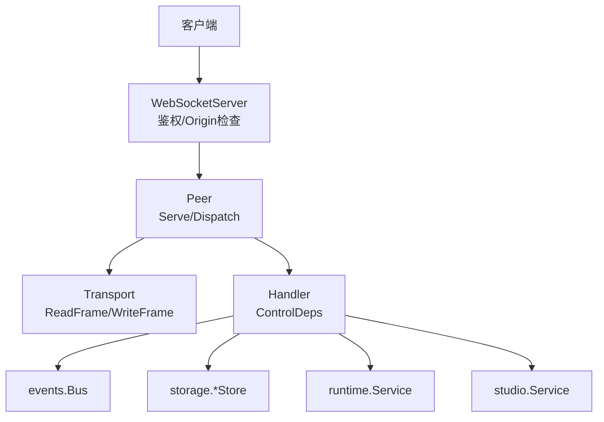
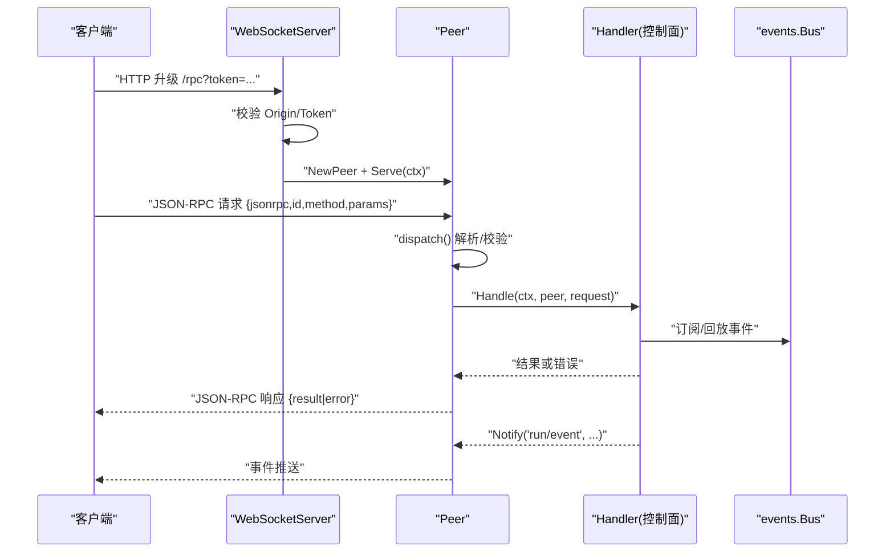
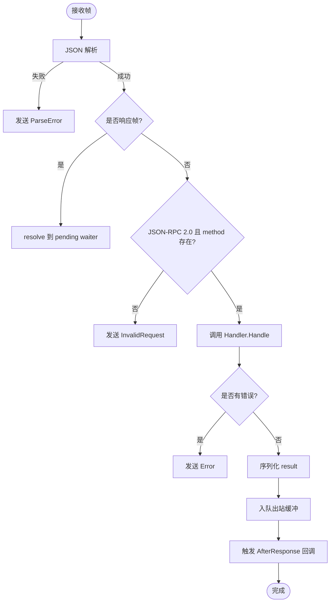
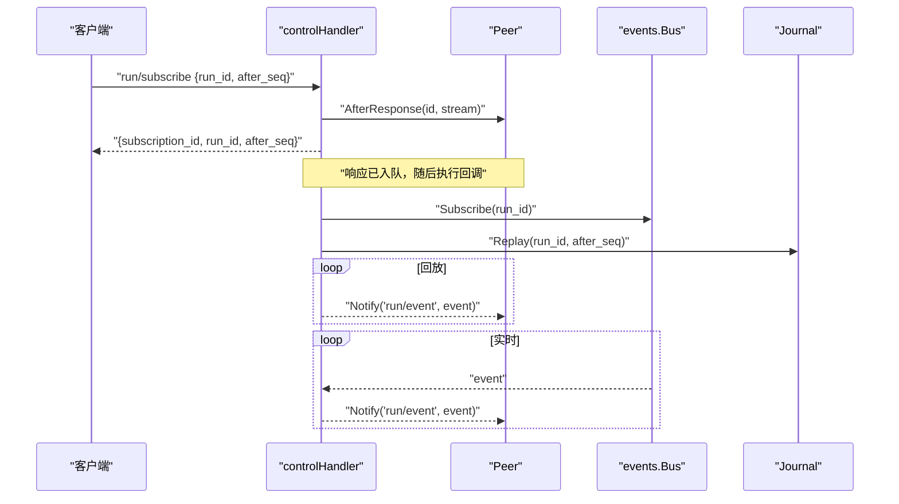
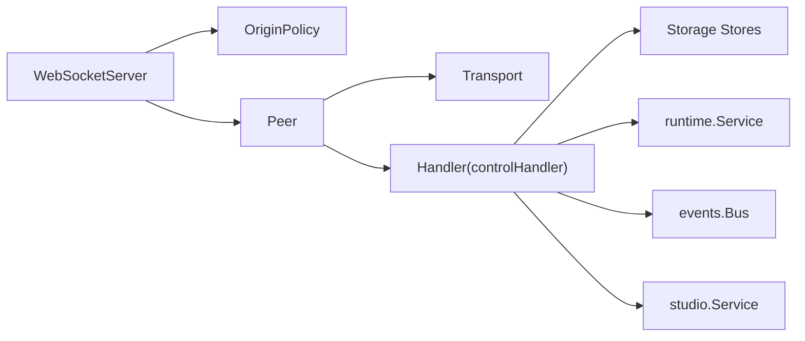

# 消息协议

<cite>
**本文引用的文件**
- [protocol.go](file://internal/rpc/protocol.go)
- [websocket.go](file://internal/rpc/websocket.go)
- [transport.go](file://internal/rpc/transport.go)
- [control.go](file://internal/rpc/control.go)
- [origin.go](file://internal/rpc/origin.go)
- [protocol_test.go](file://internal/rpc/protocol_test.go)
- [websocket_test.go](file://internal/rpc/websocket_test.go)
</cite>

## 目录
1. [简介](#简介)
2. [项目结构](#项目结构)
3. [核心组件](#核心组件)
4. [架构总览](#架构总览)
5. [详细组件分析](#详细组件分析)
6. [依赖关系分析](#依赖关系分析)
7. [性能与背压](#性能与背压)
8. [故障排查指南](#故障排查指南)
9. [结论](#结论)
10. [附录：消息格式与错误码](#附录消息格式与错误码)

## 简介
本仓库实现了一套基于 JSON-RPC 的双向控制平面，用于 Vivy 运行时与客户端（浏览器、CLI、子进程）之间的通信。传输层抽象为 Transport，当前提供 WebSocket 与 JSONL（标准输入输出）两种实现；协议层负责帧的解析、路由、响应关联、错误传播与背压控制；业务层通过 Handler 接口暴露方法，如会话管理、运行生命周期、事件订阅、审批/问答、设置等。

该协议严格遵循 JSON-RPC 2.0 的消息形态，并在服务端统一进行参数校验、错误映射与序列化。同时提供“请求-响应”和“通知”两种语义，以及基于 AfterResponse 的事件顺序保证，确保“先响应、后推送事件”的一致性。

## 项目结构
- internal/rpc：协议与传输的核心实现
  - protocol.go：JSON-RPC 协议、Peer 生命周期、请求分发、响应队列、Call/Notify、错误码定义
  - websocket.go：WebSocket 接入、鉴权（Token）、CORS/Origin 策略
  - transport.go：Transport 接口及 JSONL、WebSocket 具体实现
  - control.go：控制面方法注册与处理（会话、运行、事件、审批、问答、设置等）
  - origin.go：跨域来源白名单与规范化
  - *_test.go：协议与传输的单元测试用例



图表来源
- [websocket.go:27-47](file://internal/rpc/websocket.go#L27-L47)
- [protocol.go:120-164](file://internal/rpc/protocol.go#L120-L164)
- [transport.go:63-85](file://internal/rpc/transport.go#L63-L85)
- [control.go:253-353](file://internal/rpc/control.go#L253-L353)

章节来源
- [websocket.go:12-56](file://internal/rpc/websocket.go#L12-L56)
- [protocol.go:18-374](file://internal/rpc/protocol.go#L18-L374)
- [transport.go:12-85](file://internal/rpc/transport.go#L12-L85)
- [control.go:22-353](file://internal/rpc/control.go#L22-L353)
- [origin.go:13-65](file://internal/rpc/origin.go#L13-L65)

## 核心组件
- Transport 接口：抽象底层帧读写，屏蔽 WebSocket/JSONL 差异
- Peer：协议核心，维护读循环、写循环、请求分发、响应关联、AfterResponse 回调、Call/Notify
- Handler：业务处理器接口，由 ControlDeps 组装出 controlHandler，实现所有 RPC 方法
- WebSocketServer：HTTP 升级 + Token 鉴权 + Origin 策略，创建 Peer 并启动 Serve
- OriginPolicy：规范化与校验浏览器 Origin，支持本地回环与配置白名单

章节来源
- [transport.go:12-85](file://internal/rpc/transport.go#L12-L85)
- [protocol.go:64-118](file://internal/rpc/protocol.go#L64-L118)
- [control.go:27-89](file://internal/rpc/control.go#L27-L89)
- [websocket.go:12-56](file://internal/rpc/websocket.go#L12-L56)
- [origin.go:13-65](file://internal/rpc/origin.go#L13-L65)

## 架构总览
- 连接建立：客户端发起 HTTP 升级至 WebSocket，服务端校验 Origin 与 Token，成功后创建 Peer
- 消息流：Peer 单读循环读取帧，反序列化为 JSON-RPC 信封；无 ID 且含 result/error 视为响应，交由 resolve；否则按 method 分派到 Handler
- 响应关联：Call 生成唯一 id，等待对应 waiter；服务端返回时 resolve 唤醒
- 事件推送：Handler 使用 Notify 推送事件；Subscribe 通过 AfterResponse 保证“响应先于事件”的顺序
- 背压控制：OutgoingBuffer 有界通道，写满返回 ErrOverloaded；最大帧大小限制防止内存滥用



图表来源
- [websocket.go:27-47](file://internal/rpc/websocket.go#L27-L47)
- [protocol.go:181-230](file://internal/rpc/protocol.go#L181-L230)
- [control.go:836-930](file://internal/rpc/control.go#L836-L930)

## 详细组件分析

### 协议层：Peer 与 JSON-RPC 处理
- 帧大小限制：超过 MaxFrameBytes 直接拒绝并返回 InvalidRequest
- 解析与分发：
  - 无法解析 JSON：返回 ParseError
  - 非请求帧（无 method，但含 result/error）：resolve 到 pending waiter
  - 非 JSON-RPC 2.0 或缺少 method：返回 InvalidRequest
- 请求处理：
  - 调用 Handler.Handle，若 handler 为空则 MethodNotFound
  - 成功：序列化 result 入队；失败：构造 Error 入队
  - 无 ID 的通知：不回复
- 响应关联与超时：
  - Call 生成自增 id，挂起 waiter；ctx 取消或 peer 关闭会清理 waiter
- 事件顺序：
  - AfterResponse(id, fn) 在响应进入出站队列后执行，确保“响应先于事件”



图表来源
- [protocol.go:181-230](file://internal/rpc/protocol.go#L181-L230)
- [protocol.go:232-255](file://internal/rpc/protocol.go#L232-L255)
- [protocol.go:257-287](file://internal/rpc/protocol.go#L257-L287)
- [protocol.go:289-351](file://internal/rpc/protocol.go#L289-L351)

章节来源
- [protocol.go:18-374](file://internal/rpc/protocol.go#L18-L374)

### 传输层：WebSocket 与 JSONL
- WebSocketTransport：仅接受 TextMessage，写操作加锁保证有序
- JSONLTransport：按行读取/写入，自动去除换行符，可选 Flush
- WebSocketServer：
  - 校验 Origin（允许空 Origin 的本地/测试场景）
  - 校验 Token（URL 查询或 Authorization: Bearer）
  - 创建 Peer 并启动 Serve

```mermaid
classDiagram
class Transport {
+ReadFrame() []byte
+WriteFrame([]byte) error
+Close() error
}
class WebSocketTransport {
-conn *Conn
+ReadFrame() []byte
+WriteFrame([]byte) error
+Close() error
}
class JSONLTransport {
-reader *Reader
-writer Writer
-flush interface{}
-close func() error
+ReadFrame() []byte
+WriteFrame([]byte) error
+Close() error
}
Transport <|.. WebSocketTransport
Transport <|.. JSONLTransport
```

图表来源
- [transport.go:12-85](file://internal/rpc/transport.go#L12-L85)

章节来源
- [transport.go:12-85](file://internal/rpc/transport.go#L12-L85)
- [websocket.go:12-56](file://internal/rpc/websocket.go#L12-L56)
- [origin.go:13-65](file://internal/rpc/origin.go#L13-L65)

### 控制面：方法路由与参数处理
- 方法注册：Handle 中 switch 分支覆盖 session、turn、run、preflight、approval、question、review、background、child、generations、evals、promotions、settings、species 等能力
- 参数解析：统一 decodeParams，再针对各方法做必填字段校验，缺失返回 InvalidParams
- 错误映射：
  - runtimeError：将运行时错误映射为 InvalidParams/CodeConflict/CodeNotFound/InternalError
  - studioError：将 Studio/Eval 错误映射为 InvalidParams/CodeConflict/CodeNotFound/InternalError
  - internalError：兜底 InternalError
- 事件订阅：
  - subscribe：创建 subscriptionID，注册 cancel，通过 AfterResponse 延迟启动流式推送
  - streamRun：先回放历史事件，再订阅 Bus 实时推送；Bus 关闭前再次回放尾部事件，确保终端事件可达
  - unsubscribe：取消订阅并释放资源



图表来源
- [control.go:836-930](file://internal/rpc/control.go#L836-L930)
- [control.go:932-946](file://internal/rpc/control.go#L932-L946)
- [protocol.go:232-255](file://internal/rpc/protocol.go#L232-L255)

章节来源
- [control.go:253-353](file://internal/rpc/control.go#L253-L353)
- [control.go:836-930](file://internal/rpc/control.go#L836-L930)
- [control.go:948-1000](file://internal/rpc/control.go#L948-L1000)
- [control.go:1351-1369](file://internal/rpc/control.go#L1351-L1369)

### 安全与访问控制
- Origin 策略：
  - 规范化 Origin，禁止包含路径/查询/片段/凭据
  - 允许空 Origin（本地 CLI/测试），或匹配配置的白名单
  - 对允许的跨域请求附加最小 CORS 头
- Token 鉴权：
  - 支持 URL 查询 token 或 Authorization: Bearer
  - 未通过则拒绝连接

章节来源
- [origin.go:13-65](file://internal/rpc/origin.go#L13-L65)
- [websocket.go:27-56](file://internal/rpc/websocket.go#L27-L56)

## 依赖关系分析
- Peer 依赖 Transport 与 Handler；Handler 依赖 ControlDeps（存储、事件总线、运行时服务、Studio、评估器等）
- WebSocketServer 依赖 OriginPolicy 与 Options；内部创建 Peer 并启动 Serve
- 控制面方法通过 ControlDeps 访问持久化与运行时状态，并通过 events.Bus 广播事件



图表来源
- [websocket.go:12-56](file://internal/rpc/websocket.go#L12-L56)
- [protocol.go:92-118](file://internal/rpc/protocol.go#L92-L118)
- [control.go:27-89](file://internal/rpc/control.go#L27-L89)

章节来源
- [websocket.go:12-56](file://internal/rpc/websocket.go#L12-L56)
- [protocol.go:92-118](file://internal/rpc/protocol.go#L92-L118)
- [control.go:27-89](file://internal/rpc/control.go#L27-L89)

## 性能与背压
- 出站缓冲：OutgoingBuffer 默认 64，可配置；写满返回 ErrOverloaded，调用方可据此退避或重试
- 帧大小限制：MaxFrameBytes 默认 1MB，超限立即拒绝并返回 InvalidRequest
- 串行写入：writeLoop 单 goroutine 串行写出，避免并发写冲突
- 事件顺序：AfterResponse 保证“响应先于事件”，减少客户端重放复杂度
- 批量回放：subscribe 先回放历史事件，再订阅实时事件，降低丢失风险

优化建议
- 根据客户端吞吐调整 OutgoingBuffer，避免频繁 ErrOverloaded
- 合理设置 MaxFrameBytes，平衡大消息与内存占用
- 对高频 Notify 进行合并或节流，减轻网络压力

章节来源
- [protocol.go:70-83](file://internal/rpc/protocol.go#L70-L83)
- [protocol.go:158-163](file://internal/rpc/protocol.go#L158-L163)
- [protocol.go:166-179](file://internal/rpc/protocol.go#L166-L179)
- [protocol.go:232-255](file://internal/rpc/protocol.go#L232-L255)
- [protocol_test.go:76-87](file://internal/rpc/protocol_test.go#L76-L87)

## 故障排查指南
- 无法解析 JSON：检查客户端发送是否为合法 JSON；服务端会返回 ParseError
- 无效请求：确认 jsonrpc 版本为 "2.0" 且 method 非空；否则返回 InvalidRequest
- 方法不存在：确认方法名在服务端已注册；否则返回 MethodNotFound
- 参数错误：检查 params 结构与必填字段；否则返回 InvalidParams
- 内部错误：服务端异常或不可序列化结果；返回 InternalError
- 过载：出站队列满导致 ErrOverloaded；客户端应退避重试
- 订阅失败：确保 run_id 有效且 after_seq 非负；回放失败会推送 run/stream_error

章节来源
- [protocol.go:181-230](file://internal/rpc/protocol.go#L181-L230)
- [protocol.go:257-287](file://internal/rpc/protocol.go#L257-L287)
- [control.go:948-1000](file://internal/rpc/control.go#L948-L1000)
- [control.go:878-930](file://internal/rpc/control.go#L878-L930)
- [protocol_test.go:89-111](file://internal/rpc/protocol_test.go#L89-L111)

## 结论
该协议以 JSON-RPC 2.0 为基础，结合 Transport 抽象与 Peer 编排，实现了稳定、可扩展的双向控制平面。通过严格的参数校验、统一的错误映射、有序的响应-事件保证与可控的背压机制，既满足高可靠性的服务端需求，也便于客户端实现简洁可靠的消费逻辑。WebSocket 与 JSONL 双传输适配，使同一协议可用于浏览器与进程间通信。

## 附录：消息格式与错误码

### JSON-RPC 消息格式
- 请求
  - 字段：jsonrpc="2.0"、id（字符串或数字）、method、params（对象或 null）
  - 示例（示意）：{ "jsonrpc": "2.0", "id": "1", "method": "session/create", "params": { "title": "新会话" } }
- 响应
  - 字段：jsonrpc="2.0"、id（与请求一致）、result 或 error（二选一）
  - 示例（示意）：{ "jsonrpc": "2.0", "id": "1", "result": { "id": "sess_xxx", "title": "新会话", "created_at": 1710000000000 } }
- 通知
  - 无 id 的请求，服务端不回复
  - 示例（示意）：{ "jsonrpc": "2.0", "method": "run/event", "params": { "subscription_id": "sub_xxx", "event": {...} } }

章节来源
- [protocol.go:47-52](file://internal/rpc/protocol.go#L47-L52)
- [protocol.go:85-90](file://internal/rpc/protocol.go#L85-L90)
- [control.go:836-930](file://internal/rpc/control.go#L836-L930)

### 错误码定义
- -32700 解析错误：JSON 无法解析
- -32600 无效请求：非 JSON-RPC 2.0 或缺少 method
- -32601 方法未找到：未注册的方法
- -32602 参数无效：参数缺失或类型不符
- -32603 内部错误：服务端异常或结果不可序列化
- -32001 服务器过载：出站队列已满
- -32004 未找到：资源不存在（如 child/run/review）
- -32009 冲突：资源状态冲突（如重复决策、过期等）

章节来源
- [protocol.go:20-27](file://internal/rpc/protocol.go#L20-L27)
- [control.go:22-25](file://internal/rpc/control.go#L22-L25)
- [control.go:1351-1369](file://internal/rpc/control.go#L1351-L1369)

### 方法清单（部分）
- initialize/capabilities：返回协议版本与能力列表
- session/*：创建、列出、获取、重命名、删除会话；列出消息
- preflight/run：预检运行策略与工具选择
- turn/start：开始一轮对话；turn/interrupt 或 run/cancel：中断/取消
- run/get、run/subscribe、run/unsubscribe、run/log：查询运行、订阅事件、回放日志
- approval/*、question/*：审批与问答的查询与应答
- review/*：审查项的查询与处置
- background/*：后台运行的恢复、列表、附加
- child/*：子运行的启动、查询、列表、等待、取消
- generations/*、evals/*、promotions/*：产物、评估、晋升相关
- settings/get、settings/update：只读或可写的模型提供者设置
- species/inspect：运行时物种信息

章节来源
- [control.go:253-353](file://internal/rpc/control.go#L253-L353)

### 客户端与服务端最佳实践
- 客户端
  - 始终携带唯一 id 以便关联响应；通知无需 id
  - 处理错误码，区分解析/参数/内部/过载等错误
  - 遇到 ErrOverloaded 时指数退避重试
  - 订阅后优先处理响应，再处理事件，利用 AfterResponse 保证顺序
  - 合理设置超时，避免长期挂起的 Call
- 服务端
  - 严格校验参数，返回明确的 InvalidParams 错误
  - 使用 AfterResponse 确保“响应先于事件”
  - 对高频事件进行节流或合并，避免拥塞
  - 记录关键错误与负载指标，便于定位问题

章节来源
- [protocol.go:289-351](file://internal/rpc/protocol.go#L289-L351)
- [protocol.go:232-255](file://internal/rpc/protocol.go#L232-L255)
- [control.go:836-930](file://internal/rpc/control.go#L836-L930)