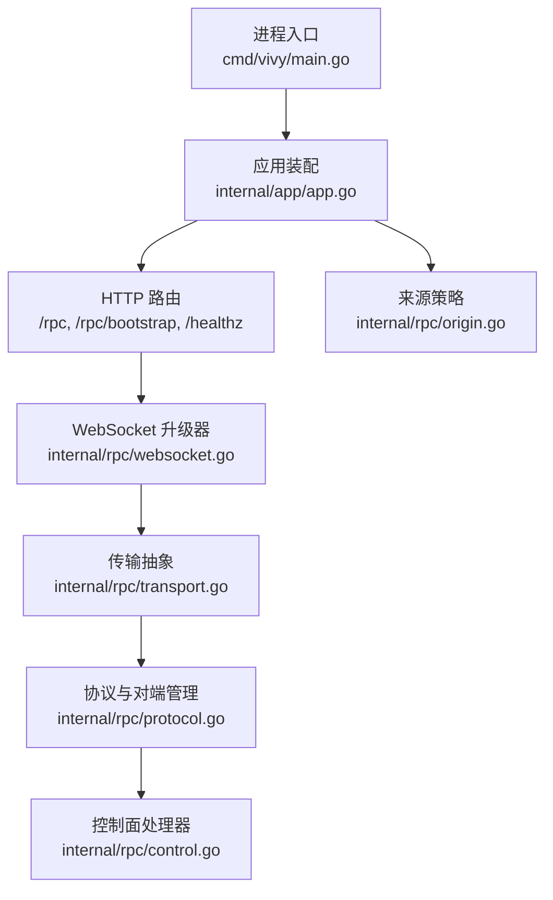
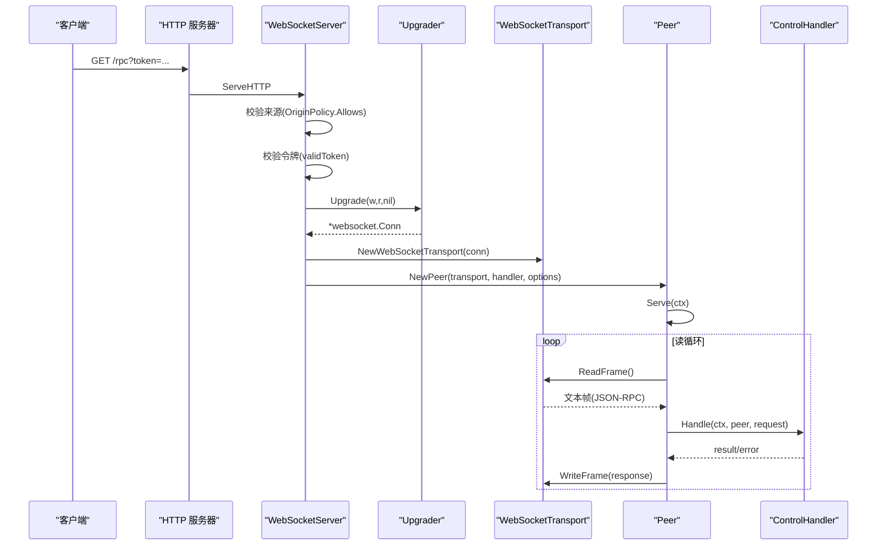
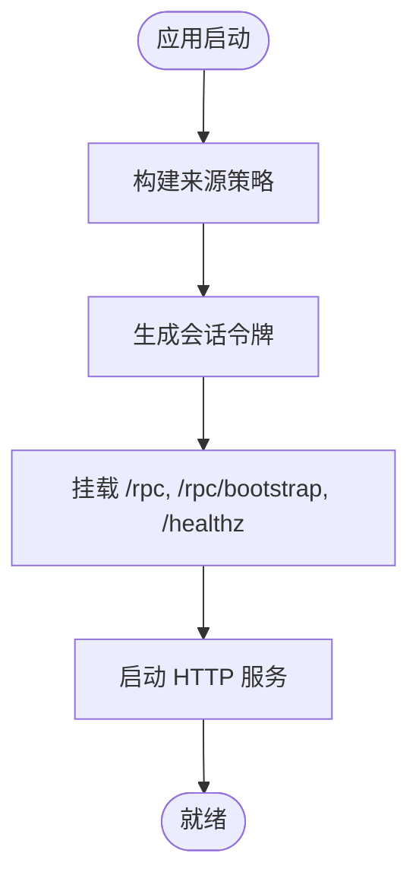
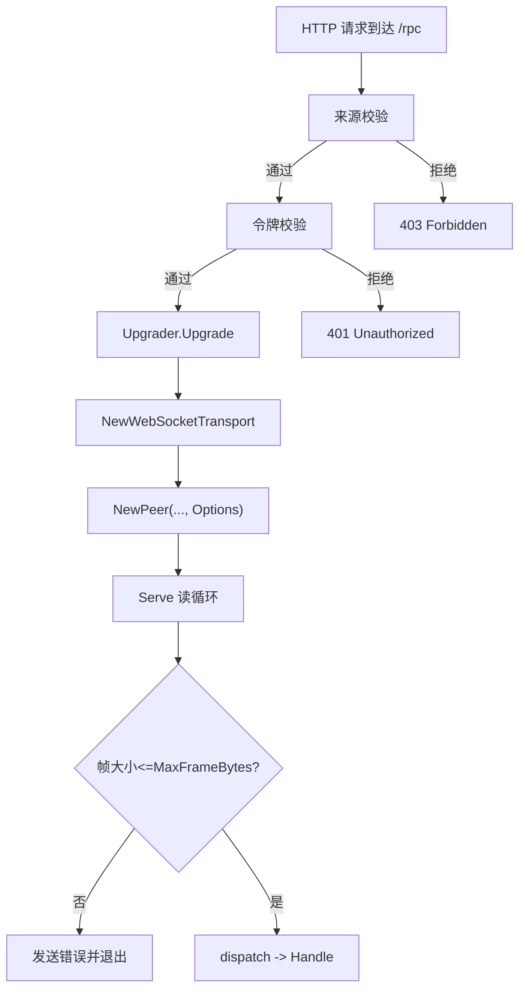
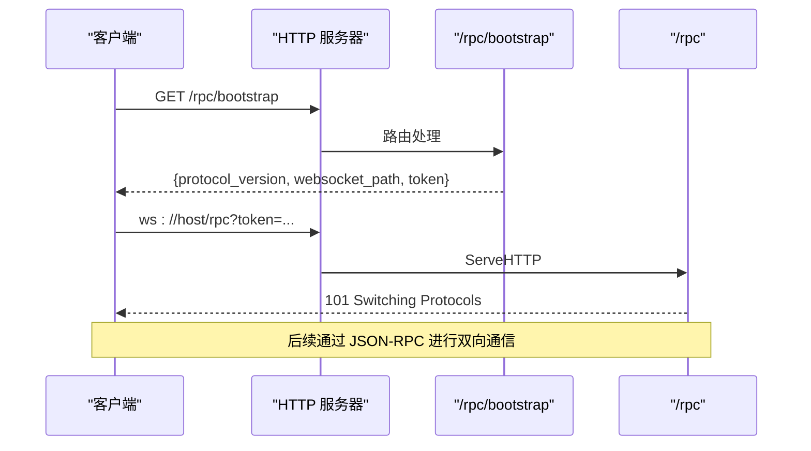
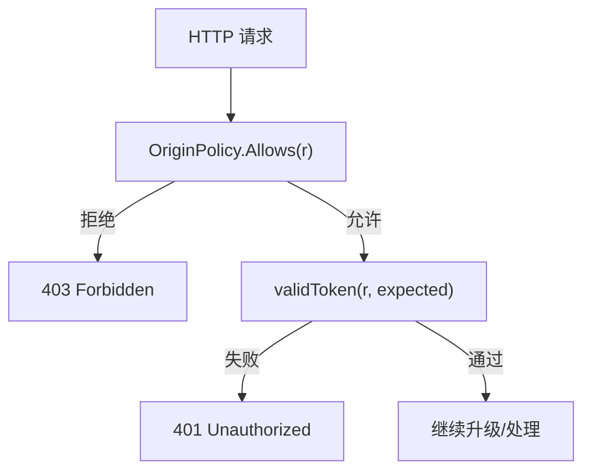
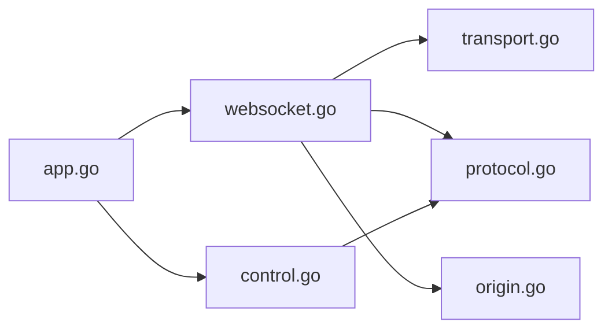

# 连接管理

<cite>
**本文引用的文件**
- [internal/app/app.go](file://internal/app/app.go)
- [cmd/vivy/main.go](file://cmd/vivy/main.go)
- [internal/rpc/websocket.go](file://internal/rpc/websocket.go)
- [internal/rpc/transport.go](file://internal/rpc/transport.go)
- [internal/rpc/protocol.go](file://internal/rpc/protocol.go)
- [internal/rpc/control.go](file://internal/rpc/control.go)
- [internal/rpc/origin.go](file://internal/rpc/origin.go)
</cite>

## 目录
1. [简介](#简介)
2. [项目结构](#项目结构)
3. [核心组件](#核心组件)
4. [架构总览](#架构总览)
5. [详细组件分析](#详细组件分析)
6. [依赖关系分析](#依赖关系分析)
7. [性能考量](#性能考量)
8. [故障排查指南](#故障排查指南)
9. [结论](#结论)
10. [附录：配置与使用示例](#附录配置与使用示例)

## 简介
本文档聚焦于 WebSocket 连接管理的完整实现，覆盖服务器初始化、协议升级、握手流程、连接生命周期、资源清理、并发控制、安全验证（令牌、来源、授权）、状态监控与故障恢复策略，并提供端到端的配置与使用指引。该实现基于 JSON-RPC over WebSocket，将传输层与业务处理解耦，便于在浏览器与本地客户端间复用同一协议栈。

## 项目结构
WebSocket 相关能力集中在 internal/rpc 包中，由应用启动入口 internal/app/app.go 装配并挂载到 HTTP 服务；命令入口 cmd/vivy/main.go 负责加载配置并启动进程。关键文件职责如下：
- internal/app/app.go：组装运行时、创建 RPC 处理器、生成会话令牌、注册 /rpc 与 /rpc/bootstrap 路由、启动 HTTP 服务。
- internal/rpc/websocket.go：HTTP 到 WebSocket 的升级入口，包含来源校验、令牌校验、Upgrader 配置与 Peer 启动。
- internal/rpc/transport.go：JSONL 与 WebSocket 两种传输抽象，统一 ReadFrame/WriteFrame/Close 接口。
- internal/rpc/protocol.go：Peer 主循环、请求分发、响应队列、背压、Call/Notify、AfterResponse 等。
- internal/rpc/control.go：控制面方法路由与业务逻辑（会话、运行、事件订阅等）。
- internal/rpc/origin.go：浏览器来源策略与最小 CORS 头输出。
- cmd/vivy/main.go：进程入口，加载配置并调用 app.Run。



**图表来源**
- [cmd/vivy/main.go:23-74](file://cmd/vivy/main.go#L23-L74)
- [internal/app/app.go:325-362](file://internal/app/app.go#L325-L362)
- [internal/rpc/websocket.go:27-47](file://internal/rpc/websocket.go#L27-L47)
- [internal/rpc/transport.go:58-85](file://internal/rpc/transport.go#L58-L85)
- [internal/rpc/protocol.go:92-164](file://internal/rpc/protocol.go#L92-L164)
- [internal/rpc/control.go:253-353](file://internal/rpc/control.go#L253-L353)
- [internal/rpc/origin.go:13-54](file://internal/rpc/origin.go#L13-L54)

**章节来源**
- [cmd/vivy/main.go:23-74](file://cmd/vivy/main.go#L23-L74)
- [internal/app/app.go:325-362](file://internal/app/app.go#L325-L362)

## 核心组件
- WebSocketServer：HTTP 入口，执行来源检查、令牌校验、创建 Upgrader、升级连接并启动 Peer。
- Transport 抽象：WebSocketTransport/JSONLTransport 提供统一的帧读写与关闭语义。
- Peer：拥有读循环、写循环、请求分发、响应队列、背压、Call/Notify、AfterResponse 机制。
- ControlHandler：控制面方法路由与业务编排（会话、运行、事件订阅、审批、问题、评估等）。
- OriginPolicy：浏览器来源白名单与同源放行、CORS 头注入。

**章节来源**
- [internal/rpc/websocket.go:12-55](file://internal/rpc/websocket.go#L12-L55)
- [internal/rpc/transport.go:12-85](file://internal/rpc/transport.go#L12-L85)
- [internal/rpc/protocol.go:92-374](file://internal/rpc/protocol.go#L92-L374)
- [internal/rpc/control.go:253-353](file://internal/rpc/control.go#L253-L353)
- [internal/rpc/origin.go:13-54](file://internal/rpc/origin.go#L13-L54)

## 架构总览
下图展示了从 HTTP 请求到 WebSocket 连接的完整握手与后续消息流转路径，以及 Peer 如何驱动控制面处理。



**图表来源**
- [internal/app/app.go:325-341](file://internal/app/app.go#L325-L341)
- [internal/rpc/websocket.go:27-47](file://internal/rpc/websocket.go#L27-L47)
- [internal/rpc/transport.go:63-85](file://internal/rpc/transport.go#L63-L85)
- [internal/rpc/protocol.go:120-164](file://internal/rpc/protocol.go#L120-L164)
- [internal/rpc/control.go:253-353](file://internal/rpc/control.go#L253-L353)

## 详细组件分析

### WebSocket 服务器初始化与配置
- 来源策略：通过 OriginPolicy 构造允许的浏览器来源集合，支持同源放行与精确白名单。
- 令牌生成：每次启动生成随机会话令牌，用于鉴权。
- 路由挂载：/rpc 指向 WebSocketServer；/rpc/bootstrap 返回协议版本与 token；/healthz 健康检查。
- HTTP 服务：设置监听地址与读取头部超时，配合优雅关闭。



**图表来源**
- [internal/app/app.go:72-75](file://internal/app/app.go#L72-L75)
- [internal/app/app.go:314-341](file://internal/app/app.go#L314-L341)
- [internal/app/app.go:357-362](file://internal/app/app.go#L357-L362)

**章节来源**
- [internal/app/app.go:72-75](file://internal/app/app.go#L72-L75)
- [internal/app/app.go:314-341](file://internal/app/app.go#L314-L341)
- [internal/app/app.go:357-362](file://internal/app/app.go#L357-L362)

### 协议升级与缓冲区设置
- Upgrader 配置：ReadBufferSize 与 WriteBufferSize 均为 32 KiB；CheckOrigin 在升级阶段允许（来源已在 ServeHTTP 前置校验）。
- 传输层：WebSocketTransport 仅接受 TextMessage，保证 JSON-RPC 文本帧语义。
- 帧大小限制：Peer 在读循环中按 Options.MaxFrameBytes 限制单帧大小，超限返回解析错误并终止连接。



**图表来源**
- [internal/rpc/websocket.go:27-47](file://internal/rpc/websocket.go#L27-L47)
- [internal/rpc/transport.go:63-85](file://internal/rpc/transport.go#L63-L85)
- [internal/rpc/protocol.go:143-164](file://internal/rpc/protocol.go#L143-L164)

**章节来源**
- [internal/rpc/websocket.go:27-47](file://internal/rpc/websocket.go#L27-L47)
- [internal/rpc/transport.go:63-85](file://internal/rpc/transport.go#L63-L85)
- [internal/rpc/protocol.go:143-164](file://internal/rpc/protocol.go#L143-L164)

### 连接建立流程（握手）
- 客户端先访问 /rpc/bootstrap 获取 protocol_version 与 websocket_path、token。
- 携带 token 发起 /rpc 的 WebSocket 升级请求。
- 服务端校验来源与令牌后升级连接，创建 Peer 并开始读循环。



**图表来源**
- [internal/app/app.go:327-341](file://internal/app/app.go#L327-L341)
- [internal/rpc/websocket.go:27-47](file://internal/rpc/websocket.go#L27-L47)

**章节来源**
- [internal/app/app.go:327-341](file://internal/app/app.go#L327-L341)
- [internal/rpc/websocket.go:27-47](file://internal/rpc/websocket.go#L27-L47)

### 连接池管理与生命周期
- 无显式连接池：每个 /rpc 请求独立升级为一个 WebSocket 连接，并由一个 Peer 实例管理其生命周期。
- 生命周期：
  - 创建：ServeHTTP 升级成功后创建 Peer 并启动 Serve。
  - 运行：读循环持续读取帧，分发给 Handler；写循环序列化写出响应。
  - 关闭：ctx 取消或连接错误时触发 stopPeer，关闭传输并清理 pending 等待者。
- 资源清理：stopPeer 确保 transport.Close 被调用，避免句柄泄漏。
- 并发控制：
  - 写串行化：单一 writer goroutine 通过有界通道 out 串行写出，防止写竞争。
  - 背压：out 通道容量为 Options.OutgoingBuffer（默认 64），满时返回 ErrOverloaded，调用方可据此退避重试。
  - 帧大小限制：MaxFrameBytes 保护内存与解析开销。

```mermaid
classDiagram
class WebSocketServer {
+ServeHTTP(w, r)
}
class WebSocketTransport {
+ReadFrame() []byte
+WriteFrame(frame) error
+Close() error
}
class Peer {
-transport Transport
-handler Handler
-options Options
-out chan[]byte
-done chan struct{}
+Serve(ctx) error
+Call(method,params) (json.RawMessage,error)
+Notify(method,params) error
+AfterResponse(id,fn)
}
class ControlHandler {
+Handle(ctx,peer,request) (any,*Error)
}
WebSocketServer --> WebSocketTransport : "封装连接"
WebSocketServer --> Peer : "创建并启动"
Peer --> WebSocketTransport : "读写帧"
Peer --> ControlHandler : "分发请求"
```

**图表来源**
- [internal/rpc/websocket.go:12-47](file://internal/rpc/websocket.go#L12-L47)
- [internal/rpc/transport.go:58-85](file://internal/rpc/transport.go#L58-L85)
- [internal/rpc/protocol.go:92-164](file://internal/rpc/protocol.go#L92-L164)
- [internal/rpc/control.go:253-353](file://internal/rpc/control.go#L253-L353)

**章节来源**
- [internal/rpc/protocol.go:92-164](file://internal/rpc/protocol.go#L92-L164)
- [internal/rpc/protocol.go:257-273](file://internal/rpc/protocol.go#L257-L273)
- [internal/rpc/protocol.go:359-373](file://internal/rpc/protocol.go#L359-L373)

### 安全验证机制
- 来源检查：OriginPolicy.Allows 放行同源请求或白名单来源；未携带 Origin 的请求视为本地/测试场景放行。
- 令牌验证：validToken 支持 URL 查询参数 token 与 Authorization: Bearer <token> 两种方式；未配置或未匹配则拒绝。
- 授权控制：所有控制面方法由 ControlHandler.Handle 统一路由，未知方法返回 MethodNotFound。
- CORS：对跨域请求按需注入 Access-Control-Allow-Origin 与 Vary 头。



**图表来源**
- [internal/rpc/origin.go:38-54](file://internal/rpc/origin.go#L38-L54)
- [internal/rpc/websocket.go:27-35](file://internal/rpc/websocket.go#L27-L35)
- [internal/rpc/websocket.go:49-55](file://internal/rpc/websocket.go#L49-L55)
- [internal/rpc/control.go:253-353](file://internal/rpc/control.go#L253-L353)

**章节来源**
- [internal/rpc/origin.go:38-54](file://internal/rpc/origin.go#L38-L54)
- [internal/rpc/websocket.go:27-35](file://internal/rpc/websocket.go#L27-L35)
- [internal/rpc/websocket.go:49-55](file://internal/rpc/websocket.go#L49-L55)
- [internal/rpc/control.go:253-353](file://internal/rpc/control.go#L253-L353)

### 连接状态监控与故障恢复
- 健康检查：/healthz 返回进程阶段信息，可用于外部探针。
- 启动恢复：在监听前执行服务恢复，确保非终态运行项重新登记或标记失败。
- 运行期监控：
  - run/subscribe 可订阅运行事件流，结合 after_seq 游标重放历史事件。
  - background/list、background/attach 可列举与附加后台运行任务。
- 错误与背压：
  - 帧过大、JSON 解析失败、方法不存在等会返回标准 JSON-RPC 错误码。
  - 出站队列满时返回 ErrOverloaded，调用方应退避重试或降级。

**章节来源**
- [internal/app/app.go:342-345](file://internal/app/app.go#L342-L345)
- [internal/app/app.go:316-323](file://internal/app/app.go#L316-L323)
- [internal/rpc/control.go:287-325](file://internal/rpc/control.go#L287-L325)
- [internal/rpc/protocol.go:181-206](file://internal/rpc/protocol.go#L181-L206)
- [internal/rpc/protocol.go:257-273](file://internal/rpc/protocol.go#L257-L273)

## 依赖关系分析
- internal/app/app.go 依赖 internal/rpc 提供 WebSocket 服务与控制面；依赖 storage、runtime、events、studio 等子系统。
- internal/rpc/websocket.go 依赖 gorilla/websocket 完成协议升级。
- internal/rpc/transport.go 定义传输抽象，供 Peer 与上层解耦。
- internal/rpc/protocol.go 为核心调度与背压实现，不感知具体传输。
- internal/rpc/control.go 依赖存储与服务以执行业务方法。
- internal/rpc/origin.go 提供来源策略，被 WebSocketServer 与 bootstrap 路由复用。



**图表来源**
- [internal/app/app.go:325-341](file://internal/app/app.go#L325-L341)
- [internal/rpc/websocket.go:27-47](file://internal/rpc/websocket.go#L27-L47)
- [internal/rpc/transport.go:58-85](file://internal/rpc/transport.go#L58-L85)
- [internal/rpc/protocol.go:92-164](file://internal/rpc/protocol.go#L92-L164)
- [internal/rpc/control.go:253-353](file://internal/rpc/control.go#L253-L353)
- [internal/rpc/origin.go:13-54](file://internal/rpc/origin.go#L13-L54)

**章节来源**
- [internal/app/app.go:325-341](file://internal/app/app.go#L325-L341)
- [internal/rpc/websocket.go:27-47](file://internal/rpc/websocket.go#L27-L47)
- [internal/rpc/transport.go:58-85](file://internal/rpc/transport.go#L58-L85)
- [internal/rpc/protocol.go:92-164](file://internal/rpc/protocol.go#L92-L164)
- [internal/rpc/control.go:253-353](file://internal/rpc/control.go#L253-L353)
- [internal/rpc/origin.go:13-54](file://internal/rpc/origin.go#L13-L54)

## 性能考量
- 缓冲区：WebSocket Upgrader 读写缓冲各 32 KiB，适合典型 UI 交互负载。
- 帧大小限制：默认 1 MiB（Options.MaxFrameBytes 归一化），防止异常大消息导致内存压力。
- 出站背压：默认 64 条消息的有界队列，过载时立即返回错误，避免无限堆积。
- 串行写入：单一 writer goroutine 降低锁竞争与网络拥塞风险。
- 事件重放：run/subscribe 支持 after_seq 游标，减少全量拉取成本。

[本节为通用性能建议，无需特定代码引用]

## 故障排查指南
- 403 Forbidden：来源不在白名单且非同源，检查 Origin 头与 AllowedOrigins 配置。
- 401 Unauthorized：token 缺失或不匹配，确认 /rpc/bootstrap 返回的 token 已正确传入 /rpc 请求。
- 解析错误：JSON-RPC 格式非法或字段缺失，检查客户端序列化逻辑。
- 方法不存在：method 未注册或拼写错误，核对控制面方法列表。
- 过载：出站队列满，客户端需退避重试；必要时增大 OutgoingBuffer。
- 连接中断：EOF 或底层错误导致 Peer 关闭，检查网络与远端行为。

**章节来源**
- [internal/rpc/websocket.go:27-35](file://internal/rpc/websocket.go#L27-L35)
- [internal/rpc/websocket.go:49-55](file://internal/rpc/websocket.go#L49-L55)
- [internal/rpc/protocol.go:181-206](file://internal/rpc/protocol.go#L181-L206)
- [internal/rpc/protocol.go:257-273](file://internal/rpc/protocol.go#L257-L273)
- [internal/rpc/protocol.go:359-373](file://internal/rpc/protocol.go#L359-L373)

## 结论
本实现以简洁清晰的层次划分了 WebSocket 接入、传输抽象、协议调度与业务处理，具备完善的来源与令牌校验、背压与帧大小限制、有序响应与事件订阅能力。通过 /rpc/bootstrap 暴露元数据与令牌，客户端可安全地建立 WebSocket 连接并进行 JSON-RPC 交互。结合健康检查与启动恢复，系统在生产环境中具备良好的可观测性与鲁棒性。

## 附录：配置与使用示例
- 启动与监听
  - 进程入口加载配置并启动应用，监听地址可通过环境变量覆盖。
  - 参考：[进程入口:23-74](file://cmd/vivy/main.go#L23-L74)、[应用装配与路由:325-362](file://internal/app/app.go#L325-L362)
- 获取连接元数据与令牌
  - 调用 GET /rpc/bootstrap 获取 protocol_version、websocket_path、token。
  - 参考：[bootstrap 路由:327-341](file://internal/app/app.go#L327-L341)
- 建立 WebSocket 连接
  - 使用返回的 websocket_path 与 token 发起 WebSocket 升级。
  - 参考：[WebSocket 升级入口:27-47](file://internal/rpc/websocket.go#L27-L47)
- 发送 JSON-RPC 请求
  - 通过 WebSocket 发送 JSON-RPC 文本帧，方法名由 ControlHandler 路由。
  - 参考：[控制面路由:253-353](file://internal/rpc/control.go#L253-L353)
- 订阅运行事件
  - 使用 run/subscribe 与 after_seq 游标增量接收事件。
  - 参考：[订阅方法:287-325](file://internal/rpc/control.go#L287-L325)
- 健康检查
  - 定期访问 /healthz 判断服务可用性。
  - 参考：[健康检查:342-345](file://internal/app/app.go#L342-L345)