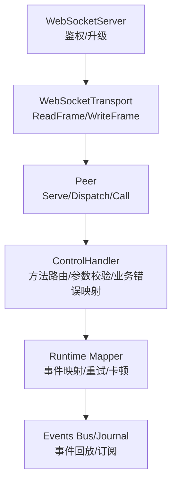
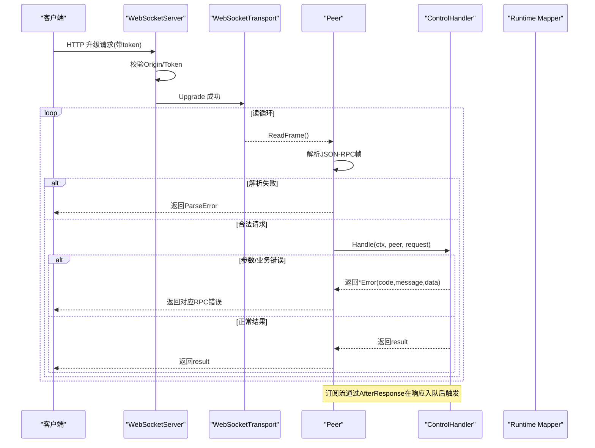
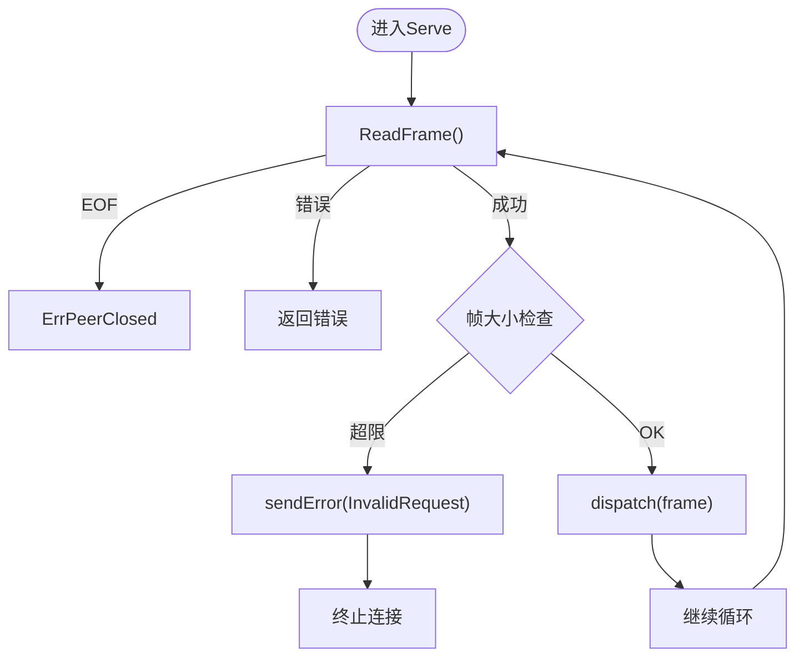
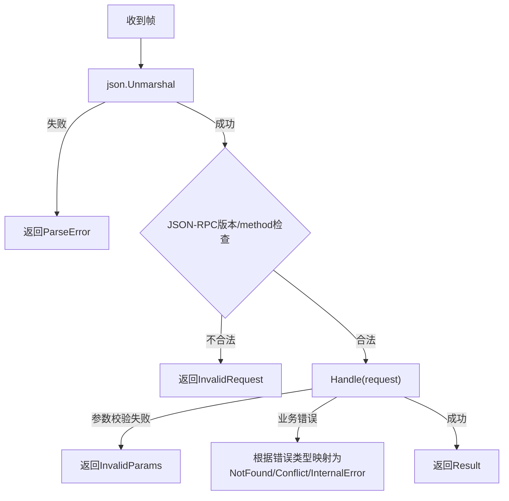
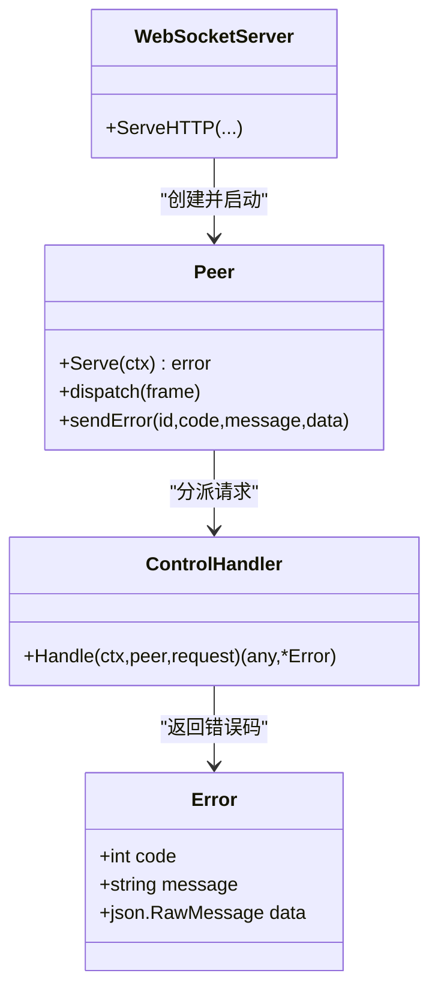

# 错误处理

<cite>
**本文引用的文件**
- [websocket.go](file://internal/rpc/websocket.go)
- [transport.go](file://internal/rpc/transport.go)
- [protocol.go](file://internal/rpc/protocol.go)
- [control.go](file://internal/rpc/control.go)
- [mapper.go](file://internal/runtime/mapper.go)
- [main.go](file://cmd/vivy/main.go)
</cite>

## 目录
1. [简介](#简介)
2. [项目结构](#项目结构)
3. [核心组件](#核心组件)
4. [架构总览](#架构总览)
5. [详细组件分析](#详细组件分析)
6. [依赖关系分析](#依赖关系分析)
7. [性能考量](#性能考量)
8. [故障排查指南](#故障排查指南)
9. [结论](#结论)
10. [附录](#附录)

## 简介
本文件聚焦于 WebSocket 连接与消息层面的错误处理，覆盖连接级错误（连接失败、网络中断、协议错误）与消息级错误（解析错误、参数验证失败、业务逻辑错误），并给出错误分类体系、重试机制、日志记录与监控告警建议，以及调试技巧。内容基于仓库中 RPC 层与运行时事件映射的实现进行归纳与说明。

## 项目结构
WebSocket 错误处理主要分布在以下模块：
- 传输层：WebSocket 与 JSONL 传输封装，负责帧读写与类型校验
- 协议层：JSON-RPC 编解码、请求分发、响应队列、错误码定义
- 控制面：方法路由、参数校验、业务错误到 RPC 错误的映射
- 运行时：事件映射、重试事件、超时/卡顿检测
- 启动入口：全局日志初始化

**图表来源**
- [websocket.go:27-46](file://internal/rpc/websocket.go#L27-L46)
- [transport.go:58-84](file://internal/rpc/transport.go#L58-L84)
- [protocol.go:120-206](file://internal/rpc/protocol.go#L120-L206)
- [control.go:253-353](file://internal/rpc/control.go#L253-L353)
- [mapper.go:74-169](file://internal/runtime/mapper.go#L74-L169)

**章节来源**
- [websocket.go:27-46](file://internal/rpc/websocket.go#L27-L46)
- [transport.go:58-84](file://internal/rpc/transport.go#L58-L84)
- [protocol.go:120-206](file://internal/rpc/protocol.go#L120-L206)
- [control.go:253-353](file://internal/rpc/control.go#L253-L353)
- [mapper.go:74-169](file://internal/runtime/mapper.go#L74-L169)

## 核心组件
- WebSocketServer：HTTP 升级前进行来源策略与 Token 鉴权；升级后创建 Peer 并启动服务循环
- WebSocketTransport：将 WebSocket 帧限制为文本帧，提供 ReadFrame/WriteFrame/Close
- Peer：JSON-RPC 读循环、写循环、请求分发、响应排队、调用等待、关闭清理
- ControlHandler：方法路由、参数解码与校验、业务错误映射为 RPC 错误码
- Runtime Mapper：将引擎事件映射为领域事件，识别可重试错误、取消、工具调用等，并输出卡顿事件

**章节来源**
- [websocket.go:12-46](file://internal/rpc/websocket.go#L12-L46)
- [transport.go:12-84](file://internal/rpc/transport.go#L12-L84)
- [protocol.go:92-206](file://internal/rpc/protocol.go#L92-L206)
- [control.go:253-353](file://internal/rpc/control.go#L253-L353)
- [mapper.go:74-169](file://internal/runtime/mapper.go#L74-L169)

## 架构总览
下图展示从 HTTP 升级到 JSON-RPC 处理的完整链路，以及错误在各层的传播路径。

**图表来源**
- [websocket.go:27-46](file://internal/rpc/websocket.go#L27-L46)
- [transport.go:67-84](file://internal/rpc/transport.go#L67-L84)
- [protocol.go:120-206](file://internal/rpc/protocol.go#L120-L206)
- [control.go:253-353](file://internal/rpc/control.go#L253-L353)

## 详细组件分析

### 连接级错误处理
- 连接建立阶段
  - 来源策略拒绝：直接返回 HTTP 403
  - Token 缺失或非法：直接返回 HTTP 401
  - 升级失败：直接返回 HTTP 错误
- 连接生命周期
  - 读循环遇到 EOF：视为对端关闭，返回“peer closed”
  - 写循环写入失败：停止 Peer 并关闭传输
  - 上下文取消或显式关闭：清理 pending 请求，发送内部错误响应
- 协议约束
  - 帧大小超限：返回 InvalidRequest 并终止该连接
  - 非文本帧：返回协议错误

**图表来源**
- [protocol.go:120-164](file://internal/rpc/protocol.go#L120-L164)
- [transport.go:67-84](file://internal/rpc/transport.go#L67-L84)

**章节来源**
- [websocket.go:27-46](file://internal/rpc/websocket.go#L27-L46)
- [protocol.go:120-164](file://internal/rpc/protocol.go#L120-L164)
- [protocol.go:253-273](file://internal/rpc/protocol.go#L253-L273)
- [protocol.go:359-373](file://internal/rpc/protocol.go#L359-L373)
- [transport.go:67-84](file://internal/rpc/transport.go#L67-L84)

### 消息级错误处理
- 解析错误
  - JSON 无法解析：返回 ParseError
  - 非 JSON-RPC 2.0 或缺少 method：返回 InvalidRequest
- 参数验证失败
  - 各方法内 decodeParams/parseXxxParams 校验必填字段，返回 InvalidParams
- 业务逻辑错误
  - 资源不存在：CodeNotFound
  - 状态冲突：CodeConflict
  - 运行时参数不合法：InvalidParams
  - 其他异常：InternalError

**图表来源**
- [protocol.go:181-206](file://internal/rpc/protocol.go#L181-L206)
- [control.go:948-1000](file://internal/rpc/control.go#L948-L1000)
- [control.go:1336-1369](file://internal/rpc/control.go#L1336-L1369)

**章节来源**
- [protocol.go:181-206](file://internal/rpc/protocol.go#L181-L206)
- [control.go:948-1000](file://internal/rpc/control.go#L948-L1000)
- [control.go:1336-1369](file://internal/rpc/control.go#L1336-L1369)

### 错误分类体系
- 网络/传输类
  - 连接关闭、帧类型错误、写入失败：由传输层与 Peer 统一处理，通常导致连接终止
- 协议类
  - ParseError、InvalidRequest：表示帧或协议格式问题
- 认证/授权类
  - HTTP 401/403：在 WebSocketServer 阶段拦截
- 权限/配置类
  - 未配置能力（如 review store、child controller）：MethodNotFound
- 业务类
  - CodeNotFound、CodeConflict、InvalidParams、InternalError：由控制层映射

**图表来源**
- [protocol.go:34-45](file://internal/rpc/protocol.go#L34-L45)
- [websocket.go:27-46](file://internal/rpc/websocket.go#L27-L46)
- [protocol.go:120-206](file://internal/rpc/protocol.go#L120-L206)
- [control.go:253-353](file://internal/rpc/control.go#L253-L353)

**章节来源**
- [websocket.go:27-46](file://internal/rpc/websocket.go#L27-L46)
- [protocol.go:34-45](file://internal/rpc/protocol.go#L34-L45)
- [control.go:253-353](file://internal/rpc/control.go#L253-L353)

### 错误重试机制
- 服务端侧
  - 当前实现未在服务端内置指数退避重试；Peer 的 outgoing 队列满时返回 ErrOverloaded，调用方可据此决定重试策略
  - 运行时事件映射会产出 provider.retry 事件，用于向客户端暴露底层提供者重试尝试
- 客户端侧（参考仓库中的 Rust 示例）
  - 指数退避：base delay * 2^attempt，带抖动，最大重试次数固定
  - 速率限制：429 立即返回 RateLimited，不进行重试
  - 服务器错误与网络错误：按退避策略重试
- 建议
  - 客户端在收到 ErrOverloaded 或 ProviderRetry 事件时实施指数退避重试
  - 设置最大重试次数与失败降级（例如切换只读模式或提示用户稍后重试）

**章节来源**
- [protocol.go:257-273](file://internal/rpc/protocol.go#L257-L273)
- [mapper.go:74-169](file://internal/runtime/mapper.go#L74-L169)

### 错误日志记录与监控告警
- 日志
  - 进程启动时设置全局 slog 默认 logger，所有模块使用标准库日志
  - 运行时 mapper 对事件负载截断、序列化失败等关键路径有 warn/error 日志
- 监控与告警建议
  - 统计 RPC 错误码分布（ParseError、InvalidRequest、InvalidParams、CodeNotFound、CodeConflict、InternalError）
  - 监控 Peer 关闭原因（EOF、写入失败、上下文取消）
  - 监控 outgoing 队列溢出频率（ErrOverloaded）
  - 订阅 run/event 中的 provider.retry、provider.stall 事件，作为可用性指标
  - 对高频错误（如 InvalidParams、InternalError）设置阈值告警

**章节来源**
- [main.go:36-71](file://cmd/vivy/main.go#L36-L71)
- [mapper.go:377-402](file://internal/runtime/mapper.go#L377-L402)

### 完整的错误处理流程与代码片段路径
- 连接级
  - 鉴权与升级：[websocket.go:27-46](file://internal/rpc/websocket.go#L27-L46)
  - 帧类型校验：[transport.go:67-84](file://internal/rpc/transport.go#L67-L84)
  - 读循环与帧大小限制：[protocol.go:120-164](file://internal/rpc/protocol.go#L120-L164)
  - 写循环与关闭清理：[protocol.go:166-179](file://internal/rpc/protocol.go#L166-L179), [protocol.go:359-373](file://internal/rpc/protocol.go#L359-L373)
- 消息级
  - 解析与协议校验：[protocol.go:181-206](file://internal/rpc/protocol.go#L181-L206)
  - 参数校验：[control.go:948-1000](file://internal/rpc/control.go#L948-L1000)
  - 业务错误映射：[control.go:1336-1369](file://internal/rpc/control.go#L1336-L1369)
- 重试与卡顿
  - 重试事件：[mapper.go:74-169](file://internal/runtime/mapper.go#L74-L169)
  - 卡顿事件：[mapper.go:157-159](file://internal/runtime/mapper.go#L157-L159)

**章节来源**
- [websocket.go:27-46](file://internal/rpc/websocket.go#L27-L46)
- [transport.go:67-84](file://internal/rpc/transport.go#L67-L84)
- [protocol.go:120-206](file://internal/rpc/protocol.go#L120-L206)
- [protocol.go:166-179](file://internal/rpc/protocol.go#L166-L179)
- [protocol.go:359-373](file://internal/rpc/protocol.go#L359-L373)
- [control.go:948-1000](file://internal/rpc/control.go#L948-L1000)
- [control.go:1336-1369](file://internal/rpc/control.go#L1336-L1369)
- [mapper.go:74-169](file://internal/runtime/mapper.go#L74-L169)

## 依赖关系分析
- WebSocketServer 依赖 OriginPolicy 与 Token 进行访问控制
- WebSocketTransport 依赖 gorilla/websocket 进行帧收发
- Peer 依赖 Transport 接口，解耦具体传输实现
- ControlHandler 依赖多个存储与服务，将业务错误映射为 RPC 错误
- Runtime Mapper 依赖 Eino ADK 事件，将其转换为 Vivy 领域事件

**图表来源**
- [websocket.go:27-46](file://internal/rpc/websocket.go#L27-L46)
- [transport.go:58-84](file://internal/rpc/transport.go#L58-L84)
- [protocol.go:92-206](file://internal/rpc/protocol.go#L92-L206)
- [control.go:253-353](file://internal/rpc/control.go#L253-L353)
- [mapper.go:74-169](file://internal/runtime/mapper.go#L74-L169)

**章节来源**
- [websocket.go:27-46](file://internal/rpc/websocket.go#L27-L46)
- [transport.go:58-84](file://internal/rpc/transport.go#L58-L84)
- [protocol.go:92-206](file://internal/rpc/protocol.go#L92-L206)
- [control.go:253-353](file://internal/rpc/control.go#L253-L353)
- [mapper.go:74-169](file://internal/runtime/mapper.go#L74-L169)

## 性能考量
- 帧大小限制：防止超大消息导致内存压力
- 出队缓冲：OutgoingBuffer 限制并发写，避免背压导致雪崩
- 文本帧强制：减少二进制帧处理开销
- 事件负载裁剪：对 delta/reasoning 等大负载进行截断，降低带宽占用

**章节来源**
- [protocol.go:70-83](file://internal/rpc/protocol.go#L70-L83)
- [protocol.go:158-161](file://internal/rpc/protocol.go#L158-L161)
- [transport.go:67-84](file://internal/rpc/transport.go#L67-L84)
- [mapper.go:377-402](file://internal/runtime/mapper.go#L377-L402)

## 故障排查指南
- 常见问题定位
  - 连接被拒绝：检查 Origin 策略与 Token 传递方式（URL 查询或 Authorization 头）
  - 频繁断开：关注 Peer 关闭原因（EOF、写入失败）、网络稳定性
  - 大量 InvalidParams：检查客户端参数结构与必填字段
  - InternalError：查看服务端日志，定位具体异常点
- 调试技巧
  - 启用结构化日志：确保 slog 已配置 JSON 输出，便于检索
  - 订阅 run/event：观察 provider.retry、provider.stall 事件，辅助判断后端延迟或重试
  - 抓包与帧级别日志：确认 WebSocket 帧类型为文本且符合 JSON-RPC 规范
  - 重放事件：利用 after_seq 从 Journal 回放历史事件，复现问题

**章节来源**
- [websocket.go:27-46](file://internal/rpc/websocket.go#L27-L46)
- [protocol.go:120-164](file://internal/rpc/protocol.go#L120-L164)
- [control.go:878-946](file://internal/rpc/control.go#L878-L946)
- [main.go:36-71](file://cmd/vivy/main.go#L36-L71)

## 结论
本项目的 WebSocket 错误处理以传输层与协议层为核心，结合控制层的参数与业务错误映射，形成清晰的错误分类与处理路径。服务端通过帧大小限制、出队缓冲与文本帧强制保障稳定性；运行时事件映射提供重试与卡顿信号，便于客户端实施指数退避与降级策略。配合结构化日志与事件回放，可有效支撑问题定位与系统监控。

## 附录
- 错误码速查
  - ParseError：-32700
  - InvalidRequest：-32600
  - MethodNotFound：-32601
  - InvalidParams：-32602
  - InternalError：-32603
  - ServerOverload：-32001
  - CodeNotFound：-32004
  - CodeConflict：-32009

**章节来源**
- [protocol.go:20-27](file://internal/rpc/protocol.go#L20-L27)
- [control.go:22-25](file://internal/rpc/control.go#L22-L25)