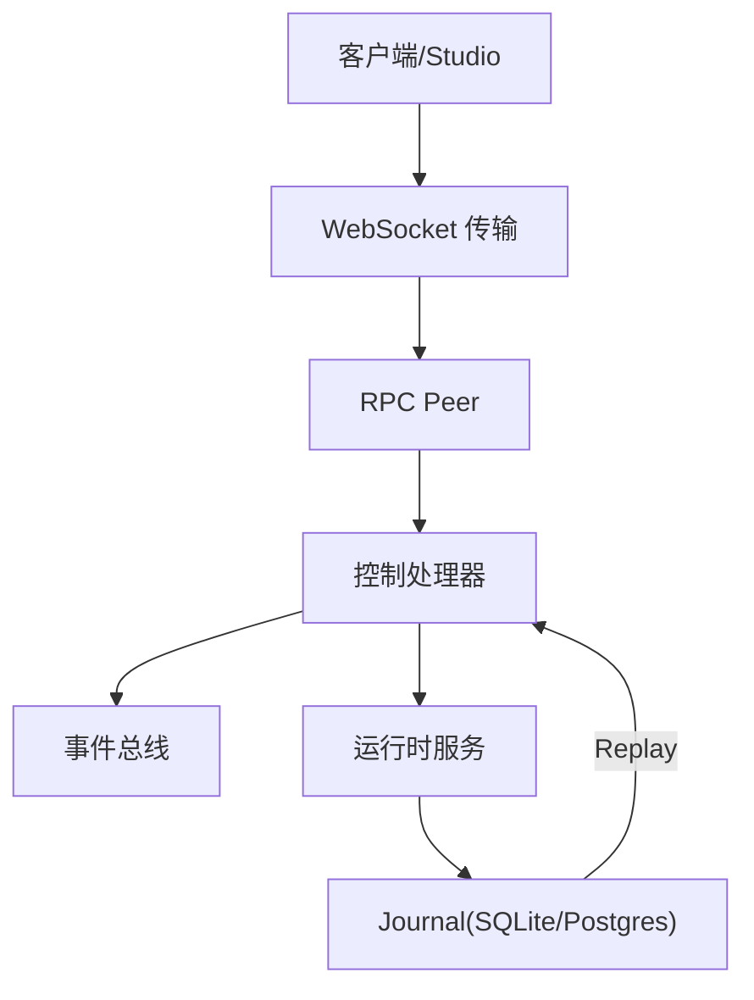
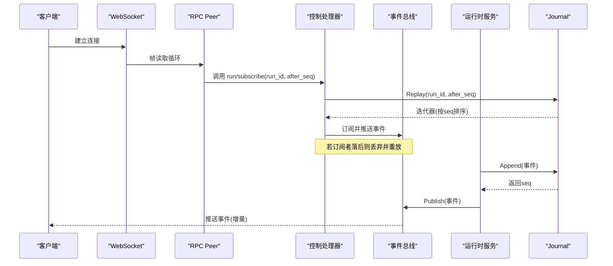
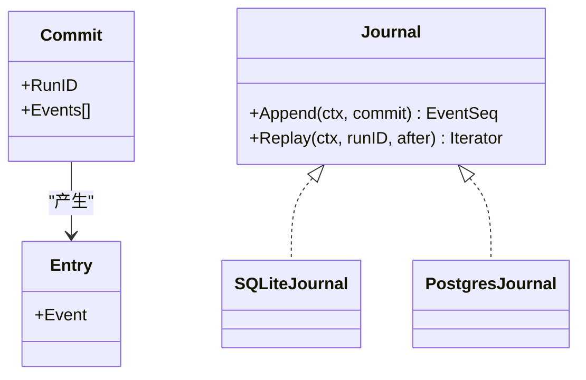
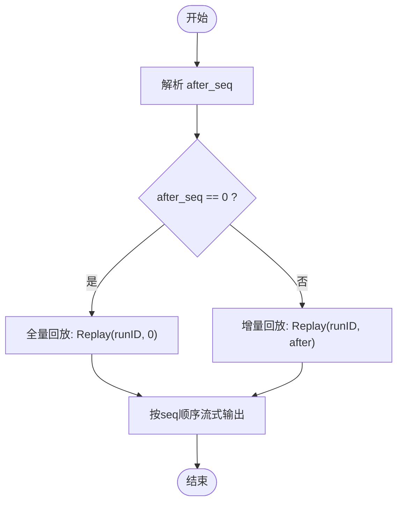
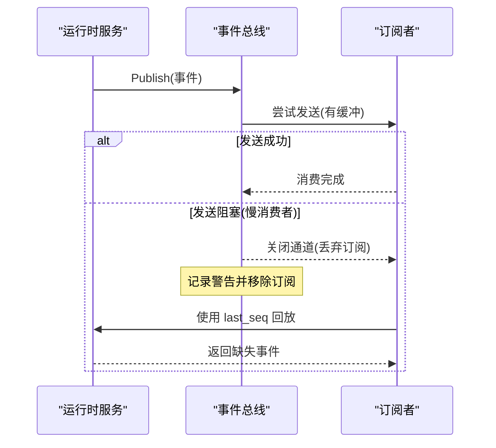
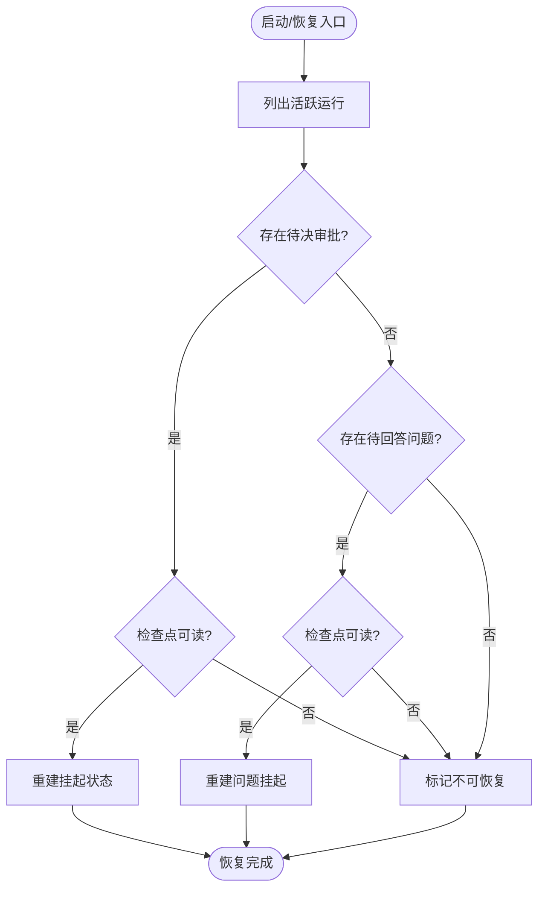
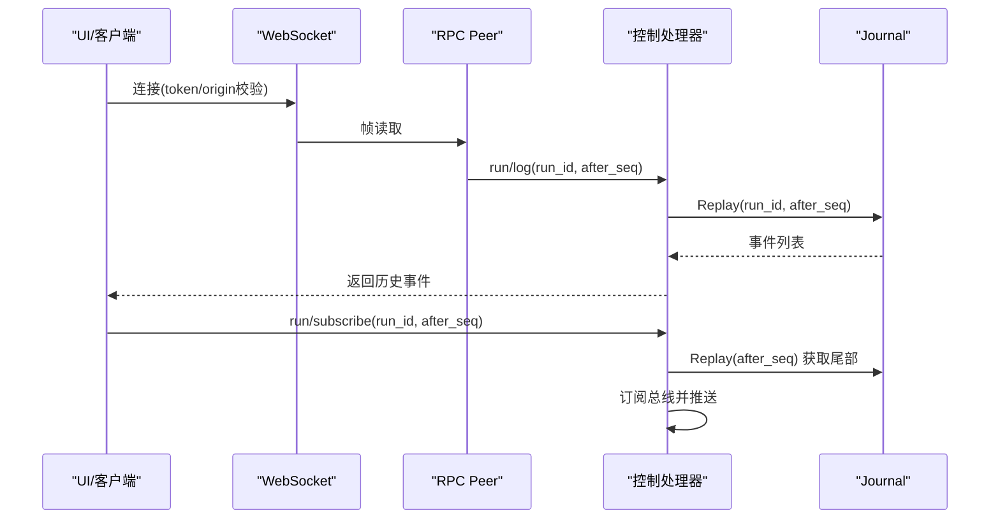
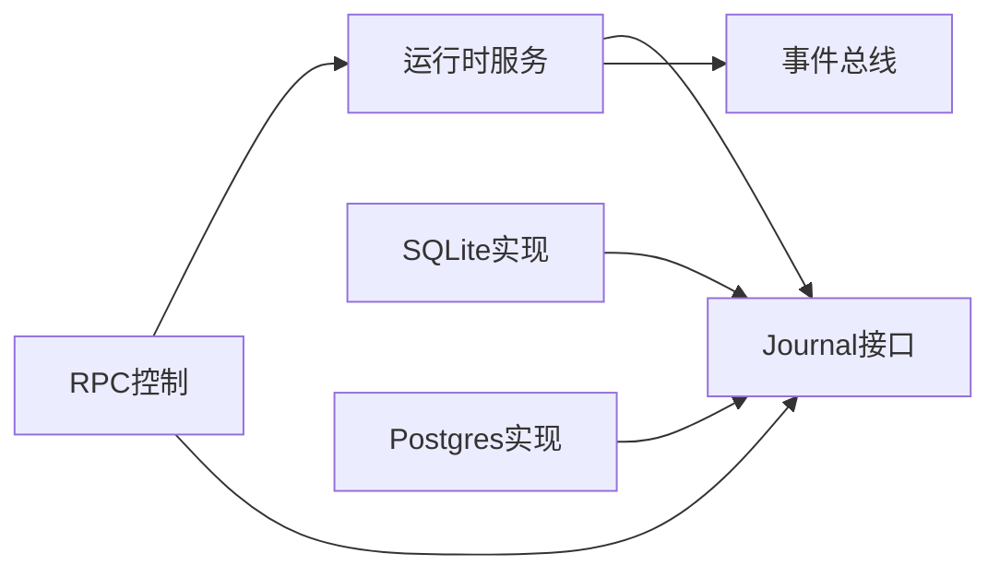

# 事件回放机制

<cite>
**本文引用的文件**
- [internal/storage/contracts.go](file://internal/storage/contracts.go)
- [internal/domain/event.go](file://internal/domain/event.go)
- [internal/events/bus.go](file://internal/events/bus.go)
- [internal/storage/sqlite/journal.go](file://internal/storage/sqlite/journal.go)
- [internal/storage/postgres/journal.go](file://internal/storage/postgres/journal.go)
- [internal/runtime/service.go](file://internal/runtime/service.go)
- [internal/rpc/control.go](file://internal/rpc/control.go)
- [internal/rpc/websocket.go](file://internal/rpc/websocket.go)
- [internal/rpc/protocol.go](file://internal/rpc/protocol.go)
- [internal/storage/conformance/suite.go](file://internal/storage/conformance/suite.go)
</cite>

## 目录
1. [简介](#简介)
2. [项目结构](#项目结构)
3. [核心组件](#核心组件)
4. [架构总览](#架构总览)
5. [详细组件分析](#详细组件分析)
6. [依赖关系分析](#依赖关系分析)
7. [性能考虑](#性能考虑)
8. [故障排除指南](#故障排除指南)
9. [结论](#结论)
10. [附录](#附录)

## 简介
本文件系统性阐述 Vivy 的事件回放机制，围绕“事件溯源”模式与“Journal 作为单一事实源”的设计展开。重点说明 after_seq 游标机制、慢消费者恢复策略、增量与全量回放路径、以及回放性能优化手段。同时给出典型使用场景（客户端重连同步、调试历史查看、审计日志回放）和常见问题排查方法。

## 项目结构
事件回放贯穿存储层、运行时服务与 RPC 控制面：
- 存储层提供 Journal 接口与 SQLite/Postgres 实现，负责事件的追加与按游标回放。
- 运行时服务将事件持久化后发布到总线，并驱动引擎工作；支持启动恢复与后台挂起恢复。
- RPC 控制面暴露 run/subscribe、run/log 等能力，供客户端订阅实时事件或拉取历史事件。

图表来源
- [internal/rpc/websocket.go:27-47](file://internal/rpc/websocket.go#L27-L47)
- [internal/rpc/protocol.go:120-164](file://internal/rpc/protocol.go#L120-L164)
- [internal/rpc/control.go:253-353](file://internal/rpc/control.go#L253-L353)
- [internal/runtime/service.go:212-300](file://internal/runtime/service.go#L212-L300)
- [internal/storage/sqlite/journal.go:18-86](file://internal/storage/sqlite/journal.go#L18-L86)
- [internal/storage/postgres/journal.go:18-90](file://internal/storage/postgres/journal.go#L18-L90)

章节来源
- [internal/storage/contracts.go:55-64](file://internal/storage/contracts.go#L55-L64)
- [internal/storage/sqlite/journal.go:18-86](file://internal/storage/sqlite/journal.go#L18-L86)
- [internal/storage/postgres/journal.go:18-90](file://internal/storage/postgres/journal.go#L18-L90)
- [internal/runtime/service.go:212-300](file://internal/runtime/service.go#L212-L300)
- [internal/rpc/control.go:253-353](file://internal/rpc/control.go#L253-L353)

## 核心组件
- Journal 接口与 Entry/Commit 模型：定义追加与回放契约，保证顺序、单调递增的 seq，以及“每个 Run 恰好一个终态事件”的不变式。
- 领域事件类型：统一事件词汇表，区分普通事件与终态事件，并提供运行状态映射。
- 事件总线：将已持久化的事件广播给在线订阅者；对慢消费者采用丢弃策略，确保其通过 Journal 回放恢复。
- SQLite/Postgres Journal 实现：在事务中校验不变式、分配连续 seq，并按 after_seq 过滤回放。
- 运行时服务：先持久化事件再发布；支持启动恢复、后台挂起恢复；维护活跃与挂起运行集合。
- RPC 控制面：提供 run/subscribe（增量）、run/log（按 after_seq 拉取历史）等方法，配合 WebSocket 传输。

章节来源
- [internal/storage/contracts.go:33-64](file://internal/storage/contracts.go#L33-L64)
- [internal/domain/event.go:3-129](file://internal/domain/event.go#L3-L129)
- [internal/events/bus.go:10-115](file://internal/events/bus.go#L10-L115)
- [internal/storage/sqlite/journal.go:18-116](file://internal/storage/sqlite/journal.go#L18-L116)
- [internal/storage/postgres/journal.go:18-120](file://internal/storage/postgres/journal.go#L18-L120)
- [internal/runtime/service.go:212-300](file://internal/runtime/service.go#L212-L300)
- [internal/rpc/control.go:253-353](file://internal/rpc/control.go#L253-L353)

## 架构总览
事件从运行时写入 Journal，随后发布到总线；客户端可通过 RPC 订阅实时事件或回放历史。after_seq 是回放一致性锚点，确保增量回放不丢不重。

图表来源
- [internal/rpc/websocket.go:27-47](file://internal/rpc/websocket.go#L27-L47)
- [internal/rpc/protocol.go:120-164](file://internal/rpc/protocol.go#L120-L164)
- [internal/rpc/control.go:253-353](file://internal/rpc/control.go#L253-L353)
- [internal/storage/sqlite/journal.go:77-86](file://internal/storage/sqlite/journal.go#L77-L86)
- [internal/storage/postgres/journal.go:81-90](file://internal/storage/postgres/journal.go#L81-L90)
- [internal/events/bus.go:46-75](file://internal/events/bus.go#L46-L75)
- [internal/runtime/service.go:268-278](file://internal/runtime/service.go#L268-L278)

## 详细组件分析

### Journal 与事件模型
- Commit/Entry：一次原子追加包含多个事件；回放以 Entry 为单位。
- 不变式：
  - 每个 Run 最多一个终态事件，且已有终态后拒绝后续追加。
  - seq 单调递增且连续，无空洞。
- 回放：Replay(runID, after) 返回迭代器，按 seq 升序返回大于 after 的事件。

图表来源
- [internal/storage/contracts.go:33-64](file://internal/storage/contracts.go#L33-L64)
- [internal/storage/sqlite/journal.go:18-86](file://internal/storage/sqlite/journal.go#L18-L86)
- [internal/storage/postgres/journal.go:18-90](file://internal/storage/postgres/journal.go#L18-L90)

章节来源
- [internal/storage/contracts.go:33-64](file://internal/storage/contracts.go#L33-L64)
- [internal/storage/sqlite/journal.go:18-86](file://internal/storage/sqlite/journal.go#L18-L86)
- [internal/storage/postgres/journal.go:18-90](file://internal/storage/postgres/journal.go#L18-L90)

### after_seq 游标机制
- 增量回放：客户端携带 last_seen_seq，服务端调用 Replay(runID, after=last_seen_seq)，仅返回 seq > after 的事件，避免重复。
- 全量同步：after=0 时从头回放，用于首次连接或需要完整历史的场景。
- 一致性保障：seq 单调连续，终端事件唯一，确保最终一致性与幂等性。

图表来源
- [internal/storage/sqlite/journal.go:77-86](file://internal/storage/sqlite/journal.go#L77-L86)
- [internal/storage/postgres/journal.go:81-90](file://internal/storage/postgres/journal.go#L81-L90)
- [internal/storage/conformance/suite.go:527-548](file://internal/storage/conformance/suite.go#L527-L548)

章节来源
- [internal/storage/sqlite/journal.go:77-86](file://internal/storage/sqlite/journal.go#L77-L86)
- [internal/storage/postgres/journal.go:81-90](file://internal/storage/postgres/journal.go#L81-L90)
- [internal/storage/conformance/suite.go:527-548](file://internal/storage/conformance/suite.go#L527-L548)

### 慢消费者恢复机制
- 实时通道保护：事件总线为每个订阅者维护带缓冲的通道；当发送阻塞（消费者处理过慢），直接关闭该订阅并记录告警，防止拖垮生产者。
- 恢复策略：客户端检测到通道关闭后，使用最后看到的 seq 调用 run/log 或重新 subscribe 进行回放，保证无丢失。
- 设计要点：总线不持有历史，只负责分发；历史权威来自 Journal。

图表来源
- [internal/events/bus.go:46-75](file://internal/events/bus.go#L46-L75)
- [internal/rpc/control.go:661-671](file://internal/rpc/control.go#L661-L671)

章节来源
- [internal/events/bus.go:10-115](file://internal/events/bus.go#L10-L115)
- [internal/rpc/control.go:661-671](file://internal/rpc/control.go#L661-L671)

### 运行时服务中的回放与恢复
- 持久化优先：事件先写入 Journal，再发布到总线，确保可见性建立在持久化之上。
- 启动恢复：进程重启后扫描未终态运行，结合待决审批/问题与检查点可读性，重建挂起状态或失败关闭。
- 预算与策略：恢复过程中基于 Journal 回放重建预算账本，避免越权或超支。

图表来源
- [internal/runtime/service.go:465-576](file://internal/runtime/service.go#L465-L576)
- [internal/runtime/service.go:785-800](file://internal/runtime/service.go#L785-L800)

章节来源
- [internal/runtime/service.go:212-300](file://internal/runtime/service.go#L212-L300)
- [internal/runtime/service.go:465-576](file://internal/runtime/service.go#L465-L576)
- [internal/runtime/service.go:785-800](file://internal/runtime/service.go#L785-L800)

### RPC 回放与订阅
- run/subscribe：建立实时订阅，支持 after_seq 增量回放；后端通过事件总线推送新事件。
- run/log：按 after_seq 拉取历史事件，适合断线重连后的补全。
- WebSocket 传输：提供鉴权与帧大小限制，保证稳定传输。

图表来源
- [internal/rpc/websocket.go:27-47](file://internal/rpc/websocket.go#L27-L47)
- [internal/rpc/protocol.go:120-164](file://internal/rpc/protocol.go#L120-L164)
- [internal/rpc/control.go:661-671](file://internal/rpc/control.go#L661-L671)
- [internal/storage/sqlite/journal.go:77-86](file://internal/storage/sqlite/journal.go#L77-L86)

章节来源
- [internal/rpc/websocket.go:27-47](file://internal/rpc/websocket.go#L27-L47)
- [internal/rpc/protocol.go:120-164](file://internal/rpc/protocol.go#L120-L164)
- [internal/rpc/control.go:661-671](file://internal/rpc/control.go#L661-L671)

## 依赖关系分析
- 运行时服务依赖 Journal、消息存储、运行存储、事件总线等；通过 ServiceDeps 注入，保持松耦合。
- RPC 控制处理器依赖运行时服务与存储，对外暴露能力；事件总线作为可选的实时通道。
- 存储实现（SQLite/Postgres）遵循同一 Journal 接口，便于替换与扩展。

图表来源
- [internal/runtime/service.go:70-94](file://internal/runtime/service.go#L70-L94)
- [internal/rpc/control.go:27-50](file://internal/rpc/control.go#L27-L50)
- [internal/storage/contracts.go:252-273](file://internal/storage/contracts.go#L252-L273)

章节来源
- [internal/runtime/service.go:70-94](file://internal/runtime/service.go#L70-L94)
- [internal/rpc/control.go:27-50](file://internal/rpc/control.go#L27-L50)
- [internal/storage/contracts.go:252-273](file://internal/storage/contracts.go#L252-L273)

## 性能考虑
- 批量读取与流式回放：Replay 返回迭代器，按行流式扫描，避免一次性加载全部事件到内存。
- 索引优化：按 run_id 与 seq 查询并 ORDER BY seq，建议数据库层面针对 (run_id, seq) 建立索引以提升回放性能。
- 内存管理：迭代器持有数据库行句柄，需在完成后及时 Close，避免资源泄漏。
- 总线缓冲：事件总线为每个订阅者设置有限缓冲，防止慢消费者阻塞整体流程。
- 事务与锁：Postgres 实现使用事务内排他锁保证并发追加的一致性；SQLite 通过事务保证原子性。

[本节为通用性能指导，无需特定文件引用]

## 故障排除指南
- 无法追加事件：
  - 现象：返回“无效提交”或“运行已关闭”。
  - 原因：提交为空、包含多个终态事件，或目标运行已有终态事件。
  - 处理：检查事件类型与运行状态，确保每个运行仅有一个终态事件。
- 回放结果为空：
  - 现象：after_seq 之后无事件返回。
  - 可能原因：after_seq 过大或运行已结束且无新增事件。
  - 处理：核对 last_seen_seq，必要时使用 after=0 进行全量回放。
- 客户端掉线后状态不一致：
  - 现象：重连后缺少部分事件。
  - 处理：客户端保存 last_seq，重连后调用 run/log 或 run/subscribe 指定 after_seq 进行增量补全。
- 总线订阅被关闭：
  - 现象：订阅通道关闭，收到告警。
  - 处理：视为慢消费者，切换到 Journal 回放恢复；避免长时间阻塞事件处理。
- 启动恢复失败：
  - 现象：运行被标记为不可恢复。
  - 原因：检查点不可读、存在冲突的待决项或环境异常。
  - 处理：检查检查点可用性、审批/问题过期情况，必要时人工干预。

章节来源
- [internal/storage/sqlite/journal.go:18-46](file://internal/storage/sqlite/journal.go#L18-L46)
- [internal/storage/postgres/journal.go:18-50](file://internal/storage/postgres/journal.go#L18-L50)
- [internal/events/bus.go:46-75](file://internal/events/bus.go#L46-L75)
- [internal/runtime/service.go:465-576](file://internal/runtime/service.go#L465-L576)
- [internal/rpc/control.go:661-671](file://internal/rpc/control.go#L661-L671)

## 结论
Vivy 的事件回放机制以 Journal 为核心，通过 after_seq 游标实现可靠的增量与全量回放；事件总线提供高效实时分发并对慢消费者采取安全降级。运行时服务确保持久化优先与稳健恢复，RPC 控制面提供一致的访问接口。该设计在保证一致性的同时兼顾了可扩展性与可观测性，适用于生产环境的审计、调试与状态同步需求。

## 附录
- 典型使用场景
  - 客户端重连后的状态同步：保存 last_seq，重连后调用 run/log 或 run/subscribe 指定 after_seq 进行增量回放。
  - 调试时的历史事件查看：使用 run/log 拉取指定范围的历史事件，辅助定位问题。
  - 审计日志的回放分析：基于 Journal 的不可变性与单调序列，构建审计视图与分析工具。

[本节为概念性内容，无需特定文件引用]