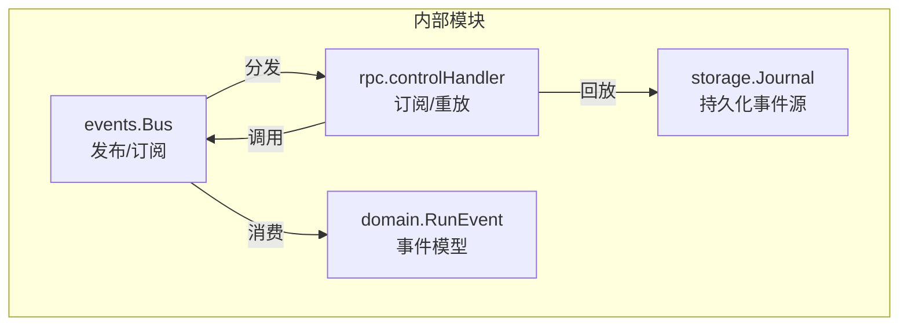
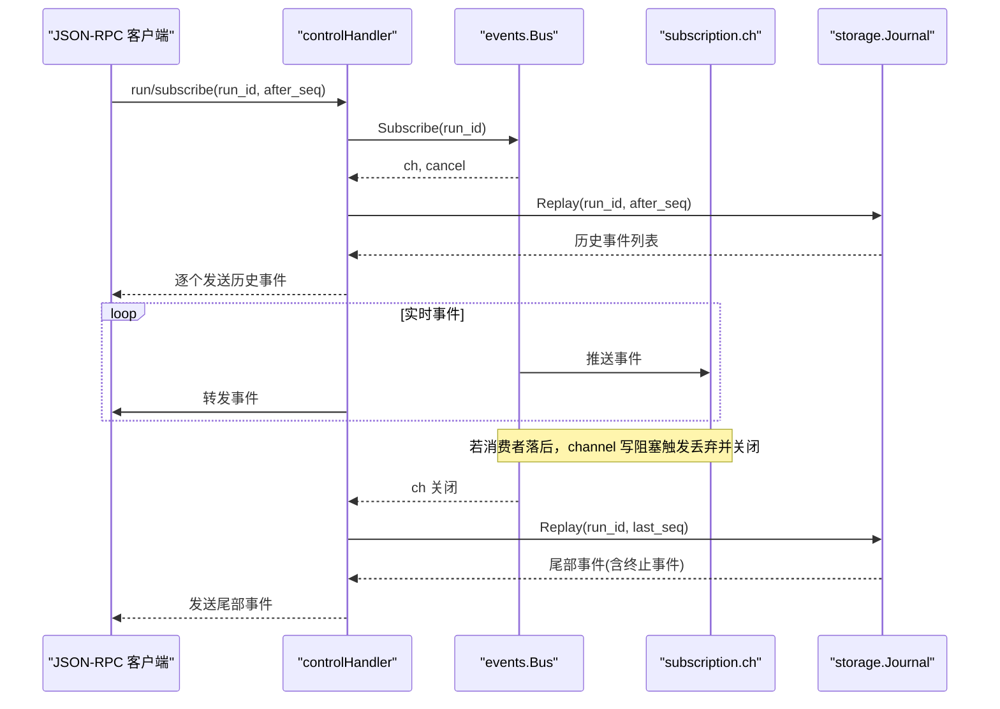
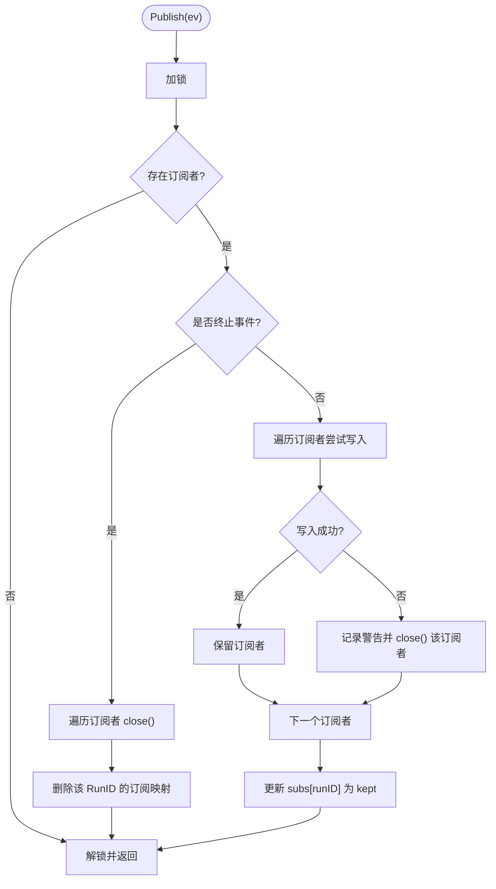
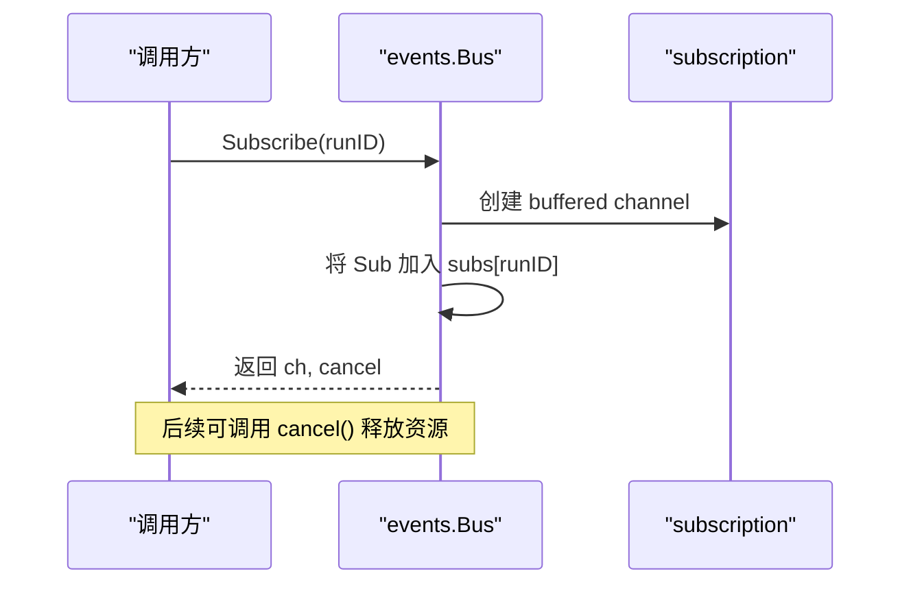
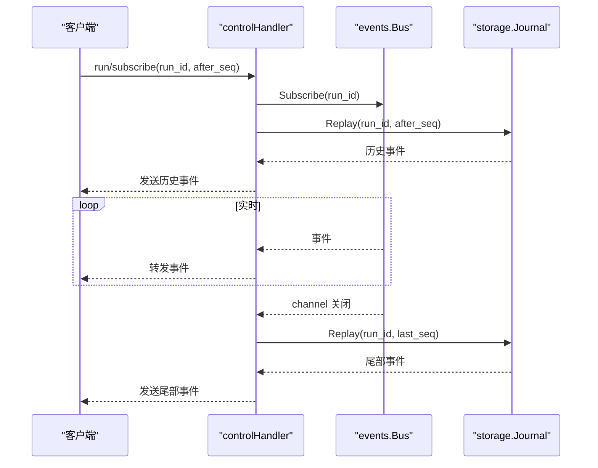
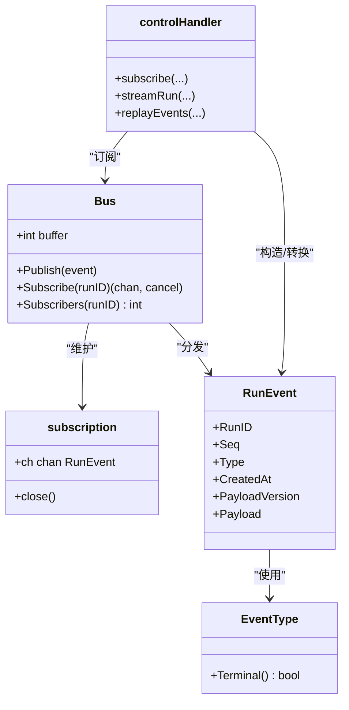

# 事件总线

<cite>
**本文引用的文件**
- [internal/events/bus.go](file://internal/events/bus.go)
- [internal/events/doc.go](file://internal/events/doc.go)
- [internal/events/bus_test.go](file://internal/events/bus_test.go)
- [internal/domain/event.go](file://internal/domain/event.go)
- [internal/rpc/control.go](file://internal/rpc/control.go)
</cite>

## 目录
1. [简介](#简介)
2. [项目结构](#项目结构)
3. [核心组件](#核心组件)
4. [架构总览](#架构总览)
5. [详细组件分析](#详细组件分析)
6. [依赖关系分析](#依赖关系分析)
7. [性能考量](#性能考量)
8. [故障排查指南](#故障排查指南)
9. [结论](#结论)
10. [附录：使用示例与最佳实践](#附录使用示例与最佳实践)

## 简介
本文件围绕 internal/events 包中的事件总线（Bus）进行系统化文档化，重点解释其发布-订阅模式实现、缓冲机制、并发安全控制、Subscribe/Publish 的工作流程、终端事件处理、落后消费者丢弃策略，以及 subscription 的生命周期管理。同时结合 RPC 层对事件的订阅与重放，给出错误处理、性能优化建议、测试策略与监控指标。

## 项目结构
事件总线位于 internal/events 包，提供按 RunID 分发的内存级实时事件通道；RPC 层在 control.go 中通过 Bus.Subscribe 建立流式推送，并结合 Journal 回放保证断线重连的幂等性与一致性。领域模型 internal/domain/event.go 定义了事件类型、终止事件判定及事件结构。

图表来源
- [internal/events/bus.go:10-21](file://internal/events/bus.go#L10-L21)
- [internal/rpc/control.go:836-930](file://internal/rpc/control.go#L836-L930)
- [internal/domain/event.go:118-129](file://internal/domain/event.go#L118-L129)

章节来源
- [internal/events/doc.go:1-12](file://internal/events/doc.go#L1-L12)
- [internal/events/bus.go:10-21](file://internal/events/bus.go#L10-L21)
- [internal/rpc/control.go:836-930](file://internal/rpc/control.go#L836-L930)
- [internal/domain/event.go:118-129](file://internal/domain/event.go#L118-L129)

## 核心组件
- Bus：按 RunID 维护多个订阅者，提供 Publish/Subscribe/Subscribers。
- subscription：封装带缓冲的 channel 与关闭保护（closeOnce），确保仅一次关闭。
- domain.RunEvent：事件载体，包含 RunID、单调递增 Seq、Type、CreatedAt、PayloadVersion、Payload。
- rpc.controlHandler：负责 JSON-RPC 订阅、回放、向客户端推送事件，并在 Bus 通道关闭后回放尾部事件以补全终止事件。

章节来源
- [internal/events/bus.go:16-28](file://internal/events/bus.go#L16-L28)
- [internal/domain/event.go:118-129](file://internal/domain/event.go#L118-L129)
- [internal/rpc/control.go:836-930](file://internal/rpc/control.go#L836-L930)

## 架构总览
事件总线作为“纯优化”的内存广播层，不拥有历史；Journal 是单一事实来源。RPC 层在 subscribe 时先回放 after_seq 之后的历史，再订阅 Bus 接收后续事件；当 Bus 通道关闭（终端事件或消费者落后被丢弃）时，再次回放尾部事件以确保客户端收到完整的终止事件。

图表来源
- [internal/rpc/control.go:836-930](file://internal/rpc/control.go#L836-L930)
- [internal/events/bus.go:46-75](file://internal/events/bus.go#L46-L75)
- [internal/events/bus.go:81-105](file://internal/events/bus.go#L81-L105)

## 详细组件分析

### Bus 设计原理与并发安全
- 数据结构
  - Bus 持有 buffer 大小与 map[RunID][]*subscription。
  - subscription 包含带缓冲的 channel 和 closeOnce，保证只关闭一次。
- 并发控制
  - 所有对 subs 的读写均受互斥锁保护，避免竞态。
  - closeOnce 防止 terminal publish、drop、cancel 三者并发导致的重复关闭。
- 缓冲机制
  - 每个订阅者的 channel 容量为 bus.buffer，默认至少为 1。
  - 写入采用非阻塞 select/default，若无法立即写入则视为“落后”，关闭该订阅并从 subs 中移除。
- 终止事件
  - 遇到 Terminal 事件，对所有订阅者执行 close()，并删除该 RunID 下的全部订阅。
- 无订阅者时的 Publish
  - 若无订阅者直接返回，避免无意义开销。

图表来源
- [internal/events/bus.go:46-75](file://internal/events/bus.go#L46-L75)

章节来源
- [internal/events/bus.go:16-28](file://internal/events/bus.go#L16-L28)
- [internal/events/bus.go:34-40](file://internal/events/bus.go#L34-L40)
- [internal/events/bus.go:46-75](file://internal/events/bus.go#L46-L75)

### Subscribe 工作流程
- 创建带缓冲的 channel 并注册到对应 RunID 的订阅列表。
- 返回 channel 与 cancel 函数；cancel 会安全地移除自身并关闭 channel。
- 支持多次 cancel 调用（内部 once 保护）。

图表来源
- [internal/events/bus.go:81-105](file://internal/events/bus.go#L81-L105)

章节来源
- [internal/events/bus.go:81-105](file://internal/events/bus.go#L81-L105)

### 终端事件处理与落后消费者丢弃策略
- 终端事件：运行结束时，Bus 关闭所有订阅并清理映射，确保流结束。
- 落后消费者：当订阅者消费速度跟不上生产者时，写入 channel 失败，Bus 记录告警日志并关闭该订阅者，从映射中剔除；客户端需通过 RPC 回放恢复。

章节来源
- [internal/events/bus.go:54-75](file://internal/events/bus.go#L54-L75)
- [internal/events/bus_test.go:50-67](file://internal/events/bus_test.go#L50-L67)

### subscription 生命周期管理
- 创建：Subscribe 时创建带缓冲 channel。
- 正常消费：从 channel 读取事件。
- 异常/结束：
  - 终止事件：由 Bus 统一关闭。
  - 落后丢弃：由 Bus 关闭。
  - 显式取消：cancel 关闭并移除。
- 资源清理：closeOnce 确保仅关闭一次；cancel 中移除映射并清理空映射项。

章节来源
- [internal/events/bus.go:23-32](file://internal/events/bus.go#L23-L32)
- [internal/events/bus.go:87-105](file://internal/events/bus.go#L87-L105)

### RPC 层的事件订阅与重放
- subscribe：解析参数，创建上下文与 cancel，注册到 handler 的 subscriptions 表，异步启动 streamRun。
- streamRun：
  - 先回放 after_seq 之后的历史事件并发送给客户端。
  - 订阅 Bus 的 channel，持续转发新事件。
  - 当 channel 关闭（包括终端事件或落后丢弃），再次回放 last_seq 之后的尾部事件，确保客户端收到终止事件。
- replayEvents：基于 storage.Journal.Replay 获取事件序列。

图表来源
- [internal/rpc/control.go:836-930](file://internal/rpc/control.go#L836-L930)

章节来源
- [internal/rpc/control.go:836-930](file://internal/rpc/control.go#L836-L930)

## 依赖关系分析
- events.Bus 依赖 domain.RunEvent 作为事件载体。
- rpc.controlHandler 依赖 events.Bus 与 storage.Journal，完成回放+实时推送。
- 事件类型与终止判断来自 domain.EventType.Terminal()。

图表来源
- [internal/events/bus.go:16-28](file://internal/events/bus.go#L16-L28)
- [internal/domain/event.go:118-129](file://internal/domain/event.go#L118-L129)
- [internal/rpc/control.go:836-930](file://internal/rpc/control.go#L836-L930)

章节来源
- [internal/events/bus.go:16-28](file://internal/events/bus.go#L16-L28)
- [internal/domain/event.go:83-102](file://internal/domain/event.go#L83-L102)
- [internal/rpc/control.go:836-930](file://internal/rpc/control.go#L836-L930)

## 性能考量
- 缓冲大小：NewBus 的 buffer 应依据预期峰值吞吐设置，过小会导致频繁丢弃，过大增加内存占用。
- 非阻塞写入：Publish 中对慢消费者直接丢弃，避免阻塞生产者，保障整体吞吐。
- 锁粒度：Publish/Subscribe 使用细粒度互斥锁，减少竞争面。
- 回放成本：RPC 层在 channel 关闭后回放尾部事件，应避免高频重放大段历史；合理设置 after_seq 可减少回放量。
- 日志开销：落后丢弃会记录警告日志，生产环境注意日志级别与采样。

## 故障排查指南
- 现象：客户端未收到终止事件
  - 检查 Bus 是否因落后丢弃关闭了 channel；确认客户端是否在 channel 关闭后执行了尾部回放。
  - 参考路径：[internal/rpc/control.go:905-930](file://internal/rpc/control.go#L905-L930)
- 现象：订阅者数量异常增长
  - 检查是否正确调用 cancel；确认没有重复注册且及时释放。
  - 参考路径：[internal/events/bus.go:87-105](file://internal/events/bus.go#L87-L105)
- 现象：事件顺序错乱或缺失
  - 确认客户端按 after_seq 增量推进 last；检查回放与实时推送的顺序。
  - 参考路径：[internal/rpc/control.go:878-930](file://internal/rpc/control.go#L878-L930)
- 现象：高负载下大量丢弃
  - 调整 Bus 缓冲大小；优化消费者处理逻辑；必要时拆分订阅维度。
  - 参考路径：[internal/events/bus.go:61-75](file://internal/events/bus.go#L61-L75)

章节来源
- [internal/rpc/control.go:878-930](file://internal/rpc/control.go#L878-L930)
- [internal/events/bus.go:61-75](file://internal/events/bus.go#L61-L75)
- [internal/events/bus.go:87-105](file://internal/events/bus.go#L87-L105)

## 结论
事件总线以最小复杂度实现了按 RunID 的内存级发布-订阅，配合 RPC 层的回放机制，既保证了实时性又确保了可靠性。通过缓冲与非阻塞写入，系统在高吞吐场景下具备鲁棒性；通过终止事件与尾部回放，确保客户端总能获得完整的事件序列。建议在工程中合理配置缓冲、完善错误处理与监控指标，以获得稳定高效的异步通信能力。

## 附录：使用示例与最佳实践

- 基本用法（订阅与发布）
  - 创建 Bus：NewBus(buffer)
  - 订阅：ch, cancel := bus.Subscribe(runID)
  - 消费：for ev := range ch { ... }
  - 发布：bus.Publish(event)
  - 取消：cancel()
  - 参考路径：
    - [internal/events/bus.go:34-40](file://internal/events/bus.go#L34-L40)
    - [internal/events/bus.go:81-105](file://internal/events/bus.go#L81-L105)
    - [internal/events/bus.go:46-75](file://internal/events/bus.go#L46-L75)

- 错误处理
  - 订阅端需检测 channel 关闭（ok=false），此时应执行尾部回放以获取终止事件。
  - 参考路径：
    - [internal/rpc/control.go:905-930](file://internal/rpc/control.go#L905-L930)

- 性能优化建议
  - 根据业务峰值设置合适的 buffer。
  - 避免在订阅处理中进行耗时操作，必要时异步派发。
  - 合理使用 after_seq，减少回放范围。
  - 关注日志中的“subscriber dropped”告警，定位慢消费者。
  - 参考路径：
    - [internal/events/bus.go:61-75](file://internal/events/bus.go#L61-L75)
    - [internal/rpc/control.go:878-930](file://internal/rpc/control.go#L878-L930)

- 测试策略
  - 覆盖顺序性：验证事件按 Seq 顺序到达。
  - 覆盖终止事件：验证终止事件后 channel 关闭且无后续事件。
  - 覆盖慢消费者：验证落后时被丢弃并关闭。
  - 覆盖取消：验证 cancel 幂等与资源清理。
  - 覆盖提前终止：验证在终止事件后再订阅不会 panic，且可通过回放获取历史。
  - 参考路径：
    - [internal/events/bus_test.go:21-48](file://internal/events/bus_test.go#L21-L48)
    - [internal/events/bus_test.go:50-67](file://internal/events/bus_test.go#L50-L67)
    - [internal/events/bus_test.go:69-84](file://internal/events/bus_test.go#L69-L84)
    - [internal/events/bus_test.go:86-98](file://internal/events/bus_test.go#L86-L98)

- 监控指标
  - 订阅数：Subscribers(runID)
  - 丢弃计数：统计“subscriber dropped”日志次数
  - 回放长度：replayEvents 返回的事件数量
  - 延迟：事件从 Publish 到客户端收到的时间差
  - 参考路径：
    - [internal/events/bus.go:108-114](file://internal/events/bus.go#L108-L114)
    - [internal/events/bus.go:61-75](file://internal/events/bus.go#L61-L75)
    - [internal/rpc/control.go:932-946](file://internal/rpc/control.go#L932-L946)