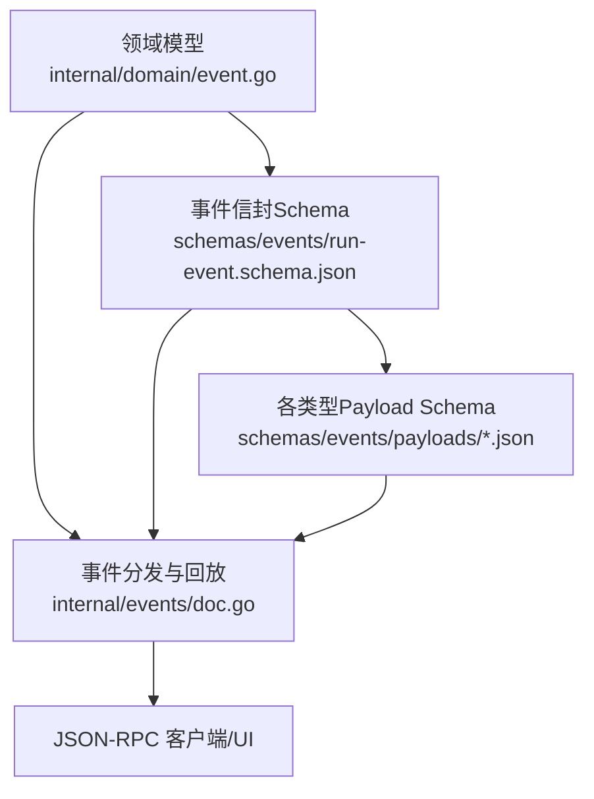
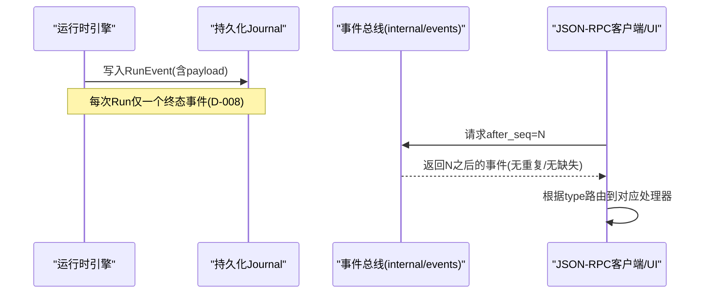
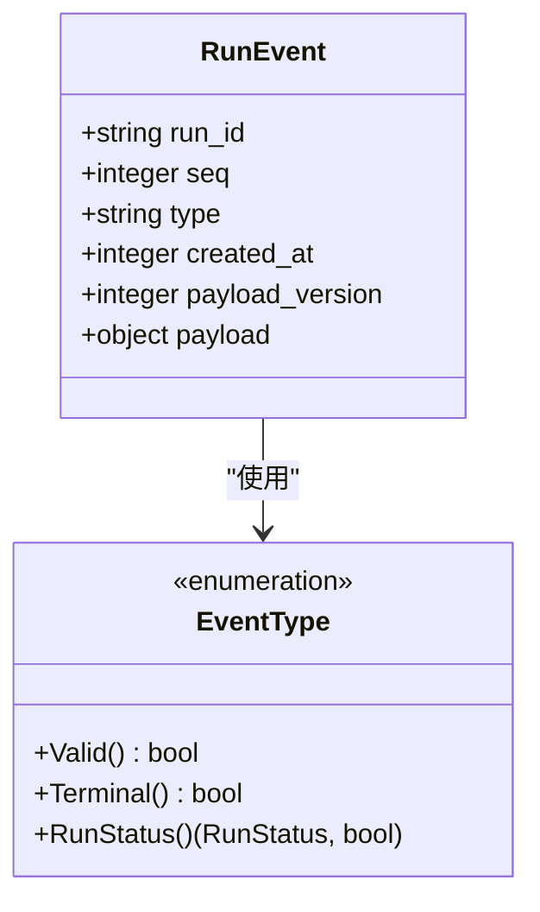
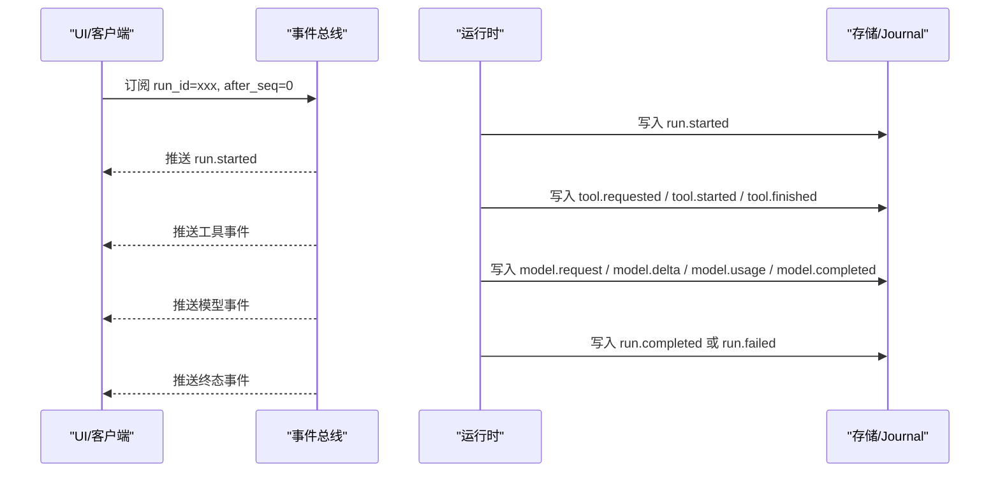
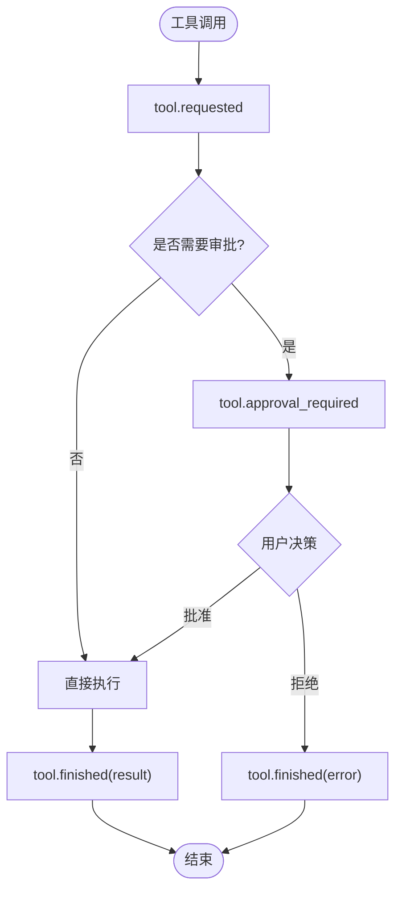
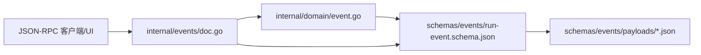

# 事件类型定义

<cite>
**本文引用的文件**
- [internal/domain/event.go](file://internal/domain/event.go)
- [schemas/events/run-event.schema.json](file://schemas/events/run-event.schema.json)
- [schemas/events/payloads/run.started.json](file://schemas/events/payloads/run.started.json)
- [schemas/events/payloads/run.completed.json](file://schemas/events/payloads/run.completed.json)
- [schemas/events/payloads/run.failed.json](file://schemas/events/payloads/run.failed.json)
- [schemas/events/payloads/tool.requested.json](file://schemas/events/payloads/tool.requested.json)
- [schemas/events/payloads/tool.finished.json](file://schemas/events/payloads/tool.finished.json)
- [schemas/events/payloads/tool.approval_required.json](file://schemas/events/payloads/tool.approval_required.json)
- [schemas/events/payloads/user.question_required.json](file://schemas/events/payloads/user.question_required.json)
- [schemas/events/payloads/user.question_answered.json](file://schemas/events/payloads/user.question_answered.json)
- [schemas/events/payloads/model.request.json](file://schemas/events/payloads/model.request.json)
- [schemas/events/payloads/model.delta.json](file://schemas/events/payloads/model.delta.json)
- [schemas/events/payloads/model.usage.json](file://schemas/events/payloads/model.usage.json)
- [internal/events/doc.go](file://internal/events/doc.go)
</cite>

## 目录
1. [简介](#简介)
2. [项目结构](#项目结构)
3. [核心组件](#核心组件)
4. [架构总览](#架构总览)
5. [详细组件分析](#详细组件分析)
6. [依赖关系分析](#依赖关系分析)
7. [性能考量](#性能考量)
8. [故障排查指南](#故障排查指南)
9. [结论](#结论)
10. [附录：事件负载示例与最佳实践](#附录事件负载示例与最佳实践)

## 简介
本文件聚焦于 Vivy 运行时的“事件”契约，系统性说明 RunEvent 结构体及其字段含义、事件类型分类、事件负载的 JSON Schema 规范（字段验证规则、必填项、数据类型约束），以及事件的序列化/反序列化最佳实践与版本兼容性策略。文档同时提供不同类型事件的完整结构与用途说明，帮助读者快速理解并正确使用事件系统。

## 项目结构
事件系统由三部分构成：
- 领域模型：RunEvent 结构体与 EventType 枚举，定义事件骨架与词汇表。
- 契约规范：JSON Schema 描述事件信封与各类 payload 的结构、校验规则。
- 事件总线与回放：通过内部 events 包将持久化的 RunEvent 以 JSON-RPC 形式分发给订阅者，支持基于 after_seq 的重放。

图表来源
- [internal/domain/event.go:1-129](file://internal/domain/event.go#L1-L129)
- [schemas/events/run-event.schema.json:1-76](file://schemas/events/run-event.schema.json#L1-L76)
- [internal/events/doc.go:1-13](file://internal/events/doc.go#L1-L13)

章节来源
- [internal/domain/event.go:1-129](file://internal/domain/event.go#L1-L129)
- [schemas/events/run-event.schema.json:1-76](file://schemas/events/run-event.schema.json#L1-L76)
- [internal/events/doc.go:1-13](file://internal/events/doc.go#L1-L13)

## 核心组件
- RunEvent 结构体：表示一次运行的一条持久化日志条目，包含 run_id、seq、type、created_at、payload_version、payload。
- EventType 词汇表：集中声明所有受支持的事件类型，并提供有效性检查、终态判定、运行状态映射等能力。
- JSON Schema 契约：run-event.schema.json 定义事件信封；每个 type 对应 payloads/<type>.json 定义 payload 的具体结构。

关键要点
- seq 是每 run 单调递增的序号，从 1 开始，用于无重复、无遗漏的重放。
- created_at 为 Unix 毫秒时间戳。
- payload_version 用于 payload 结构的版本控制，消费者可拒绝未知版本。
- payload 为任意对象，具体形状由 type 对应的 payload schema 决定。

章节来源
- [internal/domain/event.go:118-129](file://internal/domain/event.go#L118-L129)
- [schemas/events/run-event.schema.json:1-76](file://schemas/events/run-event.schema.json#L1-L76)

## 架构总览
事件在运行时被写入持久化 Journal，随后通过事件总线按 after_seq 游标向订阅者推送。UI 或外部系统可通过 JSON-RPC 订阅事件流，实现实时展示与回放。

图表来源
- [internal/events/doc.go:1-13](file://internal/events/doc.go#L1-L13)
- [internal/domain/event.go:93-116](file://internal/domain/event.go#L93-L116)

## 详细组件分析

### RunEvent 结构体与字段语义
- run_id：事件所属的运行标识。
- seq：每 run 单调递增的序列号，起始为 1。
- type：事件类型，必须来自受支持的词汇表。
- created_at：Unix 毫秒时间戳。
- payload_version：payload 结构版本号，消费者应拒绝未知版本。
- payload：类型相关的数据体，具体字段由对应 payload schema 规定。

图表来源
- [internal/domain/event.go:118-129](file://internal/domain/event.go#L118-L129)
- [internal/domain/event.go:3-43](file://internal/domain/event.go#L3-L43)

章节来源
- [internal/domain/event.go:118-129](file://internal/domain/event.go#L118-L129)
- [schemas/events/run-event.schema.json:1-76](file://schemas/events/run-event.schema.json#L1-L76)

### 事件类型分类与用途
- 运行事件（Run）
  - run.started：运行开始，携带 provider、model、mode、policy_profile、policy_hash 等信息。
  - run.completed：运行成功结束，可选 summary。
  - run.failed：运行失败结束，包含 cause_category 与 message。
  - run.cancelled：运行被取消（见 Schema 枚举）。
- 工具事件（Tool）
  - tool.requested：模型请求调用工具，包含 tool_call_id、tool_name、args。
  - tool.started：工具开始执行（见 Schema）。
  - tool.finished：工具完成，包含 result 与可选 error。
  - tool.approval_required：需要人工审批，包含 approval_id、tool_call_id、tool_name、args、expires_at、selected_tools、mode。
  - tool.approval_decided / expired / cancelled：审批结果、过期、取消（见 Schema 枚举）。
  - tool.proposal_stale：提案失效（见 Schema 枚举）。
- 用户交互事件（User）
  - user.question_required：需要用户回答，包含 question_id、tool_call_id、prompt、expires_at、resume_target、selected_tools、mode。
  - user.question_answered：用户已回答，包含 question_id、answer。
  - user.question_cancelled / expired：问题取消/过期（见 Schema 枚举）。
- 模型事件（Model）
  - model.request：本次模型调用的消息摘要，包含 selected_tools、preamble_sha256、preamble_bytes、messages（角色、内容哈希、字节长度等）。
  - model.delta：增量文本片段，用于流式输出。
  - model.usage：用量统计，包含 prompt_tokens、completion_tokens、total_tokens、reasoning_tokens。
  - model.completed：模型调用完成（见 Schema 枚举）。
  - model.reasoning_delta：推理增量（见 Schema 枚举）。
- 其他事件
  - provider.retry / stall：提供者重试/停滞。
  - policy.evaluated：策略评估。
  - hook.started / completed / blocked：钩子生命周期。
  - child.*：子运行生命周期事件。

章节来源
- [internal/domain/event.go:8-43](file://internal/domain/event.go#L8-L43)
- [schemas/events/run-event.schema.json:18-57](file://schemas/events/run-event.schema.json#L18-L57)

### 事件负载 JSON Schema 规范
通用信封（run-event.schema.json）
- 必填字段：run_id、seq、type、created_at、payload_version、payload。
- 字段约束：
  - run_id：非空字符串。
  - seq：正整数，最小值 1。
  - type：限定枚举值，覆盖运行、工具、用户、模型、提供者、策略、钩子、子运行等。
  - created_at：非负整数（Unix 毫秒）。
  - payload_version：正整数，消费者应拒绝未知版本。
  - payload：对象，具体结构由 type 对应的 payload schema 决定。
  - additionalProperties：false，禁止额外字段。

各类型 Payload 要点
- run.started：必填 provider、model、mode；可选 policy_profile、policy_hash。
- run.completed：可选 summary。
- run.failed：必填 cause_category（受限枚举）、message（不含敏感信息）。
- tool.requested：必填 tool_call_id、tool_name、args。
- tool.started：必填 tool_call_id、tool_name。
- tool.finished：必填 tool_call_id、tool_name、result；error 仅在失败时出现。
- tool.approval_required：必填 approval_id、tool_call_id、tool_name、args、expires_at；可选 selected_tools、mode。
- user.question_required：必填 question_id、tool_call_id、prompt、expires_at、resume_target；可选 selected_tools、mode。
- user.question_answered：必填 question_id、answer。
- model.request：必填 selected_tools、preamble_sha256、preamble_bytes、messages；messages 每项必填 role、content_sha256、byte_len。
- model.delta：必填 delta。
- model.usage：必填 prompt_tokens、completion_tokens、total_tokens；可选 reasoning_tokens。

章节来源
- [schemas/events/run-event.schema.json:1-76](file://schemas/events/run-event.schema.json#L1-L76)
- [schemas/events/payloads/run.started.json:1-35](file://schemas/events/payloads/run.started.json#L1-L35)
- [schemas/events/payloads/run.completed.json:1-15](file://schemas/events/payloads/run.completed.json#L1-L15)
- [schemas/events/payloads/run.failed.json:1-22](file://schemas/events/payloads/run.failed.json#L1-L22)
- [schemas/events/payloads/tool.requested.json:1-23](file://schemas/events/payloads/tool.requested.json#L1-L23)
- [schemas/events/payloads/tool.started.json:1-19](file://schemas/events/payloads/tool.started.json#L1-L19)
- [schemas/events/payloads/tool.finished.json:1-27](file://schemas/events/payloads/tool.finished.json#L1-L27)
- [schemas/events/payloads/tool.approval_required.json:1-41](file://schemas/events/payloads/tool.approval_required.json#L1-L41)
- [schemas/events/payloads/user.question_required.json:1-19](file://schemas/events/payloads/user.question_required.json#L1-L19)
- [schemas/events/payloads/user.question_answered.json:1-13](file://schemas/events/payloads/user.question_answered.json#L1-L13)
- [schemas/events/payloads/model.request.json:1-49](file://schemas/events/payloads/model.request.json#L1-L49)
- [schemas/events/payloads/model.delta.json:1-15](file://schemas/events/payloads/model.delta.json#L1-L15)
- [schemas/events/payloads/model.usage.json:1-15](file://schemas/events/payloads/model.usage.json#L1-L15)

### 事件序列化和反序列化最佳实践
- 严格遵循 JSON Schema 校验：
  - 发送端：构造 RunEvent 前进行 schema 校验，确保字段类型、必填项、枚举值正确。
  - 接收端：对收到的 RunEvent 与 payload 分别进行 schema 校验，拒绝非法数据。
- 版本兼容策略：
  - 使用 payload_version 区分 payload 结构版本；消费者遇到未知版本时应拒绝处理并记录告警。
  - 新增字段采用向后兼容方式（只增不改），避免破坏旧消费者。
- 安全与脱敏：
  - 严禁在事件负载中持久化密钥；如需引用配置，仅保存 env_key 名称。
  - 错误消息不包含堆栈与敏感信息。
- 重放与幂等：
  - 基于 seq 进行去重与顺序消费；确保 after_seq 查询无重复、无缺失。
  - 终端事件（run.completed/failed/cancelled 等）保证每个 run 恰好一个。
- 性能与体积控制：
  - model.delta 的 delta 字段需限制大小（参考运行时最大事件负载限制）。
  - model.request 仅保留可重建的指纹（如 content_sha256、byte_len），避免冗余大文本。

章节来源
- [internal/events/doc.go:1-13](file://internal/events/doc.go#L1-L13)
- [schemas/events/run-event.schema.json:63-73](file://schemas/events/run-event.schema.json#L63-L73)
- [schemas/events/payloads/model.delta.json:1-15](file://schemas/events/payloads/model.delta.json#L1-L15)
- [schemas/events/payloads/model.request.json:1-49](file://schemas/events/payloads/model.request.json#L1-L49)
- [schemas/events/payloads/run.failed.json:1-22](file://schemas/events/payloads/run.failed.json#L1-L22)

### 典型事件序列与流程图

#### 运行生命周期序列

图表来源
- [internal/events/doc.go:1-13](file://internal/events/doc.go#L1-L13)
- [schemas/events/payloads/run.started.json:1-35](file://schemas/events/payloads/run.started.json#L1-L35)
- [schemas/events/payloads/tool.requested.json:1-23](file://schemas/events/payloads/tool.requested.json#L1-L23)
- [schemas/events/payloads/tool.finished.json:1-27](file://schemas/events/payloads/tool.finished.json#L1-L27)
- [schemas/events/payloads/model.request.json:1-49](file://schemas/events/payloads/model.request.json#L1-L49)
- [schemas/events/payloads/model.delta.json:1-15](file://schemas/events/payloads/model.delta.json#L1-L15)
- [schemas/events/payloads/model.usage.json:1-15](file://schemas/events/payloads/model.usage.json#L1-L15)
- [schemas/events/payloads/run.completed.json:1-15](file://schemas/events/payloads/run.completed.json#L1-L15)
- [schemas/events/payloads/run.failed.json:1-22](file://schemas/events/payloads/run.failed.json#L1-L22)

#### 工具审批流程

图表来源
- [schemas/events/payloads/tool.requested.json:1-23](file://schemas/events/payloads/tool.requested.json#L1-L23)
- [schemas/events/payloads/tool.approval_required.json:1-41](file://schemas/events/payloads/tool.approval_required.json#L1-L41)
- [schemas/events/payloads/tool.finished.json:1-27](file://schemas/events/payloads/tool.finished.json#L1-L27)

## 依赖关系分析
- 领域模型 internal/domain/event.go 定义了事件类型与 RunEvent 结构，作为整个事件系统的核心契约。
- JSON Schema 位于 schemas/events/，为运行时、RPC 层与 UI 共享的单一事实来源。
- internal/events/doc.go 描述了事件的分发与回放机制，不依赖 Eino 内部类型，读取持久化 Journal。

图表来源
- [internal/domain/event.go:1-129](file://internal/domain/event.go#L1-L129)
- [schemas/events/run-event.schema.json:1-76](file://schemas/events/run-event.schema.json#L1-L76)
- [internal/events/doc.go:1-13](file://internal/events/doc.go#L1-L13)

章节来源
- [internal/domain/event.go:1-129](file://internal/domain/event.go#L1-L129)
- [schemas/events/run-event.schema.json:1-76](file://schemas/events/run-event.schema.json#L1-L76)
- [internal/events/doc.go:1-13](file://internal/events/doc.go#L1-L13)

## 性能考量
- 事件体积控制：model.delta 的 delta 字段需限制大小，避免单次事件过大影响传输与存储。
- 重放效率：基于 seq 的 after_seq 查询应高效且无重复/缺失，适合增量同步。
- 负载精简：model.request 仅保留指纹与必要元数据，减少冗余数据。
- 终端事件唯一性：每个 run 仅一个终态事件，便于状态收敛与界面渲染。

[本节为通用指导，不直接分析具体文件]

## 故障排查指南
- 事件类型无效：检查 type 是否在受支持枚举内；若为未知类型，拒绝处理并记录告警。
- payload 校验失败：对照对应 payload schema 检查必填项、数据类型、枚举值；必要时回退到旧版本兼容逻辑。
- 重放异常：确认 after_seq 是否正确；检查 seq 是否单调递增；确保终端事件唯一。
- 敏感信息泄露：审查事件负载，移除任何密钥或敏感数据；错误消息不得包含堆栈。
- 版本不兼容：当 payload_version 未知时，拒绝处理并提示升级；保持向后兼容的新增字段策略。

章节来源
- [schemas/events/run-event.schema.json:18-73](file://schemas/events/run-event.schema.json#L18-L73)
- [schemas/events/payloads/run.failed.json:1-22](file://schemas/events/payloads/run.failed.json#L1-L22)

## 结论
Vivy 的事件系统以 RunEvent 为核心，结合严格的 JSON Schema 契约与事件总线回放机制，提供了可靠、可审计、可扩展的事件流。通过明确的事件类型分类、字段约束与版本管理策略，确保了跨组件的一致性与安全性。遵循本文的最佳实践，可在开发与集成过程中有效避免常见陷阱，提升系统的稳定性与可维护性。

## 附录：事件负载示例与最佳实践

### 运行事件示例
- run.started
  - 用途：记录运行启动上下文（provider、model、mode、策略等）。
  - 关键字段：provider、model、mode、policy_profile、policy_hash。
- run.completed
  - 用途：运行成功结束的终态事件。
  - 关键字段：summary（可选）。
- run.failed
  - 用途：运行失败的终态事件。
  - 关键字段：cause_category（受限枚举）、message（不含敏感信息）。

章节来源
- [schemas/events/payloads/run.started.json:1-35](file://schemas/events/payloads/run.started.json#L1-L35)
- [schemas/events/payloads/run.completed.json:1-15](file://schemas/events/payloads/run.completed.json#L1-L15)
- [schemas/events/payloads/run.failed.json:1-22](file://schemas/events/payloads/run.failed.json#L1-L22)

### 工具事件示例
- tool.requested
  - 用途：模型请求调用工具。
  - 关键字段：tool_call_id、tool_name、args。
- tool.started
  - 用途：工具开始执行。
  - 关键字段：tool_call_id、tool_name。
- tool.finished
  - 用途：工具完成，包含结果或错误。
  - 关键字段：tool_call_id、tool_name、result、error（可选）。
- tool.approval_required
  - 用途：需要人工审批的工具调用。
  - 关键字段：approval_id、tool_call_id、tool_name、args、expires_at、selected_tools、mode。

章节来源
- [schemas/events/payloads/tool.requested.json:1-23](file://schemas/events/payloads/tool.requested.json#L1-L23)
- [schemas/events/payloads/tool.started.json:1-19](file://schemas/events/payloads/tool.started.json#L1-L19)
- [schemas/events/payloads/tool.finished.json:1-27](file://schemas/events/payloads/tool.finished.json#L1-L27)
- [schemas/events/payloads/tool.approval_required.json:1-41](file://schemas/events/payloads/tool.approval_required.json#L1-L41)

### 用户交互事件示例
- user.question_required
  - 用途：需要用户回答的问题。
  - 关键字段：question_id、tool_call_id、prompt、expires_at、resume_target、selected_tools、mode。
- user.question_answered
  - 用途：用户已回答问题。
  - 关键字段：question_id、answer。

章节来源
- [schemas/events/payloads/user.question_required.json:1-19](file://schemas/events/payloads/user.question_required.json#L1-L19)
- [schemas/events/payloads/user.question_answered.json:1-13](file://schemas/events/payloads/user.question_answered.json#L1-L13)

### 模型事件示例
- model.request
  - 用途：本次模型调用的消息摘要（指纹化）。
  - 关键字段：selected_tools、preamble_sha256、preamble_bytes、messages（role、content_sha256、byte_len）。
- model.delta
  - 用途：增量文本片段，用于流式输出。
  - 关键字段：delta。
- model.usage
  - 用途：用量统计。
  - 关键字段：prompt_tokens、completion_tokens、total_tokens、reasoning_tokens（可选）。

章节来源
- [schemas/events/payloads/model.request.json:1-49](file://schemas/events/payloads/model.request.json#L1-L49)
- [schemas/events/payloads/model.delta.json:1-15](file://schemas/events/payloads/model.delta.json#L1-L15)
- [schemas/events/payloads/model.usage.json:1-15](file://schemas/events/payloads/model.usage.json#L1-L15)