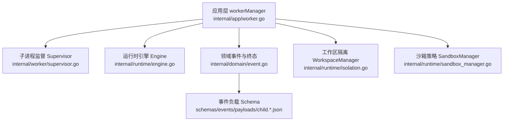
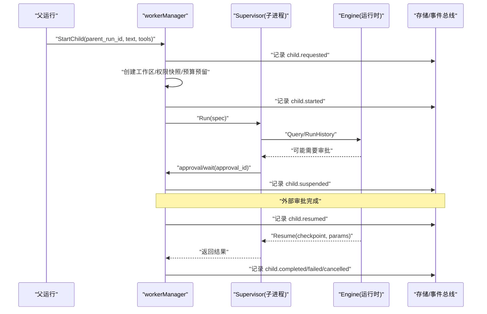
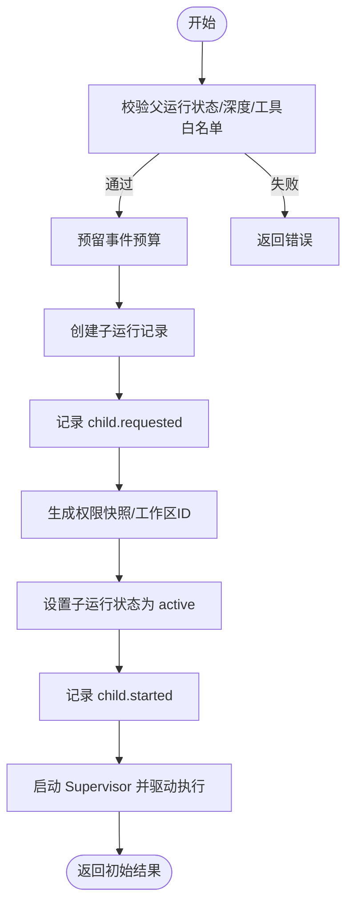
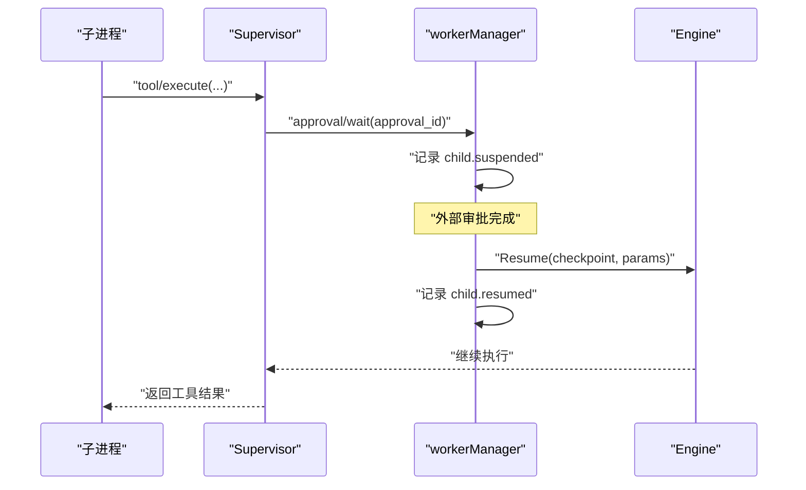
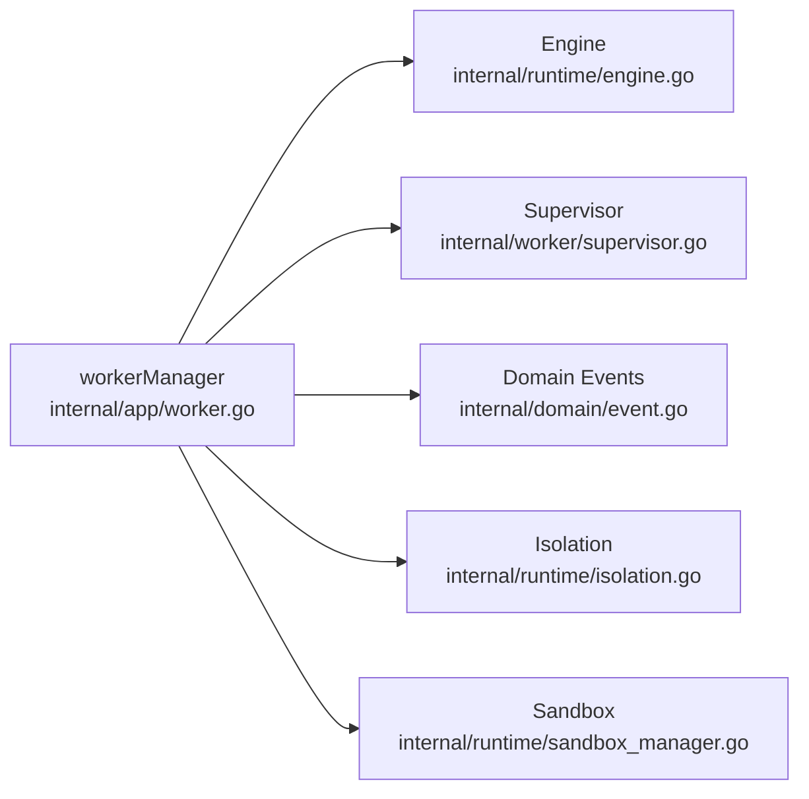

# 子代理事件

<cite>
**本文引用的文件**
- [internal/domain/event.go](file://internal/domain/event.go)
- [schemas/events/payloads/child.requested.json](file://schemas/events/payloads/child.requested.json)
- [schemas/events/payloads/child.started.json](file://schemas/events/payloads/child.started.json)
- [schemas/events/payloads/child.suspended.json](file://schemas/events/payloads/child.suspended.json)
- [schemas/events/payloads/child.resumed.json](file://schemas/events/payloads/child.resumed.json)
- [schemas/events/payloads/child.completed.json](file://schemas/events/payloads/child.completed.json)
- [schemas/events/payloads/child.failed.json](file://schemas/events/payloads/child.failed.json)
- [schemas/events/payloads/child.cancelled.json](file://schemas/events/payloads/child.cancelled.json)
- [internal/app/worker.go](file://internal/app/worker.go)
- [internal/worker/supervisor.go](file://internal/worker/supervisor.go)
- [internal/runtime/engine.go](file://internal/runtime/engine.go)
- [internal/runtime/isolation.go](file://internal/runtime/isolation.go)
- [internal/runtime/sandbox_manager.go](file://internal/runtime/sandbox_manager.go)
</cite>

## 目录
1. [简介](#简介)
2. [项目结构](#项目结构)
3. [核心组件](#核心组件)
4. [架构总览](#架构总览)
5. [详细组件分析](#详细组件分析)
6. [依赖关系分析](#依赖关系分析)
7. [性能考量](#性能考量)
8. [故障排查指南](#故障排查指南)
9. [结论](#结论)
10. [附录](#附录)

## 简介
本文件聚焦于“子代理”在其生命周期内产生的事件体系与运行机制，覆盖以下事件类型：ChildRequested、ChildStarted、ChildSuspended、ChildResumed、ChildCompleted、ChildFailed、ChildCancelled。文档将解释子代理的创建、执行、暂停恢复与终止流程；给出每个事件的负载字段定义；说明子代理标识、父代理关系与执行上下文；提供多代理协作的事件流示例；并阐述资源隔离、权限控制、优先级调度与资源竞争处理机制。

## 项目结构
围绕子代理事件的关键代码分布在以下位置：
- 领域事件类型与终态判定：internal/domain/event.go
- 事件负载 JSON Schema：schemas/events/payloads/child.*.json
- 子代理生命周期编排与事件记录：internal/app/worker.go
- 子进程监督与工具/模型调用桥接：internal/worker/supervisor.go
- 引擎与恢复（Resume）能力：internal/runtime/engine.go
- 工作区隔离与路径校验：internal/runtime/isolation.go
- 沙箱策略与网络/命令限制：internal/runtime/sandbox_manager.go

图表来源
- [internal/app/worker.go:87-196](file://internal/app/worker.go#L87-L196)
- [internal/worker/supervisor.go:164-190](file://internal/worker/supervisor.go#L164-L190)
- [internal/runtime/engine.go:144-166](file://internal/runtime/engine.go#L144-L166)
- [internal/domain/event.go:31-43](file://internal/domain/event.go#L31-L43)
- [internal/runtime/isolation.go:43-74](file://internal/runtime/isolation.go#L43-L74)
- [internal/runtime/sandbox_manager.go:27-48](file://internal/runtime/sandbox_manager.go#L27-L48)

章节来源
- [internal/domain/event.go:31-43](file://internal/domain/event.go#L31-L43)
- [internal/app/worker.go:87-196](file://internal/app/worker.go#L87-L196)
- [internal/worker/supervisor.go:164-190](file://internal/worker/supervisor.go#L164-L190)
- [internal/runtime/engine.go:144-166](file://internal/runtime/engine.go#L144-L166)
- [internal/runtime/isolation.go:43-74](file://internal/runtime/isolation.go#L43-L74)
- [internal/runtime/sandbox_manager.go:27-48](file://internal/runtime/sandbox_manager.go#L27-L48)

## 核心组件
- 事件类型与终态语义：定义了 child.* 系列事件以及 run.* 终态事件，并提供 Terminal() 与 RunStatus() 用于判定运行结束与最终状态。
- 事件负载 Schema：为每个 child.* 事件定义严格的 JSON 负载结构，确保跨进程/跨语言一致性与可重放性。
- 子代理管理器：负责创建子代理运行、分配工作区、注册权限、记录事件、启动子进程监督器、驱动执行与收尾。
- 子进程监督器：通过 RPC 与子进程通信，转发工具调用、模型调用与审批等待，保证策略与工作区一致性。
- 引擎恢复：支持从检查点恢复被挂起的运行，将审批结果注入回中断点继续执行。
- 隔离与沙箱：为每个运行分配私有工作区，校验路径不逃逸；对命令、网络访问进行策略限制。

章节来源
- [internal/domain/event.go:31-43](file://internal/domain/event.go#L31-L43)
- [internal/domain/event.go:93-116](file://internal/domain/event.go#L93-L116)
- [schemas/events/payloads/child.requested.json:1-9](file://schemas/events/payloads/child.requested.json#L1-L9)
- [schemas/events/payloads/child.started.json:1-10](file://schemas/events/payloads/child.started.json#L1-L10)
- [schemas/events/payloads/child.suspended.json:1-10](file://schemas/events/payloads/child.suspended.json#L1-L10)
- [schemas/events/payloads/child.resumed.json:1-10](file://schemas/events/payloads/child.resumed.json#L1-L10)
- [schemas/events/payloads/child.completed.json:1-9](file://schemas/events/payloads/child.completed.json#L1-L9)
- [schemas/events/payloads/child.failed.json:1-10](file://schemas/events/payloads/child.failed.json#L1-L10)
- [schemas/events/payloads/child.cancelled.json:1-10](file://schemas/events/payloads/child.cancelled.json#L1-L10)
- [internal/app/worker.go:87-196](file://internal/app/worker.go#L87-L196)
- [internal/worker/supervisor.go:164-190](file://internal/worker/supervisor.go#L164-L190)
- [internal/runtime/engine.go:144-166](file://internal/runtime/engine.go#L144-L166)
- [internal/runtime/isolation.go:43-74](file://internal/runtime/isolation.go#L43-L74)
- [internal/runtime/sandbox_manager.go:27-48](file://internal/runtime/sandbox_manager.go#L27-L48)

## 架构总览
子代理的生命周期由应用层的 workerManager 编排，通过内部 RPC 启动独立的子进程监督器，后者在受限策略下执行模型与工具调用。关键交互如下：
- 父运行发起子代理请求，写入 child.requested 事件。
- 创建工作区与权限快照，激活子运行，写入 child.started 事件。
- 子进程执行过程中可能因需要人工审批而暂停，写入 child.suspended 事件。
- 审批通过后恢复执行，写入 child.resumed 事件，并通过引擎 Resume 继续。
- 子代理以 child.completed / child.failed / child.cancelled 之一进入终态。

图表来源
- [internal/app/worker.go:87-196](file://internal/app/worker.go#L87-L196)
- [internal/worker/supervisor.go:164-190](file://internal/worker/supervisor.go#L164-L190)
- [internal/runtime/engine.go:144-166](file://internal/runtime/engine.go#L144-L166)

## 详细组件分析

### 事件类型与负载定义
- child.requested：表示父运行请求创建子代理。关键字段包括 parent_run_id、depth、text。
- child.started：表示子代理已激活并开始执行。关键字段包括 parent_run_id、workspace_id。
- child.suspended：表示子代理因需要审批而暂停。关键字段包括 approval_id、tool_call_id。
- child.resumed：表示审批决策后恢复执行。关键字段包括 approval_id、decision（approved/denied）。
- child.completed：子代理成功完成。可选 summary。
- child.failed：子代理失败。关键字段 cause_category、message。
- child.cancelled：子代理被取消。关键字段 reason。

这些负载均受 schemas/events/payloads/child.*.json 约束，确保下游消费端可安全解析与重放。

章节来源
- [schemas/events/payloads/child.requested.json:1-9](file://schemas/events/payloads/child.requested.json#L1-L9)
- [schemas/events/payloads/child.started.json:1-10](file://schemas/events/payloads/child.started.json#L1-L10)
- [schemas/events/payloads/child.suspended.json:1-10](file://schemas/events/payloads/child.suspended.json#L1-L10)
- [schemas/events/payloads/child.resumed.json:1-10](file://schemas/events/payloads/child.resumed.json#L1-L10)
- [schemas/events/payloads/child.completed.json:1-9](file://schemas/events/payloads/child.completed.json#L1-L9)
- [schemas/events/payloads/child.failed.json:1-10](file://schemas/events/payloads/child.failed.json#L1-L10)
- [schemas/events/payloads/child.cancelled.json:1-10](file://schemas/events/payloads/child.cancelled.json#L1-L10)

### 子代理创建与启动流程
- 参数校验：要求 parent_run_id 与 text 非空，父运行必须处于活跃或已接受状态，深度不超过上限。
- 权限与预算：基于父运行获取权限快照与预算预留，防止滥用。
- 并发限制：同一父运行的子代理数量受上限约束。
- 持久化与事件：创建子运行记录，记录 child.requested；分配工作区并记录 child.started。
- 启动监督器：构造 Authority（包含父运行ID、策略快照、工作区ID、预算），启动子进程监督器，并异步驱动执行。

图表来源
- [internal/app/worker.go:87-196](file://internal/app/worker.go#L87-L196)

章节来源
- [internal/app/worker.go:87-196](file://internal/app/worker.go#L87-L196)

### 执行、暂停与恢复
- 执行：子进程通过 Supervisor.Run 调用 Engine.Query/RunHistory 执行任务。
- 暂停：当工具调用需要审批时，子进程通过 approval/wait 等待，主进程记录 child.suspended。
- 恢复：审批完成后，主进程记录 child.resumed，并通过 Engine.Resume 将审批结果注入到中断点继续执行。

图表来源
- [internal/worker/supervisor.go:215-296](file://internal/worker/supervisor.go#L215-L296)
- [internal/runtime/engine.go:144-166](file://internal/runtime/engine.go#L144-L166)
- [internal/app/worker.go:87-196](file://internal/app/worker.go#L87-L196)

章节来源
- [internal/worker/supervisor.go:215-296](file://internal/worker/supervisor.go#L215-L296)
- [internal/runtime/engine.go:144-166](file://internal/runtime/engine.go#L144-L166)
- [internal/app/worker.go:87-196](file://internal/app/worker.go#L87-L196)

### 终止流程与终态事件
- 成功：子代理正常结束，记录 child.completed。
- 失败：异常或策略拒绝等导致失败，记录 child.failed。
- 取消：父运行或外部原因取消，记录 child.cancelled。
- 终态判定：domain 层提供 Terminal() 与 RunStatus()，确保每个运行仅有一个终态事件。

章节来源
- [internal/domain/event.go:93-116](file://internal/domain/event.go#L93-L116)
- [internal/app/worker.go:585-616](file://internal/app/worker.go#L585-L616)

### 复杂多代理协作场景示例
一个典型的多代理协作流程如下：
- 父运行 P 创建子代理 C1，记录 child.requested。
- C1 启动并执行，记录 child.started。
- C1 需要审批的工具调用触发 child.suspended。
- 审批通过后，记录 child.resumed，C1 继续执行。
- C1 再创建子代理 C2（深度+1），重复上述流程。
- C2 完成，记录 child.completed；C1 随后也完成，记录 child.completed。
- 若任意阶段出现错误或取消，相应记录 child.failed 或 child.cancelled。

该流程体现了父子层级、审批暂停/恢复、以及多层级子代理的协作与事件一致性。

[本节为概念性流程说明，不直接分析具体文件]

### 资源隔离与权限控制
- 工作区隔离：WorkspaceManager 为每个运行分配私有目录，严格校验路径不得逃逸根目录，拒绝符号链接，确保文件系统边界清晰。
- 沙箱策略：SandboxManager 根据配置的模式限制命令执行与网络访问，阻止越权操作。
- 权限快照：子代理继承父运行策略快照，禁止放宽权限；每次工具/模型调用均需通过 Authority.Validate 验证。
- 预算与配额：通过预算预留与计数限制，防止无限创建子代理或耗尽事件配额。

章节来源
- [internal/runtime/isolation.go:43-74](file://internal/runtime/isolation.go#L43-L74)
- [internal/runtime/sandbox_manager.go:27-48](file://internal/runtime/sandbox_manager.go#L27-L48)
- [internal/worker/supervisor.go:41-58](file://internal/worker/supervisor.go#L41-L58)
- [internal/app/worker.go:110-157](file://internal/app/worker.go#L110-L157)

### 优先级调度与资源竞争处理
- 并发限制：同一父运行的子代理数量受上限约束，避免资源竞争。
- 深度限制：子代理最大深度有限制，防止过深嵌套导致资源膨胀。
- 工具顺序：工具按名称排序注册，形成稳定的选择顺序，有助于可预测的执行行为。
- 预算预留：每次创建子代理前预留事件预算，失败时释放，保障系统稳定性。

章节来源
- [internal/app/worker.go:22-26](file://internal/app/worker.go#L22-L26)
- [internal/app/worker.go:117-123](file://internal/app/worker.go#L117-L123)
- [internal/app/worker.go:65-84](file://internal/app/worker.go#L65-L84)
- [internal/app/worker.go:110-116](file://internal/app/worker.go#L110-L116)

## 依赖关系分析
- internal/app/worker.go 依赖 internal/domain/event.go 定义事件类型与终态；依赖 internal/worker/supervisor.go 启动子进程；依赖 internal/runtime/engine.go 执行与恢复；依赖 internal/runtime/isolation.go 与 internal/runtime/sandbox_manager.go 做隔离与策略。
- internal/worker/supervisor.go 通过 RPC 与子进程通信，转发工具与模型调用，并维护 Authority 一致性。
- internal/runtime/engine.go 封装 Eino 引擎，提供 Query/RunHistory/Resume 能力，是执行与恢复的核心。

图表来源
- [internal/app/worker.go:87-196](file://internal/app/worker.go#L87-L196)
- [internal/runtime/engine.go:144-166](file://internal/runtime/engine.go#L144-L166)
- [internal/worker/supervisor.go:164-190](file://internal/worker/supervisor.go#L164-L190)
- [internal/domain/event.go:31-43](file://internal/domain/event.go#L31-L43)
- [internal/runtime/isolation.go:43-74](file://internal/runtime/isolation.go#L43-L74)
- [internal/runtime/sandbox_manager.go:27-48](file://internal/runtime/sandbox_manager.go#L27-L48)

章节来源
- [internal/app/worker.go:87-196](file://internal/app/worker.go#L87-L196)
- [internal/runtime/engine.go:144-166](file://internal/runtime/engine.go#L144-L166)
- [internal/worker/supervisor.go:164-190](file://internal/worker/supervisor.go#L164-L190)
- [internal/domain/event.go:31-43](file://internal/domain/event.go#L31-L43)
- [internal/runtime/isolation.go:43-74](file://internal/runtime/isolation.go#L43-L74)
- [internal/runtime/sandbox_manager.go:27-48](file://internal/runtime/sandbox_manager.go#L27-L48)

## 性能考量
- 事件负载大小限制：引擎配置中限制单个事件负载大小，避免大消息阻塞流式通道。
- 工具结果大小限制：限制工具返回结果大小，防止上下文窗口被过度占用。
- 迭代次数限制：通过 MaxToolTurns 限制模型生成循环次数，避免长时间运行。
- 子代理并发与深度限制：防止过多子代理与过深嵌套造成资源竞争。
- 工作区与沙箱：隔离与策略减少不必要的系统调用与网络访问，提升整体稳定性。

[本节提供一般性指导，不直接分析具体文件]

## 故障排查指南
- 子代理无法创建：检查父运行状态是否为活跃或已接受；确认未超过最大深度与并发限制；查看是否预留事件预算失败。
- 子代理启动失败：检查策略快照与工作区 ID 是否匹配；确认工具白名单配置正确；查看子进程初始化协议版本是否一致。
- 子代理卡住：关注是否存在未决审批；检查 child.suspended 事件是否已记录；确认审批回调是否正确触发 child.resumed。
- 子代理失败或取消：查看 child.failed 或 child.cancelled 的 cause_category 与 message/reason；结合工具调用链定位问题。
- 恢复失败：确认 Resume 使用的 checkpoint id 与原始运行一致；检查审批参数是否正确注入。

章节来源
- [internal/app/worker.go:87-196](file://internal/app/worker.go#L87-L196)
- [internal/worker/supervisor.go:103-162](file://internal/worker/supervisor.go#L103-L162)
- [internal/runtime/engine.go:144-166](file://internal/runtime/engine.go#L144-L166)
- [internal/domain/event.go:93-116](file://internal/domain/event.go#L93-L116)

## 结论
子代理事件体系为 Vivy 提供了清晰的父子代理生命周期管理与可重放的事件日志。通过严格的负载 Schema、权限快照、工作区隔离与沙箱策略，系统在实现灵活的多代理协作的同时，保障了安全性与稳定性。配合引擎的恢复能力与预算/并发限制，能够有效应对复杂场景下的资源竞争与异常处理。

[本节为总结性内容，不直接分析具体文件]

## 附录
- 事件类型清单：child.requested、child.started、child.suspended、child.resumed、child.completed、child.failed、child.cancelled。
- 关键字段说明：
  - parent_run_id：父运行标识，建立父子关系。
  - depth：子代理深度，用于限制嵌套层级。
  - workspace_id：子代理的工作区标识，用于资源隔离。
  - approval_id：审批标识，关联暂停与恢复。
  - tool_call_id：工具调用标识，用于定位暂停点。
  - decision：审批决策（approved/denied）。
  - cause_category/message：失败原因分类与详情。
  - reason：取消原因。
  - summary：完成摘要。

[本节为补充信息，不直接分析具体文件]