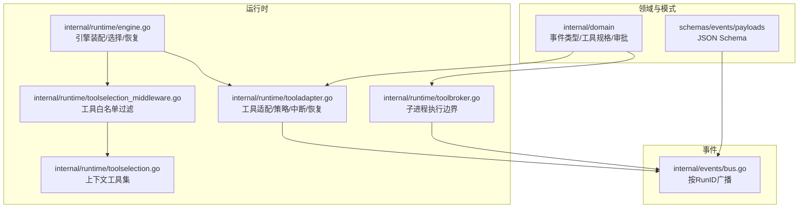
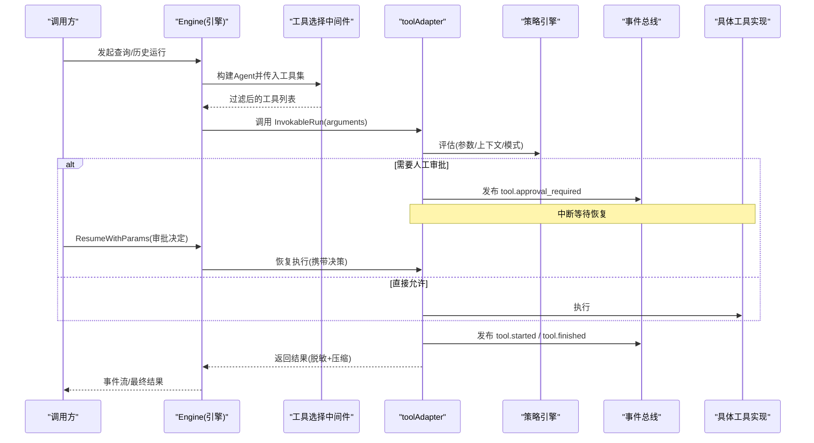
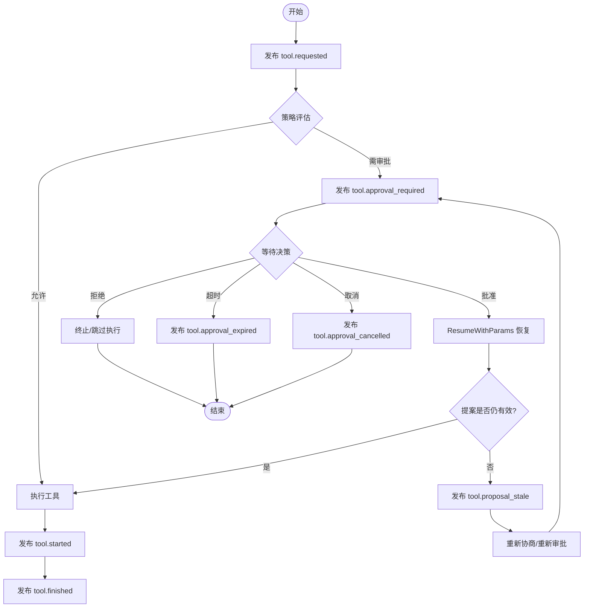
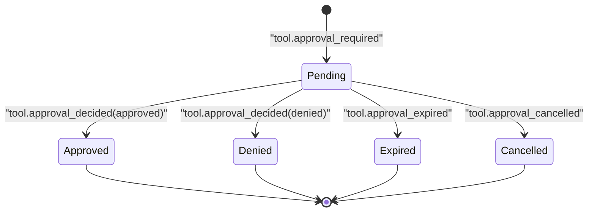
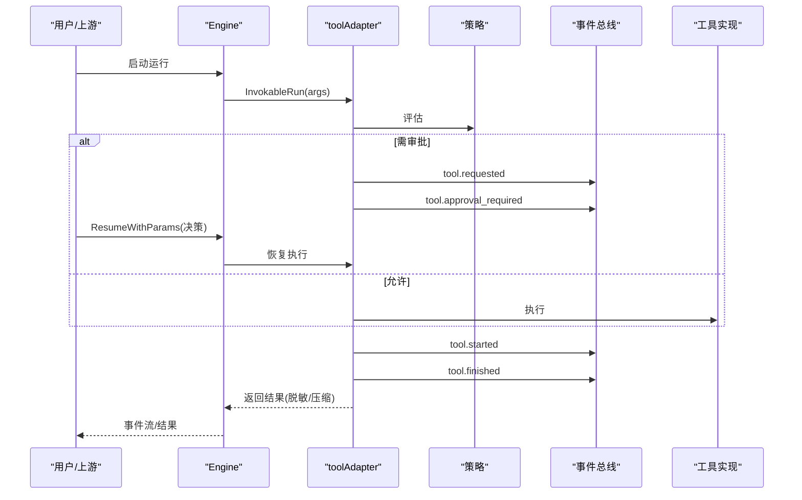
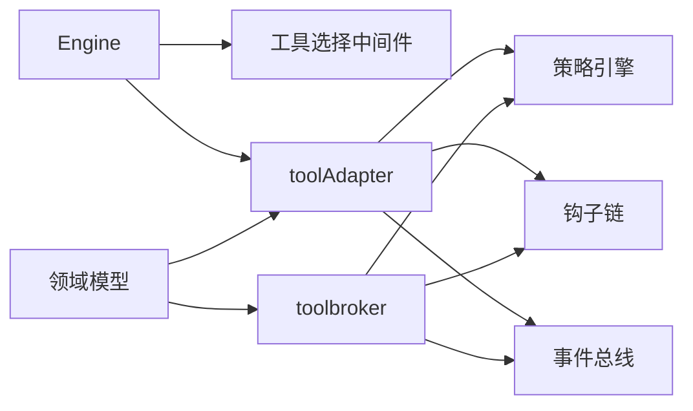

# 工具事件

<cite>
**本文引用的文件**
- [internal/domain/event.go](file://internal/domain/event.go)
- [internal/domain/tool.go](file://internal/domain/tool.go)
- [schemas/events/payloads/tool.requested.json](file://schemas/events/payloads/tool.requested.json)
- [schemas/events/payloads/tool.started.json](file://schemas/events/payloads/tool.started.json)
- [schemas/events/payloads/tool.finished.json](file://schemas/events/payloads/tool.finished.json)
- [schemas/events/payloads/tool.approval_required.json](file://schemas/events/payloads/tool.approval_required.json)
- [schemas/events/payloads/tool.approval_decided.json](file://schemas/events/payloads/tool.approval_decided.json)
- [schemas/events/payloads/tool.approval_expired.json](file://schemas/events/payloads/tool.approval_expired.json)
- [schemas/events/payloads/tool.approval_cancelled.json](file://schemas/events/payloads/tool.approval_cancelled.json)
- [schemas/events/payloads/tool.proposal_stale.json](file://schemas/events/payloads/tool.proposal_stale.json)
- [internal/runtime/engine.go](file://internal/runtime/engine.go)
- [internal/runtime/tooladapter.go](file://internal/runtime/tooladapter.go)
- [internal/runtime/toolbroker.go](file://internal/runtime/toolbroker.go)
- [internal/runtime/toolselection_middleware.go](file://internal/runtime/toolselection_middleware.go)
- [internal/runtime/toolselection.go](file://internal/runtime/toolselection.go)
- [internal/events/bus.go](file://internal/events/bus.go)
</cite>

## 目录
1. [简介](#简介)
2. [项目结构](#项目结构)
3. [核心组件](#核心组件)
4. [架构总览](#架构总览)
5. [详细组件分析](#详细组件分析)
6. [依赖关系分析](#依赖关系分析)
7. [性能考虑](#性能考虑)
8. [故障排查指南](#故障排查指南)
9. [结论](#结论)
10. [附录](#附录)

## 简介
本文件系统化说明 Vivy 运行时中“工具调用”的完整生命周期事件与审批流程，覆盖以下事件：ToolRequested、ToolStarted、ToolFinished、ToolApprovalRequired、ToolApprovalDecided、ToolApprovalExpired、ToolApprovalCancelled、ToolProposalStale。文档给出每个事件的负载定义、字段含义、使用场景；提供从请求到完成的端到端事件流示例；解释安全检查点、权限控制与审计追踪；并说明提案过期机制与重新协商流程。

## 项目结构
围绕工具事件的关键代码分布在以下位置：
- 领域模型与事件类型：internal/domain（事件类型常量、工具规格、审批记录）
- 事件总线：internal/events（按 RunID 广播持久化后的事件）
- 运行时引擎与工具适配：internal/runtime（工具选择、策略评估、中断/恢复、结果压缩与脱敏）
- 事件负载 JSON Schema：schemas/events/payloads（各事件的结构约束）

图表来源
- [internal/runtime/engine.go:69-116](file://internal/runtime/engine.go#L69-L116)
- [internal/runtime/tooladapter.go:78-184](file://internal/runtime/tooladapter.go#L78-L184)
- [internal/runtime/toolbroker.go:15-92](file://internal/runtime/toolbroker.go#L15-L92)
- [internal/runtime/toolselection_middleware.go:23-39](file://internal/runtime/toolselection_middleware.go#L23-L39)
- [internal/runtime/toolselection.go:10-21](file://internal/runtime/toolselection.go#L10-L21)
- [internal/events/bus.go:46-75](file://internal/events/bus.go#L46-L75)

章节来源
- [internal/runtime/engine.go:69-116](file://internal/runtime/engine.go#L69-L116)
- [internal/runtime/tooladapter.go:78-184](file://internal/runtime/tooladapter.go#L78-L184)
- [internal/runtime/toolbroker.go:15-92](file://internal/runtime/toolbroker.go#L15-L92)
- [internal/runtime/toolselection_middleware.go:23-39](file://internal/runtime/toolselection_middleware.go#L23-L39)
- [internal/runtime/toolselection.go:10-21](file://internal/runtime/toolselection.go#L10-L21)
- [internal/events/bus.go:46-75](file://internal/events/bus.go#L46-L75)

## 核心组件
- 工具规格与交互类型：描述工具名称、参数、是否只读、交互模式（如 question）等，用于生成模型可见的工具 schema 与控制流。
- 工具适配层：在每次调用前进行参数校验、安全校验、策略评估、钩子预处理/后处理、中断与恢复、结果压缩与脱敏。
- 工具选择中间件：将当前请求允许的工具集合注入到 Eino 运行上下文，限制模型可调用范围。
- 事件总线：对已持久化的 RunEvent 按 RunID 广播给订阅者；终端事件会关闭通道，落后者通过日志回放重放。
- 事件负载 Schema：为每个工具事件定义严格的 JSON 结构，确保 UI/审计/下游系统一致消费。

章节来源
- [internal/domain/tool.go:27-50](file://internal/domain/tool.go#L27-L50)
- [internal/runtime/tooladapter.go:78-184](file://internal/runtime/tooladapter.go#L78-L184)
- [internal/runtime/toolselection_middleware.go:23-39](file://internal/runtime/toolselection_middleware.go#L23-L39)
- [internal/events/bus.go:46-75](file://internal/events/bus.go#L46-L75)

## 架构总览
下图展示一次工具调用的典型路径：引擎装配工具 -> 选择中间件过滤 -> 工具适配执行 -> 策略评估与审批 -> 事件发布 -> 结果返回。

图表来源
- [internal/runtime/engine.go:69-116](file://internal/runtime/engine.go#L69-L116)
- [internal/runtime/tooladapter.go:78-184](file://internal/runtime/tooladapter.go#L78-L184)
- [internal/runtime/toolselection_middleware.go:23-39](file://internal/runtime/toolselection_middleware.go#L23-L39)
- [internal/events/bus.go:46-75](file://internal/events/bus.go#L46-L75)

## 详细组件分析

### 事件负载定义与字段说明
- tool.requested
  - 触发时机：工具被请求时，由运行时合成并发布。
  - 关键字段：tool_call_id、tool_name、args（由工具 Spec 固定形状）。
  - 用途：UI/审计展示即将执行的工具及参数。
- tool.started
  - 触发时机：工具实际开始执行前。
  - 关键字段：tool_call_id、tool_name。
  - 用途：标记执行起点，便于计时与追踪。
- tool.finished
  - 触发时机：工具执行结束（成功或失败）。
  - 关键字段：tool_call_id、tool_name、result（成功输出）、error（失败信息）。
  - 用途：终结该次工具调用，供下游聚合与审计。
- tool.approval_required
  - 触发时机：策略评估结果为需审批，且首次执行未中断过；在持久化检查点后发出。
  - 关键字段：approval_id、tool_call_id、tool_name、args、expires_at、selected_tools、mode。
  - 用途：向用户展示待审批项，设置过期时间，支持 normal/plan 模式区分。
- tool.approval_decided
  - 触发时机：用户对审批做出决定（批准/拒绝）。
  - 关键字段：approval_id、decision（approved/denied）、actor、reason、decided_at。
  - 用途：驱动恢复执行或终止后续动作。
- tool.approval_expired
  - 触发时机：审批超过 expires_at 仍未决定。
  - 关键字段：review_id、kind（const=approval）、expires_at、reason。
  - 用途：通知上游清理/重试/提示。
- tool.approval_cancelled
  - 触发时机：审批被取消（例如用户主动撤回）。
  - 关键字段：approval_id、actor、reason。
  - 用途：终止相关等待流程。
- tool.proposal_stale
  - 触发时机：已批准的提案目标发生变化或前提条件失效，导致原审批不再适用。
  - 关键字段：approval_id、target、reason。
  - 用途：强制重新协商或回退。

章节来源
- [schemas/events/payloads/tool.requested.json:1-23](file://schemas/events/payloads/tool.requested.json#L1-L23)
- [schemas/events/payloads/tool.started.json:1-19](file://schemas/events/payloads/tool.started.json#L1-L19)
- [schemas/events/payloads/tool.finished.json:1-27](file://schemas/events/payloads/tool.finished.json#L1-L27)
- [schemas/events/payloads/tool.approval_required.json:1-41](file://schemas/events/payloads/tool.approval_required.json#L1-L41)
- [schemas/events/payloads/tool.approval_decided.json:1-16](file://schemas/events/payloads/tool.approval_decided.json#L1-L16)
- [schemas/events/payloads/tool.approval_expired.json:1-15](file://schemas/events/payloads/tool.approval_expired.json#L1-L15)
- [schemas/events/payloads/tool.approval_cancelled.json:1-14](file://schemas/events/payloads/tool.approval_cancelled.json#L1-L14)
- [schemas/events/payloads/tool.proposal_stale.json:1-14](file://schemas/events/payloads/tool.proposal_stale.json#L1-L14)

### 工具调用生命周期与事件序列
- 正常路径（无需审批）
  - tool.requested → tool.started → tool.finished
- 需要审批路径
  - tool.requested → tool.approval_required → (等待用户决策) → tool.approval_decided → tool.started → tool.finished
- 超时路径
  - tool.requested → tool.approval_required → tool.approval_expired
- 取消路径
  - tool.requested → tool.approval_required → tool.approval_cancelled
- 提案过期路径
  - 在恢复执行前后若检测到目标变更/前提失效，则发出 tool.proposal_stale，并可能回退或要求重新审批。

图表来源
- [internal/runtime/tooladapter.go:139-162](file://internal/runtime/tooladapter.go#L139-L162)
- [internal/runtime/tooladapter.go:165-184](file://internal/runtime/tooladapter.go#L165-L184)
- [internal/runtime/engine.go:159-165](file://internal/runtime/engine.go#L159-L165)

章节来源
- [internal/runtime/tooladapter.go:78-184](file://internal/runtime/tooladapter.go#L78-L184)
- [internal/runtime/engine.go:159-165](file://internal/runtime/engine.go#L159-L165)

### 审批状态机与转换

图表来源
- [internal/domain/tool.go:63-72](file://internal/domain/tool.go#L63-L72)
- [schemas/events/payloads/tool.approval_required.json:1-41](file://schemas/events/payloads/tool.approval_required.json#L1-L41)
- [schemas/events/payloads/tool.approval_decided.json:1-16](file://schemas/events/payloads/tool.approval_decided.json#L1-L16)
- [schemas/events/payloads/tool.approval_expired.json:1-15](file://schemas/events/payloads/tool.approval_expired.json#L1-L15)
- [schemas/events/payloads/tool.approval_cancelled.json:1-14](file://schemas/events/payloads/tool.approval_cancelled.json#L1-L14)

章节来源
- [internal/domain/tool.go:63-72](file://internal/domain/tool.go#L63-L72)

### 安全检查点、权限控制与审计追踪
- 参数与安全校验：每次调用前进行参数合法性与安全校验，防止非法输入进入工具。
- 策略评估：基于运行模式（normal/plan）、工具只读性、上下文与参数进行决策；计划模式下拒绝效果型工具。
- 钩子链：PreToolUse 可重写参数，重写后再次评估策略；PostToolUse 记录执行结果与错误（敏感信息脱敏）。
- 结果保护：工具输出统一添加不可信标记头，并进行长度压缩与敏感信息脱敏，避免污染模型上下文。
- 工具选择：通过中间件将请求级允许的工具集注入，模型仅能调用白名单内的工具。
- 审计：所有关键节点（策略评估、工具执行、审批）均产生事件，经事件总线广播并由存储持久化，支持事后回放与审计。

章节来源
- [internal/runtime/tooladapter.go:85-138](file://internal/runtime/tooladapter.go#L85-L138)
- [internal/runtime/tooladapter.go:165-184](file://internal/runtime/tooladapter.go#L165-L184)
- [internal/runtime/toolselection_middleware.go:23-39](file://internal/runtime/toolselection_middleware.go#L23-L39)
- [internal/runtime/toolbroker.go:46-87](file://internal/runtime/toolbroker.go#L46-L87)
- [internal/events/bus.go:46-75](file://internal/events/bus.go#L46-L75)

### 提案过期机制与重新协商流程
- 过期：当审批超过 expires_at 仍未决定，发布 tool.approval_expired，上游应停止等待并采取清理或重试。
- 提案失效：若在恢复执行前后发现目标变化或前提条件失效，发布 tool.proposal_stale，要求重新协商（重新准备提案并再次审批）。
- 重新协商：根据业务语义，可能需要重新调用 PrepareProposal，再走一次审批流程。

章节来源
- [schemas/events/payloads/tool.approval_expired.json:1-15](file://schemas/events/payloads/tool.approval_expired.json#L1-L15)
- [schemas/events/payloads/tool.proposal_stale.json:1-14](file://schemas/events/payloads/tool.proposal_stale.json#L1-L14)
- [internal/runtime/engine.go:119-132](file://internal/runtime/engine.go#L119-L132)

### 端到端事件流示例（从请求到完成）
- 步骤
  1) 引擎装配工具并启动运行。
  2) 工具选择中间件过滤出本次可用的工具。
  3) 工具适配器接收调用，进行参数与安全校验、策略评估。
  4) 若需审批：发布 tool.requested、tool.approval_required，中断等待恢复。
  5) 用户审批后，引擎 ResumeWithParams 恢复执行。
  6) 若提案仍有效：发布 tool.started、tool.finished；否则发布 tool.proposal_stale 并重新协商。
  7) 结果经脱敏与压缩后返回。

图表来源
- [internal/runtime/engine.go:69-116](file://internal/runtime/engine.go#L69-L116)
- [internal/runtime/tooladapter.go:78-184](file://internal/runtime/tooladapter.go#L78-L184)
- [internal/runtime/toolselection_middleware.go:23-39](file://internal/runtime/toolselection_middleware.go#L23-L39)
- [internal/events/bus.go:46-75](file://internal/events/bus.go#L46-L75)

## 依赖关系分析
- 引擎依赖工具适配与选择中间件，将工具以受控方式暴露给 Eino。
- 工具适配依赖策略引擎与钩子链，负责安全与审计。
- 事件总线解耦事件生产与消费，保证最终一致性。
- 领域模型提供统一的工具规格与审批状态定义，贯穿各层。

图表来源
- [internal/runtime/engine.go:69-116](file://internal/runtime/engine.go#L69-L116)
- [internal/runtime/tooladapter.go:78-184](file://internal/runtime/tooladapter.go#L78-L184)
- [internal/runtime/toolbroker.go:15-92](file://internal/runtime/toolbroker.go#L15-L92)
- [internal/domain/tool.go:27-50](file://internal/domain/tool.go#L27-L50)

章节来源
- [internal/runtime/engine.go:69-116](file://internal/runtime/engine.go#L69-L116)
- [internal/runtime/tooladapter.go:78-184](file://internal/runtime/tooladapter.go#L78-L184)
- [internal/runtime/toolbroker.go:15-92](file://internal/runtime/toolbroker.go#L15-L92)
- [internal/domain/tool.go:27-50](file://internal/domain/tool.go#L27-L50)

## 性能考虑
- 事件总线采用有缓冲通道，慢消费者会被丢弃并通过日志回放重放，避免阻塞运行。
- 工具结果进行头部/尾部压缩，限制返回给模型的上下文大小，降低 Token 消耗。
- 工具选择中间件减少模型可调用工具数量，降低幻觉与无效调用概率。
- 策略评估与钩子在必要时二次校验，确保安全但不引入额外网络开销。

[本节为通用指导，不直接分析具体文件]

## 故障排查指南
- 现象：长时间无 tool.finished
  - 检查是否存在 tool.approval_expired 或 tool.approval_cancelled；确认是否有 ResumeWithParams 调用。
- 现象：审批通过后仍无法执行
  - 检查是否出现 tool.proposal_stale；确认提案目标是否变化，是否需要重新协商。
- 现象：计划模式下效果型工具被拒绝
  - 这是预期行为；如需执行，切换到 normal 模式或调整策略。
- 现象：事件丢失
  - 事件总线会丢弃慢消费者；请通过日志中的 run ID 与 seq 从存储回放。

章节来源
- [internal/events/bus.go:46-75](file://internal/events/bus.go#L46-L75)
- [internal/runtime/tooladapter.go:165-184](file://internal/runtime/tooladapter.go#L165-L184)

## 结论
Vivy 的工具事件体系以“请求—审批—执行—完成”为主线，结合策略评估、钩子链、结果脱敏与压缩，实现了安全可控、可审计、可恢复的工具调用流程。通过明确的负载 Schema 与事件总线，UI、审计与下游系统可以稳定消费事件，支撑人机协同与合规治理。

## 附录
- 事件类型常量定义位于领域层，便于跨模块引用。
- 工具规格与交互类型决定了模型可见性与控制流分支。
- 事件总线保证最终一致性，终端事件会关闭通道，后续订阅者通过日志回放同步。

章节来源
- [internal/domain/event.go:17-24](file://internal/domain/event.go#L17-L24)
- [internal/domain/tool.go:27-50](file://internal/domain/tool.go#L27-L50)
- [internal/events/bus.go:46-75](file://internal/events/bus.go#L46-L75)