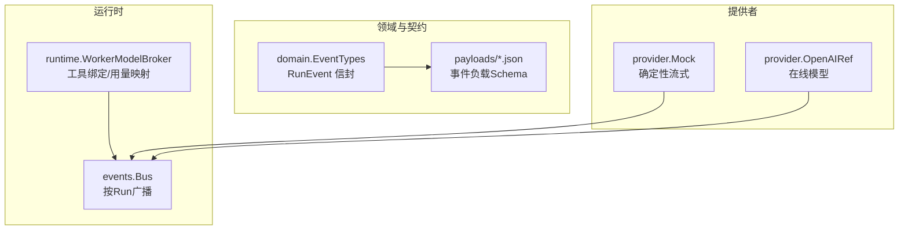
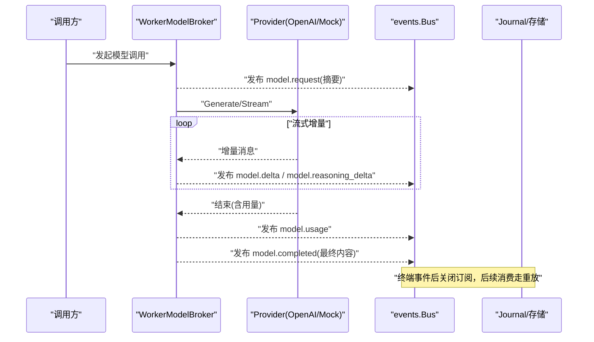
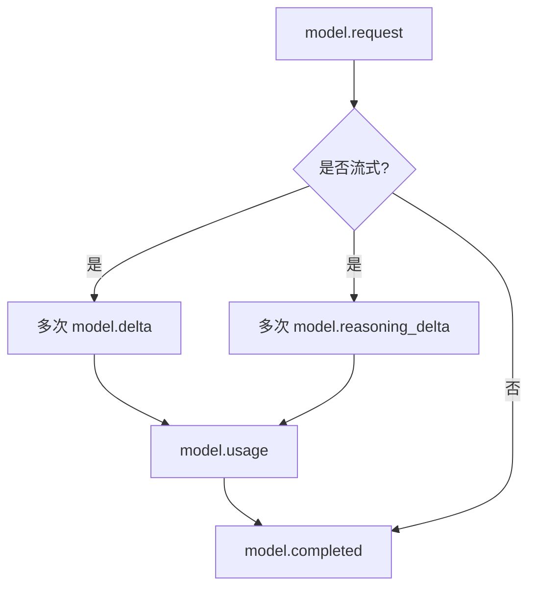
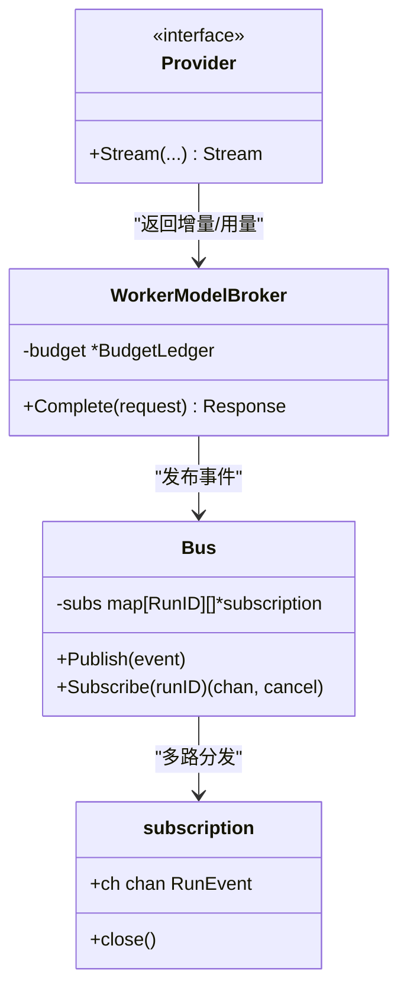
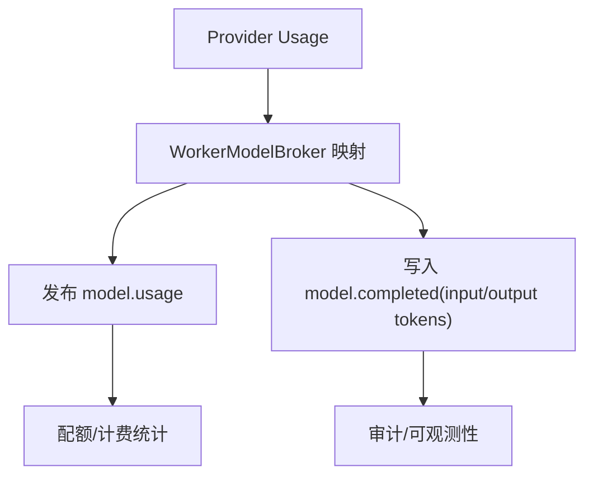
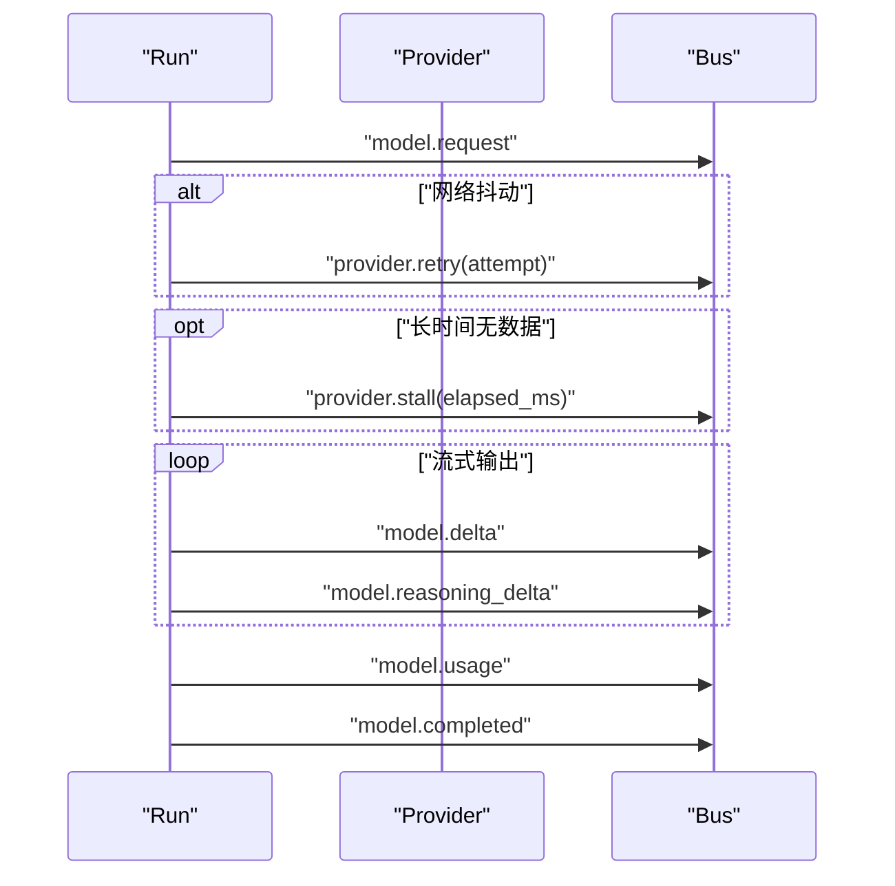
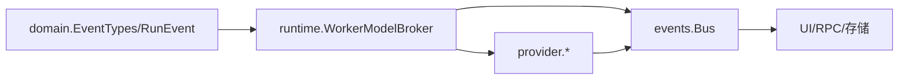

# 模型事件

<cite>
**本文引用的文件**
- [internal/domain/event.go](file://internal/domain/event.go)
- [schemas/events/run-event.schema.json](file://schemas/events/run-event.schema.json)
- [schemas/events/payloads/model.request.json](file://schemas/events/payloads/model.request.json)
- [schemas/events/payloads/model.delta.json](file://schemas/events/payloads/model.delta.json)
- [schemas/events/payloads/model.reasoning_delta.json](file://schemas/events/payloads/model.reasoning_delta.json)
- [schemas/events/payloads/model.usage.json](file://schemas/events/payloads/model.usage.json)
- [schemas/events/payloads/model.completed.json](file://schemas/events/payloads/model.completed.json)
- [schemas/events/payloads/provider.retry.json](file://schemas/events/payloads/provider.retry.json)
- [schemas/events/payloads/provider.stall.json](file://schemas/events/payloads/provider.stall.json)
- [internal/events/bus.go](file://internal/events/bus.go)
- [internal/runtime/modelbroker.go](file://internal/runtime/modelbroker.go)
- [internal/provider/mock.go](file://internal/provider/mock.go)
- [internal/provider/openai.go](file://internal/provider/openai.go)
</cite>

## 目录
1. [简介](#简介)
2. [项目结构](#项目结构)
3. [核心组件](#核心组件)
4. [架构总览](#架构总览)
5. [详细组件分析](#详细组件分析)
6. [依赖关系分析](#依赖关系分析)
7. [性能考量](#性能考量)
8. [故障排查指南](#故障排查指南)
9. [结论](#结论)
10. [附录](#附录)

## 简介
本文件面向 Vivy 运行时中的“模型事件”体系，系统化说明 AI 模型调用生命周期中产生的事件类型、负载结构与流式响应机制。重点覆盖以下事件：ModelRequest、ModelDelta、ModelReasoningDelta、ModelUsage、ModelCompleted；并解释推理增量与普通增量的区别、计费与资源监控字段、重试与停滞等错误处理事件，以及从请求到完成的完整事件序列。

## 项目结构
围绕模型事件的关键位置如下：
- 事件类型定义与运行事件信封：internal/domain/event.go、schemas/events/run-event.schema.json
- 各事件负载的 JSON Schema：schemas/events/payloads/*.json
- 事件总线（按 Run 广播）：internal/events/bus.go
- 模型调用边界与使用量映射：internal/runtime/modelbroker.go
- 提供者实现（Mock/OpenAI）：internal/provider/mock.go、internal/provider/openai.go

图表来源
- [internal/domain/event.go:8-43](file://internal/domain/event.go#L8-L43)
- [schemas/events/run-event.schema.json:18-56](file://schemas/events/run-event.schema.json#L18-L56)
- [internal/events/bus.go:10-21](file://internal/events/bus.go#L10-L21)
- [internal/runtime/modelbroker.go:67-79](file://internal/runtime/modelbroker.go#L67-L79)
- [internal/provider/mock.go:14-21](file://internal/provider/mock.go#L14-L21)
- [internal/provider/openai.go:14-23](file://internal/provider/openai.go#L14-L23)

章节来源
- [internal/domain/event.go:8-43](file://internal/domain/event.go#L8-L43)
- [schemas/events/run-event.schema.json:18-56](file://schemas/events/run-event.schema.json#L18-L56)

## 核心组件
- 事件类型与终态约定：通过 EventType 枚举集中声明，包含 model.request/delta/reasoning_delta/usage/completed 等，并提供 Terminal() 判定以约束每个 Run 仅一个终态事件。
- 运行事件信封：RunEvent 统一承载 run_id、seq、type、created_at、payload_version、payload，确保 UI、RPC、存储三方共享同一份持久化事实。
- 事件总线 Bus：按 RunID 订阅/发布，支持缓冲与掉队消费者丢弃，终端事件自动关闭通道，保证慢消费者不会阻塞运行。
- 模型调用边界 WorkerModelBroker：负责将上层消息转换为 eino schema.Message，绑定工具，执行生成，并将 provider 返回的使用量映射为内部结构。
- 提供者接口：Mock 提供确定性流式输出；OpenAIRef 构造在线模型，密钥从环境变量读取且不缓存，避免持久化。

章节来源
- [internal/domain/event.go:8-43](file://internal/domain/event.go#L8-L43)
- [internal/events/bus.go:10-21](file://internal/events/bus.go#L10-L21)
- [internal/runtime/modelbroker.go:67-79](file://internal/runtime/modelbroker.go#L67-L79)
- [internal/provider/mock.go:14-21](file://internal/provider/mock.go#L14-L21)
- [internal/provider/openai.go:14-23](file://internal/provider/openai.go#L14-L23)

## 架构总览
下图展示一次模型调用的端到端事件流：从请求摘要到增量内容、推理增量、用量统计，直至完成或异常。

图表来源
- [internal/runtime/modelbroker.go:82-125](file://internal/runtime/modelbroker.go#L82-L125)
- [internal/events/bus.go:42-75](file://internal/events/bus.go#L42-L75)
- [schemas/events/run-event.schema.json:18-56](file://schemas/events/run-event.schema.json#L18-L56)

## 详细组件分析

### 事件类型与负载定义
- model.request：记录本次模型调用所携带的消息摘要（角色、工具名、内容哈希与字节长度）、系统前缀摘要与可见工具列表。用于审计与可重建性，不保存明文。
- model.delta：普通文本增量片段，用于前端实时渲染助手回复。
- model.reasoning_delta：推理过程增量片段，用于展示思考/推理步骤，不与最终答案拼接。
- model.usage：token 用量统计，包含 prompt_tokens、completion_tokens、total_tokens，可选 reasoning_tokens。
- model.completed：本轮模型回复的最终组装内容与可选 provider 上报的用量。

图表来源
- [schemas/events/payloads/model.request.json:7-46](file://schemas/events/payloads/model.request.json#L7-L46)
- [schemas/events/payloads/model.delta.json:6-13](file://schemas/events/payloads/model.delta.json#L6-L13)
- [schemas/events/payloads/model.reasoning_delta.json:6-13](file://schemas/events/payloads/model.reasoning_delta.json#L6-L13)
- [schemas/events/payloads/model.usage.json:6-13](file://schemas/events/payloads/model.usage.json#L6-L13)
- [schemas/events/payloads/model.completed.json:6-22](file://schemas/events/payloads/model.completed.json#L6-L22)

章节来源
- [schemas/events/payloads/model.request.json:7-46](file://schemas/events/payloads/model.request.json#L7-L46)
- [schemas/events/payloads/model.delta.json:6-13](file://schemas/events/payloads/model.delta.json#L6-L13)
- [schemas/events/payloads/model.reasoning_delta.json:6-13](file://schemas/events/payloads/model.reasoning_delta.json#L6-L13)
- [schemas/events/payloads/model.usage.json:6-13](file://schemas/events/payloads/model.usage.json#L6-L13)
- [schemas/events/payloads/model.completed.json:6-22](file://schemas/events/payloads/model.completed.json#L6-L22)

### 流式响应机制与增量推送
- 增量推送：Provider 侧以流式方式返回消息片段，Broker 将其转换为事件并通过 Bus 广播。delta 用于用户可见回复，reasoning_delta 用于推理过程展示。
- 背压与健壮性：Bus 对订阅者采用有界缓冲，若消费者落后则丢弃该订阅，终端事件后关闭通道；消费者需通过 Journal 从最后 seq 重放恢复。
- 确定性流：Mock 提供者以固定大小块输出，便于测试与离线开发。

图表来源
- [internal/events/bus.go:16-28](file://internal/events/bus.go#L16-L28)
- [internal/events/bus.go:42-75](file://internal/events/bus.go#L42-L75)
- [internal/runtime/modelbroker.go:67-79](file://internal/runtime/modelbroker.go#L67-L79)
- [internal/provider/mock.go:23-51](file://internal/provider/mock.go#L23-L51)

章节来源
- [internal/events/bus.go:42-75](file://internal/events/bus.go#L42-L75)
- [internal/provider/mock.go:23-51](file://internal/provider/mock.go#L23-L51)

### 推理增量与普通增量的区别与用途
- model.delta：普通回复增量，直接拼接到最终内容 content 中，用于即时显示。
- model.reasoning_delta：推理/思考过程的增量，通常不进入最终 content，用于展示中间推理步骤，便于调试与可解释性。
- 两者均由 Provider 流式产出，Broker 根据语义分别发布对应事件类型。

章节来源
- [schemas/events/payloads/model.delta.json:6-13](file://schemas/events/payloads/model.delta.json#L6-L13)
- [schemas/events/payloads/model.reasoning_delta.json:6-13](file://schemas/events/payloads/model.reasoning_delta.json#L6-L13)

### 计费统计与资源监控
- model.usage：提供 prompt_tokens、completion_tokens、total_tokens 与可选 reasoning_tokens，用于计费与配额控制。
- model.completed：可选 input_tokens/output_tokens，来自 provider 的上报，可与 usage 互补。
- WorkerModelBroker 在收到 provider 的 ResponseMeta.Usage 时，将其映射为内部 Usage 结构，供事件与预算系统使用。

图表来源
- [internal/runtime/modelbroker.go:111-125](file://internal/runtime/modelbroker.go#L111-L125)
- [schemas/events/payloads/model.usage.json:6-13](file://schemas/events/payloads/model.usage.json#L6-L13)
- [schemas/events/payloads/model.completed.json:6-22](file://schemas/events/payloads/model.completed.json#L6-L22)

章节来源
- [internal/runtime/modelbroker.go:111-125](file://internal/runtime/modelbroker.go#L111-L125)
- [schemas/events/payloads/model.usage.json:6-13](file://schemas/events/payloads/model.usage.json#L6-L13)
- [schemas/events/payloads/model.completed.json:6-22](file://schemas/events/payloads/model.completed.json#L6-L22)

### 重试与错误处理事件
- provider.retry：当底层 Provider 发生可重试错误时发出，attempt 表示重试次数。
- provider.stall：当模型流长时间无进展时发出，elapsed_ms 表示已观察到的持续时间，便于超时与告警。
- 这些事件与 model.* 事件共同构成完整的可观测性与容错视图。

章节来源
- [schemas/events/payloads/provider.retry.json:6-14](file://schemas/events/payloads/provider.retry.json#L6-L14)
- [schemas/events/payloads/provider.stall.json:6-14](file://schemas/events/payloads/provider.stall.json#L6-L14)

### 完整事件序列示例（从请求到完成）
以下为典型的一次流式调用事件顺序（按 seq 递增）：
1. model.request：记录本次调用的消息摘要与可见工具。
2. （可选）provider.retry：出现可重试错误时的重试计数。
3. （可选）provider.stall：流式响应长时间无数据时的停滞信号。
4. 多次 model.delta：普通回复增量。
5. 多次 model.reasoning_delta：推理过程增量。
6. model.usage：token 用量统计。
7. model.completed：最终回复内容与可选用量。

图表来源
- [schemas/events/run-event.schema.json:18-56](file://schemas/events/run-event.schema.json#L18-L56)
- [schemas/events/payloads/model.request.json:7-46](file://schemas/events/payloads/model.request.json#L7-L46)
- [schemas/events/payloads/model.delta.json:6-13](file://schemas/events/payloads/model.delta.json#L6-L13)
- [schemas/events/payloads/model.reasoning_delta.json:6-13](file://schemas/events/payloads/model.reasoning_delta.json#L6-L13)
- [schemas/events/payloads/model.usage.json:6-13](file://schemas/events/payloads/model.usage.json#L6-L13)
- [schemas/events/payloads/model.completed.json:6-22](file://schemas/events/payloads/model.completed.json#L6-L22)
- [schemas/events/payloads/provider.retry.json:6-14](file://schemas/events/payloads/provider.retry.json#L6-L14)
- [schemas/events/payloads/provider.stall.json:6-14](file://schemas/events/payloads/provider.stall.json#L6-L14)

## 依赖关系分析
- domain 层定义事件类型与 RunEvent 信封，是所有组件共享的契约。
- runtime 层通过 WorkerModelBroker 桥接 eino 模型能力，并将用量映射为事件负载。
- provider 层实现具体模型接入（Mock/OpenAI），遵循统一的流式接口。
- events 层提供轻量级总线，解耦生产与消费，保障可靠性与可扩展性。

图表来源
- [internal/domain/event.go:8-43](file://internal/domain/event.go#L8-L43)
- [internal/runtime/modelbroker.go:67-79](file://internal/runtime/modelbroker.go#L67-L79)
- [internal/events/bus.go:10-21](file://internal/events/bus.go#L10-L21)

章节来源
- [internal/domain/event.go:8-43](file://internal/domain/event.go#L8-L43)
- [internal/runtime/modelbroker.go:67-79](file://internal/runtime/modelbroker.go#L67-L79)
- [internal/events/bus.go:10-21](file://internal/events/bus.go#L10-L21)

## 性能考量
- 事件负载大小：delta 与 reasoning_delta 受运行时最大事件负载限制，避免单条过大影响传输与渲染。
- 背压策略：Bus 对慢消费者直接丢弃并关闭通道，避免阻塞上游；消费者通过 Journal 从最后 seq 重放，保证一致性。
- 确定性流：Mock 使用固定块大小，便于测试与回归验证。
- 密钥安全：Provider 密钥从环境变量读取且不在内存中长期缓存，避免泄露。

章节来源
- [schemas/events/payloads/model.delta.json:6-13](file://schemas/events/payloads/model.delta.json#L6-L13)
- [internal/events/bus.go:42-75](file://internal/events/bus.go#L42-L75)
- [internal/provider/mock.go:14-21](file://internal/provider/mock.go#L14-L21)
- [internal/provider/openai.go:14-23](file://internal/provider/openai.go#L14-L23)

## 故障排查指南
- 长时间无响应：关注 provider.stall 事件的 elapsed_ms，结合网络与 Provider 状态判断是否超时。
- 频繁重试：检查 provider.retry 的 attempt 增长情况，定位不稳定因素。
- 消费者掉队：若 UI 或 RPC 订阅丢失，确认是否因缓冲满被丢弃；通过 Journal 从最后 seq 重放恢复。
- 用量不一致：对比 model.usage 与 model.completed 中的 input/output tokens，确认 Provider 上报差异。

章节来源
- [schemas/events/payloads/provider.stall.json:6-14](file://schemas/events/payloads/provider.stall.json#L6-L14)
- [schemas/events/payloads/provider.retry.json:6-14](file://schemas/events/payloads/provider.retry.json#L6-L14)
- [internal/events/bus.go:42-75](file://internal/events/bus.go#L42-L75)
- [schemas/events/payloads/model.usage.json:6-13](file://schemas/events/payloads/model.usage.json#L6-L13)
- [schemas/events/payloads/model.completed.json:6-22](file://schemas/events/payloads/model.completed.json#L6-L22)

## 结论
Vivy 的模型事件体系以强契约（JSON Schema + EventType）为核心，配合事件总线与模型调用边界，实现了可观测、可重放、可计费的流式响应能力。通过区分普通增量与推理增量，既满足实时交互体验，又提供推理过程的可解释性。重试与停滞事件完善了错误处理与监控维度，使系统在复杂网络与 Provider 环境下仍具备鲁棒性。

## 附录
- 事件类型清单：见 internal/domain/event.go 中的 EventType 常量集合。
- 事件信封规范：见 schemas/events/run-event.schema.json。
- 各事件负载 Schema：见 schemas/events/payloads/*.json。
- 模型调用边界：见 internal/runtime/modelbroker.go。
- 提供者实现：见 internal/provider/mock.go、internal/provider/openai.go。