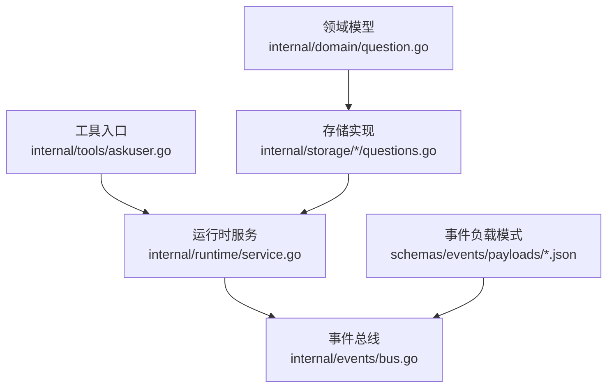
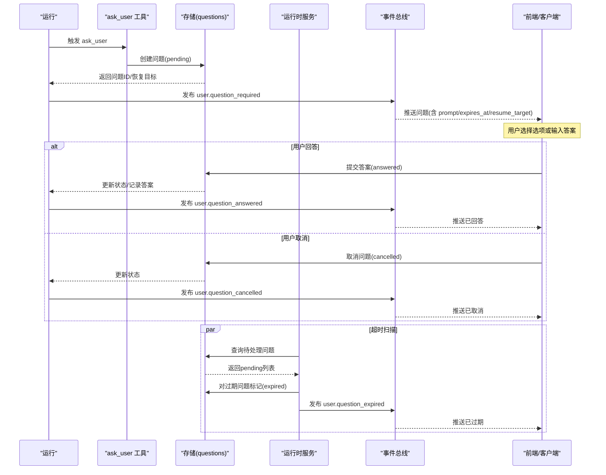
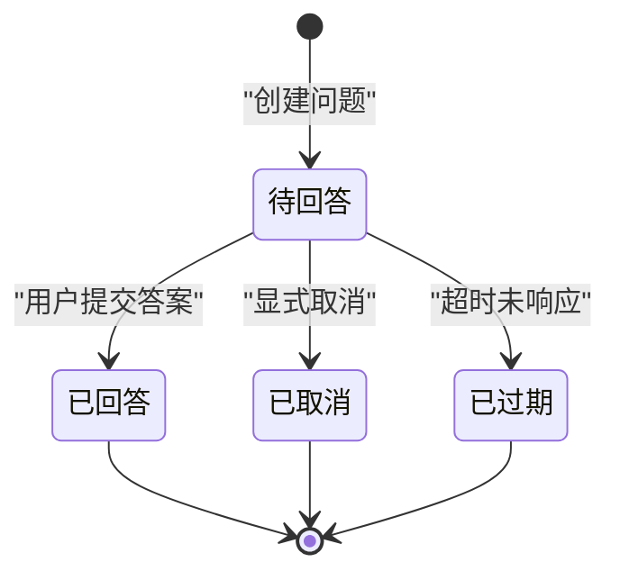
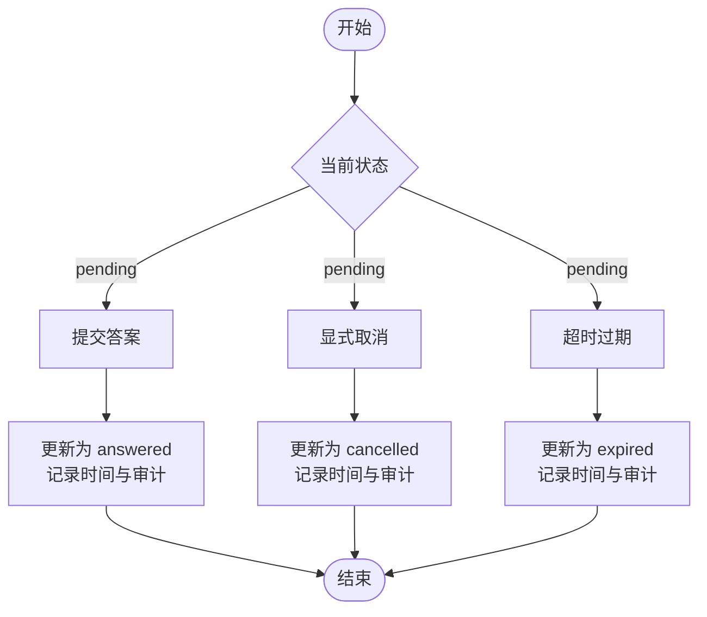
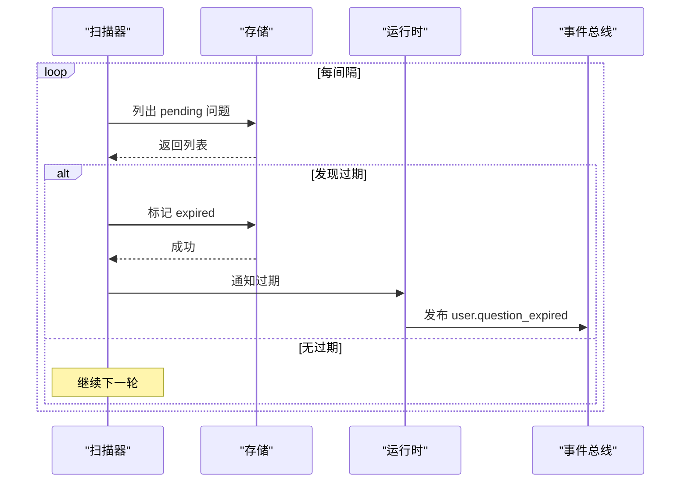
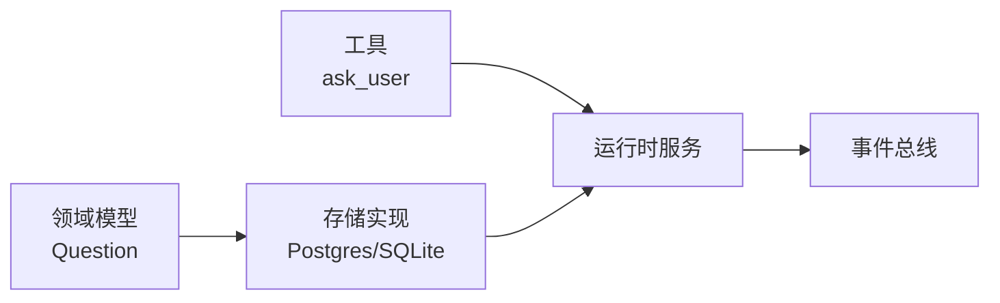

# 用户交互事件

<cite>
**本文引用的文件**
- [internal/domain/question.go](file://internal/domain/question.go)
- [schemas/events/payloads/user.question_required.json](file://schemas/events/payloads/user.question_required.json)
- [schemas/events/payloads/user.question_answered.json](file://schemas/events/payloads/user.question_answered.json)
- [schemas/events/payloads/user.question_cancelled.json](file://schemas/events/payloads/user.question_cancelled.json)
- [schemas/events/payloads/user.question_expired.json](file://schemas/events/payloads/user.question_expired.json)
- [internal/tools/askuser.go](file://internal/tools/askuser.go)
- [internal/storage/postgres/questions.go](file://internal/storage/postgres/questions.go)
- [internal/storage/sqlite/questions.go](file://internal/storage/sqlite/questions.go)
- [internal/runtime/service.go](file://internal/runtime/service.go)
- [internal/events/bus.go](file://internal/events/bus.go)
</cite>

## 目录
1. [简介](#简介)
2. [项目结构](#项目结构)
3. [核心组件](#核心组件)
4. [架构总览](#架构总览)
5. [详细组件分析](#详细组件分析)
6. [依赖关系分析](#依赖关系分析)
7. [性能考虑](#性能考虑)
8. [故障排查指南](#故障排查指南)
9. [结论](#结论)
10. [附录](#附录)

## 简介
本文件聚焦于 Vivy 运行时的“用户问答”交互机制，围绕四类事件：
- UserQuestionRequired：提出需要用户回答的问题并挂起执行
- UserQuestionAnswered：用户提交答案，问题被解答
- UserQuestionCancelled：问题被取消（例如运行被终止）
- UserQuestionExpired：问题超时未响应，系统自动过期

文档将解释每个事件的负载字段、问题生命周期管理（创建、响应、超时、取消）、与工具审批的区别与联系、以及等待状态的持久化策略。

## 项目结构
围绕用户问答的关键位置如下：
- 领域模型：internal/domain/question.go 定义了 Question 及其状态机
- 事件负载模式：schemas/events/payloads 下四个 JSON Schema 定义事件载荷
- 工具入口：internal/tools/askuser.go 声明 ask_user 控制流工具
- 存储实现：internal/storage/{postgres,sqlite}/questions.go 提供问题的持久化与状态迁移
- 运行时调度：internal/runtime/service.go 负责超时扫描与恢复
- 事件总线：internal/events/bus.go 用于向订阅者推送事件

图表来源
- [internal/domain/question.go:1-29](file://internal/domain/question.go#L1-L29)
- [internal/storage/postgres/questions.go:14-133](file://internal/storage/postgres/questions.go#L14-L133)
- [internal/storage/sqlite/questions.go:14-133](file://internal/storage/sqlite/questions.go#L14-L133)
- [internal/tools/askuser.go:11-35](file://internal/tools/askuser.go#L11-L35)
- [internal/runtime/service.go:389-463](file://internal/runtime/service.go#L389-L463)
- [internal/events/bus.go:10-115](file://internal/events/bus.go#L10-L115)

章节来源
- [internal/domain/question.go:1-29](file://internal/domain/question.go#L1-L29)
- [internal/tools/askuser.go:11-35](file://internal/tools/askuser.go#L11-L35)
- [internal/storage/postgres/questions.go:14-133](file://internal/storage/postgres/questions.go#L14-L133)
- [internal/storage/sqlite/questions.go:14-133](file://internal/storage/sqlite/questions.go#L14-L133)
- [internal/runtime/service.go:389-463](file://internal/runtime/service.go#L389-L463)
- [internal/events/bus.go:10-115](file://internal/events/bus.go#L10-L115)

## 核心组件
- 领域模型 Question：包含问题标识、所属运行、工具调用标识、提示文本、答案、状态、过期时间、恢复目标、创建/回答时间、操作者与决策原因等。状态包括 pending、answered、cancelled、expired。
- 事件负载：四类事件分别定义在 JSON Schema 中，约束必填字段与类型，保证前后端一致。
- 工具 ask_user：声明为控制流工具，仅用于发起用户问答，不直接执行副作用。
- 存储后端：Postgres 与 SQLite 均提供 Create/Get/ListPending/Answer/Cancel/Expire 等方法，确保并发安全（首次写入获胜）。
- 运行时服务：启动后台扫描器定期检查待处理问题是否超时；重启恢复时也会处理过期或重建挂起。
- 事件总线：按 runID 分发事件给在线订阅者，终端事件关闭通道，落后者通过日志重放。

章节来源
- [internal/domain/question.go:1-29](file://internal/domain/question.go#L1-L29)
- [schemas/events/payloads/user.question_required.json:1-19](file://schemas/events/payloads/user.question_required.json#L1-L19)
- [schemas/events/payloads/user.question_answered.json:1-13](file://schemas/events/payloads/user.question_answered.json#L1-L13)
- [schemas/events/payloads/user.question_cancelled.json:1-14](file://schemas/events/payloads/user.question_cancelled.json#L1-L14)
- [schemas/events/payloads/user.question_expired.json:1-15](file://schemas/events/payloads/user.question_expired.json#L1-L15)
- [internal/tools/askuser.go:11-35](file://internal/tools/askuser.go#L11-L35)
- [internal/storage/postgres/questions.go:14-133](file://internal/storage/postgres/questions.go#L14-L133)
- [internal/storage/sqlite/questions.go:14-133](file://internal/storage/sqlite/questions.go#L14-L133)
- [internal/runtime/service.go:389-463](file://internal/runtime/service.go#L389-L463)
- [internal/events/bus.go:10-115](file://internal/events/bus.go#L10-L115)

## 架构总览
下图展示从“提出问题”到“最终处理”的端到端流程，涵盖事件发布、存储持久化、超时扫描与恢复。

图表来源
- [internal/tools/askuser.go:11-35](file://internal/tools/askuser.go#L11-L35)
- [internal/storage/postgres/questions.go:14-133](file://internal/storage/postgres/questions.go#L14-L133)
- [internal/storage/sqlite/questions.go:14-133](file://internal/storage/sqlite/questions.go#L14-L133)
- [internal/runtime/service.go:389-463](file://internal/runtime/service.go#L389-L463)
- [internal/events/bus.go:10-115](file://internal/events/bus.go#L10-L115)

## 详细组件分析

### 领域模型与状态机
- Question 字段说明：
  - ID：问题唯一标识
  - RunID：所属运行
  - ToolCallID：关联的工具调用标识
  - Prompt：展示给用户的提示文本
  - Answer：用户答案（仅在服务端验证通过后持久化）
  - Status：pending/answered/cancelled/expired
  - ExpiresAt：过期时间戳（毫秒）
  - ResumeTarget：恢复目标（用于后续恢复执行）
  - CreatedAt/AnsweredAt：创建与回答时间
  - Actor/DecisionReason：操作者与决策原因（审计用）

- 状态迁移规则：
  - pending → answered：用户提交答案且通过校验
  - pending → cancelled：运行或外部动作显式取消
  - pending → expired：超过 ExpiresAt 仍未响应

图表来源
- [internal/domain/question.go:1-29](file://internal/domain/question.go#L1-L29)
- [internal/storage/postgres/questions.go:75-133](file://internal/storage/postgres/questions.go#L75-L133)
- [internal/storage/sqlite/questions.go:75-133](file://internal/storage/sqlite/questions.go#L75-L133)

章节来源
- [internal/domain/question.go:1-29](file://internal/domain/question.go#L1-L29)
- [internal/storage/postgres/questions.go:75-133](file://internal/storage/postgres/questions.go#L75-L133)
- [internal/storage/sqlite/questions.go:75-133](file://internal/storage/sqlite/questions.go#L75-L133)

### 事件负载定义
- user.question_required（必需字段）：
  - question_id：问题ID
  - tool_call_id：工具调用ID
  - prompt：问题描述
  - expires_at：过期时间戳
  - resume_target：恢复目标
  - selected_tools：可选，当前选中的工具列表
  - mode：normal 或 plan

- user.question_answered（必需字段）：
  - question_id：问题ID
  - answer：用户答案

- user.question_cancelled（必需字段）：
  - question_id：问题ID
  - actor：操作者（可选）
  - reason：原因（可选）

- user.question_expired（必需字段）：
  - review_id：审查/上下文ID（用于关联）
  - kind：固定值 "question"
  - expires_at：过期时间戳
  - reason：过期原因

章节来源
- [schemas/events/payloads/user.question_required.json:1-19](file://schemas/events/payloads/user.question_required.json#L1-L19)
- [schemas/events/payloads/user.question_answered.json:1-13](file://schemas/events/payloads/user.question_answered.json#L1-L13)
- [schemas/events/payloads/user.question_cancelled.json:1-14](file://schemas/events/payloads/user.question_cancelled.json#L1-L14)
- [schemas/events/payloads/user.question_expired.json:1-15](file://schemas/events/payloads/user.question_expired.json#L1-L15)

### 工具入口与交互契约
- ask_user 是控制流工具，仅用于暂停运行以获取用户澄清信息，不授权任何副作用。
- 参数：question（必须），用于生成 Prompt。
- 行为：由运行时接管，不会直接执行副作用；实际交互通过事件与存储完成。

章节来源
- [internal/tools/askuser.go:11-35](file://internal/tools/askuser.go#L11-L35)

### 存储与持久化
- 创建问题：插入 pending 状态，设置 CreatedAt（若未提供）
- 读取问题：按 ID 获取，不存在返回未找到错误
- 列出待处理：按过期时间倒序返回 pending 问题
- 回答问题：首次写入获胜，更新为 answered，记录 answered_at、actor、decision_reason
- 取消问题：将 pending 转为 cancelled，记录审计元数据
- 过期问题：将 pending 转为 expired，actor 为 system，记录原因

图表来源
- [internal/storage/postgres/questions.go:14-133](file://internal/storage/postgres/questions.go#L14-L133)
- [internal/storage/sqlite/questions.go:14-133](file://internal/storage/sqlite/questions.go#L14-L133)

章节来源
- [internal/storage/postgres/questions.go:14-133](file://internal/storage/postgres/questions.go#L14-L133)
- [internal/storage/sqlite/questions.go:14-133](file://internal/storage/sqlite/questions.go#L14-L133)

### 超时策略与后台扫描
- 后台扫描器：定时轮询（默认秒级），查询待处理问题，若 ExpiresAt <= 当前时间则过期。
- 重启恢复：启动时扫描活跃运行，若存在 pending 问题且已过期，则过期；否则尝试重建挂起。
- 并发安全：过期与回答均为条件更新，避免竞态导致重复终态。

图表来源
- [internal/runtime/service.go:389-463](file://internal/runtime/service.go#L389-L463)
- [internal/storage/postgres/questions.go:50-133](file://internal/storage/postgres/questions.go#L50-L133)
- [internal/storage/sqlite/questions.go:50-133](file://internal/storage/sqlite/questions.go#L50-L133)

章节来源
- [internal/runtime/service.go:389-463](file://internal/runtime/service.go#L389-L463)

### 事件总线与重放
- 事件按 runID 分发给在线订阅者；终端事件会关闭通道。
- 慢消费者会被丢弃，需通过日志重放从上次序列号恢复。
- 事件总线不拥有历史，Journal 是唯一事实源。

章节来源
- [internal/events/bus.go:10-115](file://internal/events/bus.go#L10-L115)

### 用户交互与工具审批的区别与联系
- 区别：
  - 用户问答（UserQuestion*）：用于澄清与收集信息，不授权副作用；答案在服务端验证后持久化。
  - 工具审批（tool.approval_*）：用于授权可能产生副作用的操作，属于治理审批流。
- 联系：
  - 两者都通过事件驱动与存储持久化，支持超时与取消。
  - 运行时统一管理与恢复，确保运行不被卡死。

章节来源
- [internal/tools/askuser.go:11-35](file://internal/tools/askuser.go#L11-L35)
- [internal/runtime/service.go:389-463](file://internal/runtime/service.go#L389-L463)

## 依赖关系分析
- 领域模型依赖：Question 状态与字段被存储层与运行时引用。
- 存储层依赖：Postgres/SQLite 实现 Questions 接口，提供一致的 CRUD 与状态迁移。
- 运行时依赖：Service 依赖存储层进行过期扫描与恢复，并通过事件总线广播事件。
- 工具依赖：ask_user 仅声明工具规格，具体执行由运行时接管。

图表来源
- [internal/domain/question.go:1-29](file://internal/domain/question.go#L1-L29)
- [internal/storage/postgres/questions.go:14-133](file://internal/storage/postgres/questions.go#L14-L133)
- [internal/storage/sqlite/questions.go:14-133](file://internal/storage/sqlite/questions.go#L14-L133)
- [internal/tools/askuser.go:11-35](file://internal/tools/askuser.go#L11-L35)
- [internal/runtime/service.go:389-463](file://internal/runtime/service.go#L389-L463)
- [internal/events/bus.go:10-115](file://internal/events/bus.go#L10-L115)

章节来源
- [internal/domain/question.go:1-29](file://internal/domain/question.go#L1-L29)
- [internal/storage/postgres/questions.go:14-133](file://internal/storage/postgres/questions.go#L14-L133)
- [internal/storage/sqlite/questions.go:14-133](file://internal/storage/sqlite/questions.go#L14-L133)
- [internal/tools/askuser.go:11-35](file://internal/tools/askuser.go#L11-L35)
- [internal/runtime/service.go:389-463](file://internal/runtime/service.go#L389-L463)
- [internal/events/bus.go:10-115](file://internal/events/bus.go#L10-L115)

## 性能考虑
- 首次写入获胜：回答与取消使用条件更新，避免重复终态与竞态。
- 后台扫描间隔可调：默认秒级，可根据负载调整以减少数据库压力。
- 事件总线缓冲：订阅通道有缓冲，慢消费者会被丢弃，需通过日志重放恢复，避免阻塞主流程。
- 存储查询优化：待处理问题按过期时间倒序排序，优先处理即将过期的问题。

[本节为通用指导，无需特定文件引用]

## 故障排查指南
- 常见问题：
  - 问题未显示：确认 user.question_required 是否发布，前端是否正确订阅对应 runID。
  - 回答无效：检查存储层是否仍为 pending；若已被取消或过期，应返回相应错误。
  - 超时未生效：确认后台扫描器是否运行，存储层 ExpireQuestion 是否成功。
  - 重启后状态异常：检查 Recover 逻辑是否正确过期或重建挂起。
- 定位方法：
  - 查看事件总线日志，确认事件发布与消费情况。
  - 检查存储层 SQL 执行结果与受影响行数。
  - 核对事件负载是否符合 JSON Schema 约束。

章节来源
- [internal/events/bus.go:10-115](file://internal/events/bus.go#L10-L115)
- [internal/storage/postgres/questions.go:75-133](file://internal/storage/postgres/questions.go#L75-L133)
- [internal/storage/sqlite/questions.go:75-133](file://internal/storage/sqlite/questions.go#L75-L133)
- [internal/runtime/service.go:389-463](file://internal/runtime/service.go#L389-L463)

## 结论
用户问答机制通过清晰的状态机、严格的负载模式与可靠的存储实现，确保了交互的可观测性与可恢复性。运行时提供的超时扫描与重启恢复进一步保障了系统的健壮性。与工具审批相比，用户问答专注于信息澄清，不授权副作用，二者共同构成完整的交互式治理体系。

[本节为总结，无需特定文件引用]

## 附录
- 完整事件流示例（从问题提出到最终处理）：
  1) 运行触发 ask_user，存储创建 pending 问题
  2) 发布 user.question_required，前端展示 prompt、选项与倒计时
  3a) 用户提交答案：存储更新为 answered，发布 user.question_answered
  3b) 用户取消：存储更新为 cancelled，发布 user.question_cancelled
  3c) 超时未响应：扫描器标记 expired，发布 user.question_expired
  4) 运行根据事件恢复执行或终止

[本节为概念性流程，无需特定文件引用]