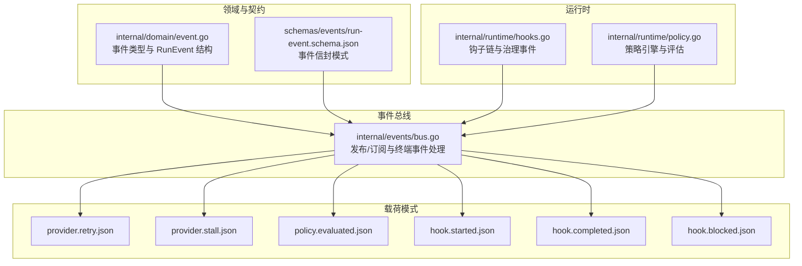
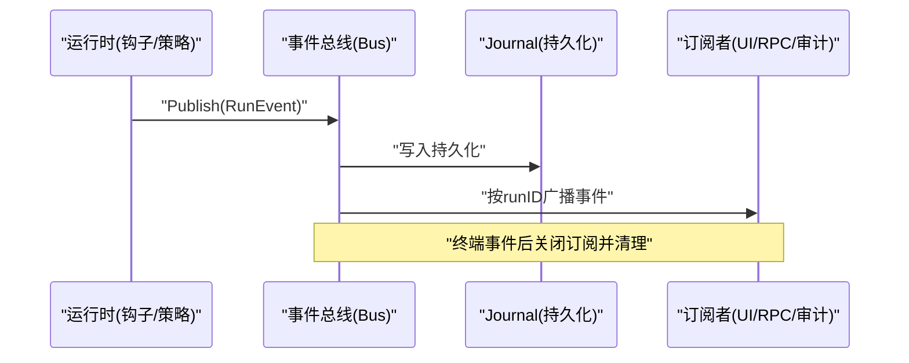
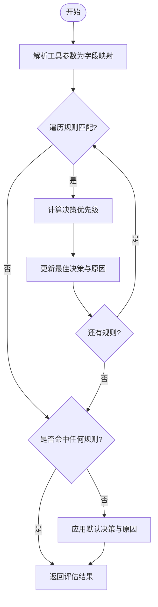
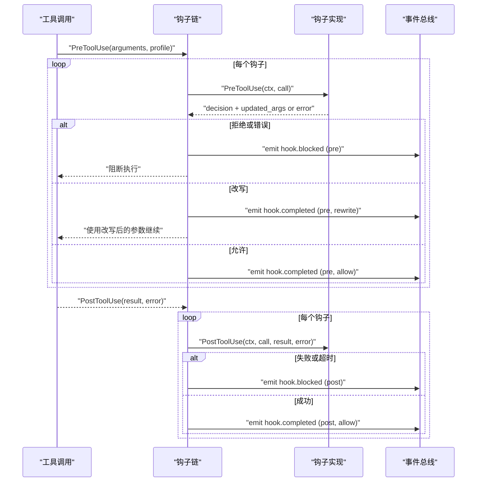
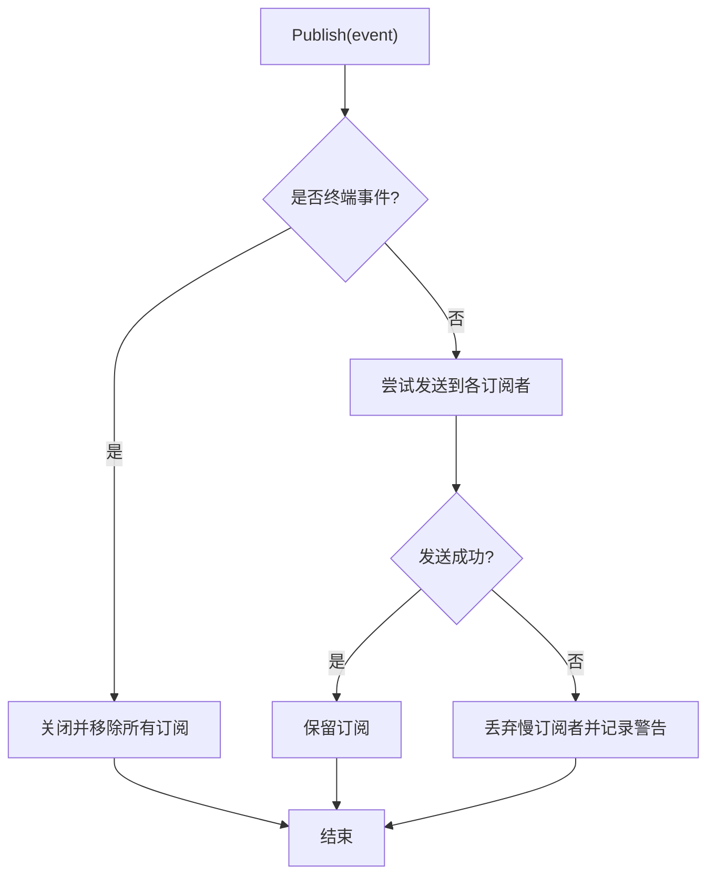
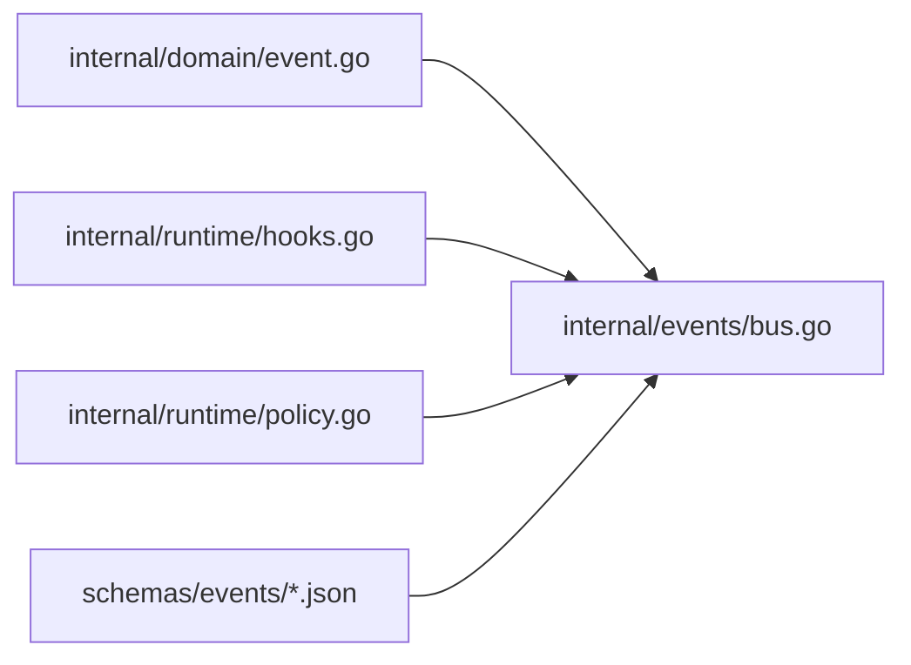

# 系统事件

<cite>
**本文引用的文件**
- [internal/domain/event.go](file://internal/domain/event.go)
- [internal/events/bus.go](file://internal/events/bus.go)
- [schemas/events/run-event.schema.json](file://schemas/events/run-event.schema.json)
- [schemas/events/payloads/provider.retry.json](file://schemas/events/payloads/provider.retry.json)
- [schemas/events/payloads/provider.stall.json](file://schemas/events/payloads/provider.stall.json)
- [schemas/events/payloads/policy.evaluated.json](file://schemas/events/payloads/policy.evaluated.json)
- [schemas/events/payloads/hook.started.json](file://schemas/events/payloads/hook.started.json)
- [schemas/events/payloads/hook.completed.json](file://schemas/events/payloads/hook.completed.json)
- [schemas/events/payloads/hook.blocked.json](file://schemas/events/payloads/hook.blocked.json)
- [internal/runtime/hooks.go](file://internal/runtime/hooks.go)
- [internal/runtime/policy.go](file://internal/runtime/policy.go)
</cite>

## 目录
1. [简介](#简介)
2. [项目结构](#项目结构)
3. [核心组件](#核心组件)
4. [架构总览](#架构总览)
5. [详细组件分析](#详细组件分析)
6. [依赖关系分析](#依赖关系分析)
7. [性能与可观测性](#性能与可观测性)
8. [故障诊断指南](#故障诊断指南)
9. [结论](#结论)
10. [附录：事件负载与配置选项](#附录事件负载与配置选项)

## 简介
本文件系统化说明 Vivy 运行时的“系统级事件”能力，覆盖以下主题：
- 提供商重试与停滞检测（ProviderRetry、ProviderStall）：用于暴露外部模型/工具调用的重试与卡顿信号，支撑故障转移与性能监控。
- 策略评估事件（PolicyEvaluated）：记录安全策略与访问控制规则的评估结果，便于审计与回溯。
- 钩子系统事件（HookStarted、HookCompleted、HookBlocked）：描述扩展点生命周期与拦截机制，包括 pre/post 阶段与决策语义。
- 事件总线与持久化：基于 journal 的可靠事件流，支持按游标重放与订阅者保护。
- 监控与诊断：提供事件分析示例，帮助定位问题与优化性能。
- 可观测性与调试：事件在 UI、RPC、日志与审计中的统一作用。

## 项目结构
围绕事件的核心由三部分构成：
- 领域定义：事件类型与运行时事件结构体。
- 事件总线：内存广播与订阅管理，保证终端事件后关闭流并清理订阅。
- 事件载荷模式：JSON Schema 对每个事件类型的 payload 进行强约束，确保前后端一致。

**图表来源**
- [internal/domain/event.go:1-129](file://internal/domain/event.go#L1-L129)
- [schemas/events/run-event.schema.json:1-76](file://schemas/events/run-event.schema.json#L1-L76)
- [internal/events/bus.go:1-115](file://internal/events/bus.go#L1-L115)
- [internal/runtime/hooks.go:1-160](file://internal/runtime/hooks.go#L1-L160)
- [internal/runtime/policy.go:1-274](file://internal/runtime/policy.go#L1-L274)

**章节来源**
- [internal/domain/event.go:1-129](file://internal/domain/event.go#L1-L129)
- [schemas/events/run-event.schema.json:1-76](file://schemas/events/run-event.schema.json#L1-L76)
- [internal/events/bus.go:1-115](file://internal/events/bus.go#L1-L115)

## 核心组件
- 事件类型与结构
  - 事件类型集合包含 ProviderRetry、ProviderStall、PolicyEvaluated、HookStarted、HookCompleted、HookBlocked 等，并提供终端事件判定与运行状态映射。
  - RunEvent 为每条持久化日志条目，包含 run_id、seq、type、created_at、payload_version、payload。
- 事件总线
  - Bus 负责将 RunEvent 广播给按 run 分组的订阅者；终端事件会关闭并移除所有订阅；慢消费者会被丢弃并通过 journal 重放恢复。
- 载荷模式
  - 每个事件类型对应一个 JSON Schema，严格限定字段与取值范围，保障跨进程/前后端一致性。

**章节来源**
- [internal/domain/event.go:1-129](file://internal/domain/event.go#L1-L129)
- [internal/events/bus.go:1-115](file://internal/events/bus.go#L1-L115)
- [schemas/events/run-event.schema.json:1-76](file://schemas/events/run-event.schema.json#L1-L76)

## 架构总览
事件从运行时产生，经事件总线分发到订阅者（UI、RPC、审计），同时作为 journal 的持久化条目被回放。钩子与策略在工具调用路径中注入，产出治理类事件；提供商层通过重试与停滞检测输出可观测信号。

**图表来源**
- [internal/events/bus.go:42-75](file://internal/events/bus.go#L42-L75)
- [internal/domain/event.go:93-116](file://internal/domain/event.go#L93-L116)

## 详细组件分析

### 提供商重试事件（ProviderRetry）
- 触发时机
  - 当外部提供商调用发生可重试错误时，记录一次重试尝试。该事件不携带错误文本，仅包含尝试序号，避免泄露敏感信息。
- 负载结构
  - attempt：正整数，表示第几次重试。
- 用途
  - 统计重试频率、识别不稳定提供商、辅助自动降级或熔断策略。
- 相关实现
  - 事件类型与 RunEvent 结构定义于领域层；载荷模式由 JSON Schema 约束。

**章节来源**
- [internal/domain/event.go:8-43](file://internal/domain/event.go#L8-L43)
- [schemas/events/payloads/provider.retry.json:1-16](file://schemas/events/payloads/provider.retry.json#L1-L16)

### 提供商停滞事件（ProviderStall）
- 触发时机
  - 当模型流式响应长时间无数据（例如网络拥塞、远端卡住）时，记录停滞事件，附带已观察到的持续时间（毫秒）。
- 负载结构
  - elapsed_ms：非负整数，表示自上次有效数据以来的耗时。
- 用途
  - 监控长尾延迟、触发超时或切换提供商、告警。
- 相关实现
  - 事件类型与 RunEvent 结构定义于领域层；载荷模式由 JSON Schema 约束。

**章节来源**
- [internal/domain/event.go:8-43](file://internal/domain/event.go#L8-L43)
- [schemas/events/payloads/provider.stall.json:1-16](file://schemas/events/payloads/provider.stall.json#L1-L16)

### 策略评估事件（PolicyEvaluated）
- 触发时机
  - 每次对工具调用进行安全策略与访问控制规则评估后，记录评估结果，包括匹配的规则集摘要（profile）、决策与原因。
- 负载结构
  - tool_name：工具名称。
  - decision：枚举值 allow/prompt/deny。
  - profile：策略配置文件标识。
  - policy_hash：策略快照哈希，便于版本追踪。
  - reason：可选原因说明。
- 评估逻辑
  - 策略引擎根据 profile 的默认决策与规则匹配决定最终决策；规则支持精确匹配与前缀匹配；不可用参数将被忽略。
  - 对于只读或交互型工具，默认允许；未命中规则时回退至 profile 默认或策略集默认。
- 用途
  - 审计与安全合规、可视化展示审批流程、自动化决策解释。

**图表来源**
- [internal/runtime/policy.go:96-135](file://internal/runtime/policy.go#L96-L135)
- [internal/runtime/policy.go:137-169](file://internal/runtime/policy.go#L137-L169)
- [internal/runtime/policy.go:171-202](file://internal/runtime/policy.go#L171-L202)

**章节来源**
- [internal/runtime/policy.go:19-202](file://internal/runtime/policy.go#L19-L202)
- [schemas/events/payloads/policy.evaluated.json:1-16](file://schemas/events/payloads/policy.evaluated.json#L1-L16)

### 钩子系统事件（HookStarted、HookCompleted、HookBlocked）
- 生命周期
  - 每个工具调用执行前（pre）与执行后（post）都会进入钩子链。
  - Pre 阶段：若任一钩子拒绝或改写失败，则阻断执行并记录 blocked；若改写成功，则继续执行。
  - Post 阶段：fail-open 设计，即使钩子失败也不影响工具结果，但会记录 blocked 并告警。
- 事件语义
  - HookStarted：钩子开始执行，记录工具名、钩子名、阶段与策略 profile。
  - HookCompleted：钩子完成，记录决策（allow/rewrite）与耗时。
  - HookBlocked：钩子阻止执行或自身失败，记录原因与耗时。
- 超时与错误
  - 钩子调用带超时上下文；超时或异常均视为 blocked，并附带具体原因。
- 用途
  - 扩展点治理（如输入校验、输出脱敏、审计）、拦截危险操作、收集性能指标。

**图表来源**
- [internal/runtime/hooks.go:58-129](file://internal/runtime/hooks.go#L58-L129)

**章节来源**
- [internal/runtime/hooks.go:14-160](file://internal/runtime/hooks.go#L14-L160)
- [schemas/events/payloads/hook.started.json:1-15](file://schemas/events/payloads/hook.started.json#L1-L15)
- [schemas/events/payloads/hook.completed.json:1-18](file://schemas/events/payloads/hook.completed.json#L1-L18)
- [schemas/events/payloads/hook.blocked.json:1-17](file://schemas/events/payloads/hook.blocked.json#L1-L17)

### 事件总线与持久化
- 发布与订阅
  - Publish 将事件广播给当前 run 的所有订阅者；终端事件会关闭并删除订阅。
  - Subscribe 返回通道与取消函数；通道缓冲大小可配置，防止突发流量阻塞。
- 慢消费者保护
  - 若订阅者无法及时消费，将被丢弃并记录警告；后续通过 journal 从最后序列号重放恢复，不会丢失事件。
- 终端事件语义
  - 终端事件包括 run 与 child 的完成/失败/取消；它们标志着 run 的生命周期结束。

**图表来源**
- [internal/events/bus.go:42-75](file://internal/events/bus.go#L42-L75)
- [internal/domain/event.go:93-116](file://internal/domain/event.go#L93-L116)

**章节来源**
- [internal/events/bus.go:10-115](file://internal/events/bus.go#L10-L115)
- [internal/domain/event.go:93-116](file://internal/domain/event.go#L93-L116)

## 依赖关系分析
- 领域层（domain）定义事件类型与结构，供运行时与事件总线引用。
- 运行时（runtime）在钩子与策略评估过程中产生治理事件，并通过上下文注入的事件接收器持久化。
- 事件总线（events）解耦生产与消费，提供可靠的分发与终端事件清理。
- 模式层（schemas）约束事件载荷，确保跨模块一致性。

**图表来源**
- [internal/domain/event.go:1-129](file://internal/domain/event.go#L1-L129)
- [internal/events/bus.go:1-115](file://internal/events/bus.go#L1-L115)
- [internal/runtime/hooks.go:1-160](file://internal/runtime/hooks.go#L1-L160)
- [internal/runtime/policy.go:1-274](file://internal/runtime/policy.go#L1-L274)
- [schemas/events/run-event.schema.json:1-76](file://schemas/events/run-event.schema.json#L1-L76)

**章节来源**
- [internal/domain/event.go:1-129](file://internal/domain/event.go#L1-L129)
- [internal/events/bus.go:1-115](file://internal/events/bus.go#L1-L115)
- [internal/runtime/hooks.go:1-160](file://internal/runtime/hooks.go#L1-L160)
- [internal/runtime/policy.go:1-274](file://internal/runtime/policy.go#L1-L274)
- [schemas/events/run-event.schema.json:1-76](file://schemas/events/run-event.schema.json#L1-L76)

## 性能与可观测性
- 重试与停滞
  - ProviderRetry 提供重试次数，可用于统计重试率与识别不稳定提供商。
  - ProviderStall 提供停滞时长，有助于发现长尾延迟与网络问题。
- 策略评估
  - PolicyEvaluated 提供决策与原因，便于审计与可视化；policy_hash 支持版本对比与回滚。
- 钩子性能
  - HookCompleted/HookBlocked 包含 duration_ms，可用于定位慢钩子与超时问题。
- 事件总线
  - 终端事件关闭订阅，避免资源泄漏；慢消费者丢弃并提示重放，保证运行稳定性。

[本节为通用指导，无需特定文件来源]

## 故障诊断指南
- 高频重试
  - 现象：连续出现 provider.retry 事件，attempt 递增。
  - 排查：检查提供商可用性、限流策略、网络质量；结合 provider.stall 判断是否为卡顿导致。
- 长期停滞
  - 现象：provider.stall 的 elapsed_ms 持续增长。
  - 排查：确认下游服务健康、连接池与超时配置；必要时触发熔断或切换提供商。
- 策略误判
  - 现象：policy.evaluated 显示 deny 或 prompt，reason 不符合预期。
  - 排查：核对 profile 与规则匹配；检查参数字段大小写与前缀匹配；验证 policy_hash 是否为新版本。
- 钩子阻断
  - 现象：hook.blocked 频繁出现，reason 指示超时或拒绝。
  - 排查：检查钩子实现逻辑与超时设置；确认 pre 阶段的改写参数合法；post 阶段失败不影响结果但需修复。
- 订阅丢失
  - 现象：UI 或 RPC 侧事件中断。
  - 排查：确认订阅者是否及时处理；若被丢弃，从最后 seq 重放 journal 恢复。

**章节来源**
- [internal/events/bus.go:62-75](file://internal/events/bus.go#L62-L75)
- [internal/runtime/hooks.go:72-129](file://internal/runtime/hooks.go#L72-L129)
- [internal/runtime/policy.go:96-135](file://internal/runtime/policy.go#L96-L135)

## 结论
Vivy 的系统事件体系以领域契约为核心，通过事件总线实现可靠分发，并以 JSON Schema 约束载荷，确保跨模块一致性。提供商重试与停滞事件支撑故障转移与性能监控；策略评估事件提供安全与访问控制的审计依据；钩子系统事件完整刻画扩展点生命周期与拦截行为。借助这些事件，可在 UI、RPC、日志与审计中实现统一的观测与调试体验。

[本节为总结性内容，无需特定文件来源]

## 附录：事件负载与配置选项
- 事件信封
  - run_id：所属运行实例标识。
  - seq：单调递增序列号，起始为 1。
  - type：事件类型，受限于枚举集合。
  - created_at：Unix 毫秒时间戳。
  - payload_version：载荷版本，消费者应拒绝未知版本。
  - payload：类型特定的负载对象。
- 提供商重试负载
  - attempt：正整数，重试次数。
- 提供商停滞负载
  - elapsed_ms：非负整数，停滞时长（毫秒）。
- 策略评估负载
  - tool_name：工具名称。
  - decision：allow/prompt/deny。
  - profile：策略配置文件标识。
  - policy_hash：策略快照哈希。
  - reason：可选原因。
- 钩子事件负载
  - hook.started：tool_name、hook_name、phase（pre/post）、profile。
  - hook.completed：tool_name、hook_name、phase、decision（allow/rewrite）、profile、reason、duration_ms。
  - hook.blocked：tool_name、hook_name、phase、reason、profile、duration_ms。

**章节来源**
- [schemas/events/run-event.schema.json:1-76](file://schemas/events/run-event.schema.json#L1-L76)
- [schemas/events/payloads/provider.retry.json:1-16](file://schemas/events/payloads/provider.retry.json#L1-L16)
- [schemas/events/payloads/provider.stall.json:1-16](file://schemas/events/payloads/provider.stall.json#L1-L16)
- [schemas/events/payloads/policy.evaluated.json:1-16](file://schemas/events/payloads/policy.evaluated.json#L1-L16)
- [schemas/events/payloads/hook.started.json:1-15](file://schemas/events/payloads/hook.started.json#L1-L15)
- [schemas/events/payloads/hook.completed.json:1-18](file://schemas/events/payloads/hook.completed.json#L1-L18)
- [schemas/events/payloads/hook.blocked.json:1-17](file://schemas/events/payloads/hook.blocked.json#L1-L17)