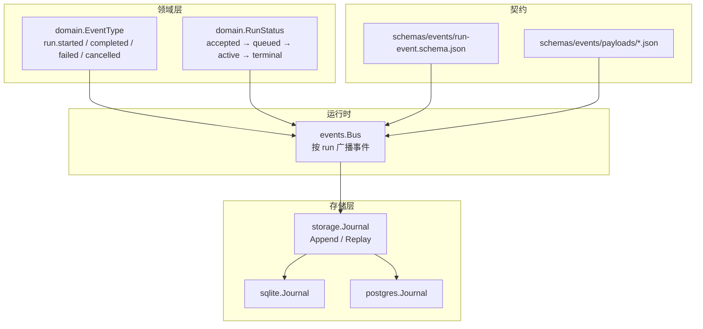
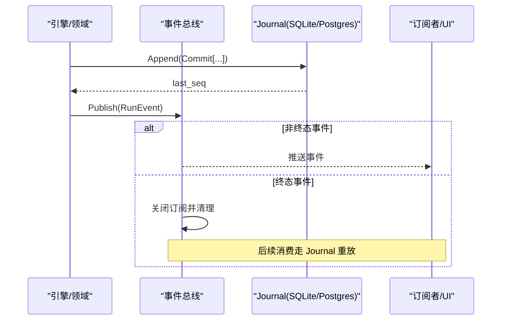
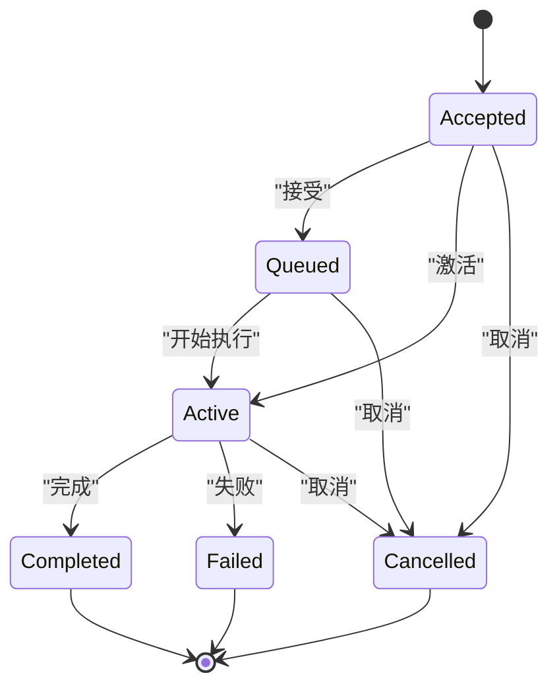
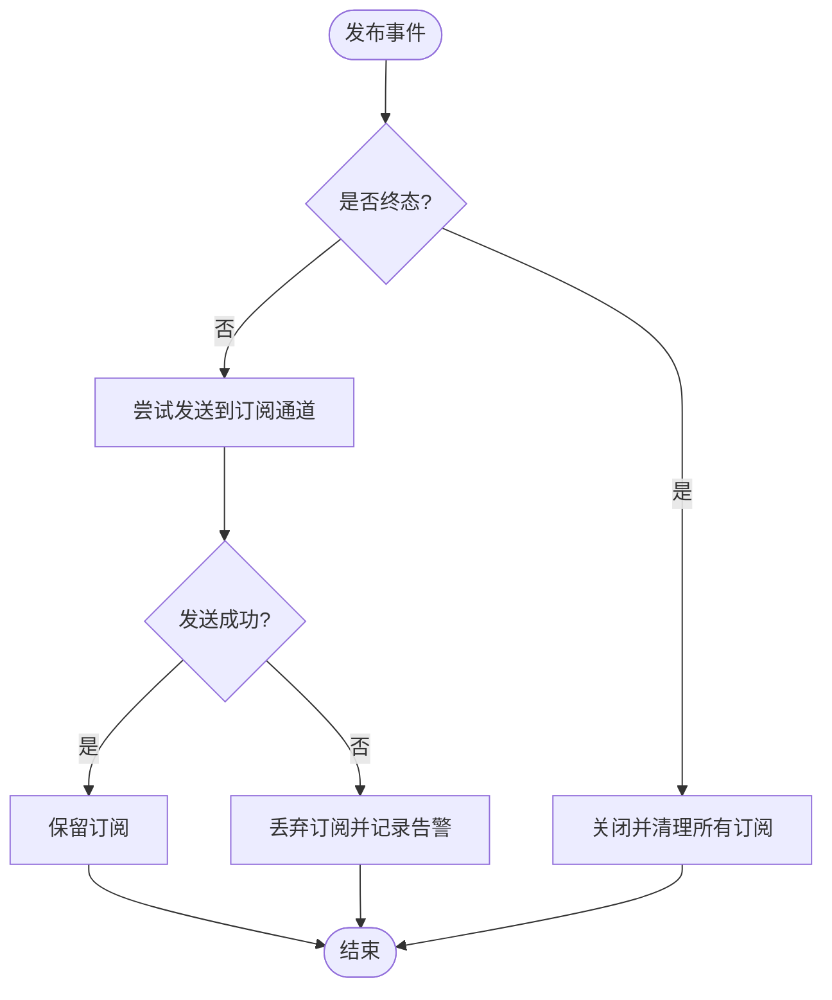
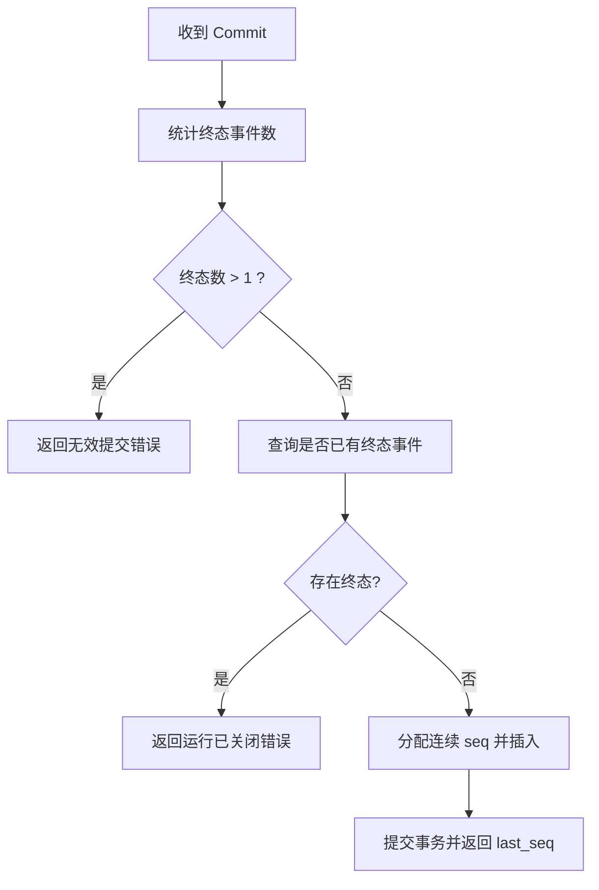
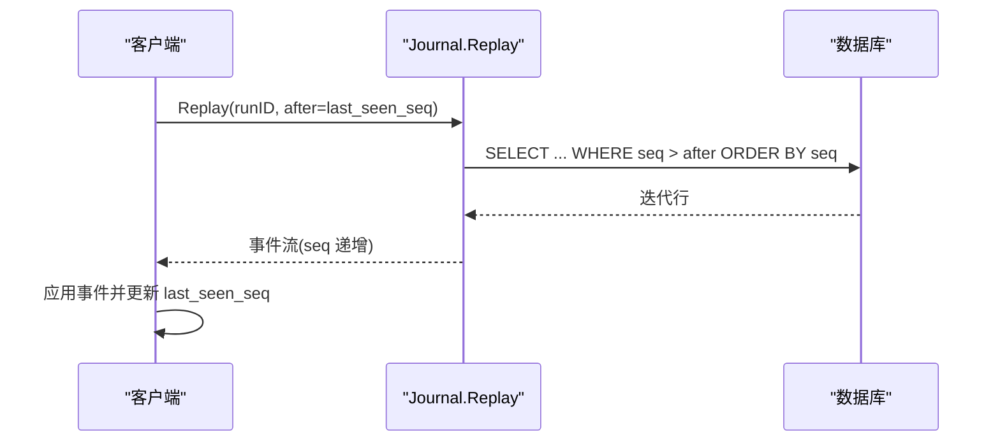
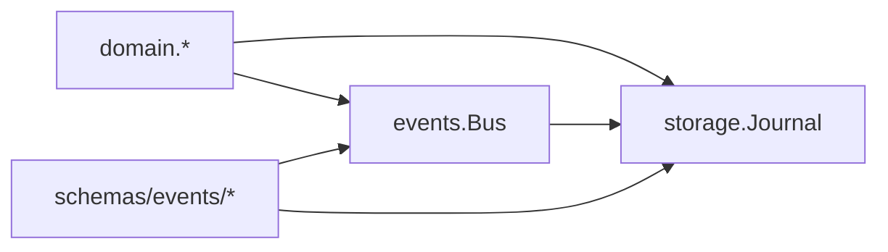

# 运行事件

<cite>
**本文引用的文件**
- [internal/domain/event.go](file://internal/domain/event.go)
- [internal/domain/run.go](file://internal/domain/run.go)
- [schemas/events/run-event.schema.json](file://schemas/events/run-event.schema.json)
- [schemas/events/payloads/run.started.json](file://schemas/events/payloads/run.started.json)
- [schemas/events/payloads/run.completed.json](file://schemas/events/payloads/run.completed.json)
- [schemas/events/payloads/run.failed.json](file://schemas/events/payloads/run.failed.json)
- [schemas/events/payloads/run.cancelled.json](file://schemas/events/payloads/run.cancelled.json)
- [internal/events/bus.go](file://internal/events/bus.go)
- [internal/storage/contracts.go](file://internal/storage/contracts.go)
- [internal/storage/sqlite/journal.go](file://internal/storage/sqlite/journal.go)
- [internal/storage/postgres/journal.go](file://internal/storage/postgres/journal.go)
</cite>

## 目录
1. [简介](#简介)
2. [项目结构](#项目结构)
3. [核心组件](#核心组件)
4. [架构总览](#架构总览)
5. [详细组件分析](#详细组件分析)
6. [依赖关系分析](#依赖关系分析)
7. [性能考量](#性能考量)
8. [故障排查指南](#故障排查指南)
9. [结论](#结论)
10. [附录：JSON Schema 与示例负载](#附录json-schema-与示例负载)

## 简介
本文件聚焦于“运行事件”这一核心契约，系统性地说明 RunStarted、RunCompleted、RunFailed、RunCancelled 四类生命周期事件的触发时机、负载结构与业务含义；给出事件封装的 JSON Schema 规范、字段验证规则与必填项；解释运行状态转换规则与终态唯一性保证（D-008）；并阐述事件在事件溯源中的作用与基于 after_seq 的重放机制。

## 项目结构
围绕运行事件的关键代码与契约分布在以下位置：
- 领域模型与事件类型定义：internal/domain
- 运行时事件总线：internal/events
- 持久化与重放接口及实现：internal/storage（SQLite/Postgres）
- 事件信封与负载的 JSON Schema：schemas/events

图表来源
- [internal/domain/event.go:1-129](file://internal/domain/event.go#L1-L129)
- [internal/domain/run.go:1-95](file://internal/domain/run.go#L1-L95)
- [internal/events/bus.go:1-115](file://internal/events/bus.go#L1-L115)
- [internal/storage/contracts.go:55-64](file://internal/storage/contracts.go#L55-L64)
- [internal/storage/sqlite/journal.go:1-116](file://internal/storage/sqlite/journal.go#L1-L116)
- [internal/storage/postgres/journal.go:1-120](file://internal/storage/postgres/journal.go#L1-L120)
- [schemas/events/run-event.schema.json:1-76](file://schemas/events/run-event.schema.json#L1-L76)
- [schemas/events/payloads/run.started.json:1-35](file://schemas/events/payloads/run.started.json#L1-L35)
- [schemas/events/payloads/run.completed.json:1-15](file://schemas/events/payloads/run.completed.json#L1-L15)
- [schemas/events/payloads/run.failed.json:1-22](file://schemas/events/payloads/run.failed.json#L1-L22)
- [schemas/events/payloads/run.cancelled.json:1-17](file://schemas/events/payloads/run.cancelled.json#L1-L17)

章节来源
- [internal/domain/event.go:1-129](file://internal/domain/event.go#L1-L129)
- [internal/domain/run.go:1-95](file://internal/domain/run.go#L1-L95)
- [internal/events/bus.go:1-115](file://internal/events/bus.go#L1-L115)
- [internal/storage/contracts.go:55-64](file://internal/storage/contracts.go#L55-L64)
- [internal/storage/sqlite/journal.go:1-116](file://internal/storage/sqlite/journal.go#L1-L116)
- [internal/storage/postgres/journal.go:1-120](file://internal/storage/postgres/journal.go#L1-L120)
- [schemas/events/run-event.schema.json:1-76](file://schemas/events/run-event.schema.json#L1-L76)
- [schemas/events/payloads/run.started.json:1-35](file://schemas/events/payloads/run.started.json#L1-L35)
- [schemas/events/payloads/run.completed.json:1-15](file://schemas/events/payloads/run.completed.json#L1-L15)
- [schemas/events/payloads/run.failed.json:1-22](file://schemas/events/payloads/run.failed.json#L1-L22)
- [schemas/events/payloads/run.cancelled.json:1-17](file://schemas/events/payloads/run.cancelled.json#L1-L17)

## 核心组件
- 事件类型与终态判定：EventType 提供 run.started/completed/failed/cancelled 等词汇表，并提供 Terminal() 与 RunStatus() 映射，用于识别终态事件及其对应的运行状态。
- 运行状态机：RunStatus 定义了 accepted/queued/active/completed/failed/cancelled 以及合法转换，确保从终态不可再迁移。
- 事件总线：Bus 按 run_id 广播事件，遇到终态事件时关闭订阅通道并清理订阅，避免阻塞。
- 事件日志（Journal）：Append 原子写入连续 seq，强制“每个运行最多一个终态事件”，并在已有终态后拒绝追加；Replay 支持 from after_seq 的顺序重放。
- 事件信封与负载 Schema：统一的事件 envelope 约束 run_id、seq、type、created_at、payload_version、payload；各 payload 由 payloads/*.json 分别约束。

章节来源
- [internal/domain/event.go:1-129](file://internal/domain/event.go#L1-L129)
- [internal/domain/run.go:1-95](file://internal/domain/run.go#L1-L95)
- [internal/events/bus.go:1-115](file://internal/events/bus.go#L1-L115)
- [internal/storage/contracts.go:55-64](file://internal/storage/contracts.go#L55-L64)
- [internal/storage/sqlite/journal.go:1-116](file://internal/storage/sqlite/journal.go#L1-L116)
- [internal/storage/postgres/journal.go:1-120](file://internal/storage/postgres/journal.go#L1-L120)
- [schemas/events/run-event.schema.json:1-76](file://schemas/events/run-event.schema.json#L1-L76)

## 架构总览
运行事件从领域层产生，经运行时总线广播到活跃消费者；同时通过 Journal 持久化为顺序事件日志。UI/RPC 可通过 Replay 从 after_seq 恢复或回放历史。

图表来源
- [internal/events/bus.go:42-75](file://internal/events/bus.go#L42-L75)
- [internal/storage/sqlite/journal.go:14-79](file://internal/storage/sqlite/journal.go#L14-L79)
- [internal/storage/postgres/journal.go:14-79](file://internal/storage/postgres/journal.go#L14-L79)

## 详细组件分析

### 事件类型与运行状态
- 事件类型 vocabulary 包含 run.started、run.completed、run.failed、run.cancelled 等，Terminal() 标识终态事件；RunStatus() 将终态事件映射为运行状态。
- 运行状态机限制：accepted→queued→active→{completed|failed|cancelled}，且终态无出边。

图表来源
- [internal/domain/run.go:17-30](file://internal/domain/run.go#L17-L30)
- [internal/domain/event.go:93-116](file://internal/domain/event.go#L93-L116)

章节来源
- [internal/domain/event.go:1-129](file://internal/domain/event.go#L1-L129)
- [internal/domain/run.go:1-95](file://internal/domain/run.go#L1-L95)

### 事件总线与重放
- Bus.Publish 对非终态事件尝试投递到缓冲通道；若消费者落后则丢弃该订阅，提示其通过 Journal 重放恢复。
- 遇到终态事件，Bus 关闭所有订阅并移除，确保流结束。
- Journal.Replay 支持按 after_seq 顺序读取事件，供 RPC/UI 重放。

图表来源
- [internal/events/bus.go:42-75](file://internal/events/bus.go#L42-L75)

章节来源
- [internal/events/bus.go:1-115](file://internal/events/bus.go#L1-L115)
- [internal/storage/sqlite/journal.go:77-86](file://internal/storage/sqlite/journal.go#L77-L86)
- [internal/storage/postgres/journal.go:81-90](file://internal/storage/postgres/journal.go#L81-L90)

### 事件持久化与终态唯一性（D-008）
- Append 会统计 commit 中终态事件数量，超过 1 即拒绝；若 run 已存在终态事件，再次追加返回“运行已关闭”。
- SQLite 与 Postgres 实现一致：先检查是否存在终态，再分配连续 seq 并批量插入。

图表来源
- [internal/storage/sqlite/journal.go:14-79](file://internal/storage/sqlite/journal.go#L14-L79)
- [internal/storage/postgres/journal.go:14-79](file://internal/storage/postgres/journal.go#L14-L79)
- [internal/storage/contracts.go:11-21](file://internal/storage/contracts.go#L11-L21)

章节来源
- [internal/storage/sqlite/journal.go:1-116](file://internal/storage/sqlite/journal.go#L1-L116)
- [internal/storage/postgres/journal.go:1-120](file://internal/storage/postgres/journal.go#L1-L120)
- [internal/storage/contracts.go:11-21](file://internal/storage/contracts.go#L11-L21)

### 事件序列化的 JSON Schema 规范
- 事件信封（envelope）：必须包含 run_id、seq、type、created_at、payload_version、payload；type 取值来自枚举；payload_version 用于版本控制；additionalProperties 禁止额外字段。
- 负载（payload）：按 type 选择对应 payloads/*.json 进行校验。

章节来源
- [schemas/events/run-event.schema.json:1-76](file://schemas/events/run-event.schema.json#L1-L76)

### 运行生命周期事件详解

#### RunStarted（run.started）
- 触发时机：一次运行被创建并开始执行时。
- 业务含义：声明本次运行的提供者、模型、模式与策略配置摘要，作为后续消费的上下文基线。
- 负载关键字段与必填项：
  - provider：字符串，当前使用的提供者包名。
  - model：字符串，运行所使用的模型 ID。
  - mode：枚举 normal/plan，物理 harness 策略。
  - policy_profile：可选，治理策略集名称。
  - policy_hash：可选，策略定义的摘要。
- 必填项：provider、model、mode。
- 参考路径：[run.started 负载 Schema:1-35](file://schemas/events/payloads/run.started.json#L1-L35)

章节来源
- [schemas/events/payloads/run.started.json:1-35](file://schemas/events/payloads/run.started.json#L1-L35)
- [internal/domain/event.go:8-43](file://internal/domain/event.go#L8-L43)

#### RunCompleted（run.completed）
- 触发时机：运行正常完成时。
- 业务含义：标记运行进入终态 completed；可携带简短摘要用于列表展示。
- 负载关键字段：summary（可选）。
- 必填项：无。
- 参考路径：[run.completed 负载 Schema:1-15](file://schemas/events/payloads/run.completed.json#L1-L15)

章节来源
- [schemas/events/payloads/run.completed.json:1-15](file://schemas/events/payloads/run.completed.json#L1-L15)
- [internal/domain/event.go:93-116](file://internal/domain/event.go#L93-L116)

#### RunFailed（run.failed）
- 触发时机：运行因错误终止时。
- 业务含义：标记运行进入终态 failed；cause_category 结构化归因，message 为用户可见信息，不泄露内部细节与密钥。
- 负载关键字段与必填项：
  - cause_category：枚举 {provider_error, tool_error, internal_error, cancelled, human_timeout}。
  - message：非空字符串，用户可见消息。
- 必填项：cause_category、message。
- 参考路径：[run.failed 负载 Schema:1-22](file://schemas/events/payloads/run.failed.json#L1-L22)

章节来源
- [schemas/events/payloads/run.failed.json:1-22](file://schemas/events/payloads/run.failed.json#L1-L22)
- [internal/domain/event.go:93-116](file://internal/domain/event.go#L93-L116)

#### RunCancelled（run.cancelled）
- 触发时机：用户主动取消或恢复阶段对滞留运行进行确定性取消时。
- 业务含义：标记运行进入终态 cancelled；reason 区分取消来源。
- 负载关键字段与必填项：
  - reason：枚举 {user_requested, recovery}。
- 必填项：reason。
- 参考路径：[run.cancelled 负载 Schema:1-17](file://schemas/events/payloads/run.cancelled.json#L1-L17)

章节来源
- [schemas/events/payloads/run.cancelled.json:1-17](file://schemas/events/payloads/run.cancelled.json#L1-L17)
- [internal/domain/event.go:93-116](file://internal/domain/event.go#L93-L116)

### 事件在事件溯源中的作用与重放机制
- 作用：事件日志是单一事实源（D-017），承载运行全量历史；UI/RPC 通过 Replay(after_seq) 增量同步或完整重放。
- 重放流程：客户端维护 last_seen_seq；调用 Replay(runID, after=last_seen_seq) 获取严格递增的 seq 事件；应用事件更新本地视图；最后用 last_seq 更新游标。
- 一致性：Append 保证同一 commit 内最多一个终态事件；已有终态的运行拒绝追加，从而保证终态唯一性与幂等重放。

图表来源
- [internal/storage/sqlite/journal.go:77-86](file://internal/storage/sqlite/journal.go#L77-L86)
- [internal/storage/postgres/journal.go:81-90](file://internal/storage/postgres/journal.go#L81-L90)

章节来源
- [internal/storage/contracts.go:55-64](file://internal/storage/contracts.go#L55-L64)
- [internal/storage/sqlite/journal.go:77-86](file://internal/storage/sqlite/journal.go#L77-L86)
- [internal/storage/postgres/journal.go:81-90](file://internal/storage/postgres/journal.go#L81-L90)

## 依赖关系分析
- domain 层定义事件类型与运行状态机，是事件语义的唯一权威。
- events.Bus 依赖 domain 的类型判断（Terminal）来管理订阅生命周期。
- storage 层实现 Journal 接口，依赖 domain 的 EventType.Terminal 与 RunStatus 转换逻辑，确保 D-008 不变式。
- schemas 层以 JSON Schema 固化 envelope 与 payload 契约，驱动序列化/反序列化与校验。

图表来源
- [internal/domain/event.go:1-129](file://internal/domain/event.go#L1-L129)
- [internal/events/bus.go:1-115](file://internal/events/bus.go#L1-L115)
- [internal/storage/contracts.go:55-64](file://internal/storage/contracts.go#L55-L64)
- [schemas/events/run-event.schema.json:1-76](file://schemas/events/run-event.schema.json#L1-L76)

章节来源
- [internal/domain/event.go:1-129](file://internal/domain/event.go#L1-L129)
- [internal/events/bus.go:1-115](file://internal/events/bus.go#L1-L115)
- [internal/storage/contracts.go:55-64](file://internal/storage/contracts.go#L55-L64)
- [schemas/events/run-event.schema.json:1-76](file://schemas/events/run-event.schema.json#L1-L76)

## 性能考量
- 事件总线采用有缓冲通道，避免慢消费者阻塞生产端；落后订阅将被丢弃并由 Journal 重放恢复，符合 AS-7 设计。
- Journal.Append 使用事务与连续 seq 分配，SQLite/Postgres 均保证原子性与顺序性；终端事件检测在写入前完成，减少无效写入。
- Replay 按 seq 顺序流式读取，适合增量同步与大历史回放。

## 故障排查指南
- 无法继续追加事件：若返回“运行已关闭”，说明该 run 已存在终态事件；检查是否重复提交终态或业务逻辑误判。
- 提交被拒绝：若返回“无效提交”，检查是否在一个 commit 中包含多个终态事件，或提交为空。
- 订阅丢失：若发现事件断流，确认是否为慢消费者导致订阅被丢弃；应通过 Replay(after_seq) 重新同步。
- 状态不一致：核对事件序列中的终态事件是否唯一；若有多个终态，需定位数据修复点。

章节来源
- [internal/storage/contracts.go:11-21](file://internal/storage/contracts.go#L11-L21)
- [internal/storage/sqlite/journal.go:14-79](file://internal/storage/sqlite/journal.go#L14-L79)
- [internal/storage/postgres/journal.go:14-79](file://internal/storage/postgres/journal.go#L14-L79)
- [internal/events/bus.go:42-75](file://internal/events/bus.go#L42-L75)

## 结论
运行事件体系以领域模型为核心，结合 JSON Schema 契约、事件总线与持久化日志，提供了强一致、可重放、可扩展的运行生命周期追踪能力。终态唯一性（D-008）在领域与存储层双重保障，确保运行状态机的正确性与可观测性。

## 附录：JSON Schema 与示例负载
- 事件信封 Schema：见 [run-event.schema.json:1-76](file://schemas/events/run-event.schema.json#L1-L76)，必填字段包括 run_id、seq、type、created_at、payload_version、payload；type 取值受枚举约束；payload 按 type 匹配对应负载 Schema。
- 负载 Schema：
  - run.started：[run.started.json:1-35](file://schemas/events/payloads/run.started.json#L1-L35)，必填 provider、model、mode。
  - run.completed：[run.completed.json:1-15](file://schemas/events/payloads/run.completed.json#L1-L15)。
  - run.failed：[run.failed.json:1-22](file://schemas/events/payloads/run.failed.json#L1-L22)，必填 cause_category、message。
  - run.cancelled：[run.cancelled.json:1-17](file://schemas/events/payloads/run.cancelled.json#L1-L17)，必填 reason。

示例负载（仅示意结构，具体值请根据实际运行上下文填充）：
- run.started
  - run_id: 字符串
  - seq: 整数 ≥ 1
  - type: "run.started"
  - created_at: Unix 毫秒
  - payload_version: 整数 ≥ 1
  - payload: { provider, model, mode, policy_profile?, policy_hash? }
- run.completed
  - run_id, seq, type="run.completed", created_at, payload_version
  - payload: { summary? }
- run.failed
  - run_id, seq, type="run.failed", created_at, payload_version
  - payload: { cause_category ∈ {provider_error, tool_error, internal_error, cancelled, human_timeout}, message }
- run.cancelled
  - run_id, seq, type="run.cancelled", created_at, payload_version
  - payload: { reason ∈ {user_requested, recovery} }

章节来源
- [schemas/events/run-event.schema.json:1-76](file://schemas/events/run-event.schema.json#L1-L76)
- [schemas/events/payloads/run.started.json:1-35](file://schemas/events/payloads/run.started.json#L1-L35)
- [schemas/events/payloads/run.completed.json:1-15](file://schemas/events/payloads/run.completed.json#L1-L15)
- [schemas/events/payloads/run.failed.json:1-22](file://schemas/events/payloads/run.failed.json#L1-L22)
- [schemas/events/payloads/run.cancelled.json:1-17](file://schemas/events/payloads/run.cancelled.json#L1-L17)