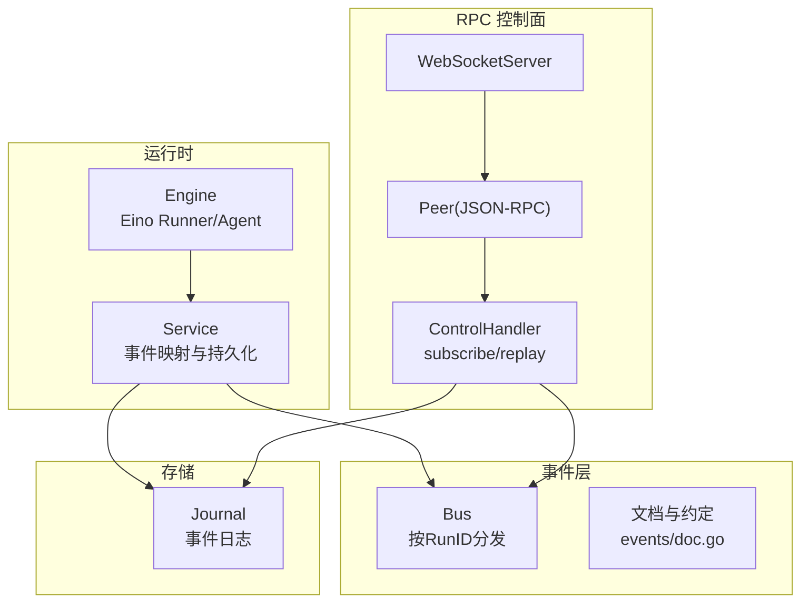
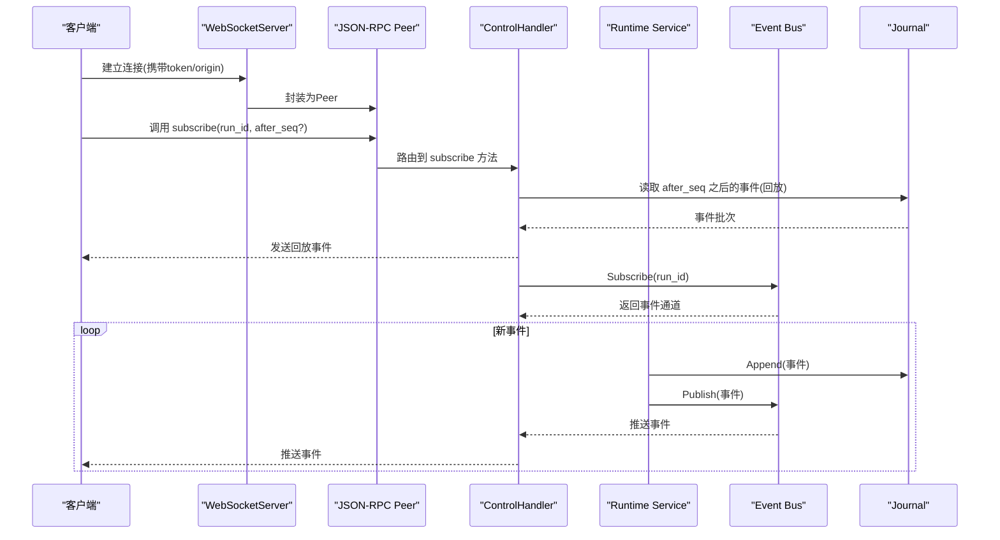
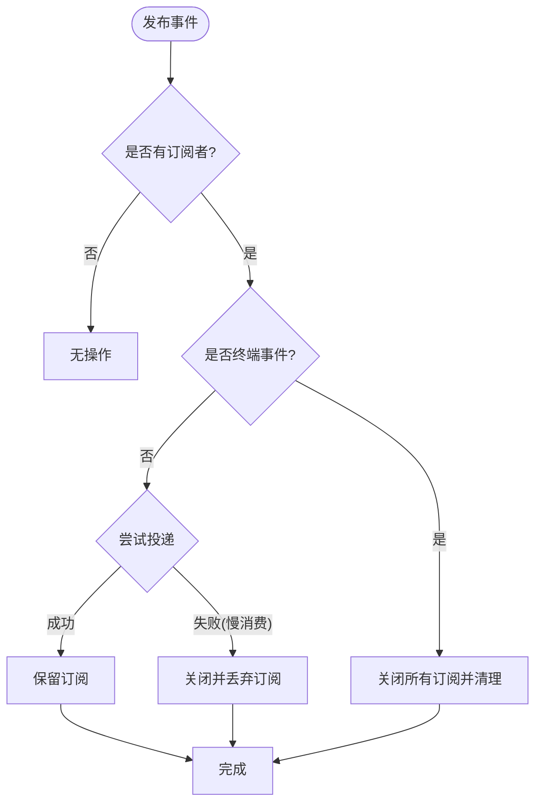
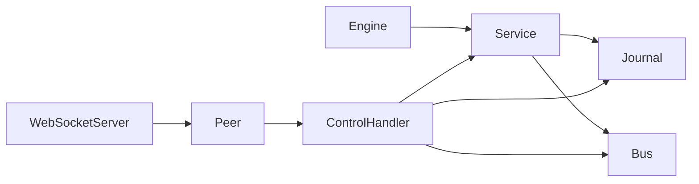

# 事件系统

<cite>
**本文引用的文件**
- [internal/events/bus.go](file://internal/events/bus.go)
- [internal/events/doc.go](file://internal/events/doc.go)
- [internal/domain/event.go](file://internal/domain/event.go)
- [schemas/events/run-event.schema.json](file://schemas/events/run-event.schema.json)
- [schemas/events/payloads/model.delta.json](file://schemas/events/payloads/model.delta.json)
- [schemas/events/payloads/tool.approval_required.json](file://schemas/events/payloads/tool.approval_required.json)
- [schemas/events/payloads/run.started.json](file://schemas/events/payloads/run.started.json)
- [internal/rpc/protocol.go](file://internal/rpc/protocol.go)
- [internal/rpc/websocket.go](file://internal/rpc/websocket.go)
- [internal/rpc/control.go](file://internal/rpc/control.go)
- [internal/runtime/service.go](file://internal/runtime/service.go)
- [internal/runtime/engine.go](file://internal/runtime/engine.go)
</cite>

## 目录
1. [简介](#简介)
2. [项目结构](#项目结构)
3. [核心组件](#核心组件)
4. [架构总览](#架构总览)
5. [详细组件分析](#详细组件分析)
6. [依赖关系分析](#依赖关系分析)
7. [性能考量](#性能考量)
8. [故障排查指南](#故障排查指南)
9. [结论](#结论)
10. [附录](#附录)

## 简介
本文件系统性阐述 Vivy 的事件系统，覆盖事件总线、发布订阅、断线重连与事件回放、事件类型与负载定义、WebSocket 实时通信、JSON-RPC 协议、消息路由机制，以及事件驱动编程的最佳实践（设计原则、错误处理、性能优化）。同时提供审计、监控告警与调试工具的使用建议，并给出基于仓库现有实现的具体使用路径与示例说明。

## 项目结构
事件系统由以下关键部分组成：
- 领域模型与契约：事件类型、事件信封与负载 JSON Schema
- 运行时服务：将引擎事件映射为持久化事件，先持久化再广播
- 事件总线：按 RunID 进行内存级 fan-out，支持缓冲与慢消费者丢弃
- RPC 控制面：基于 JSON-RPC 的 WebSocket 传输，提供 subscribe/replay 能力
- 存储层：Journal 作为唯一事实源，支持 after_seq 游标回放

图表来源
- [internal/runtime/service.go:212-298](file://internal/runtime/service.go#L212-L298)
- [internal/events/bus.go:10-114](file://internal/events/bus.go#L10-L114)
- [internal/rpc/websocket.go:27-46](file://internal/rpc/websocket.go#L27-L46)
- [internal/rpc/protocol.go:120-230](file://internal/rpc/protocol.go#L120-L230)
- [internal/rpc/control.go:27-88](file://internal/rpc/control.go#L27-L88)

章节来源
- [internal/events/doc.go:1-12](file://internal/events/doc.go#L1-L12)
- [internal/runtime/service.go:212-298](file://internal/runtime/service.go#L212-L298)
- [internal/rpc/websocket.go:27-46](file://internal/rpc/websocket.go#L27-L46)
- [internal/rpc/protocol.go:120-230](file://internal/rpc/protocol.go#L120-L230)
- [internal/rpc/control.go:27-88](file://internal/rpc/control.go#L27-L88)

## 核心组件
- 事件类型与信封
  - 事件类型在领域层集中定义，包含运行生命周期、模型、工具、策略、钩子、用户交互、子任务等类别；每个事件具有单调序列号、创建时间、负载版本与负载字节。
  - 事件信封遵循 JSON Schema，确保跨进程/前后端一致。
- 运行时服务
  - 负责将引擎事件映射为领域事件，先写入 Journal，再通过 EventSink 广播到 Bus。
  - 启动时先持久化 run.started，再激活运行；取消/终止时保证终端事件最终持久化。
- 事件总线
  - 按 RunID 维护订阅者列表，带缓冲通道；遇到终端事件关闭流并清理订阅；慢消费者会被丢弃，后续通过 RPC 回放恢复。
- RPC 控制面
  - 基于 JSON-RPC v2.0，提供方法调用与通知；WebSocket 传输具备令牌校验与同源策略。
  - ControlHandler 暴露 subscribe/replay 等方法，结合 Bus 实现“回放+直播”模式。

章节来源
- [internal/domain/event.go:1-129](file://internal/domain/event.go#L1-L129)
- [schemas/events/run-event.schema.json:1-76](file://schemas/events/run-event.schema.json#L1-L76)
- [internal/runtime/service.go:212-298](file://internal/runtime/service.go#L212-L298)
- [internal/events/bus.go:10-114](file://internal/events/bus.go#L10-L114)
- [internal/rpc/protocol.go:18-374](file://internal/rpc/protocol.go#L18-L374)
- [internal/rpc/websocket.go:12-56](file://internal/rpc/websocket.go#L12-L56)
- [internal/rpc/control.go:27-88](file://internal/rpc/control.go#L27-L88)

## 架构总览
事件从引擎产生，经 Service 映射后持久化到 Journal，随后通过 Bus 推送给在线订阅者；客户端通过 JSON-RPC 的 subscribe 方法建立订阅，必要时以 after_seq 回放历史，实现断线重连与一致性。

图表来源
- [internal/rpc/websocket.go:27-46](file://internal/rpc/websocket.go#L27-L46)
- [internal/rpc/protocol.go:120-230](file://internal/rpc/protocol.go#L120-L230)
- [internal/rpc/control.go:27-88](file://internal/rpc/control.go#L27-L88)
- [internal/runtime/service.go:212-298](file://internal/runtime/service.go#L212-L298)
- [internal/events/bus.go:42-106](file://internal/events/bus.go#L42-L106)

## 详细组件分析

### 事件类型与负载
- 事件类型
  - 涵盖 run、provider、model、tool、policy、hook、user、child 等类别；终端事件用于结束 run 或 child 的生命周期。
- 事件信封
  - 字段包括 run_id、seq、type、created_at、payload_version、payload；payload 形状由 payloads/<type>.json 约束。
- 负载示例
  - model.delta：增量内容片段
  - tool.approval_required：需要人工审批的工具调用
  - run.started：运行开始，包含 provider、model、mode、policy_profile、policy_hash 等元信息

章节来源
- [internal/domain/event.go:8-129](file://internal/domain/event.go#L8-L129)
- [schemas/events/run-event.schema.json:1-76](file://schemas/events/run-event.schema.json#L1-L76)
- [schemas/events/payloads/model.delta.json](file://schemas/events/payloads/model.delta.json)
- [schemas/events/payloads/tool.approval_required.json](file://schemas/events/payloads/tool.approval_required.json)
- [schemas/events/payloads/run.started.json](file://schemas/events/payloads/run.started.json)

### 事件总线（发布/订阅）
- 订阅
  - 按 RunID 注册，返回只读通道与取消函数；取消会安全移除订阅并关闭通道。
- 发布
  - 非终端事件尝试投递到缓冲通道；若消费者落后则丢弃该订阅并记录警告，后续通过 RPC 回放恢复。
  - 终端事件关闭所有订阅并清理对应 RunID 的订阅表项。
- 诊断
  - 提供 Subscribers 查询当前活跃订阅数，便于监控与测试。

图表来源
- [internal/events/bus.go:42-106](file://internal/events/bus.go#L42-L106)

章节来源
- [internal/events/bus.go:10-114](file://internal/events/bus.go#L10-L114)

### 运行时服务与事件持久化
- 启动流程
  - 创建 run 行 -> 构建 run.started -> 写入 Journal -> 设置 run 状态为 active -> 启动后台驱动 goroutine。
- 事件映射与广播
  - 使用 eventMapper 将引擎事件转换为领域事件，限制 payload 大小；先持久化再调用 Sink.Publish。
- 取消与终止
  - Cancel/CancelAll 会清理 pending/approval/question 并触发 run.cancelled 终端事件；WaitIdle 确保在关闭存储前完成终端事件持久化。

章节来源
- [internal/runtime/service.go:212-298](file://internal/runtime/service.go#L212-L298)
- [internal/runtime/service.go:302-387](file://internal/runtime/service.go#L302-L387)

### JSON-RPC 与 WebSocket 传输
- 传输
  - WebSocketServer 校验 origin 与 token，升级连接后构造 Peer 并进入 Serve 循环。
- 协议
  - 支持请求/响应与通知；帧大小限制、出站缓冲、过载保护；AfterResponse 保障“响应优先于事件”的顺序。
- 控制接口
  - ControlHandler 聚合运行时、存储、事件总线等依赖，提供会话、运行、事件订阅、审批、问题、审查等 RPC 方法。

章节来源
- [internal/rpc/websocket.go:12-56](file://internal/rpc/websocket.go#L12-L56)
- [internal/rpc/protocol.go:18-374](file://internal/rpc/protocol.go#L18-L374)
- [internal/rpc/control.go:27-88](file://internal/rpc/control.go#L27-L88)

### 事件回放与断线重连
- 回放
  - 客户端通过 subscribe(run_id, after_seq) 指定游标；服务端从 Journal 回放缺失事件，再切换到 Bus 直播。
- 断线重连
  - 客户端检测到连接断开后，保存最后 seq，重新建立连接并发起新的 subscribe；由于 Journal 是唯一事实源，可保证无丢失、无重复。
- 顺序保证
  - AfterResponse 确保响应先于事件到达，避免 UI 状态错乱。

章节来源
- [internal/events/doc.go:1-12](file://internal/events/doc.go#L1-L12)
- [internal/rpc/protocol.go:232-251](file://internal/rpc/protocol.go#L232-L251)
- [internal/rpc/control.go:27-88](file://internal/rpc/control.go#L27-L88)

### 事件驱动编程最佳实践
- 事件设计原则
  - 单一事实源：Journal 拥有全部历史；Bus 仅做实时优化。
  - 幂等与有序：事件含单调 seq，消费者基于 seq 推进游标。
  - 负载版本化：payload_version 允许演进而不破坏旧客户端。
- 错误处理
  - 慢消费者丢弃而非阻塞生产者；终端事件关闭流；RPC 过载返回明确错误码。
- 性能优化
  - 合理配置 Bus 缓冲与 MaxEventPayloadBytes；控制出站缓冲与帧大小；对高频 delta 事件考虑合并或节流。
- 审计与可观测性
  - 利用 run.* 终端事件与 policy.evaluated、tool.* 事件进行审计；结合日志与指标观察订阅数、丢弃率、回放延迟。

章节来源
- [internal/events/bus.go:10-114](file://internal/events/bus.go#L10-L114)
- [internal/rpc/protocol.go:18-374](file://internal/rpc/protocol.go#L18-L374)
- [internal/runtime/service.go:212-298](file://internal/runtime/service.go#L212-L298)

## 依赖关系分析
- 运行时与服务
  - Engine 提供 Eino 驱动的异步迭代器；Service 负责编排、持久化与广播。
- 事件与存储
  - Service 依赖 storage.Journal 持久化事件；Bus 不持有历史，仅做实时分发。
- RPC 与控制面
  - ControlHandler 依赖 Storage、Events.Bus、Runtime.Service；WebSocketServer 提供传输。

图表来源
- [internal/runtime/engine.go:48-166](file://internal/runtime/engine.go#L48-L166)
- [internal/runtime/service.go:212-298](file://internal/runtime/service.go#L212-L298)
- [internal/rpc/websocket.go:27-46](file://internal/rpc/websocket.go#L27-L46)
- [internal/rpc/protocol.go:120-230](file://internal/rpc/protocol.go#L120-L230)
- [internal/rpc/control.go:27-88](file://internal/rpc/control.go#L27-L88)

章节来源
- [internal/runtime/engine.go:48-166](file://internal/runtime/engine.go#L48-L166)
- [internal/runtime/service.go:212-298](file://internal/runtime/service.go#L212-L298)
- [internal/rpc/websocket.go:27-46](file://internal/rpc/websocket.go#L27-L46)
- [internal/rpc/protocol.go:120-230](file://internal/rpc/protocol.go#L120-L230)
- [internal/rpc/control.go:27-88](file://internal/rpc/control.go#L27-L88)

## 性能考量
- 缓冲与背压
  - Bus 缓冲过小会导致慢消费者被丢弃；RPC 出站缓冲满会返回过载错误，需在上层重试或降级。
- 事件体积
  - MaxEventPayloadBytes 限制单条事件负载大小，防止大对象阻塞管道。
- 回放效率
  - after_seq 游标回放减少网络与序列化开销；UI 应缓存已处理事件并按 seq 去重。
- 资源管理
  - 及时 cancel 订阅，避免内存泄漏；终端事件后 Bus 自动清理订阅。

[本节为通用指导，不直接分析具体文件]

## 故障排查指南
- 订阅无事件
  - 检查是否已正确传入 run_id；确认服务端已持久化 run.started；核对 after_seq 是否正确。
- 频繁断线重连
  - 关注 Bus 丢弃日志；适当增大缓冲或优化消费速度；检查 RPC 出站缓冲是否频繁满载。
- 事件顺序异常
  - 确认使用 AfterResponse 保证响应优先；客户端侧按 seq 排序合并。
- 终端事件未到达
  - 检查 Service 的 WaitIdle 是否在关闭存储前等待完成；确认终端事件已持久化。

章节来源
- [internal/events/bus.go:42-106](file://internal/events/bus.go#L42-L106)
- [internal/rpc/protocol.go:257-273](file://internal/rpc/protocol.go#L257-L273)
- [internal/runtime/service.go:302-387](file://internal/runtime/service.go#L302-L387)

## 结论
Vivy 的事件系统以 Journal 为唯一事实源，结合内存级 Bus 提供低延迟实时分发；通过 JSON-RPC over WebSocket 实现可靠的 subscribe/replay 能力，满足断线重连与一致性要求。严格的事件类型与负载契约、完善的错误处理与性能边界，使系统在可扩展性与稳定性之间取得平衡。

[本节为总结性内容，不直接分析具体文件]

## 附录

### 使用示例（基于仓库实现的路径说明）
- 启动运行并获取 run_id
  - 调用 runtime.Service.RunWithOptions，内部会持久化 run.started 并返回 run_id。
  - 参考路径：[internal/runtime/service.go:212-298](file://internal/runtime/service.go#L212-L298)
- 建立 WebSocket 订阅
  - 通过 WebSocketServer 建立连接，使用 JSON-RPC 调用 subscribe(run_id, after_seq)。
  - 参考路径：[internal/rpc/websocket.go:27-46](file://internal/rpc/websocket.go#L27-L46)、[internal/rpc/control.go:27-88](file://internal/rpc/control.go#L27-L88)
- 回放历史事件
  - 在 reconnect 时使用 last_seq + 1 作为 after_seq，从 Journal 回放缺失事件。
  - 参考路径：[internal/events/doc.go:1-12](file://internal/events/doc.go#L1-L12)
- 处理模型增量与工具审批
  - 监听 model.delta 与 tool.approval_required 事件，分别用于 UI 流式渲染与审批界面。
  - 参考路径：[schemas/events/payloads/model.delta.json](file://schemas/events/payloads/model.delta.json)、[schemas/events/payloads/tool.approval_required.json](file://schemas/events/payloads/tool.approval_required.json)
- 取消运行
  - 调用 runtime.Service.Cancel/CancelAll，确保 run.cancelled 终端事件持久化。
  - 参考路径：[internal/runtime/service.go:302-387](file://internal/runtime/service.go#L302-L387)