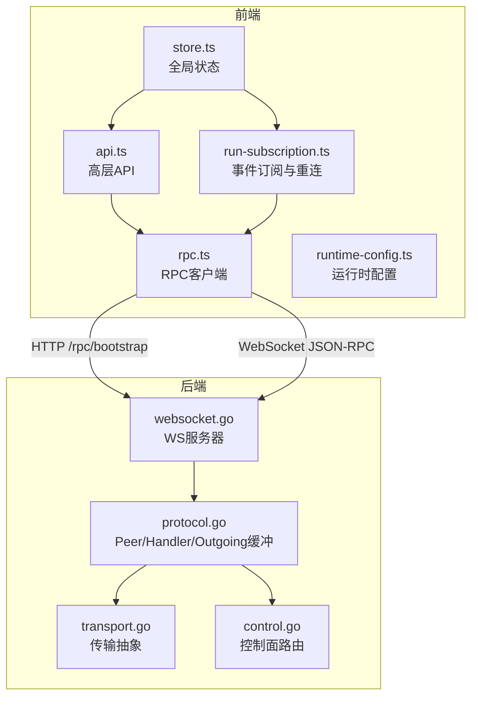
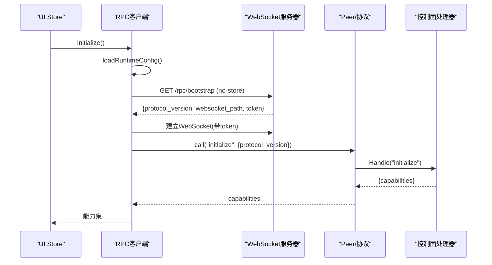
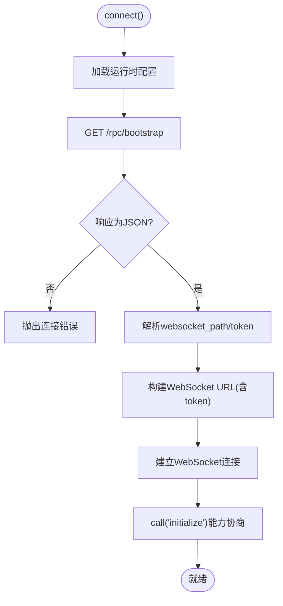
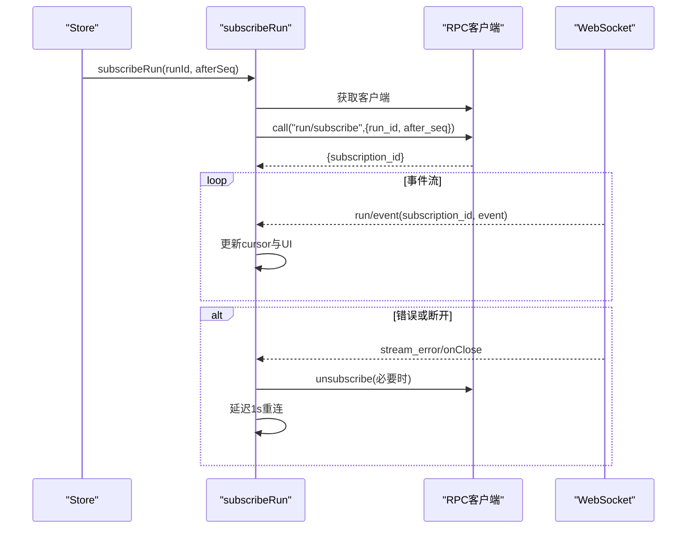
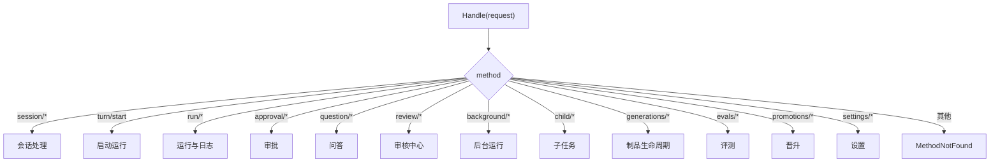
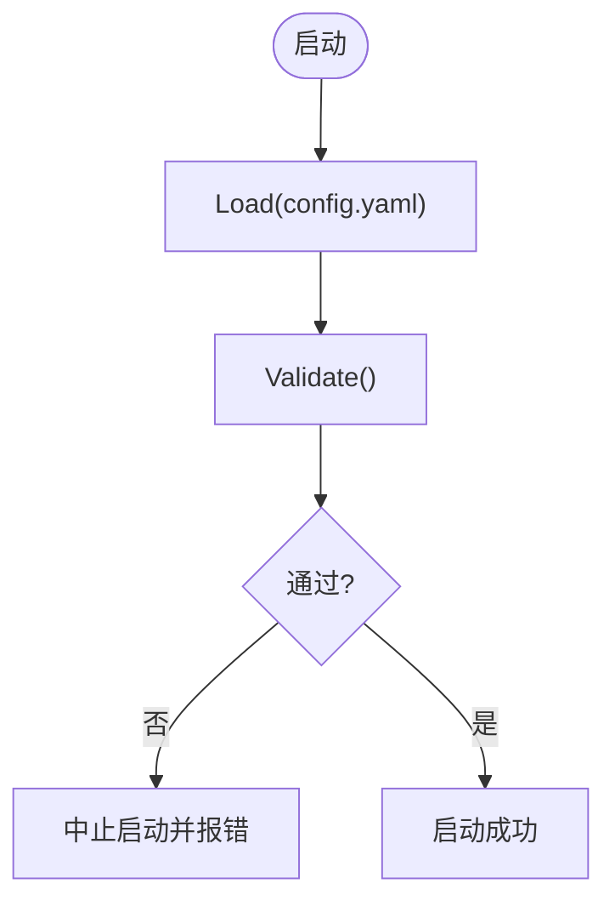
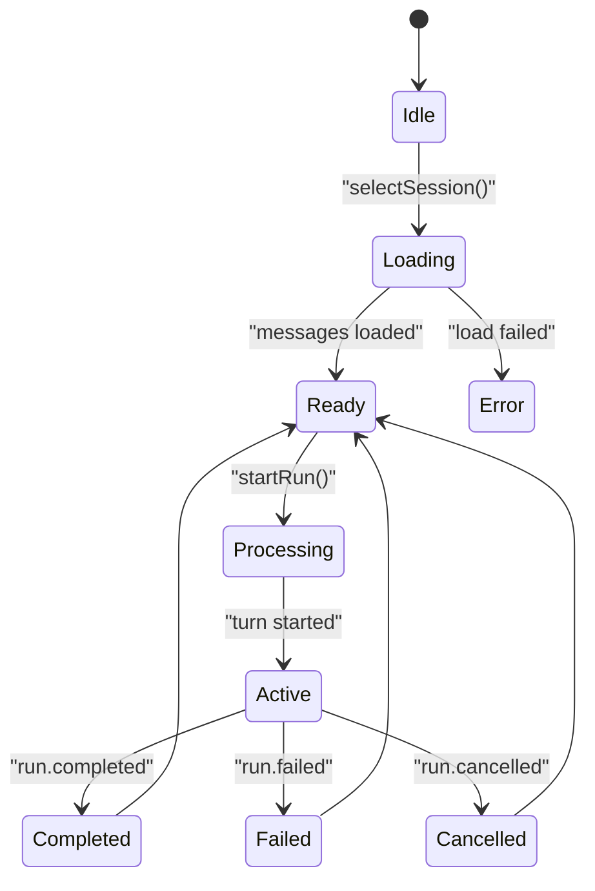
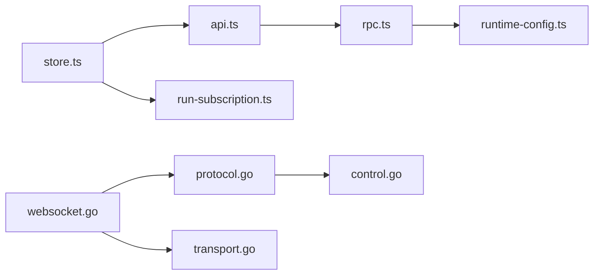

# API集成

<cite>
**本文引用的文件**
- [rpc.ts](file://ui/src/lib/rpc.ts)
- [api.ts](file://ui/src/lib/api.ts)
- [runtime-config.ts](file://ui/src/lib/runtime-config.ts)
- [store.ts](file://ui/src/lib/store.ts)
- [run-subscription.ts](file://ui/src/lib/run-subscription.ts)
- [transport.go](file://internal/rpc/transport.go)
- [websocket.go](file://internal/rpc/websocket.go)
- [protocol.go](file://internal/rpc/protocol.go)
- [control.go](file://internal/rpc/control.go)
- [config.go](file://internal/config/config.go)
</cite>

## 目录
1. [简介](#简介)
2. [项目结构](#项目结构)
3. [核心组件](#核心组件)
4. [架构总览](#架构总览)
5. [详细组件分析](#详细组件分析)
6. [依赖关系分析](#依赖关系分析)
7. [性能考虑](#性能考虑)
8. [故障排查指南](#故障排查指南)
9. [结论](#结论)
10. [附录：API调用示例与最佳实践](#附录api调用示例与最佳实践)

## 简介
本文件面向Vivy Agent的前后端API集成，重点覆盖以下方面：
- RPC客户端实现：WebSocket连接管理、消息序列化、错误重试机制
- REST API调用：请求拦截器、响应处理、缓存策略（前端通过JSON-RPC over WebSocket，同时提供HTTP引导端点）
- 状态管理模式：全局状态、本地存储、状态同步
- 运行时配置管理：动态加载、配置验证、热更新
- 网络层优化：请求合并、并发控制、超时处理
- 具体API调用示例、错误处理模式与性能优化技巧

本项目采用“浏览器端JSON-RPC over WebSocket”作为主要通信通道，并通过HTTP /rpc/bootstrap进行引导握手；服务端使用统一的RPC协议框架，将传输抽象为Transport接口，支持WebSocket和JSONL等。

## 项目结构
- 前端（React + Vite UI）
  - lib/rpc.ts：RPC客户端封装，负责Bootstrap握手、WebSocket建立、消息收发、能力协商、重连与关闭
  - lib/api.ts：高层API方法集合，统一错误映射到ApiError
  - lib/runtime-config.ts：运行时配置加载与校验（vivy-config.json），解析控制平面地址
  - lib/store.ts：基于Zustand的全局状态机，协调会话、运行、子任务、审核、设置等状态，并订阅运行事件流
  - lib/run-subscription.ts：运行事件订阅与断线重连，维护游标after_seq保证事件顺序与幂等
- 后端（Go）
  - internal/rpc/transport.go：传输抽象（JSONL、WebSocket）
  - internal/rpc/websocket.go：WebSocket服务器，鉴权（token）、来源白名单、升级连接
  - internal/rpc/protocol.go：JSON-RPC协议核心（Peer、Handler、Outgoing缓冲、AfterResponse、Call/Notify）
  - internal/rpc/control.go：控制面处理器，路由所有业务方法（session、turn、run、approval、review、child、eval、settings等）
  - internal/config/config.go：启动时配置加载与严格校验（密钥不落地、默认值、安全边界）



**图表来源**
- [rpc.ts:55-99](file://ui/src/lib/rpc.ts#L55-L99)
- [websocket.go:27-47](file://internal/rpc/websocket.go#L27-L47)
- [protocol.go:107-164](file://internal/rpc/protocol.go#L107-L164)
- [transport.go:12-85](file://internal/rpc/transport.go#L12-L85)
- [control.go:253-353](file://internal/rpc/control.go#L253-L353)

**章节来源**
- [rpc.ts:1-155](file://ui/src/lib/rpc.ts#L1-L155)
- [api.ts:1-91](file://ui/src/lib/api.ts#L1-L91)
- [runtime-config.ts:1-50](file://ui/src/lib/runtime-config.ts#L1-L50)
- [store.ts:1-315](file://ui/src/lib/store.ts#L1-L315)
- [run-subscription.ts:1-71](file://ui/src/lib/run-subscription.ts#L1-L71)
- [transport.go:1-85](file://internal/rpc/transport.go#L1-L85)
- [websocket.go:1-56](file://internal/rpc/websocket.go#L1-L56)
- [protocol.go:1-374](file://internal/rpc/protocol.go#L1-L374)
- [control.go:1-800](file://internal/rpc/control.go#L1-L800)
- [config.go:1-642](file://internal/config/config.go#L1-L642)

## 核心组件
- RPC客户端（前端）
  - Bootstrap流程：读取vivy-config.json，计算控制平面URL，发起HTTP获取bootstrap信息（协议版本、websocket_path、token），再建立带token的WebSocket，最后调用initialize完成能力协商
  - 消息序列化：遵循JSON-RPC 2.0格式，包含jsonrpc、id、method、params/result/error
  - 错误重试：连接断开时清理pending请求并触发close监听；事件订阅层具备指数退避式重连（固定间隔1s）
- 传输层（后端）
  - Transport抽象：ReadFrame/WriteFrame/Closed，支持JSONL与WebSocket两种实现
  - WebSocketServer：校验Origin与token（query或Authorization头），升级连接后交由Peer服务
- 协议核心（后端）
  - Peer：读循环+单写协程，Outgoing缓冲限流，AfterResponse保证“先响应后事件”的顺序
  - Call/Notify：支持从Handler内部发起对等调用与通知
- 控制面（后端）
  - controlHandler：集中路由所有业务方法，参数解码、错误码映射、调用存储/运行时/评估/工作室服务等
- 运行时配置（前后端）
  - 前端：loadRuntimeConfig读取vivy-config.json，resolveControlPlaneOrigin严格校验协议与路径
  - 后端：Load+Validate在启动时严格校验配置，禁止敏感字段落盘，强制env_key引用

**章节来源**
- [rpc.ts:55-99](file://ui/src/lib/rpc.ts#L55-L99)
- [rpc.ts:101-140](file://ui/src/lib/rpc.ts#L101-L140)
- [run-subscription.ts:8-70](file://ui/src/lib/run-subscription.ts#L8-L70)
- [transport.go:12-85](file://internal/rpc/transport.go#L12-L85)
- [websocket.go:27-55](file://internal/rpc/websocket.go#L27-L55)
- [protocol.go:107-374](file://internal/rpc/protocol.go#L107-L374)
- [control.go:253-353](file://internal/rpc/control.go#L253-L353)
- [runtime-config.ts:8-44](file://ui/src/lib/runtime-config.ts#L8-L44)
- [config.go:316-528](file://internal/config/config.go#L316-L528)

## 架构总览
下图展示了从UI到后端的完整调用链：UI通过RPC客户端发起HTTP引导，随后建立WebSocket并进行JSON-RPC调用；后端Peer分发到controlHandler，最终执行业务逻辑并返回结果或推送事件。



**图表来源**
- [rpc.ts:55-99](file://ui/src/lib/rpc.ts#L55-L99)
- [websocket.go:27-47](file://internal/rpc/websocket.go#L27-L47)
- [protocol.go:120-164](file://internal/rpc/protocol.go#L120-L164)
- [control.go:253-266](file://internal/rpc/control.go#L253-L266)

## 详细组件分析

### RPC客户端（前端）
- 连接管理
  - 通过loadRuntimeConfig获取控制平面URL，若为空则同域
  - 发起HTTP获取bootstrap，校验Content-Type为JSON，提取websocket_path与token
  - 构造WebSocket URL（根据origin协议选择ws/wss），附加token查询参数
  - 建立成功后调用initialize完成能力协商
- 消息序列化
  - 发送：{jsonrpc:"2.0", id, method, params}
  - 接收：区分通知（含method）与响应（含id），错误对象包含code与message
- 错误与重试
  - onclose时拒绝所有pending请求并触发close监听
  - getRpcClient提供单例Promise，失败时重置以便下次重建
  - 事件订阅层在连接中断时延迟1秒重连，保持after_seq游标



**图表来源**
- [rpc.ts:55-99](file://ui/src/lib/rpc.ts#L55-L99)

**章节来源**
- [rpc.ts:1-155](file://ui/src/lib/rpc.ts#L1-L155)

### 事件订阅与重连（前端）
- 订阅run/event流，维护cursor（after_seq）确保增量回放
- 监听run/stream_error与onClose，发生错误时清理监听、取消订阅、重置客户端并重连
- 终止事件（completed/failed/cancelled）自动关闭订阅



**图表来源**
- [run-subscription.ts:8-70](file://ui/src/lib/run-subscription.ts#L8-L70)
- [rpc.ts:114-140](file://ui/src/lib/rpc.ts#L114-L140)

**章节来源**
- [run-subscription.ts:1-71](file://ui/src/lib/run-subscription.ts#L1-L71)
- [rpc.ts:114-140](file://ui/src/lib/rpc.ts#L114-L140)

### 后端传输与协议
- 传输层
  - JSONLTransport：按行读取/写入，可Flush
  - WebSocketTransport：仅接受TextMessage，写操作加锁串行化
- 协议核心
  - Peer读循环限制帧大小，非法帧直接报错
  - Outgoing缓冲队列满时返回ErrOverloaded，避免内存膨胀
  - AfterResponse保证响应优先于后续事件推送
  - Call支持上下文取消与关闭信号

```mermaid
classDiagram
class Transport {
+ReadFrame() []byte
+WriteFrame([]byte) error
+Close() error
}
class JSONLTransport {
-reader *bufio.Reader
-writer io.Writer
-flush Flush()
-close func() error
+ReadFrame() []byte
+WriteFrame([]byte) error
+Close() error
}
class WebSocketTransport {
-conn *websocket.Conn
-mu sync.Mutex
+ReadFrame() []byte
+WriteFrame([]byte) error
+Close() error
}
class Peer {
-transport Transport
-handler Handler
-options Options
-out chan []byte
-done chan struct{}
-pending map[string]chan responseFrame
+Serve(ctx) error
+Call(ctx, method, params) (json.RawMessage, error)
+Notify(method, params) error
+AfterResponse(id, fn) void
}
Transport <|.. JSONLTransport
Transport <|.. WebSocketTransport
Peer --> Transport : "使用"
```

**图表来源**
- [transport.go:12-85](file://internal/rpc/transport.go#L12-L85)
- [protocol.go:92-118](file://internal/rpc/protocol.go#L92-L118)
- [protocol.go:120-179](file://internal/rpc/protocol.go#L120-L179)
- [protocol.go:289-351](file://internal/rpc/protocol.go#L289-L351)

**章节来源**
- [transport.go:1-85](file://internal/rpc/transport.go#L1-L85)
- [protocol.go:1-374](file://internal/rpc/protocol.go#L1-L374)

### 控制面处理器（后端）
- 方法路由：initialize/capabilities、session/*、turn/*、run/*、approval/*、question/*、review/*、background/*、child/*、generations/*、evals/*、promotions/*、species/inspect、settings/*
- 错误码映射：NotFound(-32004)、Conflict(-32009)、InvalidParams(-32602)、MethodNotFound(-32601)、InternalError(-32603)
- 参数解码与校验：decodeParams/parse*Params，缺失必填字段返回InvalidParams
- 业务编排：调用storage、runtime.Service、studio、eval等依赖



**图表来源**
- [control.go:253-353](file://internal/rpc/control.go#L253-L353)

**章节来源**
- [control.go:1-800](file://internal/rpc/control.go#L1-L800)

### 运行时配置管理
- 前端
  - 加载vivy-config.json，404或非JSON视为同域默认
  - resolveControlPlaneOrigin严格校验协议、主机、端口，不允许用户名/密码/路径/查询/片段
- 后端
  - Load读取YAML，KnownFields(true)严格解析，未知字段报错
  - Validate校验server.addr、storage.backend、providers.active、runtime.*、tools.enabled、governance.profile等
  - 密钥规则：provider.env_key必须匹配环境变量名，DSN也通过环境变量注入，绝不持久化



**图表来源**
- [config.go:316-528](file://internal/config/config.go#L316-L528)

**章节来源**
- [runtime-config.ts:8-44](file://ui/src/lib/runtime-config.ts#L8-L44)
- [config.go:316-528](file://internal/config/config.go#L316-L528)

### 状态管理模式（前端）
- 全局状态（Zustand store）
  - 会话、消息、当前运行、背景运行、子任务、审核、设置、制品生命周期等
  - 阶段标记：idle/loading/refreshing/ready/empty/error/processing
  - 事件驱动：handleRunEvent根据事件类型更新currentRun、streamingText/Reasoning、children、reviews等
- 本地存储
  - localStorage保存活跃会话ID与演示数据前缀
- 状态同步
  - 选择会话时加载消息与背景运行，若有活动运行则打开并订阅事件
  - 运行结束时刷新消息、背景运行、子任务与审核列表



**图表来源**
- [store.ts:119-142](file://ui/src/lib/store.ts#L119-L142)
- [store.ts:217-250](file://ui/src/lib/store.ts#L217-L250)

**章节来源**
- [store.ts:1-315](file://ui/src/lib/store.ts#L1-L315)

## 依赖关系分析
- 前端依赖
  - api.ts依赖rpc.ts提供的getRpcClient与能力集
  - store.ts依赖api.ts与run-subscription.ts，统一管理UI状态
  - runtime-config.ts被rpc.ts用于引导连接
- 后端依赖
  - websocket.go依赖transport.go与protocol.go
  - protocol.go定义Transport/Peer/Handler接口，被websocket.go与控制面使用
  - control.go依赖storage、runtime、events、eval、studio等模块



**图表来源**
- [api.ts:1-91](file://ui/src/lib/api.ts#L1-L91)
- [rpc.ts:1-155](file://ui/src/lib/rpc.ts#L1-L155)
- [store.ts:1-315](file://ui/src/lib/store.ts#L1-L315)
- [run-subscription.ts:1-71](file://ui/src/lib/run-subscription.ts#L1-L71)
- [runtime-config.ts:1-50](file://ui/src/lib/runtime-config.ts#L1-L50)
- [websocket.go:1-56](file://internal/rpc/websocket.go#L1-L56)
- [protocol.go:1-374](file://internal/rpc/protocol.go#L1-L374)
- [transport.go:1-85](file://internal/rpc/transport.go#L1-L85)
- [control.go:1-800](file://internal/rpc/control.go#L1-L800)

**章节来源**
- [api.ts:1-91](file://ui/src/lib/api.ts#L1-L91)
- [rpc.ts:1-155](file://ui/src/lib/rpc.ts#L1-L155)
- [store.ts:1-315](file://ui/src/lib/store.ts#L1-L315)
- [run-subscription.ts:1-71](file://ui/src/lib/run-subscription.ts#L1-L71)
- [runtime-config.ts:1-50](file://ui/src/lib/runtime-config.ts#L1-L50)
- [websocket.go:1-56](file://internal/rpc/websocket.go#L1-L56)
- [protocol.go:1-374](file://internal/rpc/protocol.go#L1-L374)
- [transport.go:1-85](file://internal/rpc/transport.go#L1-L85)
- [control.go:1-800](file://internal/rpc/control.go#L1-L800)

## 性能考虑
- 请求合并
  - 前端RPC客户端使用Map维护pending请求，按id一一对应；事件订阅使用subscription_id去重与过滤
  - 后端Peer使用Outgoing缓冲队列，批量写入减少系统调用开销
- 并发控制
  - 后端Peer写循环单协程串行化输出，避免竞争；读循环并发处理请求
  - 前端store中多处使用Promise.all并行加载（如初始化时并行加载sessions/background/settings）
- 超时与限流
  - 后端Peer支持上下文取消（Call ctx.Done），防止悬挂请求
  - 帧大小限制（MaxFrameBytes）与OutgoingBuffer限制，防止内存与背压问题
- 缓存策略
  - 前端vivy-config.json使用no-store避免缓存陈旧配置
  - 事件流通过after_seq游标增量回放，避免全量拉取

[本节为通用性能讨论，无需特定文件引用]

## 故障排查指南
- 连接失败
  - 检查vivy-config.json是否存在且为JSON，控制平面URL是否合法
  - 确认后端已启动且允许的来源与token正确
- 能力协商失败
  - 检查initialize调用是否成功，capabilities是否为空
- 事件丢失或重复
  - 确认after_seq游标是否正确递增，订阅是否在终端事件后关闭
- 后端过载
  - 观察ErrOverloaded错误，调整OutgoingBuffer或降低事件频率
- 配置错误
  - 启动时报错通常来自Validate，检查server.addr、storage.backend、providers.active、runtime.*等字段

**章节来源**
- [rpc.ts:55-99](file://ui/src/lib/rpc.ts#L55-L99)
- [run-subscription.ts:8-70](file://ui/src/lib/run-subscription.ts#L8-L70)
- [protocol.go:158-164](file://internal/rpc/protocol.go#L158-L164)
- [protocol.go:257-273](file://internal/rpc/protocol.go#L257-L273)
- [config.go:316-528](file://internal/config/config.go#L316-L528)

## 结论
本项目通过清晰的RPC协议与传输抽象，实现了前后端一致的JSON-RPC通信；前端以WebSocket为主通道，配合HTTP引导与能力协商，提供稳定的长连接体验；后端通过Peer与Outgoing缓冲保障高吞吐与顺序性；配置层严格校验与安全边界确保生产可用。状态管理以事件驱动为核心，结合本地存储与并行加载，提升用户体验与系统稳定性。

[本节为总结，无需特定文件引用]

## 附录：API调用示例与最佳实践
- 初始化与能力获取
  - 调用initialize获取capabilities，用于功能探测
  - 参考：[rpc.ts:94-98](file://ui/src/lib/rpc.ts#L94-L98)，[control.go:253-266](file://internal/rpc/control.go#L253-L266)
- 会话管理
  - listSessions/getSession/createSession/renameSession/deleteSession
  - 参考：[api.ts:52-57](file://ui/src/lib/api.ts#L52-L57)，[control.go:460-567](file://internal/rpc/control.go#L460-L567)
- 运行控制
  - startTurn/interrupt/cancel/getRun/getRunLog
  - 参考：[api.ts:58-64](file://ui/src/lib/api.ts#L58-L64)，[control.go:604-671](file://internal/rpc/control.go#L604-L671)
- 事件订阅
  - subscribeRun/unsubscribe，维护after_seq与subscription_id
  - 参考：[run-subscription.ts:8-70](file://ui/src/lib/run-subscription.ts#L8-L70)，[control.go:287-290](file://internal/rpc/control.go#L287-L290)
- 审核与问答
  - approval/list/respond、question/list/respond、review/list/get/respond
  - 参考：[api.ts:72-78](file://ui/src/lib/api.ts#L72-L78)，[control.go:673-800](file://internal/rpc/control.go#L673-L800)
- 子任务
  - child/start/get/list/wait/cancel
  - 参考：[api.ts:67-71](file://ui/src/lib/api.ts#L67-L71)，[control.go:362-458](file://internal/rpc/control.go#L362-L458)
- 制品与评测
  - generations/list/get/create/reject、evals/list/record/start、promotions/list/promote
  - 参考：[api.ts:80-88](file://ui/src/lib/api.ts#L80-L88)，[control.go:326-343](file://internal/rpc/control.go#L326-L343)
- 设置
  - settings/get/update
  - 参考：[api.ts:89-90](file://ui/src/lib/api.ts#L89-L90)，[control.go:346-349](file://internal/rpc/control.go#L346-L349)

最佳实践
- 始终使用after_seq进行事件增量回放，避免全量拉取
- 捕获并展示ApiError，便于用户理解错误原因
- 在连接断开时及时清理订阅与监听，避免内存泄漏
- 合理设置OutgoingBuffer与MaxFrameBytes，平衡吞吐与内存
- 配置项变更需重启生效（后端），前端可通过重新加载vivy-config.json并重建连接实现“热更新”效果

[本节为示例与实践建议，无需特定文件引用]