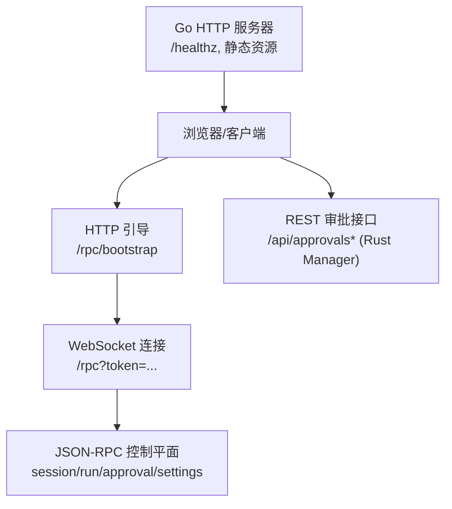
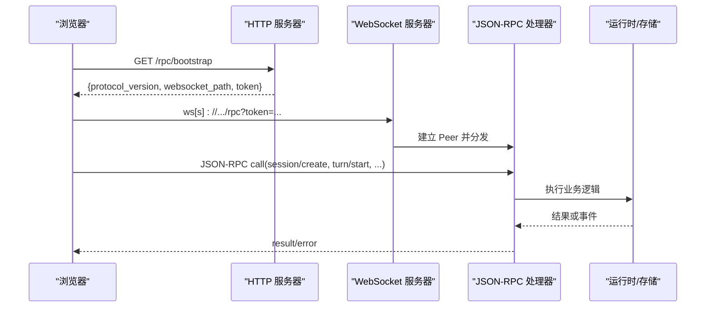
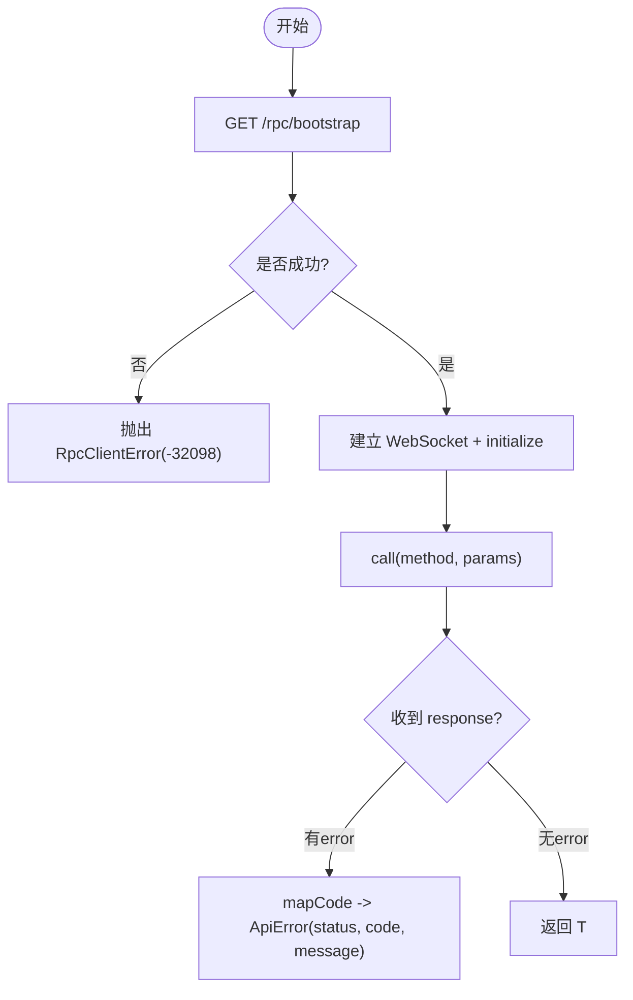
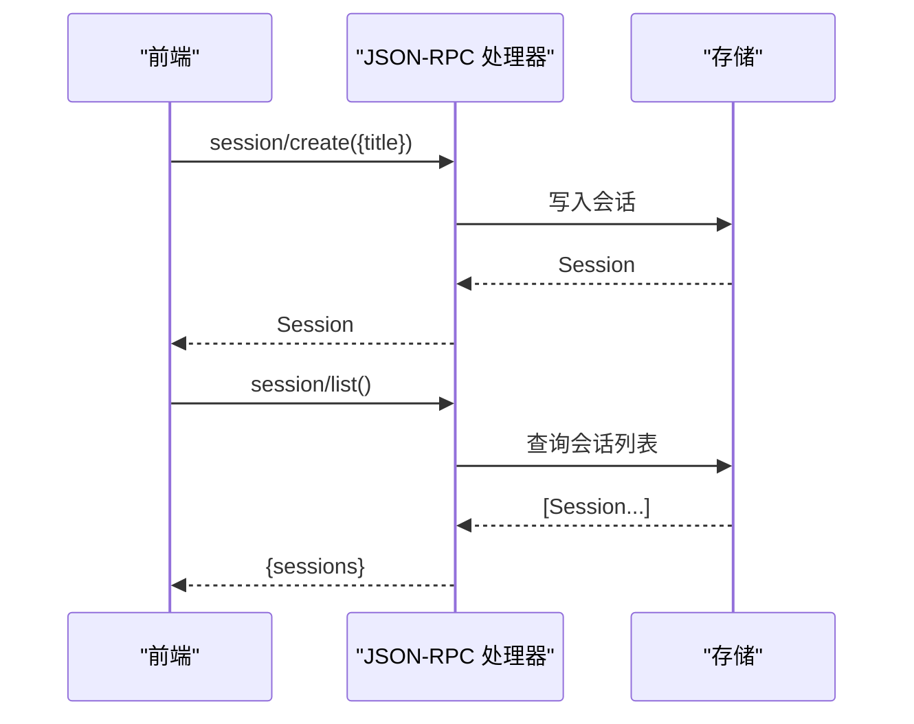
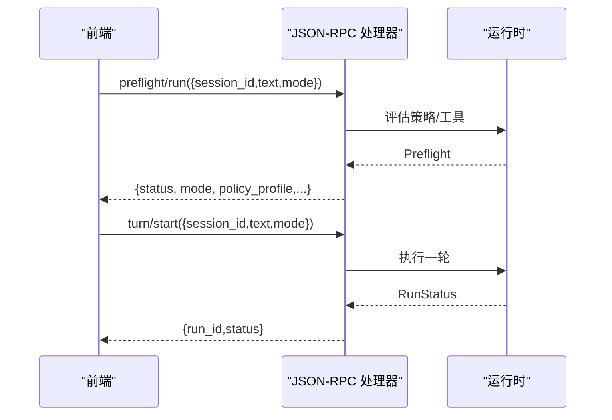
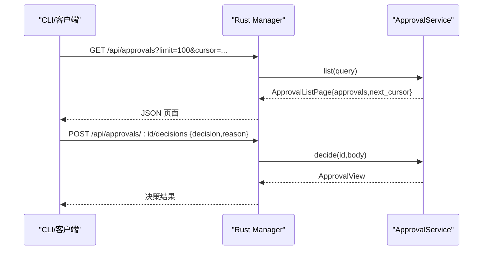
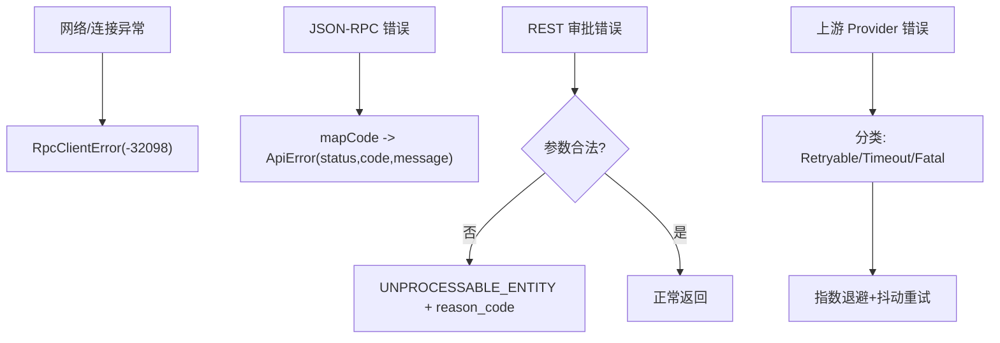
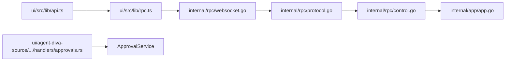

# REST API

<cite>
**本文引用的文件**
- [internal/app/app.go](file://internal/app/app.go)
- [internal/rpc/protocol.go](file://internal/rpc/protocol.go)
- [internal/rpc/control.go](file://internal/rpc/control.go)
- [internal/rpc/websocket.go](file://internal/rpc/websocket.go)
- [ui/src/lib/api.ts](file://ui/src/lib/api.ts)
- [ui/src/lib/rpc.ts](file://ui/src/lib/rpc.ts)
- [ui/src/lib/types.ts](file://ui/src/lib/types.ts)
- [ui/handler.go](file://ui/handler.go)
- [internal/runtime/http_request.go](file://internal/runtime/http_request.go)
- [ui/agent-diva-source/agent-diva-manager/src/handlers/approvals.rs](file://ui/agent-diva-source/agent-diva-manager/src/handlers/approvals.rs)
- [ui/agent-diva-source/agent-diva-manager/src/approval_service.rs](file://ui/agent-diva-source/agent-diva-manager/src/approval_service.rs)
- [ui/agent-diva-source/agent-diva-cli/src/client.rs](file://ui/agent-diva-source/agent-diva-cli/src/client.rs)
</cite>

## 目录
1. [简介](#简介)
2. [项目结构](#项目结构)
3. [核心组件](#核心组件)
4. [架构总览](#架构总览)
5. [详细组件分析](#详细组件分析)
6. [依赖关系分析](#依赖关系分析)
7. [性能考虑](#性能考虑)
8. [故障排查指南](#故障排查指南)
9. [结论](#结论)
10. [附录](#附录)

## 简介
本文件面向使用 Vivy 控制平面与前端 UI 的开发者，系统化说明 REST/JSON-RPC 混合式 API 的设计与实现：HTTP 请求封装、WebSocket 连接建立、请求拦截与响应处理、错误转换机制；并覆盖会话管理、运行控制、审批处理、设置管理等接口定义；同时给出类型系统（TypeScript 接口）、参数校验、返回值映射、统一错误策略、调用示例、最佳实践与常见问题解决方案，以及性能优化与缓存建议。

## 项目结构
Vivy 后端以 Go 进程为主，提供 HTTP 服务与 JSON-RPC over WebSocket 的控制平面；前端通过浏览器发起 HTTP 引导请求获取 WebSocket 地址与令牌，再建立双向通信。此外，UI 侧还包含一个 Rust 实现的 Manager CLI/Manager 服务，暴露 /api/* REST 路由用于审批等能力。

图表来源
- [internal/app/app.go:325-348](file://internal/app/app.go#L325-L348)
- [internal/rpc/websocket.go:27-47](file://internal/rpc/websocket.go#L27-L47)
- [ui/src/lib/rpc.ts:55-99](file://ui/src/lib/rpc.ts#L55-L99)
- [ui/agent-diva-source/agent-diva-manager/src/handlers/approvals.rs:45-58](file://ui/agent-diva-source/agent-diva-manager/src/handlers/approvals.rs#L45-L58)

章节来源
- [internal/app/app.go:325-348](file://internal/app/app.go#L325-L348)
- [ui/handler.go:11-43](file://ui/handler.go#L11-L43)

## 核心组件
- 控制平面（JSON-RPC over WebSocket）
  - 协议与帧处理：定义错误码、消息格式、背压与并发调度。
  - 控制处理器：集中实现 session、run、approval、question、review、settings、eval、child 等方法。
  - WebSocket 接入：Origin 校验、Token 鉴权、升级与 Peer 生命周期管理。
- 前端 RPC 客户端
  - 引导流程：HTTP GET /rpc/bootstrap 获取 websocket_path 与 token。
  - 连接与调用：建立 WebSocket，维护 pending 请求映射，统一错误映射为 ApiError。
- 前端 API 封装
  - 方法清单：session/create、turn/start、run/cancel、approval/list、settings/get/update 等。
  - 类型定义：Session、Run、Approval、Settings 等 TypeScript 接口。
- 审批 REST API（Rust Manager）
  - 路由：/api/approvals、/api/approvals/events、/api/approvals/:request_id、/decisions、/cancel。
  - 查询与分页：支持 domain/status/session/cursor/limit。
  - 错误：统一 reason_code 与状态码。

章节来源
- [internal/rpc/protocol.go:18-38](file://internal/rpc/protocol.go#L18-L38)
- [internal/rpc/control.go:22-50](file://internal/rpc/control.go#L22-L50)
- [internal/rpc/websocket.go:12-55](file://internal/rpc/websocket.go#L12-L55)
- [ui/src/lib/rpc.ts:3-33](file://ui/src/lib/rpc.ts#L3-L33)
- [ui/src/lib/api.ts:3-13](file://ui/src/lib/api.ts#L3-L13)
- [ui/src/lib/types.ts:41-50](file://ui/src/lib/types.ts#L41-L50)
- [ui/agent-diva-source/agent-diva-manager/src/handlers/approvals.rs:45-58](file://ui/agent-diva-source/agent-diva-manager/src/handlers/approvals.rs#L45-L58)

## 架构总览
下图展示从浏览器到后端的完整链路：HTTP 引导 → WebSocket 建立 → JSON-RPC 调用 → 业务层（运行时/存储/事件总线）。

图表来源
- [internal/app/app.go:325-341](file://internal/app/app.go#L325-L341)
- [internal/rpc/websocket.go:27-47](file://internal/rpc/websocket.go#L27-L47)
- [internal/rpc/protocol.go:120-163](file://internal/rpc/protocol.go#L120-L163)
- [ui/src/lib/rpc.ts:55-99](file://ui/src/lib/rpc.ts#L55-L99)

## 详细组件分析

### 请求封装与连接建立（前端）
- 引导阶段
  - 通过 fetch 访问 /rpc/bootstrap，读取 protocol_version、websocket_path、token。
  - 将 token 附加到 WebSocket URL 查询参数中。
- 连接与调用
  - 建立 WebSocket，发送 initialize 获取 capabilities。
  - 所有后续调用通过 call(method, params) 发送 JSON-RPC 请求，维护 pending Map。
  - 收到 response 时根据 error 字段拒绝 Promise，否则解析 result。
- 错误映射
  - RpcClientError 携带 code/message。
  - api.ts 将 JSON-RPC 错误码映射为 HTTP 风格 status 与 code（如 not_found、conflict、invalid_request、internal_error），并抛出 ApiError。

图表来源
- [ui/src/lib/rpc.ts:55-99](file://ui/src/lib/rpc.ts#L55-L99)
- [ui/src/lib/rpc.ts:101-140](file://ui/src/lib/rpc.ts#L101-L140)
- [ui/src/lib/api.ts:38-49](file://ui/src/lib/api.ts#L38-L49)

章节来源
- [ui/src/lib/rpc.ts:55-99](file://ui/src/lib/rpc.ts#L55-L99)
- [ui/src/lib/rpc.ts:101-140](file://ui/src/lib/rpc.ts#L101-L140)
- [ui/src/lib/api.ts:38-49](file://ui/src/lib/api.ts#L38-L49)

### 会话管理接口
- 方法清单（JSON-RPC）
  - session/create、session/list、session/get、session/rename、session/delete、session/messages
- 典型调用
  - 创建会话：调用 session/create，传入 title，返回 Session。
  - 列出会话：调用 session/list，返回 sessions 数组。
  - 获取会话详情：调用 session/get，返回 session 与 messages。
- 类型定义
  - Session、Message 等在前端 types.ts 中定义。

图表来源
- [ui/src/lib/api.ts:52-57](file://ui/src/lib/api.ts#L52-L57)
- [ui/src/lib/types.ts:41-50](file://ui/src/lib/types.ts#L41-L50)
- [internal/rpc/control.go:98-152](file://internal/rpc/control.go#L98-L152)

章节来源
- [ui/src/lib/api.ts:52-57](file://ui/src/lib/api.ts#L52-L57)
- [ui/src/lib/types.ts:41-50](file://ui/src/lib/types.ts#L41-L50)
- [internal/rpc/control.go:98-152](file://internal/rpc/control.go#L98-L152)

### 运行控制接口
- 方法清单
  - preflight/run、turn/start、turn/interrupt、run/cancel、run/get、run/log、run/subscribe、run/unsubscribe
  - child/start、child/get、child/list、child/wait、child/cancel
- 典型调用
  - 预检：preflight/run 返回策略、工具选择、上下文大小等信息。
  - 启动对话：turn/start 返回 run_id 与初始状态。
  - 取消运行：run/cancel 返回最终状态。
  - 子任务：child/start 在父 run 上下文中启动异步子任务。

图表来源
- [ui/src/lib/api.ts:58-63](file://ui/src/lib/api.ts#L58-L63)
- [internal/rpc/control.go:178-196](file://internal/rpc/control.go#L178-L196)

章节来源
- [ui/src/lib/api.ts:58-63](file://ui/src/lib/api.ts#L58-L63)
- [internal/rpc/control.go:178-196](file://internal/rpc/control.go#L178-L196)

### 审批处理接口（REST）
- 路由与方法
  - GET /api/approvals：分页列出待审批项，支持 domain/status/session/cursor/limit。
  - GET /api/approvals/events：事件流（SSE）。
  - GET /api/approvals/:request_id：获取某条审批详情。
  - POST /api/approvals/:request_id/decisions：提交决策（allow/deny）。
  - POST /api/approvals/:request_id/cancel：取消审批。
- 查询与分页
  - ApprovalListQuery 支持可选过滤与 cursor 翻页，默认 limit 为 100。
- 错误与状态码
  - 非法查询/请求体返回 UNPROCESSABLE_ENTITY，并附带 reason_code。
- 调用示例（CLI 分页拉取）
  - 循环追加 cursor 直到 next_cursor 为空，合并 approvals。

图表来源
- [ui/agent-diva-source/agent-diva-manager/src/handlers/approvals.rs:45-58](file://ui/agent-diva-source/agent-diva-manager/src/handlers/approvals.rs#L45-L58)
- [ui/agent-diva-source/agent-diva-manager/src/handlers/approvals.rs:60-112](file://ui/agent-diva-source/agent-diva-manager/src/handlers/approvals.rs#L60-L112)
- [ui/agent-diva-source/agent-diva-manager/src/approval_service.rs:45-83](file://ui/agent-diva-source/agent-diva-manager/src/approval_service.rs#L45-L83)
- [ui/agent-diva-source/agent-diva-cli/src/client.rs:47-84](file://ui/agent-diva-source/agent-diva-cli/src/client.rs#L47-L84)

章节来源
- [ui/agent-diva-source/agent-diva-manager/src/handlers/approvals.rs:45-112](file://ui/agent-diva-source/agent-diva-manager/src/handlers/approvals.rs#L45-L112)
- [ui/agent-diva-source/agent-diva-manager/src/approval_service.rs:45-83](file://ui/agent-diva-source/agent-diva-manager/src/approval_service.rs#L45-L83)
- [ui/agent-diva-source/agent-diva-cli/src/client.rs:47-84](file://ui/agent-diva-source/agent-diva-cli/src/client.rs#L47-L84)

### 设置管理接口
- 方法清单
  - settings/get：读取当前设置（provider、default_model、base_url 等）。
  - settings/update：更新非敏感配置（provider、default_model、base_url）。
- 行为约束
  - 若未提供 SettingsPath，则只读模式，拒绝更新。
  - 配置变更在下一次启动生效（非热插拔）。

章节来源
- [ui/src/lib/api.ts:89-90](file://ui/src/lib/api.ts#L89-L90)
- [internal/rpc/control.go:41-49](file://internal/rpc/control.go#L41-L49)

### 类型系统与参数验证
- 前端 TypeScript 接口
  - 会话：Session{id,title,created_at}
  - 运行：Run{id,session_id,status,created_at}
  - 审批：Approval{id,run_id,tool_call_id,decision?,expires_at}
  - 设置：Settings{provider,default_model,base_url,read_only,...}
- 后端参数校验
  - JSON-RPC 参数按结构体反序列化，失败返回 InvalidParams。
  - REST 审批查询使用 Query 绑定，非法值返回 UNPROCESSABLE_ENTITY 并附带 reason_code。
- 返回值映射
  - JSON-RPC 错误码映射为前端 ApiError 的 HTTP 风格状态码与 code。
  - REST 审批返回统一 JSON 结构，包含 status 与 error.reason_code。

章节来源
- [ui/src/lib/types.ts:41-50](file://ui/src/lib/types.ts#L41-L50)
- [ui/src/lib/api.ts:15-36](file://ui/src/lib/api.ts#L15-L36)
- [internal/rpc/protocol.go:20-27](file://internal/rpc/protocol.go#L20-L27)
- [ui/agent-diva-source/agent-diva-manager/src/handlers/approvals.rs:60-112](file://ui/agent-diva-source/agent-diva-manager/src/handlers/approvals.rs#L60-L112)

### 错误处理策略
- 网络与连接错误
  - WebSocket 断开：RpcClientError(-32098)，触发 pending 全部拒绝。
  - bootstrap 失败：同样抛出 -32098。
- JSON-RPC 错误
  - 解析错误、无效请求、方法不存在、参数无效、内部错误、服务器过载等标准错误码。
  - 前端 mapCode 将特定代码映射为 404/409/400/500 及对应 code。
- REST 审批错误
  - 非法查询/请求体：UNPROCESSABLE_ENTITY，reason_code 指示具体原因。
- 超时与重试
  - 上游 Provider 层对 429/5xx/超时进行可重试分类，结合指数退避与抖动。
  - 前端可在上层根据 ApiError.code 决定重试或提示用户。

图表来源
- [ui/src/lib/rpc.ts:46-49](file://ui/src/lib/rpc.ts#L46-L49)
- [ui/src/lib/api.ts:42-48](file://ui/src/lib/api.ts#L42-L48)
- [ui/agent-diva-source/agent-diva-manager/src/handlers/approvals.rs:549-587](file://ui/agent-diva-source/agent-diva-manager/src/handlers/approvals.rs#L549-L587)
- [ui/agent-diva-source/agent-diva-providers/src/retry.rs:39-75](file://ui/agent-diva-source/agent-diva-providers/src/retry.rs#L39-L75)

章节来源
- [ui/src/lib/rpc.ts:46-49](file://ui/src/lib/rpc.ts#L46-L49)
- [ui/src/lib/api.ts:42-48](file://ui/src/lib/api.ts#L42-L48)
- [ui/agent-diva-source/agent-diva-manager/src/handlers/approvals.rs:549-587](file://ui/agent-diva-source/agent-diva-manager/src/handlers/approvals.rs#L549-L587)
- [ui/agent-diva-source/agent-diva-providers/src/retry.rs:39-75](file://ui/agent-diva-source/agent-diva-providers/src/retry.rs#L39-L75)

### 安全与限制
- Origin 与 Token
  - /rpc/bootstrap 与 WebSocket 均校验 Origin，并通过 token 鉴权。
- 外部 HTTP 出站限制（Agent 工具）
  - 允许域名白名单、禁止私有 IP、禁止携带凭据的请求头与查询参数。

章节来源
- [internal/rpc/websocket.go:27-55](file://internal/rpc/websocket.go#L27-L55)
- [internal/runtime/http_request.go:122-167](file://internal/runtime/http_request.go#L122-L167)

## 依赖关系分析
- 前端依赖
  - ui/src/lib/api.ts 依赖 ui/src/lib/rpc.ts 提供的 getRpcClient。
  - 类型集中在 ui/src/lib/types.ts，供各模块复用。
- 后端依赖
  - internal/app/app.go 组装 storage、runtime、events、rpc 等组件，注册 /rpc、/rpc/bootstrap、/healthz 与静态资源。
  - internal/rpc/control.go 实现 JSON-RPC 方法，依赖 runtime.Service、storage.*Store、events.Bus。
  - internal/rpc/websocket.go 提供 WebSocket 接入与鉴权。
  - Rust Manager 提供 /api/approvals* REST 路由，依赖 ApprovalService。

图表来源
- [ui/src/lib/api.ts:1-13](file://ui/src/lib/api.ts#L1-L13)
- [ui/src/lib/rpc.ts:1-33](file://ui/src/lib/rpc.ts#L1-L33)
- [internal/rpc/websocket.go:12-55](file://internal/rpc/websocket.go#L12-L55)
- [internal/rpc/protocol.go:18-38](file://internal/rpc/protocol.go#L18-L38)
- [internal/rpc/control.go:22-50](file://internal/rpc/control.go#L22-L50)
- [internal/app/app.go:325-348](file://internal/app/app.go#L325-L348)
- [ui/agent-diva-source/agent-diva-manager/src/handlers/approvals.rs:45-58](file://ui/agent-diva-source/agent-diva-manager/src/handlers/approvals.rs#L45-L58)

章节来源
- [ui/src/lib/api.ts:1-13](file://ui/src/lib/api.ts#L1-L13)
- [ui/src/lib/rpc.ts:1-33](file://ui/src/lib/rpc.ts#L1-L33)
- [internal/rpc/websocket.go:12-55](file://internal/rpc/websocket.go#L12-L55)
- [internal/rpc/protocol.go:18-38](file://internal/rpc/protocol.go#L18-L38)
- [internal/rpc/control.go:22-50](file://internal/rpc/control.go#L22-L50)
- [internal/app/app.go:325-348](file://internal/app/app.go#L325-L348)
- [ui/agent-diva-source/agent-diva-manager/src/handlers/approvals.rs:45-58](file://ui/agent-diva-source/agent-diva-manager/src/handlers/approvals.rs#L45-L58)

## 性能考虑
- 连接与会话
  - 复用 WebSocket 连接，避免频繁握手；前端已实现单例 clientPromise。
  - 合理设置 after_seq 增量拉取日志，减少重复传输。
- 批处理与分页
  - 审批列表使用 cursor 分页，默认 limit 100，避免一次性加载过多数据。
- 背压与缓冲
  - JSON-RPC 输出队列有界，防止内存膨胀；前端应关注断连重连。
- 缓存策略
  - /rpc/bootstrap 使用 no-store，确保每次获取最新 token。
  - 静态资源由浏览器缓存；必要时配合版本号或强缓存。
- 上游重试
  - 对 429/5xx/超时采用指数退避与抖动，降低雪崩风险。

[本节为通用指导，不直接分析具体文件]

## 故障排查指南
- 无法连接控制平面
  - 检查 /rpc/bootstrap 是否返回 JSON，确认 Origin 与 CORS。
  - 确认 WebSocket 路径与 token 正确拼接。
- JSON-RPC 错误
  - 查看错误码：-32700/-32600/-32601/-32602/-32603/-32001。
  - 前端会映射为 404/409/400/500，便于定位问题。
- 审批接口参数错误
  - 非法查询或请求体会返回 UNPROCESSABLE_ENTITY，并附带 reason_code。
- 上游 Provider 限流或超时
  - 观察重试次数与退避时间，必要时调整上限或降级策略。

章节来源
- [ui/src/lib/rpc.ts:55-99](file://ui/src/lib/rpc.ts#L55-L99)
- [internal/rpc/protocol.go:20-27](file://internal/rpc/protocol.go#L20-L27)
- [ui/agent-diva-source/agent-diva-manager/src/handlers/approvals.rs:549-587](file://ui/agent-diva-source/agent-diva-manager/src/handlers/approvals.rs#L549-L587)
- [ui/agent-diva-source/agent-diva-providers/src/retry.rs:39-75](file://ui/agent-diva-source/agent-diva-providers/src/retry.rs#L39-L75)

## 结论
本项目通过“HTTP 引导 + WebSocket JSON-RPC”的组合，提供了稳定高效的控制平面；前端以清晰的类型与统一的错误映射简化调用；Rust Manager 提供细粒度的审批 REST API。整体设计兼顾安全性、可扩展性与可观测性，适合在生产环境中运行。

[本节为总结，不直接分析具体文件]

## 附录

### API 方法清单（JSON-RPC）
- 会话
  - session/create、session/list、session/get、session/rename、session/delete、session/messages
- 运行
  - preflight/run、turn/start、turn/interrupt、run/cancel、run/get、run/log、run/subscribe、run/unsubscribe
- 子任务
  - child/start、child/get、child/list、child/wait、child/cancel
- 审批与问答
  - approval/list、approval/respond、question/list、question/respond
- 评审
  - review/list、review/get、review/respond
- 其他
  - background/recover、background/list、background/attach
  - generations/*、evals/*、promotions/*、species/inspect
  - settings/get、settings/update

章节来源
- [ui/src/lib/api.ts:3-13](file://ui/src/lib/api.ts#L3-L13)

### 审批 REST 接口定义
- GET /api/approvals
  - 查询参数：domain、status、session、cursor、limit
  - 返回：{ approvals[], next_cursor? }
- GET /api/approvals/events
  - 返回：SSE 事件流
- GET /api/approvals/:request_id
  - 返回：审批详情
- POST /api/approvals/:request_id/decisions
  - 请求体：{ decision, reason? }
  - 返回：审批视图
- POST /api/approvals/:request_id/cancel
  - 返回：取消结果

章节来源
- [ui/agent-diva-source/agent-diva-manager/src/handlers/approvals.rs:45-58](file://ui/agent-diva-source/agent-diva-manager/src/handlers/approvals.rs#L45-L58)
- [ui/agent-diva-source/agent-diva-manager/src/approval_service.rs:45-83](file://ui/agent-diva-source/agent-diva-manager/src/approval_service.rs#L45-L83)

### 调用示例（概念性）
- 创建会话
  - 调用 session/create，传入 title，得到 Session。
- 启动运行
  - 调用 turn/start，传入 session_id、text、mode，得到 run_id 与状态。
- 分页拉取审批
  - 循环 GET /api/approvals?limit=100&cursor=...，直到 next_cursor 为空。

[本节为概念性示例，不直接分析具体文件]