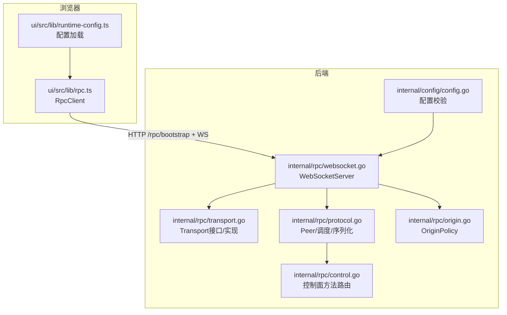
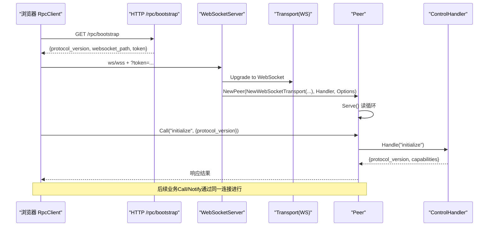
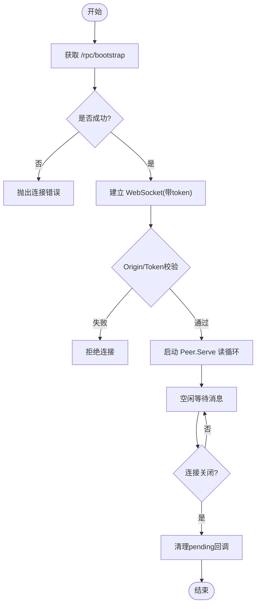
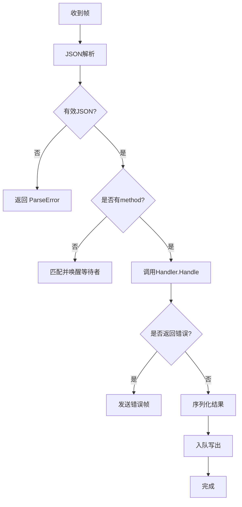
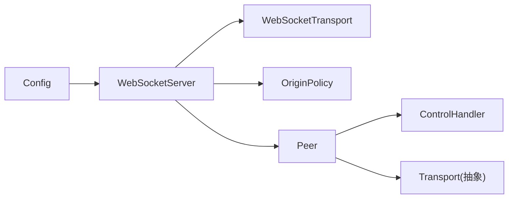

# RPC客户端

<cite>
**本文引用的文件**
- [protocol.go](file://internal/rpc/protocol.go)
- [websocket.go](file://internal/rpc/websocket.go)
- [transport.go](file://internal/rpc/transport.go)
- [control.go](file://internal/rpc/control.go)
- [origin.go](file://internal/rpc/origin.go)
- [rpc.ts](file://ui/src/lib/rpc.ts)
- [runtime-config.ts](file://ui/src/lib/runtime-config.ts)
- [config.go](file://internal/config/config.go)
- [config.example.yaml](file://config.example.yaml)
</cite>

## 目录
1. [简介](#简介)
2. [项目结构](#项目结构)
3. [核心组件](#核心组件)
4. [架构总览](#架构总览)
5. [详细组件分析](#详细组件分析)
6. [依赖关系分析](#依赖关系分析)
7. [性能考量](#性能考量)
8. [故障排查指南](#故障排查指南)
9. [结论](#结论)
10. [附录](#附录)

## 简介
本文件面向Vivy的RPC客户端，覆盖后端Go实现与前端TypeScript客户端。重点包括：
- WebSocket连接管理：建立、鉴权、断线处理（当前未实现心跳与自动重连）
- JSON-RPC协议：请求/响应映射、错误码、通知机制
- 能力发现：initialize/capabilities获取、方法注册、版本兼容性检查
- 连接池与多连接：当前为单连接模型；提供扩展建议
- 配置示例、重试模式与性能优化技巧
- 调试与监控指标的使用建议

## 项目结构
RPC相关代码主要分布在：
- internal/rpc：服务端JSON-RPC协议、传输抽象、WebSocket服务、控制面方法
- ui/src/lib：浏览器端RPC客户端、运行时配置加载
- internal/config：服务器监听地址、跨域策略等配置项

图表来源
- [websocket.go:27-47](file://internal/rpc/websocket.go#L27-L47)
- [transport.go:12-85](file://internal/rpc/transport.go#L12-L85)
- [protocol.go:92-164](file://internal/rpc/protocol.go#L92-L164)
- [control.go:253-353](file://internal/rpc/control.go#L253-L353)
- [origin.go:13-54](file://internal/rpc/origin.go#L13-L54)
- [config.go:61-68](file://internal/config/config.go#L61-L68)

章节来源
- [websocket.go:27-47](file://internal/rpc/websocket.go#L27-L47)
- [protocol.go:92-164](file://internal/rpc/protocol.go#L92-L164)
- [control.go:253-353](file://internal/rpc/control.go#L253-L353)
- [origin.go:13-54](file://internal/rpc/origin.go#L13-L54)
- [config.go:61-68](file://internal/config/config.go#L61-L68)

## 核心组件
- 传输层抽象：统一ReadFrame/WriteFrame/Closed，支持JSONL与WebSocket
- Peer：负责JSON-RPC帧的收发、请求分发、响应等待、背压队列
- WebSocketServer：HTTP升级、Token鉴权、Origin校验、创建Peer并启动Serve
- ControlHandler：方法路由表，包含initialize/capabilities及业务方法
- 浏览器RpcClient：bootstrap握手、能力协商、调用封装、通知订阅、关闭事件

章节来源
- [transport.go:12-85](file://internal/rpc/transport.go#L12-L85)
- [protocol.go:92-374](file://internal/rpc/protocol.go#L92-L374)
- [websocket.go:12-56](file://internal/rpc/websocket.go#L12-L56)
- [control.go:253-353](file://internal/rpc/control.go#L253-L353)
- [rpc.ts:38-155](file://ui/src/lib/rpc.ts#L38-L155)

## 架构总览
下图展示了从浏览器到后端的完整调用链路，包括bootstrap、能力协商、请求/响应与通知。

图表来源
- [rpc.ts:55-99](file://ui/src/lib/rpc.ts#L55-L99)
- [websocket.go:27-47](file://internal/rpc/websocket.go#L27-L47)
- [protocol.go:120-164](file://internal/rpc/protocol.go#L120-L164)
- [control.go:253-266](file://internal/rpc/control.go#L253-L266)

## 详细组件分析

### WebSocket连接管理
- 连接建立
  - 浏览器先拉取/bootstrap获取token与websocket_path，再建立ws/wss连接
  - 服务端校验Origin与Token，通过后升级WebSocket
- 鉴权与跨域
  - Token可从查询参数或Authorization头传入
  - OriginPolicy限制允许的浏览器源，仅允许回环地址
- 心跳机制
  - 当前实现未内置心跳；如需保活可在上层定时发送Ping/Pong或轻量Notify
- 断线重连
  - 当前实现未内置自动重连；建议在浏览器侧封装重试逻辑（指数退避、最大重试次数）
  - 服务端在Peer关闭时会清理待处理请求并返回“peer closed”错误

图表来源
- [rpc.ts:55-99](file://ui/src/lib/rpc.ts#L55-L99)
- [websocket.go:27-56](file://internal/rpc/websocket.go#L27-L56)
- [origin.go:13-54](file://internal/rpc/origin.go#L13-L54)
- [protocol.go:359-374](file://internal/rpc/protocol.go#L359-L374)

章节来源
- [websocket.go:27-56](file://internal/rpc/websocket.go#L27-L56)
- [origin.go:13-54](file://internal/rpc/origin.go#L13-L54)
- [protocol.go:120-164](file://internal/rpc/protocol.go#L120-L164)
- [rpc.ts:55-99](file://ui/src/lib/rpc.ts#L55-L99)

### 消息序列化与反序列化（JSON-RPC）
- 协议版本常量与错误码定义
- 请求/响应信封结构：jsonrpc、id、method、params、result、error
- 解析流程：
  - 读取帧 -> 解析JSON -> 区分响应帧与方法调用
  - 无ID且含result/error视为响应，交由resolve匹配等待者
  - 有method则交给Handler处理，异步执行后写回响应
- 错误处理：
  - 解析失败返回ParseError
  - 非法请求返回InvalidRequest
  - 未知方法返回MethodNotFound
  - 内部错误返回InternalError
  - 过载时写入队列失败返回ErrOverloaded
- 通知：
  - Notify用于无响应的单向推送（如事件流）

图表来源
- [protocol.go:181-230](file://internal/rpc/protocol.go#L181-L230)
- [protocol.go:253-273](file://internal/rpc/protocol.go#L253-L273)

章节来源
- [protocol.go:18-32](file://internal/rpc/protocol.go#L18-L32)
- [protocol.go:181-230](file://internal/rpc/protocol.go#L181-L230)
- [protocol.go:253-273](file://internal/rpc/protocol.go#L253-L273)

### 能力发现与版本兼容
- initialize/capabilities
  - 客户端调用initialize并携带protocol_version
  - 服务端返回协议版本与capabilities列表
- 方法注册
  - controlHandler.Handle中维护方法路由表，新增方法需在此注册
- 版本兼容性
  - 客户端可依据返回的protocol_version做兼容判断
  - 当前未强制校验版本不匹配时的行为，可在客户端增加版本检查

章节来源
- [control.go:253-266](file://internal/rpc/control.go#L253-L266)
- [rpc.ts:94-98](file://ui/src/lib/rpc.ts#L94-L98)

### 连接池与多连接
- 当前实现为单连接模型：每个WebSocket会话对应一个Peer实例
- 负载均衡与故障转移
  - 未实现多连接池；可通过上层封装多个客户端实例轮询或主备切换
  - 建议：
    - 客户端维护连接池，按负载选择连接
    - 连接健康检查（Ping/自定义Keepalive）
    - 故障转移：主连接失败切换到备用连接并重放未决请求
- 背压与限流
  - 出站队列大小由Options.OutgoingBuffer控制，满时返回ErrOverloaded
  - 建议在上层实现重试与退避

章节来源
- [protocol.go:70-83](file://internal/rpc/protocol.go#L70-L83)
- [protocol.go:257-273](file://internal/rpc/protocol.go#L257-L273)

### 配置与连接示例
- 后端监听地址与跨域
  - server.addr：本地HTTP+WebSocket监听地址
  - server.allowed_origins：允许的外部浏览器源（必须为回环地址）
- 运行时限制
  - stream_buffer、max_event_payload_bytes等影响吞吐与内存
- 前端配置
  - runtime-config.ts加载/vivy-config.json，若不存在则默认同域
  - resolveControlPlaneOrigin确保URL格式合法

章节来源
- [config.example.yaml:5-11](file://config.example.yaml#L5-L11)
- [config.go:61-68](file://internal/config/config.go#L61-L68)
- [runtime-config.ts:8-44](file://ui/src/lib/runtime-config.ts#L8-L44)

### 错误重试模式与最佳实践
- 客户端侧重试
  - 捕获连接错误与超时，采用指数退避重试
  - 对幂等方法可安全重试；非幂等需加唯一ID与去抖
- 服务端侧保护
  - 使用OutgoingBuffer避免无限堆积
  - 大帧保护：超过MaxFrameBytes直接拒绝
- 建议
  - 在浏览器端封装统一的connect/retry/close生命周期
  - 对长连接场景引入心跳与断线检测

章节来源
- [protocol.go:70-83](file://internal/rpc/protocol.go#L70-L83)
- [protocol.go:158-161](file://internal/rpc/protocol.go#L158-L161)
- [rpc.ts:101-112](file://ui/src/lib/rpc.ts#L101-L112)

### 调试工具与监控指标
- 调试
  - 浏览器网络面板查看/ws握手与消息
  - 后端日志记录错误码与异常堆栈
- 指标建议
  - 连接数、活跃会话数、QPS、平均延迟、P99延迟
  - 错误率：ParseError、InvalidRequest、MethodNotFound、InternalError、ServerOverload
  - 背压：出站队列长度、丢弃计数
  - 资源：内存、GC、goroutine数量

[本节为通用指导，不直接分析具体文件]

## 依赖关系分析
- 传输层解耦：Peer不关心底层是JSONL还是WebSocket
- 控制面方法集中：所有业务方法集中在controlHandler中路由
- 配置边界：配置校验严格，禁止敏感信息落盘

图表来源
- [websocket.go:27-47](file://internal/rpc/websocket.go#L27-L47)
- [transport.go:12-85](file://internal/rpc/transport.go#L12-L85)
- [protocol.go:92-164](file://internal/rpc/protocol.go#L92-L164)
- [control.go:253-353](file://internal/rpc/control.go#L253-L353)
- [origin.go:13-54](file://internal/rpc/origin.go#L13-L54)
- [config.go:61-68](file://internal/config/config.go#L61-L68)

章节来源
- [websocket.go:27-47](file://internal/rpc/websocket.go#L27-L47)
- [protocol.go:92-164](file://internal/rpc/protocol.go#L92-L164)
- [control.go:253-353](file://internal/rpc/control.go#L253-L353)
- [origin.go:13-54](file://internal/rpc/origin.go#L13-L54)
- [config.go:61-68](file://internal/config/config.go#L61-L68)

## 性能考量
- 背压与缓冲
  - OutgoingBuffer控制并发写出压力，过大可能导致内存占用，过小导致频繁ErrOverloaded
  - MaxFrameBytes防止超大消息拖垮服务
- I/O路径
  - 写串行化：writeLoop保证顺序写出，避免竞争
  - 读循环：逐帧解析，避免阻塞
- 序列化开销
  - 大量小对象marshal/unmarshal可能成为瓶颈，可考虑复用缓冲或批处理
- 连接复用
  - 单连接下尽量复用，减少握手成本
  - 多连接池需考虑负载均衡与一致性

[本节为通用指导，不直接分析具体文件]

## 故障排查指南
- 常见错误码
  - ParseError：JSON解析失败
  - InvalidRequest：非标准JSON-RPC请求
  - MethodNotFound：方法未注册
  - InternalError：内部异常
  - ServerOverload：出站队列已满
- 定位步骤
  - 检查浏览器控制台与网络面板，确认bootstrap与ws握手成功
  - 核对Origin与Token是否正确
  - 检查服务端日志中的错误码与堆栈
  - 调整OutgoingBuffer与MaxFrameBytes观察效果
- 恢复策略
  - 客户端实现重试与降级
  - 服务端过载时快速失败，避免雪崩

章节来源
- [protocol.go:20-32](file://internal/rpc/protocol.go#L20-L32)
- [protocol.go:158-161](file://internal/rpc/protocol.go#L158-L161)
- [protocol.go:257-273](file://internal/rpc/protocol.go#L257-L273)
- [websocket.go:27-56](file://internal/rpc/websocket.go#L27-L56)

## 结论
该RPC客户端在后端实现了健壮的JSON-RPC协议与传输抽象，在前端提供了简洁的连接与调用封装。当前版本未内置心跳与自动重连，但具备清晰的扩展点。建议在生产环境中补充心跳、重连、连接池与监控指标，以提升稳定性与可观测性。

[本节为总结，不直接分析具体文件]

## 附录
- 配置参考
  - 后端监听与跨域：server.addr、server.allowed_origins
  - 运行时限制：stream_buffer、max_event_payload_bytes等
- 方法清单
  - initialize/capabilities用于能力发现
  - 其他业务方法在controlHandler中注册

章节来源
- [config.example.yaml:5-11](file://config.example.yaml#L5-L11)
- [config.go:61-68](file://internal/config/config.go#L61-L68)
- [control.go:253-353](file://internal/rpc/control.go#L253-L353)