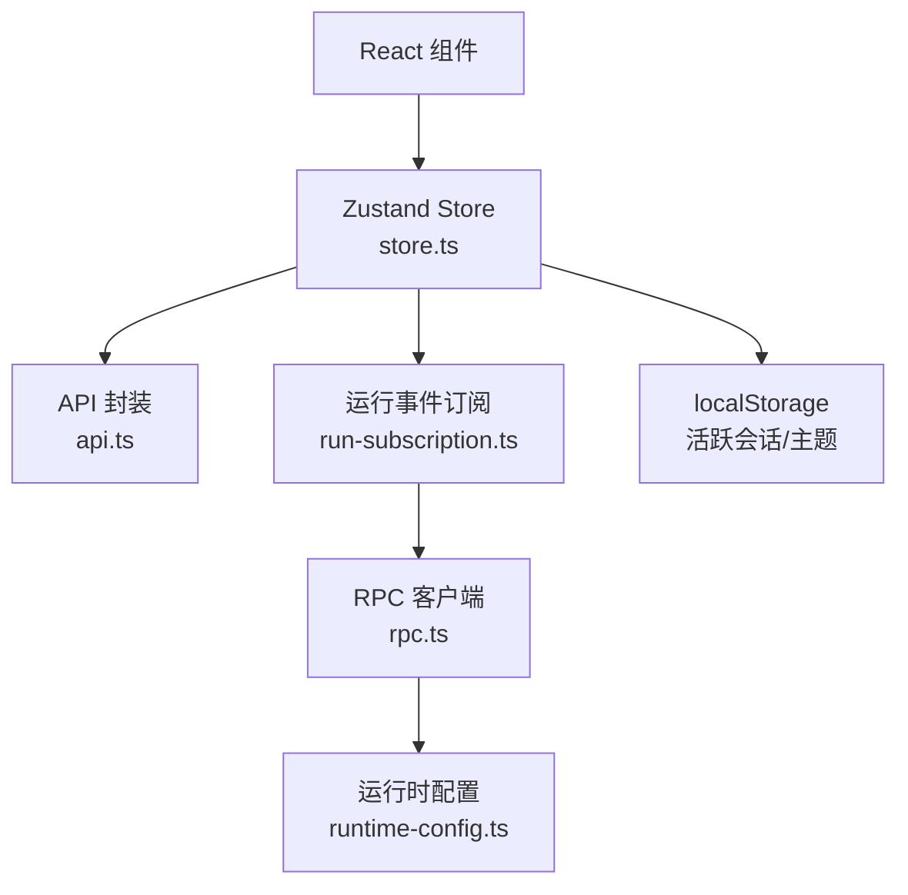
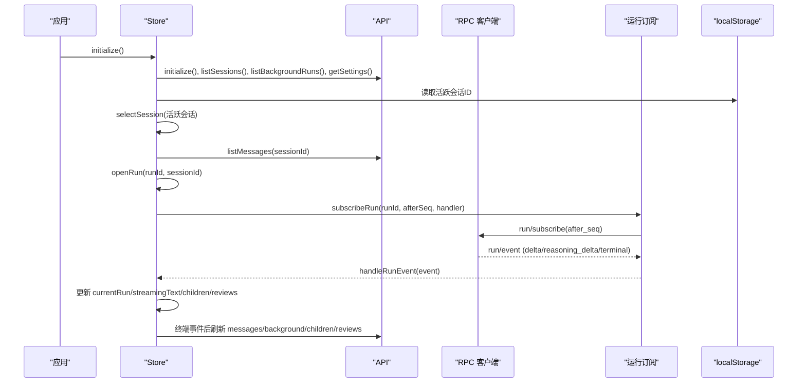
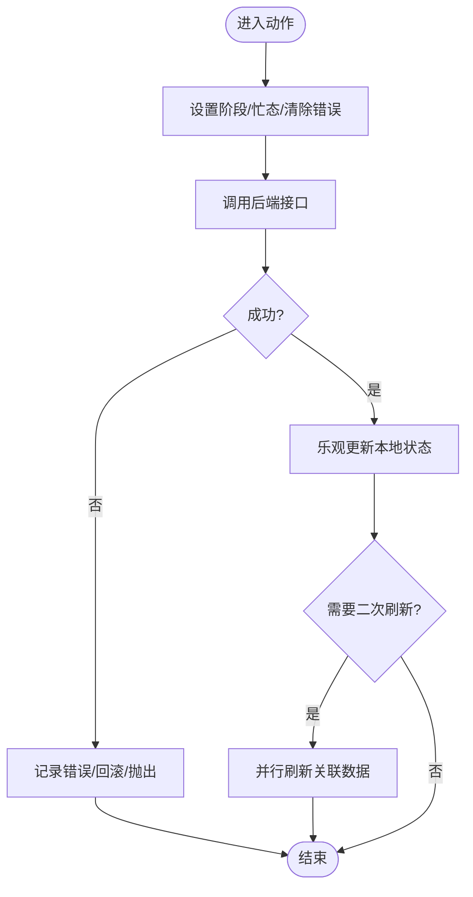
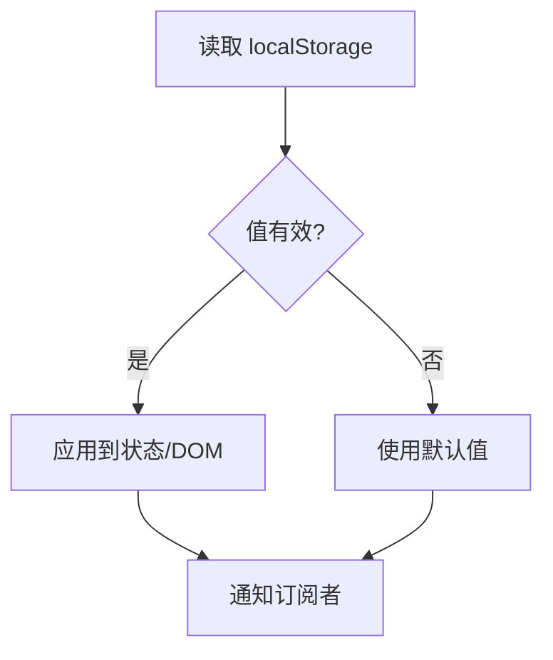
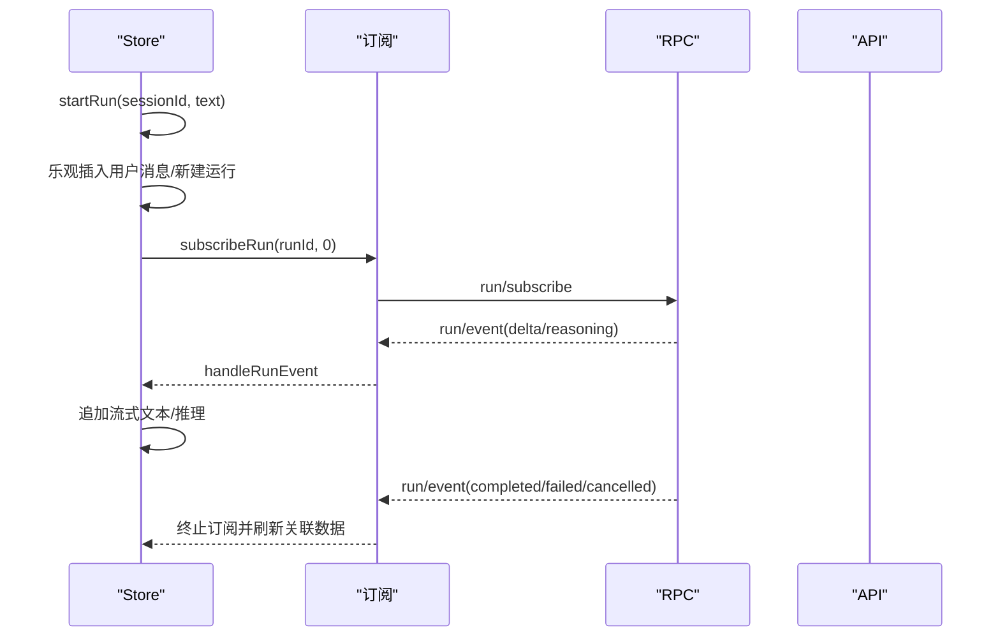
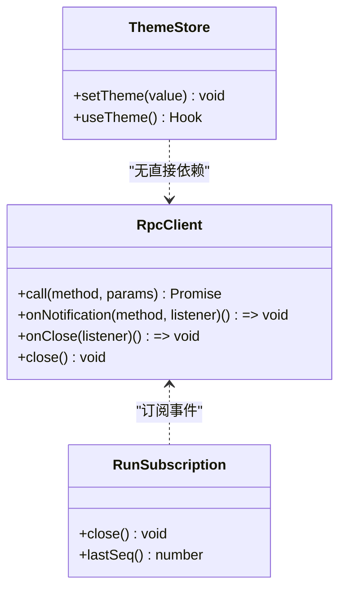
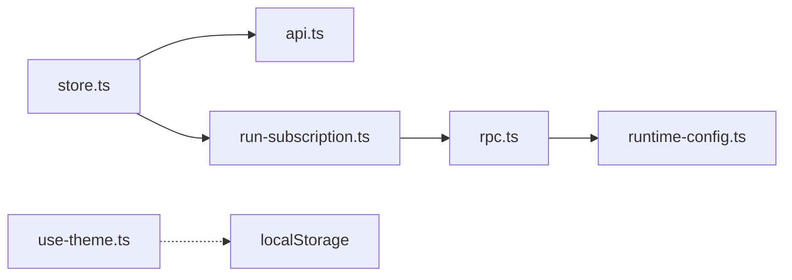

# 状态管理

<cite>
**本文引用的文件**
- [ui/src/lib/store.ts](file://ui/src/lib/store.ts)
- [ui/src/lib/run-subscription.ts](file://ui/src/lib/run-subscription.ts)
- [ui/src/lib/rpc.ts](file://ui/src/lib/rpc.ts)
- [ui/src/lib/runtime-config.ts](file://ui/src/lib/runtime-config.ts)
- [ui/src/lib/api.ts](file://ui/src/lib/api.ts)
- [ui/src/hooks/use-theme.ts](file://ui/src/hooks/use-theme.ts)
- [ui/src/lib/store.test.ts](file://ui/src/lib/store.test.ts)
- [ui/src/lib/run-subscription.test.ts](file://ui/src/lib/run-subscription.test.ts)
- [ui/src/hooks/use-theme.test.ts](file://ui/src/hooks/use-theme.test.ts)
</cite>

## 目录
1. [简介](#简介)
2. [项目结构](#项目结构)
3. [核心组件](#核心组件)
4. [架构总览](#架构总览)
5. [详细组件分析](#详细组件分析)
6. [依赖关系分析](#依赖关系分析)
7. [性能考量](#性能考量)
8. [故障排查指南](#故障排查指南)
9. [结论](#结论)
10. [附录](#附录)

## 简介
本文件聚焦前端状态管理，围绕全局状态设计、本地存储集成、状态同步机制、订阅与观察者模式、以及最佳实践与调试方法展开。该实现基于 Zustand 构建单一运行时状态树，结合 WebSocket RPC 的实时事件流，提供会话、运行、子任务、审核、设置、生命周期等模块的统一状态视图；同时通过 localStorage 持久化活跃会话与主题偏好，保障刷新后体验一致。

## 项目结构
前端状态相关代码集中在 ui/src/lib 与 ui/src/hooks：
- store.ts：Zustand 全局状态定义、更新动作、派生计算、事件处理与副作用编排。
- run-subscription.ts：基于 WebSocket 的运行事件订阅、断线重连、游标回放。
- rpc.ts：JSON-RPC over WebSocket 客户端，负责连接、能力协商、通知分发与错误映射。
- runtime-config.ts：运行时配置加载与控制平面地址解析。
- api.ts：RPC 方法封装与类型定义。
- use-theme.ts：主题状态的独立最小状态机（localStorage + 观察者）。

图表来源
- [ui/src/lib/store.ts:151-310](file://ui/src/lib/store.ts#L151-L310)
- [ui/src/lib/run-subscription.ts:8-70](file://ui/src/lib/run-subscription.ts#L8-L70)
- [ui/src/lib/rpc.ts:38-155](file://ui/src/lib/rpc.ts#L38-L155)
- [ui/src/lib/runtime-config.ts:8-44](file://ui/src/lib/runtime-config.ts#L8-L44)
- [ui/src/lib/api.ts:3-91](file://ui/src/lib/api.ts#L3-L91)

章节来源
- [ui/src/lib/store.ts:1-315](file://ui/src/lib/store.ts#L1-L315)
- [ui/src/lib/run-subscription.ts:1-71](file://ui/src/lib/run-subscription.ts#L1-L71)
- [ui/src/lib/rpc.ts:1-155](file://ui/src/lib/rpc.ts#L1-L155)
- [ui/src/lib/runtime-config.ts:1-50](file://ui/src/lib/runtime-config.ts#L1-L50)
- [ui/src/lib/api.ts:1-91](file://ui/src/lib/api.ts#L1-L91)

## 核心组件
- 全局状态树（RuntimeState）：集中管理初始化、连接、会话、消息、当前运行、流式文本/推理、后台运行、子任务、审核、设置、物种/生成/评估/晋升、生命周期等。
- 动作与副作用：每个动作统一设置阶段、忙态、错误，并在成功时合并数据或触发后续加载。
- 事件驱动更新：通过 run-subscription 接收后端事件，增量更新运行状态、流式输出、子任务与审核列表。
- 本地存储：活跃会话 ID 与主题偏好写入 localStorage，保证刷新恢复。
- 配置与连接：启动时加载运行时配置，建立 RPC 连接并获取能力集。

章节来源
- [ui/src/lib/store.ts:26-96](file://ui/src/lib/store.ts#L26-L96)
- [ui/src/lib/store.ts:151-310](file://ui/src/lib/store.ts#L151-L310)
- [ui/src/hooks/use-theme.ts:64-112](file://ui/src/hooks/use-theme.ts#L64-L112)

## 架构总览
整体流程：应用初始化 → 加载配置 → 建立 RPC → 拉取会话/设置/后台运行 → 选择活跃会话 → 加载消息与最近运行 → 若运行中则订阅事件 → 事件驱动更新状态 → 终端事件后刷新关联数据。

图表来源
- [ui/src/lib/store.ts:162-186](file://ui/src/lib/store.ts#L162-L186)
- [ui/src/lib/store.ts:217-239](file://ui/src/lib/store.ts#L217-L239)
- [ui/src/lib/store.ts:119-142](file://ui/src/lib/store.ts#L119-L142)
- [ui/src/lib/run-subscription.ts:24-60](file://ui/src/lib/run-subscription.ts#L24-L60)
- [ui/src/lib/rpc.ts:55-99](file://ui/src/lib/rpc.ts#L55-L99)

## 详细组件分析

### 全局状态与更新模式（store.ts）
- 状态结构：包含连接状态、会话集合与阶段、消息集合与阶段、当前运行、事件序列、流式文本/推理、后台运行、子任务、审核、设置、生命周期等。
- 更新模式：
  - 乐观更新：如创建会话、开始运行、响应审核时先更新本地状态，再调用后端并二次刷新，确保交互即时反馈。
  - 阶段与忙态：所有异步操作统一设置 loading/refreshing/error/processing 与 busyId，避免重复请求与竞态。
  - 幂等与防抖：selectSession 使用 epoch 防止旧响应覆盖新选择；initialize 使用初始化锁避免重复初始化。
  - 派生计算：replay 从事件序列重建流式文本；lastRunId 从消息倒序查找最近运行；runActive 判断运行是否仍在进行。
- 副作用编排：终端事件后并行刷新消息、后台运行、子任务与审核，保持视图一致性。

图表来源
- [ui/src/lib/store.ts:188-309](file://ui/src/lib/store.ts#L188-L309)

章节来源
- [ui/src/lib/store.ts:18-24](file://ui/src/lib/store.ts#L18-L24)
- [ui/src/lib/store.ts:105-149](file://ui/src/lib/store.ts#L105-L149)
- [ui/src/lib/store.ts:151-310](file://ui/src/lib/store.ts#L151-L310)

### 本地存储集成（localStorage）
- 活跃会话：在切换会话时写入 key，初始化时优先恢复已存在的活跃会话；删除会话时清理键值并重置相关状态。
- 主题偏好：use-theme 将主题 id 写入 localStorage，页面加载时读取并应用到 DOM，变更时持久化并通知订阅者。
- 容错策略：读写失败时降级为内存态，不影响主流程；测试环境可注入 mock storage。

图表来源
- [ui/src/lib/store.ts:8-16](file://ui/src/lib/store.ts#L8-L16)
- [ui/src/lib/store.ts:176-179](file://ui/src/lib/store.ts#L176-L179)
- [ui/src/lib/store.ts:209-213](file://ui/src/lib/store.ts#L209-L213)
- [ui/src/lib/store.ts:217-220](file://ui/src/lib/store.ts#L217-L220)
- [ui/src/hooks/use-theme.ts:64-102](file://ui/src/hooks/use-theme.ts#L64-L102)

章节来源
- [ui/src/lib/store.ts:8-16](file://ui/src/lib/store.ts#L8-L16)
- [ui/src/lib/store.ts:176-179](file://ui/src/lib/store.ts#L176-L179)
- [ui/src/lib/store.ts:209-213](file://ui/src/lib/store.ts#L209-L213)
- [ui/src/lib/store.ts:217-220](file://ui/src/lib/store.ts#L217-L220)
- [ui/src/hooks/use-theme.ts:64-102](file://ui/src/hooks/use-theme.ts#L64-L102)

### 状态同步机制（实时数据更新、冲突解决、乐观更新）
- 实时数据更新：通过 run-subscription 订阅 run/event，按 seq 去重与排序，增量追加到 runEvents，并据此更新 streamingText/reasoning 与运行状态。
- 冲突解决：
  - 会话切换使用 sessionEpoch 与 activeSessionId 双重校验，丢弃过期响应。
  - 审核列表使用 reviewEpoch 防止并发刷新覆盖。
  - 事件回放使用 after_seq 游标，服务端保证顺序，客户端维护 cursor。
- 乐观更新：创建会话、开始运行、响应审核等操作先更新本地状态，再调用后端；失败时回滚或提示错误。

图表来源
- [ui/src/lib/store.ts:240-249](file://ui/src/lib/store.ts#L240-L249)
- [ui/src/lib/store.ts:119-142](file://ui/src/lib/store.ts#L119-L142)
- [ui/src/lib/run-subscription.ts:24-60](file://ui/src/lib/run-subscription.ts#L24-L60)

章节来源
- [ui/src/lib/store.ts:119-142](file://ui/src/lib/store.ts#L119-L142)
- [ui/src/lib/store.ts:217-239](file://ui/src/lib/store.ts#L217-L239)
- [ui/src/lib/run-subscription.ts:8-70](file://ui/src/lib/run-subscription.ts#L8-L70)

### 状态订阅模式（观察者模式、性能优化、内存管理）
- 观察者模式：
  - RpcClient 维护通知监听器集合，支持 onNotification/onClose，返回取消函数。
  - run-subscription 在 connect 时注册事件与错误监听，close 时清理。
  - use-theme 维护 listeners 集合，setTheme 时广播变更。
- 性能优化：
  - 事件按 seq 去重与排序，避免重复渲染。
  - 流式文本采用字符串拼接，减少中间对象分配。
  - 批量刷新：终端事件后并行加载多个资源，缩短首屏时间。
- 内存管理：
  - stopSubscription 关闭旧订阅，避免多路订阅叠加。
  - resetRpcClient 断开并重试，释放 pending Promise。
  - 测试提供 resetStoreForTests/resetThemeForTests 重置模块级状态。

图表来源
- [ui/src/lib/rpc.ts:38-155](file://ui/src/lib/rpc.ts#L38-L155)
- [ui/src/lib/run-subscription.ts:8-70](file://ui/src/lib/run-subscription.ts#L8-L70)
- [ui/src/hooks/use-theme.ts:82-112](file://ui/src/hooks/use-theme.ts#L82-L112)

章节来源
- [ui/src/lib/rpc.ts:114-140](file://ui/src/lib/rpc.ts#L114-L140)
- [ui/src/lib/run-subscription.ts:18-67](file://ui/src/lib/run-subscription.ts#L18-L67)
- [ui/src/hooks/use-theme.ts:82-112](file://ui/src/hooks/use-theme.ts#L82-L112)

### 复杂状态场景处理示例
- 会话切换竞态：selectSession 使用递增 epoch，仅当 epoch 匹配且 activeSessionId 未变时才更新消息与运行，避免旧响应覆盖新选择。
- 运行中断与恢复：openRun 根据运行状态决定是否启动订阅；终端事件后停止订阅并刷新关联数据。
- 审核乐观更新：respondReview 先乐观更新本地审核状态，再调用后端并刷新列表，失败时捕获错误并保留用户输入。
- 主题切换：setTheme 校验合法主题 id，应用至 DOM，持久化并通知所有订阅者，忽略非法或重复值。

章节来源
- [ui/src/lib/store.ts:217-229](file://ui/src/lib/store.ts#L217-L229)
- [ui/src/lib/store.ts:230-239](file://ui/src/lib/store.ts#L230-L239)
- [ui/src/lib/store.ts:286-296](file://ui/src/lib/store.ts#L286-L296)
- [ui/src/hooks/use-theme.ts:91-102](file://ui/src/hooks/use-theme.ts#L91-L102)

## 依赖关系分析
- store.ts 依赖 api.ts、run-subscription.ts、rpc.ts（间接）、runtime-config.ts（间接）。
- run-subscription.ts 依赖 rpc.ts。
- rpc.ts 依赖 runtime-config.ts。
- use-theme.ts 独立于 store，仅依赖 localStorage 与 DOM。

图表来源
- [ui/src/lib/store.ts:1-4](file://ui/src/lib/store.ts#L1-L4)
- [ui/src/lib/run-subscription.ts:1-2](file://ui/src/lib/run-subscription.ts#L1-L2)
- [ui/src/lib/rpc.ts:1-2](file://ui/src/lib/rpc.ts#L1-L2)

章节来源
- [ui/src/lib/store.ts:1-4](file://ui/src/lib/store.ts#L1-L4)
- [ui/src/lib/run-subscription.ts:1-2](file://ui/src/lib/run-subscription.ts#L1-L2)
- [ui/src/lib/rpc.ts:1-2](file://ui/src/lib/rpc.ts#L1-L2)

## 性能考量
- 事件批处理：按 seq 排序与去重，避免频繁重绘。
- 并行加载：终端事件后并行刷新消息、后台运行、子任务与审核，降低端到端延迟。
- 流式更新：字符串拼接减少对象分配，配合 React 渲染优化。
- 连接复用：getRpcClient 缓存连接，减少握手开销；断线自动重连。
- 内存回收：stopSubscription 与 resetRpcClient 及时释放监听器与 pending Promise。

[本节为通用指导，不直接分析具体文件]

## 故障排查指南
- 连接问题：检查 /vivy-config.json 是否存在且返回 JSON；确认 controlPlaneUrl 协议与路径；查看 RPC bootstrap 响应是否包含 websocket_path 与 token。
- 事件回放失败：关注 run/stream_error 通知，确认 after_seq 游标是否正确；订阅会在 1 秒后重试。
- 会话切换异常：检查 sessionEpoch 与 activeSessionId 是否匹配；确认消息加载未覆盖新选择。
- 主题不生效：确认 isThemeId 校验通过；检查 localStorage 是否可用；验证 data-theme 与 dark 类是否正确设置。
- 单元测试：使用 store.test.ts、run-subscription.test.ts、use-theme.test.ts 中的 mock 与断言定位问题。

章节来源
- [ui/src/lib/runtime-config.ts:8-44](file://ui/src/lib/runtime-config.ts#L8-L44)
- [ui/src/lib/rpc.ts:55-99](file://ui/src/lib/rpc.ts#L55-L99)
- [ui/src/lib/run-subscription.ts:37-47](file://ui/src/lib/run-subscription.ts#L37-L47)
- [ui/src/lib/store.test.ts:30-74](file://ui/src/lib/store.test.ts#L30-L74)
- [ui/src/lib/run-subscription.test.ts:11-34](file://ui/src/lib/run-subscription.test.ts#L11-L34)
- [ui/src/hooks/use-theme.test.ts:78-153](file://ui/src/hooks/use-theme.test.ts#L78-L153)

## 结论
该状态管理方案以 Zustand 为中心，结合 WebSocket 事件流与 localStorage 持久化，实现了高内聚、低耦合的前端状态模型。通过乐观更新、游标回放、epoch 防竞态、以及完善的错误与重连机制，保证了在复杂交互下的稳定性与用户体验。建议在生产环境中持续监控连接质量与事件回放成功率，并结合单元测试保障状态流转的正确性。

[本节为总结，不直接分析具体文件]

## 附录
- 关键类型与常量：
  - Phase、ConnectionState：用于描述各模块加载与连接状态。
  - RunStatus、ReviewStatus：后端状态在前端的映射。
  - THEME_IDS：受控的主题白名单，防止非法主题。
- 调试技巧：
  - 在 handleRunEvent 中打印事件类型与 seq，观察流式更新。
  - 在 selectSession/openRun 中打印 epoch 与 activeSessionId，排查竞态。
  - 在 RpcClient.receive 中打印消息结构，定位协议问题。
- 性能监控：
  - 统计 run/event 到达频率与大小，评估渲染压力。
  - 测量终端事件后并行刷新耗时，识别瓶颈接口。

[本节为补充信息，不直接分析具体文件]