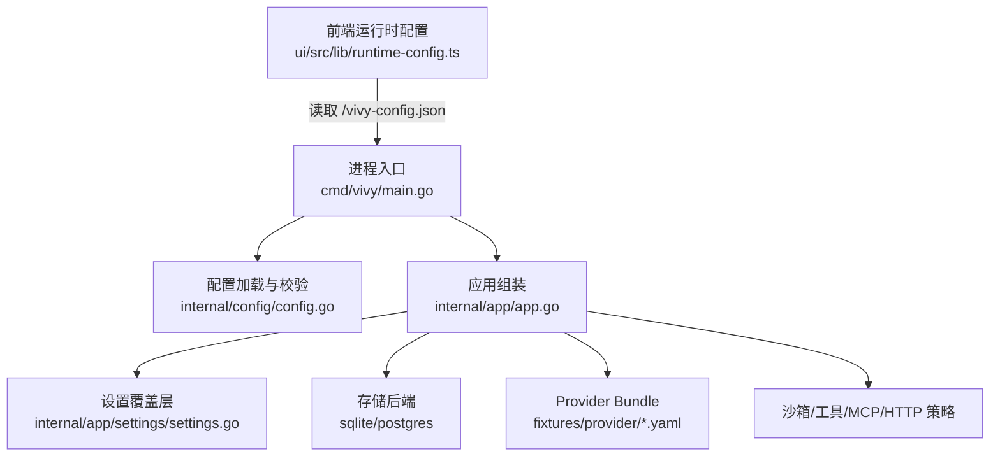
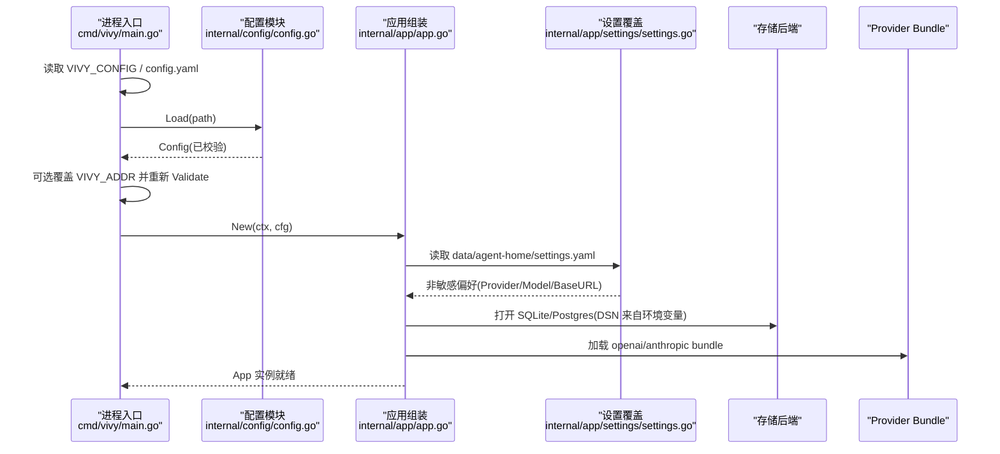
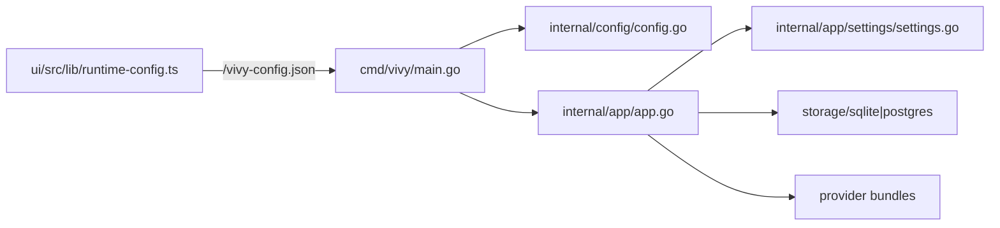

# 运行时配置

<cite>
**本文引用的文件**
- [internal/config/config.go](file://internal/config/config.go)
- [cmd/vivy/main.go](file://cmd/vivy/main.go)
- [internal/app/app.go](file://internal/app/app.go)
- [internal/app/settings/settings.go](file://internal/app/settings/settings.go)
- [config.example.yaml](file://config.example.yaml)
- [config.dev.yaml](file://config.dev.yaml)
- [docker/config.yaml](file://docker/config.yaml)
- [docker/config.postgres.yaml](file://docker/config.postgres.yaml)
- [ui/src/lib/runtime-config.ts](file://ui/src/lib/runtime-config.ts)
</cite>

## 目录
1. [简介](#简介)
2. [项目结构](#项目结构)
3. [核心组件](#核心组件)
4. [架构总览](#架构总览)
5. [详细组件分析](#详细组件分析)
6. [依赖关系分析](#依赖关系分析)
7. [性能与边界](#性能与边界)
8. [故障排查指南](#故障排查指南)
9. [结论](#结论)
10. [附录：部署与最佳实践](#附录部署与最佳实践)

## 简介
本文件聚焦 Vivy Agent 的“运行时配置”机制，覆盖配置加载、环境变量注入、默认值管理、配置验证（Schema/类型/错误）、动态更新能力、优先级规则、安全考虑、部署示例以及调试与排障方法。目标是让读者在不深入源码的情况下也能正确配置、维护并排错 Vivy 的运行环境。

## 项目结构
Vivy 的配置体系由以下部分组成：
- 启动入口：解析配置文件路径与环境变量，加载并校验配置。
- 配置模型与校验：定义结构化配置项、默认值、严格解码与字段级校验。
- 设置覆盖层：独立于生产配置的“用户偏好”文件，用于选择 provider 与默认模型。
- 运行期资源：存储后端、Provider Bundle、沙箱策略、工具白名单等。
- 前端运行时配置：浏览器侧获取控制面地址的轻量 JSON。

图表来源
- [cmd/vivy/main.go:23-92](file://cmd/vivy/main.go#L23-L92)
- [internal/config/config.go:254-336](file://internal/config/config.go#L254-L336)
- [internal/app/app.go:63-119](file://internal/app/app.go#L63-L119)
- [internal/app/settings/settings.go:65-89](file://internal/app/settings/settings.go#L65-L89)
- [ui/src/lib/runtime-config.ts:8-31](file://ui/src/lib/runtime-config.ts#L8-L31)

章节来源
- [cmd/vivy/main.go:23-92](file://cmd/vivy/main.go#L23-L92)
- [internal/config/config.go:254-336](file://internal/config/config.go#L254-L336)
- [internal/app/app.go:63-119](file://internal/app/app.go#L63-L119)
- [internal/app/settings/settings.go:65-89](file://internal/app/settings/settings.go#L65-L89)
- [ui/src/lib/runtime-config.ts:8-31](file://ui/src/lib/runtime-config.ts#L8-L31)

## 核心组件
- 配置模型与默认值：集中定义 server、storage、providers、runtime、tools、governance 等结构体及内置默认值。
- 配置加载：从环境变量或文件读取 YAML，严格解码并调用 Validate。
- 配置验证：对端口、存储后端、Provider 激活项、运行时阈值、沙箱模式、治理规则等进行强校验。
- 设置覆盖层：在数据目录下独立 settings.yaml，仅保存非敏感的用户偏好，并在启动时叠加到配置上。
- 环境变量注入：Postgres DSN、Provider API Key、BaseURL、监听地址等通过环境变量注入，不写入配置。
- 前端运行时配置：浏览器通过 /vivy-config.json 获取控制面地址，便于分离式 UI 部署。

章节来源
- [internal/config/config.go:51-217](file://internal/config/config.go#L51-L217)
- [internal/config/config.go:254-336](file://internal/config/config.go#L254-L336)
- [internal/config/config.go:338-528](file://internal/config/config.go#L338-L528)
- [internal/app/settings/settings.go:43-107](file://internal/app/settings/settings.go#L43-L107)
- [internal/app/app.go:388-425](file://internal/app/app.go#L388-L425)
- [ui/src/lib/runtime-config.ts:8-31](file://ui/src/lib/runtime-config.ts#L8-L31)

## 架构总览
下图展示了从进程启动到配置生效的关键流程，包括配置加载、环境变量注入、设置覆盖、存储与 Provider 初始化。

图表来源
- [cmd/vivy/main.go:23-92](file://cmd/vivy/main.go#L23-L92)
- [internal/config/config.go:316-336](file://internal/config/config.go#L316-L336)
- [internal/app/app.go:63-119](file://internal/app/app.go#L63-L119)
- [internal/app/app.go:388-425](file://internal/app/app.go#L388-L425)
- [internal/app/app.go:430-453](file://internal/app/app.go#L430-L453)

## 详细组件分析

### 配置加载机制
- 配置文件来源优先级：
  - 若设置环境变量 VIVY_CONFIG，则强制使用该路径；否则尝试工作目录下的 config.yaml；若均不存在，使用内置默认配置。
- 严格解码：使用已知字段白名单，未知字段直接报错，防止密钥或拼写错误进入配置。
- 默认值：当无配置文件时，使用内置 Default() 提供的默认值，并再次 Validate。
- 运维覆盖：可通过环境变量 VIVY_ADDR 覆盖监听地址，覆盖后必须重新 Validate，避免绕过回环暴露限制。

章节来源
- [cmd/vivy/main.go:76-92](file://cmd/vivy/main.go#L76-L92)
- [cmd/vivy/main.go:45-54](file://cmd/vivy/main.go#L45-L54)
- [internal/config/config.go:316-336](file://internal/config/config.go#L316-L336)
- [internal/config/config.go:254-314](file://internal/config/config.go#L254-L314)

### 环境变量注入
- Provider 密钥：通过 providers.*.env_key 指向的环境变量名，在请求时读取，绝不持久化到配置或日志。
- Postgres DSN：通过 storage.postgres.dsn_env 指定的环境变量名读取，禁止在配置中内联连接串。
- BaseURL：settings 中的 base_url 会设置到 provider 的 BaseURL 环境变量，从而被 OpenAI 兼容实现读取。
- 其他运行时键：如网络搜索、MCP 认证等，按各自模块约定从环境变量读取。

章节来源
- [internal/config/config.go:85-108](file://internal/config/config.go#L85-L108)
- [internal/app/app.go:430-453](file://internal/app/app.go#L430-L453)
- [internal/app/app.go:388-425](file://internal/app/app.go#L388-L425)

### 默认值管理
- 内置默认：Default() 提供完整的默认配置，包含服务器地址、存储路径、Provider 默认模型、运行时阈值、沙箱策略、工具白名单、治理规则等。
- 开发/容器覆盖：config.dev.yaml 与 docker/config*.yaml 以增量方式覆盖默认值，便于本地与容器化部署。
- 设置覆盖层：data/agent-home/settings.yaml 可覆盖 active provider、默认模型与 BaseURL，不影响生产配置。

章节来源
- [internal/config/config.go:254-314](file://internal/config/config.go#L254-L314)
- [config.dev.yaml:1-6](file://config.dev.yaml#L1-L6)
- [docker/config.yaml:1-19](file://docker/config.yaml#L1-L19)
- [docker/config.postgres.yaml:1-19](file://docker/config.postgres.yaml#L1-L19)
- [internal/app/settings/settings.go:65-107](file://internal/app/settings/settings.go#L65-L107)

### 配置验证（Schema、类型检查、错误报告）
- Schema 与类型：所有配置项均有明确的结构体字段与 yaml tag；Duration 通过 raw string 解析；枚举值严格限定。
- 字段级校验：
  - server.addr 必须为合法 host:port；若配置 allowed_origins，则 addr 必须为回环地址。
  - storage.backend 仅支持 sqlite/postgres；sqlite.path 必填；postgres.dsn_env 必须符合环境变量命名规范。
  - providers.active 仅支持 openai/anthropic；bundle_dir 必填；每个 provider 的 env_key 与 default_model 必填且合规。
  - runtime 多项阈值必须为正数或满足约束；workspace_root/skills_root 必填；http_allowed_hosts/http_max_response_bytes 需合理。
  - tools.enabled 至少一项；tools.approval.expiration 必须为正时长。
  - governance.profile 必须为预置 profile；hook_timeout 必须为正；rules 字段/决策值受白名单限制。
  - sandbox.default_mode 限三种模式；sandbox.workspace_root 若设置需通过路径安全检查；approval.timeout_seconds 非负。
- 错误报告：任何校验失败都会中止启动，并返回明确的错误信息，便于快速定位问题。

章节来源
- [internal/config/config.go:338-528](file://internal/config/config.go#L338-L528)
- [internal/config/config_test.go:113-140](file://internal/config/config_test.go#L113-L140)

### 动态配置更新
- 热重载：当前 Go 端未实现运行时热重载；配置变更需重启服务生效。
- 设置覆盖层：settings.yaml 的变更在下一次启动时生效，不会热插拔到运行中的引擎。
- 前端运行时配置：浏览器侧通过 /vivy-config.json 获取控制面地址，可在部署层动态下发，无需重启后端。

章节来源
- [internal/app/app.go:63-71](file://internal/app/app.go#L63-L71)
- [internal/app/settings/settings.go:65-107](file://internal/app/settings/settings.go#L65-L107)
- [ui/src/lib/runtime-config.ts:8-31](file://ui/src/lib/runtime-config.ts#L8-L31)

### 配置优先级
- 配置文件优先级：
  - VIVY_CONFIG 指定路径 > 工作目录 config.yaml > 内置默认值。
- 环境变量优先级：
  - VIVY_ADDR 可覆盖 server.addr（覆盖后重新 Validate）。
  - Provider 密钥、Postgres DSN、BaseURL 等通过环境变量注入，优先级高于配置文件中引用。
- 设置覆盖层优先级：
  - settings.yaml 在非敏感维度（provider、default_model、base_url）覆盖配置，但仅在下次启动生效。

章节来源
- [cmd/vivy/main.go:76-92](file://cmd/vivy/main.go#L76-L92)
- [cmd/vivy/main.go:45-54](file://cmd/vivy/main.go#L45-L54)
- [internal/app/app.go:388-425](file://internal/app/app.go#L388-L425)

### 安全考虑
- 密钥隔离：配置中只保留 env_key 引用，不在配置、日志、快照、事件负载中持久化密钥。
- 严格解码：未知字段拒绝，防止密钥泄漏或误配。
- 回环暴露限制：若允许跨域 origins，则监听地址必须为回环地址，避免容器外网暴露风险。
- 子进程环境清理：测试表明子进程环境会剥离敏感变量，避免泄露。

章节来源
- [internal/config/config.go:1-13](file://internal/config/config.go#L1-L13)
- [internal/config/config.go:316-336](file://internal/config/config.go#L316-L336)
- [internal/config/config.go:586-641](file://internal/config/config.go#L586-L641)

## 依赖关系分析
- 启动入口依赖配置模块与应用组装。
- 应用组装依赖设置覆盖层、存储后端、Provider Bundle、运行时策略。
- 配置模块依赖 YAML 解码与严格的字段校验。
- 前端运行时配置通过 HTTP 获取控制面地址，与后端解耦。

图表来源
- [cmd/vivy/main.go:23-92](file://cmd/vivy/main.go#L23-L92)
- [internal/config/config.go:316-336](file://internal/config/config.go#L316-L336)
- [internal/app/app.go:63-119](file://internal/app/app.go#L63-L119)
- [ui/src/lib/runtime-config.ts:8-31](file://ui/src/lib/runtime-config.ts#L8-L31)

章节来源
- [cmd/vivy/main.go:23-92](file://cmd/vivy/main.go#L23-L92)
- [internal/config/config.go:316-336](file://internal/config/config.go#L316-L336)
- [internal/app/app.go:63-119](file://internal/app/app.go#L63-L119)
- [ui/src/lib/runtime-config.ts:8-31](file://ui/src/lib/runtime-config.ts#L8-L31)

## 性能与边界
- 流缓冲与事件负载上限：runtime.stream_buffer 与 max_event_payload_bytes 限制内存占用，防止 OOM。
- 上下文与历史消息上限：max_context_bytes 与 max_history_messages 控制模型输入大小。
- 工具调用与重试上限：max_tool_turns、max_run_tool_calls、max_run_retries 限制执行预算。
- HTTP 响应上限：http_max_response_bytes 限制外部响应进入模型上下文的大小。
- 沙箱网络策略：allowed_domains 与 deny_private_ips 控制出站访问范围。

章节来源
- [internal/config/config.go:110-153](file://internal/config/config.go#L110-L153)
- [internal/config/config.go:384-444](file://internal/config/config.go#L384-L444)

## 故障排查指南
- 启动失败常见原因：
  - 配置文件缺失或路径错误：确认 VIVY_CONFIG 或 config.yaml 存在且可读。
  - 未知字段或非法值：根据错误信息修正字段名或取值范围。
  - 存储后端配置错误：sqlite.path 为空或 postgres.dsn_env 不是合法环境变量名。
  - Provider 配置错误：active 不支持、bundle_dir 为空、env_key/default_model 缺失。
  - 运行时阈值异常：正数约束违反或 mock_scenario 未启用 mock。
  - 治理规则非法：profile、field、decision 不在白名单。
  - 沙箱模式非法：default_mode 不在允许集合。
- 环境变量问题：
  - 缺少 Provider 密钥或 Postgres DSN：检查对应环境变量是否设置。
  - BaseURL 未生效：确认 settings.base_url 是否正确设置到环境变量。
- 前端配置问题：
  - 无法获取控制面地址：检查 /vivy-config.json 是否存在且返回有效 JSON。

章节来源
- [internal/config/config.go:338-528](file://internal/config/config.go#L338-L528)
- [internal/app/app.go:430-453](file://internal/app/app.go#L430-L453)
- [ui/src/lib/runtime-config.ts:8-31](file://ui/src/lib/runtime-config.ts#L8-L31)

## 结论
Vivy 的运行时配置采用“强默认 + 严格校验 + 环境变量注入 + 设置覆盖层”的组合策略，确保在生产环境中安全、可控、可维护。配置加载遵循清晰的优先级，验证覆盖全面，错误提示明确。动态更新方面，Go 端未实现热重载，但通过 settings.yaml 与前端运行时配置可实现灵活部署与调整。建议在生产中严格遵循密钥隔离、回环暴露限制与阈值约束，结合容器化与 Compose 进行标准化部署。

## 附录：部署与最佳实践
- 推荐配置结构：
  - 使用 config.example.yaml 作为模板，复制为 config.yaml 并仅覆盖必要字段。
  - 将密钥放入环境变量，不要写入配置文件。
  - 使用 docker/config.yaml 或 docker/config.postgres.yaml 作为容器化覆盖。
- 环境变量清单：
  - VIVY_CONFIG：指定配置文件路径（可选）。
  - VIVY_ADDR：覆盖监听地址（可选）。
  - OPENAI_API_KEY / ANTHROPIC_API_KEY：Provider 密钥。
  - VIVY_POSTGRES_DSN：Postgres 连接串（当 backend=postgres）。
  - VIVY_API_BASE：OpenAI 兼容 BaseURL（可选）。
- 部署示例：
  - 本地开发：使用 config.dev.yaml 开启 mock，避免真实 API 调用。
  - 容器化：使用 docker/config.yaml 或 docker/config.postgres.yaml，并将数据目录挂载到持久卷。
- 最佳实践：
  - 始终启用严格校验，避免未知字段与非法值。
  - 保持 server.addr 为回环地址，除非显式允许同源跨域。
  - 合理设置运行时阈值，防止资源滥用。
  - 定期审查 settings.yaml，确保非敏感偏好与生产配置分离。

章节来源
- [config.example.yaml:1-136](file://config.example.yaml#L1-L136)
- [config.dev.yaml:1-6](file://config.dev.yaml#L1-L6)
- [docker/config.yaml:1-19](file://docker/config.yaml#L1-L19)
- [docker/config.postgres.yaml:1-19](file://docker/config.postgres.yaml#L1-L19)
- [internal/config/config.go:338-528](file://internal/config/config.go#L338-L528)