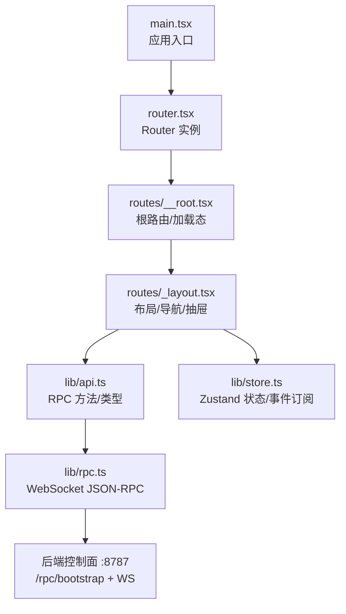
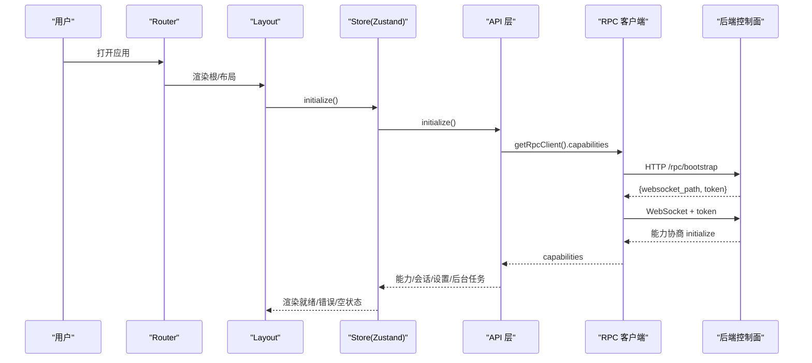
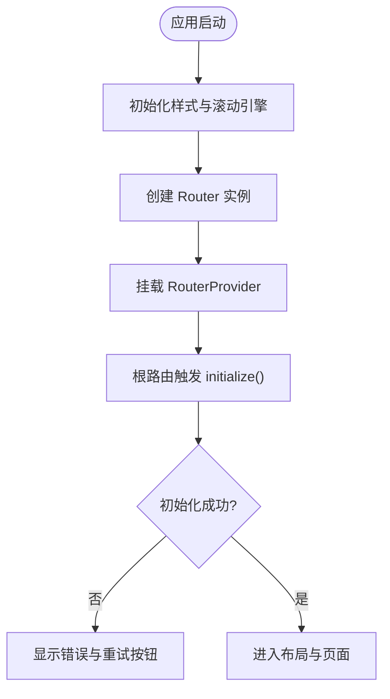
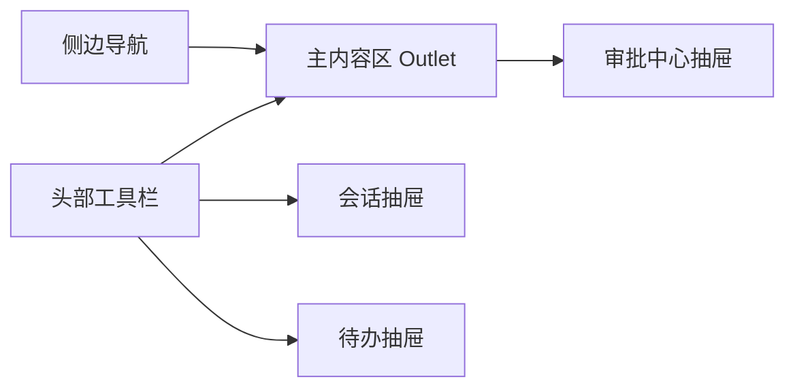
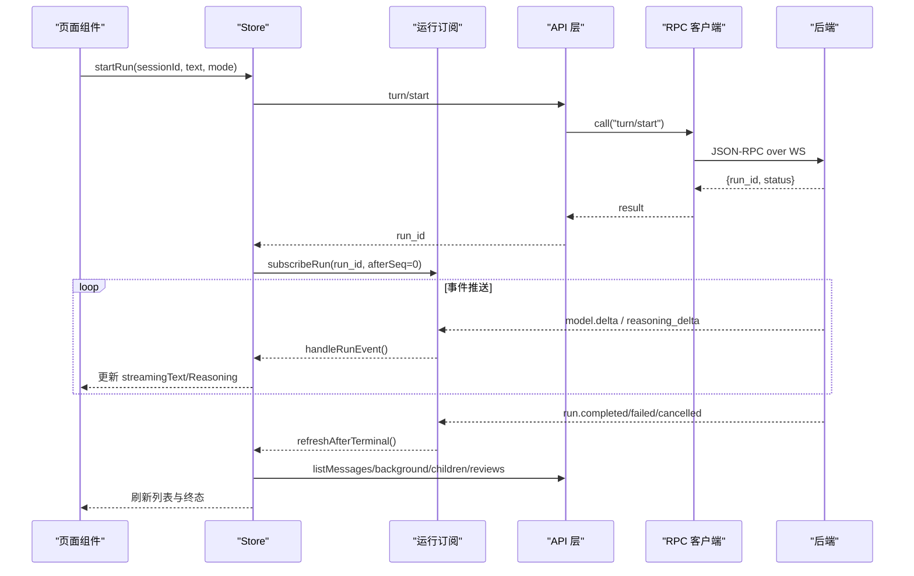
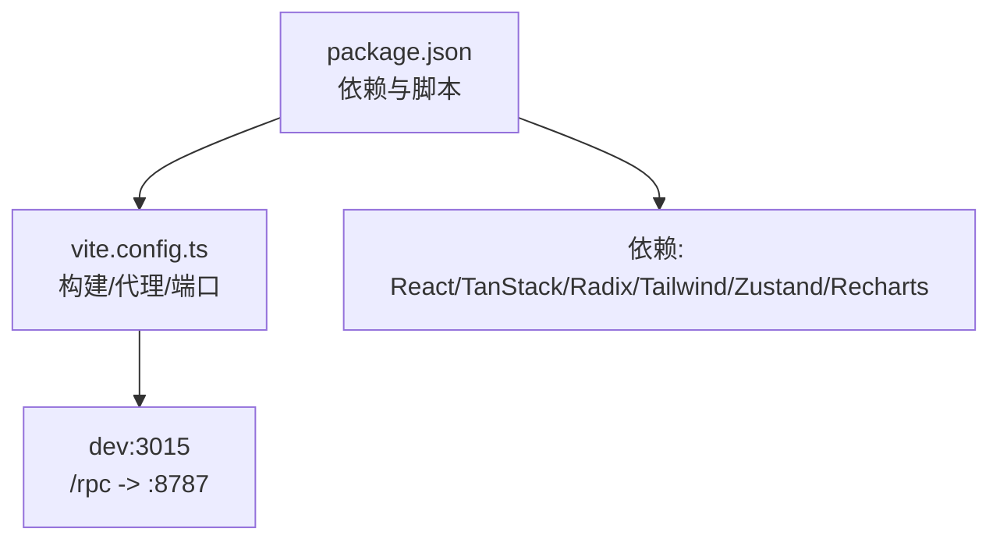

# 前端界面

<cite>
**本文引用的文件**
- [ui/src/main.tsx](file://ui/src/main.tsx)
- [ui/src/router.tsx](file://ui/src/router.tsx)
- [ui/src/routes/__root.tsx](file://ui/src/routes/__root.tsx)
- [ui/src/routes/_layout.tsx](file://ui/src/routes/_layout.tsx)
- [ui/package.json](file://ui/package.json)
- [ui/vite.config.ts](file://ui/vite.config.ts)
- [ui/src/lib/api.ts](file://ui/src/lib/api.ts)
- [ui/src/lib/rpc.ts](file://ui/src/lib/rpc.ts)
- [ui/src/lib/store.ts](file://ui/src/lib/store.ts)
</cite>

## 目录
1. [简介](#简介)
2. [项目结构](#项目结构)
3. [核心组件](#核心组件)
4. [架构总览](#架构总览)
5. [详细组件分析](#详细组件分析)
6. [依赖关系分析](#依赖关系分析)
7. [性能考虑](#性能考虑)
8. [故障排查指南](#故障排查指南)
9. [结论](#结论)
10. [附录](#附录)

## 简介
本仓库的前端为内嵌的 React + Vite UI，通过 TanStack Router 组织页面与路由，使用 Zustand 管理全局状态，并通过 JSON-RPC over WebSocket 与后端控制面通信。UI 提供会话聊天、审批中心、计划/待办面板、设置等能力，并支持响应式布局与可访问性基础。构建产物由 Vite 输出到 dist/assets，开发时通过 Vite 代理将 /rpc 转发至后端 :8787。

## 项目结构
- 入口与路由
  - 应用入口：初始化样式与滚动渐入引擎，挂载 RouterProvider。
  - 路由实例：创建 QueryClient，注册 TanStack Router，启用滚动恢复与预取策略。
  - 根路由：加载运行时配置与能力，处理未找到与错误跳转。
  - 布局路由：侧边栏、头部、移动端抽屉、审批中心抽屉、主内容区。
- 数据与通信
  - API 层：声明 RPC 方法集合与类型，封装 request 统一错误映射。
  - RPC 客户端：JSON-RPC over WebSocket，连接引导、能力协商、请求/通知分发、断线重连语义（由上层订阅机制驱动）。
  - 状态管理：Zustand store 聚合会话、消息、运行事件、后台任务、子任务、审批、设置、生命周期等；订阅运行事件流更新 UI。
- 构建与开发
  - Vite 配置：固定端口 3015，严格端口模式，HMR 默认关闭，/rpc 代理到后端，产物目录与命名策略。
  - 依赖：React、TanStack Router/Query、Radix UI、Tailwind、Recharts、Zustand、Playwright/Vitest 等。

图表来源
- [ui/src/main.tsx:1-19](file://ui/src/main.tsx#L1-L19)
- [ui/src/router.tsx:1-25](file://ui/src/router.tsx#L1-L25)
- [ui/src/routes/__root.tsx:1-19](file://ui/src/routes/__root.tsx#L1-L19)
- [ui/src/routes/_layout.tsx:1-176](file://ui/src/routes/_layout.tsx#L1-L176)
- [ui/src/lib/api.ts:1-91](file://ui/src/lib/api.ts#L1-L91)
- [ui/src/lib/rpc.ts:1-155](file://ui/src/lib/rpc.ts#L1-L155)

章节来源
- [ui/src/main.tsx:1-19](file://ui/src/main.tsx#L1-L19)
- [ui/src/router.tsx:1-25](file://ui/src/router.tsx#L1-L25)
- [ui/src/routes/__root.tsx:1-19](file://ui/src/routes/__root.tsx#L1-L19)
- [ui/src/routes/_layout.tsx:1-176](file://ui/src/routes/_layout.tsx#L1-L176)
- [ui/package.json:1-82](file://ui/package.json#L1-L82)
- [ui/vite.config.ts:1-65](file://ui/vite.config.ts#L1-L65)

## 核心组件
- 根组件与加载态
  - 负责初始化 store、渲染加载中占位或错误重试入口，提供 QueryClientProvider。
- 布局组件
  - 顶部工具栏：折叠导航、品牌标识、在线状态、模型/面具切换器、会话抽屉、待办抽屉。
  - 主内容区：Outlet 承载具体页面。
  - 右侧抽屉：审批中心，支持忙态锁定关闭。
- 会话与聊天
  - 会话列表与新建/重命名/删除在侧边栏与抽屉中完成。
  - 消息列表与输入框由业务页面组件组合（通过 store 提供的消息与运行事件驱动）。
- 设置面板
  - 通过 store 的 settings 字段与 API 获取/更新 provider、default_model、base_url 等。
- 监控仪表板
  - 运行事件流、子任务树、后台任务列表、审批队列等视图由 store 与 API 驱动，结合 Recharts 展示指标（图表库已引入）。

章节来源
- [ui/src/routes/__root.tsx:1-19](file://ui/src/routes/__root.tsx#L1-L19)
- [ui/src/routes/_layout.tsx:1-176](file://ui/src/routes/_layout.tsx#L1-L176)
- [ui/src/lib/store.ts:1-315](file://ui/src/lib/store.ts#L1-L315)
- [ui/src/lib/api.ts:1-91](file://ui/src/lib/api.ts#L1-L91)

## 架构总览
前端采用“路由 + 布局 + 状态 + 通信”的分层设计：
- 路由层：TanStack Router 管理页面与上下文（QueryClient）。
- 布局层：统一的导航、头部、抽屉与主区域。
- 状态层：Zustand store 集中管理会话、消息、运行事件、审批、设置、生命周期等。
- 通信层：API 层暴露方法，底层通过 RPC 客户端以 JSON-RPC over WebSocket 与后端交互。

图表来源
- [ui/src/router.tsx:1-25](file://ui/src/router.tsx#L1-L25)
- [ui/src/routes/__root.tsx:1-19](file://ui/src/routes/__root.tsx#L1-L19)
- [ui/src/routes/_layout.tsx:1-176](file://ui/src/routes/_layout.tsx#L1-L176)
- [ui/src/lib/api.ts:1-91](file://ui/src/lib/api.ts#L1-L91)
- [ui/src/lib/rpc.ts:1-155](file://ui/src/lib/rpc.ts#L1-L155)

## 详细组件分析

### 启动与路由
- 入口 main.tsx 初始化样式与滚动渐入引擎，创建 Router 并挂载。
- router.tsx 创建 QueryClient，注入 Router 上下文，开启滚动恢复与预取策略。
- __root.tsx 在根路由触发 store.initialize，处理未找到与错误跳转，提供加载态与错误重试。

图表来源
- [ui/src/main.tsx:1-19](file://ui/src/main.tsx#L1-L19)
- [ui/src/router.tsx:1-25](file://ui/src/router.tsx#L1-L25)
- [ui/src/routes/__root.tsx:1-19](file://ui/src/routes/__root.tsx#L1-L19)

章节来源
- [ui/src/main.tsx:1-19](file://ui/src/main.tsx#L1-L19)
- [ui/src/router.tsx:1-25](file://ui/src/router.tsx#L1-L25)
- [ui/src/routes/__root.tsx:1-19](file://ui/src/routes/__root.tsx#L1-L19)

### 布局与导航
- 桌面端左侧可折叠导航，移动端通过 Sheet 抽屉呈现。
- 顶部包含品牌、在线状态、模型/面具切换、会话抽屉、待办抽屉。
- 右侧常驻审批中心抽屉，忙态下禁止关闭。

图表来源
- [ui/src/routes/_layout.tsx:1-176](file://ui/src/routes/_layout.tsx#L1-L176)

章节来源
- [ui/src/routes/_layout.tsx:1-176](file://ui/src/routes/_layout.tsx#L1-L176)

### 状态管理与运行事件流
- Store 维护 sessions、messages、currentRun、runEvents、backgroundRuns、children、reviews、settings、lifecycle 等。
- 选择会话后加载消息与最近运行，若运行活跃则建立运行事件订阅，按 seq 增量接收 model.delta/reasoning_delta 等事件，并在终态事件后刷新消息与相关资源。
- 运行取消/中断、子任务启停、审批响应等均通过 store 方法调用 API 并更新状态。

图表来源
- [ui/src/lib/store.ts:105-142](file://ui/src/lib/store.ts#L105-L142)
- [ui/src/lib/store.ts:230-250](file://ui/src/lib/store.ts#L230-L250)
- [ui/src/lib/api.ts:1-91](file://ui/src/lib/api.ts#L1-L91)
- [ui/src/lib/rpc.ts:1-155](file://ui/src/lib/rpc.ts#L1-L155)

章节来源
- [ui/src/lib/store.ts:1-315](file://ui/src/lib/store.ts#L1-L315)
- [ui/src/lib/api.ts:1-91](file://ui/src/lib/api.ts#L1-L91)
- [ui/src/lib/rpc.ts:1-155](file://ui/src/lib/rpc.ts#L1-L155)

### 设置面板
- 通过 store 的 loadSettings/saveSettings 调用 settings/get 与 settings/update，更新 provider、default_model、base_url 等。
- 状态包括 loading/ready/error/processing，便于 UI 反馈。

章节来源
- [ui/src/lib/store.ts:298-299](file://ui/src/lib/store.ts#L298-L299)
- [ui/src/lib/api.ts:89-90](file://ui/src/lib/api.ts#L89-L90)

### 监控仪表板（运行/子任务/后台任务）
- 运行事件流：store 维护 runEvents 与 streaming 文本，终端事件后刷新消息与子任务。
- 子任务：listChildren/startChild/waitChild/cancelChild，支持树形展示与选中详情。
- 后台任务：recover/list/attach，支持附加到当前会话并打开对应运行。

章节来源
- [ui/src/lib/store.ts:105-142](file://ui/src/lib/store.ts#L105-L142)
- [ui/src/lib/store.ts:256-280](file://ui/src/lib/store.ts#L256-L280)
- [ui/src/lib/api.ts:64-71](file://ui/src/lib/api.ts#L64-L71)

### 审批中心
- 列表与响应：loadReviews/respondReview，支持 approve/deny/answer/cancel。
- 抽屉在忙态下阻止关闭，避免并发操作导致状态不一致。

章节来源
- [ui/src/routes/_layout.tsx:157-172](file://ui/src/routes/_layout.tsx#L157-L172)
- [ui/src/lib/store.ts:281-296](file://ui/src/lib/store.ts#L281-L296)
- [ui/src/lib/api.ts:72-78](file://ui/src/lib/api.ts#L72-L78)

## 依赖关系分析
- 构建与脚本
  - dev 监听 3015 端口，strictPort 确保唯一端口；HMR 默认关闭以避免沙箱预览问题；/rpc 代理到后端 :8787。
  - 构建输出到 dist/assets，带哈希文件名。
- 运行时依赖
  - React、TanStack Router/Query、Radix UI、Tailwind、Recharts、Zustand、Playwright/Vitest 等。

图表来源
- [ui/package.json:1-82](file://ui/package.json#L1-L82)
- [ui/vite.config.ts:1-65](file://ui/vite.config.ts#L1-L65)

章节来源
- [ui/package.json:1-82](file://ui/package.json#L1-L82)
- [ui/vite.config.ts:1-65](file://ui/vite.config.ts#L1-L65)

## 性能考虑
- 网络与缓存
  - bootstrap 请求禁用缓存，避免旧连接信息导致连接失败。
  - 运行事件按 seq 增量接收，避免重复处理；终端事件后批量刷新消息与相关资源。
- 渲染与状态
  - 使用 Zustand 细粒度选择器减少不必要重渲染。
  - 流式文本拼接在 store 层进行，降低组件计算压力。
- 构建优化
  - 产物带哈希文件名，利于浏览器缓存；assetsDir 归一化。
  - 开发环境 HMR 默认关闭，减少沙箱预览下的整页重载风险。

[本节为通用指导，不直接分析具体文件]

## 故障排查指南
- 无法连接控制面
  - 现象：根路由显示“无法连接 Vivy”，并提供重试按钮。
  - 可能原因：/rpc/bootstrap 返回非 JSON、网络不可达、代理配置不正确。
  - 定位：检查 vite.config.ts 的 /rpc 代理目标与端口；确认后端 :8787 已启动。
- WebSocket 断开
  - 现象：连接状态变为 error/reconnecting，运行事件停止。
  - 行为：RPC 客户端在 onclose 时拒绝所有 pending 请求，并触发 onClose 监听；store 在订阅层根据消息提示重连。
- 运行终止后刷新失败
  - 现象：运行已结束但消息刷新报错。
  - 行为：store 在 refreshAfterTerminal 捕获异常并写入 runError，不影响其他资源刷新。
- 会话/设置/审批操作失败
  - 现象：对应 Phase 进入 error，显示错误信息。
  - 行为：API 层将 RPC 错误码映射为 HTTP 风格状态码与 code，抛出 ApiError；store 捕获并记录错误。

章节来源
- [ui/src/routes/__root.tsx:11-18](file://ui/src/routes/__root.tsx#L11-L18)
- [ui/src/lib/rpc.ts:44-53](file://ui/src/lib/rpc.ts#L44-L53)
- [ui/src/lib/rpc.ts:55-99](file://ui/src/lib/rpc.ts#L55-L99)
- [ui/src/lib/store.ts:105-117](file://ui/src/lib/store.ts#L105-L117)
- [ui/src/lib/api.ts:38-49](file://ui/src/lib/api.ts#L38-L49)

## 结论
该前端以清晰的层次划分实现了会话聊天、审批中心、设置与监控能力，并通过 JSON-RPC over WebSocket 与后端高效交互。Zustand store 统一管理状态与事件流，配合 TanStack Router 与 Radix UI 提供了良好的用户体验与可访问性基础。构建与开发流程稳定，适合在单进程内嵌 UI 场景下快速迭代。

## 附录

### 与后端 API 集成要点
- 连接引导：HTTP /rpc/bootstrap 获取 websocket_path 与 token，随后建立 WebSocket 并执行 initialize 能力协商。
- 方法清单：session、run、approval/question/review、child、generations/evals/promotions、settings 等均在 API 层集中定义。
- 错误映射：RPC 错误码映射为 404/409/400/500 等，并附带 code 便于前端分类处理。

章节来源
- [ui/src/lib/rpc.ts:55-99](file://ui/src/lib/rpc.ts#L55-L99)
- [ui/src/lib/api.ts:3-13](file://ui/src/lib/api.ts#L3-L13)
- [ui/src/lib/api.ts:38-49](file://ui/src/lib/api.ts#L38-L49)

### UI 定制指南
- 主题与样式
  - 基于 Tailwind v4 与 design tokens，可通过 styles.css 与主题变量调整配色与字体。
  - 组件基于 Radix UI，可通过 className 与 props 覆盖样式。
- 国际化
  - 当前代码以中文文案为主，如需多语言，可在组件层抽取文案键值并替换。
- 响应式与无障碍
  - 使用 useIsMobile 切换布局；关键交互提供 aria-label/title，提升可访问性。

章节来源
- [ui/src/routes/_layout.tsx:19-45](file://ui/src/routes/_layout.tsx#L19-L45)
- [ui/src/routes/_layout.tsx:80-110](file://ui/src/routes/_layout.tsx#L80-L110)

### 开发与调试
- 本地开发
  - 启动后端 :8787，再运行前端 dev 服务 :3015；/rpc 自动代理至后端。
- 调试技巧
  - 观察 store 的连接状态与错误字段；在浏览器控制台查看 WebSocket 消息。
  - 利用 Vitest 对 lib 层进行单元测试；使用 Playwright 进行端到端测试。

章节来源
- [ui/vite.config.ts:37-50](file://ui/vite.config.ts#L37-L50)
- [ui/package.json:6-12](file://ui/package.json#L6-L12)

### 最佳实践与示例
- 发起一次对话
  - 在聊天输入框调用 store.startRun(sessionId, text, mode)，等待运行事件流更新消息与流式文本。
- 查看并响应审批
  - 打开审批中心抽屉，调用 respondReview 提交 approve/deny/answer/cancel。
- 更新设置
  - 调用 saveSettings({ provider, default_model, base_url })，成功后重新读取或刷新相关组件。

章节来源
- [ui/src/lib/store.ts:240-250](file://ui/src/lib/store.ts#L240-L250)
- [ui/src/lib/store.ts:281-296](file://ui/src/lib/store.ts#L281-L296)
- [ui/src/lib/store.ts:298-299](file://ui/src/lib/store.ts#L298-L299)