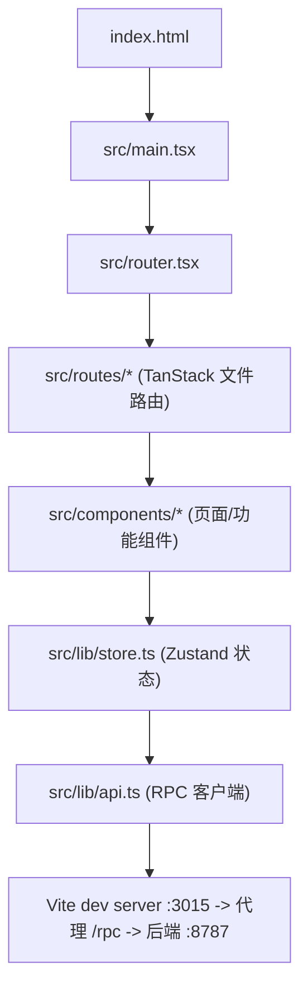
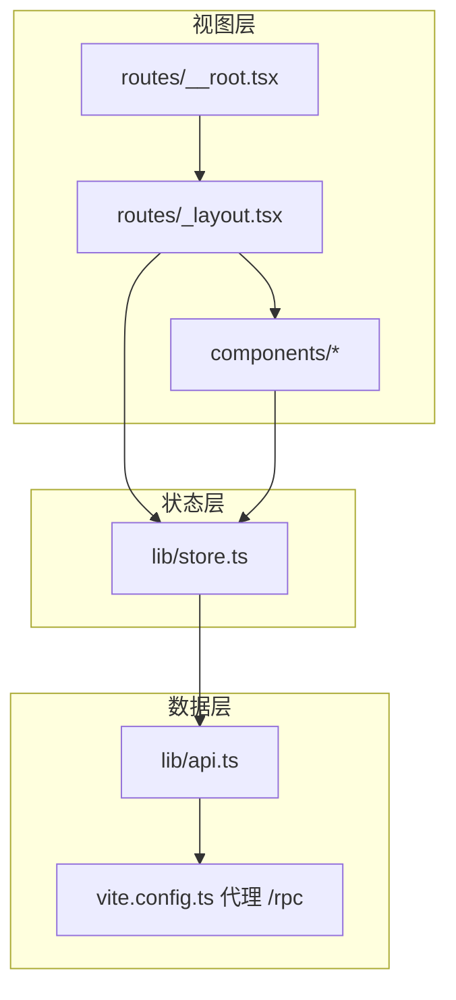
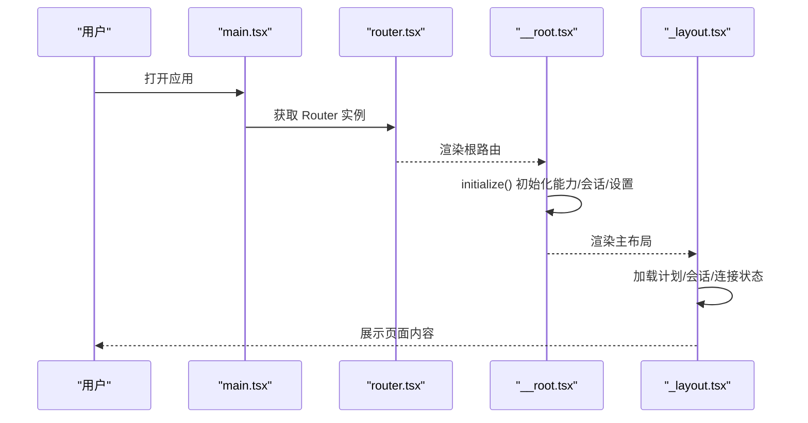
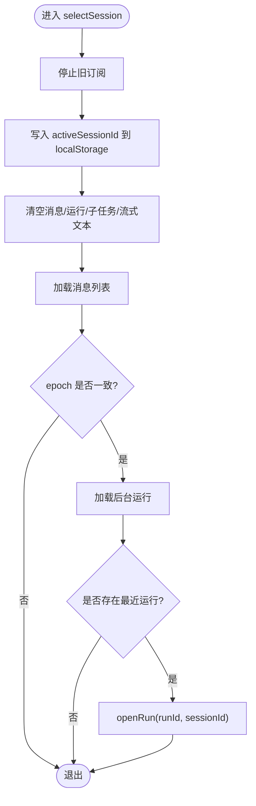
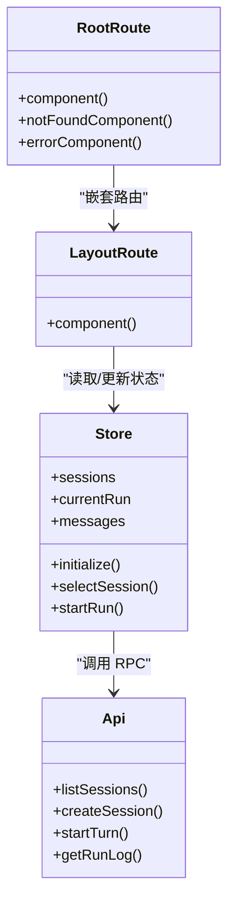
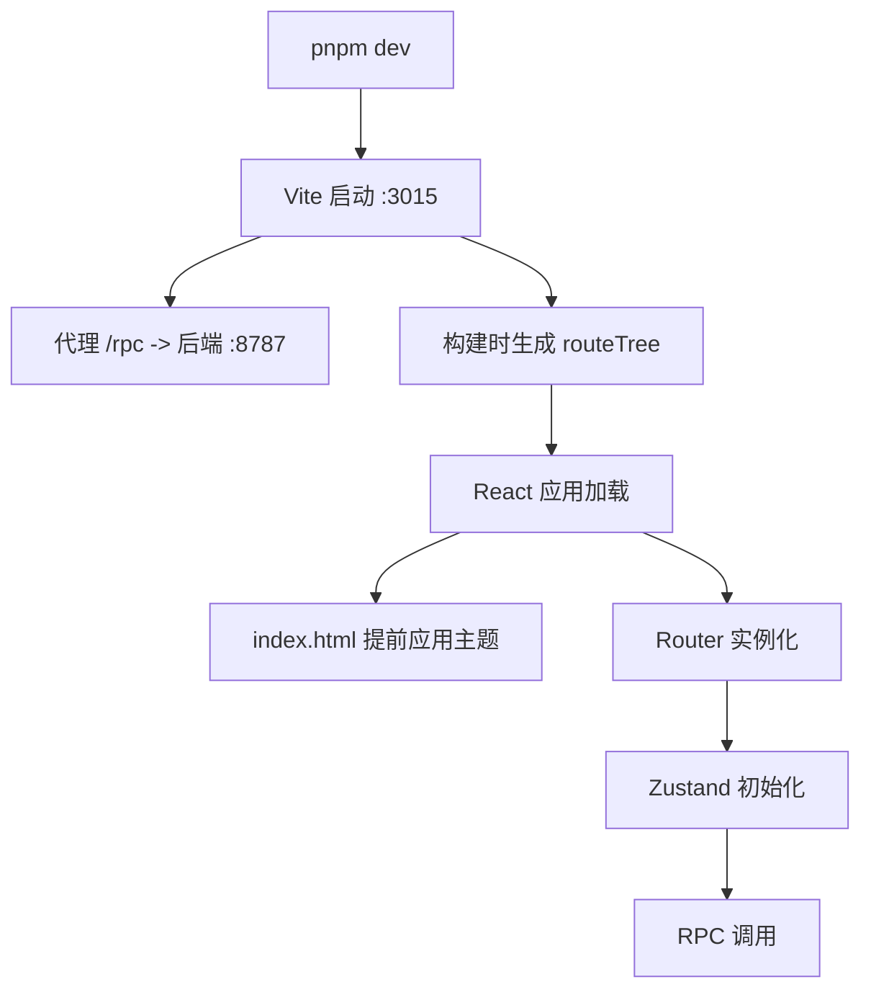
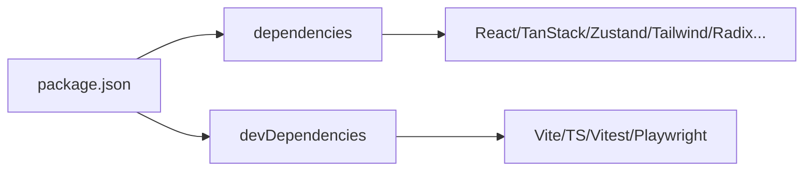

# 应用架构

<cite>
**本文引用的文件**
- [ui/package.json](file://ui/package.json)
- [ui/vite.config.ts](file://ui/vite.config.ts)
- [ui/tsconfig.json](file://ui/tsconfig.json)
- [ui/index.html](file://ui/index.html)
- [ui/src/main.tsx](file://ui/src/main.tsx)
- [ui/src/router.tsx](file://ui/src/router.tsx)
- [ui/src/routes/__root.tsx](file://ui/src/routes/__root.tsx)
- [ui/src/routes/_layout.tsx](file://ui/src/routes/_layout.tsx)
- [ui/src/lib/store.ts](file://ui/src/lib/store.ts)
- [ui/src/lib/api.ts](file://ui/src/lib/api.ts)
- [ui/src/styles.css](file://ui/src/styles.css)
</cite>

## 目录
1. [简介](#简介)
2. [项目结构](#项目结构)
3. [核心组件](#核心组件)
4. [架构总览](#架构总览)
5. [详细组件分析](#详细组件分析)
6. [依赖关系分析](#依赖关系分析)
7. [性能考量](#性能考量)
8. [故障排查指南](#故障排查指南)
9. [结论](#结论)
10. [附录](#附录)

## 简介
本仓库前端采用 React + Vite 技术栈，基于 TanStack Router 进行文件路由组织，使用 Zustand 管理全局状态，通过 RPC 与后端服务通信。构建产物由 Vite 输出到 dist/assets，开发服务器固定监听 3015 端口并严格占用端口，同时代理 /rpc 至后端 8787 端口。主题系统通过 CSS 变量与 data-theme 属性实现多套皮肤，并在页面加载前避免闪烁。

## 项目结构
前端位于 ui 目录，入口为 index.html，React 应用从 src/main.tsx 启动，路由由 src/router.tsx 创建并使用 TanStack Router 插件自动生成的 routeTree。业务状态集中在 src/lib/store.ts（Zustand），API 调用封装在 src/lib/api.ts，样式与主题定义在 src/styles.css。

图表来源
- [ui/index.html:1-56](file://ui/index.html#L1-L56)
- [ui/src/main.tsx:1-19](file://ui/src/main.tsx#L1-L19)
- [ui/src/router.tsx:1-25](file://ui/src/router.tsx#L1-L25)
- [ui/vite.config.ts:1-65](file://ui/vite.config.ts#L1-L65)

章节来源
- [ui/package.json:1-82](file://ui/package.json#L1-L82)
- [ui/vite.config.ts:1-65](file://ui/vite.config.ts#L1-L65)
- [ui/tsconfig.json:1-35](file://ui/tsconfig.json#L1-L35)
- [ui/index.html:1-56](file://ui/index.html#L1-L56)
- [ui/src/main.tsx:1-19](file://ui/src/main.tsx#L1-L19)
- [ui/src/router.tsx:1-25](file://ui/src/router.tsx#L1-L25)

## 核心组件
- 应用入口与初始化：main.tsx 渲染根节点并挂载 RouterProvider；__root.tsx 提供 QueryClientProvider、初始化流程与错误兜底。
- 路由与布局：router.tsx 创建 Router 实例并注入 QueryClient；_layout.tsx 作为主布局，包含侧边栏、头部、会话抽屉、审批中心等。
- 状态管理：store.ts 使用 Zustand 维护会话、运行、子任务、审批、设置、生命周期等全局状态，并通过 run-subscription 订阅后端事件流。
- API 层：api.ts 统一封装所有 RPC 方法，处理错误码映射与异常包装。

章节来源
- [ui/src/main.tsx:1-19](file://ui/src/main.tsx#L1-L19)
- [ui/src/routes/__root.tsx:1-19](file://ui/src/routes/__root.tsx#L1-L19)
- [ui/src/routes/_layout.tsx:1-176](file://ui/src/routes/_layout.tsx#L1-L176)
- [ui/src/lib/store.ts:1-315](file://ui/src/lib/store.ts#L1-L315)
- [ui/src/lib/api.ts:1-91](file://ui/src/lib/api.ts#L1-L91)

## 架构总览
前端以“视图层（routes/components）—状态层（store）—数据层（api/rpc）”分层组织。TanStack Router 负责页面导航与上下文注入；Zustand 集中管理跨组件共享状态；RPC 客户端通过 Vite 代理访问后端。主题系统通过 CSS 变量与 data-theme 切换，避免首屏闪烁。

图表来源
- [ui/src/routes/__root.tsx:1-19](file://ui/src/routes/__root.tsx#L1-L19)
- [ui/src/routes/_layout.tsx:1-176](file://ui/src/routes/_layout.tsx#L1-L176)
- [ui/src/lib/store.ts:1-315](file://ui/src/lib/store.ts#L1-L315)
- [ui/src/lib/api.ts:1-91](file://ui/src/lib/api.ts#L1-L91)
- [ui/vite.config.ts:1-65](file://ui/vite.config.ts#L1-L65)

## 详细组件分析

### 路由系统与页面组织
- 根路由 __root.tsx：提供 QueryClientProvider，执行初始化流程，处理未找到与错误跳转。
- 主布局 _layout.tsx：组合侧边栏、头部、会话抽屉、待办面板、审批中心，响应式控制移动端导航。
- 路由实例 router.tsx：创建 Router，注入 QueryClient，启用滚动恢复与预取策略。

图表来源
- [ui/src/main.tsx:1-19](file://ui/src/main.tsx#L1-L19)
- [ui/src/router.tsx:1-25](file://ui/src/router.tsx#L1-L25)
- [ui/src/routes/__root.tsx:1-19](file://ui/src/routes/__root.tsx#L1-L19)
- [ui/src/routes/_layout.tsx:1-176](file://ui/src/routes/_layout.tsx#L1-L176)

章节来源
- [ui/src/router.tsx:1-25](file://ui/src/router.tsx#L1-L25)
- [ui/src/routes/__root.tsx:1-19](file://ui/src/routes/__root.tsx#L1-L19)
- [ui/src/routes/_layout.tsx:1-176](file://ui/src/routes/_layout.tsx#L1-L176)

### 状态管理与数据流设计
- 状态模型：store.ts 定义了运行时状态（会话、消息、运行、子任务、审批、设置、生命周期等）及对应的方法。
- 事件驱动：通过 subscribeRun 订阅后端事件流，按 seq 去重与排序，增量更新 streamingText/reasoning，并在终态后刷新消息与相关资源。
- 持久化：活跃会话 ID 持久化到 localStorage，确保刷新后恢复上次会话；演示数据使用带前缀的 key 做本地存储。
- 并发与幂等：selectSession/openRun 使用 epoch 防止竞态；initialize 保证只执行一次。

图表来源
- [ui/src/lib/store.ts:217-239](file://ui/src/lib/store.ts#L217-L239)

章节来源
- [ui/src/lib/store.ts:1-315](file://ui/src/lib/store.ts#L1-L315)

### 组件分层与 UI 模式
- 页面级组件：routes 下的文件路由组件，负责页面装配与数据准备。
- 功能组件：components 下按功能划分（chat、approvals、lifecycle、masks、notebook 等）。
- 基础 UI：components/ui 提供原子化 UI 组件（按钮、对话框、抽屉等）。
- 布局组件：layout/MasterDetail 等复用布局模式。

图表来源
- [ui/src/routes/__root.tsx:1-19](file://ui/src/routes/__root.tsx#L1-L19)
- [ui/src/routes/_layout.tsx:1-176](file://ui/src/routes/_layout.tsx#L1-L176)
- [ui/src/lib/store.ts:1-315](file://ui/src/lib/store.ts#L1-L315)
- [ui/src/lib/api.ts:1-91](file://ui/src/lib/api.ts#L1-L91)

章节来源
- [ui/src/routes/_layout.tsx:1-176](file://ui/src/routes/_layout.tsx#L1-L176)
- [ui/src/lib/store.ts:1-315](file://ui/src/lib/store.ts#L1-L315)
- [ui/src/lib/api.ts:1-91](file://ui/src/lib/api.ts#L1-L91)

### 构建配置与开发环境
- Vite 插件：Tailwind v4、TanStack Router 插件、React 插件（可选 source-location 插件）、路径别名解析。
- 开发服务器：host 0.0.0.0，port 3015，strictPort 开启，HMR 默认关闭以避免 iframe 预览问题；/rpc 代理到后端 8787。
- 构建产物：outDir dist，assetsDir assets，文件名带 hash 便于缓存。
- TypeScript：target ES2022，module Bundler，strict 开启，路径别名 @/* 指向 src。

图表来源
- [ui/vite.config.ts:1-65](file://ui/vite.config.ts#L1-L65)
- [ui/tsconfig.json:1-35](file://ui/tsconfig.json#L1-L35)
- [ui/index.html:1-56](file://ui/index.html#L1-L56)
- [ui/src/router.tsx:1-25](file://ui/src/router.tsx#L1-L25)
- [ui/src/lib/store.ts:162-186](file://ui/src/lib/store.ts#L162-L186)

章节来源
- [ui/vite.config.ts:1-65](file://ui/vite.config.ts#L1-L65)
- [ui/tsconfig.json:1-35](file://ui/tsconfig.json#L1-L35)
- [ui/index.html:1-56](file://ui/index.html#L1-L56)

### 主题与样式体系
- 主题切换：index.html 在 React 加载前读取 localStorage 中的 vivy.theme，设置 data-theme 并切换 .dark 类，避免闪烁。
- CSS 变量：styles.css 定义多套主题令牌（default/dark/pink/miku），并通过 Tailwind 的 @theme inline 映射到语义化颜色。
- 动画与工具：引入 tw-animate-css，配合 Tailwind 变体实现动效。

章节来源
- [ui/index.html:1-56](file://ui/index.html#L1-L56)
- [ui/src/styles.css:1-213](file://ui/src/styles.css#L1-L213)

## 依赖关系分析
- 运行时依赖：React、TanStack Router/Query、Zustand、Radix UI、Tailwind、Recharts、Framer Motion 等。
- 开发依赖：Vite、TypeScript、Vitest、Playwright。
- 构建与脚本：dev/build/preview/typecheck/test/e2e 命令在 package.json 中定义。

图表来源
- [ui/package.json:1-82](file://ui/package.json#L1-L82)

章节来源
- [ui/package.json:1-82](file://ui/package.json#L1-L82)

## 性能考量
- 构建优化：Vite 输出带 hash 的文件名，利于浏览器缓存；emptyOutDir 确保构建干净。
- 网络优化：/rpc 代理减少跨域与鉴权复杂度；事件流按 seq 增量更新，避免全量重放。
- 渲染优化：Zustand 选择器最小化重渲染；流式文本拼接避免频繁 DOM 操作。
- 主题加载：index.html 内联脚本提前应用主题，避免首屏闪烁。

[本节为通用指导，不直接分析具体文件]

## 故障排查指南
- 连接失败：__root.tsx 在初始化失败时显示错误并提供重试；store 中 connection 状态反映连接情况。
- 事件丢失：handleRunEvent 根据 seq 去重，若出现重复或乱序可检查事件源与订阅逻辑。
- 会话切换异常：selectSession 使用 epoch 保护，若出现数据错乱需检查 epoch 与 activeSessionId 一致性。
- 代理问题：确认 vite.config.ts 中 /rpc 代理目标为 127.0.0.1:8787，且后端服务已启动。

章节来源
- [ui/src/routes/__root.tsx:1-19](file://ui/src/routes/__root.tsx#L1-L19)
- [ui/src/lib/store.ts:119-142](file://ui/src/lib/store.ts#L119-L142)
- [ui/vite.config.ts:45-50](file://ui/vite.config.ts#L45-L50)

## 结论
该前端工程以清晰的层次结构与现代化的工具链实现了高效的可维护性与可扩展性。TanStack Router 提供声明式路由，Zustand 集中管理状态，RPC 层屏蔽后端细节，Vite 提供快速开发与稳定构建。主题系统兼顾美观与体验，整体架构满足 Agent 运行时 Studio 的前端需求。

[本节为总结性内容，不直接分析具体文件]

## 附录
- 开发工作流
  - 启动开发服务器：pnpm dev（监听 3015，严格端口，代理 /rpc 到 8787）。
  - 类型检查：pnpm typecheck。
  - 单元测试：pnpm test。
  - 端到端测试：pnpm e2e。
- 调试技巧
  - 使用浏览器开发者工具观察 store 状态变化与 RPC 请求。
  - 关注连接状态与错误信息，必要时重启后端与前端。
- 最佳实践
  - 新增页面遵循文件路由约定，将页面放在 routes 目录下。
  - 新增状态变更通过 store 暴露的方法进行，保持单一数据源。
  - 新增 RPC 接口在 api.ts 中统一注册与封装。

[本节为通用指导，不直接分析具体文件]