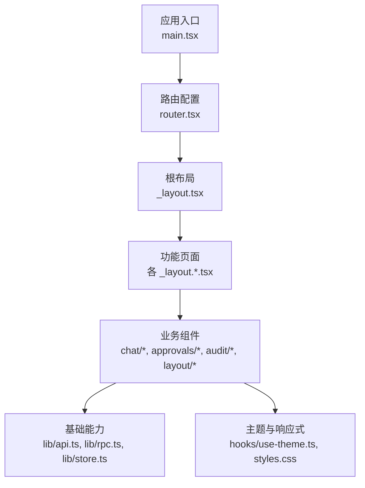
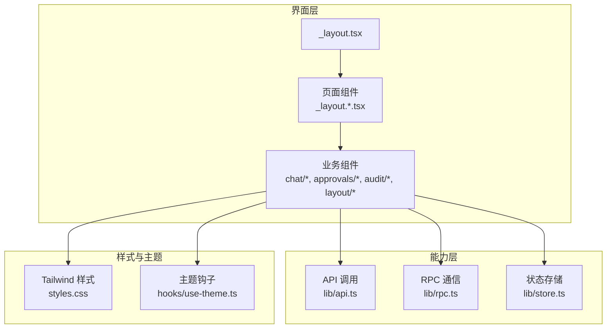
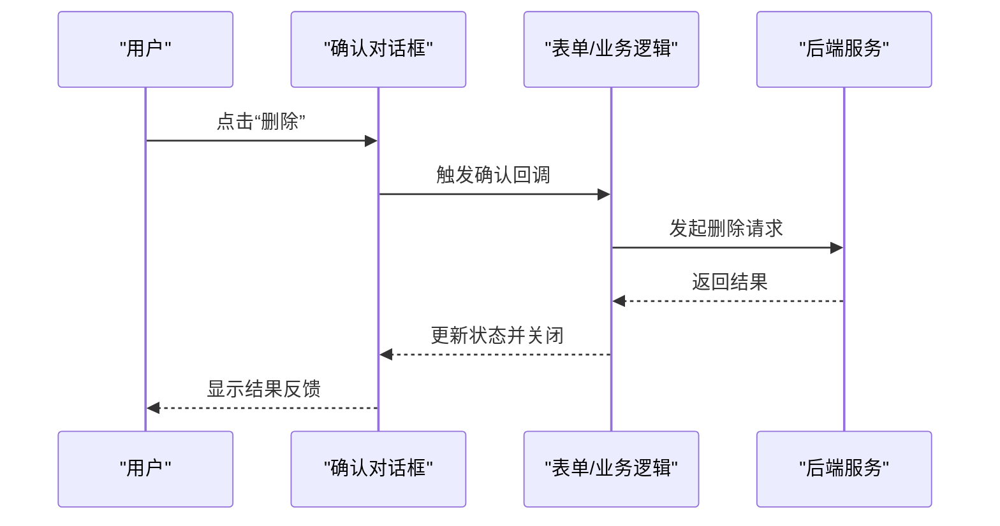
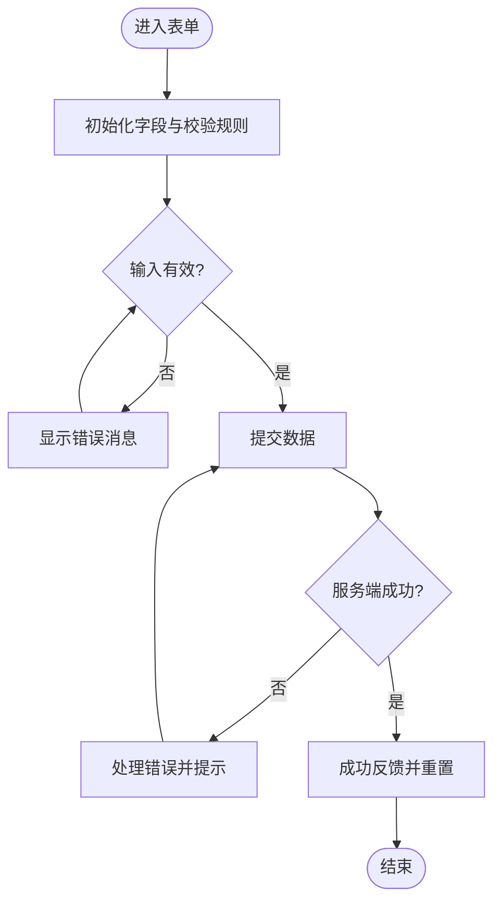
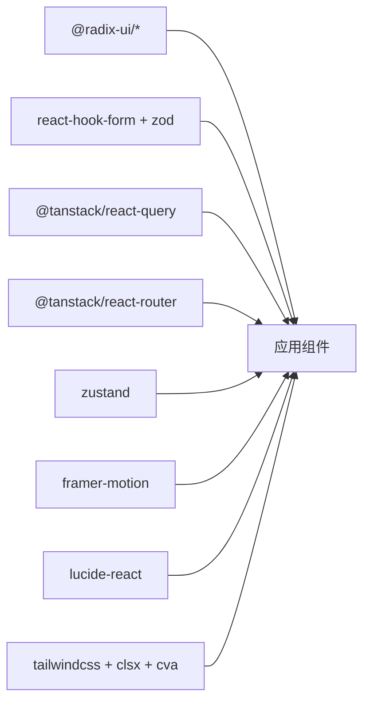

# 基础UI组件

<cite>
**本文引用的文件**
- [package.json](file://ui/package.json)
- [components.json](file://ui/components.json)
- [styles.css](file://ui/src/styles.css)
- [main.tsx](file://ui/src/main.tsx)
- [router.tsx](file://ui/src/router.tsx)
- [_layout.tsx](file://ui/src/routes/_layout.tsx)
- [_layout.index.tsx](file://ui/src/routes/_layout.index.tsx)
- [_layout.approvals.tsx](file://ui/src/routes/_layout.approvals.tsx)
- [_layout.cron-tasks.tsx](file://ui/src/routes/_layout.cron-tasks.tsx)
- [_layout.dashboard.tsx](file://ui/src/routes/_layout.dashboard.tsx)
- [_layout.lifecycle.tsx](file://ui/src/routes/_layout.lifecycle.tsx)
- [_layout.masks.tsx](file://ui/src/routes/_layout.masks.tsx)
- [_layout.mcp.tsx](file://ui/src/routes/_layout.mcp.tsx)
- [_layout.memory.tsx](file://ui/src/routes/_layout.memory.tsx)
- [_layout.notebook.tsx](file://ui/src/routes/_layout.notebook.tsx)
- [_layout.persona.tsx](file://ui/src/routes/_layout.persona.tsx)
- [_layout.settings.tsx](file://ui/src/routes/_layout.settings.tsx)
- [ChatView.tsx](file://ui/src/components/chat/ChatView.tsx)
- [ChatInput.tsx](file://ui/src/components/chat/ChatInput.tsx)
- [SessionDrawer.tsx](file://ui/src/components/chat/SessionDrawer.tsx)
- [RunInspector.tsx](file://ui/src/components/chat/RunInspector.tsx)
- [ApprovalsView.tsx](file://ui/src/components/approvals/ApprovalsView.tsx)
- [AuditPanel.tsx](file://ui/src/components/audit/AuditPanel.tsx)
- [MasterDetail.tsx](file://ui/src/components/layout/MasterDetail.tsx)
- [use-theme.ts](file://ui/src/hooks/use-theme.ts)
- [api.ts](file://ui/src/lib/api.ts)
- [rpc.ts](file://ui/src/lib/rpc.ts)
- [store.ts](file://ui/src/lib/store.ts)
</cite>

## 目录
1. [简介](#简介)
2. [项目结构](#项目结构)
3. [核心组件](#核心组件)
4. [架构总览](#架构总览)
5. [详细组件分析](#详细组件分析)
6. [依赖关系分析](#依赖关系分析)
7. [性能考虑](#性能考虑)
8. [故障排查指南](#故障排查指南)
9. [结论](#结论)
10. [附录](#附录)

## 简介
本文件面向“基础UI组件库”的文档目标，围绕按钮、对话框、表单、输入、卡片、表格等常用组件的使用与组合进行系统化说明。本项目前端采用 React + Vite，样式基于 Tailwind CSS，并通过 shadcn/ui（Radix UI）提供可访问的基础原语；状态管理使用 Zustand，数据获取使用 TanStack Query，路由使用 TanStack Router。本文结合仓库中的实际代码组织与依赖，给出组件选型、主题适配、响应式策略以及最佳实践建议。

## 项目结构
前端位于 ui 目录，入口为 main.tsx，路由由 router.tsx 与 routes 下的布局页面组成。业务组件集中在 src/components，通用工具与状态在 src/lib 与 src/hooks。样式通过 styles.css 引入 Tailwind，并使用 components.json 配置 shadcn/ui 的别名与图标库。

图表来源
- [main.tsx:1-200](file://ui/src/main.tsx#L1-L200)
- [router.tsx:1-200](file://ui/src/router.tsx#L1-L200)
- [_layout.tsx:1-200](file://ui/src/routes/_layout.tsx#L1-L200)

章节来源
- [main.tsx:1-200](file://ui/src/main.tsx#L1-L200)
- [router.tsx:1-200](file://ui/src/router.tsx#L1-L200)
- [_layout.tsx:1-200](file://ui/src/routes/_layout.tsx#L1-L200)
- [package.json:1-82](file://ui/package.json#L1-L82)
- [components.json:1-23](file://ui/components.json#L1-L23)

## 核心组件
- 按钮 Button：用于触发操作，支持尺寸、颜色、禁用态、加载态与图标集成。推荐基于 Radix Slot 或 shadcn/ui 的 Button 实现，通过 class-variance-authority 管理变体。
- 对话框 Dialog：包括模态框、抽屉、确认框等。模态框使用 @radix-ui/react-dialog，抽屉使用 vaul，确认框使用 @radix-ui/react-alert-dialog。
- 表单 Form：基于 react-hook-form 与 @hookform/resolvers（Zod），统一校验与提交流程。
- 输入 Input：文本、数字、日期、选择等类型，支持格式化与无障碍标签。
- 卡片 Card：内容容器，用于信息分组与展示。
- 表格 Table：数据展示、排序、分页、筛选，可结合虚拟滚动与查询缓存。

以上组件在本项目中以业务组件形式落地，例如聊天输入、会话抽屉、运行检查器、审批面板等，均体现了上述能力的组合使用。

章节来源
- [package.json:15-69](file://ui/package.json#L15-L69)
- [components.json:1-23](file://ui/components.json#L1-L23)

## 架构总览
前端采用“布局-页面-组件-能力层”的分层结构。布局负责导航与全局状态，页面承载具体业务视图，组件封装交互细节，能力层提供 API/RPC/Store 等通用服务。主题与样式通过 Tailwind 变量与 hooks 统一管理，确保一致性与可定制性。

图表来源
- [_layout.tsx:1-200](file://ui/src/routes/_layout.tsx#L1-L200)
- [api.ts:1-200](file://ui/src/lib/api.ts#L1-L200)
- [rpc.ts:1-200](file://ui/src/lib/rpc.ts#L1-L200)
- [store.ts:1-200](file://ui/src/lib/store.ts#L1-L200)
- [use-theme.ts:1-200](file://ui/src/hooks/use-theme.ts#L1-L200)
- [styles.css:1-200](file://ui/src/styles.css#L1-L200)

## 详细组件分析

### 按钮 Button
- 尺寸：小/中/大，通过 class-variance-authority 的 variant 与 size 控制。
- 颜色：主色、次色、危险、成功、警告等语义化颜色，配合 Tailwind 变量。
- 状态：默认、悬停、聚焦、禁用、加载（旋转图标）。
- 图标集成：左侧/右侧图标，使用 lucide-react 图标库。
- 无障碍：role、aria-* 属性、键盘可达性。

使用建议
- 将按钮作为原子组件，组合到更复杂的交互中（如表单提交、批量操作）。
- 通过 props 暴露 loading、disabled、iconPosition 等，保持单一职责。

章节来源
- [package.json:47-69](file://ui/package.json#L47-L69)
- [components.json:12-20](file://ui/components.json#L12-L20)

### 对话框 Dialog
- 模态框：@radix-ui/react-dialog，适合强提示、重要操作确认。
- 抽屉：vaul，适合侧边详情、编辑面板，移动端友好。
- 确认框：@radix-ui/react-alert-dialog，用于破坏性操作的二次确认。
- 组合模式：Dialog + Form，表单验证通过后提交并关闭。

典型流程（以确认删除为例）

图表来源
- [_layout.approvals.tsx:1-200](file://ui/src/routes/_layout.approvals.tsx#L1-L200)
- [ApprovalsView.tsx:1-200](file://ui/src/components/approvals/ApprovalsView.tsx#L1-L200)
- [api.ts:1-200](file://ui/src/lib/api.ts#L1-L200)

章节来源
- [package.json:17-24](file://ui/package.json#L17-L24)
- [_layout.approvals.tsx:1-200](file://ui/src/routes/_layout.approvals.tsx#L1-L200)
- [ApprovalsView.tsx:1-200](file://ui/src/components/approvals/ApprovalsView.tsx#L1-L200)

### 表单 Form
- 构建：react-hook-form 管理字段与状态，Zod 定义校验规则。
- 验证：同步与异步校验，错误消息集中展示。
- 提交：统一封装提交函数，处理成功/失败分支与反馈。
- 组合：表单与对话框/抽屉组合，提升交互一致性。

图表来源
- [ChatInput.tsx:1-200](file://ui/src/components/chat/ChatInput.tsx#L1-L200)
- [api.ts:1-200](file://ui/src/lib/api.ts#L1-L200)

章节来源
- [package.json:15-16](file://ui/package.json#L15-L16)
- [ChatInput.tsx:1-200](file://ui/src/components/chat/ChatInput.tsx#L1-L200)
- [api.ts:1-200](file://ui/src/lib/api.ts#L1-L200)

### 输入 Input
- 类型变体：文本、密码、数字、邮箱、日期、搜索等。
- 格式化：数值千分位、金额小数位、日期本地化。
- 无障碍：label、aria-describedby、占位符、必填标识。
- 组合：与表单校验联动，实时反馈。

章节来源
- [package.json:53-58](file://ui/package.json#L53-L58)
- [ChatInput.tsx:1-200](file://ui/src/components/chat/ChatInput.tsx#L1-L200)

### 卡片 Card
- 布局：标题、描述、操作区、媒体区。
- 内容组织：栅格布局、间距、阴影、圆角。
- 响应式：在小屏下堆叠，大屏下并排。

章节来源
- [MasterDetail.tsx:1-200](file://ui/src/components/layout/MasterDetail.tsx#L1-L200)
- [styles.css:1-200](file://ui/src/styles.css#L1-L200)

### 表格 Table
- 数据展示：列定义、行渲染、空态与加载态。
- 排序：客户端/服务端排序，稳定排序算法。
- 分页：页码、每页条数、跳转。
- 筛选：多条件筛选、搜索、过滤后计数。
- 性能：虚拟滚动、增量更新、去抖搜索。

章节来源
- [package.json:44-45](file://ui/package.json#L44-L45)
- [ApprovalsView.tsx:1-200](file://ui/src/components/approvals/ApprovalsView.tsx#L1-L200)
- [AuditPanel.tsx:1-200](file://ui/src/components/audit/AuditPanel.tsx#L1-L200)

### 样式定制、主题适配、响应式设计
- 主题：通过 Tailwind 变量与 use-theme 钩子切换明暗主题，统一色彩与字体。
- 响应式：基于断点的类名与栅格系统，保证多端体验一致。
- 可访问性：对比度、焦点可见性、键盘导航。

章节来源
- [use-theme.ts:1-200](file://ui/src/hooks/use-theme.ts#L1-L200)
- [styles.css:1-200](file://ui/src/styles.css#L1-L200)

## 依赖关系分析
前端依赖主要包含：
- UI 原语：@radix-ui/* 系列提供可访问的无样式组件。
- 表单与校验：react-hook-form、@hookform/resolvers、zod。
- 状态与数据：zustand、@tanstack/react-query。
- 路由：@tanstack/react-router。
- 动画与交互：framer-motion、embla-carousel-react。
- 图标：lucide-react。
- 样式：tailwindcss、tailwind-merge、class-variance-authority。

图表来源
- [package.json:15-69](file://ui/package.json#L15-L69)

章节来源
- [package.json:15-69](file://ui/package.json#L15-L69)

## 性能考虑
- 列表渲染：对大数据集使用虚拟滚动或分页加载，避免一次性渲染过多节点。
- 网络请求：使用 TanStack Query 缓存与去重，合理设置 staleTime 与 refetch 策略。
- 表单提交：防抖与节流，避免重复提交；失败重试与退避策略。
- 主题切换：最小化重绘，按需更新样式变量。
- 资源体积：按需引入图标与组件，减少打包体积。

## 故障排查指南
- 表单校验不生效：检查 Zod schema 与 resolver 绑定是否正确，确认字段名与事件绑定。
- 对话框无法关闭：确认事件冒泡与焦点管理，避免遮罩层阻止点击。
- 表格排序异常：确保数据不可变性，排序键稳定且唯一。
- 主题不生效：检查 CSS 变量注入顺序与优先级，确认 use-theme 钩子正确挂载。
- 网络请求失败：查看 api.ts 的错误处理与重试逻辑，核对 RPC 协议与超时配置。

章节来源
- [api.ts:1-200](file://ui/src/lib/api.ts#L1-L200)
- [rpc.ts:1-200](file://ui/src/lib/rpc.ts#L1-L200)
- [store.ts:1-200](file://ui/src/lib/store.ts#L1-L200)

## 结论
本项目的前端以 React + Vite 为基础，借助 shadcn/ui（Radix UI）、Tailwind CSS、Zustand、TanStack Query 等生态，构建了可扩展、可访问、易维护的 UI 体系。通过统一的布局与组件分层，结合主题与响应式策略，能够高效支撑按钮、对话框、表单、输入、卡片、表格等基础组件的组合与复用。建议在后续迭代中持续完善组件文档与测试覆盖，强化错误边界与性能优化。

## 附录
- 开发脚本与端口：参见 package.json scripts。
- 路由与页面：routes 目录下各 _layout.*.tsx 对应功能模块。
- 业务组件示例：chat/*、approvals/*、audit/*、layout/* 展示了组件组合的最佳实践。