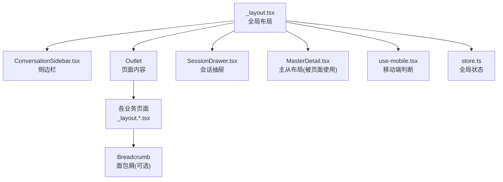
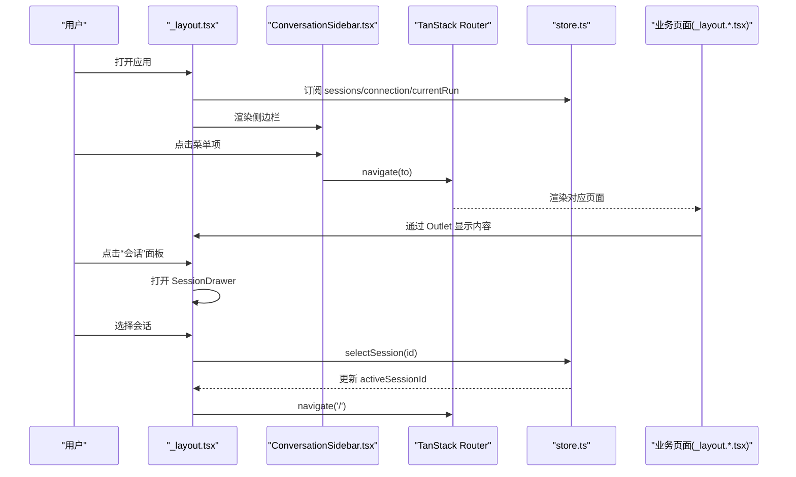
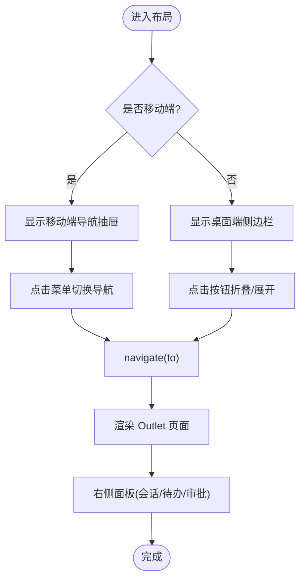
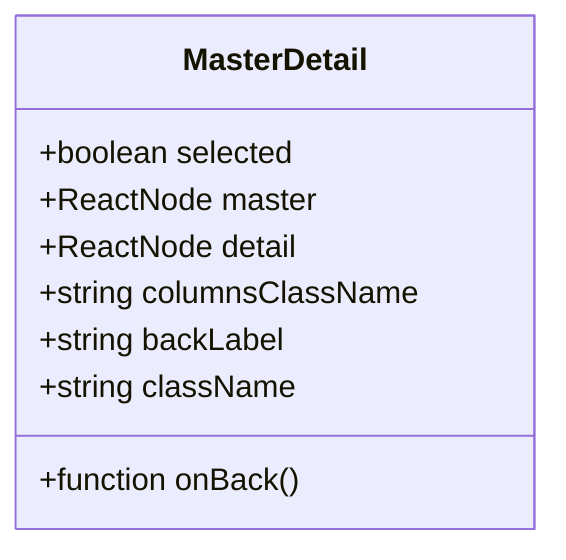
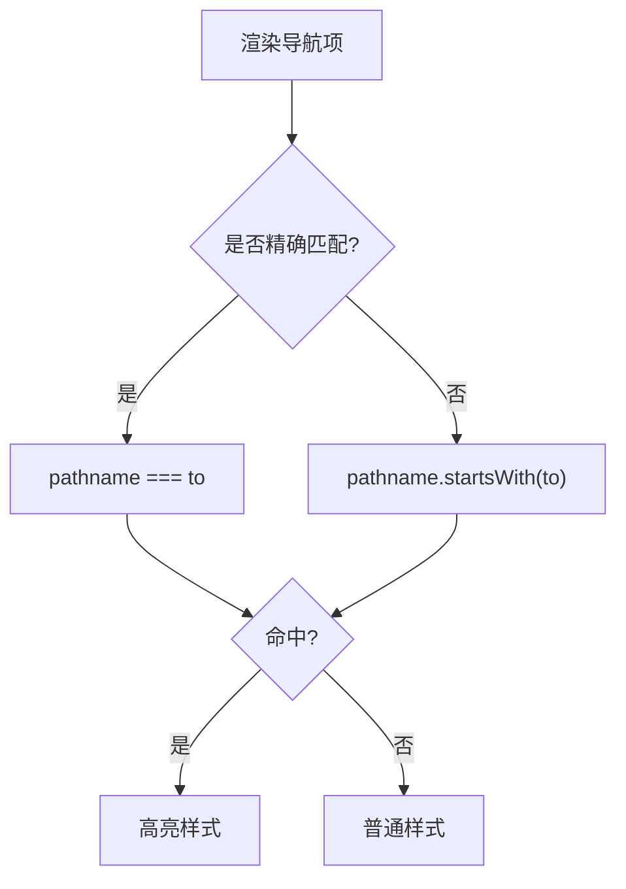
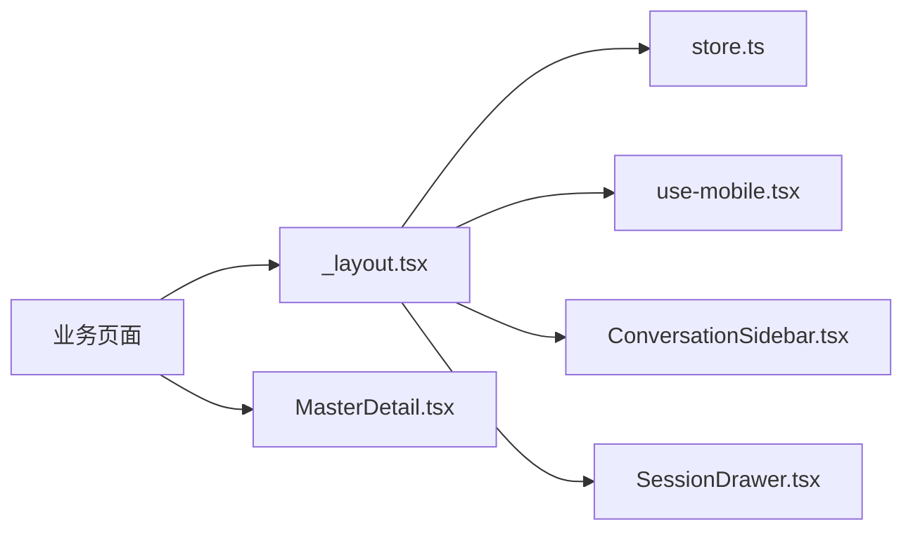

# 布局组件

<cite>
**本文引用的文件**
- [ui/src/routes/_layout.tsx](file://ui/src/routes/_layout.tsx)
- [ui/src/components/layout/MasterDetail.tsx](file://ui/src/components/layout/MasterDetail.tsx)
- [ui/src/components/chat/ConversationSidebar.tsx](file://ui/src/components/chat/ConversationSidebar.tsx)
- [ui/src/components/chat/SessionDrawer.tsx](file://ui/src/components/chat/SessionDrawer.tsx)
- [ui/src/hooks/use-mobile.tsx](file://ui/src/hooks/use-mobile.tsx)
- [ui/src/lib/store.ts](file://ui/src/lib/store.ts)
- [ui/src/router.tsx](file://ui/src/router.tsx)
- [ui/src/components/ui/breadcrumb.tsx](file://ui/src/components/ui/breadcrumb.tsx)
</cite>

## 目录
1. [简介](#简介)
2. [项目结构](#项目结构)
3. [核心组件](#核心组件)
4. [架构总览](#架构总览)
5. [详细组件分析](#详细组件分析)
6. [依赖关系分析](#依赖关系分析)
7. [性能考虑](#性能考虑)
8. [故障排查指南](#故障排查指南)
9. [结论](#结论)
10. [附录：定制与扩展指南](#附录定制与扩展指南)

## 简介
本文件聚焦前端布局体系，围绕主从布局 MasterDetail、路由布局 _layout.tsx、侧边栏 ConversationSidebar 等关键组件，系统阐述响应式布局、移动端适配、状态同步、权限控制、可访问性与性能优化策略，并提供定制与扩展模式。该布局体系以 React + TanStack Router 为基础，结合 Tailwind CSS 的断点与弹性布局能力，实现桌面端“侧边栏+内容区”与移动端“抽屉导航+全屏内容”的统一体验。

## 项目结构
- 路由布局层：_layout.tsx 作为全局布局容器，负责顶部工具栏、侧边栏（桌面折叠/移动抽屉）、右侧面板（会话、待办、审批中心）以及 Outlet 渲染。
- 主从布局层：MasterDetail.tsx 提供“列表-详情”双栏布局，在移动端自动切换为单栏并支持返回操作。
- 侧边栏与导航：ConversationSidebar.tsx 提供分组导航菜单；SessionDrawer.tsx 提供会话管理抽屉。
- 响应式钩子：useIsMobile.tsx 基于 matchMedia 提供移动端判定。
- 状态管理：store.ts 集中管理会话、连接状态、运行态等，供布局组件消费。
- 面包屑：breadcrumb.tsx 提供可组合的面包屑 UI 组件（可在页面内按需使用）。

图表来源
- [ui/src/routes/_layout.tsx:19-176](file://ui/src/routes/_layout.tsx#L19-L176)
- [ui/src/components/layout/MasterDetail.tsx:1-43](file://ui/src/components/layout/MasterDetail.tsx#L1-L43)
- [ui/src/components/chat/ConversationSidebar.tsx:1-26](file://ui/src/components/chat/ConversationSidebar.tsx#L1-L26)
- [ui/src/components/chat/SessionDrawer.tsx:1-14](file://ui/src/components/chat/SessionDrawer.tsx#L1-L14)
- [ui/src/hooks/use-mobile.tsx:1-20](file://ui/src/hooks/use-mobile.tsx#L1-L20)
- [ui/src/lib/store.ts](file://ui/src/lib/store.ts)
- [ui/src/components/ui/breadcrumb.tsx:1-42](file://ui/src/components/ui/breadcrumb.tsx#L1-L42)

章节来源
- [ui/src/routes/_layout.tsx:19-176](file://ui/src/routes/_layout.tsx#L19-L176)
- [ui/src/components/layout/MasterDetail.tsx:1-43](file://ui/src/components/layout/MasterDetail.tsx#L1-L43)
- [ui/src/components/chat/ConversationSidebar.tsx:1-26](file://ui/src/components/chat/ConversationSidebar.tsx#L1-L26)
- [ui/src/components/chat/SessionDrawer.tsx:1-14](file://ui/src/components/chat/SessionDrawer.tsx#L1-L14)
- [ui/src/hooks/use-mobile.tsx:1-20](file://ui/src/hooks/use-mobile.tsx#L1-L20)
- [ui/src/components/ui/breadcrumb.tsx:1-42](file://ui/src/components/ui/breadcrumb.tsx#L1-L42)

## 核心组件
- 全局布局 _layout.tsx
  - 职责：统一头部、侧边栏、内容区与右侧面板；处理移动端导航开关；集成会话、待办、审批中心面板；通过 useVivyStore 订阅全局状态变化。
  - 响应式：桌面端侧边栏宽度可折叠；移动端使用 Sheet 抽屉展示导航。
  - 可访问性：按钮提供 aria-label/title；面板标题使用 SheetHeader/SheetTitle。
- 主从布局 MasterDetail.tsx
  - 职责：提供“主-从”双栏布局；移动端隐藏主栏或从栏，并通过返回按钮切换。
  - 响应式：基于 md 断点切换显示逻辑；columnsClassName 可配置列宽。
  - 可访问性：返回按钮语义清晰，便于键盘导航。
- 侧边栏 ConversationSidebar.tsx
  - 职责：分组导航（聊天、中控台、定时任务、Vivy、工具管理等），高亮当前路径；新建会话入口。
  - 交互：Link 驱动路由；根据 pathname 计算激活态。
- 会话抽屉 SessionDrawer.tsx
  - 职责：搜索、新建、重命名、删除会话；与 store 联动更新 activeSessionId。
- 移动端钩子 useIsMobile.tsx
  - 职责：基于 matchMedia 监听窗口尺寸变化，返回 isMobile 布尔值。
- 面包屑 breadcrumb.tsx
  - 职责：提供可组合的导航层级展示，适合在页面内嵌入。

章节来源
- [ui/src/routes/_layout.tsx:19-176](file://ui/src/routes/_layout.tsx#L19-L176)
- [ui/src/components/layout/MasterDetail.tsx:1-43](file://ui/src/components/layout/MasterDetail.tsx#L1-L43)
- [ui/src/components/chat/ConversationSidebar.tsx:1-26](file://ui/src/components/chat/ConversationSidebar.tsx#L1-L26)
- [ui/src/components/chat/SessionDrawer.tsx:1-14](file://ui/src/components/chat/SessionDrawer.tsx#L1-L14)
- [ui/src/hooks/use-mobile.tsx:1-20](file://ui/src/hooks/use-mobile.tsx#L1-L20)
- [ui/src/components/ui/breadcrumb.tsx:1-42](file://ui/src/components/ui/breadcrumb.tsx#L1-L42)

## 架构总览
布局体系由“全局布局容器 + 主从布局 + 侧边导航 + 面板抽屉 + 状态总线”构成。全局布局负责装配与协调，业务页面通过 Outlet 注入；主从布局用于列表-详情场景；侧边栏与抽屉承载导航与会话管理；store 提供跨组件状态共享。

图表来源
- [ui/src/routes/_layout.tsx:19-176](file://ui/src/routes/_layout.tsx#L19-L176)
- [ui/src/components/chat/ConversationSidebar.tsx:1-26](file://ui/src/components/chat/ConversationSidebar.tsx#L1-L26)
- [ui/src/lib/store.ts](file://ui/src/lib/store.ts)
- [ui/src/router.tsx](file://ui/src/router.tsx)

## 详细组件分析

### 全局布局 _layout.tsx
- 结构与职责
  - 顶部工具栏：包含导航开关、品牌标识、在线状态指示、模型/面具切换器、会话面板、待办面板。
  - 侧边栏：桌面端固定宽度并可折叠；移动端通过 Sheet 左侧抽屉展示。
  - 内容区：Outlet 占位，承载具体页面。
  - 右侧面板：会话、待办、审批中心三个 Sheet 面板，分别承载不同功能。
- 响应式与移动端适配
  - 使用 useIsMobile 判断移动端，决定侧边栏是折叠还是抽屉。
  - 移动端导航打开时关闭自身，避免遮挡。
- 状态同步
  - 通过 useVivyStore 订阅 sessions、activeSessionId、connection、currentRun、reviewCenterOpen 等状态。
  - 创建/选择/重命名/删除会话后，触发 store 更新并导航到首页。
- 可访问性
  - 按钮提供 aria-label/title；面板标题使用 SheetHeader/SheetTitle；在线状态提供 tooltip。
- 错误处理
  - 创建会话失败时，store 暴露错误信息并在侧边栏提示。

图表来源
- [ui/src/routes/_layout.tsx:19-176](file://ui/src/routes/_layout.tsx#L19-L176)
- [ui/src/hooks/use-mobile.tsx:1-20](file://ui/src/hooks/use-mobile.tsx#L1-L20)

章节来源
- [ui/src/routes/_layout.tsx:19-176](file://ui/src/routes/_layout.tsx#L19-L176)
- [ui/src/hooks/use-mobile.tsx:1-20](file://ui/src/hooks/use-mobile.tsx#L1-L20)

### 主从布局 MasterDetail.tsx
- 结构与职责
  - 双栏网格：主栏（列表）与从栏（详情）在不同屏幕下切换显示。
  - 移动端：当选中某项时隐藏主栏，显示从栏，并提供“返回列表”按钮。
- 响应式与可配置
  - columnsClassName 默认使用 md:grid-cols-[20rem_minmax(0,1fr)]，可按需覆盖。
  - 通过 selected 控制移动端的主/从显示。
- 可访问性
  - 返回按钮语义明确，便于键盘与读屏设备识别。

图表来源
- [ui/src/components/layout/MasterDetail.tsx:1-43](file://ui/src/components/layout/MasterDetail.tsx#L1-L43)

章节来源
- [ui/src/components/layout/MasterDetail.tsx:1-43](file://ui/src/components/layout/MasterDetail.tsx#L1-L43)

### 侧边栏 ConversationSidebar.tsx
- 结构与职责
  - 分组导航：基础导航、Vivy 模块、工具管理三大组。
  - 激活态：根据 pathname 精确匹配或前缀匹配高亮当前项。
  - 新建会话：按钮触发回调，禁用态防重复提交。
- 可访问性
  - 图标与文字并列，按钮具备 aria-label/title。
- 扩展点
  - NAV_ITEMS/VIVY_ITEMS/TOOL_ITEMS 可配置化，便于按权限或功能模块动态增减。

图表来源
- [ui/src/components/chat/ConversationSidebar.tsx:1-26](file://ui/src/components/chat/ConversationSidebar.tsx#L1-L26)

章节来源
- [ui/src/components/chat/ConversationSidebar.tsx:1-26](file://ui/src/components/chat/ConversationSidebar.tsx#L1-L26)

### 会话抽屉 SessionDrawer.tsx
- 结构与职责
  - 搜索过滤：按标题模糊匹配。
  - 新建/重命名/删除：与 store 提供的回调对接，保持状态一致。
  - 交互细节：编辑态输入框回车保存、Esc 取消；删除二次确认。
- 可访问性
  - 按钮具备 title；列表项可聚焦与操作。

章节来源
- [ui/src/components/chat/SessionDrawer.tsx:1-14](file://ui/src/components/chat/SessionDrawer.tsx#L1-L14)

### 面包屑 breadcrumb.tsx
- 结构与职责
  - 提供 Breadcrumb/BreadcrumbList/BreadcrumbItem/BreadcrumbLink 等可组合元素。
  - 适合在页面中嵌入，表达当前层级位置。
- 可访问性
  - 外层 nav 设置 aria-label="breadcrumb"，利于读屏设备识别。

章节来源
- [ui/src/components/ui/breadcrumb.tsx:1-42](file://ui/src/components/ui/breadcrumb.tsx#L1-L42)

## 依赖关系分析
- 组件耦合
  - _layout.tsx 依赖 store.ts 获取会话、连接、运行态等；依赖 useIsMobile.tsx 进行响应式判断；依赖 ConversationSidebar.tsx 与 SessionDrawer.tsx 提供导航与会话管理。
  - MasterDetail.tsx 独立性强，仅依赖基础 UI 与工具函数。
- 外部依赖
  - TanStack Router：路由与导航。
  - Radix UI Sheet：抽屉面板。
  - Lucide 图标：UI 图标。
  - Tailwind CSS：响应式与样式。
- 潜在循环依赖
  - 当前布局组件之间无直接循环引用；页面通过 Outlet 注入，避免反向依赖。

图表来源
- [ui/src/routes/_layout.tsx:19-176](file://ui/src/routes/_layout.tsx#L19-L176)
- [ui/src/components/layout/MasterDetail.tsx:1-43](file://ui/src/components/layout/MasterDetail.tsx#L1-L43)
- [ui/src/components/chat/ConversationSidebar.tsx:1-26](file://ui/src/components/chat/ConversationSidebar.tsx#L1-L26)
- [ui/src/components/chat/SessionDrawer.tsx:1-14](file://ui/src/components/chat/SessionDrawer.tsx#L1-L14)
- [ui/src/hooks/use-mobile.tsx:1-20](file://ui/src/hooks/use-mobile.tsx#L1-L20)
- [ui/src/lib/store.ts](file://ui/src/lib/store.ts)

章节来源
- [ui/src/routes/_layout.tsx:19-176](file://ui/src/routes/_layout.tsx#L19-L176)
- [ui/src/components/layout/MasterDetail.tsx:1-43](file://ui/src/components/layout/MasterDetail.tsx#L1-L43)
- [ui/src/components/chat/ConversationSidebar.tsx:1-26](file://ui/src/components/chat/ConversationSidebar.tsx#L1-L26)
- [ui/src/components/chat/SessionDrawer.tsx:1-14](file://ui/src/components/chat/SessionDrawer.tsx#L1-L14)
- [ui/src/hooks/use-mobile.tsx:1-20](file://ui/src/hooks/use-mobile.tsx#L1-L20)
- [ui/src/lib/store.ts](file://ui/src/lib/store.ts)

## 性能考虑
- 状态订阅最小化
  - 使用 store 的选择器订阅必要字段（如 sessions、activeSessionId、connection），避免全量重渲染。
- 条件渲染与懒加载
  - 移动端仅在需要时打开抽屉；面板按需打开，减少初始渲染成本。
- 事件去抖与节流
  - 窗口尺寸变化已通过 matchMedia 监听，无需额外节流；搜索建议可考虑输入节流。
- 列表渲染优化
  - 会话列表较长时可考虑虚拟滚动（当前未实现），或分页/加载更多。
- 网络请求
  - 计划数据在布局挂载时拉取一次，避免重复请求。

[本节为通用指导，不直接分析具体文件]

## 故障排查指南
- 侧边栏无法折叠/展开
  - 检查 useIsMobile 返回值与媒体查询断点；确认桌面端/移动端分支是否正确切换。
- 会话操作无效
  - 检查 store 中的 create/select/rename/delete 方法是否被正确调用；查看 busyId 与 sessionsError 状态。
- 面板无法关闭
  - 审批中心在 busyId 存在时禁止关闭，需等待异步操作完成。
- 路由跳转异常
  - 确认 Link/navigate 的目标路径是否存在；检查 _layout.*.tsx 路由文件是否注册。
- 可访问性问题
  - 确保按钮具备 aria-label/title；面板标题使用 SheetHeader/SheetTitle；面包屑使用正确的语义标签。

章节来源
- [ui/src/routes/_layout.tsx:19-176](file://ui/src/routes/_layout.tsx#L19-L176)
- [ui/src/components/chat/SessionDrawer.tsx:1-14](file://ui/src/components/chat/SessionDrawer.tsx#L1-L14)
- [ui/src/hooks/use-mobile.tsx:1-20](file://ui/src/hooks/use-mobile.tsx#L1-L20)

## 结论
该布局体系以 _layout.tsx 为核心，结合 MasterDetail 主从布局、ConversationSidebar 侧边导航与 SessionDrawer 会话管理，实现了桌面与移动端的一致体验。通过 store 集中管理状态，配合 TanStack Router 的路由能力，保证了状态同步与导航流畅。响应式设计基于 Tailwind 断点与 useIsMobile 钩子，兼顾了可用性与性能。未来可按需扩展权限控制、主题定制与更多面板。

[本节为总结性内容，不直接分析具体文件]

## 附录：定制与扩展指南
- 响应式断点与网格
  - 使用 Tailwind 的 md/lg/xl 等断点进行布局切换；MasterDetail 的 columnsClassName 可自定义列宽比例。
- 权限控制
  - 在 ConversationSidebar 的导航项数组中增加权限字段，渲染前按角色过滤；或在 _layout.tsx 中根据用户角色决定是否渲染特定面板。
- 嵌套菜单
  - 在 ConversationSidebar 中为复杂菜单项添加二级展开逻辑，注意可访问性与键盘导航。
- 主题与样式
  - 通过 CSS 变量与 Tailwind 主题色定制侧边栏、面板与按钮风格；保持对比度与可读性。
- 可访问性增强
  - 为所有交互控件提供合适的 aria-* 属性；确保焦点顺序合理；为图标按钮提供文本描述。
- 性能优化
  - 对长列表使用虚拟滚动；对频繁更新的区域使用 memo 或 useMemo；避免不必要的重渲染。
- 扩展模式
  - 将新增功能以面板形式接入 _layout.tsx 的右侧面板；或将新页面以 _layout.*.tsx 形式注册路由，复用全局布局。

[本节为通用指导，不直接分析具体文件]