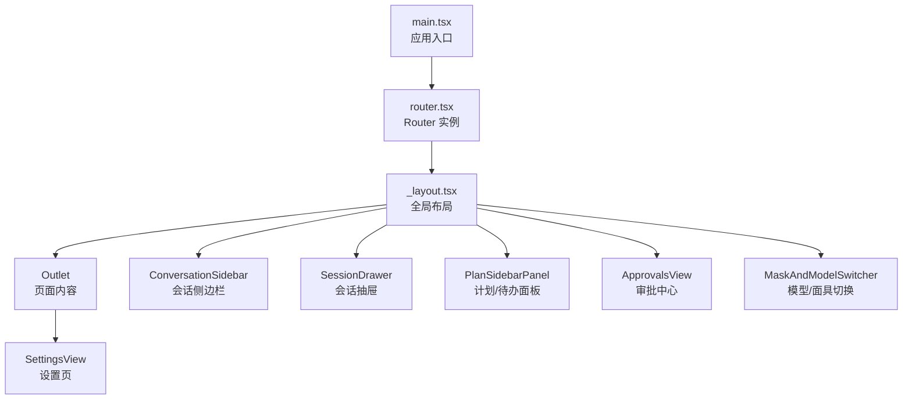
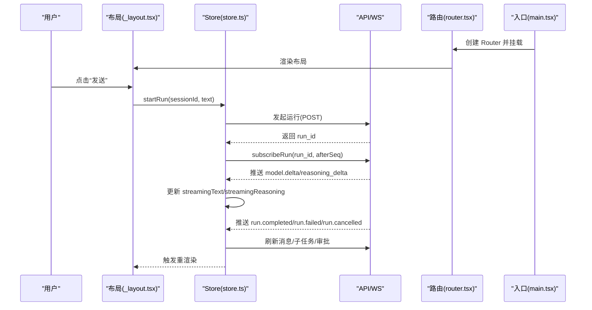
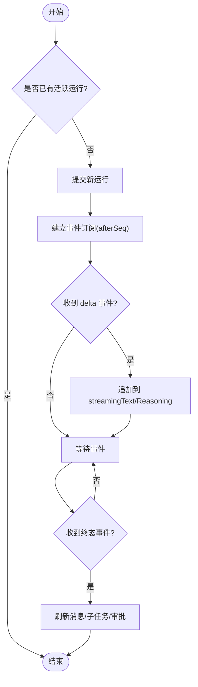
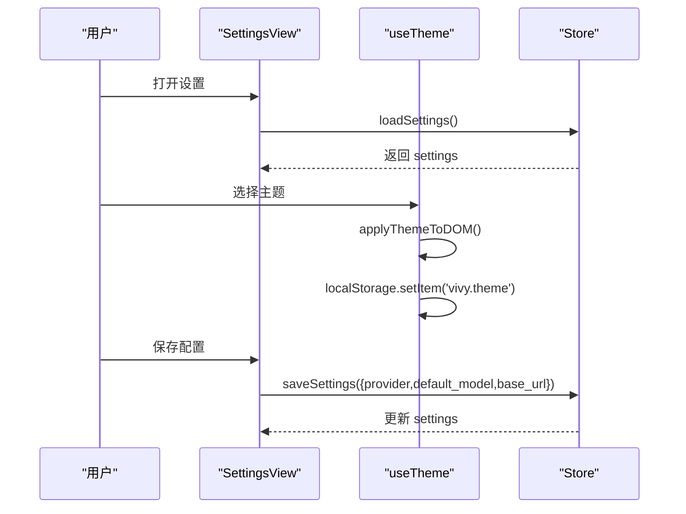
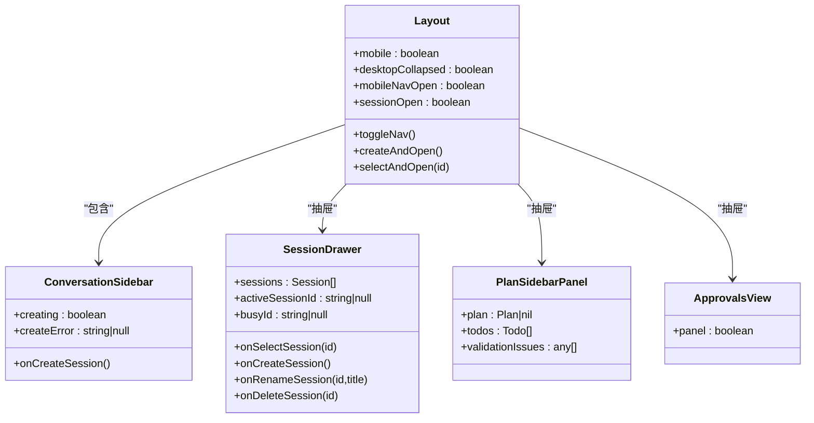
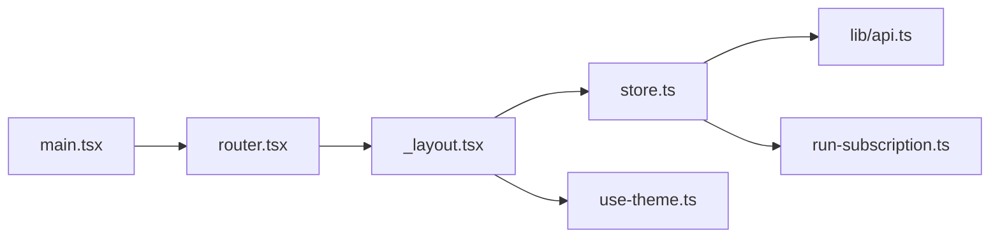

# 核心组件

<cite>
**本文引用的文件**
- [ui/src/main.tsx](file://ui/src/main.tsx)
- [ui/src/router.tsx](file://ui/src/router.tsx)
- [ui/src/routes/_layout.tsx](file://ui/src/routes/_layout.tsx)
- [ui/src/routes/_layout.settings.tsx](file://ui/src/routes/_layout.settings.tsx)
- [ui/src/lib/store.ts](file://ui/src/lib/store.ts)
- [ui/src/hooks/use-theme.ts](file://ui/src/hooks/use-theme.ts)
</cite>

## 目录
1. [简介](#简介)
2. [项目结构](#项目结构)
3. [核心组件](#核心组件)
4. [架构总览](#架构总览)
5. [详细组件分析](#详细组件分析)
6. [依赖关系分析](#依赖关系分析)
7. [性能考量](#性能考量)
8. [故障排查指南](#故障排查指南)
9. [结论](#结论)
10. [附录](#附录)

## 简介
本仓库前端采用 React + Vite，基于 TanStack Router 组织页面与路由，使用 Zustand 管理全局运行时状态（会话、消息、运行事件、设置等），并通过 WebSocket/轮询订阅后端运行事件实现实时通信。UI 层由基础组件库（按钮、表单、对话框等）与业务组件（聊天、审批、计划面板、设置等）组成，布局通过响应式侧边栏与主内容区组合而成。主题系统通过 data-theme 与 Tailwind dark 模式切换，支持多套预设皮肤并持久化到本地存储。

## 项目结构
- 应用入口：初始化全局滚动渐入引擎，创建 RouterProvider 挂载路由树。
- 路由：集中创建 Router，注入 QueryClient，启用滚动恢复与预取策略。
- 布局：统一头部、左侧导航（桌面折叠/移动端抽屉）、右侧抽屉（会话列表、待办事项、审批中心），以及 Outlet 承载页面内容。
- 状态：Zustand store 封装会话、消息、运行事件、设置、生命周期等能力；提供启动、选择会话、发起运行、取消运行、加载子任务、审批响应、设置读写等方法。
- 主题：单一入口维护当前主题 ID、预览色板、明暗外观，写入 DOM 的 data-theme 并同步 localStorage。

图表来源
- [ui/src/main.tsx:1-19](file://ui/src/main.tsx#L1-L19)
- [ui/src/router.tsx:1-25](file://ui/src/router.tsx#L1-L25)
- [ui/src/routes/_layout.tsx:1-176](file://ui/src/routes/_layout.tsx#L1-L176)
- [ui/src/routes/_layout.settings.tsx:1-4](file://ui/src/routes/_layout.settings.tsx#L1-L4)

章节来源
- [ui/src/main.tsx:1-19](file://ui/src/main.tsx#L1-L19)
- [ui/src/router.tsx:1-25](file://ui/src/router.tsx#L1-L25)
- [ui/src/routes/_layout.tsx:1-176](file://ui/src/routes/_layout.tsx#L1-L176)
- [ui/src/routes/_layout.settings.tsx:1-4](file://ui/src/routes/_layout.settings.tsx#L1-L4)

## 核心组件
- 聊天界面
  - 消息渲染：由 store 中的 messages 驱动，切换会话时拉取并清空历史，运行中追加用户消息，运行结束后刷新消息。
  - 输入处理：通过 startRun 提交文本，进入运行态并建立事件订阅。
  - 实时通信：subscribeRun 按 afterSeq 增量接收 model.delta / reasoning_delta 等事件，更新 streamingText/streamingReasoning，并在终态事件后刷新消息与子任务。
- 设置面板
  - 配置管理：loadSettings/saveSettings 读取与更新 provider/default_model/base_url 等配置项。
  - 主题切换：useTheme 暴露 theme/themes/setTheme，配合 styles.css 的 data-theme 块实现视觉切换。
  - 用户偏好：activeSessionId 持久化到 localStorage，确保刷新后回到上次会话。
- 基础 UI 组件库
  - 按钮、表单、对话框等通用组件在 @/components/ui 下复用，布局中使用 Sheet/Button 等构建交互。
- 布局组件
  - 响应式：桌面端左侧固定宽度可折叠，移动端以 Sheet 抽屉展示导航。
  - 侧边栏：会话列表、新建/重命名/删除会话。
  - 主内容区：Outlet 承载具体页面（如首页聊天、设置页）。

章节来源
- [ui/src/lib/store.ts:1-315](file://ui/src/lib/store.ts#L1-L315)
- [ui/src/hooks/use-theme.ts:1-118](file://ui/src/hooks/use-theme.ts#L1-L118)
- [ui/src/routes/_layout.tsx:1-176](file://ui/src/routes/_layout.tsx#L1-L176)
- [ui/src/routes/_layout.settings.tsx:1-4](file://ui/src/routes/_layout.settings.tsx#L1-L4)

## 架构总览
前端通过 Router 挂载布局，布局内嵌侧边栏与主区域；store 统一管理会话、消息、运行事件与设置；主题系统独立于业务状态，通过 DOM 属性与类名切换样式。

图表来源
- [ui/src/main.tsx:1-19](file://ui/src/main.tsx#L1-L19)
- [ui/src/router.tsx:1-25](file://ui/src/router.tsx#L1-L25)
- [ui/src/routes/_layout.tsx:1-176](file://ui/src/routes/_layout.tsx#L1-L176)
- [ui/src/lib/store.ts:105-149](file://ui/src/lib/store.ts#L105-L149)
- [ui/src/lib/store.ts:230-255](file://ui/src/lib/store.ts#L230-L255)

## 详细组件分析

### 聊天界面组件
- 消息渲染
  - 切换会话时清空消息并加载历史；运行中追加用户消息；终态后刷新消息列表。
  - 流式文本与推理文本分别由 model.delta 与 model.reasoning_delta 事件拼接。
- 输入处理
  - 校验当前会话与运行状态，避免重复提交；提交后进入 busy 态并建立事件订阅。
- 实时通信
  - 使用 afterSeq 增量订阅，避免重复事件；连接异常时更新 connection 为 reconnecting/error。
  - 终态事件触发 refreshAfterTerminal，刷新消息、背景运行、子任务与审批。

图表来源
- [ui/src/lib/store.ts:119-149](file://ui/src/lib/store.ts#L119-L149)
- [ui/src/lib/store.ts:230-255](file://ui/src/lib/store.ts#L230-L255)

章节来源
- [ui/src/lib/store.ts:105-149](file://ui/src/lib/store.ts#L105-L149)
- [ui/src/lib/store.ts:230-255](file://ui/src/lib/store.ts#L230-L255)

### 设置面板组件
- 配置管理
  - loadSettings 获取当前设置；saveSettings 更新 provider/default_model/base_url 并回写 store。
- 主题切换
  - useTheme 提供 setTheme，写入 data-theme 与 localStorage，并通知所有订阅者。
- 用户偏好
  - activeSessionId 持久化到 localStorage，保证刷新后恢复上次会话。

图表来源
- [ui/src/routes/_layout.settings.tsx:1-4](file://ui/src/routes/_layout.settings.tsx#L1-L4)
- [ui/src/hooks/use-theme.ts:64-112](file://ui/src/hooks/use-theme.ts#L64-L112)
- [ui/src/lib/store.ts:298-299](file://ui/src/lib/store.ts#L298-L299)

章节来源
- [ui/src/routes/_layout.settings.tsx:1-4](file://ui/src/routes/_layout.settings.tsx#L1-L4)
- [ui/src/hooks/use-theme.ts:1-118](file://ui/src/hooks/use-theme.ts#L1-L118)
- [ui/src/lib/store.ts:298-299](file://ui/src/lib/store.ts#L298-L299)

### 基础 UI 组件库（按钮、表单、对话框）
- 按钮：用于触发操作（如展开导航、打开抽屉、提交运行）。
- 表单：用于输入文本、选择模型/面具、填写审批原因等。
- 对话框/抽屉：Sheet 组件用于移动端导航、会话列表、待办事项与审批中心。
- 定制方式：通过 className、variant、size 等 props 控制样式与行为；结合 Tailwind 设计令牌进行主题适配。

章节来源
- [ui/src/routes/_layout.tsx:79-146](file://ui/src/routes/_layout.tsx#L79-L146)

### 布局组件（响应式、侧边栏、主内容区）
- 响应式：桌面端左侧固定宽度可折叠；移动端以 Sheet 抽屉展示导航。
- 侧边栏：会话列表、新建/重命名/删除会话，与 store 的 sessions 方法联动。
- 主内容区：Outlet 承载页面内容（首页聊天、设置页等）。
- 顶部栏：显示品牌、在线状态、模型/面具切换器、会话与待办抽屉入口。

图表来源
- [ui/src/routes/_layout.tsx:19-176](file://ui/src/routes/_layout.tsx#L19-L176)

章节来源
- [ui/src/routes/_layout.tsx:1-176](file://ui/src/routes/_layout.tsx#L1-L176)

## 依赖关系分析
- 入口与路由：main.tsx 初始化 reveal 引擎并挂载 RouterProvider；router.tsx 创建 Router 并注入 QueryClient。
- 布局与组件：_layout.tsx 组合侧边栏、抽屉与主内容区，依赖 store 的状态与方法。
- 状态与通信：store.ts 聚合 API 调用与事件订阅，驱动 UI 更新。
- 主题：use-theme.ts 提供主题切换与持久化，影响全局样式。

图表来源
- [ui/src/main.tsx:1-19](file://ui/src/main.tsx#L1-L19)
- [ui/src/router.tsx:1-25](file://ui/src/router.tsx#L1-L25)
- [ui/src/routes/_layout.tsx:1-176](file://ui/src/routes/_layout.tsx#L1-L176)
- [ui/src/lib/store.ts:1-315](file://ui/src/lib/store.ts#L1-L315)
- [ui/src/hooks/use-theme.ts:1-118](file://ui/src/hooks/use-theme.ts#L1-L118)

章节来源
- [ui/src/main.tsx:1-19](file://ui/src/main.tsx#L1-L19)
- [ui/src/router.tsx:1-25](file://ui/src/router.tsx#L1-L25)
- [ui/src/routes/_layout.tsx:1-176](file://ui/src/routes/_layout.tsx#L1-L176)
- [ui/src/lib/store.ts:1-315](file://ui/src/lib/store.ts#L1-L315)
- [ui/src/hooks/use-theme.ts:1-118](file://ui/src/hooks/use-theme.ts#L1-L118)

## 性能考量
- 事件去重：通过 afterSeq 游标增量订阅，避免重复事件处理。
- 批量更新：终态事件后一次性刷新消息、子任务与审批，减少多次重渲染。
- 流式更新：将 delta 直接拼接到 streamingText/streamingReasoning，降低中间状态复杂度。
- 资源释放：运行结束时关闭订阅，防止内存泄漏。
- 主题切换：仅修改 DOM 属性与类名，避免全量重绘。

[本节为通用指导，不直接分析具体文件]

## 故障排查指南
- 连接异常
  - 现象：connection 变为 reconnecting/error，UI 显示离线或错误提示。
  - 排查：检查 WebSocket/轮询是否正常；确认 afterSeq 是否正确传递；查看 store 中 runError 信息。
- 消息不同步
  - 现象：运行结束后消息未刷新。
  - 排查：确认终态事件触发 refreshAfterTerminal；检查 loadMessagesIntoStore 是否成功；核对 sessionEpoch 是否匹配。
- 主题不生效
  - 现象：切换主题后样式未变化。
  - 排查：确认 data-theme 已设置；检查 styles.css 中对应主题块是否存在；验证 localStorage 中 vivy.theme 值是否合法。
- 会话丢失
  - 现象：刷新后未回到上次会话。
  - 排查：检查 activeSessionId 是否持久化；确认 selectSession 逻辑与 localStorage 读写正常。

章节来源
- [ui/src/lib/store.ts:105-149](file://ui/src/lib/store.ts#L105-L149)
- [ui/src/lib/store.ts:217-229](file://ui/src/lib/store.ts#L217-L229)
- [ui/src/hooks/use-theme.ts:64-112](file://ui/src/hooks/use-theme.ts#L64-L112)

## 结论
该前端以清晰的入口与路由组织页面，通过统一的布局组件整合侧边栏与主内容区；Zustand store 集中管理会话、消息、运行事件与设置，支撑聊天界面的消息渲染、输入处理与实时通信；主题系统提供多套皮肤与持久化；基础 UI 组件库与布局组件共同构建了响应式、可扩展的用户界面。整体架构职责清晰、扩展点明确，便于后续功能迭代与样式定制。

[本节为总结性内容，不直接分析具体文件]

## 附录
- 组件使用示例
  - 聊天：在布局中通过 ConversationSidebar 与 SessionDrawer 管理会话；在页面中调用 store.startRun 提交消息。
  - 设置：在 SettingsView 中调用 loadSettings/saveSettings 管理配置；通过 useTheme 切换主题。
  - 布局：使用 Button、Sheet 等基础组件构建交互；通过 Tailwind 类名与 data-theme 实现样式定制。
- 样式定制方法
  - 新增主题：在 use-theme.ts 中添加主题条目，并在 styles.css 中补充对应 data-theme 块。
  - 组件样式：通过 className 覆盖默认样式；利用 Tailwind 的设计令牌保持一致性。
- 扩展指南
  - 新增页面：在 routes 目录下创建文件路由，并在 _layout 中通过 Outlet 渲染。
  - 新增状态：在 store 中扩展状态与方法，保持 with 副作用（如事件订阅）的清理逻辑。
  - 新增事件：在 handleRunEvent 中处理新的事件类型，确保终态事件触发刷新流程。

[本节为通用指导，不直接分析具体文件]