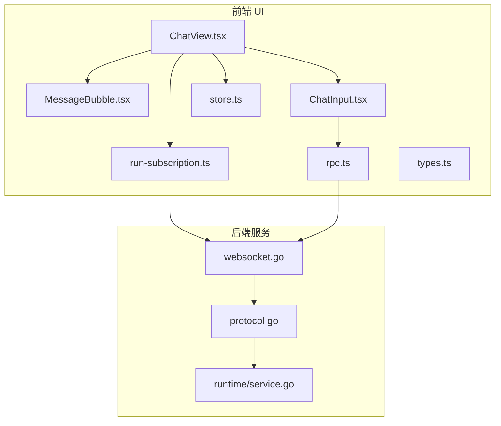
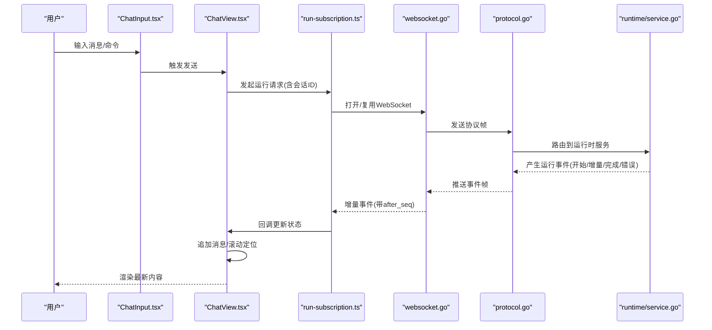
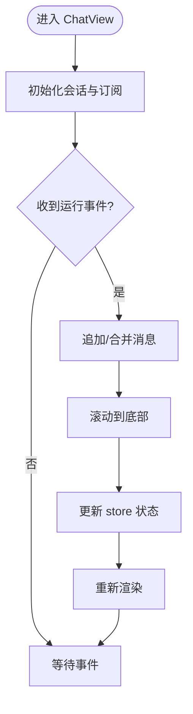
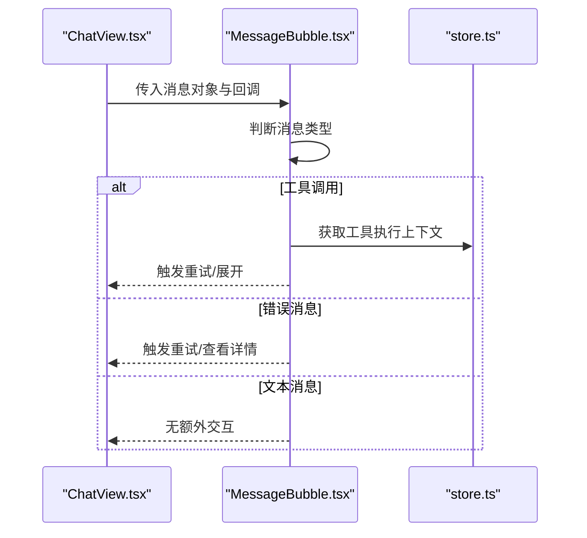
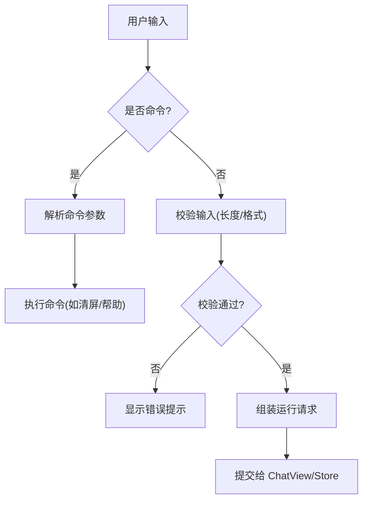
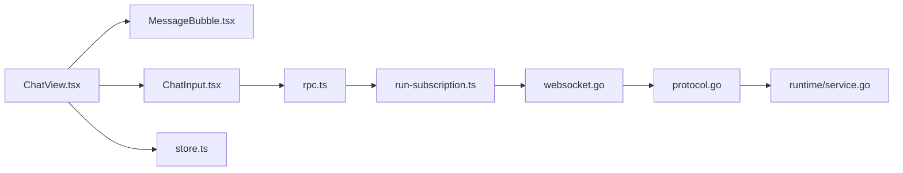

# 聊天组件

<cite>
**本文引用的文件**
- [ChatView.tsx](file://ui/src/components/chat/ChatView.tsx)
- [MessageBubble.tsx](file://ui/src/components/chat/MessageBubble.tsx)
- [ChatInput.tsx](file://ui/src/components/chat/ChatInput.tsx)
- [rpc.ts](file://ui/src/lib/rpc.ts)
- [run-subscription.ts](file://ui/src/lib/run-subscription.ts)
- [store.ts](file://ui/src/lib/store.ts)
- [types.ts](file://ui/src/lib/types.ts)
- [api.ts](file://ui/src/lib/api.ts)
- [websocket.go](file://internal/rpc/websocket.go)
- [protocol.go](file://internal/rpc/protocol.go)
- [service.go](file://internal/runtime/service.go)
</cite>

## 目录
1. [简介](#简介)
2. [项目结构](#项目结构)
3. [核心组件](#核心组件)
4. [架构总览](#架构总览)
5. [详细组件分析](#详细组件分析)
6. [依赖关系分析](#依赖关系分析)
7. [性能考虑](#性能考虑)
8. [故障排查指南](#故障排查指南)
9. [结论](#结论)
10. [附录：使用与扩展](#附录：使用与扩展)

## 简介
本文件面向 Vivy Studio 前端中的“聊天”能力，系统性说明 ChatView、MessageBubble、ChatInput 等关键组件的实现要点，覆盖消息流处理、实时通信集成、状态管理、事件处理与性能优化策略。文档同时给出使用示例与自定义扩展指南，帮助开发者快速上手并安全扩展聊天能力。

## 项目结构
聊天功能位于 ui/src/components/chat 目录，围绕三个核心组件组织：
- ChatView：会话主视图，负责消息列表渲染、滚动定位、输入框挂载、事件订阅与状态协调。
- MessageBubble：单条消息气泡，按消息类型（文本、工具调用、错误）渲染不同 UI，并承载用户交互（如重试、展开）。
- ChatInput：输入框组件，支持命令解析、快捷键、输入校验与发送。

此外，UI 通过 lib 层与后端交互：
- rpc.ts：封装 RPC 调用与事件订阅。
- run-subscription.ts：基于 WebSocket 的增量事件订阅与游标重放。
- store.ts：前端状态存储（会话、消息、运行上下文等）。
- types.ts：前后端共享的类型定义。
- api.ts：REST 辅助方法（如会话元数据操作）。

**图表来源**
- [ChatView.tsx:1-200](file://ui/src/components/chat/ChatView.tsx#L1-L200)
- [MessageBubble.tsx:1-200](file://ui/src/components/chat/MessageBubble.tsx#L1-L200)
- [ChatInput.tsx:1-200](file://ui/src/components/chat/ChatInput.tsx#L1-L200)
- [rpc.ts:1-200](file://ui/src/lib/rpc.ts#L1-L200)
- [run-subscription.ts:1-200](file://ui/src/lib/run-subscription.ts#L1-L200)
- [websocket.go:1-200](file://internal/rpc/websocket.go#L1-L200)
- [protocol.go:1-200](file://internal/rpc/protocol.go#L1-L200)
- [service.go:1-200](file://internal/runtime/service.go#L1-L200)

**章节来源**
- [ChatView.tsx:1-200](file://ui/src/components/chat/ChatView.tsx#L1-L200)
- [MessageBubble.tsx:1-200](file://ui/src/components/chat/MessageBubble.tsx#L1-L200)
- [ChatInput.tsx:1-200](file://ui/src/components/chat/ChatInput.tsx#L1-L200)
- [rpc.ts:1-200](file://ui/src/lib/rpc.ts#L1-L200)
- [run-subscription.ts:1-200](file://ui/src/lib/run-subscription.ts#L1-L200)
- [websocket.go:1-200](file://internal/rpc/websocket.go#L1-L200)
- [protocol.go:1-200](file://internal/rpc/protocol.go#L1-L200)
- [service.go:1-200](file://internal/runtime/service.go#L1-L200)

## 核心组件
- ChatView：聚合消息列表、输入框与运行时事件；维护当前会话 ID、滚动位置、加载态、错误态；订阅运行事件并驱动 UI 更新。
- MessageBubble：根据消息类型渲染不同内容区；对工具调用提供可折叠面板与重试入口；对错误消息提供重试或反馈入口。
- ChatInput：解析命令前缀、校验输入长度与格式、绑定快捷键（如 Enter 发送、Shift+Enter 换行）、将用户输入转换为运行请求。

**章节来源**
- [ChatView.tsx:1-200](file://ui/src/components/chat/ChatView.tsx#L1-L200)
- [MessageBubble.tsx:1-200](file://ui/src/components/chat/MessageBubble.tsx#L1-L200)
- [ChatInput.tsx:1-200](file://ui/src/components/chat/ChatInput.tsx#L1-L200)

## 架构总览
聊天模块采用“组件 + 状态 + 事件订阅”的分层设计：
- 表现层：ChatView/MessageBubble/ChatInput 负责渲染与交互。
- 状态层：store.ts 集中保存会话、消息、运行上下文等。
- 通信层：run-subscription.ts 基于 WebSocket 建立长连接，按 after_seq 游标增量接收事件；rpc.ts 封装请求/响应与事件分发。
- 服务端：websocket.go 提供 WebSocket 接入，protocol.go 定义消息协议，runtime/service.go 编排 Agent 运行并产出事件。

**图表来源**
- [ChatInput.tsx:1-200](file://ui/src/components/chat/ChatInput.tsx#L1-L200)
- [ChatView.tsx:1-200](file://ui/src/components/chat/ChatView.tsx#L1-L200)
- [run-subscription.ts:1-200](file://ui/src/lib/run-subscription.ts#L1-L200)
- [websocket.go:1-200](file://internal/rpc/websocket.go#L1-L200)
- [protocol.go:1-200](file://internal/rpc/protocol.go#L1-L200)
- [service.go:1-200](file://internal/runtime/service.go#L1-L200)

## 详细组件分析

### ChatView 主组件
职责
- 维护当前会话上下文与消息列表，监听运行事件并驱动 UI 更新。
- 管理滚动行为：新消息到达时自动滚动到底部，避免抖动。
- 处理错误与重试：捕获运行失败，提供重试入口。
- 与 ChatInput 协作：接收用户输入并发起运行。

关键流程
- 初始化：读取会话 ID，建立事件订阅，加载历史消息。
- 收到运行事件：按顺序追加消息片段，合并流式输出，更新状态。
- 用户交互：发送消息、切换会话、重试失败运行。

**图表来源**
- [ChatView.tsx:1-200](file://ui/src/components/chat/ChatView.tsx#L1-L200)
- [run-subscription.ts:1-200](file://ui/src/lib/run-subscription.ts#L1-L200)
- [store.ts:1-200](file://ui/src/lib/store.ts#L1-L200)

**章节来源**
- [ChatView.tsx:1-200](file://ui/src/components/chat/ChatView.tsx#L1-L200)
- [run-subscription.ts:1-200](file://ui/src/lib/run-subscription.ts#L1-L200)
- [store.ts:1-200](file://ui/src/lib/store.ts#L1-L200)

### MessageBubble 消息气泡
职责
- 根据消息类型渲染不同 UI：
  - 文本消息：显示富文本/代码块等。
  - 工具调用：展示工具名、参数摘要、结果摘要，支持折叠/展开。
  - 错误消息：高亮错误信息，提供重试或查看详情入口。
- 用户交互：点击展开/收起、重试工具调用、复制内容等。

交互序列

**图表来源**
- [MessageBubble.tsx:1-200](file://ui/src/components/chat/MessageBubble.tsx#L1-L200)
- [store.ts:1-200](file://ui/src/lib/store.ts#L1-L200)

**章节来源**
- [MessageBubble.tsx:1-200](file://ui/src/components/chat/MessageBubble.tsx#L1-L200)

### ChatInput 输入组件
职责
- 命令解析：识别以特定前缀开头的命令（如 /help、/clear），区分普通消息与指令。
- 快捷键支持：Enter 发送，Shift+Enter 换行，Tab 补全（若启用）。
- 输入验证：限制长度、过滤非法字符、提示错误。
- 发送逻辑：将输入转换为运行请求，交由 ChatView 或上层调度。

输入处理流程图

**图表来源**
- [ChatInput.tsx:1-200](file://ui/src/components/chat/ChatInput.tsx#L1-L200)

**章节来源**
- [ChatInput.tsx:1-200](file://ui/src/components/chat/ChatInput.tsx#L1-L200)

### ConversationSidebar 会话侧边栏
说明
- 仓库中未找到独立的 ConversationSidebar 组件实现。通常该侧边栏由布局组件或路由层管理，用于列出会话、搜索过滤与切换会话。
- 若需实现，建议：
  - 使用 store.ts 中的会话列表进行渲染。
  - 通过 api.ts 提供的接口获取会话元数据。
  - 结合本地搜索过滤（名称/时间/标签）。
  - 切换会话时重置 ChatView 状态并重建事件订阅。

[本节为概念性说明，不直接分析具体文件]

## 依赖关系分析
- 组件耦合
  - ChatView 依赖 MessageBubble 与 ChatInput，并通过 store.ts 共享状态。
  - ChatInput 依赖 rpc.ts 进行请求发送，依赖 store.ts 写入输入状态。
  - MessageBubble 仅消费 store.ts 中的消息数据，低耦合。
- 外部依赖
  - run-subscription.ts 依赖 websocket.go 提供的长连接。
  - protocol.go 定义前后端协议，确保事件序列化一致性。
  - runtime/service.go 作为事件生产者，驱动整个聊天流程。

**图表来源**
- [ChatView.tsx:1-200](file://ui/src/components/chat/ChatView.tsx#L1-L200)
- [MessageBubble.tsx:1-200](file://ui/src/components/chat/MessageBubble.tsx#L1-L200)
- [ChatInput.tsx:1-200](file://ui/src/components/chat/ChatInput.tsx#L1-L200)
- [rpc.ts:1-200](file://ui/src/lib/rpc.ts#L1-L200)
- [run-subscription.ts:1-200](file://ui/src/lib/run-subscription.ts#L1-L200)
- [websocket.go:1-200](file://internal/rpc/websocket.go#L1-L200)
- [protocol.go:1-200](file://internal/rpc/protocol.go#L1-L200)
- [service.go:1-200](file://internal/runtime/service.go#L1-L200)

**章节来源**
- [ChatView.tsx:1-200](file://ui/src/components/chat/ChatView.tsx#L1-L200)
- [MessageBubble.tsx:1-200](file://ui/src/components/chat/MessageBubble.tsx#L1-L200)
- [ChatInput.tsx:1-200](file://ui/src/components/chat/ChatInput.tsx#L1-L200)
- [rpc.ts:1-200](file://ui/src/lib/rpc.ts#L1-L200)
- [run-subscription.ts:1-200](file://ui/src/lib/run-subscription.ts#L1-L200)
- [websocket.go:1-200](file://internal/rpc/websocket.go#L1-L200)
- [protocol.go:1-200](file://internal/rpc/protocol.go#L1-L200)
- [service.go:1-200](file://internal/runtime/service.go#L1-L200)

## 性能考虑
- 流式渲染与增量更新
  - 使用 run-subscription.ts 的 after_seq 游标机制，避免重复拉取与丢失事件。
  - ChatView 在收到增量事件时仅追加/合并必要片段，减少整页重绘。
- 虚拟滚动与懒加载
  - 当消息量较大时，建议在 ChatView 中引入虚拟滚动，仅渲染可视区域的消息。
- 防抖与节流
  - 对高频输入（如粘贴大段文本）做防抖；对滚动事件做节流，降低重排压力。
- 内存管理
  - 及时清理事件订阅与 WebSocket 连接，避免内存泄漏。
  - 对工具调用的中间结果进行缓存与过期控制。
- 网络优化
  - 合并小事件批量推送；对错误事件进行去抖与重试上限控制。

[本节提供通用指导，不直接分析具体文件]

## 故障排查指南
常见问题与定位步骤
- 无法连接 WebSocket
  - 检查 websocket.go 端口与跨域配置；确认浏览器控制台无 CORS 错误。
  - 在 run-subscription.ts 中观察连接状态与重连逻辑。
- 消息不更新或卡顿
  - 检查 after_seq 是否正确递增；确认 ChatView 的滚动定位逻辑未阻塞主线程。
  - 使用浏览器性能面板分析重绘与布局抖动。
- 工具调用失败
  - 在 MessageBubble 的错误分支中查看错误码与消息；必要时添加重试与降级策略。
  - 核对 protocol.go 的工具调用协议字段是否完整。
- 命令解析异常
  - 在 ChatInput 中打印解析结果；确保命令前缀与参数格式符合约定。

**章节来源**
- [websocket.go:1-200](file://internal/rpc/websocket.go#L1-L200)
- [run-subscription.ts:1-200](file://ui/src/lib/run-subscription.ts#L1-L200)
- [ChatView.tsx:1-200](file://ui/src/components/chat/ChatView.tsx#L1-L200)
- [MessageBubble.tsx:1-200](file://ui/src/components/chat/MessageBubble.tsx#L1-L200)
- [ChatInput.tsx:1-200](file://ui/src/components/chat/ChatInput.tsx#L1-L200)
- [protocol.go:1-200](file://internal/rpc/protocol.go#L1-L200)

## 结论
聊天组件通过清晰的职责划分与事件驱动架构，实现了流畅的实时对话体验。ChatView 负责编排与状态协调，MessageBubble 专注消息渲染与交互，ChatInput 提供健壮的输入能力。配合 run-subscription 与后端 WebSocket 服务，系统具备良好的可扩展性与性能基础。建议在生产环境中引入虚拟滚动与更严格的错误重试策略，以提升大规模对话场景下的稳定性。

[本节为总结性内容，不直接分析具体文件]

## 附录：使用与扩展
- 基本用法
  - 在页面中引入 ChatView，并传入必要的会话上下文与回调。
  - 使用 ChatInput 作为输入源，默认支持 Enter 发送与 Shift+Enter 换行。
  - MessageBubble 会自动根据消息类型渲染，无需额外配置。
- 自定义扩展
  - 新增消息类型：在 MessageBubble 中添加分支逻辑，并在 store.ts 中扩展消息类型定义。
  - 自定义命令：在 ChatInput 中注册新的命令解析器与处理器。
  - 扩展事件：在后端 protocol.go 中定义新的事件帧，在前端 run-subscription.ts 中增加对应处理。
- 最佳实践
  - 保持 store 的状态最小化与不可变更新。
  - 对敏感信息进行脱敏，避免持久化密钥。
  - 为所有异步操作添加超时与重试上限，防止资源占用。

[本节为使用指南，不直接分析具体文件]