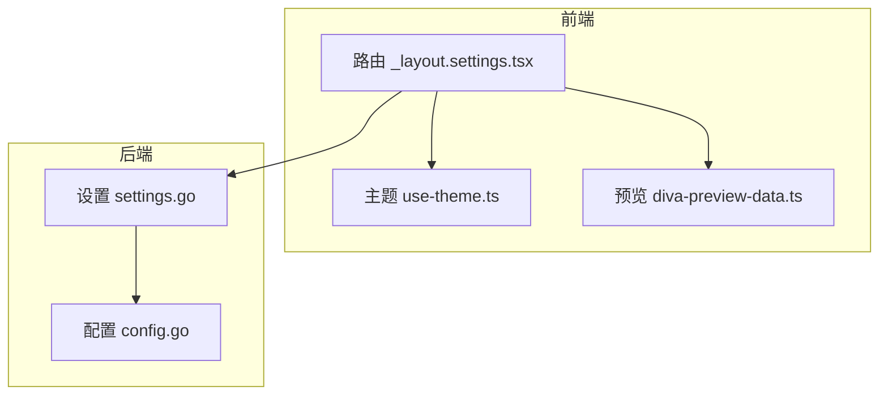
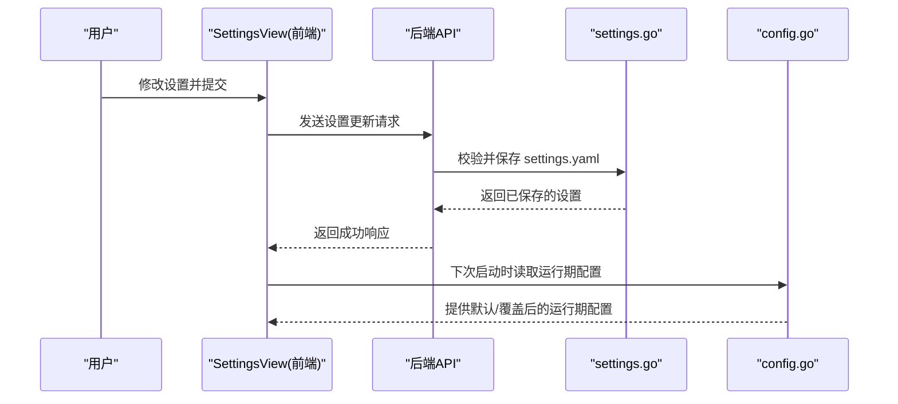
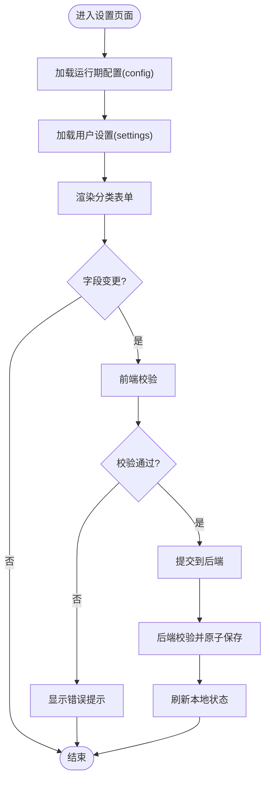
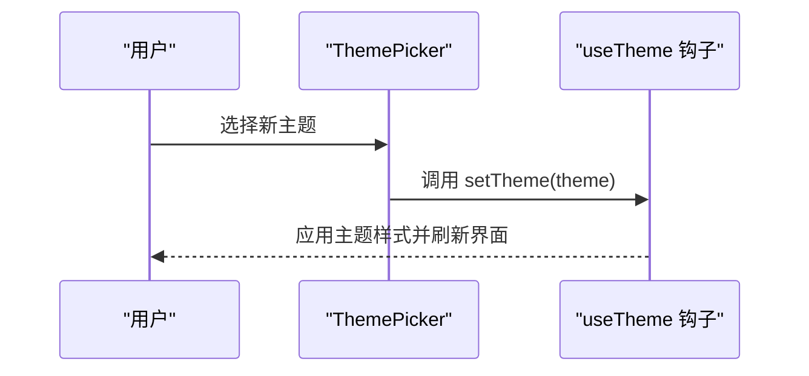
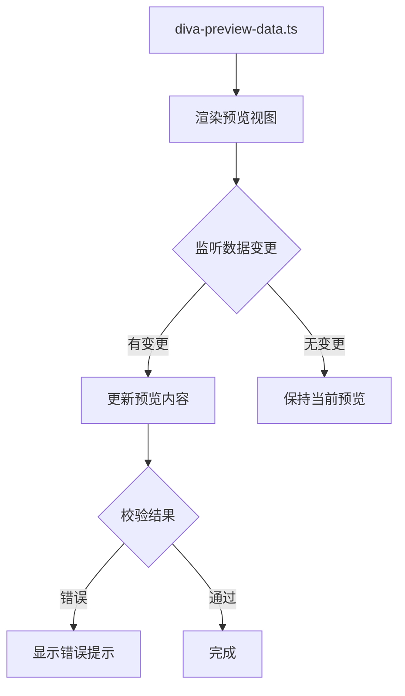
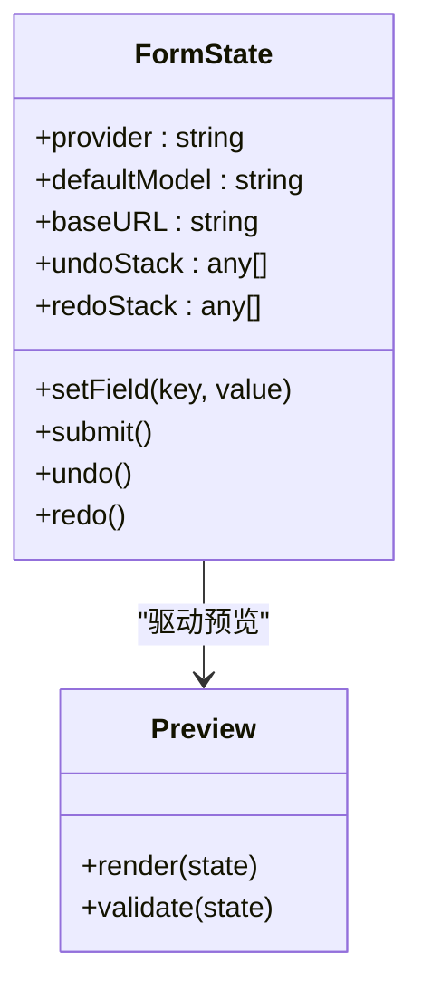
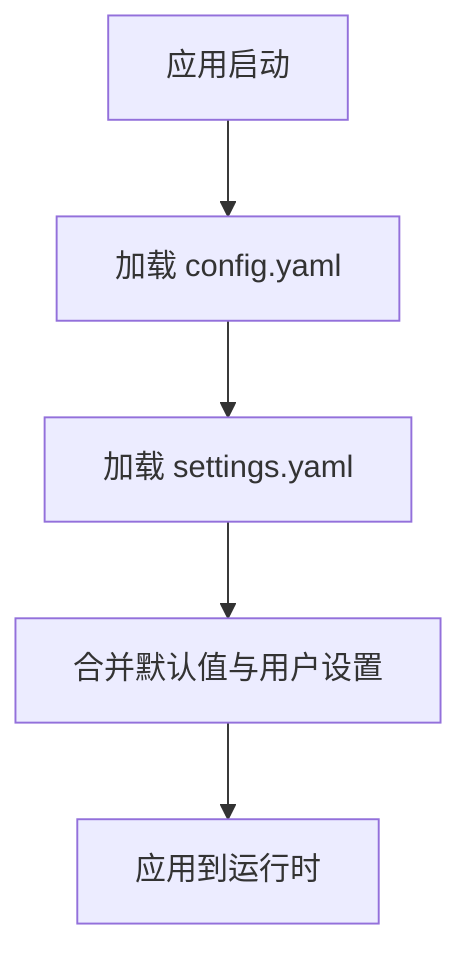
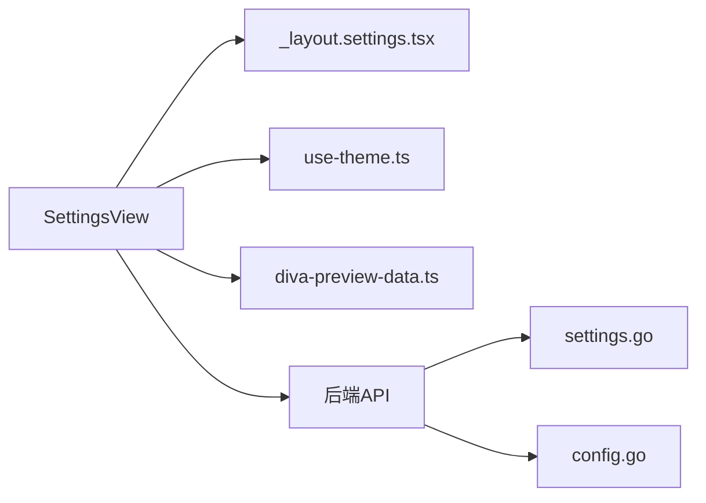

# 设置组件

<cite>
**本文引用的文件**
- [internal/app/settings/settings.go](file://internal/app/settings/settings.go)
- [internal/config/config.go](file://internal/config/config.go)
- [ui/src/routes/_layout.settings.tsx](file://ui/src/routes/_layout.settings.tsx)
- [ui/src/hooks/use-theme.ts](file://ui/src/hooks/use-theme.ts)
- [ui/src/components/settings/diva-preview-data.ts](file://ui/src/components/settings/diva-preview-data.ts)
</cite>

## 目录
1. [简介](#简介)
2. [项目结构](#项目结构)
3. [核心组件](#核心组件)
4. [架构总览](#架构总览)
5. [详细组件分析](#详细组件分析)
6. [依赖关系分析](#依赖关系分析)
7. [性能考虑](#性能考虑)
8. [故障排查指南](#故障排查指南)
9. [结论](#结论)
10. [附录](#附录)

## 简介
本文件面向“设置”相关的前后端能力，聚焦以下目标：
- SettingsView 主设置面板的实现要点（配置分类、表单验证、数据持久化）
- ThemePicker 主题选择器的主题切换逻辑、样式注入与动态应用
- DivaSettingsPreview 预览组件的配置预览、实时反馈与错误提示
- 设置项的数据绑定、变更监听、撤销/重做机制设计建议
- 与后端配置的同步、本地存储策略、默认值管理
- 设置扩展指南与自定义配置项开发方法

说明：当前仓库中前端路由已挂载 SettingsView，后端提供独立的 settings.yaml 持久化模型；主题系统由前端 hooks 驱动。下文将基于现有代码进行严谨分析与可落地的扩展建议。

## 项目结构
- 后端设置模型与持久化
  - internal/app/settings/settings.go：定义非敏感的设置模型、校验规则、读取/保存路径与原子写入策略
  - internal/config/config.go：定义启动时加载的强类型配置（config.yaml），包含服务器、存储、提供者、运行时、工具、治理等，并负责严格校验与默认值
- 前端路由与主题
  - ui/src/routes/_layout.settings.tsx：注册 /settings 路由，渲染 SettingsView
  - ui/src/hooks/use-theme.ts：主题切换钩子，负责主题状态与样式注入
- 预览数据
  - ui/src/components/settings/diva-preview-data.ts：为 DivaSettingsPreview 提供预览数据源

图表来源
- [ui/src/routes/_layout.settings.tsx:1-4](file://ui/src/routes/_layout.settings.tsx#L1-L4)
- [ui/src/hooks/use-theme.ts](file://ui/src/hooks/use-theme.ts)
- [ui/src/components/settings/diva-preview-data.ts](file://ui/src/components/settings/diva-preview-data.ts)
- [internal/app/settings/settings.go:1-133](file://internal/app/settings/settings.go#L1-L133)
- [internal/config/config.go:1-642](file://internal/config/config.go#L1-L642)

章节来源
- [ui/src/routes/_layout.settings.tsx:1-4](file://ui/src/routes/_layout.settings.tsx#L1-L4)
- [internal/app/settings/settings.go:1-133](file://internal/app/settings/settings.go#L1-L133)
- [internal/config/config.go:1-642](file://internal/config/config.go#L1-L642)

## 核心组件
- SettingsView（前端主设置面板）
  - 职责：承载设置分类、表单展示与提交、错误提示、与后端设置同步
  - 现状：路由已挂载，具体实现位于 components/settings/SettingsView（本仓库未展开）
- ThemePicker（主题选择器）
  - 职责：提供主题切换入口，调用 useTheme 钩子完成主题切换与样式注入
  - 现状：useTheme 钩子存在，主题切换逻辑由其封装
- DivaSettingsPreview（预览组件）
  - 职责：基于 diva-preview-data.ts 提供的数据，渲染设置项的预览效果，支持实时反馈与错误提示
  - 现状：预览数据源已存在，UI 组件细节待结合业务完善

章节来源
- [ui/src/routes/_layout.settings.tsx:1-4](file://ui/src/routes/_layout.settings.tsx#L1-L4)
- [ui/src/hooks/use-theme.ts](file://ui/src/hooks/use-theme.ts)
- [ui/src/components/settings/diva-preview-data.ts](file://ui/src/components/settings/diva-preview-data.ts)

## 架构总览
设置能力分为“运行期配置”和“用户偏好设置”两层：
- 运行期配置（config.yaml）：由 internal/config/config.go 在启动时加载与校验，决定服务端口、存储后端、Provider 包、运行时限制、工具白名单、治理策略等。该层不持久化密钥，仅引用环境变量名。
- 用户偏好设置（settings.yaml）：由 internal/app/settings/settings.go 维护，用于选择激活的 Provider 包、默认模型、可选 BaseURL。该文件独立于生产配置与 Journal，采用原子写入，重启生效。

图表来源
- [internal/app/settings/settings.go:70-133](file://internal/app/settings/settings.go#L70-L133)
- [internal/config/config.go:254-336](file://internal/config/config.go#L254-L336)

章节来源
- [internal/app/settings/settings.go:70-133](file://internal/app/settings/settings.go#L70-L133)
- [internal/config/config.go:254-336](file://internal/config/config.go#L254-L336)

## 详细组件分析

### SettingsView 主设置面板
- 配置分类
  - 建议按“Provider 选择”“默认模型”“BaseURL”“运行时开关”“工具与治理”等分组，对应后端 Config 与 Settings 的结构
  - 分类应与字段语义一致，便于表单布局与校验提示
- 表单验证
  - 前端需对 BaseURL 进行 http(s) 绝对地址校验；Provider 与 DefaultModel 需与后端允许值对齐
  - 校验失败即时提示，避免无效数据提交
- 数据持久化
  - 通过后端 settings.go 的 Save/Load 接口实现原子写入与校验
  - 注意：设置变更在下次启动生效（无热重载）
- 与后端同步
  - 提交后刷新本地缓存，确保 UI 与后端一致
  - 读取配置时优先使用用户设置，再叠加运行期默认值

图表来源
- [internal/app/settings/settings.go:70-133](file://internal/app/settings/settings.go#L70-L133)
- [internal/config/config.go:254-336](file://internal/config/config.go#L254-L336)

章节来源
- [internal/app/settings/settings.go:70-133](file://internal/app/settings/settings.go#L70-L133)
- [internal/config/config.go:254-336](file://internal/config/config.go#L254-L336)

### ThemePicker 主题选择器
- 主题切换逻辑
  - 通过 useTheme 钩子维护当前主题状态，切换时更新全局主题标识
- 样式注入与动态应用
  - 根据主题切换注入或切换 CSS 变量/类名，使界面即时响应
- 最佳实践
  - 保持主题枚举稳定，新增主题时统一注册
  - 避免在切换过程中触发不必要的重渲染

图表来源
- [ui/src/hooks/use-theme.ts](file://ui/src/hooks/use-theme.ts)

章节来源
- [ui/src/hooks/use-theme.ts](file://ui/src/hooks/use-theme.ts)

### DivaSettingsPreview 预览组件
- 配置预览
  - 基于 diva-preview-data.ts 提供的数据结构渲染预览卡片/列表
- 实时反馈
  - 当设置项变更时，预览区域应即时反映变化，提升用户感知
- 错误提示
  - 对非法输入进行高亮与提示，必要时禁用提交按钮

图表来源
- [ui/src/components/settings/diva-preview-data.ts](file://ui/src/components/settings/diva-preview-data.ts)

章节来源
- [ui/src/components/settings/diva-preview-data.ts](file://ui/src/components/settings/diva-preview-data.ts)

### 数据绑定、变更监听、撤销/重做机制
- 数据绑定
  - 将表单字段与本地状态双向绑定，提交前合并为完整设置对象
- 变更监听
  - 使用框架级订阅机制监听字段变化，触发预览更新与校验
- 撤销/重做
  - 建议在本地状态层维护操作栈，记录每次变更快照，支持撤销/重做
  - 注意：撤销/重做仅影响本地状态，最终持久化以提交为准

图表来源
- [ui/src/routes/_layout.settings.tsx:1-4](file://ui/src/routes/_layout.settings.tsx#L1-L4)
- [internal/app/settings/settings.go:43-107](file://internal/app/settings/settings.go#L43-L107)

章节来源
- [internal/app/settings/settings.go:43-107](file://internal/app/settings/settings.go#L43-L107)

### 与后端配置的同步、本地存储策略、默认值管理
- 同步策略
  - 启动时加载运行期配置（config.go），再加载用户设置（settings.go），后者可覆盖默认行为
  - 提交设置后，下次启动生效；如需立即生效，应在后端提供热重载能力（当前未实现）
- 本地存储策略
  - settings.yaml 原子写入，避免部分写入导致损坏
  - 配置文件不包含密钥，仅保存 env_key 名称
- 默认值管理
  - config.go 提供丰富的默认值；settings.go 的 Default() 返回空设置，表示“跟随配置默认”

图表来源
- [internal/config/config.go:254-336](file://internal/config/config.go#L254-L336)
- [internal/app/settings/settings.go:65-89](file://internal/app/settings/settings.go#L65-L89)

章节来源
- [internal/config/config.go:254-336](file://internal/config/config.go#L254-L336)
- [internal/app/settings/settings.go:65-89](file://internal/app/settings/settings.go#L65-L89)

### 设置扩展指南与自定义配置项开发方法
- 新增设置项步骤
  - 后端：在 settings.go 或 config.go 中扩展结构体与校验逻辑，确保字段安全与合法范围
  - 前端：在 SettingsView 中添加对应表单控件，实现绑定、校验与提交
  - 预览：在 diva-preview-data.ts 中补充预览数据，确保预览与真实值一致
- 主题扩展
  - 在 useTheme 中注册新主题，并在样式系统中提供对应的变量/类名
- 注意事项
  - 遵循密钥不持久化原则，仅保存 env_key
  - 所有新增字段需具备默认值与校验规则
  - 提交后重启生效，如需热重载需在后端增加相应能力

章节来源
- [internal/app/settings/settings.go:43-107](file://internal/app/settings/settings.go#L43-L107)
- [internal/config/config.go:254-336](file://internal/config/config.go#L254-L336)
- [ui/src/hooks/use-theme.ts](file://ui/src/hooks/use-theme.ts)
- [ui/src/components/settings/diva-preview-data.ts](file://ui/src/components/settings/diva-preview-data.ts)

## 依赖关系分析
- 前端依赖
  - SettingsView 依赖路由挂载与主题钩子
  - 预览组件依赖预览数据源
- 后端依赖
  - settings.go 依赖文件系统读写与 YAML 编解码
  - config.go 依赖严格解析与校验，保障启动安全

图表来源
- [ui/src/routes/_layout.settings.tsx:1-4](file://ui/src/routes/_layout.settings.tsx#L1-L4)
- [ui/src/hooks/use-theme.ts](file://ui/src/hooks/use-theme.ts)
- [ui/src/components/settings/diva-preview-data.ts](file://ui/src/components/settings/diva-preview-data.ts)
- [internal/app/settings/settings.go:1-133](file://internal/app/settings/settings.go#L1-L133)
- [internal/config/config.go:1-642](file://internal/config/config.go#L1-L642)

章节来源
- [ui/src/routes/_layout.settings.tsx:1-4](file://ui/src/routes/_layout.settings.tsx#L1-L4)
- [internal/app/settings/settings.go:1-133](file://internal/app/settings/settings.go#L1-L133)
- [internal/config/config.go:1-642](file://internal/config/config.go#L1-L642)

## 性能考虑
- 前端
  - 预览组件应避免频繁重渲染，使用局部更新与防抖
  - 主题切换尽量最小化 DOM 操作
- 后端
  - settings.yaml 原子写入减少并发写冲突风险
  - 配置校验在启动时完成，避免运行时开销

[本节为通用指导，无需特定文件来源]

## 故障排查指南
- 常见错误
  - BaseURL 格式不正确：检查是否为 http(s) 绝对地址
  - Provider 不支持：确认值为 openai、anthropic 或 mock
  - DefaultModel 未设置 Provider：必须先指定 Provider
  - 配置文件解析失败：检查 YAML 语法与字段名
- 定位方法
  - 查看后端日志中的校验错误信息
  - 前端控制台查看网络请求与校验提示

章节来源
- [internal/app/settings/settings.go:91-107](file://internal/app/settings/settings.go#L91-L107)
- [internal/config/config.go:316-336](file://internal/config/config.go#L316-L336)

## 结论
本仓库提供了清晰的后端设置模型与严格的配置校验机制，前端已具备设置路由与主题系统基础。建议在此基础上完善 SettingsView 的具体实现，增强表单校验、预览反馈与撤销/重做能力，并确保与后端设置的同步策略一致。主题扩展与预览数据完善将进一步提升用户体验。

[本节为总结性内容，无需特定文件来源]

## 附录
- 术语
  - 运行期配置：启动时加载的 config.yaml，决定服务与运行时行为
  - 用户设置：settings.yaml，用户偏好的非敏感设置
  - 原子写入：先写临时文件再替换，保证一致性
- 参考
  - 密钥不持久化：仅保存环境变量名，不在配置文件中出现密钥

[本节为附加说明，无需特定文件来源]