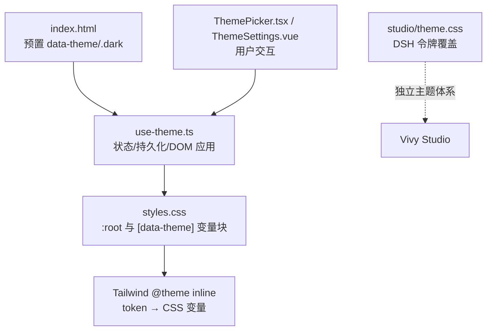
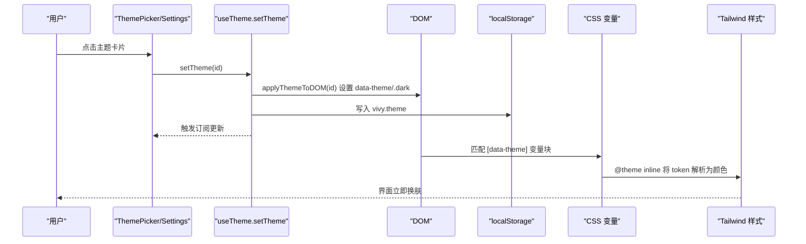
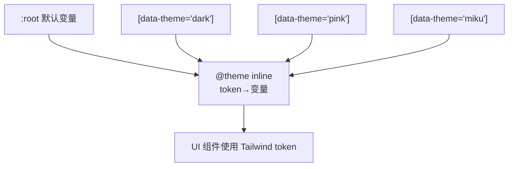
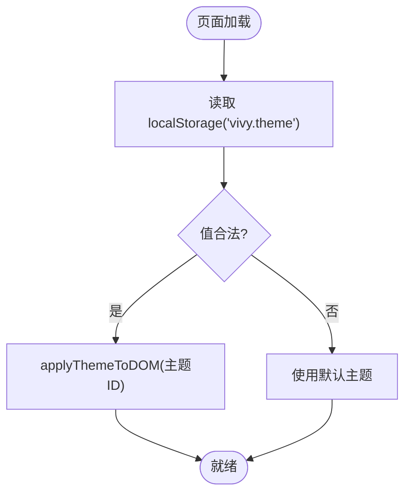
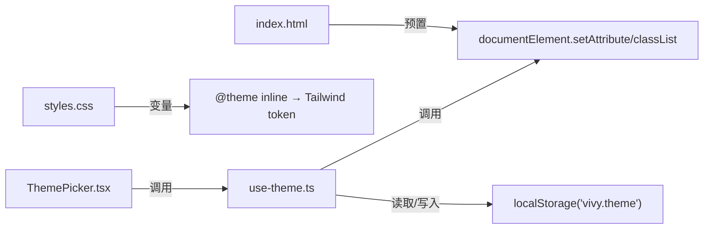

# 主题系统

<cite>
**本文引用的文件**
- [ui/src/hooks/use-theme.ts](file://ui/src/hooks/use-theme.ts)
- [ui/src/styles.css](file://ui/src/styles.css)
- [ui/index.html](file://ui/index.html)
- [ui/agent-diva-source/agent-diva-gui/tailwind.config.js](file://ui/agent-diva-source/agent-diva-gui/tailwind.config.js)
- [ui/agent-diva-source/agent-diva-gui/src/components/settings/ThemeSettings.vue](file://ui/agent-diva-source/agent-diva-gui/src/components/settings/ThemeSettings.vue)
- [ui/src/components/settings/ThemePicker.tsx](file://ui/src/components/settings/ThemePicker.tsx)
- [studio/dsh-vivy-studio/theme.css](file://studio/dsh-vivy-studio/theme.css)
</cite>

## 目录
1. [简介](#简介)
2. [项目结构](#项目结构)
3. [核心组件](#核心组件)
4. [架构总览](#架构总览)
5. [详细组件分析](#详细组件分析)
6. [依赖关系分析](#依赖关系分析)
7. [性能与可访问性](#性能与可访问性)
8. [故障排查](#故障排查)
9. [结论](#结论)
10. [附录：定制指南与最佳实践](#附录：定制指南与最佳实践)

## 简介
本主题系统基于 CSS 变量 + data-theme 属性选择器实现，提供默认、深色、粉色、Miku 四套内置主题。React 前端通过 useTheme 钩子管理状态、应用主题到 DOM、持久化到 localStorage；CSS 层使用 Tailwind v4 的 @theme inline 将语义化 token 映射到 CSS 变量；同时通过 .dark 类驱动 dark: 变体。Studio 侧采用独立的 Fluorite 主题体系，覆盖 DSH 设计令牌。

## 项目结构
- 运行时入口在 HTML 中预先设置 data-theme 与 .dark 类，避免首屏闪烁。
- React 前端主题逻辑集中在 hooks/use-theme.ts，负责主题注册表、DOM 应用、持久化与订阅通知。
- 样式层在 styles.css 中定义 :root 默认主题与各 [data-theme] 主题块，并通过 @theme inline 将 Tailwind 颜色 token 映射到 CSS 变量。
- Studio 使用独立 theme.css 覆盖 DSH 令牌，不依赖 data-theme 切换。

图表来源
- [ui/index.html:31-48](file://ui/index.html#L31-L48)
- [ui/src/hooks/use-theme.ts:73-112](file://ui/src/hooks/use-theme.ts#L73-L112)
- [ui/src/styles.css:10-52](file://ui/src/styles.css#L10-L52)
- [ui/src/styles.css:54-192](file://ui/src/styles.css#L54-L192)
- [ui/src/components/settings/ThemePicker.tsx:1-32](file://ui/src/components/settings/ThemePicker.tsx#L1-L32)
- [ui/agent-diva-source/agent-diva-gui/src/components/settings/ThemeSettings.vue:1-78](file://ui/agent-diva-source/agent-diva-gui/src/components/settings/ThemeSettings.vue#L1-L78)
- [studio/dsh-vivy-studio/theme.css:1-123](file://studio/dsh-vivy-studio/theme.css#L1-L123)

章节来源
- [ui/index.html:31-48](file://ui/index.html#L31-L48)
- [ui/src/hooks/use-theme.ts:1-118](file://ui/src/hooks/use-theme.ts#L1-L118)
- [ui/src/styles.css:1-213](file://ui/src/styles.css#L1-L213)
- [ui/src/components/settings/ThemePicker.tsx:1-32](file://ui/src/components/settings/ThemePicker.tsx#L1-L32)
- [ui/agent-diva-source/agent-diva-gui/src/components/settings/ThemeSettings.vue:1-78](file://ui/agent-diva-source/agent-diva-gui/src/components/settings/ThemeSettings.vue#L1-L78)
- [studio/dsh-vivy-studio/theme.css:1-123](file://studio/dsh-vivy-studio/theme.css#L1-L123)

## 核心组件
- 主题注册表与类型：定义 THEME_IDS、VivyTheme、外观 light/dark 及预览色板。
- DOM 应用：applyThemeToDOM 设置 data-theme 并同步 .dark 类以驱动 Tailwind 的 dark: 变体。
- 状态与持久化：readStoredTheme 从 localStorage 读取，setTheme 写入并触发订阅者更新。
- React 集成：useTheme 暴露当前主题、主题列表与 setTheme，供 UI 组件消费。
- 样式层：:root 默认主题与各 [data-theme] 主题块，@theme inline 将 Tailwind 颜色 token 映射到 CSS 变量。
- Studio 主题：独立 theme.css 覆盖 DSH 令牌，使用 body[data-ds-dark-theme] 控制暗色。

章节来源
- [ui/src/hooks/use-theme.ts:1-118](file://ui/src/hooks/use-theme.ts#L1-L118)
- [ui/src/styles.css:10-52](file://ui/src/styles.css#L10-L52)
- [ui/src/styles.css:54-192](file://ui/src/styles.css#L54-L192)
- [studio/dsh-vivy-studio/theme.css:1-123](file://studio/dsh-vivy-studio/theme.css#L1-L123)

## 架构总览
主题系统由“HTML 预渲染 + React 状态机 + CSS 变量 + Tailwind 映射”四层组成：
- HTML 在 React 加载前设置 data-theme 与 .dark，避免闪烁。
- React 模块维护当前主题、持久化与订阅通知。
- CSS 通过 :root 与 [data-theme] 提供完整变量集，@theme inline 将 Tailwind token 绑定到这些变量。
- 组件通过 useTheme 获取主题并调用 setTheme 完成切换。

图表来源
- [ui/src/components/settings/ThemePicker.tsx:1-32](file://ui/src/components/settings/ThemePicker.tsx#L1-L32)
- [ui/src/hooks/use-theme.ts:73-112](file://ui/src/hooks/use-theme.ts#L73-L112)
- [ui/src/styles.css:10-52](file://ui/src/styles.css#L10-L52)
- [ui/src/styles.css:54-192](file://ui/src/styles.css#L54-L192)

## 详细组件分析

### CSS 变量架构与主题集合
- 默认主题（default）：定义在 :root，包含背景、前景、卡片、主色、强调色、边框、图表等一组 oklch 色彩变量。
- 深色主题（dark）：[data-theme="dark"] 覆盖同一组变量，降低亮度、提高对比度。
- 粉色主题（pink）：[data-theme="pink"] 提供白底细粉线的浅色方案。
- Miku 主题（miku）：[data-theme="miku"] 提供 GitHub Dark 风格底色与应援青强调色。
- Tailwind 映射：@theme inline 将 --color-* 等 token 指向上述 CSS 变量，确保组件样式随主题变化。

图表来源
- [ui/src/styles.css:10-52](file://ui/src/styles.css#L10-L52)
- [ui/src/styles.css:54-192](file://ui/src/styles.css#L54-L192)

章节来源
- [ui/src/styles.css:10-52](file://ui/src/styles.css#L10-L52)
- [ui/src/styles.css:54-192](file://ui/src/styles.css#L54-L192)

### 主题切换机制与状态管理
- 初始化：index.html 在脚本中读取 vivy.theme，若合法则设置 data-theme，并根据 APPEARANCES 映射决定是否添加 .dark 类。
- 运行时切换：useTheme.setTheme 校验主题 ID，调用 applyThemeToDOM 设置 data-theme 与 .dark，写入 localStorage，并通知所有订阅者。
- 订阅机制：useSyncExternalStore 保证 React 组件在主题变化时重渲染。
- 测试支持：resetThemeForTests 用于重置模块内状态而不触碰 DOM 与存储。

图表来源
- [ui/index.html:31-48](file://ui/index.html#L31-L48)
- [ui/src/hooks/use-theme.ts:64-112](file://ui/src/hooks/use-theme.ts#L64-L112)

章节来源
- [ui/index.html:31-48](file://ui/index.html#L31-L48)
- [ui/src/hooks/use-theme.ts:64-112](file://ui/src/hooks/use-theme.ts#L64-L112)

### 内置主题的颜色定义与语义映射
- default：以 oklch 定义的蓝白浅色系，适合通用场景。
- dark：同构变量名但低亮度高对比度，适配夜间阅读。
- pink：白底+粉色强调，轻量简洁。
- miku：深灰底色+青色强调，适合开发者或二次元偏好。
- 语义变量：如 --primary、--accent、--background、--foreground 等被 @theme inline 映射到 Tailwind 的 --color-*，从而组件无需关心具体色值。

章节来源
- [ui/src/styles.css:54-192](file://ui/src/styles.css#L54-L192)
- [ui/src/styles.css:10-52](file://ui/src/styles.css#L10-L52)

### Tailwind CSS 集成
- 自定义变体：@custom-variant dark (&:is(.dark *)) 使 .dark 作用于后代元素，配合 applyThemeToDOM 的 classList.toggle 生效。
- 颜色映射：@theme inline 将 --color-background、--color-primary 等 token 指向 CSS 变量，实现主题感知。
- 字体与圆角：通过 --font-sans、--radius-* 等变量统一控制。
- 扩展配置（Agent-Diva 分支）：tailwind.config.js 中定义了 surface、ink、line、brand、accent、state 等语义色，以及 tk-* 字号阶梯、tk 圆角与阴影，全部映射到 CSS 变量，便于跨主题复用。

章节来源
- [ui/src/styles.css:1-52](file://ui/src/styles.css#L1-L52)
- [ui/agent-diva-source/agent-diva-gui/tailwind.config.js:1-81](file://ui/agent-diva-source/agent-diva-gui/tailwind.config.js#L1-L81)

### 主题定制指南
- 新增主题步骤
  1) 在 styles.css 中添加 [data-theme="your-theme"] 块，覆盖所有必要变量（背景、前景、主色、强调色、边框、图表、侧边栏等）。
  2) 在 use-theme.ts 的 THEMES 数组中注册新主题，提供 id、label、description、appearance、preview、accent。
  3) 如需启用 dark: 变体，确保 appearance 为 'dark'，以便 applyThemeToDOM 自动添加 .dark 类。
  4) 在 index.html 的 APPEARANCES 中补充映射，避免首屏闪烁。
- 颜色对比度检查
  - 优先使用 oklch 或高对比度配色组合，确保文本与背景对比度满足 WCAG AA。
  - 对状态色（danger/success/warning/info）需分别验证明暗模式下的可读性。
- 无障碍访问考虑
  - 保持焦点可见性（ring 变量），避免仅用颜色表达状态。
  - 为交互控件提供 aria-pressed 等语义属性（ThemePicker 已体现）。
  - 尊重 prefers-reduced-motion（Studio 主题已处理）。

章节来源
- [ui/src/styles.css:54-192](file://ui/src/styles.css#L54-L192)
- [ui/src/hooks/use-theme.ts:22-55](file://ui/src/hooks/use-theme.ts#L22-L55)
- [ui/index.html:31-48](file://ui/index.html#L31-L48)
- [ui/src/components/settings/ThemePicker.tsx:19-32](file://ui/src/components/settings/ThemePicker.tsx#L19-L32)
- [studio/dsh-vivy-studio/theme.css:363-368](file://studio/dsh-vivy-studio/theme.css#L363-L368)

### 代码示例与最佳实践
- 在组件中使用主题
  - 通过 useTheme 获取 theme、themes、setTheme，并在设置页渲染主题卡片。
  - 使用 Tailwind 的 text-primary、bg-accent 等 token，而非硬编码颜色。
- 避免闪烁
  - 保留 index.html 中的内联脚本与 APPEARANCES 映射，确保 React 挂载前已有正确背景与文字色。
- 测试建议
  - 使用 resetThemeForTests 重置模块状态，结合 Vitest 断言 data-theme 与 .dark 类是否正确设置。

章节来源
- [ui/src/components/settings/ThemePicker.tsx:1-32](file://ui/src/components/settings/ThemePicker.tsx#L1-L32)
- [ui/src/hooks/use-theme.test.ts:78-154](file://ui/src/hooks/use-theme.test.ts#L78-L154)

## 依赖关系分析
- use-theme.ts 依赖 React 的 useSyncExternalStore 进行状态订阅。
- styles.css 依赖 Tailwind v4 的 @import/@theme/@custom-variant。
- index.html 与 use-theme.ts 必须保持 APPEARANCES 与 THEME_IDS 一致，否则可能出现主题不一致或闪烁。
- Studio 主题与 Vivy UI 主题相互独立，互不影响。

图表来源
- [ui/src/hooks/use-theme.ts:73-112](file://ui/src/hooks/use-theme.ts#L73-L112)
- [ui/src/styles.css:10-52](file://ui/src/styles.css#L10-L52)
- [ui/index.html:31-48](file://ui/index.html#L31-L48)
- [ui/src/components/settings/ThemePicker.tsx:1-32](file://ui/src/components/settings/ThemePicker.tsx#L1-L32)

章节来源
- [ui/src/hooks/use-theme.ts:73-112](file://ui/src/hooks/use-theme.ts#L73-L112)
- [ui/src/styles.css:10-52](file://ui/src/styles.css#L10-L52)
- [ui/index.html:31-48](file://ui/index.html#L31-L48)
- [ui/src/components/settings/ThemePicker.tsx:1-32](file://ui/src/components/settings/ThemePicker.tsx#L1-L32)

## 性能与可访问性
- 性能
  - 使用 CSS 变量与 data-theme 切换，避免 JS 频繁操作样式，减少重排重绘。
  - 首屏通过 index.html 内联样式与脚本提前应用主题，降低闪烁。
- 可访问性
  - 使用语义化 token 与 ring 变量保障焦点可见性。
  - 按钮提供 aria-pressed 指示选中状态。
  - 尊重 reduced motion 设置（Studio 主题已处理）。

章节来源
- [ui/src/styles.css:194-213](file://ui/src/styles.css#L194-L213)
- [ui/src/components/settings/ThemePicker.tsx:19-32](file://ui/src/components/settings/ThemePicker.tsx#L19-L32)
- [studio/dsh-vivy-studio/theme.css:363-368](file://studio/dsh-vivy-studio/theme.css#L363-L368)

## 故障排查
- 主题未生效
  - 检查 index.html 的 APPEARANCES 是否与 use-theme.ts 的 THEME_IDS 一致。
  - 确认 applyThemeToDOM 是否被调用，data-theme 与 .dark 类是否正确设置。
- 闪烁问题
  - 确保 index.html 的内联样式与脚本先于 React 加载执行。
- 存储不可用
  - 在测试或隐私模式下，setTheme 会捕获异常并继续应用主题，不会中断流程。
- Studio 主题冲突
  - Studio 使用 body[data-ds-dark-theme] 控制暗色，与 Vivy UI 的 data-theme 无关，注意不要混用。

章节来源
- [ui/index.html:31-48](file://ui/index.html#L31-L48)
- [ui/src/hooks/use-theme.ts:91-102](file://ui/src/hooks/use-theme.ts#L91-L102)
- [studio/dsh-vivy-studio/theme.css:125-226](file://studio/dsh-vivy-studio/theme.css#L125-L226)

## 结论
该主题系统通过 CSS 变量与 data-theme 实现解耦的主题切换，结合 Tailwind 的 @theme inline 将语义 token 与变量绑定，既保证了灵活性又降低了耦合。useTheme 提供了清晰的状态管理与持久化能力，index.html 的预渲染策略有效避免了首屏闪烁。Studio 主题独立演进，互不干扰。遵循本文的定制指南与最佳实践，可安全地扩展主题并提升可访问性与性能。

## 附录：定制指南与最佳实践
- 新增主题清单
  - 在 styles.css 添加 [data-theme="your-theme"] 变量块。
  - 在 use-theme.ts 的 THEMES 注册新主题元数据。
  - 在 index.html 的 APPEARANCES 中补充映射。
  - 如需 dark: 变体，设置 appearance 为 'dark'。
- 颜色与对比度
  - 使用 oklch 或经过对比度校验的色值。
  - 对状态色分别验证明暗模式下的可读性。
- 无障碍
  - 保持焦点可见性，避免仅用颜色表达状态。
  - 为交互控件提供合适的 ARIA 属性。
- 组件使用
  - 通过 useTheme 获取主题并调用 setTheme。
  - 使用 Tailwind token（如 text-primary、bg-accent）而非硬编码颜色。
- 测试
  - 使用 resetThemeForTests 重置状态，断言 data-theme 与 .dark 类。
  - 模拟 localStorage 验证持久化行为。

章节来源
- [ui/src/styles.css:54-192](file://ui/src/styles.css#L54-L192)
- [ui/src/hooks/use-theme.ts:22-55](file://ui/src/hooks/use-theme.ts#L22-L55)
- [ui/index.html:31-48](file://ui/index.html#L31-L48)
- [ui/src/components/settings/ThemePicker.tsx:1-32](file://ui/src/components/settings/ThemePicker.tsx#L1-L32)
- [ui/src/hooks/use-theme.test.ts:78-154](file://ui/src/hooks/use-theme.test.ts#L78-L154)