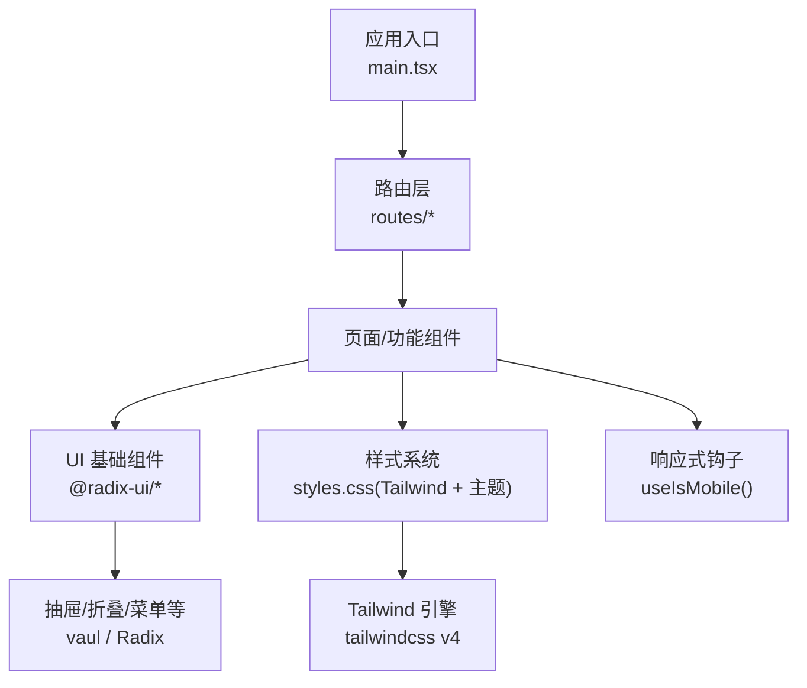
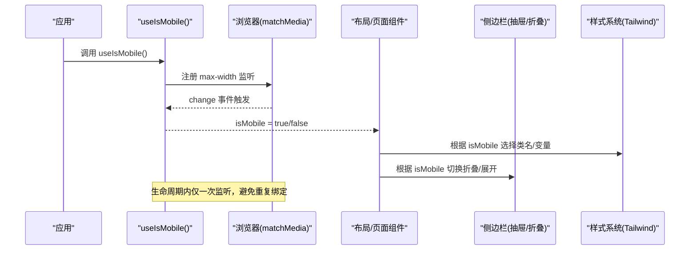
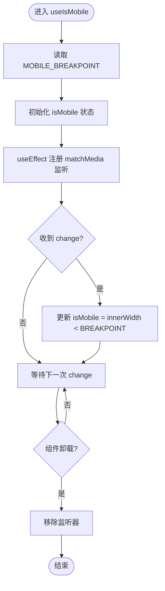
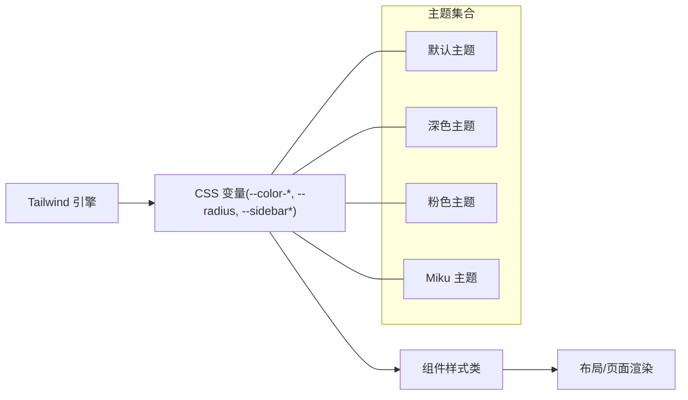
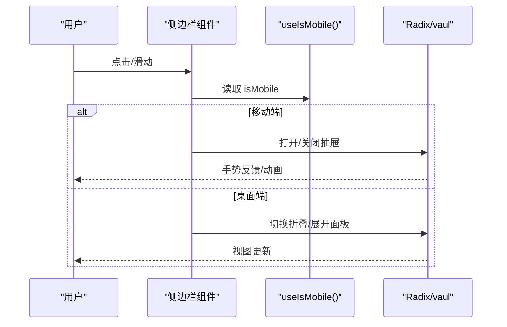
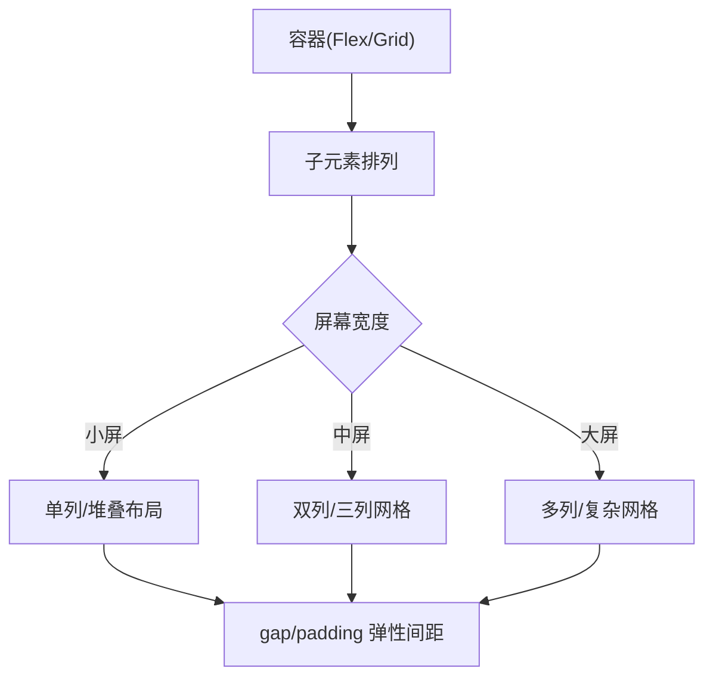
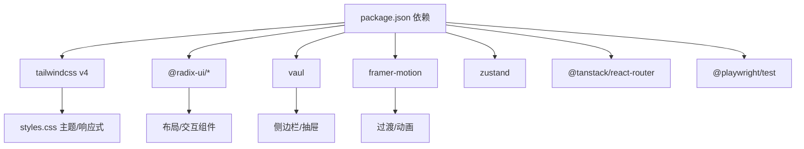

# 响应式设计

<cite>
**本文引用的文件**
- [ui/src/hooks/use-mobile.tsx](file://ui/src/hooks/use-mobile.tsx)
- [ui/src/styles.css](file://ui/src/styles.css)
- [ui/package.json](file://ui/package.json)
</cite>

## 目录
1. [简介](#简介)
2. [项目结构](#项目结构)
3. [核心组件](#核心组件)
4. [架构总览](#架构总览)
5. [详细组件分析](#详细组件分析)
6. [依赖分析](#依赖分析)
7. [性能考虑](#性能考虑)
8. [故障排查指南](#故障排查指南)
9. [结论](#结论)
10. [附录](#附录)

## 简介
本章节面向 Vivy 前端（React + Vite）的响应式设计实现，聚焦移动端适配策略、断点与布局切换、触摸交互优化；深入解析 use-mobile 钩子的窗口尺寸监听、状态同步与性能优化；说明侧边栏在移动端的折叠/展开、手势支持与键盘导航；介绍基于 Tailwind 的网格系统与弹性间距实践；并提供多设备测试方法与调试技巧。

## 项目结构
Vivy 的前端位于 ui 目录，采用 React + Vite 构建，样式体系基于 Tailwind CSS v4，并通过自定义主题变量提供多套皮肤。响应式能力由以下关键部分构成：
- 媒体查询与断点：通过 Tailwind 的响应式前缀与 @theme 变量集中管理。
- 移动端检测：useIsMobile 钩子统一判断是否处于移动端视口。
- 主题与侧边栏：CSS 中定义 sidebar 相关令牌，配合 Radix UI 组件实现可折叠侧边栏。
- 工具链：Tailwind v4、Radix UI、vaul（抽屉）、framer-motion（动画）等库支撑响应式与交互体验。

图表来源
- [ui/src/styles.css:1-213](file://ui/src/styles.css#L1-L213)
- [ui/package.json:14-69](file://ui/package.json#L14-L69)

章节来源
- [ui/src/styles.css:1-213](file://ui/src/styles.css#L1-L213)
- [ui/package.json:1-82](file://ui/package.json#L1-L82)

## 核心组件
- 移动端检测钩子：useIsMobile
  - 职责：基于 window.matchMedia 监听最大宽度断点，返回布尔值表示是否处于移动端。
  - 行为：初始化时立即计算一次，并订阅 change 事件以同步状态；卸载时移除监听器。
  - 断点：使用常量 MOBILE_BREAKPOINT 作为阈值（当前为 768px）。
- 样式与主题：styles.css
  - 职责：集中声明 Tailwind 主题变量、颜色、圆角、字体以及深色/浅色/品牌主题。
  - 响应式：通过 Tailwind 的响应式类名与 @theme 变量驱动不同屏幕下的视觉与布局变化。
  - 侧边栏令牌：定义 --sidebar-* 系列变量，便于在不同主题下保持一致的侧边栏外观。
- 依赖与工具：package.json
  - 职责：声明 Tailwind v4、Radix UI、vaul、framer-motion 等用于响应式与交互的依赖。
  - 脚本：提供 dev/build/preview/e2e 等命令，便于本地开发与测试。

章节来源
- [ui/src/hooks/use-mobile.tsx:1-20](file://ui/src/hooks/use-mobile.tsx#L1-L20)
- [ui/src/styles.css:1-213](file://ui/src/styles.css#L1-L213)
- [ui/package.json:1-82](file://ui/package.json#L1-L82)

## 架构总览
下图展示了响应式数据流与组件协作关系：useIsMobile 提供 isMobile 状态，页面与布局组件据此切换布局；样式层通过 Tailwind 响应式类与主题变量控制视觉；侧边栏借助 Radix/vaul 实现折叠与手势支持。

图表来源
- [ui/src/hooks/use-mobile.tsx:5-18](file://ui/src/hooks/use-mobile.tsx#L5-L18)
- [ui/src/styles.css:10-52](file://ui/src/styles.css#L10-L52)

## 详细组件分析

### 移动端检测钩子：useIsMobile
- 设计要点
  - 使用 matchMedia 监听 max-width 断点，保证与 Tailwind 响应式断点一致。
  - 初始渲染即设置状态，避免闪烁。
  - 在 effect 中注册/注销监听器，确保内存安全。
- 复杂度
  - 时间复杂度：O(1) 每次变更回调。
  - 空间复杂度：O(1)，仅维护一个布尔状态与一个监听句柄。
- 性能优化
  - 仅在挂载时注册一次监听，避免频繁 re-render。
  - 使用 window.innerWidth 做兜底判断，兼容不支持 matchMedia 的环境（极少见）。
- 扩展建议
  - 可将断点提取为配置项，便于按设备族调整。
  - 如需更细粒度（如横竖屏），可增加 orientation 监听。

图表来源
- [ui/src/hooks/use-mobile.tsx:5-18](file://ui/src/hooks/use-mobile.tsx#L5-L18)

章节来源
- [ui/src/hooks/use-mobile.tsx:1-20](file://ui/src/hooks/use-mobile.tsx#L1-L20)

### 样式系统与主题：styles.css
- 断点与主题
  - 通过 @theme 将设计令牌映射到 CSS 变量，便于跨组件复用。
  - 提供默认、深色、粉色、Miku 等多套主题，覆盖背景、前景、边框、侧边栏等。
- 侧边栏令牌
  - 定义 --sidebar、--sidebar-foreground、--sidebar-primary 等变量，统一侧边栏配色。
- 全局容器
  - html/body/#root 使用 100dvh 高度与 overflow:hidden，避免移动端滚动抖动。
- 响应式实践
  - 结合 Tailwind 响应式前缀（sm/md/lg/xl）与主题变量，实现不同屏幕下的布局与视觉切换。

图表来源
- [ui/src/styles.css:10-52](file://ui/src/styles.css#L10-L52)
- [ui/src/styles.css:54-192](file://ui/src/styles.css#L54-L192)

章节来源
- [ui/src/styles.css:1-213](file://ui/src/styles.css#L1-L213)

### 侧边栏响应式行为（折叠/展开、手势、键盘）
- 折叠/展开
  - 在移动端（isMobile=true）时，侧边栏通常以抽屉形式呈现，通过 vaul 或 Radix Dialog/Collapsible 控制 open 状态。
  - 在大屏上，侧边栏常驻显示，可通过按钮切换收起/展开。
- 手势支持
  - 利用 vaul 的拖拽手势，支持从边缘滑动打开/关闭抽屉。
  - 结合 framer-motion 可实现平滑过渡动画。
- 键盘导航
  - 遵循 Radix 的可访问性约定：Esc 关闭、Tab 聚焦循环、方向键在菜单中导航。
  - 建议在移动端优先使用手势，同时保留键盘操作以提升可访问性。
- 与 isMobile 联动
  - 当 isMobile 变化时，自动切换抽屉模式与常驻模式，避免状态不一致。

图表来源
- [ui/src/hooks/use-mobile.tsx:5-18](file://ui/src/hooks/use-mobile.tsx#L5-L18)
- [ui/package.json:16-66](file://ui/package.json#L16-L66)

章节来源
- [ui/package.json:14-69](file://ui/package.json#L14-L69)

### 网格系统与布局组件（Flexbox/Grid/弹性间距）
- Flexbox
  - 使用 Tailwind 的 flex/flex-col/flex-row 等类快速搭建一维布局。
  - 通过 justify-* 与 items-* 控制主轴/交叉轴对齐。
- Grid
  - 使用 grid/grid-cols-* 创建二维网格，结合 gap 控制弹性间距。
  - 在小屏下可切换为单列，大屏下多列展示。
- 弹性间距
  - 使用 gap/padding/margin 组合，保持内容呼吸感。
  - 在移动端适当减小间距，提升信息密度与可用性。
- 与主题联动
  - 通过 --color-* 变量统一色彩，确保不同主题下的一致性。

[本节为概念性说明，不直接分析具体文件]

## 依赖分析
- 样式与动画
  - tailwindcss v4：提供响应式类与主题变量编译能力。
  - tw-animate-css：增强动画效果。
- 交互组件
  - @radix-ui/*：提供无样式、高可访问性的基础组件（Dialog、Collapsible、Tabs、Tooltip 等）。
  - vaul：移动端抽屉组件，支持手势与键盘。
  - framer-motion：高级动画与过渡。
- 状态与路由
  - zustand：轻量状态管理。
  - @tanstack/react-router：客户端路由。
- 构建与测试
  - vite：开发服务器与构建。
  - playwright：端到端测试。

图表来源
- [ui/package.json:14-69](file://ui/package.json#L14-L69)

章节来源
- [ui/package.json:1-82](file://ui/package.json#L1-L82)

## 性能考虑
- 监听与重渲染
  - useIsMobile 仅注册一次 matchMedia 监听，避免频繁 re-render。
  - 将 isMobile 提升到尽可能高的层级，减少重复计算。
- 样式与主题
  - 使用 Tailwind 原子类减少自定义 CSS 体积。
  - 主题变量集中管理，避免重复定义。
- 动画与手势
  - 合理使用 framer-motion 的 will-change 与 transform，避免重排。
  - 在低端设备上降级动画强度。
- 构建与加载
  - 按需引入 Radix 组件，减少打包体积。
  - 使用 Vite 的预构建与缓存加速开发体验。

[本节提供通用指导，不直接分析具体文件]

## 故障排查指南
- 移动端断点不生效
  - 检查 useIsMobile 的断点常量是否与 Tailwind 响应式断点一致。
  - 确认样式类是否正确使用了响应式前缀。
- 侧边栏无法关闭
  - 检查 vaul/Radix 的 open 状态是否被正确受控。
  - 确认键盘事件（Esc）与手势事件未被其他组件拦截。
- 主题切换异常
  - 确认 data-theme 属性已正确应用到根节点。
  - 检查 CSS 变量是否被覆盖或未生效。
- 真机调试问题
  - 使用浏览器开发者工具的“设备模拟”先复现问题。
  - 通过 USB 连接真机进行远程调试，观察真实触摸与滚动行为。
  - 在移动端 Safari 开启 Web Inspector，查看控制台与网络请求。

章节来源
- [ui/src/hooks/use-mobile.tsx:5-18](file://ui/src/hooks/use-mobile.tsx#L5-L18)
- [ui/src/styles.css:54-192](file://ui/src/styles.css#L54-L192)
- [ui/package.json:16-66](file://ui/package.json#L16-L66)

## 结论
本项目通过 useIsMobile 钩子与 Tailwind v4 的主题/响应式体系，构建了清晰的移动端适配方案。侧边栏借助 Radix 与 vaul 实现了手势与键盘友好的折叠/展开体验。整体架构解耦良好，易于扩展与维护。建议在后续迭代中持续优化动画性能、完善可访问性，并建立完善的跨设备测试用例。

[本节为总结性内容，不直接分析具体文件]

## 附录
- 常用断点建议
  - 手机：<768px（与 useIsMobile 断点对齐）
  - 平板：768px–1024px
  - 桌面：≥1024px
- 最佳实践
  - 优先使用 Flex/Grid 与 gap 构建弹性布局。
  - 在移动端优先使用手势，同时保留键盘与焦点管理。
  - 将主题变量与响应式类作为单一事实源，避免硬编码尺寸与颜色。
- 测试方法
  - 使用 Playwright 编写跨设备 E2E 用例，覆盖折叠/展开、手势、键盘导航。
  - 在 Chrome DevTools 中切换设备像素比与触控模拟，验证交互。
  - 真机调试时关注滚动抖动、触摸延迟与动画卡顿。

[本节为补充信息，不直接分析具体文件]