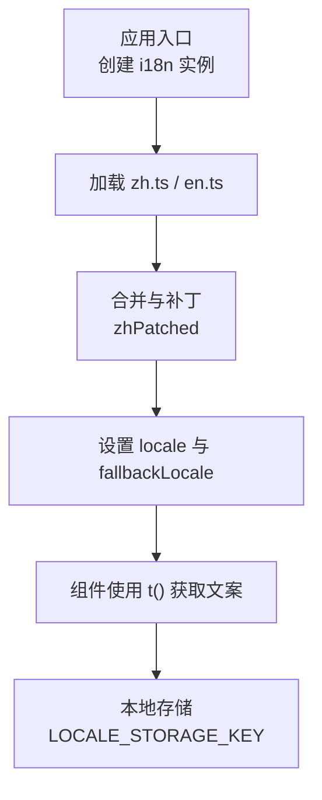
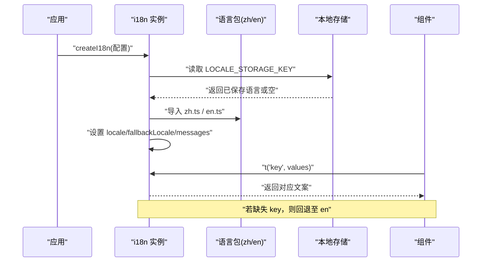
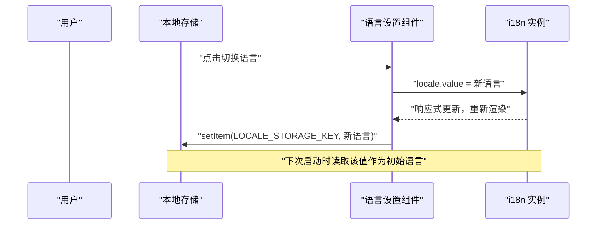
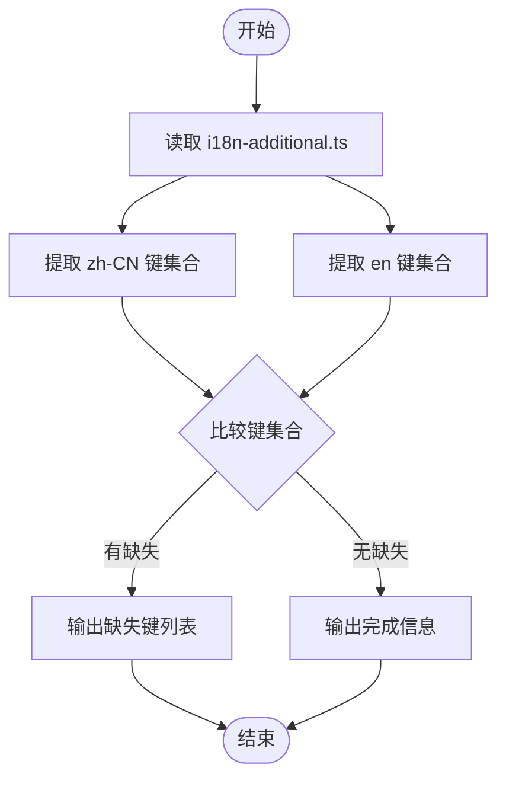
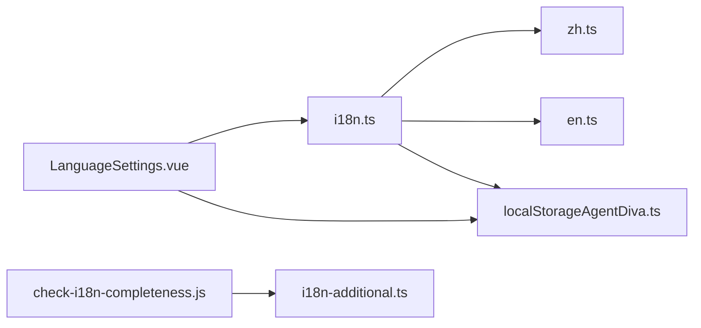

# 国际化

<cite>
**本文引用的文件**
- [i18n.ts](file://ui/agent-diva-source/agent-diva-gui/src/i18n.ts)
- [zh.ts](file://ui/agent-diva-source/agent-diva-gui/src/locales/zh.ts)
- [en.ts](file://ui/agent-diva-source/agent-diva-gui/src/locales/en.ts)
- [LanguageSettings.vue](file://ui/agent-diva-source/agent-diva-gui/src/components/settings/LanguageSettings.vue)
- [localStorageAgentDiva.ts](file://ui/agent-diva-source/agent-diva-gui/src/utils/localStorageAgentDiva.ts)
- [check-i18n-completeness.js](file://scripts/check-i18n-completeness.js)
</cite>

## 目录
1. [简介](#简介)
2. [项目结构](#项目结构)
3. [核心组件](#核心组件)
4. [架构总览](#架构总览)
5. [详细组件分析](#详细组件分析)
6. [依赖关系分析](#依赖关系分析)
7. [性能考量](#性能考量)
8. [故障排查指南](#故障排查指南)
9. [结论](#结论)
10. [附录](#附录)

## 简介
本文件面向 Vivy 前端（Vue + vue-i18n）的国际化实现，系统性说明多语言文件组织、翻译键结构、动态语言切换、本地存储持久化、以及翻译质量保障工具链。文档同时给出新增语言的流程与最佳实践建议，帮助团队在保持高一致性的前提下扩展更多语言。

## 项目结构
当前国际化采用“按功能域分块”的扁平对象结构，所有文案以模块为命名空间组织，便于维护与检索。运行时通过 vue-i18n 实例集中管理消息与回退策略，并在应用启动时从本地存储读取用户偏好语言。

图示来源
- [i18n.ts:1-7](file://ui/agent-diva-source/agent-diva-gui/src/i18n.ts#L1-L7)
- [i18n.ts:348-356](file://ui/agent-diva-source/agent-diva-gui/src/i18n.ts#L348-L356)
- [localStorageAgentDiva.ts:3-10](file://ui/agent-diva-source/agent-diva-gui/src/utils/localStorageAgentDiva.ts#L3-L10)

章节来源
- [i18n.ts:1-7](file://ui/agent-diva-source/agent-diva-gui/src/i18n.ts#L1-L7)
- [i18n.ts:348-356](file://ui/agent-diva-source/agent-diva-gui/src/i18n.ts#L348-L356)
- [localStorageAgentDiva.ts:3-10](file://ui/agent-diva-source/agent-diva-gui/src/utils/localStorageAgentDiva.ts#L3-L10)

## 核心组件
- 国际化配置与初始化：负责导入语言包、读取本地存储中的语言、设置默认与回退语言、注入消息字典。
- 语言包：中文与英文两套完整文案，按功能域划分（如 app、chat、settings、language 等）。
- 语言切换组件：提供 UI 让用户切换语言，并持久化到本地存储。
- 本地存储常量：定义语言键名与清理策略，确保清除缓存时可保留语言偏好。
- 完整性检查脚本：对比两种语言的键集合，报告缺失项，支持 CI 集成。

章节来源
- [i18n.ts:1-7](file://ui/agent-diva-source/agent-diva-gui/src/i18n.ts#L1-L7)
- [i18n.ts:348-356](file://ui/agent-diva-source/agent-diva-gui/src/i18n.ts#L348-L356)
- [LanguageSettings.vue:1-13](file://ui/agent-diva-source/agent-diva-gui/src/components/settings/LanguageSettings.vue#L1-L13)
- [localStorageAgentDiva.ts:3-10](file://ui/agent-diva-source/agent-diva-gui/src/utils/localStorageAgentDiva.ts#L3-L10)
- [check-i18n-completeness.js:1-18](file://scripts/check-i18n-completeness.js#L1-L18)

## 架构总览
下图展示了从应用启动到组件渲染的国际化数据流，包括语言检测、语言包加载、回退机制与本地存储交互。

图示来源
- [i18n.ts:1-7](file://ui/agent-diva-source/agent-diva-gui/src/i18n.ts#L1-L7)
- [i18n.ts:348-356](file://ui/agent-diva-source/agent-diva-gui/src/i18n.ts#L348-L356)
- [localStorageAgentDiva.ts:3-10](file://ui/agent-diva-source/agent-diva-gui/src/utils/localStorageAgentDiva.ts#L3-L10)

## 详细组件分析

### 多语言文件结构与翻译键组织
- 文件位置：中文位于 locales/zh.ts，英文位于 locales/en.ts。
- 组织结构：以功能域为顶层键（如 app、chat、settings、language），内部再细分具体文案键。
- 嵌套对象：部分模块包含子对象（例如 cron.schedule、cron.status），用于更细粒度的分组。
- 复数形式：当前未启用 vue-i18n 的复数规则；如需支持，可在 i18n 配置中开启并使用复数语法。
- 占位符：使用 {name}、{count}、{time} 等命名占位符，便于传入变量进行插值。

章节来源
- [zh.ts:1-200](file://ui/agent-diva-source/agent-diva-gui/src/locales/zh.ts#L1-L200)
- [en.ts:1-200](file://ui/agent-diva-source/agent-diva-gui/src/locales/en.ts#L1-L200)

### i18n 配置：语言检测、默认语言、语言包加载
- 语言检测：启动时从本地存储读取 LOCALE_STORAGE_KEY，若无则使用默认语言。
- 默认语言：初始 locale 取自本地存储或默认值；fallbackLocale 设置为 en，确保缺失键时有兜底。
- 语言包加载：导入 zh.ts 与 en.ts，并将 zh 进行补丁合并（zhPatched），补充或覆盖特定键。
- 消息字典：messages 中包含 zh 与 en 两套字典，供 t() 调用。

章节来源
- [i18n.ts:1-7](file://ui/agent-diva-source/agent-diva-gui/src/i18n.ts#L1-L7)
- [i18n.ts:8-33](file://ui/agent-diva-source/agent-diva-gui/src/i18n.ts#L8-L33)
- [i18n.ts:348-356](file://ui/agent-diva-source/agent-diva-gui/src/i18n.ts#L348-L356)

### 动态语言切换：状态管理、组件重新渲染、本地存储持久化
- 状态管理：通过 useI18n() 获取 locale，直接修改 locale.value 触发响应式更新。
- 组件重新渲染：vue-i18n 会监听 locale 变化，自动刷新使用 t() 的组件。
- 本地存储持久化：切换后写入 LOCALE_STORAGE_KEY，下次启动时恢复用户选择。
- 界面入口：语言设置组件提供切换按钮，调用 toggleLang 完成切换与持久化。

图示来源
- [LanguageSettings.vue:7-13](file://ui/agent-diva-source/agent-diva-gui/src/components/settings/LanguageSettings.vue#L7-L13)
- [localStorageAgentDiva.ts:3-10](file://ui/agent-diva-source/agent-diva-gui/src/utils/localStorageAgentDiva.ts#L3-L10)
- [i18n.ts:1-7](file://ui/agent-diva-source/agent-diva-gui/src/i18n.ts#L1-L7)

章节来源
- [LanguageSettings.vue:1-13](file://ui/agent-diva-source/agent-diva-gui/src/components/settings/LanguageSettings.vue#L1-L13)
- [localStorageAgentDiva.ts:3-10](file://ui/agent-diva-source/agent-diva-gui/src/utils/localStorageAgentDiva.ts#L3-L10)
- [i18n.ts:1-7](file://ui/agent-diva-source/agent-diva-gui/src/i18n.ts#L1-L7)

### 翻译工具链：提取、缺失检测、质量验证
- 完整性检查脚本：scripts/check-i18n-completeness.js 用于对比 zh-CN 与 en 的键集合，报告缺失项。
- 运行方式：node scripts/check-i18n-completeness.js，可在 CI 中集成以保证一致性。
- 局限性：当前脚本基于正则解析，生产环境建议使用更健壮的 TS 解析器。

图示来源
- [check-i18n-completeness.js:1-18](file://scripts/check-i18n-completeness.js#L1-L18)
- [check-i18n-completeness.js:20-47](file://scripts/check-i18n-completeness.js#L20-L47)
- [check-i18n-completeness.js:49-65](file://scripts/check-i18n-completeness.js#L49-L65)

章节来源
- [check-i18n-completeness.js:1-18](file://scripts/check-i18n-completeness.js#L1-L18)
- [check-i18n-completeness.js:20-47](file://scripts/check-i18n-completeness.js#L20-L47)
- [check-i18n-completeness.js:49-65](file://scripts/check-i18n-completeness.js#L49-L65)

### 日期时间格式化、数字格式、货币显示
- 现状：当前代码未引入专门的日期/数字/货币格式化库；建议在 i18n 配置中启用 Intl 相关能力或使用第三方库（如 dayjs、date-fns、numeral 等）配合 locale 进行格式化。
- 建议：
  - 日期时间：统一通过 locale-aware 格式化函数处理，避免硬编码字符串。
  - 数字与货币：根据区域设置小数点、千分位与货币符号。
  - 可扩展性：将格式化逻辑封装为可测试的工具函数，便于在不同语言下保持一致行为。

[本节为通用指导，不直接分析具体文件]

### 新增语言的完整流程与最佳实践
- 步骤概览：
  1) 新增语言包文件（如 fr.ts），参照 zh.ts/en.ts 的结构组织键。
  2) 在 i18n.ts 中导入新语言包，并将其加入 messages。
  3) 可选：对特定语言进行补丁合并（类似 zhPatched），补充或覆盖键。
  4) 更新语言检测与默认语言逻辑（如需）。
  5) 运行完整性检查脚本，确保新语言与其他语言键同步。
  6) 在语言设置组件中添加新语言选项。
- 最佳实践：
  - 键命名：使用清晰、稳定的命名空间与键名，避免频繁变更。
  - 占位符：统一使用命名占位符，便于参数化与复用。
  - 回退策略：始终设置 fallbackLocale，保证缺失键时的可用性。
  - 质量门禁：在 CI 中集成完整性检查脚本，防止遗漏。
  - 版本控制：语言包变更需与功能发布对齐，避免不同步。

章节来源
- [i18n.ts:1-7](file://ui/agent-diva-source/agent-diva-gui/src/i18n.ts#L1-L7)
- [i18n.ts:348-356](file://ui/agent-diva-source/agent-diva-gui/src/i18n.ts#L348-L356)
- [check-i18n-completeness.js:1-18](file://scripts/check-i18n-completeness.js#L1-L18)

## 依赖关系分析
- i18n.ts 依赖：
  - vue-i18n：创建与管理国际化实例。
  - 语言包：zh.ts 与 en.ts 提供消息字典。
  - localStorageAgentDiva.ts：提供 LOCALE_STORAGE_KEY 常量。
- LanguageSettings.vue 依赖：
  - vue-i18n：useI18n 获取 t 与 locale。
  - localStorageAgentDiva.ts：写入语言偏好。
- check-i18n-completeness.js 依赖：
  - Node fs/path：读取与解析文件。
  - 目标文件：i18n-additional.ts（用于键提取示例）。

图示来源
- [i18n.ts:1-7](file://ui/agent-diva-source/agent-diva-gui/src/i18n.ts#L1-L7)
- [LanguageSettings.vue:1-13](file://ui/agent-diva-source/agent-diva-gui/src/components/settings/LanguageSettings.vue#L1-L13)
- [localStorageAgentDiva.ts:3-10](file://ui/agent-diva-source/agent-diva-gui/src/utils/localStorageAgentDiva.ts#L3-L10)
- [check-i18n-completeness.js:16-18](file://scripts/check-i18n-completeness.js#L16-L18)

章节来源
- [i18n.ts:1-7](file://ui/agent-diva-source/agent-diva-gui/src/i18n.ts#L1-L7)
- [LanguageSettings.vue:1-13](file://ui/agent-diva-source/agent-diva-gui/src/components/settings/LanguageSettings.vue#L1-L13)
- [localStorageAgentDiva.ts:3-10](file://ui/agent-diva-source/agent-diva-gui/src/utils/localStorageAgentDiva.ts#L3-L10)
- [check-i18n-completeness.js:16-18](file://scripts/check-i18n-completeness.js#L16-L18)

## 性能考量
- 语言包体积：按需拆分或懒加载大型语言包，减少首屏资源。
- 回退成本：合理设置 fallbackLocale，避免过多回退查找。
- 组件重渲染：vue-i18n 的 locale 变更会触发全局重渲染，注意在大组件中优化。
- 本地存储读写：尽量减少不必要的 localStorage 操作，批量写入或防抖。

[本节为通用指导，不直接分析具体文件]

## 故障排查指南
- 现象：切换语言无效
  - 检查 LanguageSettings.vue 是否正确修改 locale.value 并写入 LOCALE_STORAGE_KEY。
  - 确认 i18n.ts 的 locale 初始值来自本地存储且正确设置。
- 现象：出现缺失键警告或显示键名
  - 运行 check-i18n-completeness.js 检查键是否同步。
  - 在 zh.ts/en.ts 中补齐缺失键，或调整 fallbackLocale。
- 现象：清除缓存后语言丢失
  - 使用 clearAgentDivaLocalStorage 的 preserveLocale 选项，避免误删语言偏好。

章节来源
- [LanguageSettings.vue:7-13](file://ui/agent-diva-source/agent-diva-gui/src/components/settings/LanguageSettings.vue#L7-L13)
- [i18n.ts:1-7](file://ui/agent-diva-source/agent-diva-gui/src/i18n.ts#L1-L7)
- [check-i18n-completeness.js:49-65](file://scripts/check-i18n-completeness.js#L49-L65)
- [localStorageAgentDiva.ts:23-40](file://ui/agent-diva-source/agent-diva-gui/src/utils/localStorageAgentDiva.ts#L23-L40)

## 结论
本项目采用 vue-i18n 实现了稳定、易扩展的国际化方案。通过模块化语言包、本地存储持久化与完整性检查脚本，保障了多语言的一致性与可维护性。建议后续引入日期/数字/货币格式化能力，并持续完善新增语言流程与质量门禁，以提升用户体验与开发效率。

## 附录
- 常用键示例路径：
  - 应用级文案：[zh.ts:1-200](file://ui/agent-diva-source/agent-diva-gui/src/locales/zh.ts#L1-L200)、[en.ts:1-200](file://ui/agent-diva-source/agent-diva-gui/src/locales/en.ts#L1-L200)
  - 语言设置文案：[zh.ts:191-200](file://ui/agent-diva-source/agent-diva-gui/src/locales/zh.ts#L191-L200)、[en.ts:191-200](file://ui/agent-diva-source/agent-diva-gui/src/locales/en.ts#L191-L200)
  - 会话侧边栏文案：[zh.ts:135-163](file://ui/agent-diva-source/agent-diva-gui/src/locales/zh.ts#L135-L163)、[en.ts:135-163](file://ui/agent-diva-source/agent-diva-gui/src/locales/en.ts#L135-L163)
  - 聊天区文案：[zh.ts:42-134](file://ui/agent-diva-source/agent-diva-gui/src/locales/zh.ts#L42-L134)、[en.ts:42-134](file://ui/agent-diva-source/agent-diva-gui/src/locales/en.ts#L42-L134)
- 关键配置路径：
  - i18n 初始化与回退：[i18n.ts:348-356](file://ui/agent-diva-source/agent-diva-gui/src/i18n.ts#L348-L356)
  - 本地存储键定义：[localStorageAgentDiva.ts:3-10](file://ui/agent-diva-source/agent-diva-gui/src/utils/localStorageAgentDiva.ts#L3-L10)
  - 完整性检查脚本：[check-i18n-completeness.js:1-18](file://scripts/check-i18n-completeness.js#L1-L18)