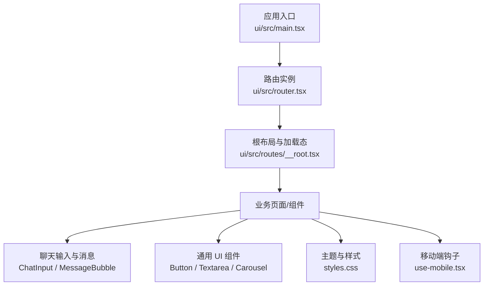
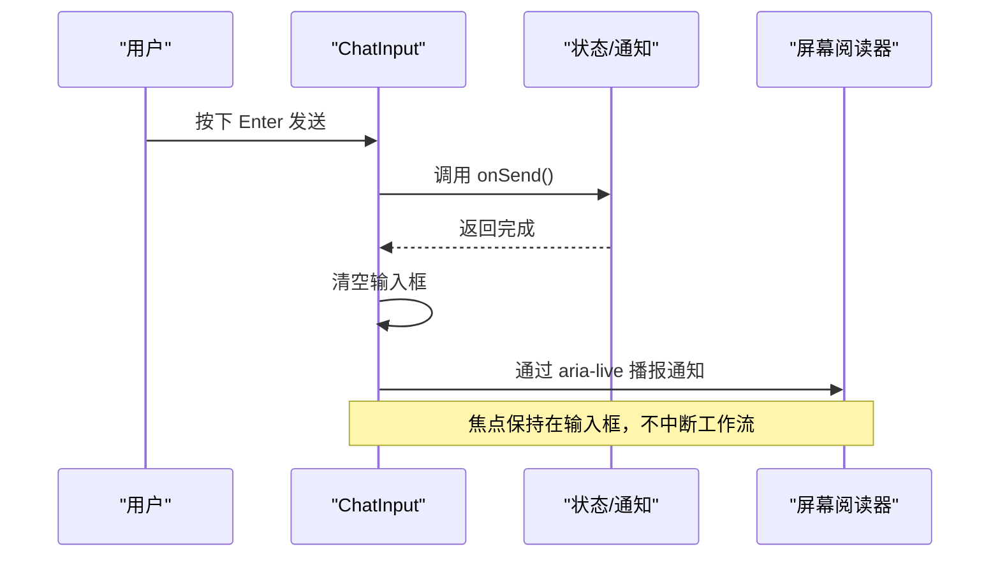
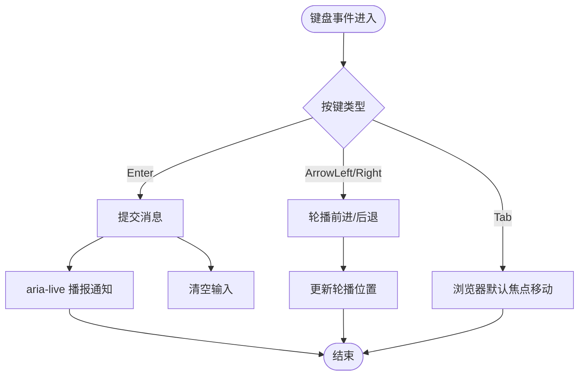
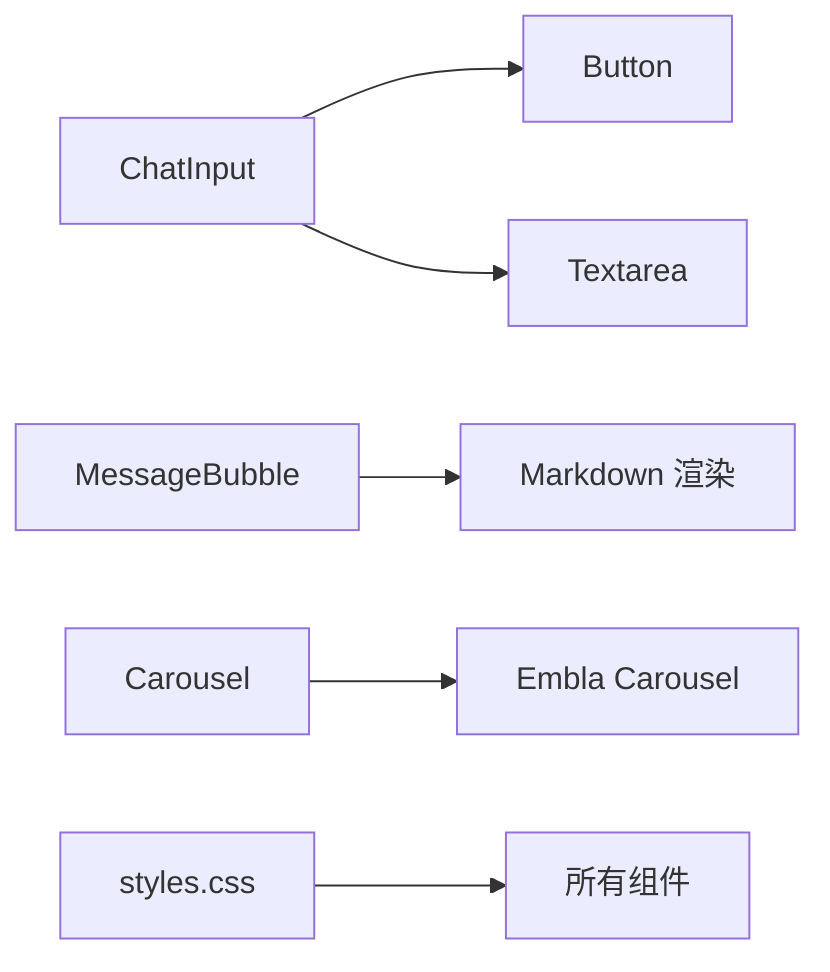

# 无障碍访问

<cite>
**本文引用的文件**
- [ui/src/main.tsx](file://ui/src/main.tsx)
- [ui/src/router.tsx](file://ui/src/router.tsx)
- [ui/package.json](file://ui/package.json)
- [ui/src/styles.css](file://ui/src/styles.css)
- [ui/src/components/chat/ChatInput.tsx](file://ui/src/components/chat/ChatInput.tsx)
- [ui/src/components/chat/MessageBubble.tsx](file://ui/src/components/chat/MessageBubble.tsx)
- [ui/src/routes/__root.tsx](file://ui/src/routes/__root.tsx)
- [ui/src/components/ui/button.tsx](file://ui/src/components/ui/button.tsx)
- [ui/src/components/ui/textarea.tsx](file://ui/src/components/ui/textarea.tsx)
- [ui/src/components/ui/carousel.tsx](file://ui/src/components/ui/carousel.tsx)
- [ui/src/hooks/use-mobile.tsx](file://ui/src/hooks/use-mobile.tsx)
- [docs/research/hitl-ui-2026-08-11/EXPERIENCE.md](file://docs/research/hitl-ui-2026-08-11/EXPERIENCE.md)
</cite>

## 目录
1. [简介](#简介)
2. [项目结构](#项目结构)
3. [核心组件](#核心组件)
4. [架构总览](#架构总览)
5. [详细组件分析](#详细组件分析)
6. [依赖关系分析](#依赖关系分析)
7. [性能考虑](#性能考虑)
8. [故障排查指南](#故障排查指南)
9. [结论](#结论)
10. [附录](#附录)

## 简介
本文件面向 Vivy 前端（React + Vite）的无障碍访问（a11y）实现与规范，覆盖 ARIA 属性使用、键盘导航、屏幕阅读器兼容、色彩对比度标准、测试工具链与常见问题。文档基于仓库中实际代码与文档进行梳理，并给出可操作的改进建议与最佳实践。

## 项目结构
Vivy 前端位于 ui 目录，采用 React + Vite 构建，路由由 TanStack Router 管理，样式基于 Tailwind v4 与 CSS 变量主题系统。UI 组件大量使用 Radix UI 基础组件，提供可访问的原生行为与 ARIA 支持。

图表来源
- [ui/src/main.tsx:1-19](file://ui/src/main.tsx#L1-L19)
- [ui/src/router.tsx:1-25](file://ui/src/router.tsx#L1-L25)
- [ui/src/routes/__root.tsx:1-19](file://ui/src/routes/__root.tsx#L1-L19)
- [ui/src/components/chat/ChatInput.tsx:1-70](file://ui/src/components/chat/ChatInput.tsx#L1-L70)
- [ui/src/components/chat/MessageBubble.tsx:1-12](file://ui/src/components/chat/MessageBubble.tsx#L1-L12)
- [ui/src/components/ui/button.tsx:1-50](file://ui/src/components/ui/button.tsx#L1-L50)
- [ui/src/components/ui/textarea.tsx:1-22](file://ui/src/components/ui/textarea.tsx#L1-L22)
- [ui/src/components/ui/carousel.tsx:34-137](file://ui/src/components/ui/carousel.tsx#L34-L137)
- [ui/src/styles.css:1-213](file://ui/src/styles.css#L1-L213)
- [ui/src/hooks/use-mobile.tsx:1-19](file://ui/src/hooks/use-mobile.tsx#L1-L19)

章节来源
- [ui/src/main.tsx:1-19](file://ui/src/main.tsx#L1-L19)
- [ui/src/router.tsx:1-25](file://ui/src/router.tsx#L1-L25)
- [ui/package.json:1-82](file://ui/package.json#L1-L82)
- [ui/src/styles.css:1-213](file://ui/src/styles.css#L1-L213)

## 核心组件
- 聊天输入 ChatInput：包含模式切换按钮、附件/画图/分支等快捷按钮、上下文占用进度条、通知提示、发送/取消按钮。已使用 aria-pressed、aria-expanded、aria-label、aria-live、role="progressbar" 等无障碍属性。
- 消息气泡 MessageBubble：使用 article 语义化容器，对“思考过程”使用 details/summary 折叠展示，便于屏幕阅读器理解层级。
- 根布局 __root.tsx：在加载与错误状态使用 role="status" 与标题文案，避免焦点丢失与空读。
- 通用 Button/Textarea：基于原生元素或 Radix Slot，保留默认键盘行为与焦点样式；Carousel 使用 region 与 roledescription 描述轮播区域。
- 主题 styles.css：通过 CSS 变量定义浅色/深色/粉色/Miku 主题，集中管理前景/背景/强调色，为对比度校验提供基础。

章节来源
- [ui/src/components/chat/ChatInput.tsx:1-70](file://ui/src/components/chat/ChatInput.tsx#L1-L70)
- [ui/src/components/chat/MessageBubble.tsx:1-12](file://ui/src/components/chat/MessageBubble.tsx#L1-L12)
- [ui/src/routes/__root.tsx:1-19](file://ui/src/routes/__root.tsx#L1-L19)
- [ui/src/components/ui/button.tsx:1-50](file://ui/src/components/ui/button.tsx#L1-L50)
- [ui/src/components/ui/textarea.tsx:1-22](file://ui/src/components/ui/textarea.tsx#L1-L22)
- [ui/src/components/ui/carousel.tsx:34-137](file://ui/src/components/ui/carousel.tsx#L34-L137)
- [ui/src/styles.css:1-213](file://ui/src/styles.css#L1-L213)

## 架构总览
以下序列图展示用户通过键盘与屏幕阅读器与聊天输入交互时，组件如何更新状态、通知与焦点。

图表来源
- [ui/src/components/chat/ChatInput.tsx:1-70](file://ui/src/components/chat/ChatInput.tsx#L1-L70)

## 详细组件分析

### ARIA 属性与角色定义
- 角色与状态
  - 进度指示：使用 role="progressbar" 配合 aria-valuemin/aria-valuemax/aria-valuenow/aria-valuetext，表达上下文占用百分比与字节数。
  - 开关/选择：使用 aria-pressed 表达“智能体模式”开关状态；使用 aria-expanded 表达审批中心面板展开/收起。
  - 区域描述：轮播容器使用 role="region" 与 aria-roledescription="carousel"，帮助屏幕阅读器识别交互区域。
  - 状态播报：使用 aria-live="polite" 的区域显示临时通知，避免打断当前操作。
  - 语义容器：消息使用 article，思考过程使用 details/summary，增强结构化可读性。
- 标签关联
  - 所有图标按钮均提供 aria-label 或 title，确保无文本图标可被朗读。
  - 表单控件（如 Textarea）通过原生语义与占位符/提示文案辅助说明用途。

章节来源
- [ui/src/components/chat/ChatInput.tsx:1-70](file://ui/src/components/chat/ChatInput.tsx#L1-L70)
- [ui/src/components/ui/carousel.tsx:34-137](file://ui/src/components/ui/carousel.tsx#L34-L137)
- [ui/src/components/chat/MessageBubble.tsx:1-12](file://ui/src/components/chat/MessageBubble.tsx#L1-L12)

### 键盘导航与焦点管理
- Tab 顺序
  - 按钮与输入框保持自然 DOM 顺序，避免隐藏不可用元素参与聚焦。
  - 禁用态按钮设置 disabled，阻止键盘与鼠标交互。
- 快捷键支持
  - 输入框支持 Enter 发送、Shift+Enter 换行（通过事件判断）。
  - 轮播支持左右方向键滚动（onKeyDownCapture），符合常见预期。
- 焦点可见性
  - 全局 focus-visible 样式确保键盘聚焦时有清晰轮廓。
  - 自定义按钮与输入框保留原生焦点行为，未移除 outline。
- 焦点恢复
  - 打开/关闭面板（如审批中心）应聚焦到触发按钮或内容头部，当前通过 aria-expanded 暴露状态，建议在交互后显式管理焦点。

图表来源
- [ui/src/components/chat/ChatInput.tsx:1-70](file://ui/src/components/chat/ChatInput.tsx#L1-L70)
- [ui/src/components/ui/carousel.tsx:34-137](file://ui/src/components/ui/carousel.tsx#L34-L137)

章节来源
- [ui/src/components/chat/ChatInput.tsx:1-70](file://ui/src/components/chat/ChatInput.tsx#L1-L70)
- [ui/src/components/ui/carousel.tsx:34-137](file://ui/src/components/ui/carousel.tsx#L34-L137)
- [ui/src/components/ui/button.tsx:1-50](file://ui/src/components/ui/button.tsx#L1-L50)
- [ui/src/components/ui/textarea.tsx:1-22](file://ui/src/components/ui/textarea.tsx#L1-L22)

### 屏幕阅读器兼容
- 语义化 HTML：article、details/summary、button、input 等原生语义优先。
- 替代文本：图标按钮使用 aria-label；图片/图形需补充 alt 或 aria-hidden。
- 动态内容更新：使用 aria-live 区域播报通知；避免频繁刷新导致阅读混乱。
- 状态同步：aria-pressed/aria-expanded 与实际状态一致，便于读屏器正确播报。
- 参考设计经验：研究文档指出新待处理项应使用 ARIA live 播报且不窃取焦点，破坏性操作需确认步骤。

章节来源
- [ui/src/components/chat/ChatInput.tsx:1-70](file://ui/src/components/chat/ChatInput.tsx#L1-L70)
- [ui/src/components/chat/MessageBubble.tsx:1-12](file://ui/src/components/chat/MessageBubble.tsx#L1-L12)
- [docs/research/hitl-ui-2026-08-11/EXPERIENCE.md:110-131](file://docs/research/hitl-ui-2026-08-11/EXPERIENCE.md#L110-L131)

### 色彩对比度与视觉辅助功能
- WCAG 规范要点
  - 普通文本对比度至少 4.5:1，大文本至少 3:1。
  - 非文本元素（图标、边框）应有足够的可视区分度。
  - 颜色不应作为唯一信息载体，需结合文字/形状/图标。
- 本项目现状
  - 主题通过 CSS 变量集中管理前景/背景/强调色，便于统一调整对比度。
  - 存在多种主题（default/dark/pink/miku），需分别验证对比度。
- 颜色选择原则
  - 优先使用 oklch 或 sRGB 空间计算对比度，避免仅凭肉眼判断。
  - 对重要信息（错误、成功、警告）同时使用颜色与文字/图标双重编码。
  - 为链接与可点击元素提供下划线或明显视觉差异。

章节来源
- [ui/src/styles.css:1-213](file://ui/src/styles.css#L1-L213)
- [docs/research/hitl-ui-2026-08-11/EXPERIENCE.md:110-131](file://docs/research/hitl-ui-2026-08-11/EXPERIENCE.md#L110-L131)

### 无障碍测试工具与流程
- 自动化测试
  - axe-core：集成到单元测试或 E2E 流程，检测 ARIA 属性缺失、标签缺失、对比度问题等。
  - Lighthouse：运行 Accessibility 审计，关注可访问性评分与具体问题清单。
- 手动测试
  - 键盘走查：仅使用 Tab/Enter/方向键完成关键任务，检查焦点顺序与可见性。
  - 屏幕阅读器：使用 NVDA/VoiceOver 朗读页面，验证语义与播报准确性。
  - 缩放与高对比：放大至 200%、开启系统高对比度，检查布局与可读性。
- 验收清单（参考研究文档）
  - 焦点是否进入关键区域（如详情标题、主要决策控制）。
  - 按钮是否具有唯一且明确的无障碍名称。
  - 状态是否通过文本与图标/形状共同表达，而非仅颜色。
  - 新增待处理项是否通过 ARIA live 播报且不窃取焦点。
  - 破坏性操作是否有确认步骤。

章节来源
- [docs/research/hitl-ui-2026-08-11/EXPERIENCE.md:110-131](file://docs/research/hitl-ui-2026-08-11/EXPERIENCE.md#L110-L131)

## 依赖关系分析
- 运行时依赖
  - Radix UI 组件：提供可访问的基础构件（如 Label、Dialog、Tabs 等），减少重复实现 a11y 逻辑。
  - Tailwind v4：通过 CSS 变量与主题系统统一管理颜色与样式，利于对比度管控。
  - TanStack Router：管理路由与页面切换，注意在路由切换时维护焦点与页面标题。
- 组件依赖
  - ChatInput 依赖 Button、Textarea 与 store 状态；MessageBubble 依赖 Markdown 渲染。
  - Carousel 使用 Embla Carousel 并提供键盘导航与区域描述。

图表来源
- [ui/src/components/chat/ChatInput.tsx:1-70](file://ui/src/components/chat/ChatInput.tsx#L1-L70)
- [ui/src/components/chat/MessageBubble.tsx:1-12](file://ui/src/components/chat/MessageBubble.tsx#L1-L12)
- [ui/src/components/ui/carousel.tsx:34-137](file://ui/src/components/ui/carousel.tsx#L34-L137)
- [ui/src/styles.css:1-213](file://ui/src/styles.css#L1-L213)

章节来源
- [ui/package.json:1-82](file://ui/package.json#L1-L82)
- [ui/src/components/ui/button.tsx:1-50](file://ui/src/components/ui/button.tsx#L1-L50)
- [ui/src/components/ui/textarea.tsx:1-22](file://ui/src/components/ui/textarea.tsx#L1-L22)
- [ui/src/components/ui/carousel.tsx:34-137](file://ui/src/components/ui/carousel.tsx#L34-L137)

## 性能考虑
- 减少不必要的重渲染：通知与进度条更新频率较高，应避免每帧全量重绘。
- 合理使用 aria-live：仅对必要区域启用播报，避免过多区域竞争朗读。
- 键盘事件优化：方向键导航仅在必要时捕获事件，防止影响全局滚动。
- 主题切换：CSS 变量切换成本低，但大量动画与过渡可能影响低端设备，按需启用。

[本节为通用指导，无需具体文件引用]

## 故障排查指南
- 常见问题
  - 图标按钮无法被读屏器识别：缺少 aria-label 或 title。
  - 动态内容未被播报：未使用 aria-live 或区域不可见。
  - 键盘无法操作：自定义组件未绑定必要键盘事件或未保留原生行为。
  - 对比度不足：主题变量组合不符合 WCAG 要求。
- 定位方法
  - 使用浏览器开发者工具的“无障碍树”检查元素角色、名称与状态。
  - 运行 axe-core/Lighthouse 获取问题清单与修复建议。
  - 手动键盘走查与屏幕阅读器朗读验证。
- 修复建议
  - 为所有可交互元素添加明确的可访问名称。
  - 将状态变化集中在 aria-live 区域播报。
  - 使用 Radix 等成熟组件减少自实现风险。
  - 针对每个主题进行对比度校验与修正。

章节来源
- [ui/src/components/chat/ChatInput.tsx:1-70](file://ui/src/components/chat/ChatInput.tsx#L1-L70)
- [ui/src/components/ui/carousel.tsx:34-137](file://ui/src/components/ui/carousel.tsx#L34-L137)
- [ui/src/styles.css:1-213](file://ui/src/styles.css#L1-L213)

## 结论
Vivy 前端已在多个关键组件中引入无障碍实践，包括 ARIA 属性、语义化结构与键盘交互。建议持续完善焦点管理、对比度校验与自动化测试，确保多主题下的可访问性一致性，并通过屏幕阅读器与手动走查闭环验证用户体验。

[本节为总结性内容，无需具体文件引用]

## 附录
- 快速检查清单
  - 所有可交互元素是否可键盘操作？
  - 所有图标按钮是否有 aria-label/title？
  - 动态内容是否通过 aria-live 播报？
  - 各主题对比度是否符合 WCAG？
  - 屏幕阅读器能否正确朗读结构与状态？
- 推荐工具
  - axe-core、Lighthouse、NVDA/VoiceOver、浏览器无障碍树。

[本节为通用指导，无需具体文件引用]