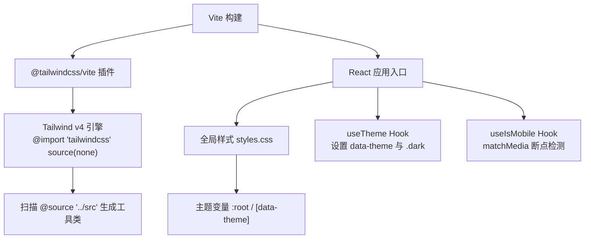
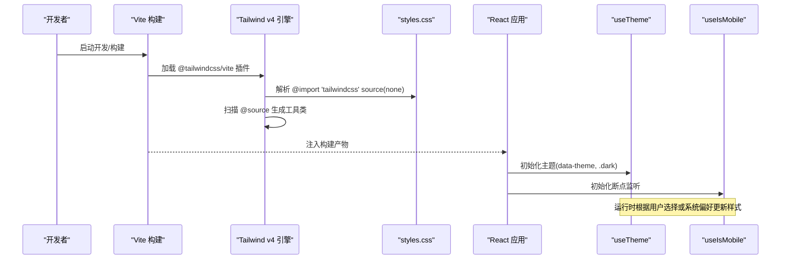
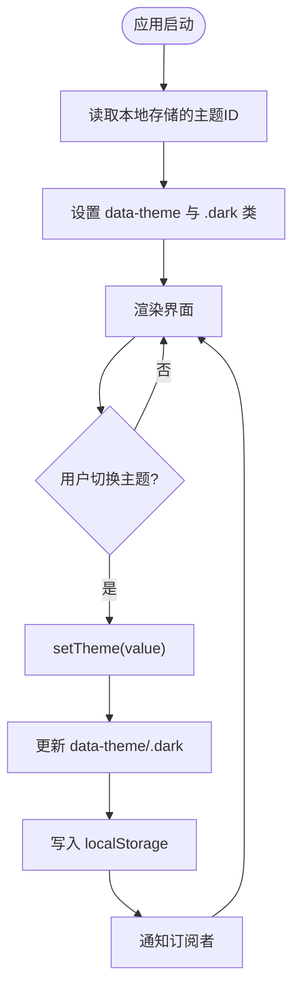
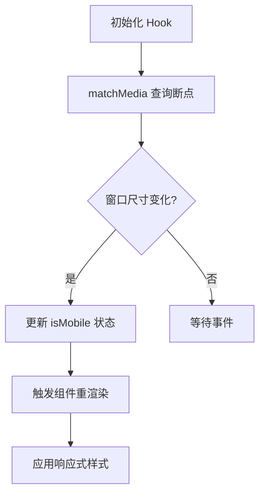
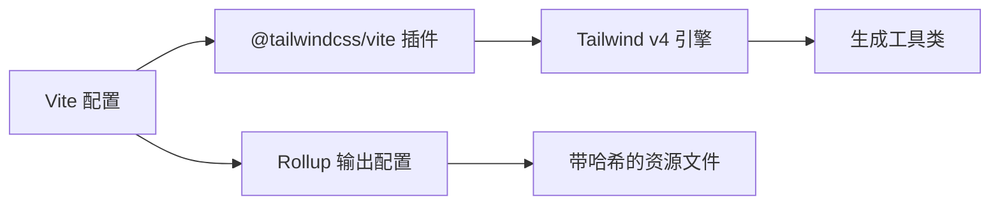
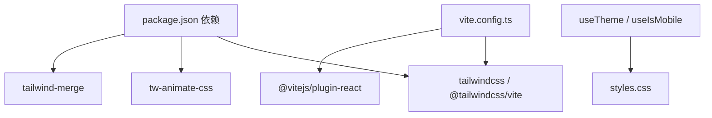

# 样式定制

<cite>
**本文引用的文件**
- [ui/src/styles.css](file://ui/src/styles.css)
- [ui/vite.config.ts](file://ui/vite.config.ts)
- [ui/package.json](file://ui/package.json)
- [ui/src/hooks/use-theme.ts](file://ui/src/hooks/use-theme.ts)
- [ui/src/hooks/use-mobile.tsx](file://ui/src/hooks/use-mobile.tsx)
- [ui/agent-diva-source/agent-diva-gui/tailwind.config.js](file://ui/agent-diva-source/agent-diva-gui/tailwind.config.js)
- [ui/agent-diva-source/agent-diva-gui/postcss.config.js](file://ui/agent-diva-source/agent-diva-gui/postcss.config.js)
- [ui/agent-diva-source/agent-diva-gui/src/styles.css](file://ui/agent-diva-source/agent-diva-gui/src/styles.css)
- [docs/dev/ui-migration/UI_MIGRATION_STYLES_PLAN.md](file://docs/dev/ui-migration/UI_MIGRATION_STYLES_PLAN.md)
</cite>

## 目录
1. [简介](#简介)
2. [项目结构](#项目结构)
3. [核心组件](#核心组件)
4. [架构总览](#架构总览)
5. [详细组件分析](#详细组件分析)
6. [依赖关系分析](#依赖关系分析)
7. [性能考虑](#性能考虑)
8. [故障排查指南](#故障排查指南)
9. [结论](#结论)
10. [附录](#附录)

## 简介
本文件聚焦前端样式定制体系，围绕 Tailwind CSS v4、PostCSS 处理流程、主题变量与多皮肤切换、响应式设计与移动端适配、构建产物优化、浏览器兼容与前缀自动添加、以及调试技巧进行系统化说明。目标是帮助开发者在不破坏既有契约的前提下，安全地扩展主题、组件样式与响应式行为，并保证可维护性与性能。

## 项目结构
当前 UI 采用 Vite + React + Tailwind CSS v4 的组合：
- 入口样式通过 @import "tailwindcss" source(none) 引入 Tailwind v4 的内置引擎，并通过 @source 扫描源码以生成工具类。
- 主题变量集中在全局样式中，使用 :root 与 [data-theme] 块组织多套主题；dark: 变体由 .dark 类驱动。
- Vite 配置集成 tailwindcss() 插件，统一输出目录与资源命名策略，便于缓存与 CDN 分发。
- 主题运行时通过 useTheme Hook 管理 data-theme 与 .dark 类，并持久化到 localStorage。
- 移动端断点检测通过 useIsMobile Hook 基于 matchMedia 实现。

图表来源
- [ui/vite.config.ts:24-36](file://ui/vite.config.ts#L24-L36)
- [ui/src/styles.css:1-10](file://ui/src/styles.css#L1-L10)
- [ui/src/hooks/use-theme.ts:73-80](file://ui/src/hooks/use-theme.ts#L73-L80)
- [ui/src/hooks/use-mobile.tsx:5-18](file://ui/src/hooks/use-mobile.tsx#L5-L18)

章节来源
- [ui/vite.config.ts:24-63](file://ui/vite.config.ts#L24-L63)
- [ui/src/styles.css:1-213](file://ui/src/styles.css#L1-L213)
- [ui/src/hooks/use-theme.ts:1-118](file://ui/src/hooks/use-theme.ts#L1-L118)
- [ui/src/hooks/use-mobile.tsx:1-20](file://ui/src/hooks/use-mobile.tsx#L1-L20)

## 核心组件
- 主题系统
  - 主题注册表与预览数据集中定义，支持默认、粉白、深蓝夜色、Miku 青等主题。
  - 运行时将 data-theme 写入根节点，并根据 appearance 切换 .dark 类以启用 dark: 变体。
  - 主题选择后持久化至 localStorage，并在不可用时优雅降级。
- 全局样式与令牌
  - 通过 @theme inline 将 CSS 变量映射为 Tailwind 语义令牌（颜色、圆角、字体等）。
  - :root 提供默认浅色主题变量；[data-theme="..."] 覆盖不同主题变量。
  - base 层统一边框、背景、字体与视口高度，确保一致的基础体验。
- 响应式与移动端
  - 使用 matchMedia 监听 max-width 断点，暴露 isMobile 布尔值供组件逻辑使用。
  - 配合 Tailwind 的响应式前缀（如 md:、lg:）完成布局与间距调整。
- 构建与插件
  - Vite 集成 tailwindcss() 插件，关闭 HMR 以避免沙箱 iframe 下的整页重载问题。
  - 构建产物使用哈希文件名，利于长期缓存。

章节来源
- [ui/src/hooks/use-theme.ts:7-55](file://ui/src/hooks/use-theme.ts#L7-L55)
- [ui/src/hooks/use-theme.ts:73-102](file://ui/src/hooks/use-theme.ts#L73-L102)
- [ui/src/styles.css:10-52](file://ui/src/styles.css#L10-L52)
- [ui/src/styles.css:54-125](file://ui/src/styles.css#L54-L125)
- [ui/src/styles.css:127-192](file://ui/src/styles.css#L127-L192)
- [ui/src/styles.css:194-213](file://ui/src/styles.css#L194-L213)
- [ui/src/hooks/use-mobile.tsx:1-20](file://ui/src/hooks/use-mobile.tsx#L1-L20)
- [ui/vite.config.ts:24-63](file://ui/vite.config.ts#L24-L63)

## 架构总览
下图展示了从 Vite 构建到运行时主题切换与响应式检测的整体流程。

图表来源
- [ui/vite.config.ts:24-36](file://ui/vite.config.ts#L24-L36)
- [ui/src/styles.css:1-10](file://ui/src/styles.css#L1-L10)
- [ui/src/hooks/use-theme.ts:73-80](file://ui/src/hooks/use-theme.ts#L73-L80)
- [ui/src/hooks/use-mobile.tsx:5-18](file://ui/src/hooks/use-mobile.tsx#L5-L18)

## 详细组件分析

### 主题系统与变量映射
- 变量映射
  - 通过 @theme inline 将 CSS 变量映射为 Tailwind 语义令牌，例如 --color-primary、--font-sans 等，使组件可使用语义化类名。
- 多主题
  - :root 定义默认浅色主题变量；[data-theme="dark"]、[data-theme="pink"]、[data-theme="miku"] 分别覆盖深色、粉白、Miku 青主题变量。
  - 使用 oklch 色彩空间提升感知均匀性，同时保留十六进制色板用于兼容性场景。
- 运行时控制
  - useTheme 负责读取本地存储、应用 data-theme、切换 .dark 类，并提供 setTheme 与订阅机制。
  - 主题选择卡展示预览渐变与强调色，避免在预览中直接引用当前主题变量导致视觉不一致。

图表来源
- [ui/src/hooks/use-theme.ts:64-102](file://ui/src/hooks/use-theme.ts#L64-L102)
- [ui/src/styles.css:54-192](file://ui/src/styles.css#L54-L192)

章节来源
- [ui/src/styles.css:10-52](file://ui/src/styles.css#L10-L52)
- [ui/src/styles.css:54-192](file://ui/src/styles.css#L54-L192)
- [ui/src/hooks/use-theme.ts:7-55](file://ui/src/hooks/use-theme.ts#L7-L55)
- [ui/src/hooks/use-theme.ts:64-102](file://ui/src/hooks/use-theme.ts#L64-L102)

### 响应式设计与移动端适配
- 断点管理
  - 使用 useIsMobile Hook 基于 matchMedia 监听 (max-width: 767px)，返回 isMobile 状态供组件决策。
  - 结合 Tailwind 响应式前缀（如 sm:、md:、lg:）在不同屏幕尺寸下调整布局与间距。
- 移动端适配建议
  - 在小屏下隐藏次要导航、折叠侧边栏、减少内容密度。
  - 使用相对单位与流体排版，避免固定宽度导致的溢出。
  - 对交互元素增大触控区域，提升可用性。

图表来源
- [ui/src/hooks/use-mobile.tsx:5-18](file://ui/src/hooks/use-mobile.tsx#L5-L18)

章节来源
- [ui/src/hooks/use-mobile.tsx:1-20](file://ui/src/hooks/use-mobile.tsx#L1-L20)

### 构建与 PostCSS 处理流程
- Vite 集成
  - 使用 @tailwindcss/vite 插件接入 Tailwind v4 引擎，无需传统 postcss.config.js。
  - 关闭 HMR 以避免沙箱 iframe 下的整页重载问题；代理 /rpc 到后端服务。
- 产物优化
  - 输出目录与资源目录归一化，使用哈希文件名增强缓存命中。
- 历史参考
  - 旧工程使用 postcss.config.js 配置 tailwindcss 与 autoprefixer；当前工程已迁移至 Vite 内嵌处理。

图表来源
- [ui/vite.config.ts:24-63](file://ui/vite.config.ts#L24-L63)
- [ui/agent-diva-source/agent-diva-gui/postcss.config.js:1-7](file://ui/agent-diva-source/agent-diva-gui/postcss.config.js#L1-L7)

章节来源
- [ui/vite.config.ts:24-63](file://ui/vite.config.ts#L24-L63)
- [ui/agent-diva-source/agent-diva-gui/postcss.config.js:1-7](file://ui/agent-diva-source/agent-diva-gui/postcss.config.js#L1-L7)

### 自定义插件与主题扩展
- 主题扩展
  - 在全局样式中添加新的 [data-theme="xxx"] 块，定义完整的变量集合，即可新增一套主题。
  - 在 useTheme 的 THEMES 列表中添加新主题元数据，包括预览渐变与强调色。
- 令牌扩展
  - 通过 @theme inline 增加新的语义令牌映射，如新增颜色族或圆角等级。
  - 如需与旧工程保持一致，可参考 agent-diva-source 中的 tailwind.config.js 扩展 colors、fontSize、borderRadius、boxShadow 等。
- 插件与工具链
  - 当前工程使用 Tailwind v4 的 Vite 插件，不再需要独立的 PostCSS 配置；如需额外处理，可在 Vite 插件链中追加。

章节来源
- [ui/src/styles.css:10-52](file://ui/src/styles.css#L10-L52)
- [ui/src/styles.css:127-192](file://ui/src/styles.css#L127-L192)
- [ui/src/hooks/use-theme.ts:22-55](file://ui/src/hooks/use-theme.ts#L22-L55)
- [ui/agent-diva-source/agent-diva-gui/tailwind.config.js:7-81](file://ui/agent-diva-source/agent-diva-gui/tailwind.config.js#L7-L81)

### 组件样式组织与最佳实践
- 组织原则
  - 基础规则、共享组件与业务模块样式边界清晰；页面仅负责区域布局，不侵入组件内部样式。
  - 使用语义化类名与主题变量，避免硬编码数值与 !important。
- 示例模式
  - 卡片、消息气泡、输入框等组件应封装为共享样式，复用主题变量与间距令牌。
  - 通过组合与变体表达差异，而非复制样式。
- 迁移参考
  - 可参考 UI 迁移计划中的聊天区域、侧边栏、设置等组件样式组织方式，逐步替换重度 Tailwind 工具类为语义化 CSS。

章节来源
- [.agents/skills/oil-frontend/references/component-contract.md:19-103](file://.agents/skills/oil-frontend/references/component-contract.md#L19-L103)
- [docs/dev/ui-migration/UI_MIGRATION_STYLES_PLAN.md:399-536](file://docs/dev/ui-migration/UI_MIGRATION_STYLES_PLAN.md#L399-L536)

## 依赖关系分析
- 包依赖
  - 使用 tailwindcss、@tailwindcss/vite、tw-animate-css、tailwind-merge 等库，支撑样式生成、动画与类名合并。
- 构建依赖
  - Vite 作为构建工具，集成 React、TypeScript 路径别名与路由插件。
- 运行时依赖
  - useTheme 与 useIsMobile 为样式相关逻辑的核心依赖，被各组件广泛使用。

图表来源
- [ui/package.json:14-69](file://ui/package.json#L14-L69)
- [ui/vite.config.ts:24-36](file://ui/vite.config.ts#L24-L36)
- [ui/src/hooks/use-theme.ts:73-102](file://ui/src/hooks/use-theme.ts#L73-L102)
- [ui/src/hooks/use-mobile.tsx:5-18](file://ui/src/hooks/use-mobile.tsx#L5-L18)

章节来源
- [ui/package.json:14-69](file://ui/package.json#L14-L69)
- [ui/vite.config.ts:24-63](file://ui/vite.config.ts#L24-L63)

## 性能考虑
- CSS 压缩与缓存
  - 构建产物使用哈希文件名，利于浏览器与 CDN 长期缓存。
  - 生产构建会自动压缩 CSS/JS，减少传输体积。
- 按需加载
  - Tailwind v4 通过 @source 扫描源码，仅生成实际使用的工具类，降低 CSS 体积。
  - 组件级样式按需导入，避免全局污染。
- 运行时开销
  - 主题切换仅修改 data-theme 与 .dark 类，避免重排重绘过多。
  - 断点监听使用 matchMedia，事件驱动更新，开销较低。
- 调试与优化
  - 开发阶段可开启浏览器开发者工具的“计算样式”查看变量生效情况。
  - 使用 Lighthouse 或 WebPageTest 评估首屏与样式阻塞影响。

章节来源
- [ui/vite.config.ts:52-63](file://ui/vite.config.ts#L52-L63)
- [ui/src/styles.css:1-10](file://ui/src/styles.css#L1-L10)

## 故障排查指南
- 主题未生效
  - 检查 data-theme 是否正确设置，确认对应主题块存在完整变量集合。
  - 确认 .dark 类仅在 dark 主题时添加，避免与 data-theme 冲突。
- 工具类未生成
  - 确认 @source 指向正确的源码目录，确保组件中使用到的类名存在于扫描范围。
  - 检查 Vite 是否加载了 tailwindcss() 插件。
- 移动端断点异常
  - 检查 matchMedia 表达式与 MOBILE_BREAKPOINT 常量是否合理。
  - 在控制台执行 window.matchMedia 验证结果。
- 构建产物过大
  - 审查是否引入了不必要的动画或第三方样式。
  - 使用 Tree Shaking 与按需导入减少体积。

章节来源
- [ui/src/hooks/use-theme.ts:73-102](file://ui/src/hooks/use-theme.ts#L73-L102)
- [ui/src/styles.css:1-10](file://ui/src/styles.css#L1-L10)
- [ui/src/hooks/use-mobile.tsx:5-18](file://ui/src/hooks/use-mobile.tsx#L5-L18)
- [ui/vite.config.ts:24-36](file://ui/vite.config.ts#L24-L36)

## 结论
本项目采用 Tailwind CSS v4 与 Vite 深度集成的现代样式架构，通过 CSS 变量与 @theme 映射实现主题化，使用 useTheme 与 useIsHook 提供灵活的运行时控制。构建阶段通过哈希命名与按需生成工具类保障性能，运行时通过最小 DOM 操作实现主题切换与响应式适配。遵循组件样式组织规范与迁移计划，可稳步扩展主题与组件样式，保持代码可维护性与一致性。

## 附录
- 主题变量清单
  - 颜色族：background、foreground、card、popover、primary、secondary、muted、accent、destructive、border、input、ring、sidebar 系列、chart 系列。
  - 圆角：radius 及其衍生等级。
  - 字体：font-sans 及系统字体回退。
- 响应式断点
  - 移动端断点：768px（含以下视为移动端）。
  - 建议使用 Tailwind 默认断点（sm/md/lg/xl/2xl）配合布局调整。
- 浏览器兼容与前缀
  - 当前工程使用 Tailwind v4 的 Vite 插件，不再依赖独立 PostCSS 配置；如需兼容旧环境，可参考历史 postcss.config.js 添加 autoprefixer。
- 调试技巧
  - 使用浏览器开发者工具检查 CSS 变量与 computed style。
  - 在控制台运行 document.documentElement.getAttribute('data-theme') 与 classList 验证主题状态。
  - 使用网络面板观察资源加载与缓存命中。

章节来源
- [ui/src/styles.css:54-192](file://ui/src/styles.css#L54-L192)
- [ui/src/hooks/use-mobile.tsx:1-20](file://ui/src/hooks/use-mobile.tsx#L1-L20)
- [ui/agent-diva-source/agent-diva-gui/postcss.config.js:1-7](file://ui/agent-diva-source/agent-diva-gui/postcss.config.js#L1-L7)