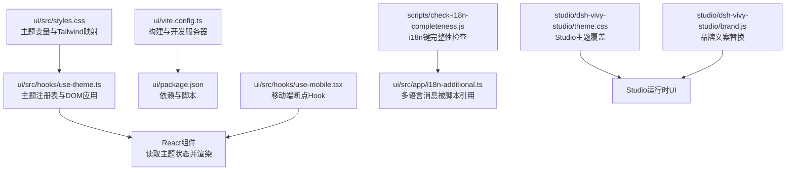
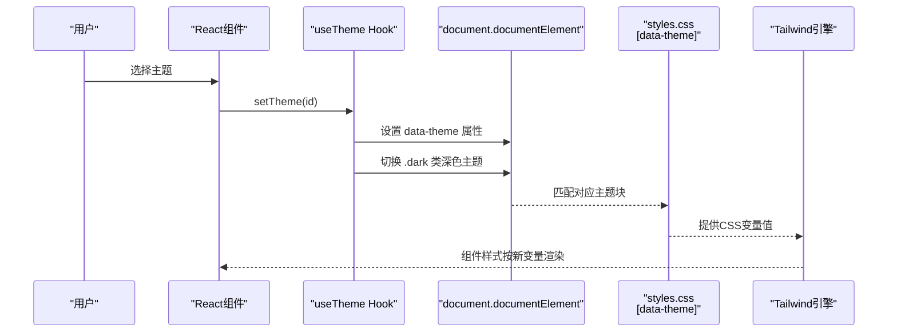
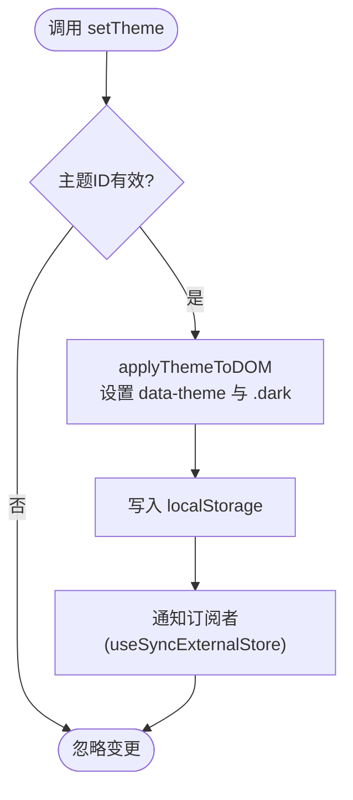
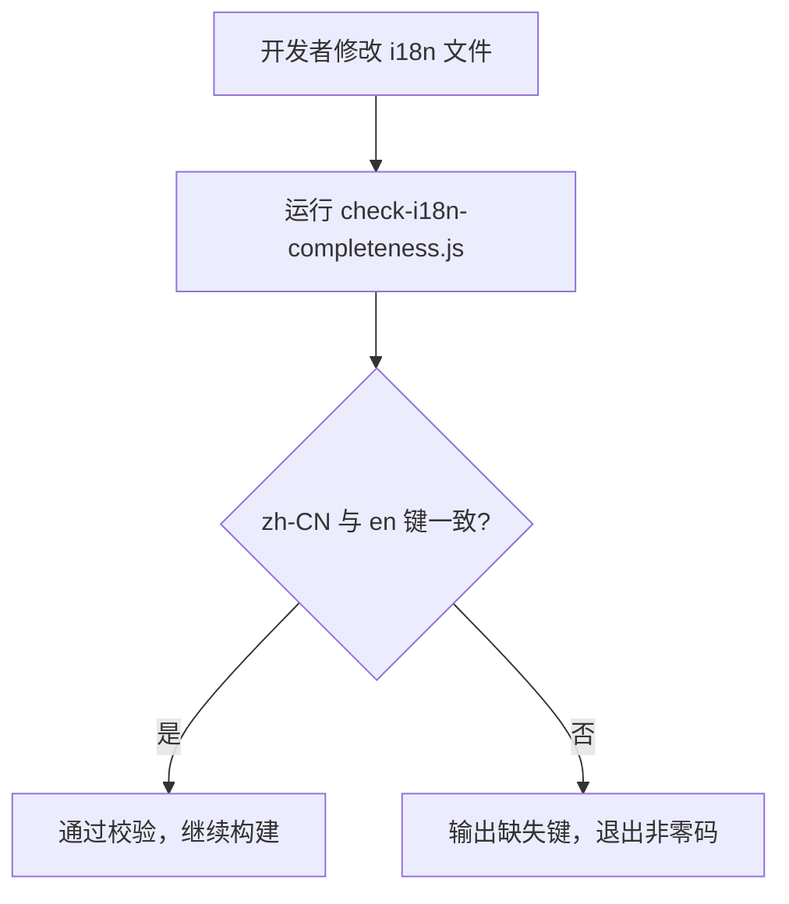
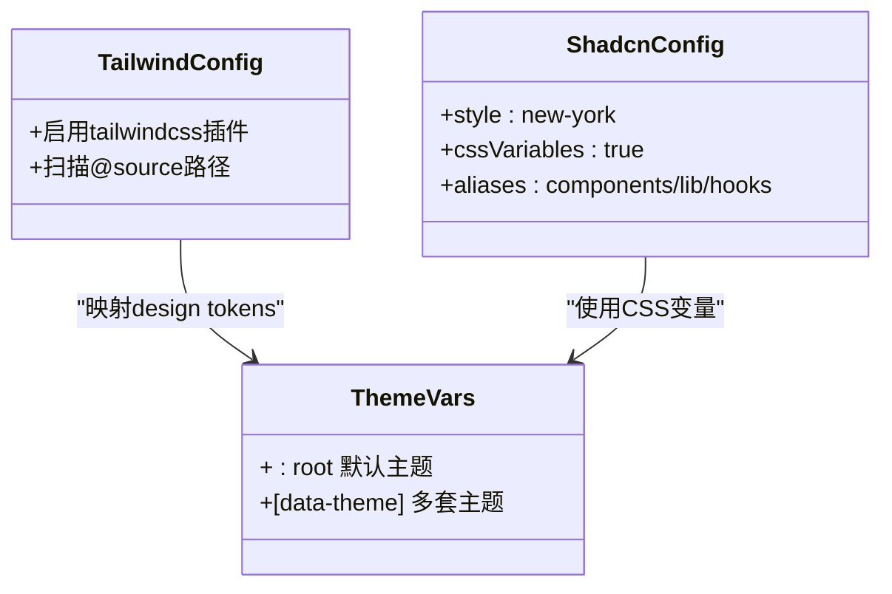
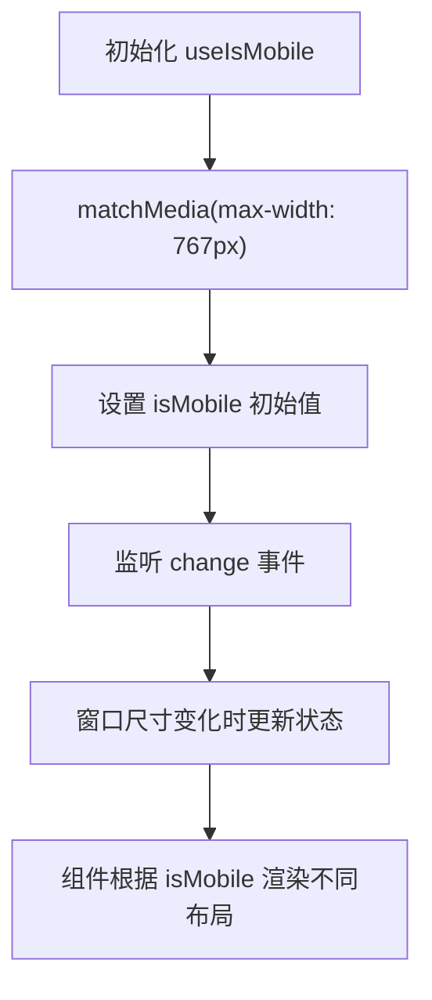
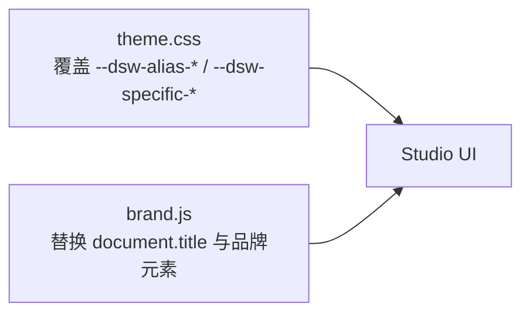
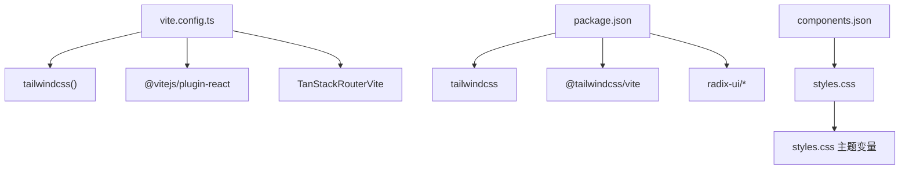

# 界面定制

<cite>
**本文引用的文件**
- [ui/src/styles.css](file://ui/src/styles.css)
- [ui/src/hooks/use-theme.ts](file://ui/src/hooks/use-theme.ts)
- [ui/vite.config.ts](file://ui/vite.config.ts)
- [ui/package.json](file://ui/package.json)
- [ui/components.json](file://ui/components.json)
- [ui/src/hooks/use-mobile.tsx](file://ui/src/hooks/use-mobile.tsx)
- [scripts/check-i18n-completeness.js](file://scripts/check-i18n-completeness.js)
- [studio/dsh-vivy-studio/theme.css](file://studio/dsh-vivy-studio/theme.css)
- [studio/dsh-vivy-studio/brand.js](file://studio/dsh-vivy-studio/brand.js)
</cite>

## 目录
1. [简介](#简介)
2. [项目结构](#项目结构)
3. [核心组件](#核心组件)
4. [架构总览](#架构总览)
5. [详细组件分析](#详细组件分析)
6. [依赖关系分析](#依赖关系分析)
7. [性能考虑](#性能考虑)
8. [故障排查指南](#故障排查指南)
9. [结论](#结论)
10. [附录](#附录)

## 简介
本文件面向 Vivy 前端（React + Vite）与 Vivy Studio 的界面定制，系统性说明主题系统、国际化支持、样式定制方法、响应式设计与无障碍访问实践，并提供可操作的定制示例、最佳实践与兼容性注意事项。目标是帮助开发者在不破坏既有契约的前提下，安全地扩展主题、语言与交互体验。

## 项目结构
Vivy 前端位于 ui 目录，使用 Tailwind CSS v4、Radix UI 组件与 shadcn/ui 配置；主题通过 CSS 变量与 data-theme 切换，国际化由脚本校验键完整性，移动端适配通过 Hook 检测断点。Studio 侧提供独立主题覆盖层与品牌文案替换能力。

图表来源
- [ui/src/styles.css:1-213](file://ui/src/styles.css#L1-L213)
- [ui/src/hooks/use-theme.ts:1-118](file://ui/src/hooks/use-theme.ts#L1-L118)
- [ui/vite.config.ts:1-65](file://ui/vite.config.ts#L1-L65)
- [ui/package.json:1-82](file://ui/package.json#L1-L82)
- [ui/src/hooks/use-mobile.tsx:1-20](file://ui/src/hooks/use-mobile.tsx#L1-L20)
- [scripts/check-i18n-completeness.js:1-66](file://scripts/check-i18n-completeness.js#L1-L66)
- [studio/dsh-vivy-studio/theme.css:1-368](file://studio/dsh-vivy-studio/theme.css#L1-L368)
- [studio/dsh-vivy-studio/brand.js:1-23](file://studio/dsh-vivy-studio/brand.js#L1-L23)

章节来源
- [ui/src/styles.css:1-213](file://ui/src/styles.css#L1-L213)
- [ui/src/hooks/use-theme.ts:1-118](file://ui/src/hooks/use-theme.ts#L1-L118)
- [ui/vite.config.ts:1-65](file://ui/vite.config.ts#L1-L65)
- [ui/package.json:1-82](file://ui/package.json#L1-L82)
- [ui/src/hooks/use-mobile.tsx:1-20](file://ui/src/hooks/use-mobile.tsx#L1-L20)
- [scripts/check-i18n-completeness.js:1-66](file://scripts/check-i18n-completeness.js#L1-L66)
- [studio/dsh-vivy-studio/theme.css:1-368](file://studio/dsh-vivy-studio/theme.css#L1-L368)
- [studio/dsh-vivy-studio/brand.js:1-23](file://studio/dsh-vivy-studio/brand.js#L1-L23)

## 核心组件
- 主题系统：基于 CSS 变量与 data-theme 的多套主题，配合 Tailwind 的 @theme inline 映射到设计令牌；useTheme Hook 负责选择、持久化与 DOM 应用。
- 国际化：通过脚本校验 zh-CN 与 en 翻译键一致性，确保新增文案不遗漏目标语言。
- 响应式：useIsMobile Hook 基于 matchMedia 监听 768px 断点，驱动移动端布局分支。
- 样式定制：Tailwind v4 + shadcn/ui 配置，允许通过 CSS 变量与组件库扩展自定义样式。
- Studio 主题与品牌：独立的 theme.css 覆盖层与 brand.js 文案替换，用于 Studio 产品化外观。

章节来源
- [ui/src/styles.css:10-125](file://ui/src/styles.css#L10-L125)
- [ui/src/hooks/use-theme.ts:22-80](file://ui/src/hooks/use-theme.ts#L22-L80)
- [ui/src/hooks/use-mobile.tsx:1-20](file://ui/src/hooks/use-mobile.tsx#L1-L20)
- [ui/components.json:1-23](file://ui/components.json#L1-L23)
- [scripts/check-i18n-completeness.js:16-66](file://scripts/check-i18n-completeness.js#L16-L66)
- [studio/dsh-vivy-studio/theme.css:6-123](file://studio/dsh-vivy-studio/theme.css#L6-L123)
- [studio/dsh-vivy-studio/brand.js:1-23](file://studio/dsh-vivy-studio/brand.js#L1-L23)

## 架构总览
下图展示主题切换从用户操作到 DOM 更新与样式生效的完整流程，以及国际化校验在构建/CI中的集成位置。

图表来源
- [ui/src/hooks/use-theme.ts:73-102](file://ui/src/hooks/use-theme.ts#L73-L102)
- [ui/src/styles.css:91-125](file://ui/src/styles.css#L91-L125)
- [ui/vite.config.ts:24-36](file://ui/vite.config.ts#L24-L36)

章节来源
- [ui/src/hooks/use-theme.ts:73-102](file://ui/src/hooks/use-theme.ts#L73-L102)
- [ui/src/styles.css:91-125](file://ui/src/styles.css#L91-L125)
- [ui/vite.config.ts:24-36](file://ui/vite.config.ts#L24-L36)

## 详细组件分析

### 主题系统（CSS变量、主题切换、动态样式加载）
- 主题定义：在 styles.css 中通过 :root 与多个 [data-theme="..."] 块集中声明颜色、圆角、字体等变量；Tailwind 通过 @theme inline 将 design tokens 映射到这些变量。
- 主题切换：use-theme.ts 维护主题注册表 THEMES，提供 setTheme 函数写入 data-theme 与 .dark 类，并将选择持久化到 localStorage。
- 动态样式加载：Tailwind 在构建时扫描 @source 路径生成样式；运行时通过切换 data-theme 即时改变变量，无需重新加载样式。

图表来源
- [ui/src/hooks/use-theme.ts:91-112](file://ui/src/hooks/use-theme.ts#L91-L112)
- [ui/src/styles.css:10-89](file://ui/src/styles.css#L10-L89)

章节来源
- [ui/src/styles.css:10-125](file://ui/src/styles.css#L10-L125)
- [ui/src/hooks/use-theme.ts:22-112](file://ui/src/hooks/use-theme.ts#L22-L112)

### 国际化支持（多语言文件结构、翻译键管理、动态语言切换）
- 多语言文件结构：脚本期望存在 ui/src/app/i18n-additional.ts，包含 zh-CN 与 en 两个语言对象。
- 翻译键管理：check-i18n-completeness.js 解析该文件，提取顶层键并对比两语言集合，报告缺失键，可在 CI 中阻断不完整提交。
- 动态语言切换：参考 Agent-Diva 源码中的语言设置组件，通过本地存储切换 locale，并在组件中根据当前语言渲染文案。

图表来源
- [scripts/check-i18n-completeness.js:16-66](file://scripts/check-i18n-completeness.js#L16-L66)

章节来源
- [scripts/check-i18n-completeness.js:16-66](file://scripts/check-i18n-completeness.js#L16-L66)

### 样式定制方法（CSS模块、Tailwind配置、自定义组件样式）
- Tailwind 配置：vite.config.ts 启用 tailwindcss 插件，package.json 引入 Tailwind v4；components.json 配置 shadcn/ui 的样式入口、基础色与变量开关。
- 自定义组件样式：可通过 Radix UI 组件与 class-variance-authority 组合，结合 Tailwind 工具类快速实现变体；同时利用 CSS 变量统一色彩与圆角。
- 动态样式加载：Tailwind 在构建期生成样式，运行时通过 CSS 变量与 data-theme 切换主题，避免频繁重绘或样式注入。

图表来源
- [ui/vite.config.ts:24-36](file://ui/vite.config.ts#L24-L36)
- [ui/components.json:1-23](file://ui/components.json#L1-L23)
- [ui/src/styles.css:10-89](file://ui/src/styles.css#L10-L89)

章节来源
- [ui/vite.config.ts:24-36](file://ui/vite.config.ts#L24-L36)
- [ui/components.json:1-23](file://ui/components.json#L1-L23)
- [ui/src/styles.css:10-89](file://ui/src/styles.css#L10-L89)

### 响应式设计（断点管理、移动端适配、屏幕尺寸检测）
- 断点管理：useIsMobile 使用 768px 作为移动断点，通过 matchMedia 监听变化并更新状态。
- 移动端适配：组件可根据 isMobile 布尔值切换布局（如网格列数、导航形态）。
- 屏幕尺寸检测：建议在需要更细粒度控制时扩展 Hook，增加更多断点常量与查询。

图表来源
- [ui/src/hooks/use-mobile.tsx:1-20](file://ui/src/hooks/use-mobile.tsx#L1-L20)

章节来源
- [ui/src/hooks/use-mobile.tsx:1-20](file://ui/src/hooks/use-mobile.tsx#L1-L20)

### 无障碍访问支持（ARIA属性、键盘导航、屏幕阅读器兼容）
- ARIA 属性：轮播组件为根容器设置 role="region" 与 aria-roledescription="carousel"，便于屏幕阅读器识别区域与语义。
- 键盘导航：组件捕获键盘事件以支持方向键操作，确保键盘用户可用。
- 屏幕阅读器兼容：状态提示与交互反馈应避免仅依赖颜色，使用文本与图标共同表达；必要时使用 ARIA live 区域进行非抢占式播报。

章节来源
- [ui/src/components/ui/carousel.tsx:120-130](file://ui/src/components/ui/carousel.tsx#L120-L130)

### Studio 主题与品牌（主题覆盖与文案替换）
- 主题覆盖：theme.css 通过 :root 与 body[data-ds-dark-theme] 两套变量集覆盖 DSH 主题别名，统一品牌主色与中性色。
- 品牌文案：brand.js 在运行时替换页面标题与部分原生品牌元素，保持产品一致性。

图表来源
- [studio/dsh-vivy-studio/theme.css:6-123](file://studio/dsh-vivy-studio/theme.css#L6-L123)
- [studio/dsh-vivy-studio/theme.css:125-226](file://studio/dsh-vivy-studio/theme.css#L125-L226)
- [studio/dsh-vivy-studio/brand.js:1-23](file://studio/dsh-vivy-studio/brand.js#L1-L23)

章节来源
- [studio/dsh-vivy-studio/theme.css:6-226](file://studio/dsh-vivy-studio/theme.css#L6-L226)
- [studio/dsh-vivy-studio/brand.js:1-23](file://studio/dsh-vivy-studio/brand.js#L1-L23)

## 依赖关系分析
- 构建与运行时依赖：Vite 插件链包括 TanStack Router、React、Tailwind；Tailwind 在构建期生成样式，运行时依赖 CSS 变量与 data-theme。
- 组件库依赖：Radix UI 提供无样式基础组件，shadcn/ui 通过 components.json 配置样式与别名，统一组件风格。
- 国际化校验：脚本依赖 Node.js 文件系统，读取 i18n 文件并执行正则解析，适合集成至 CI。

图表来源
- [ui/vite.config.ts:24-36](file://ui/vite.config.ts#L24-L36)
- [ui/package.json:14-69](file://ui/package.json#L14-L69)
- [ui/components.json:1-23](file://ui/components.json#L1-L23)
- [ui/src/styles.css:10-89](file://ui/src/styles.css#L10-L89)

章节来源
- [ui/vite.config.ts:24-36](file://ui/vite.config.ts#L24-L36)
- [ui/package.json:14-69](file://ui/package.json#L14-L69)
- [ui/components.json:1-23](file://ui/components.json#L1-L23)
- [ui/src/styles.css:10-89](file://ui/src/styles.css#L10-L89)

## 性能考虑
- 主题切换开销极低：仅切换 data-theme 与 .dark 类，浏览器重排最小化。
- 构建产物优化：Vite 输出带 hash 的文件名，利于缓存；关闭 HMR 可减少沙箱预览下的整页重载风险。
- 移动端检测：使用 matchMedia 而非轮询，避免不必要的计算。
- 国际化校验：在 CI 中运行，避免运行时回退导致的额外逻辑。

## 故障排查指南
- 主题未生效：确认 data-theme 已正确设置且 styles.css 中存在对应主题块；检查 Tailwind 是否扫描到 @source 路径。
- 语言切换无效：确认 i18n 文件结构与键名一致；运行完整性检查脚本定位缺失键。
- 移动端布局异常：检查 useIsMobile 返回值与组件分支逻辑；确认媒体查询断点与组件样式一致。
- Studio 主题冲突：确认 theme.css 覆盖顺序与选择器优先级；避免与第三方样式冲突。

章节来源
- [ui/src/styles.css:91-125](file://ui/src/styles.css#L91-L125)
- [scripts/check-i18n-completeness.js:16-66](file://scripts/check-i18n-completeness.js#L16-L66)
- [ui/src/hooks/use-mobile.tsx:1-20](file://ui/src/hooks/use-mobile.tsx#L1-L20)
- [studio/dsh-vivy-studio/theme.css:125-226](file://studio/dsh-vivy-studio/theme.css#L125-L226)

## 结论
本项目提供了完善的前端界面定制能力：基于 CSS 变量的主题系统与数据驱动的切换机制、健壮的国际化键校验流程、灵活的 Tailwind 与 shadcn/ui 样式扩展、可靠的移动端适配与无障碍实践，以及 Studio 的品牌化主题覆盖。遵循本文档的最佳实践，可在不破坏既有契约的前提下高效扩展界面体验。

## 附录
- 定制示例
  - 新增主题：在 styles.css 添加 [data-theme="your-theme"] 块，并在 use-theme.ts 的 THEMES 中注册预览信息。
  - 新增语言：在 i18n 文件中补充 zh-CN 与 en 的键值对，运行完整性检查脚本确保同步。
  - 调整断点：在 use-mobile.tsx 中扩展 MOBILE_BREAKPOINT 常量与查询逻辑。
  - 覆盖 Studio 主题：在 theme.css 中调整 --dsw-alias-* 与 --dsw-specific-* 变量，必要时在 brand.js 中替换文案。
- 最佳实践
  - 使用 CSS 变量统一管理色彩与圆角，避免硬编码颜色。
  - 通过 data-theme 切换主题，避免运行时注入大量样式。
  - 国际化键命名采用层级结构，便于维护与检索。
  - 组件应提供 ARIA 属性与键盘支持，确保可访问性。
- 兼容性考虑
  - Tailwind v4 语法与旧版本差异较大，注意迁移规则。
  - matchMedia 在现代浏览器广泛支持，但需处理不支持环境下的降级。
  - Studio 主题覆盖可能影响第三方组件，建议在小范围验证后发布。