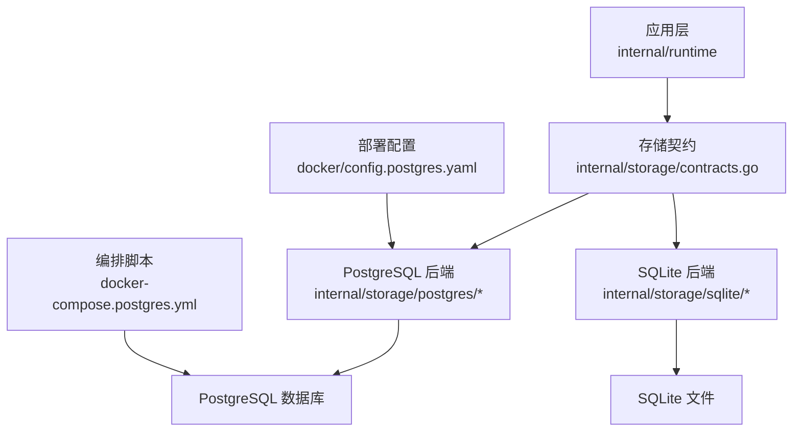
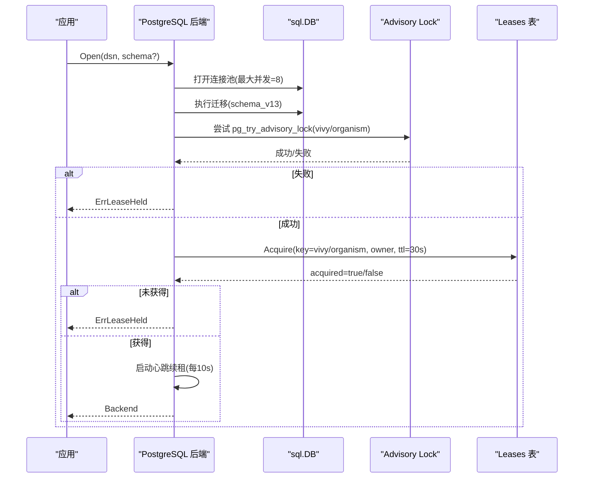
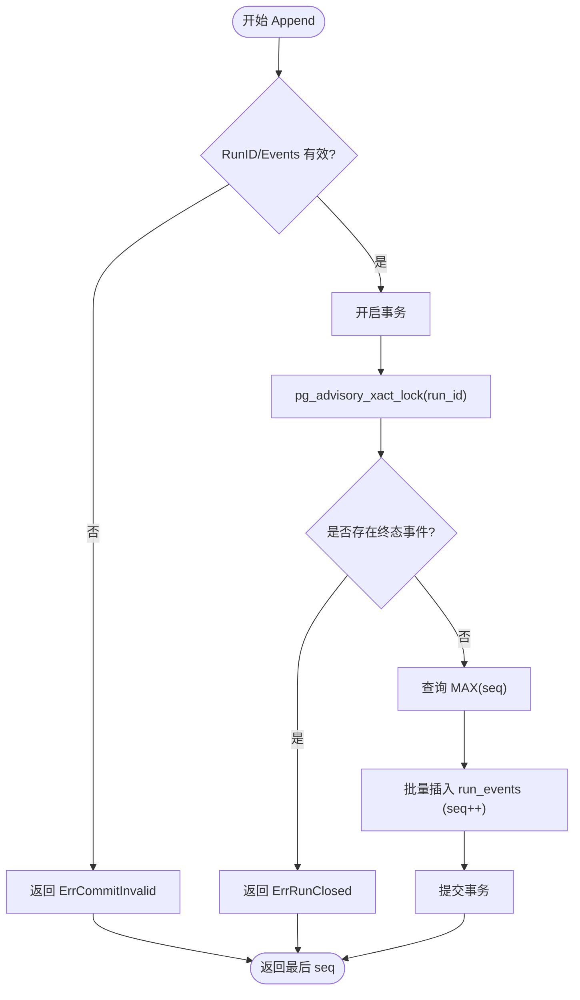
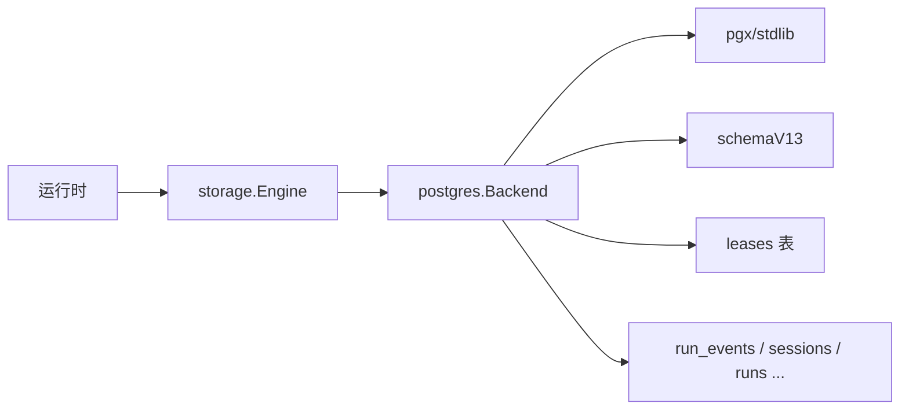

# PostgreSQL后端实现

<cite>
**本文引用的文件**
- [postgres.go](file://internal/storage/postgres/postgres.go)
- [db.go](file://internal/storage/postgres/db.go)
- [schema.go](file://internal/storage/postgres/schema.go)
- [lease.go](file://internal/storage/postgres/lease.go)
- [journal.go](file://internal/storage/postgres/journal.go)
- [sessions.go](file://internal/storage/postgres/sessions.go)
- [messages.go](file://internal/storage/postgres/messages.go)
- [runs.go](file://internal/storage/postgres/runs.go)
- [sqlite.go](file://internal/storage/sqlite/sqlite.go)
- [contracts.go](file://internal/storage/contracts.go)
- [config.postgres.yaml](file://docker/config.postgres.yaml)
- [docker-compose.postgres.yml](file://docker-compose.postgres.yml)
- [conformance_test.go](file://internal/storage/postgres/conformance_test.go)
</cite>

## 目录
1. [简介](#简介)
2. [项目结构](#项目结构)
3. [核心组件](#核心组件)
4. [架构总览](#架构总览)
5. [详细组件分析](#详细组件分析)
6. [依赖关系分析](#依赖关系分析)
7. [性能与高可用](#性能与高可用)
8. [故障排查指南](#故障排查指南)
9. [结论](#结论)
10. [附录：迁移与兼容性](#附录：迁移与兼容性)

## 简介
本文件聚焦于 Vivy 的 PostgreSQL 后端实现，说明其作为生产环境推荐后端的特性、分布式租约机制、并发控制策略以及与 SQLite 实现的差异。文档还涵盖数据库初始化与迁移、事务与锁、连接池、监控与调优建议，以及从 SQLite 迁移到 PostgreSQL 的步骤和兼容性说明。PostgreSQL 通过“单一进程持有实例租约”的方式保证同一数据库仅一个服务进程为“主”，其他进程启动即失败，从而避免多写冲突。

## 项目结构
PostgreSQL 后端位于 internal/storage/postgres 包，提供与 storage.Engine 契约一致的完整实现；SQLite 后端位于 internal/storage/sqlite，用于默认单机场景。配置与编排通过 docker/config.postgres.yaml 与 docker-compose.postgres.yml 提供示例。

图表来源
- [postgres.go:46-110](file://internal/storage/postgres/postgres.go#L46-L110)
- [contracts.go:252-273](file://internal/storage/contracts.go#L252-L273)
- [sqlite.go:38-55](file://internal/storage/sqlite/sqlite.go#L38-L55)
- [config.postgres.yaml:8-13](file://docker/config.postgres.yaml#L8-L13)
- [docker-compose.postgres.yml:22-31](file://docker-compose.postgres.yml#L22-L31)

章节来源
- [postgres.go:46-110](file://internal/storage/postgres/postgres.go#L46-L110)
- [contracts.go:252-273](file://internal/storage/contracts.go#L252-L273)
- [sqlite.go:38-55](file://internal/storage/sqlite/sqlite.go#L38-L55)
- [config.postgres.yaml:8-13](file://docker/config.postgres.yaml#L8-L13)
- [docker-compose.postgres.yml:22-31](file://docker-compose.postgres.yml#L22-L31)

## 核心组件
- 后端入口与生命周期管理：Open/OpenSchema 负责解析 DSN、创建 schema（可选）、迁移、会话级独占锁、实例租约获取与心跳续租、关闭时释放资源。
- 数据库封装：DB/Tx/Row 统一重写占位符（? -> $n），并在租约丢失时快速短路返回 ErrLeaseLost。
- 数据模型与迁移：一次性写入当前逻辑版本的所有表与索引，记录 schema_migrations。
- 租约系统：基于 leases 表的 Acquire/Release，配合后台心跳续租与 session advisory lock 防止重复主节点。
- 事件日志（Journal）：Append 在事务内以行级排他锁确保“每个 Run 最多一个终态事件”的不变式；Replay 按 seq 顺序流式回放。
- 会话/消息/运行等持久化：分别实现 SessionStore、MessageStore、RunStore 等契约方法。

章节来源
- [postgres.go:46-110](file://internal/storage/postgres/postgres.go#L46-L110)
- [db.go:13-58](file://internal/storage/postgres/db.go#L13-L58)
- [schema.go:3-199](file://internal/storage/postgres/schema.go#L3-L199)
- [lease.go:9-45](file://internal/storage/postgres/lease.go#L9-L45)
- [journal.go:14-79](file://internal/storage/postgres/journal.go#L14-L79)
- [sessions.go:13-103](file://internal/storage/postgres/sessions.go#L13-L103)
- [messages.go:10-53](file://internal/storage/postgres/messages.go#L10-L53)
- [runs.go:15-127](file://internal/storage/postgres/runs.go#L15-L127)

## 架构总览
PostgreSQL 后端通过统一的 storage.Engine 暴露给上层运行时。启动流程包括：解析 DSN、可选创建独立 schema、执行迁移、获取会话级 advisory lock、获取实例租约并启动心跳续租。所有写操作均受租约守卫保护，一旦租约丢失立即拒绝后续请求。

图表来源
- [postgres.go:46-110](file://internal/storage/postgres/postgres.go#L46-L110)
- [postgres.go:168-186](file://internal/storage/postgres/postgres.go#L168-L186)
- [postgres.go:192-220](file://internal/storage/postgres/postgres.go#L192-L220)
- [lease.go:9-35](file://internal/storage/postgres/lease.go#L9-L35)

## 详细组件分析

### 连接池与占位符重写
- 连接池：使用 pgx 解析 DSN，并通过 stdlib 包装为 *sql.DB；默认最大并发连接数为 8。可通过外部配置调整 DSN 参数或连接池大小。
- 占位符重写：DB/Tx 在执行前将 ? 替换为 $n，兼容跨后端 SQL 写法。
- 租约守卫：DB.guard() 在租约丢失时直接返回 ErrLeaseLost，避免无效 IO。

章节来源
- [postgres.go:113-122](file://internal/storage/postgres/postgres.go#L113-L122)
- [db.go:13-58](file://internal/storage/postgres/db.go#L13-L58)
- [db.go:93-107](file://internal/storage/postgres/db.go#L93-L107)

### 事务与并发控制
- 会话级独占锁：启动时使用 pg_try_advisory_lock 保证同一数据库只有一个进程能进入“主”路径。
- 实例租约：基于 leases 表 + 心跳续租（TTL=30s，心跳=10s）。若续租失败或被抢占，设置 fencing 标志，后续所有写操作立即失败。
- 事件追加：Append 在事务内对 run_id 加行级排他锁（pg_advisory_xact_lock），检查是否已有终态事件，再分配连续 seq 并插入 run_events。

图表来源
- [journal.go:14-79](file://internal/storage/postgres/journal.go#L14-L79)

章节来源
- [postgres.go:168-186](file://internal/storage/postgres/postgres.go#L168-L186)
- [postgres.go:192-220](file://internal/storage/postgres/postgres.go#L192-L220)
- [journal.go:14-79](file://internal/storage/postgres/journal.go#L14-L79)

### 数据模型与索引
- 核心表：sessions、messages、runs、run_events、approvals、snapshots、checkpoints、checkpoint_generations、leases、notes、questions、skill_revisions、todos、generations、eval_runs、promotions、studio_events。
- 关键索引：runs_parent_idx、runs_root_idx、approvals_status_expiry_idx、questions_status_expiry_idx、skill_revisions_status_idx、todos_session_position_idx、eval_runs_candidate_idx、promotions_from_accepted_idx。
- 这些索引支撑了会话/运行树遍历、待审批队列、技能修订状态查询、评测结果检索等常见负载。

章节来源
- [schema.go:3-199](file://internal/storage/postgres/schema.go#L3-L199)

### 会话、消息与运行
- 会话：支持创建、列出、读取、重命名、删除（级联删除消息、运行、事件）。
- 消息：追加不可变消息，按创建时间排序读取。
- 运行：创建、读取、状态更新、活跃运行枚举、子运行与根运行树遍历。

章节来源
- [sessions.go:13-103](file://internal/storage/postgres/sessions.go#L13-L103)
- [messages.go:10-53](file://internal/storage/postgres/messages.go#L10-L53)
- [runs.go:15-127](file://internal/storage/postgres/runs.go#L15-L127)

### 与 SQLite 的差异
- 连接模式：SQLite 强制单写（MaxOpenConns=1），避免 WAL/锁争用；PostgreSQL 使用连接池（默认 8），适合多客户端并发。
- 迁移方式：SQLite 逐条迁移脚本；PostgreSQL 一次性写入当前版本 schemaV13。
- 并发控制：SQLite 依赖文件锁；PostgreSQL 使用 advisory lock + leases 表 + 行级锁保障强一致。
- 扩展性：PostgreSQL 支持分库分表、分区、物化视图、全文搜索等高级能力；SQLite 更适合单机嵌入式场景。

章节来源
- [sqlite.go:38-55](file://internal/storage/sqlite/sqlite.go#L38-L55)
- [sqlite.go:109-147](file://internal/storage/sqlite/sqlite.go#L109-L147)
- [postgres.go:133-166](file://internal/storage/postgres/postgres.go#L133-L166)

## 依赖关系分析
- 上层仅依赖 storage.Engine 契约，不感知具体后端。
- PostgreSQL 后端依赖 pgx 解析 DSN，stdlib 适配 *sql.DB；通过 schema 隔离测试与多租户。
- 一致性由数据库事务与 advisory lock 保证，业务侧无需额外协调。

图表来源
- [contracts.go:252-273](file://internal/storage/contracts.go#L252-L273)
- [postgres.go:46-110](file://internal/storage/postgres/postgres.go#L46-L110)
- [schema.go:3-199](file://internal/storage/postgres/schema.go#L3-L199)

章节来源
- [contracts.go:252-273](file://internal/storage/contracts.go#L252-L273)
- [postgres.go:46-110](file://internal/storage/postgres/postgres.go#L46-L110)

## 性能与高可用
- 连接池与并发
  - 默认最大并发连接数 8；可根据 QPS 与延迟目标调整 DSN 连接参数（如 max_connections、pool_size 等）。
  - 读多写少场景可考虑只读副本 + 读写分离（需应用层路由）。
- 事务与锁
  - Append 使用行级排他锁避免竞态；建议合理拆分大事务，减少锁持有时间。
  - 长事务会阻塞索引维护与 VACUUM，应避免。
- 索引与查询
  - 充分利用现有索引（runs_parent/root、approvals/questions 过期扫描、skill_revisions 状态扫描）。
  - 热点查询可考虑物化视图（例如聚合统计、预览列表），定期刷新。
- 分区与归档
  - run_events 可按 run_id 或 created_at 分区，提升历史数据清理与查询性能。
  - checkpoints/checkpoint_generations 可结合 TTL 策略归档冷数据。
- 全文搜索
  - 可在 messages/note 字段上建立 GIN 索引或使用 tsvector，加速内容检索。
- 高可用与故障转移
  - 单一主节点：advisory lock + leases 表确保同一时刻仅一个进程为主。
  - 主从复制：建议使用云托管 PostgreSQL 的主从/集群方案；应用侧通过 DSN 指向 VIP/负载均衡器。
  - 故障转移：当主节点宕机，心跳停止导致租约过期，新主节点可重新获取租约接管。
- 监控指标（建议）
  - 连接池：活跃连接数、等待队列长度、连接复用率。
  - 事务：平均时长、超时次数、死锁/锁等待。
  - 锁：advisory lock 持有时长、竞争次数。
  - 表增长：run_events、messages、approvals 等表的增长速率与空间占用。
  - 慢查询：超过阈值的 SQL 执行计划与耗时。
- 调优建议
  - 根据工作负载调整 shared_buffers、work_mem、maintenance_work_mem。
  - 针对高频扫描表添加合适索引，避免全表扫描。
  - 定期 VACUUM/ANALYZE，保持统计信息准确。
  - 对大对象（payload）进行压缩或外置存储，降低行体积。

[本节为通用指导，不直接分析具体文件]

## 故障排查指南
- 启动即报“租约被占用”
  - 现象：第二个进程打开相同 DSN 返回 ErrLeaseHeld。
  - 原因：已有进程持有 instance lease 且未过期；或 advisory lock 仍被占用。
  - 处理：确认唯一主进程；必要时清理残留锁或等待 TTL 过期。
- 运行中写操作突然失败
  - 现象：出现 ErrLeaseLost。
  - 原因：心跳续租失败或租约被抢占，fencing 已启用。
  - 处理：检查网络/数据库健康；重启服务以重新获取租约。
- 事件追加失败
  - 现象：ErrRunClosed 或 ErrCommitInvalid。
  - 原因：Run 已存在终态事件，或一次提交包含多个终态事件。
  - 处理：修正业务逻辑，确保每个 Run 恰好一个终态事件。
- 会话删除未生效
  - 现象：DeleteSession 返回 NotFound。
  - 原因：会话不存在或已被删除。
  - 处理：先校验存在性，或捕获错误分支处理。

章节来源
- [postgres.go:168-186](file://internal/storage/postgres/postgres.go#L168-L186)
- [postgres.go:192-220](file://internal/storage/postgres/postgres.go#L192-L220)
- [postgres.go:229-251](file://internal/storage/postgres/postgres.go#L229-L251)
- [journal.go:14-79](file://internal/storage/postgres/journal.go#L14-L79)
- [sessions.go:70-103](file://internal/storage/postgres/sessions.go#L70-L103)
- [contracts.go:11-31](file://internal/storage/contracts.go#L11-L31)

## 结论
PostgreSQL 后端通过“会话级独占锁 + 实例租约 + 心跳续租”的组合，实现了生产级的高可用与强一致；借助事务与行级锁保证事件追加的正确性；丰富的索引与可扩展的数据模型为未来优化预留空间。相比 SQLite，PostgreSQL 更适合多进程、高并发与大规模数据场景。建议在部署时遵循“单一主节点”原则，并结合数据库集群与监控体系保障稳定性与可观测性。

[本节为总结，不直接分析具体文件]

## 附录：迁移与兼容性
- 从 SQLite 迁移到 PostgreSQL
  - 准备 PostgreSQL 实例与环境变量（DSN）。
  - 使用提供的 compose 配置启动 PostgreSQL，并确保健康检查通过。
  - 设置 storage.backend=postgres 与 dsn_env=VIVY_POSTGRES_DSN。
  - 首次启动会自动创建 schema 并执行迁移；如需隔离，可使用 OpenSchema 指定 schema。
  - 数据迁移：由于两套后端共享 storage 契约，但表结构与序列化可能不同，建议通过导出/导入工具或应用层 API 完成数据迁移。
- 兼容性说明
  - 契约层面：PostgreSQL 与 SQLite 均实现 storage.Engine，上层调用无感知。
  - 行为差异：SQLite 单写、PostgreSQL 多连接；事务隔离级别与锁语义由各自数据库决定。
  - 测试：PostgreSQL 后端通过 conformance 套件验证契约一致性。

章节来源
- [config.postgres.yaml:8-13](file://docker/config.postgres.yaml#L8-L13)
- [docker-compose.postgres.yml:4-31](file://docker-compose.postgres.yml#L4-L31)
- [conformance_test.go:17-40](file://internal/storage/postgres/conformance_test.go#L17-L40)
- [contracts.go:252-273](file://internal/storage/contracts.go#L252-L273)