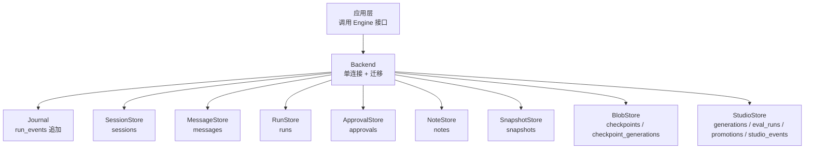
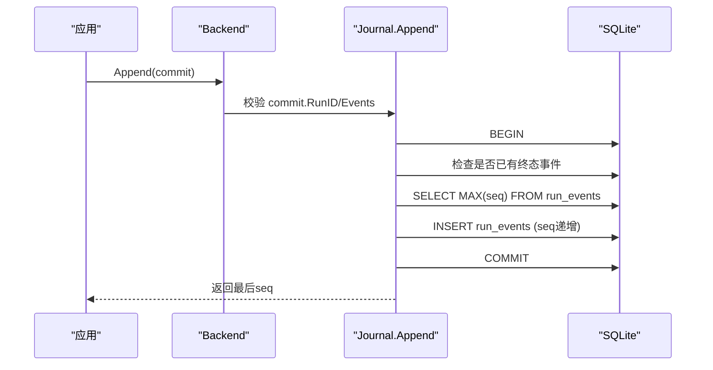
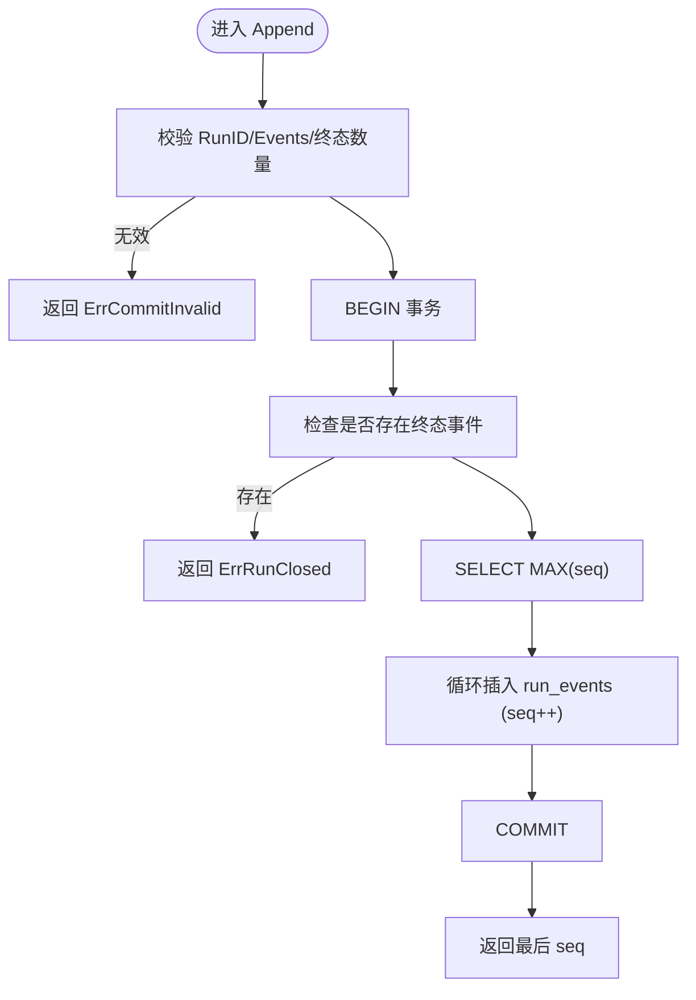
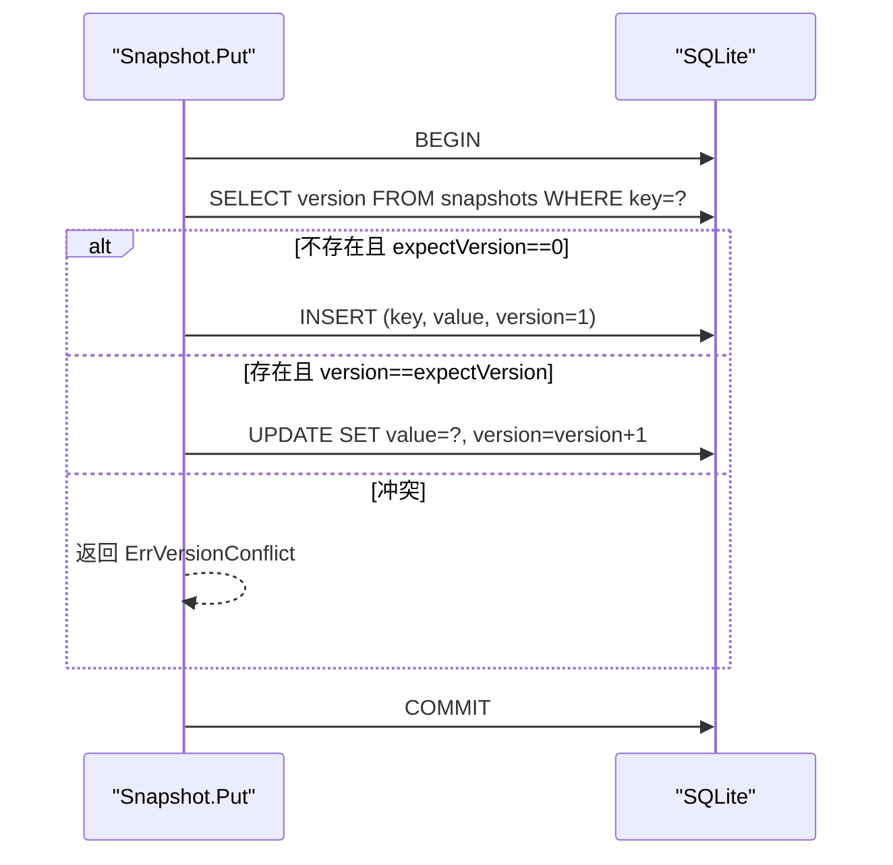
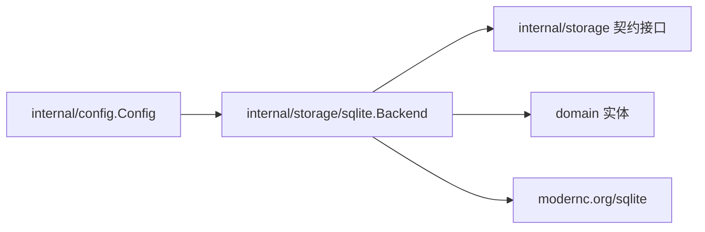

# SQLite后端实现

<cite>
**本文引用的文件**
- [sqlite.go](file://internal/storage/sqlite/sqlite.go)
- [sessions.go](file://internal/storage/sqlite/sessions.go)
- [messages.go](file://internal/storage/sqlite/messages.go)
- [journal.go](file://internal/storage/sqlite/journal.go)
- [blob.go](file://internal/storage/sqlite/blob.go)
- [snapshot.go](file://internal/storage/sqlite/snapshot.go)
- [approvals.go](file://internal/storage/sqlite/approvals.go)
- [runs.go](file://internal/storage/sqlite/runs.go)
- [notes.go](file://internal/storage/sqlite/notes.go)
- [contracts.go](file://internal/storage/contracts.go)
- [doc.go](file://internal/storage/doc.go)
- [config.go](file://internal/config/config.go)
</cite>

## 目录
1. [简介](#简介)
2. [项目结构](#项目结构)
3. [核心组件](#核心组件)
4. [架构总览](#架构总览)
5. [详细组件分析](#详细组件分析)
6. [依赖关系分析](#依赖关系分析)
7. [性能与调优](#性能与调优)
8. [故障排查指南](#故障排查指南)
9. [结论](#结论)
10. [附录](#附录)

## 简介
本文件系统性说明 Vivy 的 SQLite 默认存储后端。SQLite 作为 V0 参考后端，使用纯 Go 驱动 modernc.org/sqlite，无 CGO 依赖，所有 SQLite 细节被严格隔离在存储契约之下，不泄漏到上层领域代码。它提供事件日志（Journal）、会话消息、运行树、审批与问答、笔记、快照、Blob（检查点）等持久化能力，并通过版本化迁移确保启动时 schema 一致性。

## 项目结构
SQLite 后端位于 internal/storage/sqlite，围绕一组接口契约（internal/storage/contracts.go）实现：
- 引擎与连接：Backend 封装单一数据库句柄，强制单写者以规避 SQLite 并发锁争用。
- 数据模型与迁移：通过内联 SQL 常量定义多版本迁移，按序执行并记录于 schema_migrations。
- 功能模块：
  - 会话与会话消息：sessions.go、messages.go
  - 事件日志：journal.go
  - 运行树与状态：runs.go
  - 审批与超时清理：approvals.go
  - 问答：questions.go（同包）
  - 笔记：notes.go
  - 快照与 Blob：snapshot.go、blob.go
  - Studio 对象与事件：studio.go（同包）
  - 技能修订与待办：skill_revisions.go、todos.go（同包）

图表来源
- [sqlite.go:40-88](file://internal/storage/sqlite/sqlite.go#L40-L88)
- [contracts.go:55-273](file://internal/storage/contracts.go#L55-L273)

章节来源
- [sqlite.go:17-147](file://internal/storage/sqlite/sqlite.go#L17-L147)
- [doc.go:1-18](file://internal/storage/doc.go#L1-L18)

## 核心组件
- 引擎 Backend：对外暴露 Journal、SessionStore、MessageStore、RunStore、ApprovalStore、NoteStore、LeaseStore、SnapshotStore、BlobStore、StudioStore 等接口；提供 Snapshot() 与 Blobs() 子句柄；Close() 释放连接。
- 迁移系统：migrations 数组按顺序执行，每个迁移在独立事务中运行，失败即中止启动（FR-8）。
- 单写者策略：SetMaxOpenConns(1)，避免 WAL 膨胀与锁争用，简化并发模型。
- 契约错误：统一返回 ErrVersionConflict、ErrRunClosed、ErrCommitInvalid、ErrNotFound、ErrLeaseHeld、ErrLeaseLost 等。

章节来源
- [sqlite.go:40-88](file://internal/storage/sqlite/sqlite.go#L40-L88)
- [sqlite.go:109-147](file://internal/storage/sqlite/sqlite.go#L109-L147)
- [contracts.go:11-31](file://internal/storage/contracts.go#L11-L31)

## 架构总览
SQLite 后端将“不可变事件日志”和“可变状态”解耦：
- 事件日志 run_events：追加写入、单调 seq、恰好一个终态事件（D-008）。
- 会话消息 messages：追加写入，无更新路径（FR-2）。
- 运行树 runs：维护父子根关系与深度，支持活跃查询与树遍历。
- 审批 approvals：首写获胜，支持过期、取消、陈旧标记与超时清理。
- 快照 snapshots：键值对带版本号，乐观并发控制。
- Blob（检查点）：按 generation 追加，原子翻转指针行，保证读一致。

图表来源
- [journal.go:14-75](file://internal/storage/sqlite/journal.go#L14-L75)

章节来源
- [journal.go:14-86](file://internal/storage/sqlite/journal.go#L14-L86)
- [contracts.go:33-64](file://internal/storage/contracts.go#L33-L64)

## 详细组件分析

### 表结构与索引策略
- sessions：会话元信息（id、title、created_at、sandbox_mode、approval_policy），主键 id。
- messages：会话消息（id、session_id、run_id、role、created_at、content、tool_call_id、tool_name、tool_args），外键 session_id 引用 sessions(id)。
- runs：运行生命周期（id、session_id、status、created_at、kind、parent_run_id、root_run_id、depth），外键 session_id 引用 sessions(id)。
- run_events：事件日志（run_id、seq、type、created_at、payload_version、payload），主键 (run_id, seq)。
- approvals：审批（id、run_id、tool_call_id、decision、expires_at、resume_target、kind、action、target、precondition_hash、preview、risk_findings_json、proposal_data、tool_name、created_at、decided_at、actor、decision_reason、stale_reason、sandbox_mode、approval_policy、timeout_at）。
- notes：笔记（id、content、created_at）。
- questions：问答（id、run_id、tool_call_id、prompt、answer、status、expires_at、resume_target、created_at、answered_at、actor、decision_reason）。
- skill_revisions：技能修订（id、run_id、skill_name、action、target_path、payload、base_hash、content_hash、preview、warnings_json、status、created_at、applied_at、before_payload）。
- todos：待办（session_id、id、subject、description、status、blocks_json、blocked_by_json、active_form、owner、metadata_json、position、created_at、updated_at），复合主键 (session_id, id)。
- snapshots：快照（key、value、version），主键 key。
- checkpoints / checkpoint_generations：检查点指针与分代数据（id、generation、checksum、created_at；id、generation、blob）。
- generations / eval_runs / promotions / studio_events：Studio 对象平面与事件。

索引要点
- runs_parent_idx(parent_run_id, created_at, id)、runs_root_idx(root_run_id, created_at, id)：加速父子与根树查询。
- skill_revisions_status_idx(status, created_at, id)：加速待处理修订列表。
- todos_session_position_idx(session_id, position, id)：按位置排序展示。
- approvals_status_expiry_idx(decision, expires_at, id)、questions_status_expiry_idx(status, expires_at, id)：加速过期扫描与队列。
- eval_runs_candidate_idx(candidate_id, created_at, id)：评估运行按候选生成时间排序。
- promotions_from_accepted_idx(from_id) WHERE phase='accepted'：唯一约束用于已接受提升。

章节来源
- [sqlite.go:149-405](file://internal/storage/sqlite/sqlite.go#L149-L405)

### 事务管理与连接池
- 单写者：SetMaxOpenConns(1)，避免 SQLite 并发锁问题，简化 WAL 与锁行为。
- 迁移事务：每个迁移独立事务，失败回滚并中止启动。
- 业务事务：Append、Put（快照/Blob）、删除会话等关键操作均使用显式事务，保证原子性。

章节来源
- [sqlite.go:40-55](file://internal/storage/sqlite/sqlite.go#L40-L55)
- [sqlite.go:109-147](file://internal/storage/sqlite/sqlite.go#L109-L147)
- [journal.go:32-75](file://internal/storage/sqlite/journal.go#L32-L75)
- [snapshot.go:37-70](file://internal/storage/sqlite/snapshot.go#L37-L70)
- [blob.go:20-53](file://internal/storage/sqlite/blob.go#L20-L53)
- [sessions.go:72-103](file://internal/storage/sqlite/sessions.go#L72-L103)

### 事件日志追加写入机制
- 入参校验：RunID 非空、至少一个事件、最多一个终态事件。
- 终态保护：若 run_events 已存在终态事件，拒绝后续追加。
- 序列分配：基于 MAX(seq)+1 连续分配，插入后返回最后 seq。
- 回放：Replay 按 seq 升序流式迭代，供 after_seq 游标重放。

图表来源
- [journal.go:14-75](file://internal/storage/sqlite/journal.go#L14-L75)

章节来源
- [journal.go:14-86](file://internal/storage/sqlite/journal.go#L14-L86)

### 会话消息持久化策略
- 追加写入：AppendMessage 仅 INSERT，无更新路径（FR-2）。
- 读取：ListMessages 按 created_at、id 排序，保证时序稳定。
- 工具调用投影：tool_call_id、tool_name、tool_args 字段用于模型可见的工具回合。

章节来源
- [messages.go:10-53](file://internal/storage/sqlite/messages.go#L10-L53)
- [sqlite.go:343-349](file://internal/storage/sqlite/sqlite.go#L343-L349)

### 检查点快照的版本控制
- 快照（Snapshots）：Get 返回 value 与 version；Put 采用乐观并发，expectVersion=0 表示创建新键，否则要求当前版本匹配，否则返回 ErrVersionConflict。
- Blob（检查点）：Put 先插入 checkpoint_generations（id, generation, blob），再原子翻转 checkpoints 指针（ON CONFLICT 更新 generation/checksum/created_at），Get 通过 JOIN 获取当前 generation 的 blob。Delete 同时删除指针与所有分代。

图表来源
- [snapshot.go:34-70](file://internal/storage/sqlite/snapshot.go#L34-L70)

章节来源
- [snapshot.go:18-70](file://internal/storage/sqlite/snapshot.go#L18-L70)
- [blob.go:18-88](file://internal/storage/sqlite/blob.go#L18-L88)
- [contracts.go:66-85](file://internal/storage/contracts.go#L66-L85)

### 运行树与会话删除
- 运行树：runs 表维护 parent_run_id、root_run_id、depth，提供 ListChildRuns 与 ListRunTree 查询。
- 会话删除：DeleteSession 在一个事务中依次删除 run_events、runs、messages、sessions，保证级联一致性。

章节来源
- [runs.go:15-127](file://internal/storage/sqlite/runs.go#L15-L127)
- [sessions.go:70-103](file://internal/storage/sqlite/sessions.go#L70-L103)

### 审批与超时清理
- 首写获胜：DecideApprovalWithMetadata 仅在 decision=pending 时更新，返回受影响行数判断是否成功。
- 生命周期：ExpireApproval、CancelApproval、MarkApprovalStale 分别处理过期、取消、陈旧场景。
- 超时清理：ListExpiredApprovals 与 SweepExpiredApprovals 配合后台调度器自动清理超时审批。

章节来源
- [approvals.go:15-274](file://internal/storage/sqlite/approvals.go#L15-L274)

### 笔记与会话范围待办
- 笔记：AppendNote 追加写入，ListNotes 最新优先，GetNote 按 id 查找。
- 待办：todos 表以 (session_id, id) 为主键，支持按 position 排序与更新。

章节来源
- [notes.go:13-59](file://internal/storage/sqlite/notes.go#L13-L59)
- [sqlite.go:298-318](file://internal/storage/sqlite/sqlite.go#L298-L318)

## 依赖关系分析
- 契约边界：storage 包定义 Journal、SnapshotStore、BlobStore、LeaseStore 等接口，SQLite 后端仅依赖 domain 与 storage，不引入 SQLite 类型到上层。
- 配置边界：Config 指定 backend="sqlite" 与 sqlite.path，DataDirectory 根据路径推导工作目录。
- 测试与合规：conformance_test 使用共享双打开模式验证后端一致性。

图表来源
- [config.go:70-83](file://internal/config/config.go#L70-L83)
- [sqlite.go:6-15](file://internal/storage/sqlite/sqlite.go#L6-L15)
- [contracts.go:55-273](file://internal/storage/contracts.go#L55-L273)

章节来源
- [config.go:70-83](file://internal/config/config.go#L70-L83)
- [doc.go:1-18](file://internal/storage/doc.go#L1-L18)
- [conformance_test.go:12-31](file://internal/storage/sqlite/conformance_test.go#L12-L31)

## 性能与调优
- 连接与并发
  - 单写者：SetMaxOpenConns(1) 降低锁争用与 WAL 增长风险。
  - 预编译语句：Append 使用 PrepareContext 批量插入，减少解析开销。
- 索引优化
  - runs 父子/根索引、skill_revisions 状态索引、todos 位置索引、approvals/questions 过期索引，显著提升常见查询。
- 事件与消息
  - 事件追加与消息追加均为 O(1) 写入；回放按 seq 有序流式读取，适合大日志。
- 快照与 Blob
  - 快照乐观并发避免长事务；Blob 分代追加与原子指针翻转保证读一致性与可回溯。
- 配置相关限制
  - MaxEventPayloadBytes、MaxHistoryMessages、MaxRunEvents 等运行时上限控制内存与磁盘增长。

[本节为通用指导，不直接分析具体文件]

## 故障排查指南
- 启动失败
  - 迁移失败会中止启动（FR-8），检查 schema_migrations 与对应迁移 SQL。
- 事件追加失败
  - ErrRunClosed：目标 run 已有终态事件；ErrCommitInvalid：commit 为空或包含多个终态事件。
- 会话删除未生效
  - 检查 DeleteSession 事务是否提交，确认级联删除顺序。
- 快照冲突
  - ErrVersionConflict：期望版本与实际版本不一致，需重试或重新读取版本。
- 审批卡住
  - 检查 approvals 的 decision、timeout_at、expires_at；使用 ListExpiredApprovals 与 SweepExpiredApprovals 清理。
- 检查点损坏
  - 使用 CheckpointOrphaner 钩子（测试用途）清理孤儿指针与分代。

章节来源
- [sqlite.go:109-147](file://internal/storage/sqlite/sqlite.go#L109-L147)
- [journal.go:14-75](file://internal/storage/sqlite/journal.go#L14-L75)
- [snapshot.go:34-70](file://internal/storage/sqlite/snapshot.go#L34-L70)
- [approvals.go:200-274](file://internal/storage/sqlite/approvals.go#L200-L274)
- [sqlite.go:90-107](file://internal/storage/sqlite/sqlite.go#L90-L107)

## 结论
SQLite 后端以简洁可靠的单写者模型、严格的契约隔离与版本化迁移，提供了稳定的事件日志、会话消息、运行树、审批与快照/Blob 持久化能力。其设计强调不可变事件与可变状态的解耦、乐观并发与原子指针翻转，以及完善的索引与事务保障，适合作为单机或轻量部署的默认存储方案。

[本节为总结性内容，不直接分析具体文件]

## 附录

### 数据库初始化与迁移脚本
- 初始化：Open 时创建 schema_migrations 表，并按 migrations 数组顺序执行迁移，记录 applied_at。
- 迁移清单：migration001~migration013 覆盖会话、消息、运行、事件、审批、笔记、问答、技能修订、待办、Studio 对象、沙箱与审批策略等。

章节来源
- [sqlite.go:17-405](file://internal/storage/sqlite/sqlite.go#L17-L405)

### 备份与恢复方案
- 建议方案：停止服务或使用只读副本，复制 .db 文件；或在应用层使用 VACUUM INTO 生成一致性快照（参考前端仓库中的实现思路）。
- 恢复：将备份文件替换原库并重启服务；如需校验完整性，可在恢复前进行完整性检查。

[本节为通用实践，不直接分析具体文件]

### 性能基准测试建议
- 写入压测：高并发 Append 与 AppendMessage，观察 seq 分配与锁等待。
- 回放压测：Replay 大日志，验证流式迭代与内存占用。
- 快照/Blob：Put 高频更新与 Get 一致性，验证乐观冲突与分代增长。
- 指标：QPS、P99 延迟、WAL 大小、索引命中率、事务耗时。

[本节为通用指导，不直接分析具体文件]