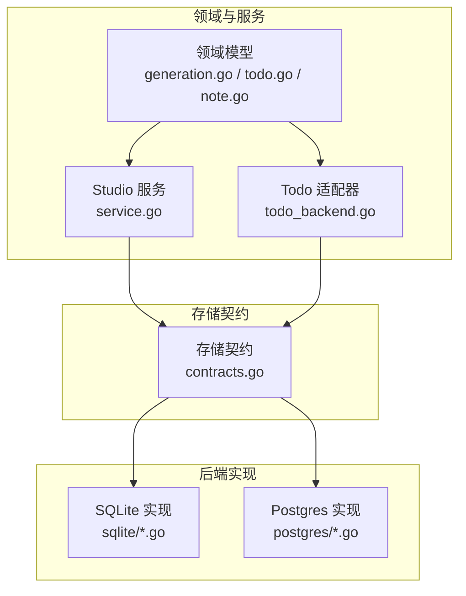
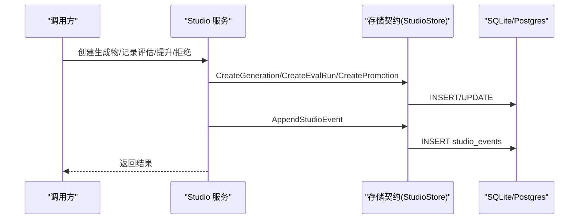
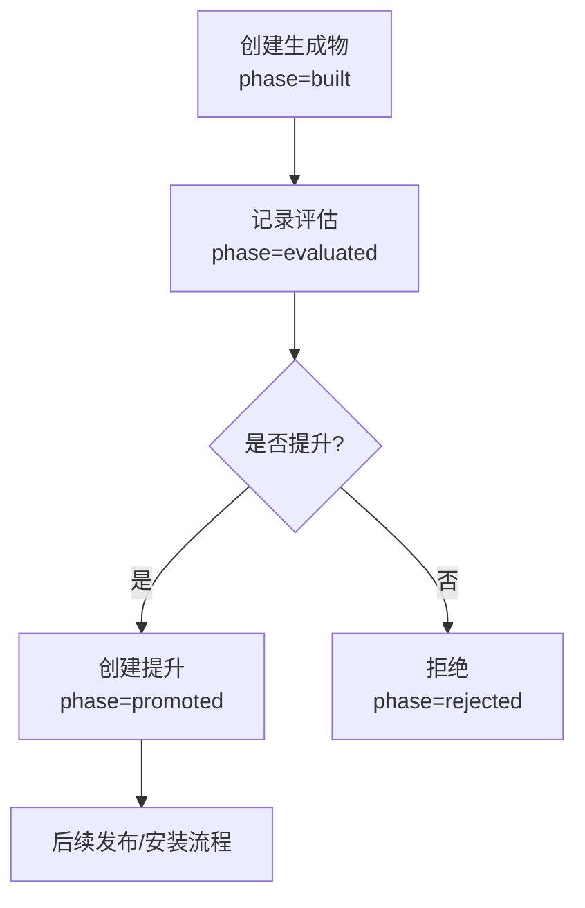
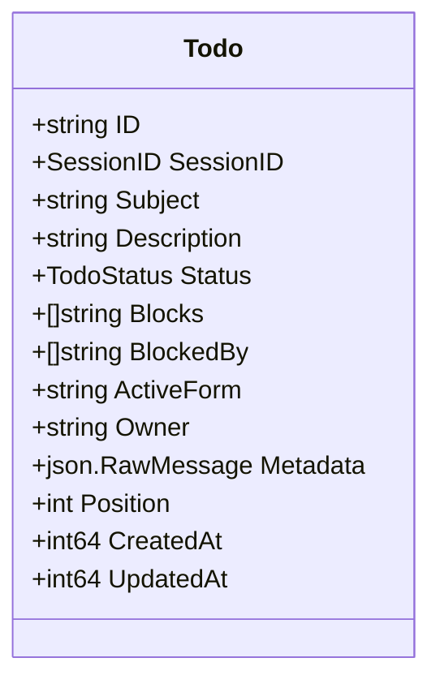
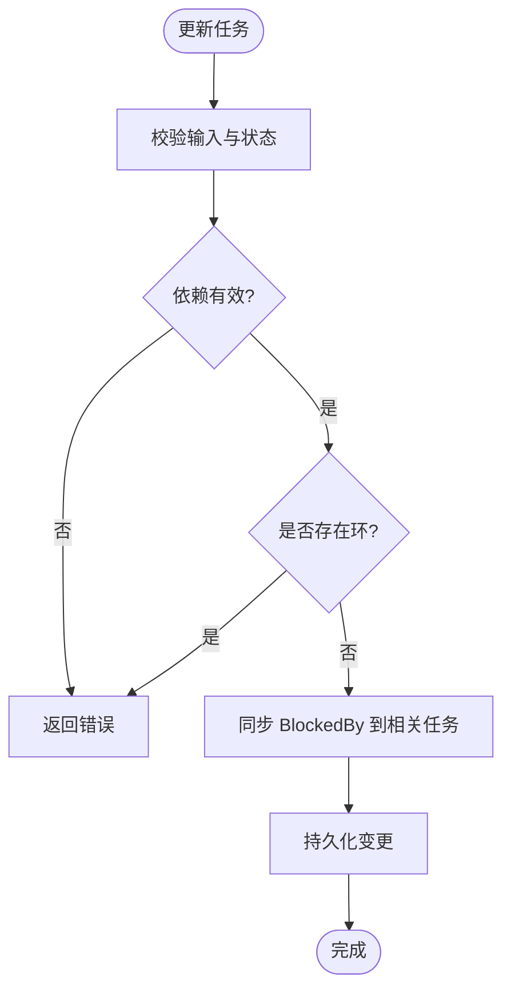
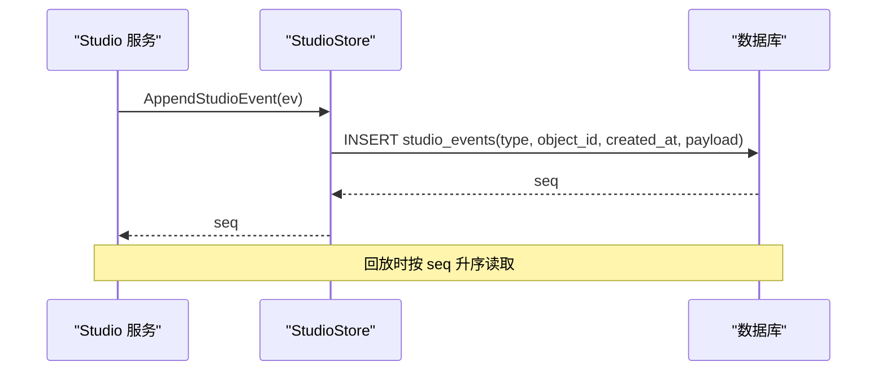
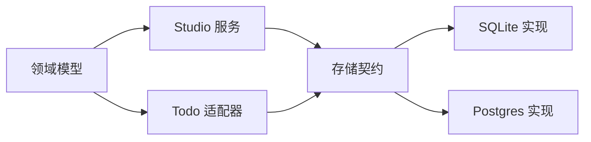

# Studio特性存储

<cite>
**本文引用的文件**
- [internal/storage/contracts.go](file://internal/storage/contracts.go)
- [internal/domain/generation.go](file://internal/domain/generation.go)
- [internal/domain/todo.go](file://internal/domain/todo.go)
- [internal/domain/note.go](file://internal/domain/note.go)
- [internal/studio/service.go](file://internal/studio/service.go)
- [internal/runtime/todo_backend.go](file://internal/runtime/todo_backend.go)
- [internal/storage/postgres/schema.go](file://internal/storage/postgres/schema.go)
- [internal/storage/sqlite/sqlite.go](file://internal/storage/sqlite/sqlite.go)
- [internal/storage/postgres/studio.go](file://internal/storage/postgres/studio.go)
- [internal/storage/sqlite/studio.go](file://internal/storage/sqlite/studio.go)
- [internal/storage/postgres/todos.go](file://internal/storage/postgres/todos.go)
- [internal/storage/sqlite/todos.go](file://internal/storage/sqlite/todos.go)
- [internal/storage/postgres/notes.go](file://internal/storage/postgres/notes.go)
- [internal/storage/sqlite/notes.go](file://internal/storage/sqlite/notes.go)
</cite>

## 目录
1. [简介](#简介)
2. [项目结构](#项目结构)
3. [核心组件](#核心组件)
4. [架构总览](#架构总览)
5. [详细组件分析](#详细组件分析)
6. [依赖关系分析](#依赖关系分析)
7. [性能考量](#性能考量)
8. [故障排查指南](#故障排查指南)
9. [结论](#结论)
10. [附录](#附录)

## 简介
本文件系统性说明 Vivy Studio 的特性存储子系统，围绕以下目标展开：
- 解释 generations、eval_runs、promotions、studio_events 表的设计与用途，覆盖开发工作流的版本控制与评估流水线。
- 详细说明 todos 表的待办事项管理，包括任务依赖关系、阻塞分析与进度跟踪。
- 解释 notes 表的笔记存储机制（追加式不可变设计）及搜索索引策略。
- 说明 Studio 事件的序列化与回放机制，包括事件类型定义与负载结构。
- 提供开发环境数据隔离、多用户协作支持与数据同步策略建议。
- 给出 Studio 数据的导入导出工具与迁移脚本思路。

## 项目结构
Studio 特性存储由“领域模型 + 服务层 + 存储契约 + 具体后端实现”组成：
- 领域模型：定义 Generation/EvalRun/Promotion/StudioEvent/Todo/Note 等数据结构与状态机。
- 服务层：封装业务规则（如创建生成物、记录评估、人工提升、拒绝等），并产生 Studio 事件。
- 存储契约：抽象出 Journal、NoteStore、TodoStore、StudioStore 等接口，屏蔽底层数据库差异。
- 具体后端：SQLite（默认，单写者）与 Postgres（可选），通过迁移或一次性建表完成初始化。

图表来源
- [internal/storage/contracts.go:128-147](file://internal/storage/contracts.go#L128-L147)
- [internal/studio/service.go:23-31](file://internal/studio/service.go#L23-L31)
- [internal/runtime/todo_backend.go:30-39](file://internal/runtime/todo_backend.go#L30-L39)

章节来源
- [internal/storage/contracts.go:128-147](file://internal/storage/contracts.go#L128-L147)
- [internal/storage/sqlite/sqlite.go:17-36](file://internal/storage/sqlite/sqlite.go#L17-L36)
- [internal/storage/postgres/schema.go:159-199](file://internal/storage/postgres/schema.go#L159-L199)

## 核心组件
- 领域模型
  - Generation/EvalVerdict/PromotionPhase/Release/Install/StudioEventType/StudioEvent：描述生成物生命周期、评估结果、提升动作与 Studio 事件。
  - Todo/TodoStatus：会话级任务投影，支持依赖与阻塞双向关系。
  - Note：追加式不可变笔记条目。
- 服务层
  - Studio Service：负责创建 Generation、记录 EvalRun、Promotion 审批、Reject 等，并在每次关键变更时写入 studio_events。
- 存储契约
  - StudioStore：CRUD Generation/EvalRun/Promotion 以及 Append/List StudioEvents。
  - TodoStore/NoteStore：分别承载任务与笔记的持久化。
- 后端实现
  - SQLite：通过迁移逐步构建 schema（含 studio 对象平面）。
  - Postgres：一次性声明 schema（包含 todos、generations、eval_runs、promotions、studio_events 等）。

章节来源
- [internal/domain/generation.go:13-95](file://internal/domain/generation.go#L13-L95)
- [internal/domain/todo.go:5-30](file://internal/domain/todo.go#L5-L30)
- [internal/domain/note.go:1-11](file://internal/domain/note.go#L1-L11)
- [internal/studio/service.go:68-173](file://internal/studio/service.go#L68-L173)
- [internal/storage/contracts.go:128-147](file://internal/storage/contracts.go#L128-L147)
- [internal/storage/sqlite/sqlite.go:351-394](file://internal/storage/sqlite/sqlite.go#L351-L394)
- [internal/storage/postgres/schema.go:141-199](file://internal/storage/postgres/schema.go#L141-L199)

## 架构总览
Studio 特性存储采用“领域驱动 + 契约抽象 + 多后端”的架构：
- 领域层定义稳定的业务概念与状态机。
- 服务层将业务规则与事件流结合，保证每次变更可审计、可回放。
- 存储契约解耦上层逻辑与底层实现，便于在 SQLite 与 Postgres 间切换。
- 后端通过迁移或统一建表确保 schema 一致性。

图表来源
- [internal/studio/service.go:68-173](file://internal/studio/service.go#L68-L173)
- [internal/storage/postgres/studio.go:15-218](file://internal/storage/postgres/studio.go#L15-L218)
- [internal/storage/sqlite/studio.go:15-242](file://internal/storage/sqlite/studio.go#L15-L242)

## 详细组件分析

### 生成物、评估与提升（generations、eval_runs、promotions）
- 设计要点
  - generations：记录一次打包产物（ID、父ID、工件哈希、源引用、配方、阶段、时间戳）。
  - eval_runs：候选生成物与基线的对比运行，记录套件、判定、日志引用与时间。
  - promotions：人工门禁的“下一版”开关，限制仅一个 accepted 提升指向同一 from_id。
  - studio_events：追加式事件日志，用于审计与回放；seq 自增保证顺序。
- 状态流转
  - Generation 阶段：built → eval_pending → evaluated → promoted/rejected → released（由服务与外部流程驱动）。
  - Promotion 仅允许 accepted 且对 from_id 唯一。
- 约束与索引
  - eval_runs 按 candidate_id 建立索引以加速查询。
  - promotions 使用条件唯一索引保障每个 from_id 仅有一个 accepted。

图表来源
- [internal/domain/generation.go:13-95](file://internal/domain/generation.go#L13-L95)
- [internal/storage/postgres/schema.go:159-190](file://internal/storage/postgres/schema.go#L159-L190)
- [internal/storage/sqlite/sqlite.go:351-394](file://internal/storage/sqlite/sqlite.go#L351-L394)

章节来源
- [internal/domain/generation.go:13-95](file://internal/domain/generation.go#L13-L95)
- [internal/storage/postgres/schema.go:159-190](file://internal/storage/postgres/schema.go#L159-L190)
- [internal/storage/sqlite/sqlite.go:351-394](file://internal/storage/sqlite/sqlite.go#L351-L394)
- [internal/storage/postgres/studio.go:15-205](file://internal/storage/postgres/studio.go#L15-L205)
- [internal/storage/sqlite/studio.go:15-205](file://internal/storage/sqlite/studio.go#L15-L205)
- [internal/studio/service.go:68-173](file://internal/studio/service.go#L68-L173)

### 待办事项（todos）
- 设计要点
  - 会话级投影：以 session_id 为分区键，避免跨会话污染。
  - 依赖与阻塞：Blocks 表示当前任务依赖哪些任务；BlockedBy 反向维护被谁阻塞。
  - 进度跟踪：status 支持 pending/in_progress/completed/cancelled；position 维持顺序。
- 业务规则（运行时校验）
  - 文本长度限制、最大任务数限制。
  - 更新时校验依赖存在、禁止自依赖、禁止循环依赖、同时仅允许一个 in_progress。
  - 更新依赖会同步反查 BlockedBy 并幂等落库。
- 存储实现
  - blocks_json/blocked_by_json/metadata_json 以 JSON 列存储，读取时反序列化为切片/原始消息。
  - 列表按 position,id 排序，便于前端渲染。

图表来源
- [internal/domain/todo.go:5-30](file://internal/domain/todo.go#L5-L30)

图表来源
- [internal/runtime/todo_backend.go:97-163](file://internal/runtime/todo_backend.go#L97-L163)
- [internal/runtime/todo_backend.go:304-335](file://internal/runtime/todo_backend.go#L304-L335)

章节来源
- [internal/domain/todo.go:5-30](file://internal/domain/todo.go#L5-L30)
- [internal/runtime/todo_backend.go:42-163](file://internal/runtime/todo_backend.go#L42-L163)
- [internal/storage/sqlite/todos.go:16-112](file://internal/storage/sqlite/todos.go#L16-L112)
- [internal/storage/postgres/todos.go:16-112](file://internal/storage/postgres/todos.go#L16-L112)
- [internal/storage/sqlite/sqlite.go:298-318](file://internal/storage/sqlite/sqlite.go#L298-L318)
- [internal/storage/postgres/schema.go:141-158](file://internal/storage/postgres/schema.go#L141-L158)

### 笔记（notes）
- 设计要点
  - 追加式不可变：无更新/删除路径，与消息日志一致，便于审计与回溯。
  - 列表 newest-first：便于摘要计算与快速浏览。
- 存储实现
  - id/content/created_at 三字段；Postgres/SQLite 均提供 Append/List/Get。
- 搜索索引
  - 当前未内置全文索引；如需搜索可在应用层构建倒排索引或借助数据库全文检索扩展（例如 SQLite FTS5、Postgres tsvector），但需遵循密钥脱敏与最小权限原则。

章节来源
- [internal/domain/note.go:1-11](file://internal/domain/note.go#L1-L11)
- [internal/storage/postgres/notes.go:13-59](file://internal/storage/postgres/notes.go#L13-L59)
- [internal/storage/sqlite/notes.go:13-59](file://internal/storage/sqlite/notes.go#L13-L59)
- [internal/storage/sqlite/sqlite.go:227-235](file://internal/storage/sqlite/sqlite.go#L227-L235)
- [internal/storage/postgres/schema.go:101-105](file://internal/storage/postgres/schema.go#L101-L105)

### Studio 事件（studio_events）序列化与回放
- 事件类型与负载
  - 类型：generation.created、evalrun.recorded、promotion.accepted、generation.rejected、release.accepted、install.recorded、install.rolled_back、worktree.pinned。
  - 负载：JSON 字节数组，包含关键对象标识与上下文信息（如 ID、阶段、评估结果等）。
- 追加与回放
  - AppendStudioEvent：插入一行并返回 seq（Postgres 用 RETURNING，SQLite 用 LastInsertId）。
  - ListStudioEvents：按 seq ASC 顺序读取，供 UI 或下游系统回放。
- 与运行日志的区别
  - studio_events 属于 Studio 对象平面，不是 run journal 行，独立于运行事件总线。

图表来源
- [internal/domain/generation.go:151-180](file://internal/domain/generation.go#L151-L180)
- [internal/storage/postgres/studio.go:207-238](file://internal/storage/postgres/studio.go#L207-L238)
- [internal/storage/sqlite/studio.go:207-242](file://internal/storage/sqlite/studio.go#L207-L242)

章节来源
- [internal/domain/generation.go:151-180](file://internal/domain/generation.go#L151-L180)
- [internal/storage/postgres/studio.go:207-238](file://internal/storage/postgres/studio.go#L207-L238)
- [internal/storage/sqlite/studio.go:207-242](file://internal/storage/sqlite/studio.go#L207-L242)
- [internal/storage/sqlite/sqlite.go:351-394](file://internal/storage/sqlite/sqlite.go#L351-L394)
- [internal/storage/postgres/schema.go:192-199](file://internal/storage/postgres/schema.go#L192-L199)

## 依赖关系分析
- 耦合与内聚
  - Studio 服务仅依赖 storage.StudioStore 接口，不感知后端差异。
  - Todo 适配器同时适配 Eino plantask 与 Vivy 工具，内聚了依赖校验与循环检测。
- 直接/间接依赖
  - 领域模型被服务与后端共同消费。
  - 后端通过迁移/建表维护 schema 一致性。
- 外部依赖
  - SQLite 使用 modernc.org/sqlite（纯 Go，无 CGO）。
  - Postgres 使用标准 sql 驱动。
- 潜在循环依赖
  - 代码分层清晰，未见循环依赖迹象。

图表来源
- [internal/storage/contracts.go:128-147](file://internal/storage/contracts.go#L128-L147)
- [internal/runtime/todo_backend.go:30-39](file://internal/runtime/todo_backend.go#L30-L39)
- [internal/studio/service.go:23-31](file://internal/studio/service.go#L23-L31)

章节来源
- [internal/storage/contracts.go:128-147](file://internal/storage/contracts.go#L128-L147)
- [internal/runtime/todo_backend.go:30-39](file://internal/runtime/todo_backend.go#L30-L39)
- [internal/studio/service.go:23-31](file://internal/studio/service.go#L23-L31)

## 性能考量
- 追加式写入
  - notes、studio_events 均为追加型，适合高吞吐写入与顺序回放。
- 索引优化
  - eval_runs(candidate_id)、promotions(from_id 条件唯一)、todos(session_id, position) 等索引支撑常用查询与约束。
- 并发与锁
  - SQLite 单写者模式降低竞争；Postgres 可通过事务与唯一约束保证一致性。
- 扫描与分页
  - 列表查询按时间或位置排序，建议在大数据量场景增加分页或游标读取。
- 序列化开销
  - JSON 列读写带来一定 CPU 开销，注意合理拆分热点字段或引入结构化列。

[本节为通用指导，不直接分析具体文件]

## 故障排查指南
- 常见错误
  - 不存在：获取 Generation/EvalRun/Note/Todo 时返回 not found。
  - 冲突：Promotion 重复 accepted 或唯一约束失败。
  - 无效参数：GenerationPhase/EvalVerdict/PromotionPhase 非法值。
- 定位方法
  - 检查 studio_events 中对应对象的最近事件，确认操作链路与负载内容。
  - 检查 todos 依赖图是否存在环或自依赖。
  - 核对 SQLite 迁移版本或 Postgres schema 是否与代码一致。
- 恢复建议
  - 基于 studio_events 重放重建视图。
  - 清理无效的临时生成物或评估记录。
  - 修正依赖关系后重试更新。

章节来源
- [internal/storage/postgres/studio.go:152-166](file://internal/storage/postgres/studio.go#L152-L166)
- [internal/storage/sqlite/studio.go:152-166](file://internal/storage/sqlite/studio.go#L152-L166)
- [internal/storage/postgres/notes.go:45-59](file://internal/storage/postgres/notes.go#L45-L59)
- [internal/storage/sqlite/notes.go:45-59](file://internal/storage/sqlite/notes.go#L45-L59)
- [internal/runtime/todo_backend.go:121-138](file://internal/runtime/todo_backend.go#L121-L138)

## 结论
Studio 特性存储通过清晰的领域模型、服务层与存储契约，实现了可审计、可回放的版本控制与评估流水线。todos 提供会话级任务管理与强一致的依赖校验；notes 提供不可变的笔记追加能力；studio_events 作为统一的变更事件源，支撑 UI 实时性与离线回放。SQLite 与 Postgres 双后端满足开发与生产不同需求。

[本节为总结性内容，不直接分析具体文件]

## 附录

### 数据隔离、多用户协作与同步策略
- 数据隔离
  - 会话级隔离：todos 以 session_id 分区；sessions/messages/runs 也按会话组织。
  - 密钥脱敏：配置只保存 env_key，日志/快照/事件负载必须脱敏。
- 多用户协作
  - 乐观并发：Promotion 通过唯一约束防止重复接受。
  - 分布式锁：LeaseStore 可用于进程级独占（如服务器端数据库）。
- 同步策略
  - 基于 studio_events 的增量同步：客户端维护 last_seq，拉取新事件进行回放。
  - 定期快照：结合 SnapshotStore 固化状态，减少回放成本。

章节来源
- [internal/storage/contracts.go:87-94](file://internal/storage/contracts.go#L87-L94)
- [internal/storage/postgres/schema.go:180-190](file://internal/storage/postgres/schema.go#L180-L190)
- [internal/storage/sqlite/sqlite.go:351-394](file://internal/storage/sqlite/sqlite.go#L351-L394)

### 导入导出与迁移脚本
- 导出
  - 导出 generations/eval_runs/promotions/studio_events 为 JSON 或 CSV，保留 seq/order。
  - 导出 todos/notes 时附带 session_id 与时间戳。
- 导入
  - 先导入静态参考数据（如 sessions），再导入主数据，最后导入事件以保证顺序。
  - 导入前校验外键与唯一约束，必要时先清空目标表。
- 迁移
  - SQLite：通过 migrations 列表顺序执行，失败即中止启动。
  - Postgres：使用统一 schema 字符串一次性建表，后续版本需保持向后兼容。

章节来源
- [internal/storage/sqlite/sqlite.go:17-36](file://internal/storage/sqlite/sqlite.go#L17-L36)
- [internal/storage/sqlite/sqlite.go:109-147](file://internal/storage/sqlite/sqlite.go#L109-L147)
- [internal/storage/postgres/schema.go:1-5](file://internal/storage/postgres/schema.go#L1-L5)