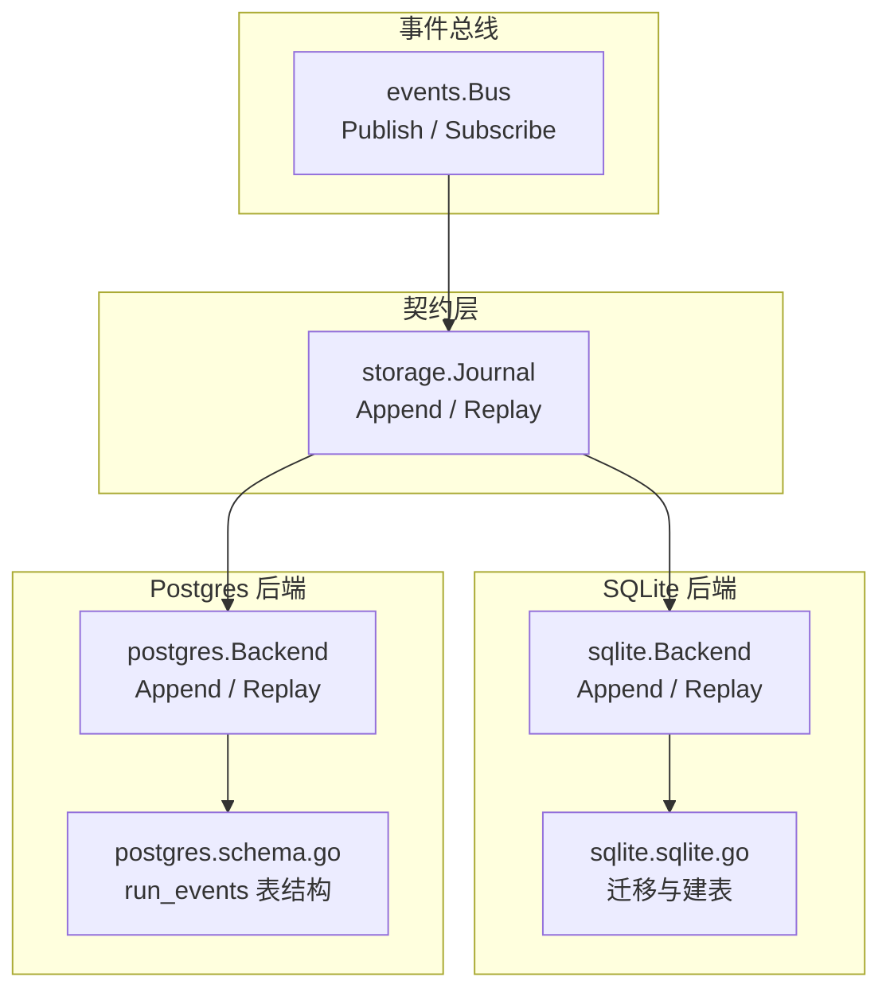
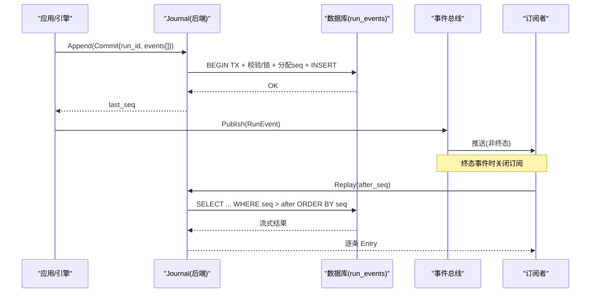
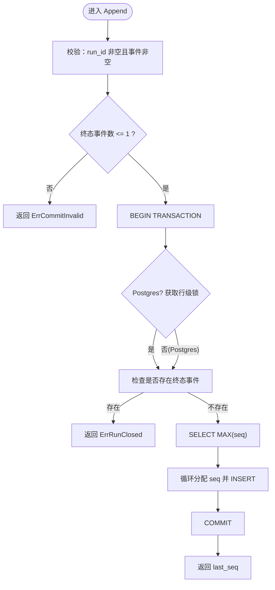
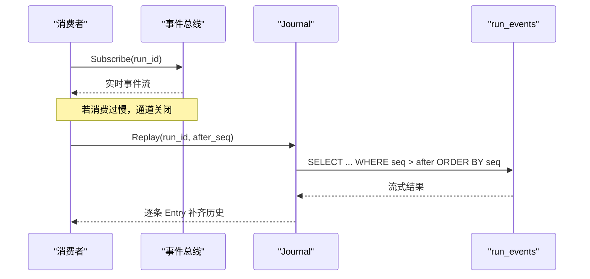
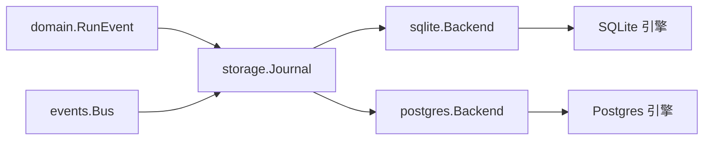

# 事件日志存储

<cite>
**本文引用的文件**
- [internal/storage/contracts.go](file://internal/storage/contracts.go)
- [internal/storage/postgres/journal.go](file://internal/storage/postgres/journal.go)
- [internal/storage/sqlite/journal.go](file://internal/storage/sqlite/journal.go)
- [internal/storage/postgres/schema.go](file://internal/storage/postgres/schema.go)
- [internal/storage/sqlite/sqlite.go](file://internal/storage/sqlite/sqlite.go)
- [internal/events/bus.go](file://internal/events/bus.go)
- [schemas/events/run-event.schema.json](file://schemas/events/run-event.schema.json)
- [schemas/events/payloads/run.started.json](file://schemas/events/payloads/run.started.json)
- [schemas/events/payloads/tool.requested.json](file://schemas/events/payloads/tool.requested.json)
- [schemas/events/payloads/model.delta.json](file://schemas/events/payloads/model.delta.json)
</cite>

## 目录
1. [简介](#简介)
2. [项目结构](#项目结构)
3. [核心组件](#核心组件)
4. [架构总览](#架构总览)
5. [详细组件分析](#详细组件分析)
6. [依赖关系分析](#依赖关系分析)
7. [性能考量](#性能考量)
8. [故障排查指南](#故障排查指南)
9. [结论](#结论)
10. [附录](#附录)

## 简介
本文件面向 Vivy 运行时的事件日志存储子系统，围绕 run_events 表与 Journal 接口展开，系统性说明：
- 复合主键 (run_id, seq) 的索引策略与查询语义
- payload_version 字段在事件负载演进中的作用
- BLOB/BYTEA 类型承载的 payload 压缩与空间管理策略
- 事件追加写入的序列号生成、事务边界与并发安全
- after_seq 游标重放机制及断线重连、一致性校验
- 事件查询优化、批量插入性能与存储空间治理
- 事件序列化格式规范与常见问题定位方法

## 项目结构
事件日志存储由“契约层 + 双后端实现 + 事件总线”构成：
- 契约层定义 Journal、Commit、Entry、Iterator 等统一接口与错误语义
- SQLite 与 Postgres 两种持久化后端分别实现 Append/Replay
- 事件总线将持久化的 RunEvent 广播给在线订阅者，并支持慢消费者回退到 Journal 重放

图表来源
- [internal/storage/contracts.go:55-64](file://internal/storage/contracts.go#L55-L64)
- [internal/storage/sqlite/journal.go:18-79](file://internal/storage/sqlite/journal.go#L18-L79)
- [internal/storage/postgres/journal.go:18-79](file://internal/storage/postgres/journal.go#L18-L79)
- [internal/storage/sqlite/sqlite.go:17-36](file://internal/storage/sqlite/sqlite.go#L17-L36)
- [internal/storage/postgres/schema.go:39-47](file://internal/storage/postgres/schema.go#L39-L47)
- [internal/events/bus.go:10-15](file://internal/events/bus.go#L10-L15)

章节来源
- [internal/storage/contracts.go:55-64](file://internal/storage/contracts.go#L55-L64)
- [internal/storage/sqlite/sqlite.go:17-36](file://internal/storage/sqlite/sqlite.go#L17-L36)
- [internal/storage/postgres/schema.go:39-47](file://internal/storage/postgres/schema.go#L39-L47)
- [internal/events/bus.go:10-15](file://internal/events/bus.go#L10-L15)

## 核心组件
- 事件契约与错误
  - Journal.Append：原子提交一个 Commit（同一 run 的多条事件），返回最后分配的 seq；禁止重复终态事件，且一次提交最多一个终态事件。
  - Journal.Replay：按 seq > after 顺序流式回放，供断线重连或后读消费。
  - 关键错误：ErrRunClosed（已存在终态事件）、ErrCommitInvalid（空提交或超过一个终态事件）。
- 后端实现
  - SQLite：单写者模型，通过迁移脚本维护 schema；Append 使用事务内自增 seq；Replay 使用 ORDER BY seq 流式迭代。
  - Postgres：Append 使用行级 advisory lock 保证同一 run 的串行追加；Replay 同 SQLite。
- 事件总线
  - Bus.Publish：将持久化后的事件广播给该 run 的在线订阅者；遇到终态事件关闭并清理订阅；慢消费者被丢弃，后续从 Journal 重放恢复。

章节来源
- [internal/storage/contracts.go:11-31](file://internal/storage/contracts.go#L11-L31)
- [internal/storage/contracts.go:55-64](file://internal/storage/contracts.go#L55-L64)
- [internal/storage/sqlite/journal.go:18-79](file://internal/storage/sqlite/journal.go#L18-L79)
- [internal/storage/postgres/journal.go:18-79](file://internal/storage/postgres/journal.go#L18-L79)
- [internal/events/bus.go:42-75](file://internal/events/bus.go#L42-L75)

## 架构总览
事件从运行期产生，经 Journal 持久化为 run_events 记录；同时通过 Bus 推送至在线订阅者。离线或掉线消费者通过 Replay(after_seq) 从最近位置继续消费，确保最终一致。

图表来源
- [internal/storage/postgres/journal.go:18-79](file://internal/storage/postgres/journal.go#L18-L79)
- [internal/storage/sqlite/journal.go:18-79](file://internal/storage/sqlite/journal.go#L18-L79)
- [internal/events/bus.go:42-75](file://internal/events/bus.go#L42-L75)

## 详细组件分析

### run_events 表设计与索引策略
- 列设计
  - run_id：事件所属运行实例
  - seq：每 run 单调递增的序号，从 1 开始
  - type：事件类型（如 run.started、tool.requested、model.delta 等）
  - created_at：Unix 毫秒时间戳
  - payload_version：负载版本，用于向后兼容
  - payload：BLOB/BYTEA 二进制负载
- 主键与索引
  - PRIMARY KEY(run_id, seq)：天然提供“按 run 有序追加”和“按 run 范围扫描”的高效能力
  - 查询模式
    - 追加：INSERT 走主键唯一性约束，天然避免重复
    - 回放：WHERE run_id=? AND seq>? ORDER BY seq 利用主键前缀索引高效定位起点并按序拉取
    - 统计：COUNT(*) WHERE run_id=? AND type IN (...) 用于终态检测
- 扩展建议（可选）
  - 若需频繁按 type 过滤或按 created_at 范围检索，可考虑额外索引；但当前以 run_id+seq 为主路径，保持简单更利于追加性能

章节来源
- [internal/storage/postgres/schema.go:39-47](file://internal/storage/postgres/schema.go#L39-L47)
- [internal/storage/sqlite/sqlite.go:176-184](file://internal/storage/sqlite/sqlite.go#L176-L184)
- [internal/storage/postgres/journal.go:42-55](file://internal/storage/postgres/journal.go#L42-L55)
- [internal/storage/sqlite/journal.go:38-52](file://internal/storage/sqlite/journal.go#L38-L52)

### payload_version 的作用与兼容性
- 作用
  - 标识 payload 的结构版本，消费者拒绝未知版本，从而在负载演进时保持强一致性
  - 与 JSON Schema 配合，形成“契约即验证”的机制
- 典型事件负载示例
  - run.started：包含 provider、model、mode、policy_profile、policy_hash 等
  - tool.requested：包含 tool_call_id、tool_name、args
  - model.delta：包含增量文本 delta
- 演进策略
  - 新增字段：payload_version 递增，旧消费者忽略未知字段（schema 限制 additionalProperties=false 时需谨慎）
  - 破坏性变更：必须升级 payload_version，并在消费端做分支处理

章节来源
- [schemas/events/run-event.schema.json:63-67](file://schemas/events/run-event.schema.json#L63-L67)
- [schemas/events/payloads/run.started.json:1-35](file://schemas/events/payloads/run.started.json#L1-L35)
- [schemas/events/payloads/tool.requested.json:1-23](file://schemas/events/payloads/tool.requested.json#L1-L23)
- [schemas/events/payloads/model.delta.json:1-15](file://schemas/events/payloads/model.delta.json#L1-L15)

### BLOB/BYTEA 负载与压缩优化
- 存储形态
  - SQLite 使用 BLOB，Postgres 使用 BYTEA 存储 payload
- 压缩策略
  - 代码未内置通用压缩器；建议在应用层对大 payload 进行压缩后再写入，或在读取侧按需解压
  - 对于高频小负载（如 model.delta），可直接存储；对超大负载（如工具输出）应结合预算裁剪与压缩
- 空间管理
  - 结合消息/工具输出的预算裁剪（例如保留头部与尾部片段并标记截断），减少 payload 体积
  - 定期归档或清理历史 run 的冗余事件，控制表增长

章节来源
- [internal/storage/postgres/schema.go:39-47](file://internal/storage/postgres/schema.go#L39-L47)
- [internal/storage/sqlite/sqlite.go:176-184](file://internal/storage/sqlite/sqlite.go#L176-L184)

### 事件追加写入：序列号、事务与并发安全
- 序列号生成
  - 先查询 MAX(seq)，再在事务中为每条事件分配 seq = max + i，保证连续单调
- 事务边界
  - 整个 Append 在一个事务中完成：校验终态数量、检查是否已关闭、分配 seq、批量插入、提交
- 并发安全
  - SQLite：单写者连接池（SetMaxOpenConns=1），避免并发写入竞争
  - Postgres：使用 advisory_xact_lock(hashtextextended(run_id)) 在同一事务内锁定特定 run，防止多进程并发追加导致冲突
- 终态约束
  - 一次提交最多一个终态事件；若 run 已有终态事件，则拒绝追加（ErrRunClosed）

图表来源
- [internal/storage/postgres/journal.go:18-79](file://internal/storage/postgres/journal.go#L18-L79)
- [internal/storage/sqlite/journal.go:18-79](file://internal/storage/sqlite/journal.go#L18-L79)
- [internal/storage/sqlite/sqlite.go:45-47](file://internal/storage/sqlite/sqlite.go#L45-L47)

章节来源
- [internal/storage/postgres/journal.go:18-79](file://internal/storage/postgres/journal.go#L18-L79)
- [internal/storage/sqlite/journal.go:18-79](file://internal/storage/sqlite/journal.go#L18-L79)
- [internal/storage/sqlite/sqlite.go:45-47](file://internal/storage/sqlite/sqlite.go#L45-L47)

### after_seq 游标重放与断线重连
- 重放语义
  - Replay(run_id, after)：按 seq > after 的顺序流式返回事件，适合断线后从上次消费位置继续
- 一致性保障
  - 由于 Append 是原子且 seq 严格单调，Replay 不会丢失事件
  - 消费者在收到终态事件后可停止订阅，后续如需完整历史，仍可从 Journal 重放
- 慢消费者保护
  - Bus 对慢消费者直接丢弃通道，避免阻塞生产端；消费者需自行从 Journal 重放补齐

图表来源
- [internal/storage/postgres/journal.go:81-89](file://internal/storage/postgres/journal.go#L81-L89)
- [internal/storage/sqlite/journal.go:77-86](file://internal/storage/sqlite/journal.go#L77-L86)
- [internal/events/bus.go:77-106](file://internal/events/bus.go#L77-L106)

章节来源
- [internal/storage/postgres/journal.go:81-89](file://internal/storage/postgres/journal.go#L81-L89)
- [internal/storage/sqlite/journal.go:77-86](file://internal/storage/sqlite/journal.go#L77-L86)
- [internal/events/bus.go:77-106](file://internal/events/bus.go#L77-L106)

### 事件查询优化
- 主键前缀扫描
  - WHERE run_id=? AND seq>? ORDER BY seq 充分利用主键 (run_id, seq) 的前缀索引，起点定位 O(log N) 或常数级（取决于实现）
- 终态检测
  - COUNT(*) WHERE run_id=? AND type IN (...) 快速判断 run 是否已关闭
- 批量化读取
  - 使用 Iterator 流式读取，避免一次性加载全部事件，降低内存峰值

章节来源
- [internal/storage/postgres/journal.go:42-55](file://internal/storage/postgres/journal.go#L42-L55)
- [internal/storage/sqlite/journal.go:38-52](file://internal/storage/sqlite/journal.go#L38-L52)
- [internal/storage/postgres/journal.go:81-89](file://internal/storage/postgres/journal.go#L81-L89)
- [internal/storage/sqlite/journal.go:77-86](file://internal/storage/sqlite/journal.go#L77-L86)

### 批量插入性能
- 预编译语句
  - 在事务内 PrepareContext 插入语句，循环 ExecContext 插入多条事件，减少 SQL 解析开销
- 事务粒度
  - 单次 Append 的事务包含所有事件，保证原子性与连续性
- 后端差异
  - SQLite：单写者连接，避免 WAL/锁争用
  - Postgres：advisory lock 保证同一 run 的串行追加，避免并发写入导致的竞态

章节来源
- [internal/storage/postgres/journal.go:58-73](file://internal/storage/postgres/journal.go#L58-L73)
- [internal/storage/sqlite/journal.go:55-69](file://internal/storage/sqlite/journal.go#L55-L69)
- [internal/storage/sqlite/sqlite.go:45-47](file://internal/storage/sqlite/sqlite.go#L45-L47)

### 存储空间管理策略
- 负载大小控制
  - 对大负载（如工具输出）采用预算裁剪与标记截断，保留首尾片段，减少 payload 体积
- 数据生命周期
  - 对已完成 run 的历史事件可按策略归档或清理
- 索引与表膨胀
  - 保持 run_events 表结构简单，必要时对高选择性列建立辅助索引；监控表大小与碎片

章节来源
- [internal/runtime/compaction/pruner.go:130-180](file://internal/runtime/compaction/pruner.go#L130-L180)
- [internal/runtime/compaction/pruner.go:225-242](file://internal/runtime/compaction/pruner.go#L225-L242)

## 依赖关系分析
- 耦合与内聚
  - storage 契约层与具体后端解耦，便于替换与测试
  - events.Bus 仅依赖 domain 与 storage 契约，不感知后端细节
- 外部依赖
  - SQLite：modernc.org/sqlite（纯 Go，无 CGO）
  - Postgres：pg_advisory_xact_lock 行级锁
- 潜在循环依赖
  - 各包职责清晰，未见循环导入迹象

图表来源
- [internal/storage/contracts.go:55-64](file://internal/storage/contracts.go#L55-L64)
- [internal/storage/sqlite/sqlite.go:64-79](file://internal/storage/sqlite/sqlite.go#L64-L79)
- [internal/events/bus.go:10-15](file://internal/events/bus.go#L10-L15)

章节来源
- [internal/storage/contracts.go:55-64](file://internal/storage/contracts.go#L55-L64)
- [internal/storage/sqlite/sqlite.go:64-79](file://internal/storage/sqlite/sqlite.go#L64-L79)
- [internal/events/bus.go:10-15](file://internal/events/bus.go#L10-L15)

## 性能考量
- 追加写入
  - 使用事务 + 预编译语句 + 主键顺序插入，最大化吞吐
  - Postgres 使用 advisory lock 避免并发冲突；SQLite 单写者简化锁管理
- 回放读取
  - 基于主键前缀的 range scan，ORDER BY seq 保证稳定顺序
- 内存与 I/O
  - 使用 Iterator 流式读取，避免整表加载
  - 对大 payload 进行预算裁剪与压缩，降低 I/O 与网络传输成本
- 可扩展性
  - 若未来需要跨进程并发追加，Postgres 的 advisory lock 已具备基础；SQLite 需维持单写者或使用 WAL 调优

[本节为通用指导，无需特定文件引用]

## 故障排查指南
- 常见错误
  - ErrRunClosed：尝试向已存在终态事件的 run 追加事件。检查业务逻辑是否正确发送终态，以及是否重复提交。
  - ErrCommitInvalid：提交为空或包含多于一个终态事件。检查调用方组装 Commit 的逻辑。
  - 订阅者被丢弃：Bus 检测到慢消费者，关闭通道。需在客户端重新订阅并从 Journal Replay(after_seq) 补齐。
- 定位步骤
  - 确认 run_id 与 seq 范围：通过 Replay(after) 查看缺失区间
  - 检查终态事件：COUNT(*) WHERE type IN (run.completed, run.failed, run.cancelled, ...)
  - 核对 payload_version：消费者是否拒绝未知版本
- 恢复策略
  - 从最近成功消费的 after_seq 开始 Replay，直至追上最新 seq
  - 对大负载启用预算裁剪与压缩，避免 I/O 瓶颈

章节来源
- [internal/storage/contracts.go:11-31](file://internal/storage/contracts.go#L11-L31)
- [internal/storage/postgres/journal.go:42-50](file://internal/storage/postgres/journal.go#L42-L50)
- [internal/storage/sqlite/journal.go:38-46](file://internal/storage/sqlite/journal.go#L38-L46)
- [internal/events/bus.go:62-75](file://internal/events/bus.go#L62-L75)

## 结论
Vivy 的事件日志存储以 run_events 表为核心，通过主键 (run_id, seq) 提供高效追加与有序回放；借助 payload_version 与 JSON Schema 实现负载演进的强契约；SQLite 与 Postgres 双后端在事务与并发控制上各有优势；事件总线提供实时推送与慢消费者保护，整体满足高可靠、可扩展、易运维的事件日志需求。

[本节为总结性内容，无需特定文件引用]

## 附录

### 事件序列化格式规范
- 信封字段
  - run_id：字符串，非空
  - seq：整数，>=1，单调递增
  - type：枚举值，限定事件词汇表
  - created_at：Unix 毫秒
  - payload_version：整数，>=1，标识负载版本
  - payload：对象，具体形状由 type 决定
- 负载示例
  - run.started：provider、model、mode、policy_profile、policy_hash
  - tool.requested：tool_call_id、tool_name、args
  - model.delta：delta（增量文本）

章节来源
- [schemas/events/run-event.schema.json:7-74](file://schemas/events/run-event.schema.json#L7-L74)
- [schemas/events/payloads/run.started.json:1-35](file://schemas/events/payloads/run.started.json#L1-L35)
- [schemas/events/payloads/tool.requested.json:1-23](file://schemas/events/payloads/tool.requested.json#L1-L23)
- [schemas/events/payloads/model.delta.json:1-15](file://schemas/events/payloads/model.delta.json#L1-L15)