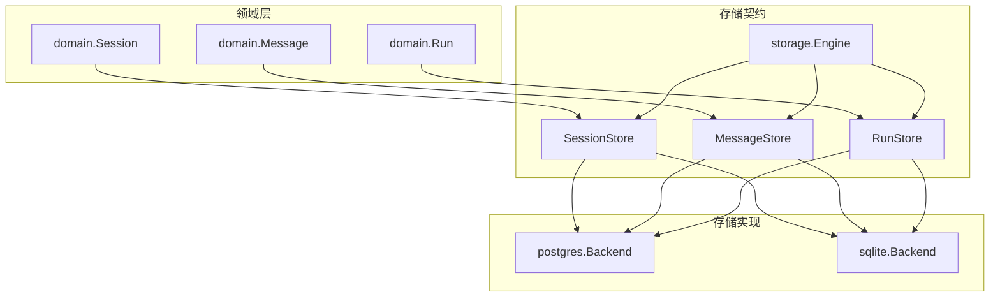
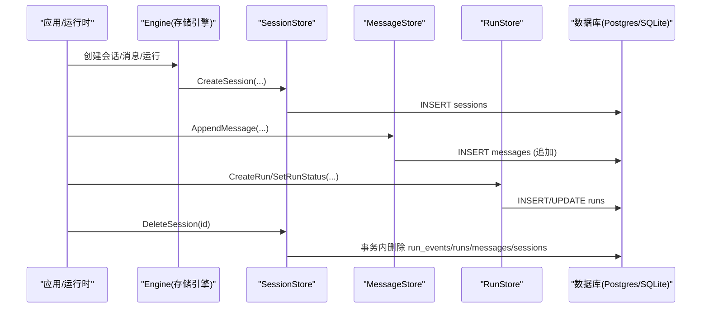
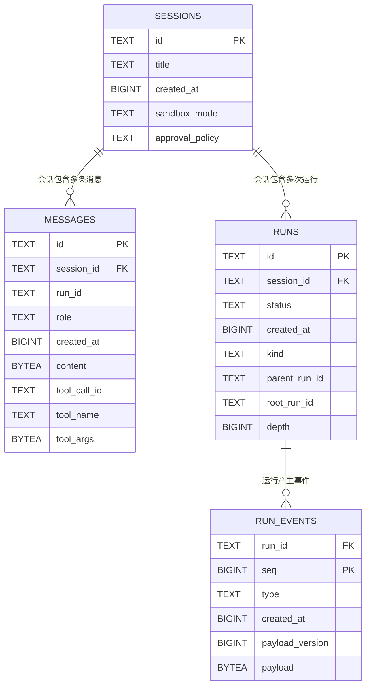
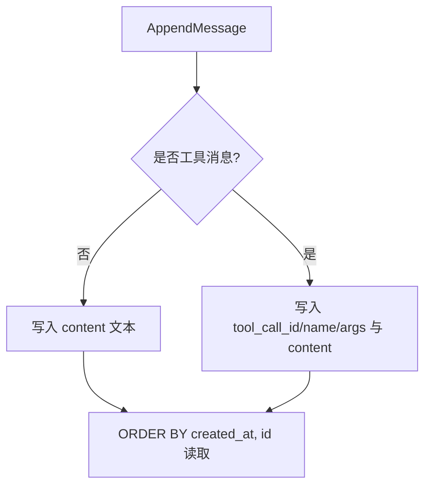
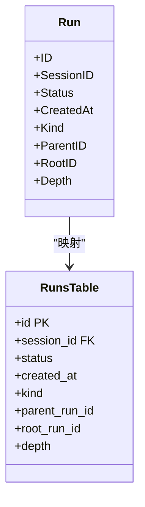
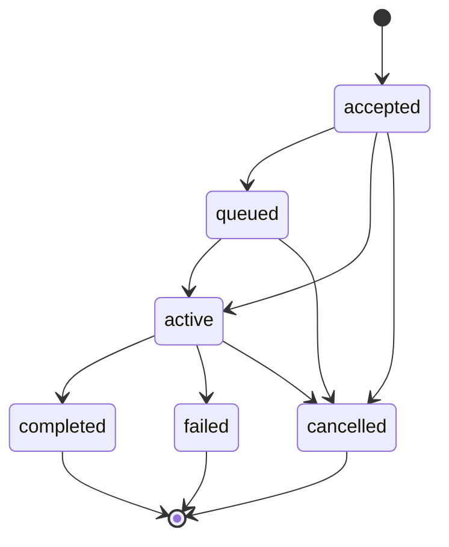
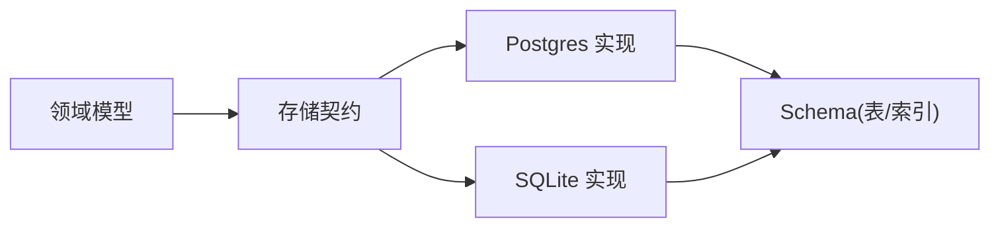

# 会话管理

<cite>
**本文引用的文件**
- [internal/domain/session.go](file://internal/domain/session.go)
- [internal/domain/run.go](file://internal/domain/run.go)
- [internal/storage/contracts.go](file://internal/storage/contracts.go)
- [internal/storage/postgres/schema.go](file://internal/storage/postgres/schema.go)
- [internal/storage/postgres/sessions.go](file://internal/storage/postgres/sessions.go)
- [internal/storage/postgres/messages.go](file://internal/storage/postgres/messages.go)
- [internal/storage/postgres/runs.go](file://internal/storage/postgres/runs.go)
- [internal/storage/sqlite/sessions.go](file://internal/storage/sqlite/sessions.go)
- [internal/storage/sqlite/messages.go](file://internal/storage/sqlite/messages.go)
- [internal/runtime/compaction/pruner.go](file://internal/runtime/compaction/pruner.go)
</cite>

## 目录
1. [简介](#简介)
2. [项目结构](#项目结构)
3. [核心组件](#核心组件)
4. [架构总览](#架构总览)
5. [详细组件分析](#详细组件分析)
6. [依赖关系分析](#依赖关系分析)
7. [性能考量](#性能考量)
8. [故障排查指南](#故障排查指南)
9. [结论](#结论)
10. [附录](#附录)

## 简介
本文件面向会话管理系统，围绕 sessions 与 messages 两张表的关系设计、会话生命周期、消息持久化策略、会话与运行实例的关联（父子运行树）、状态机、消息排序与查询优化、备份恢复与存储空间监控进行系统化说明。系统采用“追加式”消息存储，确保历史可追溯；会话删除通过事务级联清理相关数据；运行实例具备严格的状态机约束与父子树结构，便于追踪一次会话下的多次执行。

## 项目结构
- 领域模型：Session、Message、Run 等定义于 internal/domain。
- 存储契约：统一接口定义于 internal/storage/contracts.go，包括 SessionStore、MessageStore、RunStore 等。
- 存储实现：PostgreSQL 与 SQLite 两套实现分别位于 internal/storage/postgres 与 internal/storage/sqlite。
- 运行时压缩：internal/runtime/compaction 提供工具结果裁剪能力，用于控制上下文大小。



图表来源
- [internal/storage/contracts.go:96-161](file://internal/storage/contracts.go#L96-L161)
- [internal/storage/postgres/sessions.go:13-103](file://internal/storage/postgres/sessions.go#L13-L103)
- [internal/storage/postgres/messages.go:10-53](file://internal/storage/postgres/messages.go#L10-L53)
- [internal/storage/postgres/runs.go:15-127](file://internal/storage/postgres/runs.go#L15-L127)
- [internal/storage/sqlite/sessions.go:13-103](file://internal/storage/sqlite/sessions.go#L13-L103)
- [internal/storage/sqlite/messages.go:10-53](file://internal/storage/sqlite/messages.go#L10-L53)

章节来源
- [internal/storage/contracts.go:96-161](file://internal/storage/contracts.go#L96-L161)
- [internal/storage/postgres/sessions.go:13-103](file://internal/storage/postgres/sessions.go#L13-L103)
- [internal/storage/postgres/messages.go:10-53](file://internal/storage/postgres/messages.go#L10-L53)
- [internal/storage/postgres/runs.go:15-127](file://internal/storage/postgres/runs.go#L15-L127)
- [internal/storage/sqlite/sessions.go:13-103](file://internal/storage/sqlite/sessions.go#L13-L103)
- [internal/storage/sqlite/messages.go:10-53](file://internal/storage/sqlite/messages.go#L10-L53)

## 核心组件
- 会话与会话元信息：包含标题、创建时间、沙箱模式、审批策略等。
- 消息：追加式写入，角色区分用户/助手/工具，内容以字节数组存储，附带工具调用元数据与创建时间戳。
- 运行实例：记录一次 Agent 执行的生命周期、父子关系、深度与根节点标识，支持按父/根查询子树。
- 存储契约：统一抽象出会话、消息、运行、快照、事件日志等能力，屏蔽底层数据库差异。

章节来源
- [internal/domain/session.go:21-44](file://internal/domain/session.go#L21-L44)
- [internal/domain/run.go:5-95](file://internal/domain/run.go#L5-L95)
- [internal/storage/contracts.go:96-161](file://internal/storage/contracts.go#L96-L161)

## 架构总览
下图展示从领域到存储的调用路径与数据流向：上层通过 Engine 接口访问 SessionStore、MessageStore、RunStore；Postgres/SQLite 实现将领域对象映射为 SQL 操作，保证追加式消息与事务性删除。



图表来源
- [internal/storage/postgres/sessions.go:13-103](file://internal/storage/postgres/sessions.go#L13-L103)
- [internal/storage/postgres/messages.go:10-53](file://internal/storage/postgres/messages.go#L10-L53)
- [internal/storage/postgres/runs.go:15-127](file://internal/storage/postgres/runs.go#L15-L127)
- [internal/storage/sqlite/sessions.go:13-103](file://internal/storage/sqlite/sessions.go#L13-L103)
- [internal/storage/sqlite/messages.go:10-53](file://internal/storage/sqlite/messages.go#L10-L53)

## 详细组件分析

### 数据模型与表关系
- sessions 表：主键 id，标题、创建时间、沙箱模式、审批策略。
- messages 表：主键 id，session_id 外键引用 sessions.id，run_id 可选（用户消息为空），role 限定为用户/助手/工具，content 为字节数组，tool_call_id/tool_name/tool_args 用于工具调用投影，created_at 用于排序与审计。
- runs 表：主键 id，session_id 外键引用 sessions.id，status 状态机字段，kind 区分 primary/child，parent_run_id/root_run_id/depth 构成父子运行树。
- run_events 表：按 run_id 与 seq 主键，承载追加式事件日志。



图表来源
- [internal/storage/postgres/schema.go:6-47](file://internal/storage/postgres/schema.go#L6-L47)

章节来源
- [internal/storage/postgres/schema.go:6-47](file://internal/storage/postgres/schema.go#L6-L47)
- [internal/domain/session.go:21-44](file://internal/domain/session.go#L21-L44)
- [internal/domain/run.go:84-95](file://internal/domain/run.go#L84-L95)

### 会话生命周期管理
- 创建：插入 sessions 行，携带标题、创建时间、沙箱模式、审批策略。
- 更新：仅允许重命名标题。
- 查询：按创建时间倒序列出所有会话；按 id 精确获取。
- 删除：在单个事务中依次删除 run_events、runs、messages、sessions，保证一致性。

```mermaid
flowchart TD
Start(["开始"]) --> Op{"操作类型"}
Op --> |创建| Create["INSERT sessions"]
Op --> |重命名| Rename["UPDATE sessions SET title"]
Op --> |查询| List["SELECT sessions ORDER BY created_at DESC, id"]
Op --> |删除| DelTx["BEGIN 事务"]
DelTx --> D1["DELETE run_events WHERE run_id IN (SELECT id FROM runs WHERE session_id = ?)"]
D1 --> D2["DELETE runs WHERE session_id = ?"]
D2 --> D3["DELETE messages WHERE session_id = ?"]
D3 --> D4["DELETE sessions WHERE id = ?"]
D4 --> Commit["COMMIT"]
Create --> End(["结束"])
Rename --> End
List --> End
Commit --> End
```

图表来源
- [internal/storage/postgres/sessions.go:13-103](file://internal/storage/postgres/sessions.go#L13-L103)
- [internal/storage/sqlite/sessions.go:13-103](file://internal/storage/sqlite/sessions.go#L13-L103)

章节来源
- [internal/storage/postgres/sessions.go:13-103](file://internal/storage/postgres/sessions.go#L13-L103)
- [internal/storage/sqlite/sessions.go:13-103](file://internal/storage/sqlite/sessions.go#L13-L103)

### 消息持久化策略
- 追加式写入：消息只增不改，确保不可变历史。
- 角色区分：role 限定为用户/助手/工具，用于前端渲染与权限判断。
- 内容存储：content 使用字节数组（Postgres 为 BYTEA，SQLite 为 BLOB），避免字符集问题并提高通用性。
- 工具调用投影：tool_call_id/tool_name/tool_args 用于暴露模型可见的工具调用轨迹。
- 时间戳：created_at 作为稳定排序依据，配合 id 保证同秒内顺序确定性。



图表来源
- [internal/storage/postgres/messages.go:10-53](file://internal/storage/postgres/messages.go#L10-L53)
- [internal/storage/sqlite/messages.go:10-53](file://internal/storage/sqlite/messages.go#L10-L53)
- [internal/storage/postgres/schema.go:14-24](file://internal/storage/postgres/schema.go#L14-L24)

章节来源
- [internal/storage/postgres/messages.go:10-53](file://internal/storage/postgres/messages.go#L10-L53)
- [internal/storage/sqlite/messages.go:10-53](file://internal/storage/sqlite/messages.go#L10-L53)
- [internal/storage/postgres/schema.go:14-24](file://internal/storage/postgres/schema.go#L14-L24)

### 会话与运行实例的关联与父子树
- 关联：runs.session_id 引用 sessions.id，表示一次会话下的多次运行。
- 父子树：parent_run_id 指向直接父运行，root_run_id 指向根运行，depth 表示层级。
- 查询：支持按父 ID 查直接子节点，或按根 ID 查全部后代，均按 created_at, id 排序。



图表来源
- [internal/domain/run.go:84-95](file://internal/domain/run.go#L84-L95)
- [internal/storage/postgres/schema.go:26-37](file://internal/storage/postgres/schema.go#L26-L37)
- [internal/storage/postgres/runs.go:97-127](file://internal/storage/postgres/runs.go#L97-L127)

章节来源
- [internal/domain/run.go:84-95](file://internal/domain/run.go#L84-L95)
- [internal/storage/postgres/schema.go:26-37](file://internal/storage/postgres/schema.go#L26-L37)
- [internal/storage/postgres/runs.go:97-127](file://internal/storage/postgres/runs.go#L97-L127)

### 会话状态机（运行实例）
- 状态集合：accepted、queued、active、completed、failed、cancelled。
- 转换规则：accepted→{queued, active, cancelled}；queued→{active, cancelled}；active→{completed, failed, cancelled}。终态无出边。
- 校验：TransitionTo 会拒绝非法转移，保障“恰好一个终态事件”的不变量。



图表来源
- [internal/domain/run.go:17-29](file://internal/domain/run.go#L17-L29)
- [internal/domain/run.go:63-82](file://internal/domain/run.go#L63-L82)

章节来源
- [internal/domain/run.go:5-82](file://internal/domain/run.go#L5-L82)

### 消息排序算法与查询优化
- 排序：ListMessages 使用 ORDER BY created_at, id，确保时间相同的情况下由 id 决定稳定顺序。
- 索引建议：
  - messages(session_id, created_at, id) 复合索引，加速按会话拉取并按时间排序。
  - runs(parent_run_id, created_at, id) 与 runs(root_run_id, created_at, id) 已定义，支撑父子树高效遍历。
- 批量读取：列表接口返回完整消息体，适合小中型会话；超大会话建议分页或增量加载。

章节来源
- [internal/storage/postgres/messages.go:23-53](file://internal/storage/postgres/messages.go#L23-L53)
- [internal/storage/postgres/schema.go:26-37](file://internal/storage/postgres/schema.go#L26-L37)

### 会话数据备份与恢复方案
- 逻辑备份：导出 sessions、messages、runs、run_events 等关键表，保留外键关系与时间戳。
- 恢复流程：先建库与 schema，再按依赖顺序导入（如先 sessions，再 messages/runs，最后 run_events）。
- 一致性：若需热备，建议在低峰期锁定写入或使用数据库级快照；恢复后校验主键与外键完整性。
- 版本兼容：schema 变更需随迁移同步升级目标库版本。

[本节为通用实践说明，不直接分析具体文件]

### 存储空间监控策略
- 指标采集：定期统计各表行数与占用空间（Postgres 可使用 pg_relation_size，SQLite 可使用 PRAGMA page_count/page_size）。
- 阈值告警：对 messages、run_events 等大表设置增长阈值，触发告警。
- 清理策略：结合会话删除事务清理无用数据；对过期审批、问题、技能修订等表实施定时扫描清理。
- 容量规划：根据消息平均大小与增长速率预估磁盘需求，预留缓冲。

[本节为通用实践说明，不直接分析具体文件]

## 依赖关系分析
- 领域层依赖存储契约：Session/Message/Run 通过 SessionStore/MessageStore/RunStore 被持久化。
- 存储实现解耦：Postgres 与 SQLite 实现遵循同一接口，便于切换与测试。
- 运行树查询依赖索引：runs.parent_run_id 与 runs.root_run_id 上的复合索引提升树遍历性能。



图表来源
- [internal/storage/contracts.go:96-161](file://internal/storage/contracts.go#L96-L161)
- [internal/storage/postgres/schema.go:6-47](file://internal/storage/postgres/schema.go#L6-L47)

章节来源
- [internal/storage/contracts.go:96-161](file://internal/storage/contracts.go#L96-L161)
- [internal/storage/postgres/schema.go:6-47](file://internal/storage/postgres/schema.go#L6-L47)

## 性能考量
- 追加写入：消息只增不改，减少锁竞争与碎片。
- 排序与索引：利用 created_at, id 的稳定排序与复合索引降低全表扫描。
- 大消息处理：工具结果过大时可通过压缩器裁剪中间内容，降低上下文压力。
- 事务删除：会话删除在单事务内完成，避免脏读与不一致。
- 运行树遍历：基于 parent/root 索引快速定位子树。

章节来源
- [internal/storage/postgres/messages.go:23-53](file://internal/storage/postgres/messages.go#L23-L53)
- [internal/storage/postgres/schema.go:26-37](file://internal/storage/postgres/schema.go#L26-L37)
- [internal/runtime/compaction/pruner.go:119-198](file://internal/runtime/compaction/pruner.go#L119-L198)

## 故障排查指南
- 找不到会话/消息/运行：对应接口返回未找到错误，检查 id 是否存在。
- 运行状态非法转移：TransitionTo 会拒绝非法状态变化，确认当前状态与目标状态是否符合状态机。
- 删除失败：检查事务是否成功提交，确认会话存在且无外部约束冲突。
- 消息排序异常：确认 created_at 与 id 是否正确写入，必要时重建索引。

章节来源
- [internal/storage/contracts.go:11-31](file://internal/storage/contracts.go#L11-L31)
- [internal/storage/postgres/sessions.go:45-103](file://internal/storage/postgres/sessions.go#L45-L103)
- [internal/domain/run.go:63-82](file://internal/domain/run.go#L63-L82)

## 结论
本会话管理系统以追加式消息、严格状态机与事务性删除为核心，结合父子运行树与索引优化，提供了高一致性与高性能的会话与运行管理能力。通过统一的存储契约，系统在 PostgreSQL 与 SQLite 之间保持行为一致，便于部署与演进。配合压缩器与监控策略，可有效控制上下文大小与存储成本。

## 附录
- 术语
  - 会话：一次对话的容器，包含多条消息与多次运行。
  - 运行：一次 Agent 执行，具有明确生命周期与父子关系。
  - 消息：会话中的一条不可变记录，包含角色、内容与工具调用元数据。
  - 事件日志：运行的追加式事件序列，用于回放与审计。

[本节为概念性说明，不直接分析具体文件]