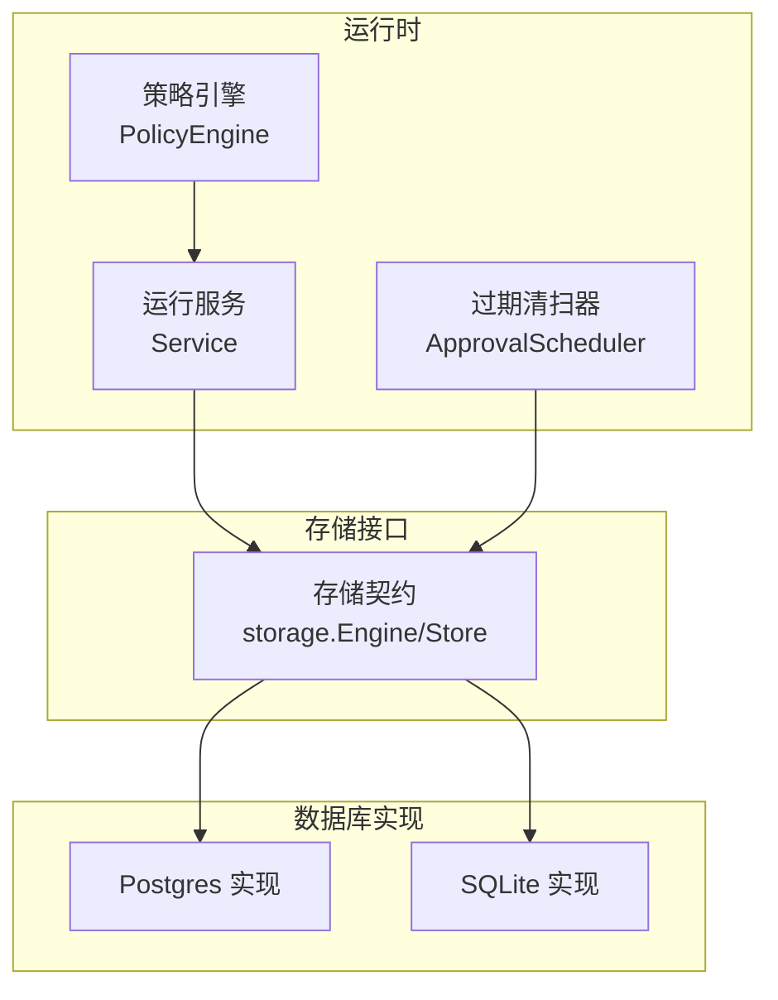
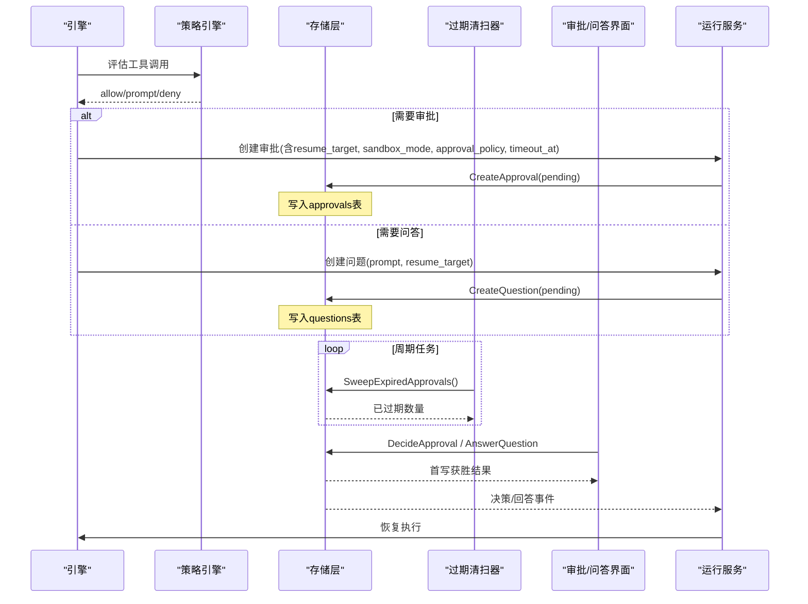
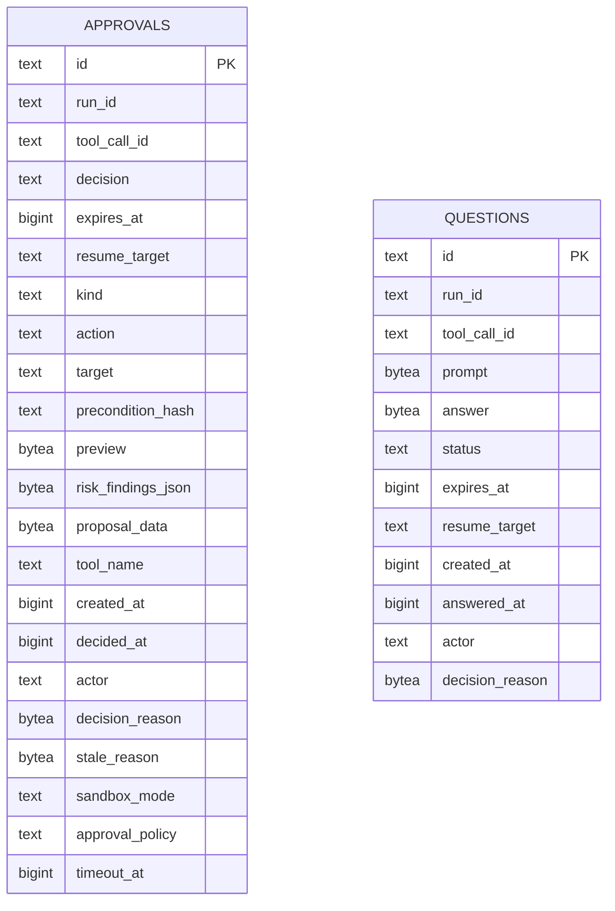
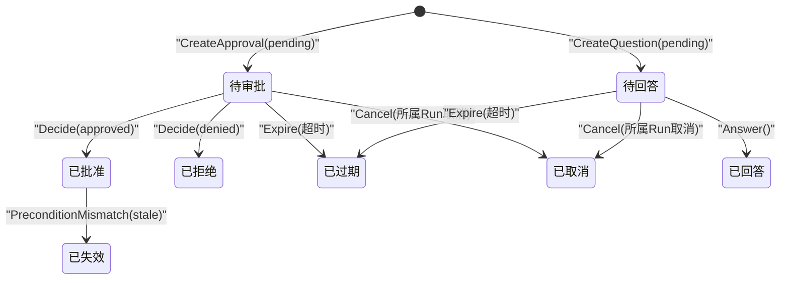
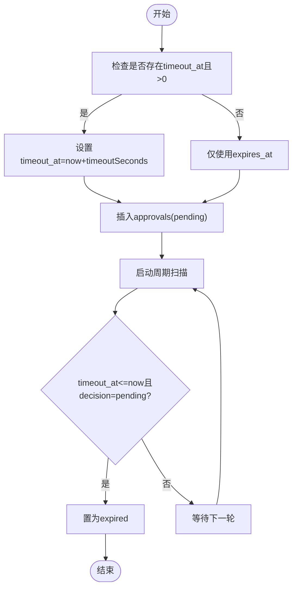
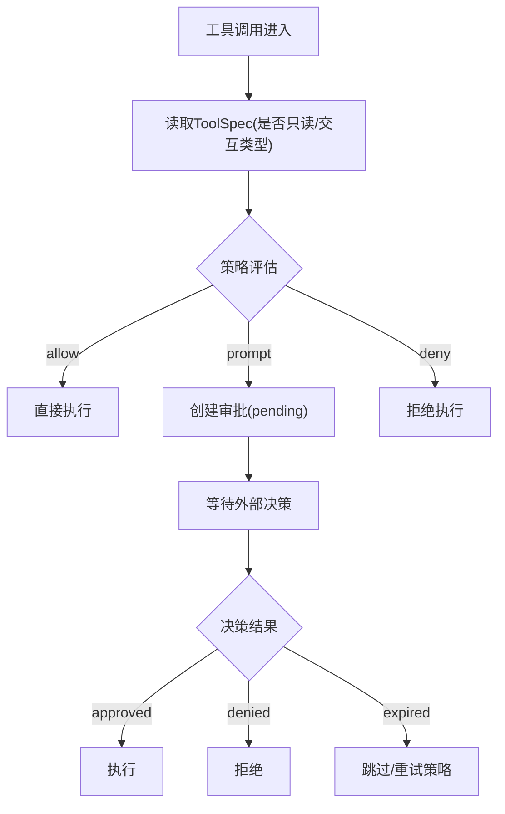
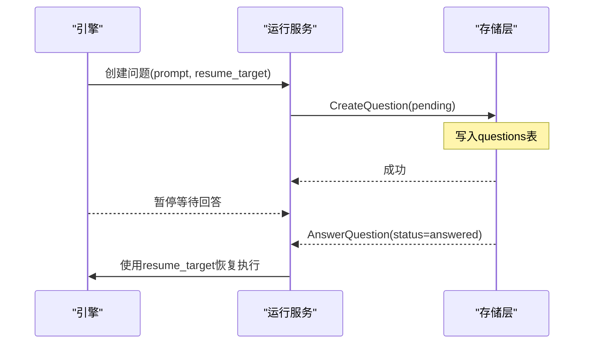
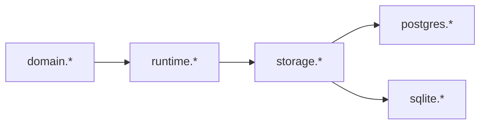

# 审批与问答

<cite>
**本文引用的文件**
- [internal/storage/contracts.go](file://internal/storage/contracts.go)
- [internal/storage/postgres/schema.go](file://internal/storage/postgres/schema.go)
- [internal/storage/postgres/approvals.go](file://internal/storage/postgres/approvals.go)
- [internal/storage/postgres/questions.go](file://internal/storage/postgres/questions.go)
- [internal/storage/sqlite/approvals.go](file://internal/storage/sqlite/approvals.go)
- [internal/storage/sqlite/questions.go](file://internal/storage/sqlite/questions.go)
- [internal/domain/question.go](file://internal/domain/question.go)
- [internal/domain/policy.go](file://internal/domain/policy.go)
- [internal/runtime/policy.go](file://internal/runtime/policy.go)
- [internal/runtime/approval_scheduler.go](file://internal/runtime/approval_scheduler.go)
- [internal/runtime/service.go](file://internal/runtime/service.go)
</cite>

## 目录
1. [简介](#简介)
2. [项目结构](#项目结构)
3. [核心组件](#核心组件)
4. [架构总览](#架构总览)
5. [详细组件分析](#详细组件分析)
6. [依赖关系分析](#依赖关系分析)
7. [性能考虑](#性能考虑)
8. [故障排查指南](#故障排查指南)
9. [结论](#结论)
10. [附录](#附录)

## 简介
本文件围绕“审批”与“问答”两大能力，系统性说明持久化表设计、状态机模型、超时与续期策略、审批策略配置与执行、并发控制、审计与合规报告支撑等。系统通过存储接口抽象出 approvals 与 questions 两类交互项：前者用于对“有副作用的工具调用”进行人工或自动审批；后者用于“ask_user”类人机交互的暂停与恢复。两者均支持首写获胜（first-writer-wins）的状态收敛、过期清理与可审计性。

## 项目结构
- 领域模型：定义 Question 状态、PolicyProfile/PolicyDecision 等不可变策略类型。
- 运行时策略：PolicyEngine 负责按策略配置文件评估工具调用是否允许、提示或拒绝；同时提供 ApprovalPolicy 评估以决定是否需要发起审批请求。
- 存储层：Postgres/SQLite 两套实现，分别实现 approvals 与 questions 的 CRUD、过期扫描与生命周期操作。
- 调度器：ApprovalScheduler 周期性扫描并标记过期的待审批项，避免堆积。
- 服务编排：Service 将引擎事件映射为持久化事件，管理运行态挂起（pending）的审批/问答，并在决策后恢复执行。

**图表来源**
- [internal/runtime/policy.go:96-135](file://internal/runtime/policy.go#L96-L135)
- [internal/runtime/service.go:70-130](file://internal/runtime/service.go#L70-L130)
- [internal/storage/contracts.go:163-217](file://internal/storage/contracts.go#L163-L217)
- [internal/storage/postgres/approvals.go:17-47](file://internal/storage/postgres/approvals.go#L17-L47)
- [internal/storage/sqlite/approvals.go:17-47](file://internal/storage/sqlite/approvals.go#L17-L47)

**章节来源**
- [internal/storage/contracts.go:163-217](file://internal/storage/contracts.go#L163-L217)
- [internal/storage/postgres/schema.go:49-121](file://internal/storage/postgres/schema.go#L49-L121)
- [internal/runtime/policy.go:96-135](file://internal/runtime/policy.go#L96-L135)
- [internal/runtime/service.go:70-130](file://internal/runtime/service.go#L70-L130)

## 核心组件
- 存储契约：统一 ApprovalStore、QuestionStore、ApprovalTimeoutStore、ApprovalLifecycleStore、QuestionLifecycleStore 等接口，屏蔽后端差异。
- 领域模型：QuestionStatus 定义 pending/answered/cancelled/expired；PolicyProfile/PolicyDecision 定义策略轮廓与决策结果。
- 策略引擎：根据策略配置与工具规格计算 allow/prompt/deny，并提供 ApprovalPolicy 评估（ask/auto/never）。
- 过期清扫器：定时扫描 approvals 中 timeout_at 已到且仍 pending 的记录，批量置为 expired。
- 服务编排：维护 pending 运行集合，处理审批/问答的创建、查询、决策与恢复，保证幂等与一致性。

**章节来源**
- [internal/storage/contracts.go:163-217](file://internal/storage/contracts.go#L163-L217)
- [internal/domain/question.go:1-29](file://internal/domain/question.go#L1-L29)
- [internal/domain/policy.go:1-46](file://internal/domain/policy.go#L1-L46)
- [internal/runtime/policy.go:217-273](file://internal/runtime/policy.go#L217-L273)
- [internal/runtime/approval_scheduler.go:18-118](file://internal/runtime/approval_scheduler.go#L18-L118)
- [internal/runtime/service.go:70-130](file://internal/runtime/service.go#L70-L130)

## 架构总览
审批与问答在系统中的协作流程如下：
- 引擎在执行工具前，先经 PolicyEngine 评估策略，决定是否需用户审批或提问。
- 若需审批：创建 approvals 行（decision=pending），记录 resume_target、sandbox_mode、approval_policy、timeout_at 等元数据。
- 若需问答：创建 questions 行（status=pending），持久化 prompt 与 resume_target。
- 后台 ApprovalScheduler 定期扫描并过期超时未决的审批项。
- 外部（Studio/控制台）对 pending 的审批/问答做出决策或回答，存储层以 first-writer-wins 方式落库。
- Service 收到决策后，从 pending 集合中取出对应运行，恢复执行。

**图表来源**
- [internal/runtime/policy.go:96-135](file://internal/runtime/policy.go#L96-L135)
- [internal/runtime/policy.go:217-273](file://internal/runtime/policy.go#L217-L273)
- [internal/storage/postgres/approvals.go:17-47](file://internal/storage/postgres/approvals.go#L17-L47)
- [internal/storage/postgres/questions.go:14-27](file://internal/storage/postgres/questions.go#L14-L27)
- [internal/runtime/approval_scheduler.go:91-111](file://internal/runtime/approval_scheduler.go#L91-L111)
- [internal/storage/contracts.go:163-217](file://internal/storage/contracts.go#L163-L217)

## 详细组件分析

### 表设计与字段语义
- approvals 表
  - 关键字段：id、run_id、tool_call_id、decision、expires_at、resume_target、kind、action、target、precondition_hash、preview、risk_findings_json、proposal_data、tool_name、created_at、decided_at、actor、decision_reason、stale_reason、sandbox_mode、approval_policy、timeout_at。
  - 索引：按 decision、expires_at、id 建立复合索引，优化待审批列表与过期扫描。
  - 用途：承载“有副作用工具调用”的审批上下文与决策轨迹。
- questions 表
  - 关键字段：id、run_id、tool_call_id、prompt、answer、status、expires_at、resume_target、created_at、answered_at、actor、decision_reason。
  - 索引：按 status、expires_at、id 建立复合索引，优化待回答问题列表与过期扫描。
  - 用途：承载“ask_user”交互的提示文本、答案与状态流转。

**图表来源**
- [internal/storage/postgres/schema.go:49-121](file://internal/storage/postgres/schema.go#L49-L121)

**章节来源**
- [internal/storage/postgres/schema.go:49-121](file://internal/storage/postgres/schema.go#L49-L121)

### 状态机模型与转换规则
- 审批（approvals）
  - 初始状态：pending
  - 终态：approved、denied、expired、cancelled、stale
  - 转换触发：
    - approved/denied：由外部决策接口写入（DecideApprovalWithMetadata），要求当前为 pending。
    - expired：后台清扫器或显式过期接口写入（ExpireApproval），要求当前为 pending。
    - cancelled：当所属 run 被取消时关闭 pending 审批（CancelApproval）。
    - stale：在已批准但前置条件不匹配时标记失败关闭（MarkApprovalStale）。
  - 并发控制：所有写操作均以 WHERE decision = 'pending' 限定，实现首写获胜。
- 问答（questions）
  - 初始状态：pending
  - 终态：answered、cancelled、expired
  - 转换触发：
    - answered：用户回答（AnswerQuestionWithMetadata），要求当前为 pending。
    - cancelled：所属 run 取消时关闭（CancelQuestionWithMetadata）。
    - expired：系统超时（ExpireQuestion），要求当前为 pending。
  - 并发控制：同样以 WHERE status = 'pending' 限定，确保唯一写入。

**图表来源**
- [internal/storage/postgres/approvals.go:128-198](file://internal/storage/postgres/approvals.go#L128-L198)
- [internal/storage/postgres/questions.go:75-133](file://internal/storage/postgres/questions.go#L75-L133)

**章节来源**
- [internal/storage/postgres/approvals.go:128-198](file://internal/storage/postgres/approvals.go#L128-L198)
- [internal/storage/postgres/questions.go:75-133](file://internal/storage/postgres/questions.go#L75-L133)

### 超时机制与续期策略
- 超时字段
  - approvals.timeout_at：显式超时时间戳（毫秒），由 CreateApprovalWithTimeout 设置；若未设置则回退到 expires_at。
  - approvals.expires_at：通用过期时间，用于旧路径兼容。
  - questions.expires_at：问答项的过期时间。
- 过期扫描
  - ApprovalScheduler 周期性调用 Storage 的 SweepExpiredApprovals，将满足 timeout_at > 0 且 timeout_at <= now 且 decision = pending 的记录置为 expired。
  - 也可通过 ListExpiredApprovals 获取即将过期的审批项，供上层做提醒或续期。
- 续期策略
  - 代码未提供直接“续期”接口；可通过重新创建新的审批项（新 id）并携带新的 timeout_at/expires_at 实现逻辑续期。
  - 对于问答，同理可新建 question 并更新 resume_target 指向同一运行上下文。

**图表来源**
- [internal/storage/postgres/approvals.go:263-273](file://internal/storage/postgres/approvals.go#L263-L273)
- [internal/storage/postgres/approvals.go:200-261](file://internal/storage/postgres/approvals.go#L200-L261)
- [internal/runtime/approval_scheduler.go:91-111](file://internal/runtime/approval_scheduler.go#L91-L111)

**章节来源**
- [internal/storage/postgres/approvals.go:200-273](file://internal/storage/postgres/approvals.go#L200-L273)
- [internal/runtime/approval_scheduler.go:18-118](file://internal/runtime/approval_scheduler.go#L18-L118)

### 审批策略的配置与执行
- 策略轮廓（PolicyProfile）
  - default、plan、read_only、full_auto 四种内置轮廓，默认行为不同。
- 策略决策（PolicyDecision）
  - allow、prompt、deny，按规则优先级匹配，无匹配时回退到轮廓默认值。
- 审批策略（ApprovalPolicy）
  - ask：对所有有副作用工具调用始终要求审批。
  - auto：白名单工具自动批准，其余要求审批。
  - never：从不询问，直接拒绝有副作用工具调用。
  - 未知策略：安全优先，要求审批。
- 执行流程
  - 引擎在工具调用前调用 Evaluate 与 EvaluateApprovalPolicy，结合 ToolSpec（是否只读、交互类型）得出最终决策。
  - 若需审批，则创建 approvals；若允许，则直接执行。

**图表来源**
- [internal/runtime/policy.go:96-135](file://internal/runtime/policy.go#L96-L135)
- [internal/runtime/policy.go:217-273](file://internal/runtime/policy.go#L217-L273)

**章节来源**
- [internal/domain/policy.go:1-46](file://internal/domain/policy.go#L1-L46)
- [internal/runtime/policy.go:96-135](file://internal/runtime/policy.go#L96-L135)
- [internal/runtime/policy.go:217-273](file://internal/runtime/policy.go#L217-L273)

### 问答交互的持久化与上下文恢复
- 持久化
  - prompt 与 answer 以 BLOB 形式存储于 questions 表，避免敏感信息泄露到日志。
  - status 字段驱动状态机，确保首写获胜。
- 上下文恢复
  - resume_target 字段保存恢复目标（如 checkpoint 或运行片段标识），在决策/回答后被 Service 用于恢复执行。
  - 问答项与审批项相互独立：问答不授权副作用，仅作为控制流交互。

**图表来源**
- [internal/storage/postgres/questions.go:14-27](file://internal/storage/postgres/questions.go#L14-L27)
- [internal/storage/postgres/questions.go:75-94](file://internal/storage/postgres/questions.go#L75-L94)
- [internal/runtime/service.go:112-121](file://internal/runtime/service.go#L112-L121)

**章节来源**
- [internal/storage/postgres/questions.go:14-27](file://internal/storage/postgres/questions.go#L14-L27)
- [internal/storage/postgres/questions.go:75-94](file://internal/storage/postgres/questions.go#L75-L94)
- [internal/runtime/service.go:112-121](file://internal/runtime/service.go#L112-L121)

### 并发控制、超时处理与重试机制
- 并发控制
  - 审批与问答的所有写操作均以 WHERE decision/status = 'pending' 限制，实现首写获胜，避免重复决策。
  - Service 维护 pending 运行集合，确保同一运行在同一时刻只有一个审批/问答在挂起。
- 超时处理
  - ApprovalScheduler 定期扫描并过期超时审批；questions 亦支持过期接口。
  - 过期后，上层可根据业务策略选择重试或终止。
- 重试机制
  - 代码未内置自动重试；可在上层基于事件或状态查询实现“到期重试”或“人工确认后重试”。

**章节来源**
- [internal/storage/postgres/approvals.go:128-198](file://internal/storage/postgres/approvals.go#L128-L198)
- [internal/storage/postgres/questions.go:75-133](file://internal/storage/postgres/questions.go#L75-L133)
- [internal/runtime/approval_scheduler.go:91-111](file://internal/runtime/approval_scheduler.go#L91-L111)
- [internal/runtime/service.go:112-121](file://internal/runtime/service.go#L112-L121)

### 审计日志与合规报告支撑
- 审计字段
  - approvals/questions 均包含 actor、decision_reason、created_at、decided_at/answered_at、stale_reason（审批）等，便于追踪谁在何时为何做出决策。
- 合规要点
  - 密钥不持久化（D-010）：配置仅保存 env_key 名称，日志、快照、事件负载脱敏。
  - 每次 Run 恰好一个终态事件（D-008）：通过 Journal 约束，确保可重放与一致性。
- 报告生成建议
  - 基于 approvals/questions 的审计字段，结合 runs 与 journal 事件，生成“审批通过率、平均响应时长、过期率、拒绝原因分布”等指标。
  - 可按 session/run/tool_name 维度聚合，输出合规报表。

**章节来源**
- [internal/storage/postgres/schema.go:49-121](file://internal/storage/postgres/schema.go#L49-L121)
- [internal/storage/contracts.go:55-64](file://internal/storage/contracts.go#L55-L64)

## 依赖关系分析
- 运行时依赖存储契约，不感知具体后端；Postgres/SQLite 实现共享相同语义。
- PolicyEngine 依赖 domain 类型，输出策略决策；Service 组合策略与存储，编排审批/问答生命周期。
- ApprovalScheduler 依赖 ApprovalTimeoutStore 扩展接口，实现超时清理。

**图表来源**
- [internal/runtime/policy.go:1-46](file://internal/runtime/policy.go#L1-L46)
- [internal/storage/contracts.go:163-217](file://internal/storage/contracts.go#L163-L217)
- [internal/storage/postgres/approvals.go:1-47](file://internal/storage/postgres/approvals.go#L1-L47)
- [internal/storage/sqlite/approvals.go:1-47](file://internal/storage/sqlite/approvals.go#L1-L47)

**章节来源**
- [internal/runtime/policy.go:1-46](file://internal/runtime/policy.go#L1-L46)
- [internal/storage/contracts.go:163-217](file://internal/storage/contracts.go#L163-L217)

## 性能考虑
- 索引优化：approvals/questions 均按 decision/status + expires_at + id 建复合索引，提升待处理队列与过期扫描效率。
- 批量化过期：SweepExpiredApprovals 一次性更新多条记录，减少锁竞争。
- 首写获胜：通过 WHERE 条件限制，避免额外锁或分布式协调。
- 大字段存储：prompt/answer/preview/risk_findings_json/proposal_data 使用 BLOB，注意大小与传输成本，必要时分页或分片。

[本节为通用指导，无需特定文件引用]

## 故障排查指南
- 常见问题
  - 审批无法决策：确认当前 decision 是否为 pending；若已被决定或不存在，会返回冲突或未找到。
  - 问答无法回答：确认 status 是否为 pending；若已回答或被取消，会返回冲突。
  - 审批未过期：检查 timeout_at 是否正确设置；确认调度器是否运行且间隔合理。
  - 策略误判：核对 PolicyProfile 与规则匹配顺序；关注 readonly 与 question 工具的默认允许行为。
- 定位方法
  - 查看 approvals/questions 表的 actor、decision_reason、stale_reason 等审计字段。
  - 检查 Service 的 pending 集合与事件流，确认恢复路径是否打通。
  - 验证策略配置哈希与生效轮廓，确保与预期一致。

**章节来源**
- [internal/storage/postgres/approvals.go:128-198](file://internal/storage/postgres/approvals.go#L128-L198)
- [internal/storage/postgres/questions.go:75-133](file://internal/storage/postgres/questions.go#L75-L133)
- [internal/runtime/policy.go:96-135](file://internal/runtime/policy.go#L96-L135)
- [internal/runtime/service.go:112-121](file://internal/runtime/service.go#L112-L121)

## 结论
本系统通过清晰的存储契约与领域模型，实现了审批与问答的可扩展、可审计、可恢复的能力。状态机采用首写获胜与显式过期，保障并发安全与资源清理；策略引擎提供灵活的 allow/prompt/deny 决策与审批策略；后台清扫器确保超时项及时回收。配合审计字段与合规约束，可满足生产环境的治理与报告需求。

[本节为总结性内容，无需特定文件引用]

## 附录
- 关键接口速查
  - ApprovalStore：CreateApproval、GetApproval、ListPendingApprovals、DecideApproval。
  - ApprovalTimeoutStore：ListExpiredApprovals、SweepExpiredApprovals、CreateApprovalWithTimeout。
  - QuestionStore：CreateQuestion、GetQuestion、ListPendingQuestions、AnswerQuestion、CancelQuestion。
  - QuestionLifecycleStore：AnswerQuestionWithMetadata、CancelQuestionWithMetadata、ExpireQuestion。
- 策略与模式
  - PolicyProfile：default、plan、read_only、full_auto。
  - ApprovalPolicy：ask、auto、never。
  - SandboxMode：workspace_write（默认），用于隔离执行环境。

**章节来源**
- [internal/storage/contracts.go:163-217](file://internal/storage/contracts.go#L163-L217)
- [internal/domain/policy.go:1-46](file://internal/domain/policy.go#L1-L46)
- [internal/storage/postgres/schema.go:6-12](file://internal/storage/postgres/schema.go#L6-L12)