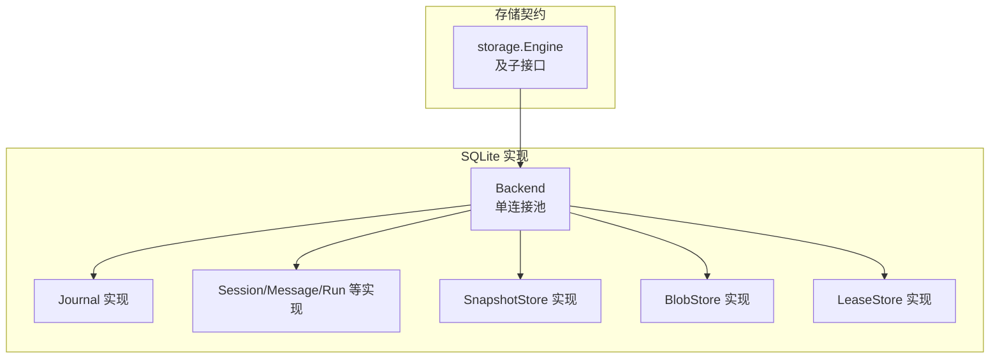
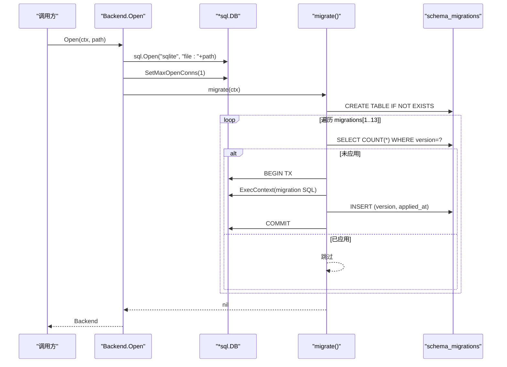
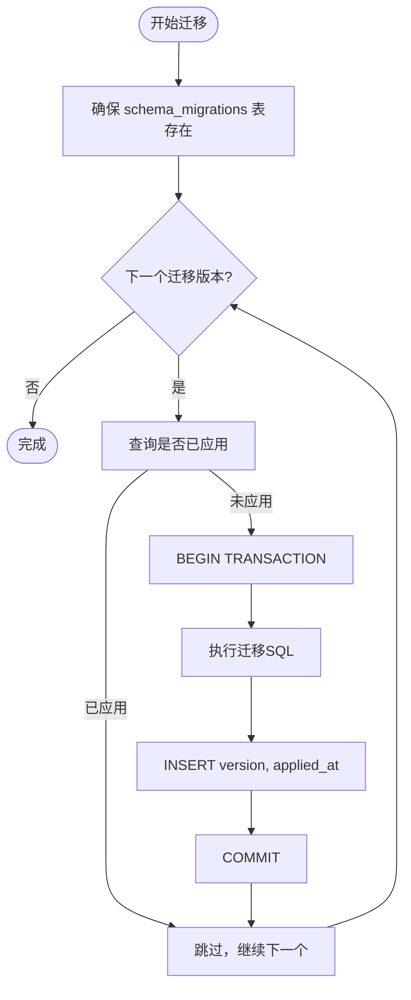
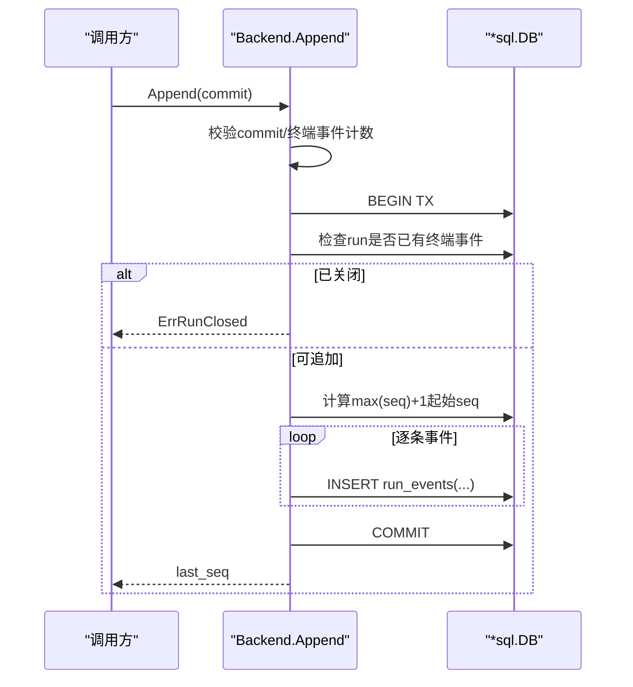
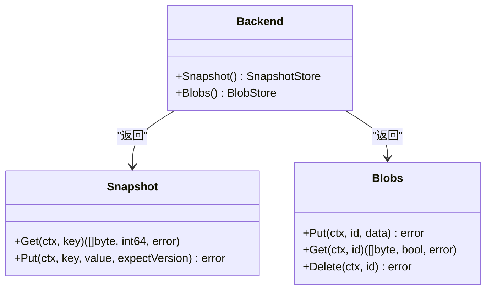
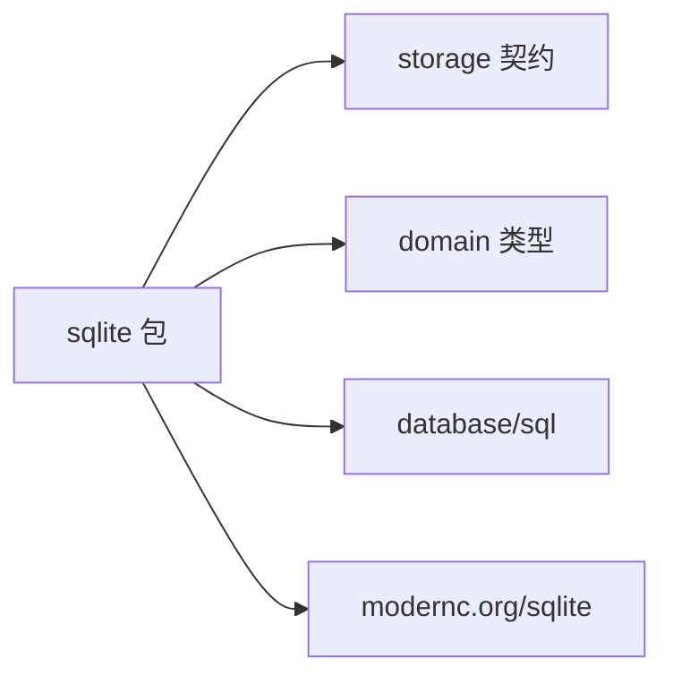

# 核心架构与初始化

<cite>
**本文引用的文件**
- [sqlite.go](file://internal/storage/sqlite/sqlite.go)
- [contracts.go](file://internal/storage/contracts.go)
- [journal.go](file://internal/storage/sqlite/journal.go)
- [approvals.go](file://internal/storage/sqlite/approvals.go)
- [sessions.go](file://internal/storage/sqlite/sessions.go)
- [runs.go](file://internal/storage/sqlite/runs.go)
- [messages.go](file://internal/storage/sqlite/messages.go)
- [snapshot.go](file://internal/storage/sqlite/snapshot.go)
- [blob.go](file://internal/storage/sqlite/blob.go)
- [lease.go](file://internal/storage/sqlite/lease.go)
</cite>

## 目录
1. [简介](#简介)
2. [项目结构](#项目结构)
3. [核心组件](#核心组件)
4. [架构总览](#架构总览)
5. [详细组件分析](#详细组件分析)
6. [依赖关系分析](#依赖关系分析)
7. [性能考量](#性能考量)
8. [故障排查指南](#故障排查指南)
9. [结论](#结论)

## 简介
本文件聚焦 SQLite 后端的核心架构与初始化流程，围绕 Backend 单连接池设计、事务管理策略、迁移系统与 schema_migrations 表的设计原理展开。同时说明 Open 函数的初始化路径（数据库连接建立、迁移版本检查与自动升级）、错误处理与故障恢复机制，并给出连接池参数调优建议与最佳实践。

## 项目结构
SQLite 后端位于 internal/storage/sqlite 包，实现 storage.Engine 接口及其子接口（Journal、SessionStore、MessageStore、RunStore、ApprovalStore、QuestionStore、SkillRevisionStore、TodoStore、StudioStore、LeaseStore、SnapshotStore、BlobStore）。所有具体表结构与迁移脚本集中在 sqlite.go 中，按版本号顺序执行；其他文件分别实现各存储域的具体操作。

图表来源
- [sqlite.go:57-88](file://internal/storage/sqlite/sqlite.go#L57-L88)
- [contracts.go:252-273](file://internal/storage/contracts.go#L252-L273)

章节来源
- [sqlite.go:1-88](file://internal/storage/sqlite/sqlite.go#L1-L88)
- [contracts.go:1-282](file://internal/storage/contracts.go#L1-L282)

## 核心组件
- Backend：封装一个 *sql.DB，作为单一写者，避免 WAL/锁配置泄漏到上层契约。提供 Snapshot() 与 Blobs() 两个独立句柄复用同一底层连接。
- 迁移系统：migrations 数组按序定义 13 个版本迁移；每个迁移在独立事务中执行，成功后写入 schema_migrations(version, applied_at)。
- 事务策略：所有写操作均使用显式事务；失败时回滚并返回错误；读操作直接查询。
- 错误处理：统一以 storage.ErrNotFound、ErrVersionConflict、ErrRunClosed、ErrCommitInvalid 等哨兵错误表达业务语义；所有 DB 错误包装为带上下文信息的错误。

章节来源
- [sqlite.go:17-55](file://internal/storage/sqlite/sqlite.go#L17-L55)
- [sqlite.go:109-147](file://internal/storage/sqlite/sqlite.go#L109-L147)
- [journal.go:12-75](file://internal/storage/sqlite/journal.go#L12-L75)
- [snapshot.go:18-71](file://internal/storage/sqlite/snapshot.go#L18-L71)
- [blob.go:18-89](file://internal/storage/sqlite/blob.go#L18-L89)
- [contracts.go:11-31](file://internal/storage/contracts.go#L11-L31)

## 架构总览
Open 函数负责创建或打开 SQLite 数据库、设置单连接池、执行迁移并返回 Backend。迁移系统通过 schema_migrations 表记录已应用版本，未应用的迁移按序执行。

图表来源
- [sqlite.go:38-55](file://internal/storage/sqlite/sqlite.go#L38-L55)
- [sqlite.go:109-147](file://internal/storage/sqlite/sqlite.go#L109-L147)

章节来源
- [sqlite.go:38-55](file://internal/storage/sqlite/sqlite.go#L38-L55)
- [sqlite.go:109-147](file://internal/storage/sqlite/sqlite.go#L109-L147)

## 详细组件分析

### Backend 与单连接池设计
- 单写者模型：SetMaxOpenConns(1) 保证 SQLite 并发安全且无额外锁争用，简化 WAL/锁配置。
- 句柄复用：Snapshot() 与 Blobs() 共享同一 *sql.DB，减少资源开销。
- 生命周期：Close() 释放底层连接；DropCheckpointPointer/Count/DeleteCheckpointGenerations 用于 CN-11 崩溃形状钩子。

章节来源
- [sqlite.go:40-55](file://internal/storage/sqlite/sqlite.go#L40-L55)
- [sqlite.go:57-88](file://internal/storage/sqlite/sqlite.go#L57-L88)
- [sqlite.go:90-107](file://internal/storage/sqlite/sqlite.go#L90-L107)

### 迁移系统与 schema_migrations
- 版本顺序：migrations 数组按 1..13 顺序定义，确保幂等与可重入。
- 幂等性：每次迁移前检查 schema_migrations 是否已存在该版本，已存在则跳过。
- 原子性：每个迁移在独立事务中执行，成功才记录版本；失败回滚。
- 向后兼容：新增列均带默认值，旧数据仍可读取；索引按需添加。

图表来源
- [sqlite.go:109-147](file://internal/storage/sqlite/sqlite.go#L109-L147)

章节来源
- [sqlite.go:17-36](file://internal/storage/sqlite/sqlite.go#L17-L36)
- [sqlite.go:109-147](file://internal/storage/sqlite/sqlite.go#L109-L147)
- [sqlite.go:149-405](file://internal/storage/sqlite/sqlite.go#L149-L405)

### 事件日志 Journal（追加不可变）
- Append：校验 commit 非空、终端事件数量不超过 1；若 run 已有终端事件则拒绝追加；分配连续 seq 并插入 run_events。
- Replay：按 seq > after 顺序流式回放。
- 一致性：严格遵循 D-008“恰好一个终态事件”。

图表来源
- [journal.go:12-75](file://internal/storage/sqlite/journal.go#L12-L75)

章节来源
- [journal.go:12-86](file://internal/storage/sqlite/journal.go#L12-L86)

### 会话、消息与运行
- Session：创建、列表、获取、重命名、删除（级联删除消息、运行、事件）。
- Message：追加消息（不可变），按 session 列出。
- Run：创建、状态更新、查询活跃运行、父子树遍历。

章节来源
- [sessions.go:13-116](file://internal/storage/sqlite/sessions.go#L13-L116)
- [messages.go:10-61](file://internal/storage/sqlite/messages.go#L10-L61)
- [runs.go:15-136](file://internal/storage/sqlite/runs.go#L15-L136)

### 审批与问题队列（Approval/Question）
- Approval：创建、获取、待审批列表、决定（first-writer-wins）、过期、取消、标记陈旧、超时清理。
- Question：创建、获取、待回答列表、回答、取消。
- 超时支持：timeout_at 字段配合 SweepExpiredApprovals 定期清理。

章节来源
- [approvals.go:15-274](file://internal/storage/sqlite/approvals.go#L15-L274)

### 快照与 Blob（版本化与生成）
- Snapshot：Get/Put 基于乐观并发控制（expectVersion），冲突返回 ErrVersionConflict。
- Blob：Put 追加新 generation 并原子翻转指针行；Get 通过 join 获取当前代；Delete 级联删除指针与所有代。

图表来源
- [snapshot.go:12-71](file://internal/storage/sqlite/snapshot.go#L12-L71)
- [blob.go:13-89](file://internal/storage/sqlite/blob.go#L13-L89)
- [sqlite.go:81-88](file://internal/storage/sqlite/sqlite.go#L81-L88)

章节来源
- [snapshot.go:12-71](file://internal/storage/sqlite/snapshot.go#L12-L71)
- [blob.go:13-89](file://internal/storage/sqlite/blob.go#L13-L89)

### 租约 LeaseStore
- Acquire：优先尝试更新现有租约（允许续租或过期覆盖），否则插入新租约。
- Release：仅当仍属当前拥有者时才删除。

章节来源
- [lease.go:9-45](file://internal/storage/sqlite/lease.go#L9-L45)

## 依赖关系分析
- 契约解耦：sqlite 包仅依赖 storage 契约与 domain 类型，不暴露 SQLite 细节。
- 内部耦合：Backend 聚合多个子句柄（Snapshot/Blobs），共享同一 *sql.DB，降低资源占用。
- 外部依赖：modernc.org/sqlite（纯 Go 驱动，无 CGO），database/sql 标准库。

图表来源
- [sqlite.go:6-15](file://internal/storage/sqlite/sqlite.go#L6-L15)
- [contracts.go:1-282](file://internal/storage/contracts.go#L1-L282)

章节来源
- [sqlite.go:6-15](file://internal/storage/sqlite/sqlite.go#L6-L15)
- [contracts.go:1-282](file://internal/storage/contracts.go#L1-L282)

## 性能考量
- 连接池：SetMaxOpenConns(1) 将并发限制为单写者，避免 SQLite 的写锁竞争与 WAL 膨胀，适合单机进程内多协程并发读的场景。
- 事务粒度：写操作尽量合并为单次事务，减少提交次数；Append、Put、Delete 等均使用事务包裹。
- 索引策略：迁移中按需添加索引（如 approvals/questions 的状态+过期时间索引、skill_revisions/status 索引、eval_runs/candidate 索引），提升常见查询性能。
- 批量写入：Journal.Append 支持一次提交多条事件，减少往返。
- 读优化：Replay/List 使用 ORDER BY 与必要索引，避免全表扫描。
- 建议调优：
  - 保持 MaxOpenConns=1，除非有明确的多写者需求（需评估 WAL/锁策略变更风险）。
  - 对高频查询确认索引命中（例如 approvals/questions 的过期清理、待审批列表）。
  - 定期清理过期审批与问答（SweepExpiredApprovals、Question 过期逻辑由上层调度）。
  - 监控 run_events 增长，必要时归档或分片。

[本节为通用指导，不直接分析具体文件]

## 故障排查指南
- 启动失败：Open 中迁移失败会中止启动并关闭连接，错误包含迁移版本信息，便于定位。
- 版本冲突：Snapshot.Put 期望版本不一致返回 ErrVersionConflict，应重试或刷新本地缓存。
- 运行终止：Journal.Append 检测到 run 已有终端事件返回 ErrRunClosed，禁止再追加事件。
- 无效提交：commit 为空或包含多于一个终端事件返回 ErrCommitInvalid。
- 租约冲突：Acquire 返回 acquired=false 表示已被其他拥有者持有或尚未过期。
- 找不到数据：GetSession/GetRun/GetApproval 等不存在时返回 storage.ErrNotFound。
- 超时清理：SweepExpiredApprovals 用于后台清理过期审批，需周期性调用。

章节来源
- [sqlite.go:40-55](file://internal/storage/sqlite/sqlite.go#L40-L55)
- [journal.go:18-75](file://internal/storage/sqlite/journal.go#L18-L75)
- [snapshot.go:34-71](file://internal/storage/sqlite/snapshot.go#L34-L71)
- [approvals.go:128-274](file://internal/storage/sqlite/approvals.go#L128-L274)
- [lease.go:9-45](file://internal/storage/sqlite/lease.go#L9-L45)
- [sessions.go:45-116](file://internal/storage/sqlite/sessions.go#L45-L116)
- [runs.go:34-66](file://internal/storage/sqlite/runs.go#L34-L66)

## 结论
SQLite 后端采用单连接池与强一致的事务边界，结合有序迁移与 schema_migrations 表，实现了稳定、可演进的数据层。Open 初始化流程清晰，迁移幂等且可回滚；错误处理覆盖关键业务不变量（如终端事件唯一性、乐观并发冲突）。在生产环境中，建议配合索引优化、定期清理与监控，以获得更佳的吞吐与稳定性。