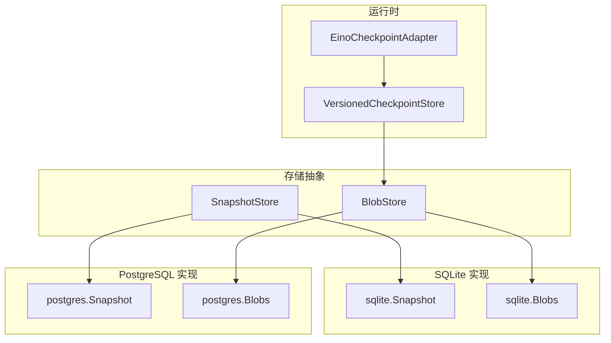
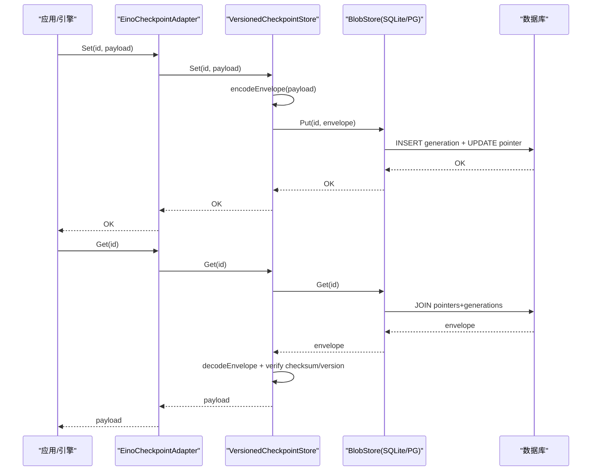
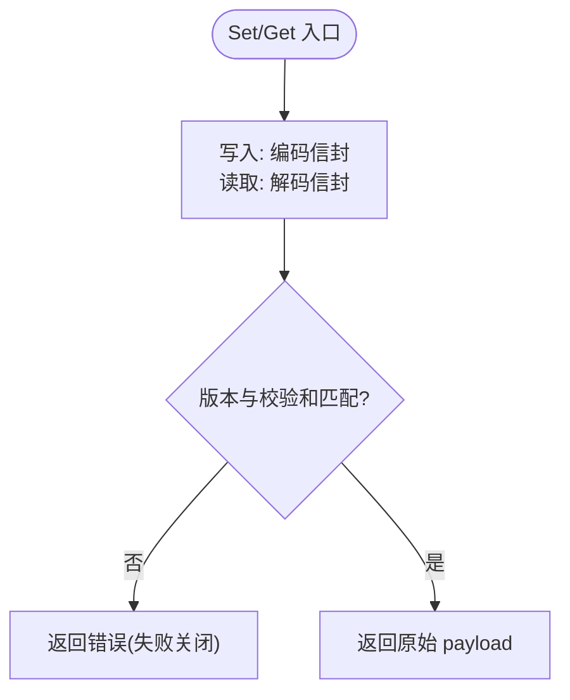
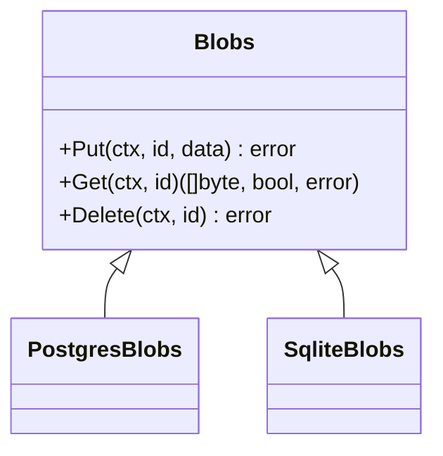
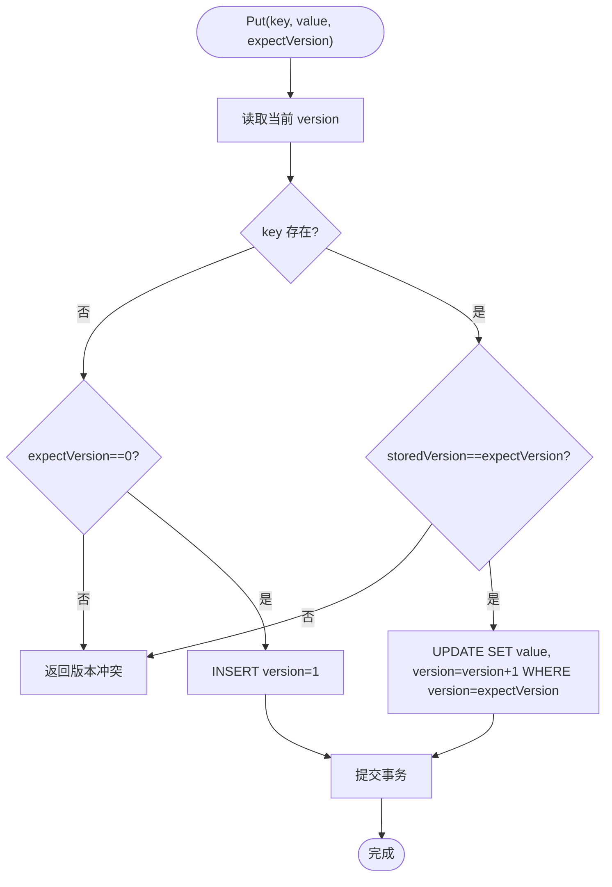
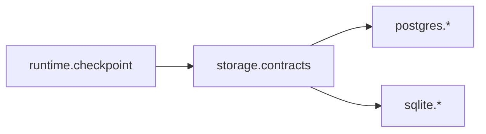

# 检查点与快照

<cite>
**本文引用的文件**
- [internal/storage/contracts.go](file://internal/storage/contracts.go)
- [internal/runtime/checkpoint.go](file://internal/runtime/checkpoint.go)
- [internal/runtime/checkpointadapter.go](file://internal/runtime/checkpointadapter.go)
- [internal/storage/postgres/blob.go](file://internal/storage/postgres/blob.go)
- [internal/storage/sqlite/blob.go](file://internal/storage/sqlite/blob.go)
- [internal/storage/postgres/snapshot.go](file://internal/storage/postgres/snapshot.go)
- [internal/storage/sqlite/snapshot.go](file://internal/storage/sqlite/snapshot.go)
- [internal/storage/postgres/schema.go](file://internal/storage/postgres/schema.go)
- [internal/runtimе/compaction/pruner.go](file://internal/runtime/compaction/pruner.go)
- [internal/runtime/compaction/meter.go](file://internal/runtime/compaction/meter.go)
- [internal/runtime/checkpoint_test.go](file://internal/runtime/checkpoint_test.go)
</cite>

## 目录
1. [简介](#简介)
2. [项目结构](#项目结构)
3. [核心组件](#核心组件)
4. [架构总览](#架构总览)
5. [详细组件分析](#详细组件分析)
6. [依赖关系分析](#依赖关系分析)
7. [性能与存储优化](#性能与存储优化)
8. [故障恢复与清理策略](#故障恢复与清理策略)
9. [监控与配额管理](#监控与配额管理)
10. [结论](#结论)

## 简介
本文件系统性说明 Vivy 的检查点与快照子系统：包括版本化检查点、增量生成式存储、乐观并发控制、校验和保障、以及上下文压缩与预算度量。重点覆盖以下方面：
- checkpoints 与 checkpoint_generations 表的设计与用途
- SnapshotStore（快照）与 BlobStore（大对象）的接口差异与适用场景
- 检查点的创建、读取、删除流程，以及失败关闭的安全策略
- 版本控制与冲突解决（乐观锁）
- 垃圾回收与存储空间管理思路
- 性能调优参数、压缩选项与故障恢复流程
- 检查点大小监控与存储配额方案

## 项目结构
检查点与快照能力由“运行时层”与“存储层”共同实现：
- 运行时层负责将 Eino 的 CheckPointStore 适配到内部 VersionedCheckpointStore，并在写入前封装信封（引擎版本、SHA-256 校验和、时间戳），在读取时进行严格校验。
- 存储层提供两种持久化抽象：
  - SnapshotStore：键值型快照，带版本号，用于轻量状态一致性读写。
  - BlobStore：按 id 存储不透明字节流，采用“生成号 + 指针行”的不可变追加模式，避免原地修改。

图表来源
- [internal/runtime/checkpointadapter.go:9-42](file://internal/runtime/checkpointadapter.go#L9-L42)
- [internal/runtime/checkpoint.go:40-102](file://internal/runtime/checkpoint.go#L40-L102)
- [internal/storage/sqlite/snapshot.go:12-71](file://internal/storage/sqlite/snapshot.go#L12-L71)
- [internal/storage/postgres/snapshot.go:12-82](file://internal/storage/postgres/snapshot.go#L12-L82)
- [internal/storage/sqlite/blob.go:13-89](file://internal/storage/sqlite/blob.go#L13-L89)
- [internal/storage/postgres/blob.go:13-89](file://internal/storage/postgres/blob.go#L13-L89)

章节来源
- [internal/storage/contracts.go:66-85](file://internal/storage/contracts.go#L66-L85)
- [internal/storage/postgres/schema.go:75-93](file://internal/storage/postgres/schema.go#L75-L93)

## 核心组件
- VersionedCheckpointStore：为 Eino 检查点添加信封（引擎版本、SHA-256 校验和、创建时间），并通过 BlobStore 以生成号方式持久化；读取时执行失败关闭校验。
- EinoCheckpointAdapter：将 VersionedCheckpointStore 暴露给 eino 运行时的 CheckPointStore/CheckPointDeleter 接口，屏蔽内部类型。
- SnapshotStore：键值快照，Get 返回 (value, version)，Put 使用 expectVersion 做乐观并发控制。
- BlobStore：按 id 存储不透明字节，Put 追加新 generation 并原子翻转指针行；Get 返回当前 generation 数据；Delete 删除指针与全部 generations。

章节来源
- [internal/runtime/checkpoint.go:40-102](file://internal/runtime/checkpoint.go#L40-L102)
- [internal/runtime/checkpointadapter.go:9-42](file://internal/runtime/checkpointadapter.go#L9-L42)
- [internal/storage/contracts.go:66-85](file://internal/storage/contracts.go#L66-L85)

## 架构总览
检查点写入路径：
- 上层调用 EinoCheckpointAdapter.Set → VersionedCheckpointStore.Set → encode 信封 → BlobStore.Put（插入新 generation + 原子更新指针行）。
检查点读取路径：
- Adapter.Get → Store.Get → BlobStore.Get → decode 信封 → 校验引擎版本与 SHA-256 → 返回原始 payload。

图表来源
- [internal/runtime/checkpoint.go:64-97](file://internal/runtime/checkpoint.go#L64-L97)
- [internal/storage/sqlite/blob.go:20-53](file://internal/storage/sqlite/blob.go#L20-L53)
- [internal/storage/postgres/blob.go:20-53](file://internal/storage/postgres/blob.go#L20-L53)

## 详细组件分析

### 检查点封装与校验（VersionedCheckpointStore）
- 写入：计算 payload 的 SHA-256，构造包含 engine_version、checksum_sha256、created_at 的信封，拼接长度头后作为 blob 写入。
- 读取：解析信封，校验引擎版本一致性与 payload 校验和；任一失败均返回错误（失败关闭）。
- 删除：委托底层 BlobStore 删除该 id 的全部 generations。

图表来源
- [internal/runtime/checkpoint.go:64-134](file://internal/runtime/checkpoint.go#L64-L134)

章节来源
- [internal/runtime/checkpoint.go:17-102](file://internal/runtime/checkpoint.go#L17-L102)
- [internal/runtime/checkpoint_test.go:29-107](file://internal/runtime/checkpoint_test.go#L29-L107)

### 生成式 Blob 存储（BlobStore 实现）
- 设计要点：
  - 不可变追加：每次 Put 都插入新的 checkpoint_generations 记录，绝不原地修改已有 generation。
  - 原子指针翻转：在同一事务中插入 generation 并更新 checkpoints 指针行（id→generation），保证读一致性。
  - 校验和落盘：指针行保存 blob 的 SHA-256 十六进制字符串，便于后续审计或扩展校验。
- SQLite 与 PostgreSQL 实现逻辑一致，仅 SQL 方言差异。

图表来源
- [internal/storage/postgres/blob.go:13-89](file://internal/storage/postgres/blob.go#L13-L89)
- [internal/storage/sqlite/blob.go:13-89](file://internal/storage/sqlite/blob.go#L13-L89)

章节来源
- [internal/storage/postgres/blob.go:18-53](file://internal/storage/postgres/blob.go#L18-L53)
- [internal/storage/sqlite/blob.go:18-53](file://internal/storage/sqlite/blob.go#L18-L53)
- [internal/storage/postgres/schema.go:81-93](file://internal/storage/postgres/schema.go#L81-L93)

### 快照存储（SnapshotStore）与乐观并发
- 语义：每个 key 维护一个递增 version；Put(key, value, expectVersion) 仅在 storedVersion == expectVersion 时成功，否则返回版本冲突错误。
- 首次写入：expectVersion 为 0 时创建 key，version 从 1 开始。
- 并发控制：通过单行 version 字段与条件更新实现乐观锁，避免悲观锁开销。

图表来源
- [internal/storage/postgres/snapshot.go:34-82](file://internal/storage/postgres/snapshot.go#L34-L82)
- [internal/storage/sqlite/snapshot.go:34-71](file://internal/storage/sqlite/snapshot.go#L34-L71)

章节来源
- [internal/storage/postgres/snapshot.go:18-82](file://internal/storage/postgres/snapshot.go#L18-L82)
- [internal/storage/sqlite/snapshot.go:18-71](file://internal/storage/sqlite/snapshot.go#L18-L71)

### 适配器与 Eino 集成
- EinoCheckpointAdapter 实现了 eino 的 CheckPointStore 与 CheckPointDeleter 接口，将内部 VersionedCheckpointStore 暴露给外部运行时无侵入接入。
- 所有 Get/Set/Delete 均透传至 VersionedCheckpointStore，确保信封校验与生成式存储策略生效。

章节来源
- [internal/runtime/checkpointadapter.go:9-42](file://internal/runtime/checkpointadapter.go#L9-L42)

## 依赖关系分析
- 运行时对存储抽象的依赖：
  - VersionedCheckpointStore 依赖 storage.BlobStore。
  - EinoCheckpointAdapter 依赖 VersionedCheckpointStore。
- 存储实现依赖具体数据库驱动（SQLite/PostgreSQL），但对外统一暴露 contracts.go 中的接口。
- 数据结构与约束：
  - checkpoints：id 主键，指向当前 generation、checksum、created_at。
  - checkpoint_generations：(id, generation) 复合主键，blob 列存储实际数据。
  - snapshots：key 主键，value 与 version。

图表来源
- [internal/storage/contracts.go:66-85](file://internal/storage/contracts.go#L66-L85)
- [internal/storage/postgres/schema.go:75-93](file://internal/storage/postgres/schema.go#L75-L93)

章节来源
- [internal/storage/contracts.go:66-85](file://internal/storage/contracts.go#L66-L85)
- [internal/storage/postgres/schema.go:75-93](file://internal/storage/postgres/schema.go#L75-L93)

## 性能与存储优化
- 生成式追加与原子指针：
  - 通过追加新 generation 并原子翻转指针，避免写放大与锁竞争，提升高并发写入吞吐。
- 校验和与失败关闭：
  - 写入即计算 SHA-256 并落盘，读取时强制校验，防止损坏数据被误用。
- 上下文压缩与预算度量：
  - ToolResultPruner 对工具结果消息进行头部/尾部保留与中间截断，降低上下文压力。
  - ContextBreakdown 测量系统提示、历史消息、工具结果、当前请求的字节规模，估算 token 占用与剩余空间，辅助触发压缩。
- 建议的参数调优方向（基于现有实现）：
  - 阈值与保留量：ToolResultPruner.ThresholdBytes、HeadBytes、TailBytes 决定何时裁剪与保留多少内容。
  - 预算比例：ContextBreakdown.IsOverBudget 的 thresholdRatio 可配置触发压缩的比例阈值。
  - 模型限制：传入 modelLimitTokens 以准确评估是否超预算。

章节来源
- [internal/runtime/compaction/pruner.go:18-78](file://internal/runtime/compaction/pruner.go#L18-L78)
- [internal/runtime/compaction/meter.go:40-140](file://internal/runtime/compaction/meter.go#L40-L140)

## 故障恢复与清理策略
- 恢复流程：
  - 启动时通过 Journal.Replay 重放事件，结合 LeaseStore 获取独占租约，确保单实例串行恢复。
  - 如需加载 Eino 检查点，通过 EinoCheckpointAdapter.Get 读取，若校验失败则拒绝恢复（失败关闭）。
- 清理与垃圾回收：
  - 删除检查点：调用 Delete(id) 会移除指针行与全部 generations，释放空间。
  - 孤儿检查点钩子：CheckpointOrphaner 提供测试用的钩子，用于在崩溃场景下清理孤立指针或统计/删除多余 generations。
- 存储空间管理建议：
  - 定期扫描 checkpoints 与 checkpoint_generations，识别无引用或过期的 id 并批量删除。
  - 结合上下文压缩减少历史消息体积，间接降低存储压力。

章节来源
- [internal/storage/contracts.go:87-94](file://internal/storage/contracts.go#L87-L94)
- [internal/storage/contracts.go:275-281](file://internal/storage/contracts.go#L275-L281)
- [internal/runtime/checkpoint.go:99-102](file://internal/runtime/checkpoint.go#L99-L102)

## 监控与配额管理
- 检查点大小监控：
  - 可通过查询 checkpoint_generations 的 blob 列累计各 id 的存储占用，并结合 checkpoints 的 created_at 观察增长趋势。
  - 利用 ContextBreakdown 的 Total 与 EstimatedTokens 监控上下文大小变化，辅助判断是否需要压缩或清理。
- 存储配额管理方案：
  - 设定每 id 的最大 generations 数量或总容量上限，超过阈值时触发清理（如删除旧 generation 或整个 id）。
  - 结合业务生命周期（会话结束、Run 终态）主动删除相关检查点与快照，避免长期累积。
- 指标采集建议：
  - 写入延迟、读取失败率（校验失败）、存储空间使用率、压缩触发频率等。

[本节为通用指导，不直接分析具体文件]

## 结论
本系统通过“信封 + 生成式追加 + 原子指针”的组合，实现了安全、可扩展且高性能的检查点与快照机制。SnapshotStore 提供轻量级乐观并发控制，BlobStore 承载不透明大对象，配合严格的校验和与失败关闭策略，确保数据完整性。运行时侧的上下文压缩与预算度量进一步缓解存储与上下文压力。生产环境中建议结合定期清理、配额管理与监控指标，持续优化存储成本与可用性。