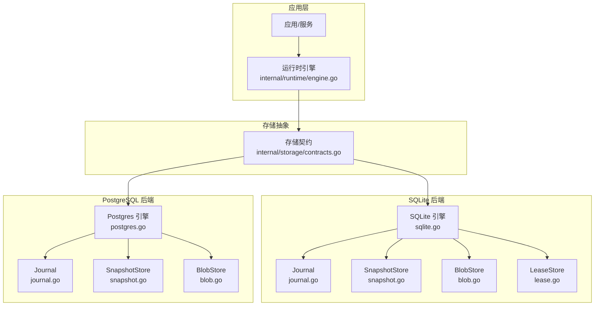
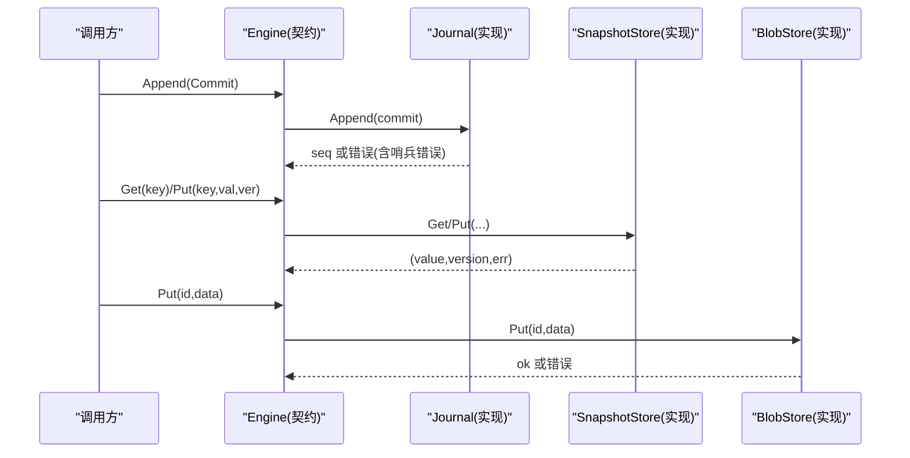
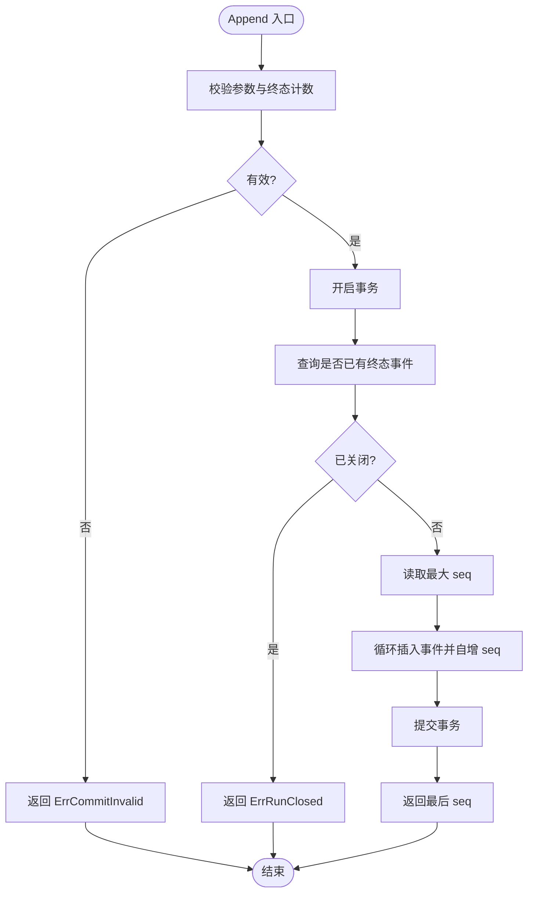
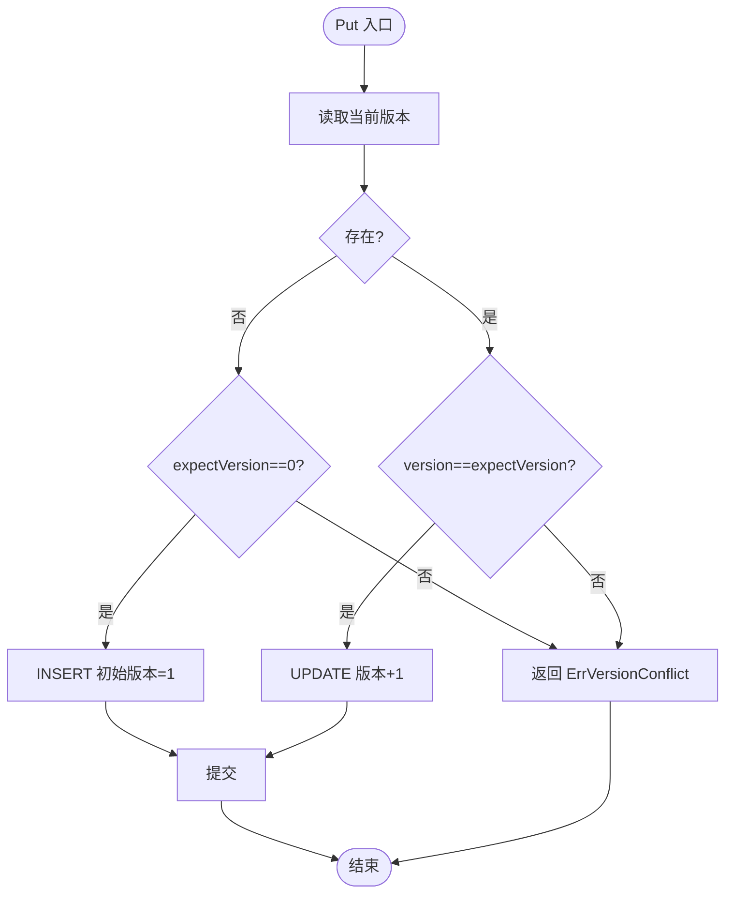
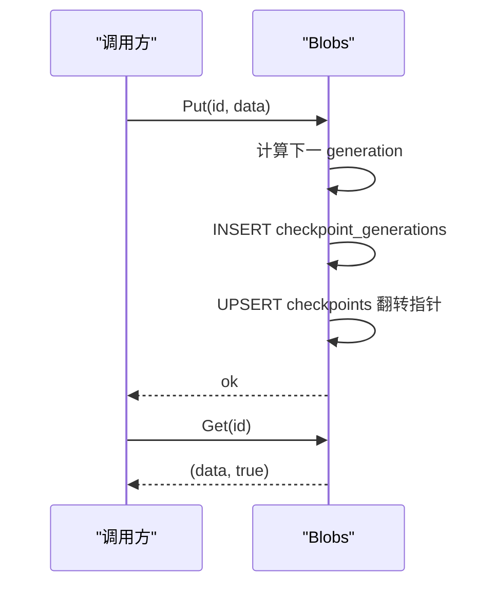
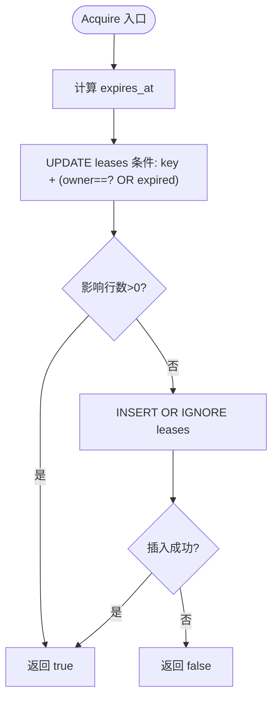
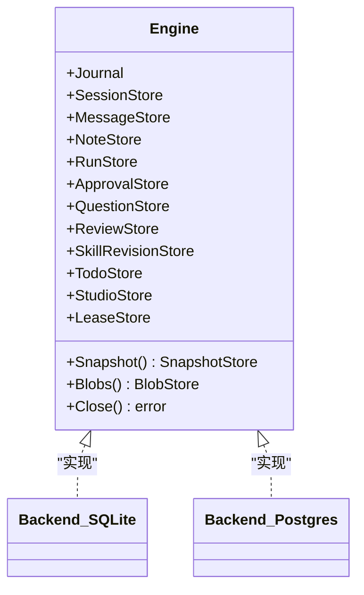
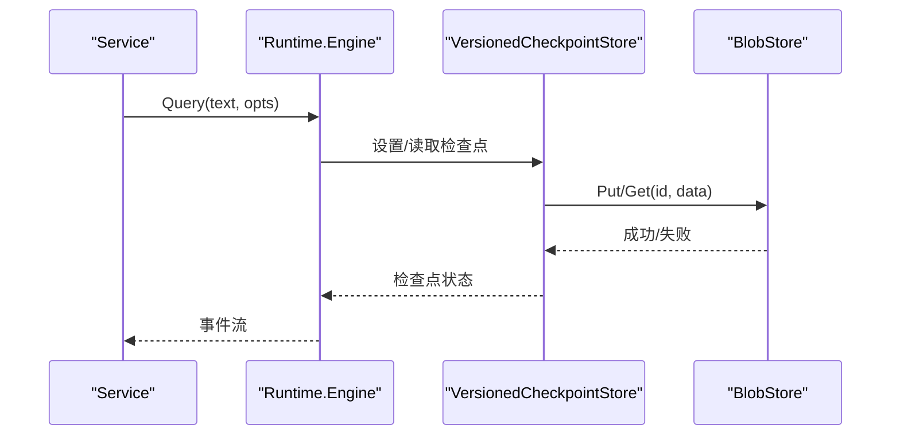
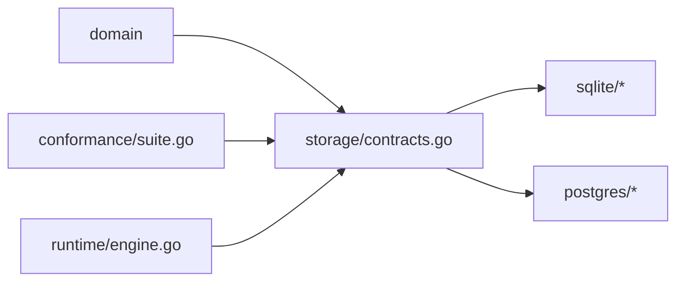

# 存储架构设计

<cite>
**本文引用的文件**
- [contracts.go](file://internal/storage/contracts.go)
- [doc.go](file://internal/storage/doc.go)
- [sqlite.go](file://internal/storage/sqlite/sqlite.go)
- [journal.go](file://internal/storage/sqlite/journal.go)
- [snapshot.go](file://internal/storage/sqlite/snapshot.go)
- [blob.go](file://internal/storage/sqlite/blob.go)
- [lease.go](file://internal/storage/sqlite/lease.go)
- [postgres.go](file://internal/storage/postgres/postgres.go)
- [journal.go](file://internal/storage/postgres/journal.go)
- [snapshot.go](file://internal/storage/postgres/snapshot.go)
- [blob.go](file://internal/storage/postgres/blob.go)
- [suite.go](file://internal/storage/conformance/suite.go)
- [engine.go](file://internal/runtime/engine.go)
</cite>

## 目录
1. [简介](#简介)
2. [项目结构](#项目结构)
3. [核心组件](#核心组件)
4. [架构总览](#架构总览)
5. [详细组件分析](#详细组件分析)
6. [依赖关系分析](#依赖关系分析)
7. [性能考量](#性能考量)
8. [故障排查指南](#故障排查指南)
9. [结论](#结论)
10. [附录](#附录)

## 简介
本文件系统化阐述 Vivy 的存储抽象与实现：以 Journal 事件日志、SnapshotStore 快照存储、BlobStore 二进制存储为核心接口，配合 LeaseStore 租约机制与多类业务 Store（会话、消息、运行、审批、问题、评审、技能修订、待办、工作室等），通过 Engine 组合根对外暴露统一持久化能力。SQLite 为默认后端，PostgreSQL 为可选服务端后端；两者均通过一致性测试套件保证行为契约。事务与并发控制采用乐观锁与租约机制，数据一致性由“恰好一个终态事件”“单调序列重放”“原子追加”等不变式保障。错误处理使用哨兵错误（如 ErrVersionConflict、ErrRunClosed、ErrLeaseHeld）明确区分可恢复冲突与不可恢复异常。

## 项目结构
存储子系统位于 internal/storage，包含：
- 抽象契约：contracts.go、doc.go
- SQLite 参考后端：sqlite/*
- PostgreSQL 可选后端：postgres/*
- 一致性测试套件：conformance/suite.go

运行时引擎 internal/runtime/engine.go 仅通过存储契约与持久层交互，不感知具体数据库细节。

**图示来源**
- [contracts.go:55-273](file://internal/storage/contracts.go#L55-L273)
- [sqlite.go:57-88](file://internal/storage/sqlite/sqlite.go#L57-L88)
- [postgres.go:30-111](file://internal/storage/postgres/postgres.go#L30-L111)

**章节来源**
- [doc.go:1-18](file://internal/storage/doc.go#L1-L18)
- [contracts.go:55-273](file://internal/storage/contracts.go#L55-L273)

## 核心组件
- Journal：追加型、有序、不可变的事件日志，提供 Append 与 Replay。Append 在事务内校验“最多一个终态事件”，并在已有终态时拒绝后续写入。Replay 支持 after_seq 游标增量重放。
- SnapshotStore：键值快照，Get/Put 返回并比较版本号，Put 基于 expectVersion 实现乐观并发控制。
- BlobStore：按 id 存储任意二进制（如 Eino 检查点），采用“生成号 + 指针行”的不可变追加模式，Put 原子翻转当前指针。
- LeaseStore：分布式/进程级排他工作锁，Acquire/Release 基于 TTL 与 owner 字段。
- Engine：组合根，聚合上述接口及会话、消息、运行、审批、问题、评审、技能修订、待办、工作室等存储能力，并提供 Close。

**章节来源**
- [contracts.go:33-94](file://internal/storage/contracts.go#L33-L94)
- [contracts.go:96-273](file://internal/storage/contracts.go#L96-L273)

## 架构总览
Vivy 的存储架构遵循“契约优先、实现可插拔”的原则：
- 上层（runtime、service、studio 等）仅依赖 contracts.go 中的接口。
- 默认 SQLite 后端满足单机/嵌入式场景；PostgreSQL 后端用于服务器部署，具备实例租约与心跳保活。
- 一致性测试套件 conformance/suite.go 覆盖原子追加、单调序列、版本冲突、重放幂等、重试分歧拒绝、恰好一个终态、首写获胜、重启修复、断尾存活、负载字节保真、孤儿检查点、双句柄安全、并发写入、断开后重放等 16 项用例，确保新后端符合契约。

**图示来源**
- [contracts.go:55-85](file://internal/storage/contracts.go#L55-L85)
- [sqlite.go:57-88](file://internal/storage/sqlite/sqlite.go#L57-L88)
- [postgres.go:222-226](file://internal/storage/postgres/postgres.go#L222-L226)

## 详细组件分析

### Journal 事件日志（SQLite/PostgreSQL）
职责与不变式
- 原子追加：一次 Commit 内的多个事件在同一事务中写入，seq 连续递增。
- 单调序列：每个 run_id 的 seq 严格递增且无空洞。
- 恰好一个终态：commit 内至多一个终态事件；run 已存在终态则拒绝后续追加。
- 增量重放：Replay(runID, after) 返回 seq > after 的事件流。

并发与一致性
- SQLite：单写者连接池（SetMaxOpenConns=1），避免 WAL/锁争用泄漏到契约层。
- PostgreSQL：事务内 advisory lock 锁定 run_id，防止并发写入导致序列错乱；同时结合终端事件检查保证不变式。

**图示来源**
- [journal.go(sqlite):18-75](file://internal/storage/sqlite/journal.go#L18-L75)
- [journal.go(postgres):18-79](file://internal/storage/postgres/journal.go#L18-L79)

**章节来源**
- [journal.go(sqlite):1-116](file://internal/storage/sqlite/journal.go#L1-L116)
- [journal.go(postgres):1-120](file://internal/storage/postgres/journal.go#L1-L120)

### SnapshotStore 快照存储（乐观锁）
- Get：返回 value 与 version；不存在返回 (nil, 0, nil)。
- Put：基于 expectVersion 的乐观并发控制。不存在时要求 expectVersion=0；存在时要求 version==expectVersion，否则返回 ErrVersionConflict。更新时版本号自增。

**图示来源**
- [snapshot.go(sqlite):34-71](file://internal/storage/sqlite/snapshot.go#L34-L71)
- [snapshot.go(postgres):34-82](file://internal/storage/postgres/snapshot.go#L34-L82)

**章节来源**
- [snapshot.go(sqlite):1-71](file://internal/storage/sqlite/snapshot.go#L1-L71)
- [snapshot.go(postgres):1-82](file://internal/storage/postgres/snapshot.go#L1-L82)

### BlobStore 二进制存储（不可变追加 + 指针翻转）
- Put：为 id 追加新的 generation，并原子翻转 checkpoints 表中的当前指针（generation 与 checksum）。
- Get：通过 joins 获取当前 generation 的 blob。
- Delete：删除指针与所有 generations。

该设计确保同一 id 的历史版本不被就地修改，便于回滚与审计。

**图示来源**
- [blob.go(sqlite):20-53](file://internal/storage/sqlite/blob.go#L20-L53)
- [blob.go(postgres):20-53](file://internal/storage/postgres/blob.go#L20-L53)

**章节来源**
- [blob.go(sqlite):1-89](file://internal/storage/sqlite/blob.go#L1-L89)
- [blob.go(postgres):1-89](file://internal/storage/postgres/blob.go#L1-L89)

### LeaseStore 租约机制（进程/实例排他）
- Acquire：若 key 空闲或过期，或仍归当前 owner，则授予租约并刷新 expires_at；否则返回 acquired=false。
- Release：仅当 owner 匹配时删除租约。

PostgreSQL 额外实现：
- Open 时尝试获取 organism 租约（vivy/organism），失败返回 ErrLeaseHeld。
- 后台心跳 goroutine 定期续租，连接中断或续租失败触发 fence，停止写入。

**图示来源**
- [lease.go:12-34](file://internal/storage/sqlite/lease.go#L12-L34)
- [postgres.go:46-111](file://internal/storage/postgres/postgres.go#L46-L111)
- [postgres.go:192-220](file://internal/storage/postgres/postgres.go#L192-L220)

**章节来源**
- [lease.go:1-45](file://internal/storage/sqlite/lease.go#L1-L45)
- [postgres.go:30-111](file://internal/storage/postgres/postgres.go#L30-L111)

### Engine 组合根与热插拔
- Engine 聚合 Journal、SessionStore、MessageStore、NoteStore、RunStore、ApprovalStore、QuestionStore、ReviewStore、SkillRevisionStore、TodoStore、StudioStore、LeaseStore，并提供 Snapshot()、Blobs()、Close()。
- 通过接口抽象，上层代码只依赖 contracts.go；SQLite 与 PostgreSQL 均可作为 Engine 实现替换，实现热插拔。
- 迁移策略：启动时按序执行迁移脚本，失败中止启动（FR-8），保证 schema 版本一致。

**图示来源**
- [contracts.go:252-273](file://internal/storage/contracts.go#L252-L273)
- [sqlite.go:64-88](file://internal/storage/sqlite/sqlite.go#L64-L88)
- [postgres.go:41-44](file://internal/storage/postgres/postgres.go#L41-L44)

**章节来源**
- [contracts.go:252-273](file://internal/storage/contracts.go#L252-L273)
- [sqlite.go:17-55](file://internal/storage/sqlite/sqlite.go#L17-L55)
- [postgres.go:133-166](file://internal/storage/postgres/postgres.go#L133-L166)

### 运行时引擎与存储的协作
- runtime.Engine 负责装配 Eino Agent/Runner，并通过 VersionedCheckpointStore（由存储层提供）进行中断点持久化。
- 存储契约将 Eino 相关类型隔离在 runtime/provider 边界内，domain 与 UI 契约不受污染。

**图示来源**
- [engine.go:61-117](file://internal/runtime/engine.go#L61-L117)
- [blob.go(sqlite):20-53](file://internal/storage/sqlite/blob.go#L20-L53)

**章节来源**
- [engine.go:18-166](file://internal/runtime/engine.go#L18-L166)

## 依赖关系分析
- 契约与实现解耦：内部 domain 与上层仅依赖 contracts.go；SQLite/PostgreSQL 实现细节被封装在各自包内。
- 迁移与版本：SQLite 维护 migrations 数组逐条执行；PostgreSQL 以单一 schema 版本一次性创建。
- 一致性测试：conformance/suite.go 定义 16 项用例，覆盖原子性、单调性、冲突、重放、并发、断连恢复等关键属性。

**图示来源**
- [doc.go:1-18](file://internal/storage/doc.go#L1-L18)
- [suite.go:1-73](file://internal/storage/conformance/suite.go#L1-L73)

**章节来源**
- [suite.go:17-73](file://internal/storage/conformance/suite.go#L17-L73)

## 性能考量
- SQLite 单写者模型：SetMaxOpenConns=1 降低 WAL/锁争用，适合嵌入式/单机场景。
- PostgreSQL 连接池：默认最大连接数 8，兼顾吞吐与资源占用。
- 索引与扫描：replay 按 run_id+seq 顺序扫描；部分迁移添加索引以提升查询效率（如 runs_parent_idx、skill_revisions_status_idx 等）。
- 大对象存储：BlobStore 将大对象独立存放，减少主表膨胀。
- 事务粒度：Append/Put/Delete 均在事务内完成，保证原子性与一致性。

[本节为通用指导，不直接分析具体文件]

## 故障排查指南
常见哨兵错误与定位要点：
- ErrVersionConflict：SnapshotStore.Put 的版本不匹配。检查 expectVersion 是否正确传递，是否存在并发写入。
- ErrRunClosed：对已存在终态事件的 run 继续追加。确认终态事件是否已写入，以及重试逻辑是否应终止。
- ErrCommitInvalid：commit 为空或包含多于一个终态事件。检查上游事件组装逻辑。
- ErrNotFound：请求的资源不存在。检查 ID 与生命周期。
- ErrLeaseHeld：PostgreSQL 上已有实例持有 organism 租约。检查是否有其他进程正在运行，或租约未释放。
- ErrLeaseLost：租约续期失败或连接中断。检查心跳 goroutine 与数据库连通性。

建议排查步骤：
- 使用 Replay(after) 从最近已知游标恢复，验证事件连续性。
- 对 BlobStore 检查 checkpoints 指针与 checkpoint_generations 是否一致。
- 对 LeaseStore 检查 leases 表中的 owner 与 expires_at，必要时手动清理。
- 通过 conformance 用例复现问题，快速验证后端是否符合契约。

**章节来源**
- [contracts.go:11-31](file://internal/storage/contracts.go#L11-L31)
- [suite.go:153-166](file://internal/storage/conformance/suite.go#L153-L166)
- [suite.go:191-209](file://internal/storage/conformance/suite.go#L191-L209)
- [suite.go:441-484](file://internal/storage/conformance/suite.go#L441-L484)

## 结论
本存储架构以清晰的契约抽象（Journal、SnapshotStore、BlobStore、LeaseStore 及多类业务 Store）为核心，通过 SQLite 与 PostgreSQL 两种后端实现，满足嵌入式与服务端部署需求。事务与乐观锁、租约机制共同保障并发与一致性；“恰好一个终态事件”“单调序列”“原子追加”等不变式贯穿始终。一致性测试套件确保新后端可无缝替换，实现真正的热插拔。错误处理以哨兵错误明确语义，便于上层精准决策与恢复。

## 附录
- 迁移管理：SQLite 通过 migrations 数组逐项执行；PostgreSQL 通过单次 DDL 创建 schema 并记录版本。
- 扩展点：新增存储能力只需实现对应接口，并在 Engine 中组合暴露；后端需通过 conformance 套件验证。
- 密钥与敏感信息：配置与日志、快照、事件负载中不得持久化密钥，仅保存 env_key 引用。

[本节为概念性补充，不直接分析具体文件]