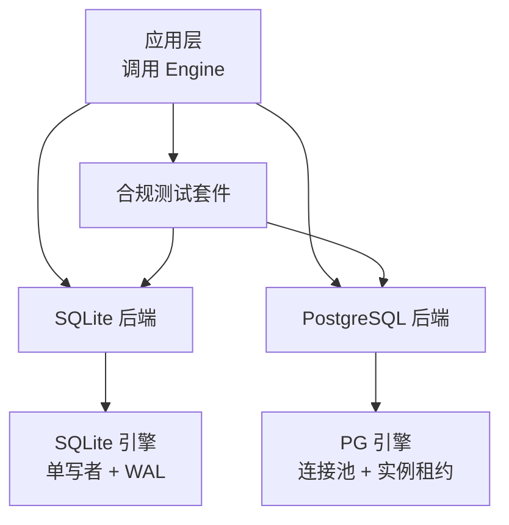
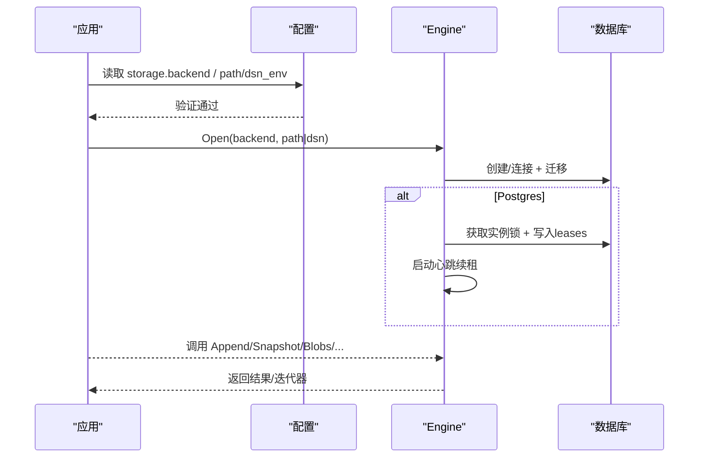
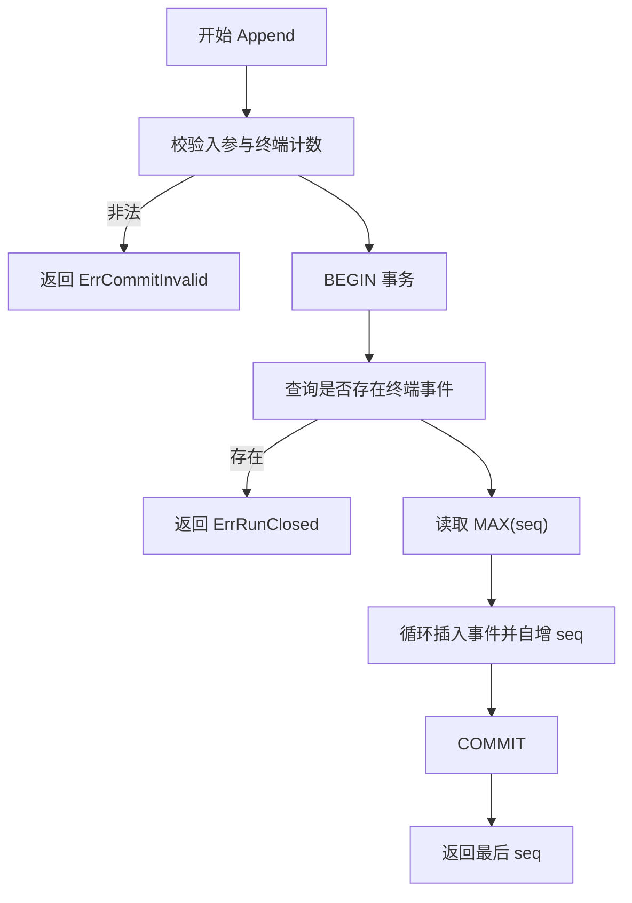
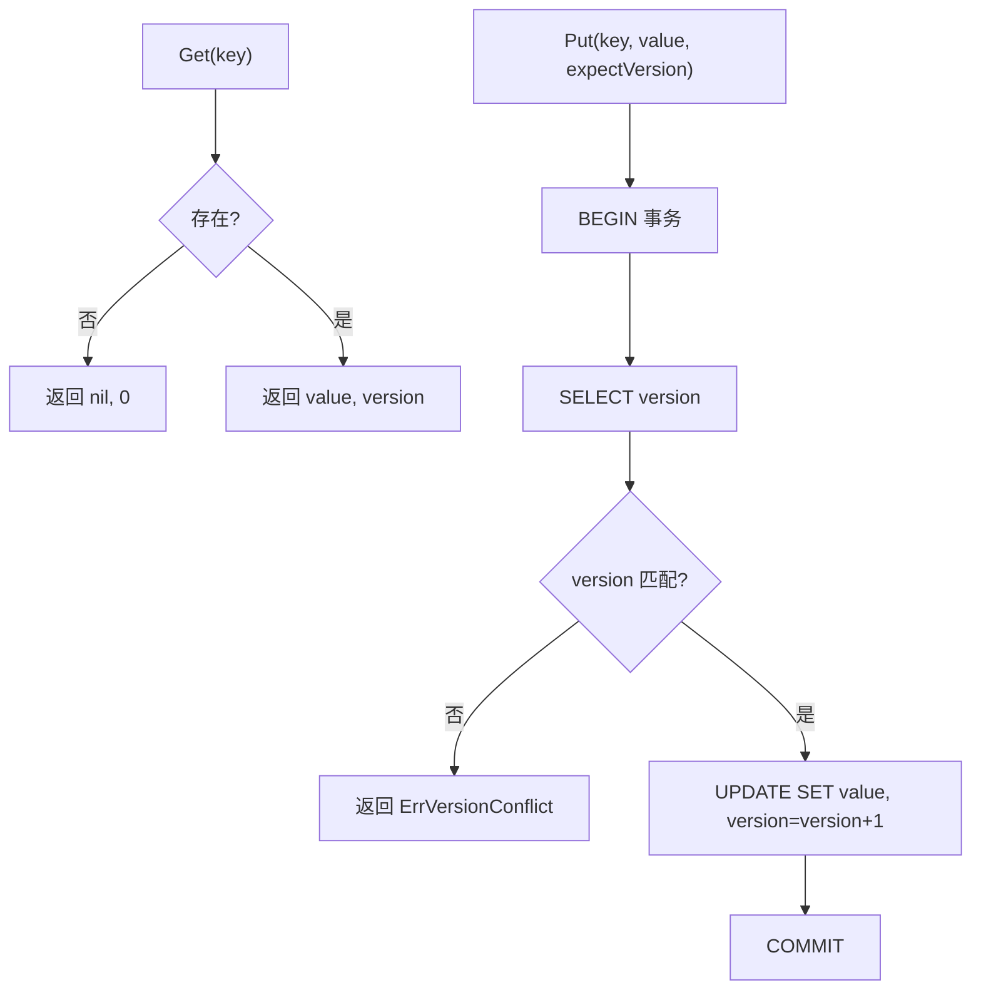
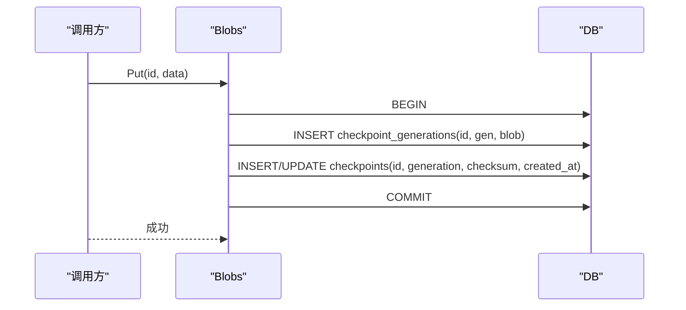
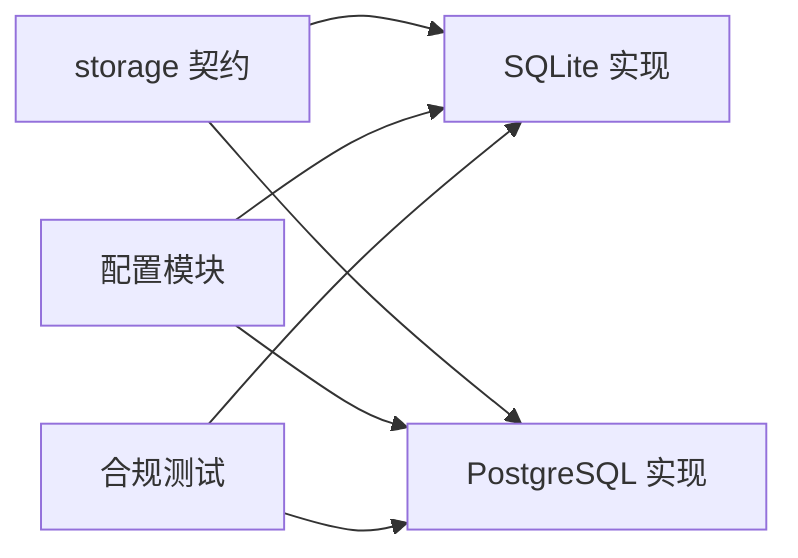

# 存储系统

<cite>
**本文引用的文件**
- [contracts.go](file://internal/storage/contracts.go)
- [doc.go](file://internal/storage/doc.go)
- [suite.go](file://internal/storage/conformance/suite.go)
- [sqlite.go](file://internal/storage/sqlite/sqlite.go)
- [journal.go](file://internal/storage/sqlite/journal.go)
- [snapshot.go](file://internal/storage/sqlite/snapshot.go)
- [blob.go](file://internal/storage/sqlite/blob.go)
- [lease.go](file://internal/storage/sqlite/lease.go)
- [messages.go](file://internal/storage/sqlite/messages.go)
- [sessions.go](file://internal/storage/sqlite/sessions.go)
- [postgres.go](file://internal/storage/postgres/postgres.go)
- [schema.go](file://internal/storage/postgres/schema.go)
- [db.go](file://internal/storage/postgres/db.go)
- [config.go](file://internal/config/config.go)
</cite>

## 目录
1. [简介](#简介)
2. [项目结构](#项目结构)
3. [核心组件](#核心组件)
4. [架构总览](#架构总览)
5. [详细组件分析](#详细组件分析)
6. [依赖关系分析](#依赖关系分析)
7. [性能与并发控制](#性能与并发控制)
8. [配置、连接池与迁移](#配置连接池与迁移)
9. [一致性、监控与故障排查](#一致性监控与故障排查)
10. [结论](#结论)
11. [附录：表结构与索引](#附录表结构与索引)

## 简介
本存储子系统为 Vivy 提供统一的持久化契约，围绕“事件日志（Journal）+ 快照（SnapshotStore）+ 大对象（BlobStore）+ 租约（LeaseStore）”四大抽象，实现会话消息、运行事件、审批与问答、技能修订、工作室对象等全量数据的可靠存储。默认后端为 SQLite（纯 Go，无 CGO），可选后端为 PostgreSQL（支持多进程独占与心跳续租）。所有领域代码不得感知底层 SQL 细节，必须通过统一接口访问；启动时执行版本化迁移，失败即中止启动。

## 项目结构
- 契约层：定义 Engine 及若干 Store 接口，集中声明错误语义与数据流约定。
- 适配层：SQLite 与 PostgreSQL 两套实现，分别封装各自数据库特性，对外暴露相同接口。
- 合规测试：跨后端的兼容性套件，覆盖原子追加、单调序列、乐观冲突、恰好一个终态、断连重放等关键场景。
- 配置层：选择后端、路径/DSN、运行时边界参数，严格校验并拒绝将密钥写入配置。

**图表来源**
- [sqlite.go:38-88](file://internal/storage/sqlite/sqlite.go#L38-L88)
- [postgres.go:46-111](file://internal/storage/postgres/postgres.go#L46-L111)
- [suite.go:42-73](file://internal/storage/conformance/suite.go#L42-L73)

**章节来源**
- [doc.go:1-18](file://internal/storage/doc.go#L1-L18)
- [sqlite.go:17-88](file://internal/storage/sqlite/sqlite.go#L17-L88)
- [postgres.go:20-111](file://internal/storage/postgres/postgres.go#L20-L111)

## 核心组件
- 事件日志 Journal：按 Run 追加有序事件，保证单调递增 seq、恰好一个终态事件、可基于 after_seq 的幂等重放。
- 快照存储 SnapshotStore：键值型状态，带 expectVersion 的乐观并发控制。
- 大对象存储 BlobStore：以“生成号 + 指针行”的方式不可变追加与原子切换指针，用于检查点快照。
- 租约存储 LeaseStore：分布式/多进程互斥锁，支持 TTL 与释放。
- 会话/消息/运行/审批/问答/技能修订/工作室等专用 Store：承载业务实体与投影。
- Engine：聚合上述能力，并提供 Close() 生命周期管理。

**章节来源**
- [contracts.go:33-282](file://internal/storage/contracts.go#L33-L282)

## 架构总览
Vivy 启动时加载配置，根据 storage.backend 选择 SQLite 或 PostgreSQL 后端。SQLite 使用单连接模式避免写争用；PostgreSQL 使用连接池并通过 advisory lock + leases 表实现实例级独占，后台心跳续租，丢失则 fence 后续操作。所有写路径均通过事务保障原子性，迁移在启动阶段顺序执行且失败即中止。

**图表来源**
- [config.go:350-362](file://internal/config/config.go#L350-L362)
- [sqlite.go:38-55](file://internal/storage/sqlite/sqlite.go#L38-L55)
- [postgres.go:59-111](file://internal/storage/postgres/postgres.go#L59-L111)

## 详细组件分析

### 事件日志 Journal（SQLite）
- 追加流程：校验非空与终端事件数量约束 → 开启事务 → 检查是否已存在终端事件 → 计算最大 seq → 批量插入 → 提交。
- 重放流程：按 run_id 与 after_seq 过滤，按 seq 升序返回迭代器。
- 并发与一致性：SQLite 单写者，事务内完成全部写入；终端事件约束确保每个 Run 仅一个终态。

**图表来源**
- [journal.go:14-75](file://internal/storage/sqlite/journal.go#L14-L75)

**章节来源**
- [journal.go:14-116](file://internal/storage/sqlite/journal.go#L14-L116)

### 事件日志 Journal（PostgreSQL）
- 通过 schema 中 run_events 表承载事件；PostgreSQL 端由上层逻辑复用同一套迁移与接口。
- 多进程安全：通过 advisory lock 与 leases 表实现实例级独占；心跳续租失败会 fence 后续请求。

**章节来源**
- [schema.go:39-47](file://internal/storage/postgres/schema.go#L39-L47)
- [postgres.go:168-220](file://internal/storage/postgres/postgres.go#L168-L220)

### 快照存储 SnapshotStore（SQLite）
- Get：按 key 读取 value 与 version，不存在返回 (nil, 0)。
- Put：乐观并发，仅在 stored version == expectVersion 时更新；否则返回版本冲突。

**图表来源**
- [snapshot.go:20-70](file://internal/storage/sqlite/snapshot.go#L20-L70)

**章节来源**
- [snapshot.go:12-71](file://internal/storage/sqlite/snapshot.go#L12-L71)

### 大对象存储 BlobStore（检查点快照）
- Put：为 id 追加新 generation，并在 checkpoints 表中原子翻转指针（ON CONFLICT 更新），记录 checksum。
- Get：通过当前 generation 关联 checkpoint_generations 读取 blob。
- Delete：删除指针与所有 generations。

**图表来源**
- [blob.go:18-53](file://internal/storage/sqlite/blob.go#L18-L53)

**章节来源**
- [blob.go:13-89](file://internal/storage/sqlite/blob.go#L13-L89)

### 会话与消息持久化
- 会话：创建、列表、获取、重命名、删除（级联删除消息、运行、事件）。
- 消息：追加式写入，按 session_id 与 created_at 排序列出；工具调用信息作为扩展字段保存。

**章节来源**
- [sessions.go:13-116](file://internal/storage/sqlite/sessions.go#L13-L116)
- [messages.go:10-61](file://internal/storage/sqlite/messages.go#L10-L61)

### 租约与多进程独占
- SQLite：基于 leases 表的简单 TTL 租约，支持 Acquire/Release。
- PostgreSQL：启动时通过 advisory lock 与 leases 表取得实例租约，后台心跳续租；关闭时清理租约；若心跳失败或续租失败，fence 后续请求并返回租约丢失错误。

**章节来源**
- [lease.go:9-45](file://internal/storage/sqlite/lease.go#L9-L45)
- [postgres.go:168-252](file://internal/storage/postgres/postgres.go#L168-L252)
- [db.go:13-58](file://internal/storage/postgres/db.go#L13-L58)

### 合规测试套件（跨后端一致性）
覆盖原子追加、单调序列、期望版本冲突、幂等重放、重试分歧拒绝、恰好一个终态、首写获胜审批、重启修复视图、断尾恢复、负载字节保真、孤儿检查点、杀进程后审批、双句柄安全、并发写者、断连后尾部重放等 16 项用例，确保不同后端行为一致。

**章节来源**
- [suite.go:17-73](file://internal/storage/conformance/suite.go#L17-L73)
- [suite.go:103-549](file://internal/storage/conformance/suite.go#L103-L549)

## 依赖关系分析
- 契约层不依赖具体数据库；SQLite/PostgreSQL 实现仅依赖各自驱动与标准库。
- 配置层负责后端选择与参数校验，不直接访问存储。
- 合规测试同时绑定两种后端，确保接口契约稳定。

**图表来源**
- [contracts.go:252-282](file://internal/storage/contracts.go#L252-L282)
- [config.go:350-362](file://internal/config/config.go#L350-L362)
- [suite.go:42-73](file://internal/storage/conformance/suite.go#L42-L73)

**章节来源**
- [contracts.go:252-282](file://internal/storage/contracts.go#L252-L282)
- [config.go:350-362](file://internal/config/config.go#L350-L362)

## 性能与并发控制
- SQLite
  - 单写者模型：SetMaxOpenConns(1)，避免 WAL 与锁争用，适合单机嵌入式场景。
  - 事件追加与重放使用事务与预编译语句，减少开销。
  - 适合开发、测试与小规模部署。
- PostgreSQL
  - 连接池默认 8，适合多进程/多实例服务化部署。
  - 通过 advisory lock + leases 表实现实例级独占，心跳续租 10s，TTL 30s，提升可用性。
  - 对高并发读/写与横向扩展更友好。
- 并发策略
  - 乐观并发：SnapshotStore 通过 expectVersion 防止覆盖。
  - 悲观/排他：PostgreSQL 实例级独占，SQLite 单写者天然互斥。
  - 事件追加：事务内校验终端事件与 seq 连续性，保证一致性与幂等重放。

[本节为通用指导，无需特定文件引用]

## 配置、连接池与迁移
- 配置选项
  - storage.backend：选择 "sqlite" 或 "postgres"。
  - storage.sqlite.path：SQLite 文件路径。
  - storage.postgres.dsn_env：PostgreSQL DSN 的环境变量名（严禁明文出现在配置中）。
  - runtime.*：事件载荷大小、历史消息数、工具调用上限等边界参数。
- 连接池
  - SQLite：单连接，避免写争用。
  - PostgreSQL：默认 8 连接，可通过驱动配置调整。
- 迁移
  - SQLite：按 migrations 数组顺序逐条事务执行，记录 schema_migrations，失败中止启动。
  - PostgreSQL：一次性创建完整 schema（v13），记录版本，失败中止启动。

**章节来源**
- [config.go:70-89](file://internal/config/config.go#L70-L89)
- [config.go:254-314](file://internal/config/config.go#L254-L314)
- [config.go:350-362](file://internal/config/config.go#L350-L362)
- [sqlite.go:17-55](file://internal/storage/sqlite/sqlite.go#L17-L55)
- [sqlite.go:109-147](file://internal/storage/sqlite/sqlite.go#L109-L147)
- [postgres.go:133-166](file://internal/storage/postgres/postgres.go#L133-L166)

## 一致性、监控与故障排查
- 一致性保证
  - 事件日志：事务内写入，终端事件唯一性，seq 单调递增，after_seq 重放幂等。
  - 快照：expectVersion 乐观并发，冲突返回明确错误。
  - 检查点：generation 不可变追加 + 指针原子翻转，支持孤儿清理。
  - 租约：PostgreSQL 实例独占 + 心跳续租；SQLite 基于 TTL 的轻量租约。
- 监控建议
  - 关注 Append 延迟与失败率、Replay 吞吐、Snapshot Put 冲突率、Blobs Put/Get 延迟。
  - PostgreSQL 侧关注连接池使用率、锁等待、心跳续租失败次数。
- 故障排查
  - 启动失败：检查迁移是否成功、PostgreSQL DSN 环境变量是否正确。
  - 多进程冲突：确认 PostgreSQL 实例租约是否被其他进程持有。
  - 事件不一致：核查终端事件是否重复写入、重放 after_seq 是否正确。
  - 检查点异常：使用 CheckpointOrphaner 清理孤儿 generation。

**章节来源**
- [contracts.go:11-31](file://internal/storage/contracts.go#L11-L31)
- [suite.go:103-549](file://internal/storage/conformance/suite.go#L103-L549)
- [postgres.go:188-220](file://internal/storage/postgres/postgres.go#L188-L220)
- [sqlite.go:90-107](file://internal/storage/sqlite/sqlite.go#L90-L107)

## 结论
该存储系统以清晰的契约抽象屏蔽了 SQLite 与 PostgreSQL 的差异，通过事件日志、快照与大对象存储的组合，提供了强一致、可重放、可扩展的持久化能力。SQLite 适合单机与开发测试，PostgreSQL 适合多进程与服务化部署。配合严格的配置校验、版本化迁移与跨后端合规测试，可在保证一致性的前提下满足不同的性能与可用性需求。

[本节为总结，无需特定文件引用]

## 附录：表结构与索引
- 会话与消息
  - sessions：id、title、created_at、sandbox_mode、approval_policy
  - messages：id、session_id、run_id、role、created_at、content、tool_call_id、tool_name、tool_args
- 运行与事件
  - runs：id、session_id、status、created_at、kind、parent_run_id、root_run_id、depth
  - run_events：run_id、seq、type、created_at、payload_version、payload（主键 run_id, seq）
- 审批与问答
  - approvals：id、run_id、tool_call_id、decision、expires_at、resume_target、kind、action、target、precondition_hash、preview、risk_findings_json、proposal_data、tool_name、created_at、decided_at、actor、decision_reason、stale_reason、sandbox_mode、approval_policy、timeout_at
  - questions：id、run_id、tool_call_id、prompt、answer、status、expires_at、resume_target、created_at、answered_at、actor、decision_reason
- 快照与检查点
  - snapshots：key、value、version
  - checkpoints：id、generation、checksum、created_at
  - checkpoint_generations：id、generation、blob
- 租约与其他
  - leases：key、owner、expires_at
  - notes：id、content、created_at
  - skill_revisions：id、run_id、skill_name、action、target_path、payload、base_hash、content_hash、preview、warnings_json、status、created_at、applied_at、before_payload
  - todos：id、session_id、subject、description、status、blocks_json、blocked_by_json、active_form、owner、metadata_json、position、created_at、updated_at
  - studio 对象：generations、eval_runs、promotions、studio_events

主要索引
- runs_parent_idx(parent_run_id, created_at, id)
- runs_root_idx(root_run_id, created_at, id)
- approvals_status_expiry_idx(decision, expires_at, id)
- questions_status_expiry_idx(status, expires_at, id)
- skill_revisions_status_idx(status, created_at, id)
- todos_session_position_idx(session_id, position, id)
- eval_runs_candidate_idx(candidate_id, created_at, id)
- promotions_from_accepted_idx(from_id) WHERE phase = 'accepted'

**章节来源**
- [sqlite.go:149-405](file://internal/storage/sqlite/sqlite.go#L149-L405)
- [schema.go:6-199](file://internal/storage/postgres/schema.go#L6-L199)