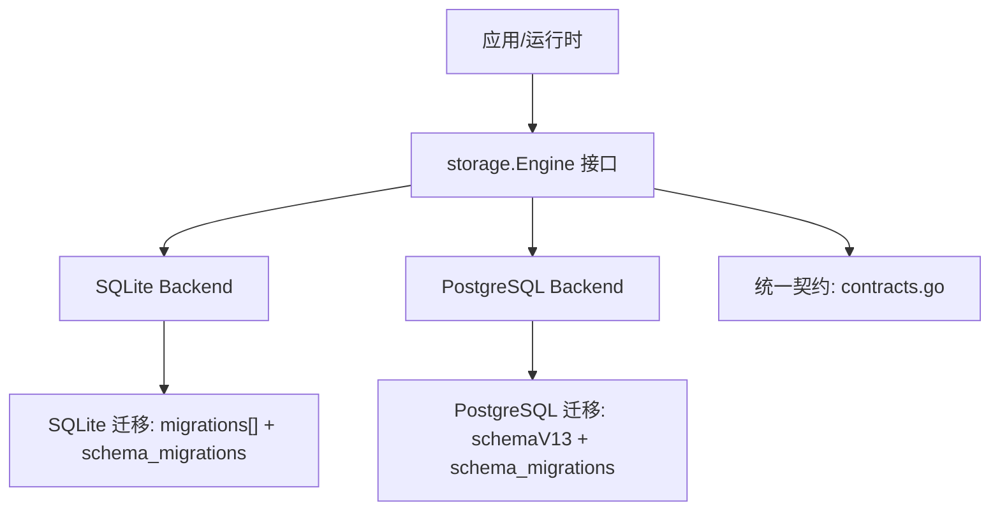
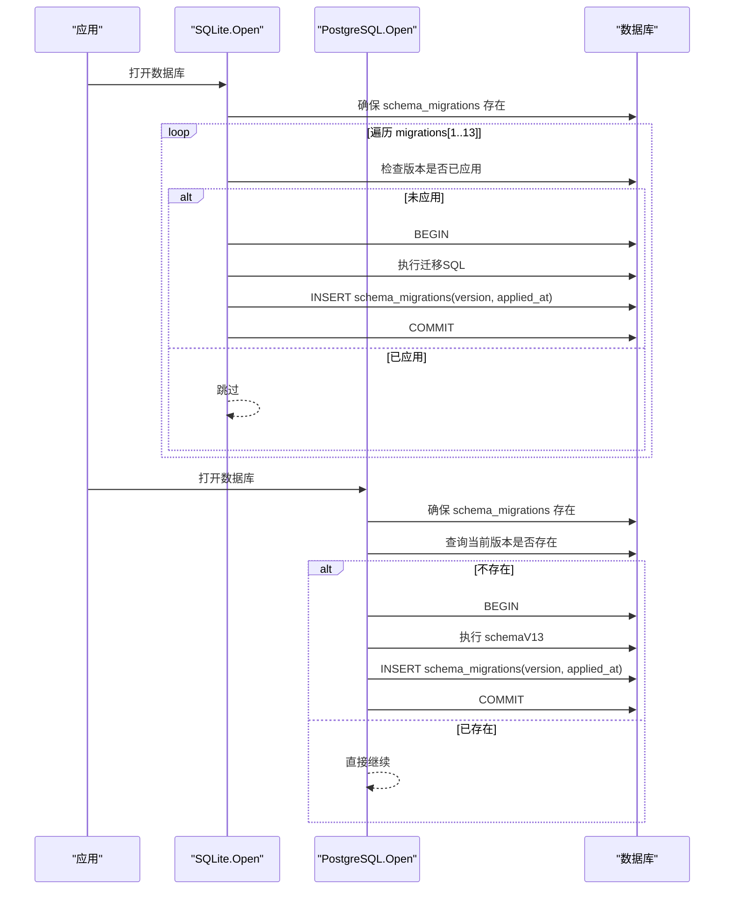
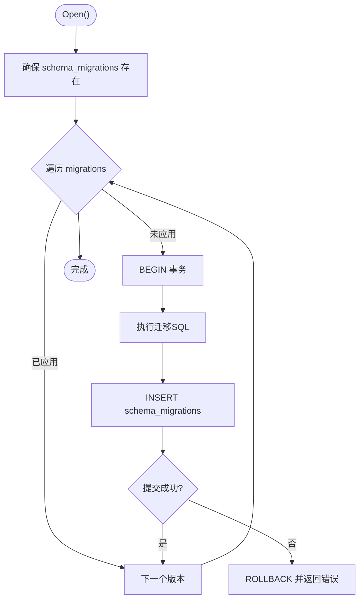
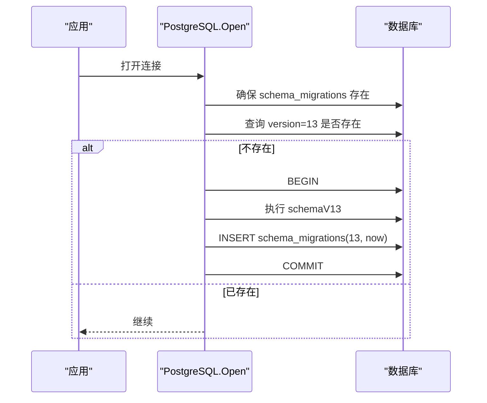
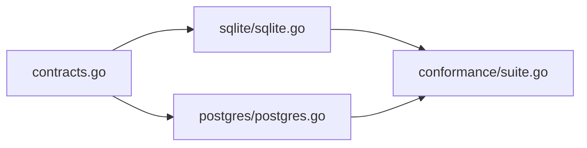

# 数据迁移管理

<cite>
**本文引用的文件**
- [sqlite.go](file://internal/storage/sqlite/sqlite.go)
- [postgres.go](file://internal/storage/postgres/postgres.go)
- [schema.go](file://internal/storage/postgres/schema.go)
- [contracts.go](file://internal/storage/contracts.go)
- [conformance_test.go (SQLite)](file://internal/storage/sqlite/conformance_test.go)
- [conformance_test.go (PostgreSQL)](file://internal/storage/postgres/conformance_test.go)
- [suite.go](file://internal/storage/conformance/suite.go)
</cite>

## 目录
1. [简介](#简介)
2. [项目结构](#项目结构)
3. [核心组件](#核心组件)
4. [架构总览](#架构总览)
5. [详细组件分析](#详细组件分析)
6. [依赖关系分析](#依赖关系分析)
7. [性能考量](#性能考量)
8. [故障排查指南](#故障排查指南)
9. [结论](#结论)
10. [附录](#附录)

## 简介
本文件面向 Vivy 运行时（vivy.exe）的数据迁移管理，聚焦版本控制策略、迁移脚本编写规范、回滚机制，以及 SQLite 与 PostgreSQL 在不同版本间的迁移路径。文档涵盖表结构变更、数据转换、索引重建、测试套件中的迁移验证流程、向后兼容性保障、零停机迁移策略、数据一致性检查、性能影响评估，并给出最佳实践与故障恢复方案。

## 项目结构
存储层位于 internal/storage，提供统一的 Engine 接口契约，并由 SQLite 与 PostgreSQL 两种后端实现：
- SQLite：默认嵌入式后端，使用内联 SQL 迁移脚本按序执行，维护 schema_migrations 表记录已应用版本。
- PostgreSQL：服务端后端，通过一次性创建完整 schemaV13 并记录版本号；支持多 schema 隔离测试。
- 统一契约：internal/storage/contracts.go 定义 Journal、SnapshotStore、BlobStore、LeaseStore、ApprovalStore、QuestionStore、ReviewStore、SkillRevisionStore、TodoStore、StudioStore、Engine 等接口，所有后端必须实现这些契约以保证可替换性。

图表来源
- [sqlite.go:17-36](file://internal/storage/sqlite/sqlite.go#L17-L36)
- [postgres.go:133-166](file://internal/storage/postgres/postgres.go#L133-L166)
- [contracts.go:55-273](file://internal/storage/contracts.go#L55-L273)

章节来源
- [sqlite.go:17-36](file://internal/storage/sqlite/sqlite.go#L17-L36)
- [postgres.go:133-166](file://internal/storage/postgres/postgres.go#L133-L166)
- [contracts.go:55-273](file://internal/storage/contracts.go#L55-L273)

## 核心组件
- 迁移编排器（SQLite）：在 Open 时读取 migrations 列表，逐个事务执行未应用的迁移，并在 schema_migrations 中记录版本与时间戳。失败即中止启动，保证 FR-8 的健壮性。
- 迁移编排器（PostgreSQL）：首次连接时检查 schema_migrations 是否包含当前版本；若不存在则在一个事务中创建完整 schemaV13 并写入版本记录。
- 版本常量：PostgreSQL 使用 schemaVersion = 13；SQLite 使用 migrations 数组至 version=13。两者逻辑上对齐到同一“逻辑版本”。
- 契约与错误：ErrRunClosed、ErrCommitInvalid、ErrVersionConflict、ErrLeaseHeld、ErrLeaseLost 等用于约束运行期行为与并发安全。

章节来源
- [sqlite.go:109-147](file://internal/storage/sqlite/sqlite.go#L109-L147)
- [postgres.go:20-26](file://internal/storage/postgres/postgres.go#L20-L26)
- [postgres.go:133-166](file://internal/storage/postgres/postgres.go#L133-L166)
- [contracts.go:11-31](file://internal/storage/contracts.go#L11-L31)

## 架构总览
下图展示启动时的迁移流程与双后端差异：

图表来源
- [sqlite.go:109-147](file://internal/storage/sqlite/sqlite.go#L109-L147)
- [postgres.go:133-166](file://internal/storage/postgres/postgres.go#L133-L166)

## 详细组件分析

### SQLite 迁移系统
- 版本序列：migrations 数组从 1 到 13，每个元素包含 version 与 sql 字符串。
- 幂等与原子：每个迁移在独立事务中执行，成功后写入 schema_migrations；任何步骤失败均回滚并中止启动。
- 典型变更类型：
  - 新增表：如 notes、questions、skill_revisions、todos、generations、eval_runs、promotions、studio_events。
  - 字段扩展：对 approvals、sessions、messages、questions 等表增加列并设置安全默认值，确保旧数据可读。
  - 索引重建：为 runs、approvals、questions、skill_revisions、todos、eval_runs、promotions 建立或优化索引。
  - 数据修复：例如 migration005 对 root_run_id 进行初始化填充。
- 关键路径参考：
  - 迁移执行入口与版本记录：[sqlite.go:109-147](file://internal/storage/sqlite/sqlite.go#L109-L147)
  - 各版本 SQL 定义：[sqlite.go:149-405](file://internal/storage/sqlite/sqlite.go#L149-L405)

图表来源
- [sqlite.go:109-147](file://internal/storage/sqlite/sqlite.go#L109-L147)

章节来源
- [sqlite.go:17-36](file://internal/storage/sqlite/sqlite.go#L17-L36)
- [sqlite.go:109-147](file://internal/storage/sqlite/sqlite.go#L109-L147)
- [sqlite.go:149-405](file://internal/storage/sqlite/sqlite.go#L149-L405)

### PostgreSQL 迁移系统
- 版本策略：以 schemaVersion = 13 作为当前逻辑版本；首次连接时若 schema_migrations 无该版本，则在事务中一次性创建 schemaV13 并记录版本。
- 全量建表：schemaV13 包含 sessions、messages、runs、run_events、approvals、snapshots、checkpoints、leases、notes、questions、skill_revisions、todos、generations、eval_runs、promotions、studio_events 及相应索引。
- 进程独占：通过 PG advisory lock 与 leases 表实现“organism”独占，避免多实例同时写入导致不一致。
- 关键路径参考：
  - 版本常量与连接参数：[postgres.go:20-26](file://internal/storage/postgres/postgres.go#L20-L26)
  - 迁移入口与版本记录：[postgres.go:133-166](file://internal/storage/postgres/postgres.go#L133-L166)
  - 完整 Schema：[schema.go:1-200](file://internal/storage/postgres/schema.go#L1-L200)

图表来源
- [postgres.go:133-166](file://internal/storage/postgres/postgres.go#L133-L166)
- [schema.go:1-200](file://internal/storage/postgres/schema.go#L1-L200)

章节来源
- [postgres.go:20-26](file://internal/storage/postgres/postgres.go#L20-L26)
- [postgres.go:133-166](file://internal/storage/postgres/postgres.go#L133-L166)
- [schema.go:1-200](file://internal/storage/postgres/schema.go#L1-L200)

### 版本控制策略
- 单一逻辑版本：SQLite 与 PostgreSQL 共同演进到 v13；注释明确“Postgres bootstraps here in one step; later versions increment both engines”，表明后续版本需同步更新两端。
- 向后兼容：新增列一律带安全默认值，旧行仍可被新代码读取；必要时进行数据修复（如 root_run_id 初始化）。
- 幂等与可重入：迁移脚本不重复创建对象；SQLite 通过 schema_migrations 去重；PostgreSQL 通过版本检查避免重复执行。
- 建议：新增版本时，务必在 SQLite 追加迁移项，在 PostgreSQL 同步更新 schemaVersion 与 schemaVxx，并保持语义一致。

章节来源
- [schema.go:3-5](file://internal/storage/postgres/schema.go#L3-L5)
- [postgres.go:20-26](file://internal/storage/postgres/postgres.go#L20-L26)
- [sqlite.go:17-36](file://internal/storage/sqlite/sqlite.go#L17-L36)

### 迁移脚本编写规范
- 顺序与原子：每个迁移一个事务；失败立即回滚，不留下半更新状态。
- 安全默认值：新增列必须提供 NOT NULL DEFAULT 值，保证旧数据可读。
- 索引策略：优先添加覆盖查询的复合索引（如 runs_parent_idx、approvals_status_expiry_idx、questions_status_expiry_idx、todos_session_position_idx、eval_runs_candidate_idx、promotions_from_accepted_idx）。
- 数据修复：仅在必要时进行 UPDATE 类修复（如 migration005 的 root_run_id），并确保幂等。
- 命名与注释：每个迁移函数/常量应有清晰注释说明目的与关联需求编号（如 D-021、C6、ADR-010/011）。
- 参考路径：
  - 迁移模板与示例：[sqlite.go:221-405](file://internal/storage/sqlite/sqlite.go#L221-L405)
  - 最终 Schema 对照：[schema.go:6-199](file://internal/storage/postgres/schema.go#L6-L199)

章节来源
- [sqlite.go:221-405](file://internal/storage/sqlite/sqlite.go#L221-L405)
- [schema.go:6-199](file://internal/storage/postgres/schema.go#L6-L199)

### 回滚机制
- 运行时回滚：当前存储层未内置通用“向下迁移”能力；生产环境应通过备份与快照恢复实现回滚。
- 测试与工具链参考：UI 侧 Memory 迁移具备 dry-run、artifact 清单、applied-manifest、backup 与 rollback 流程，可作为参考范式。
- 建议策略：
  - 发布前生成数据库快照/备份。
  - 应用迁移后执行完整性校验（行数、索引、外键、抽样数据）。
  - 若失败，基于备份快速恢复，并标记迁移为回滚态以便审计。

章节来源
- [sqlite.go:109-147](file://internal/storage/sqlite/sqlite.go#L109-L147)
- [postgres.go:133-166](file://internal/storage/postgres/postgres.go#L133-L166)

### SQLite 与 PostgreSQL 迁移路径对比
- SQLite：增量式迁移，逐条执行 SQL，适合嵌入式场景；单写者模型降低锁竞争。
- PostgreSQL：一次性全量建表，适合多进程/多实例服务化部署；通过 advisory lock 与 leases 表实现独占。
- 一致性目标：两端的表结构、索引与业务语义保持一致，便于切换与横向扩展。

章节来源
- [sqlite.go:17-36](file://internal/storage/sqlite/sqlite.go#L17-L36)
- [postgres.go:133-166](file://internal/storage/postgres/postgres.go#L133-L166)
- [schema.go:1-200](file://internal/storage/postgres/schema.go#L1-L200)

### 测试套件中的迁移验证流程
- 一致性测试套件：conformance.Run 覆盖 CN-01..CN-16，包括原子追加、单调序列、期望版本冲突、幂等回放、重试分歧拒绝、唯一终态事件、先写者胜审批、重启修复视图、断尾写存活、负载字节保真、孤儿 checkpoint 清理、杀进程后审批、负载保真、双句柄锁安全、并发写、断开后回放等。
- SQLite 测试：DualOpenShared 模式，允许共享写入，验证日志连续性。
- PostgreSQL 测试：DualOpenExclusive 模式，第二个 Open 必须返回 ErrLeaseHeld，验证独占语义。
- 迁移相关断言：
  - 迁移失败不污染状态（事务回滚）。
  - 重启后视图一致（active runs、pending approvals）。
  - 负载字节保真（secret audit anchor）。
  - 并发写下的序列连续性与幂等回放。

章节来源
- [suite.go:42-73](file://internal/storage/conformance/suite.go#L42-L73)
- [suite.go:103-549](file://internal/storage/conformance/suite.go#L103-L549)
- [conformance_test.go (SQLite):12-31](file://internal/storage/sqlite/conformance_test.go#L12-L31)
- [conformance_test.go (PostgreSQL):17-40](file://internal/storage/postgres/conformance_test.go#L17-L40)

### 零停机迁移策略
- 现状：当前实现并非严格意义上的零停机；SQLite 在 Open 时串行执行迁移，PostgreSQL 首次建表也需事务。
- 推荐做法：
  - 滚动升级：先升级只读副本/消费者，再升级写入端。
  - 预创建 Schema：在部署前预先执行 schemaVxx 或迁移脚本，确保新版本启动时无阻塞。
  - 灰度发布：小流量验证后再全量切换。
  - 监控告警：迁移耗时、失败率、锁等待、长事务告警。

章节来源
- [sqlite.go:109-147](file://internal/storage/sqlite/sqlite.go#L109-L147)
- [postgres.go:133-166](file://internal/storage/postgres/postgres.go#L133-L166)

### 数据一致性检查
- 运行时约束：Journal 的 Append 拒绝包含多个终态事件的 commit；Run 关闭后禁止追加。
- 快照乐观锁：SnapshotStore.Put 使用 expectVersion 防止脏写。
- 审批与问题：Approvals/Questions 支持过期与元数据，配合 Review Store 提供可观测性。
- 测试覆盖：CN-06 唯一终态、CN-13 负载字节保真、CN-11 孤儿清理、CN-14 双句柄锁安全。

章节来源
- [contracts.go:11-31](file://internal/storage/contracts.go#L11-L31)
- [contracts.go:55-273](file://internal/storage/contracts.go#L55-L273)
- [suite.go:211-240](file://internal/storage/conformance/suite.go#L211-L240)
- [suite.go:362-392](file://internal/storage/conformance/suite.go#L362-L392)

### 性能影响评估
- SQLite：单写者、低并发；WAL 与锁配置由驱动处理；迁移阶段短事务，影响可控。
- PostgreSQL：连接池大小 defaultMaxConns=8；心跳与租约维持独占；索引设计减少扫描成本。
- 建议：
  - 大表迁移分片执行，避免长事务。
  - 批量 DDL/DML 合并以减少往返。
  - 监控慢查询与锁争用。

章节来源
- [postgres.go:20-26](file://internal/storage/postgres/postgres.go#L20-L26)
- [sqlite.go:45-47](file://internal/storage/sqlite/sqlite.go#L45-L47)

## 依赖关系分析
- 耦合与内聚：
  - storage 包对外暴露 Engine 接口，内部 SQLite/PostgreSQL 各自封装迁移细节，内聚良好。
  - 契约集中定义，避免实现间相互依赖。
- 外部依赖：
  - SQLite：modernc.org/sqlite（纯 Go，无 CGO）。
  - PostgreSQL：jackc/pgx/v5 与 stdlib 桥接。
- 潜在循环：无直接循环依赖；测试套件通过 Harness 注入不同后端。

图表来源
- [contracts.go:55-273](file://internal/storage/contracts.go#L55-L273)
- [sqlite.go:17-36](file://internal/storage/sqlite/sqlite.go#L17-L36)
- [postgres.go:133-166](file://internal/storage/postgres/postgres.go#L133-L166)
- [suite.go:42-73](file://internal/storage/conformance/suite.go#L42-L73)

章节来源
- [contracts.go:55-273](file://internal/storage/contracts.go#L55-L273)
- [sqlite.go:17-36](file://internal/storage/sqlite/sqlite.go#L17-L36)
- [postgres.go:133-166](file://internal/storage/postgres/postgres.go#L133-L166)
- [suite.go:42-73](file://internal/storage/conformance/suite.go#L42-L73)

## 性能考量
- 迁移阶段：尽量缩短事务粒度，避免长时间锁定；PostgreSQL 全量建表应在低峰期执行。
- 索引：优先选择选择性高的列组合，避免过度索引影响写入。
- 连接池：根据负载调整 PostgreSQL 最大连接数；SQLite 保持单连接以避免竞争。
- 监控：记录迁移耗时、失败次数、锁等待时长、长事务数量。

## 故障排查指南
- 启动失败：
  - 检查 schema_migrations 是否被正确写入；确认迁移事务是否提交。
  - 查看错误信息定位具体迁移版本与语句。
- 数据不一致：
  - 使用 Replay 与 after_seq 游标检查事件连续性。
  - 核对终端事件唯一性（CN-06）。
- 并发问题：
  - PostgreSQL 下确认第二个 Open 是否返回 ErrLeaseHeld。
  - 检查 Lease 心跳与丢失后的 fence 行为。
- 负载保真：
  - 通过 CN-13 断言 payload 字节不变，排除序列化/反序列化篡改。

章节来源
- [sqlite.go:109-147](file://internal/storage/sqlite/sqlite.go#L109-L147)
- [postgres.go:133-166](file://internal/storage/postgres/postgres.go#L133-L166)
- [suite.go:211-240](file://internal/storage/conformance/suite.go#L211-L240)
- [suite.go:423-439](file://internal/storage/conformance/suite.go#L423-L439)

## 结论
本项目采用“SQLite 增量迁移 + PostgreSQL 全量建表”的双轨策略，统一收敛到 v13 逻辑版本，并通过严格的契约与一致性测试保障行为一致。建议在后续版本迭代中坚持“向后兼容、安全默认值、幂等迁移、索引先行、测试覆盖”的原则，结合滚动升级与监控告警实现更稳健的零停机发布。

## 附录
- 术语
  - 逻辑版本：SQLite 与 PostgreSQL 共同演进的目标版本（当前为 13）。
  - 租户/Schema：PostgreSQL 测试中使用独立 schema 隔离。
  - 租约：organism 独占写入权，防止多实例竞争。
- 参考路径
  - SQLite 迁移定义与执行：[sqlite.go:17-36](file://internal/storage/sqlite/sqlite.go#L17-L36)、[sqlite.go:109-147](file://internal/storage/sqlite/sqlite.go#L109-L147)、[sqlite.go:149-405](file://internal/storage/sqlite/sqlite.go#L149-L405)
  - PostgreSQL 迁移与 Schema：[postgres.go:20-26](file://internal/storage/postgres/postgres.go#L20-L26)、[postgres.go:133-166](file://internal/storage/postgres/postgres.go#L133-L166)、[schema.go:1-200](file://internal/storage/postgres/schema.go#L1-L200)
  - 契约与错误：[contracts.go:11-31](file://internal/storage/contracts.go#L11-L31)、[contracts.go:55-273](file://internal/storage/contracts.go#L55-L273)
  - 一致性测试：[suite.go:42-73](file://internal/storage/conformance/suite.go#L42-L73)、[suite.go:103-549](file://internal/storage/conformance/suite.go#L103-L549)
  - 后端测试装配：[conformance_test.go (SQLite):12-31](file://internal/storage/sqlite/conformance_test.go#L12-L31)、[conformance_test.go (PostgreSQL):17-40](file://internal/storage/postgres/conformance_test.go#L17-L40)