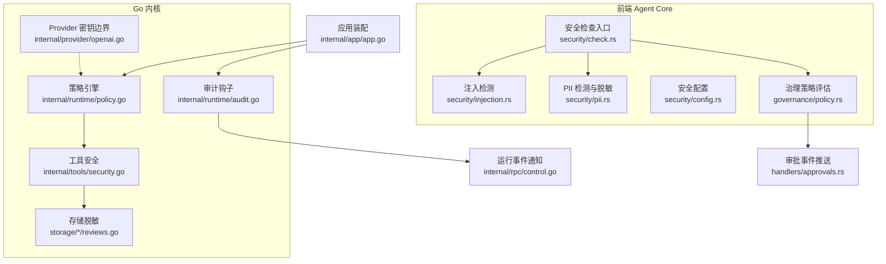
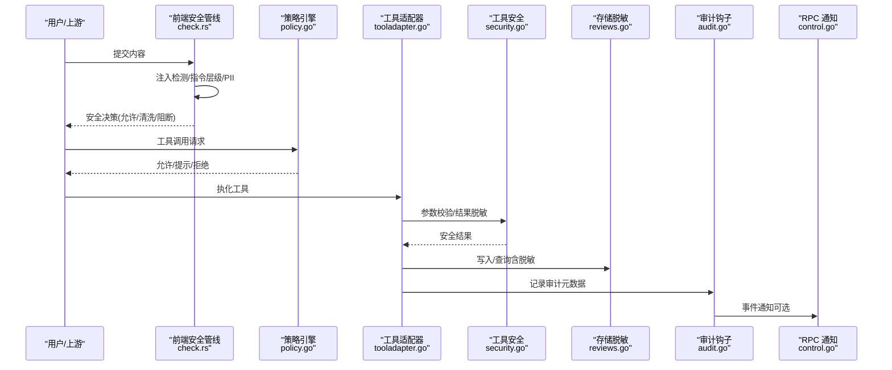
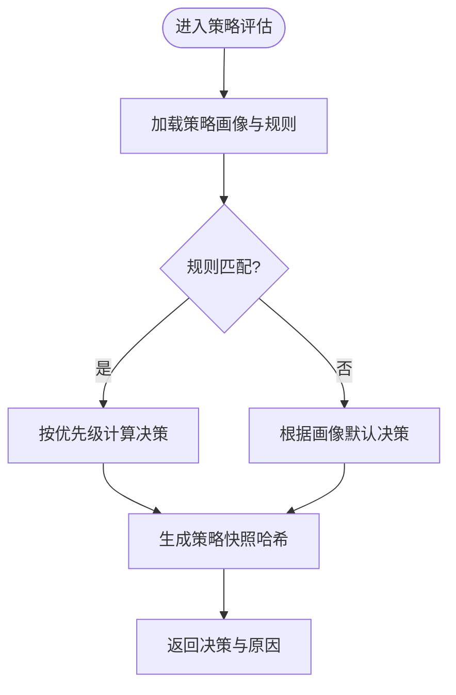
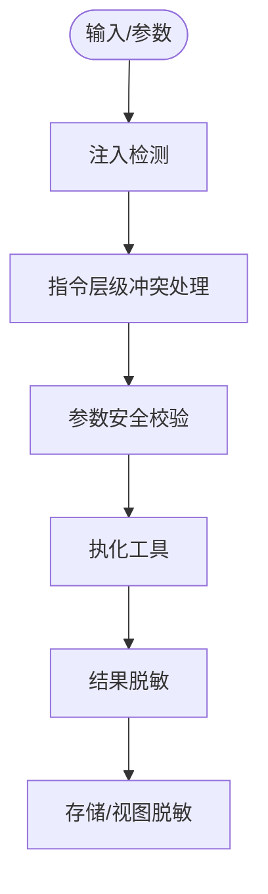
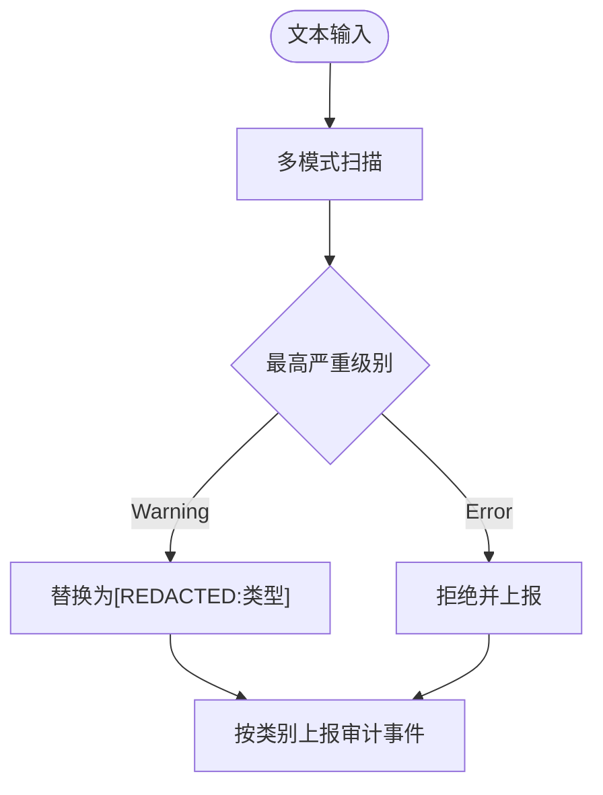
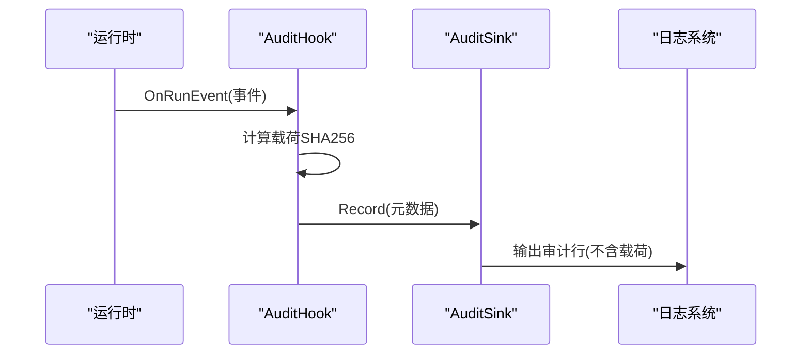
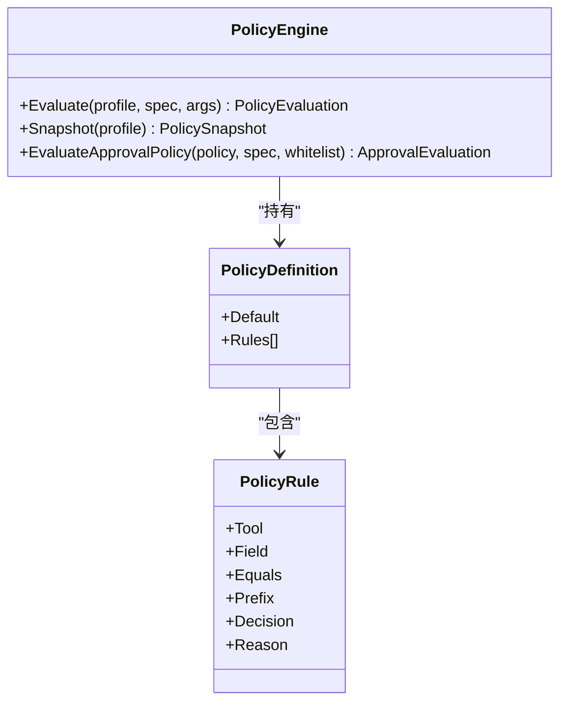
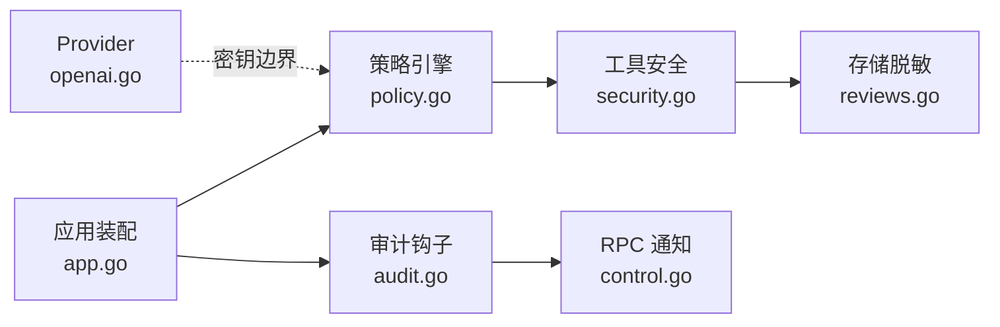

# 安全与审计

<cite>
**本文引用的文件**
- [internal/runtime/audit.go](file://internal/runtime/audit.go)
- [internal/runtime/policy.go](file://internal/runtime/policy.go)
- [internal/app/app.go](file://internal/app/app.go)
- [internal/tools/security.go](file://internal/tools/security.go)
- [internal/rpc/control.go](file://internal/rpc/control.go)
- [internal/storage/postgres/reviews.go](file://internal/storage/postgres/reviews.go)
- [internal/storage/sqlite/reviews.go](file://internal/storage/sqlite/reviews.go)
- [internal/provider/openai.go](file://internal/provider/openai.go)
- [internal/provider/secret_audit_test.go](file://internal/provider/secret_audit_test.go)
- [docs/secret-redaction-audit.md](file://docs/secret-redaction-audit.md)
- [ui/agent-diva-source/agent-diva-core/src/audit.rs](file://ui/agent-diva-source/agent-diva-core/src/audit.rs)
- [ui/agent-diva-source/agent-diva-core/src/security/check.rs](file://ui/agent-diva-source/agent-diva-core/src/security/check.rs)
- [ui/agent-diva-source/agent-diva-core/src/security/injection.rs](file://ui/agent-diva-source/agent-diva-core/src/security/injection.rs)
- [ui/agent-diva-source/agent-diva-core/src/security/pii.rs](file://ui/agent-diva-source/agent-diva-core/src/security/pii.rs)
- [ui/agent-diva-source/agent-diva-core/src/security/config.rs](file://ui/agent-diva-source/agent-diva-core/src/security/config.rs)
- [ui/agent-diva-source/agent-diva-core/src/governance/policy.rs](file://ui/agent-diva-source/agent-diva-core/src/governance/policy.rs)
- [ui/agent-diva-source/agent-diva-manager/src/handlers/approvals.rs](file://ui/agent-diva-source/agent-diva-manager/src/handlers/approvals.rs)
</cite>

## 目录
1. [简介](#简介)
2. [项目结构](#项目结构)
3. [核心组件](#核心组件)
4. [架构总览](#架构总览)
5. [详细组件分析](#详细组件分析)
6. [依赖关系分析](#依赖关系分析)
7. [性能考量](#性能考量)
8. [故障排查指南](#故障排查指南)
9. [结论](#结论)
10. [附录](#附录)

## 简介
本文件面向“安全与审计”主题，系统性梳理并解释本项目在安全策略、访问控制、输入验证、输出过滤、审计日志、密钥管理、敏感信息脱敏、权限控制、安全配置、监控告警与应急响应等方面的实现与最佳实践。文档同时覆盖 Go 内核（internal/*）与前端 Agent Core（ui/agent-diva-source/...）两条路径的安全能力，确保从请求入口到工具执行、再到持久化与 UI 展示的全链路安全闭环。

## 项目结构
围绕安全与审计的关键代码分布在以下层次：
- 运行时策略与审计钩子：internal/runtime/policy.go、internal/runtime/audit.go
- 应用装配与策略引擎注入：internal/app/app.go
- 工具层输入校验与输出脱敏：internal/tools/security.go
- 存储层审查数据脱敏：internal/storage/{postgres,sqlite}/reviews.go
- 密钥边界与合规审计：internal/provider/openai.go、internal/provider/secret_audit_test.go、docs/secret-redaction-audit.md
- 前端安全策略与审计事件：ui/agent-diva-source/agent-diva-core/src/security/*、src/audit.rs、src/governance/policy.rs
- 审批流与事件推送：ui/agent-diva-source/agent-diva-manager/src/handlers/approvals.rs
- 运行期事件通知：internal/rpc/control.go

**图示来源**
- [internal/runtime/policy.go:47-84](file://internal/runtime/policy.go#L47-L84)
- [internal/runtime/audit.go:12-62](file://internal/runtime/audit.go#L12-L62)
- [internal/tools/security.go:25-79](file://internal/tools/security.go#L25-L79)
- [internal/storage/postgres/reviews.go:270-330](file://internal/storage/postgres/reviews.go#L270-L330)
- [internal/provider/openai.go:30-30](file://internal/provider/openai.go#L30-L30)
- [ui/agent-diva-source/agent-diva-core/src/security/check.rs:1-69](file://ui/agent-diva-source/agent-diva-core/src/security/check.rs#L1-L69)
- [ui/agent-diva-source/agent-diva-core/src/security/injection.rs:73-117](file://ui/agent-diva-source/agent-diva-core/src/security/injection.rs#L73-L117)
- [ui/agent-diva-source/agent-diva-core/src/security/pii.rs:298-627](file://ui/agent-diva-source/agent-diva-core/src/security/pii.rs#L298-L627)
- [ui/agent-diva-source/agent-diva-core/src/security/config.rs:11-49](file://ui/agent-diva-source/agent-diva-core/src/security/config.rs#L11-L49)
- [ui/agent-diva-source/agent-diva-core/src/governance/policy.rs:52-95](file://ui/agent-diva-source/agent-diva-core/src/governance/policy.rs#L52-L95)
- [ui/agent-diva-source/agent-diva-manager/src/handlers/approvals.rs:176-204](file://ui/agent-diva-source/agent-diva-manager/src/handlers/approvals.rs#L176-L204)
- [internal/rpc/control.go:886-897](file://internal/rpc/control.go#L886-L897)

**章节来源**
- [internal/runtime/policy.go:47-84](file://internal/runtime/policy.go#L47-L84)
- [internal/runtime/audit.go:12-62](file://internal/runtime/audit.go#L12-L62)
- [internal/tools/security.go:25-79](file://internal/tools/security.go#L25-L79)
- [internal/storage/postgres/reviews.go:270-330](file://internal/storage/postgres/reviews.go#L270-L330)
- [internal/provider/openai.go:30-30](file://internal/provider/openai.go#L30-L30)
- [ui/agent-diva-source/agent-diva-core/src/security/check.rs:1-69](file://ui/agent-diva-source/agent-diva-core/src/security/check.rs#L1-L69)
- [ui/agent-diva-source/agent-diva-core/src/security/injection.rs:73-117](file://ui/agent-diva-source/agent-diva-core/src/security/injection.rs#L73-L117)
- [ui/agent-diva-source/agent-diva-core/src/security/pii.rs:298-627](file://ui/agent-diva-source/agent-diva-core/src/security/pii.rs#L298-L627)
- [ui/agent-diva-source/agent-diva-core/src/security/config.rs:11-49](file://ui/agent-diva-source/agent-diva-core/src/security/config.rs#L11-L49)
- [ui/agent-diva-source/agent-diva-core/src/governance/policy.rs:52-95](file://ui/agent-diva-source/agent-diva-core/src/governance/policy.rs#L52-L95)
- [ui/agent-diva-source/agent-diva-manager/src/handlers/approvals.rs:176-204](file://ui/agent-diva-source/agent-diva-manager/src/handlers/approvals.rs#L176-L204)
- [internal/rpc/control.go:886-897](file://internal/rpc/control.go#L886-L897)

## 核心组件
- 策略引擎（PolicyEngine）：定义策略画像（默认、只读、计划、全自动），对工具调用进行允许/提示/拒绝决策，并生成可审计的快照哈希。
- 审计钩子（AuditHook + AuditSink）：将每个持久化事件的元数据（不含载荷）以摘要形式记录，避免二次泄露。
- 工具安全（tools/security.go）：统一进行提示注入信号扫描、参数安全校验（路径/命令）、结果脱敏（密钥/邮箱）。
- 存储层脱敏（reviews.go）：对审查视图中的键值进行递归脱敏，防止敏感字段外泄。
- Provider 密钥边界：仅允许在 provider 包读取环境变量密钥，禁止硬编码与跨域传播。
- 前端安全管线：注入检测、指令层级冲突处理、PII 检测与分级处置（警告/错误）、安全策略评估与约束证据。
- 审批流与事件：SSE 推送审批事件，供 UI 实时呈现；运行期事件通过 RPC 通知。

**章节来源**
- [internal/runtime/policy.go:47-84](file://internal/runtime/policy.go#L47-L84)
- [internal/runtime/audit.go:12-62](file://internal/runtime/audit.go#L12-L62)
- [internal/tools/security.go:25-79](file://internal/tools/security.go#L25-L79)
- [internal/storage/postgres/reviews.go:270-330](file://internal/storage/postgres/reviews.go#L270-L330)
- [internal/provider/openai.go:30-30](file://internal/provider/openai.go#L30-L30)
- [ui/agent-diva-source/agent-diva-core/src/security/check.rs:1-69](file://ui/agent-diva-source/agent-diva-core/src/security/check.rs#L1-L69)
- [ui/agent-diva-source/agent-diva-core/src/security/pii.rs:298-627](file://ui/agent-diva-source/agent-diva-core/src/security/pii.rs#L298-L627)
- [ui/agent-diva-source/agent-diva-core/src/governance/policy.rs:52-95](file://ui/agent-diva-source/agent-diva-core/src/governance/policy.rs#L52-L95)
- [ui/agent-diva-source/agent-diva-manager/src/handlers/approvals.rs:176-204](file://ui/agent-diva-source/agent-diva-manager/src/handlers/approvals.rs#L176-L204)

## 架构总览
下图展示了从用户输入到工具执行、策略评估、审计记录与存储脱敏的整体流程。

**图示来源**
- [ui/agent-diva-source/agent-diva-core/src/security/check.rs:1-69](file://ui/agent-diva-source/agent-diva-core/src/security/check.rs#L1-L69)
- [internal/runtime/policy.go:96-135](file://internal/runtime/policy.go#L96-L135)
- [internal/tools/security.go:25-79](file://internal/tools/security.go#L25-L79)
- [internal/storage/postgres/reviews.go:270-330](file://internal/storage/postgres/reviews.go#L270-L330)
- [internal/runtime/audit.go:35-62](file://internal/runtime/audit.go#L35-L62)
- [internal/rpc/control.go:886-897](file://internal/rpc/control.go#L886-L897)

## 详细组件分析

### 安全策略与访问控制
- 策略画像与规则匹配：内置默认/只读/计划/全自动画像，支持按工具名与参数字段（等于/前缀）匹配，决定 Allow/Prompt/Deny。
- 审批策略：区分 ask/never/auto，结合白名单决定是否发起人工审批。
- 策略快照与哈希：每次评估附带策略快照哈希，便于审计追踪与变更比对。

**图示来源**
- [internal/runtime/policy.go:47-84](file://internal/runtime/policy.go#L47-L84)
- [internal/runtime/policy.go:96-135](file://internal/runtime/policy.go#L96-L135)
- [internal/runtime/policy.go:217-273](file://internal/runtime/policy.go#L217-L273)

**章节来源**
- [internal/runtime/policy.go:47-84](file://internal/runtime/policy.go#L47-L84)
- [internal/runtime/policy.go:96-135](file://internal/runtime/policy.go#L96-L135)
- [internal/runtime/policy.go:217-273](file://internal/runtime/policy.go#L217-L273)

### 输入验证与输出过滤
- 输入侧：
  - 提示注入检测：基于正则集识别角色覆盖、越狱、工具输出注入等模式。
  - 指令层级冲突：对用户/工具消息进行层级解析与冲突裁决。
  - 参数安全：阻止 NUL 字节、命令拼接、路径穿越、UNC 路径等危险构造。
- 输出侧：
  - 工具结果脱敏：替换常见密钥与邮箱为占位符。
  - 存储视图脱敏：对审查视图中的敏感键递归替换为占位符。

**图示来源**
- [ui/agent-diva-source/agent-diva-core/src/security/injection.rs:73-117](file://ui/agent-diva-source/agent-diva-core/src/security/injection.rs#L73-L117)
- [ui/agent-diva-source/agent-diva-core/src/security/check.rs:32-69](file://ui/agent-diva-source/agent-diva-core/src/security/check.rs#L32-L69)
- [internal/tools/security.go:25-79](file://internal/tools/security.go#L25-L79)
- [internal/storage/postgres/reviews.go:270-330](file://internal/storage/postgres/reviews.go#L270-L330)

**章节来源**
- [ui/agent-diva-source/agent-diva-core/src/security/injection.rs:73-117](file://ui/agent-diva-source/agent-diva-core/src/security/injection.rs#L73-L117)
- [ui/agent-diva-source/agent-diva-core/src/security/check.rs:32-69](file://ui/agent-diva-source/agent-diva-core/src/security/check.rs#L32-L69)
- [internal/tools/security.go:25-79](file://internal/tools/security.go#L25-L79)
- [internal/storage/postgres/reviews.go:270-330](file://internal/storage/postgres/reviews.go#L270-L330)

### PII 检测与敏感信息脱敏
- 多类别 PII 检测：邮箱、电话、中国身份证、信用卡、API Key、IP、护照、银行卡等。
- 分级处置：Warning 级别进行脱敏后继续；Error 级别直接拒绝。
- 审计上报：按类别统计并上报审计事件。

**图示来源**
- [ui/agent-diva-source/agent-diva-core/src/security/pii.rs:298-627](file://ui/agent-diva-source/agent-diva-core/src/security/pii.rs#L298-L627)
- [ui/agent-diva-source/agent-diva-core/src/audit.rs:15-31](file://ui/agent-diva-source/agent-diva-core/src/audit.rs#L15-L31)

**章节来源**
- [ui/agent-diva-source/agent-diva-core/src/security/pii.rs:298-627](file://ui/agent-diva-source/agent-diva-core/src/security/pii.rs#L298-L627)
- [ui/agent-diva-source/agent-diva-core/src/audit.rs:15-31](file://ui/agent-diva-source/agent-diva-core/src/audit.rs#L15-L31)

### 审计日志系统
- 后端审计钩子：对每个持久化事件仅记录 RunID、序列号、类型、创建时间、载荷大小与 SHA256 摘要，不携带原始载荷，避免二次泄露。
- 前端审计事件：结构化 JSON 行通过 tracing 输出，目标为 audit，供 GUI/CLI 消费重放。
- 安全事件：包括策略决策、通道认证失败、消息阻断、PII 脱敏统计等。

**图示来源**
- [internal/runtime/audit.go:12-62](file://internal/runtime/audit.go#L12-L62)
- [ui/agent-diva-source/agent-diva-core/src/audit.rs:1-186](file://ui/agent-diva-source/agent-diva-core/src/audit.rs#L1-L186)

**章节来源**
- [internal/runtime/audit.go:12-62](file://internal/runtime/audit.go#L12-L62)
- [ui/agent-diva-source/agent-diva-core/src/audit.rs:1-186](file://ui/agent-diva-source/agent-diva-core/src/audit.rs#L1-L186)

### 密钥管理与敏感信息保护
- 密钥边界：仅在 provider 包读取环境变量密钥，禁止硬编码与跨域传播；严格配置校验拒绝未知字段。
- 审计保障：仓库级测试扫描所有 Go 源码，确保无密钥泄漏路径；运行期测试断言 SQLite 与事件负载中不包含密钥。
- 输出脱敏：工具结果与审查视图均进行敏感字段替换。

**章节来源**
- [internal/provider/openai.go:30-30](file://internal/provider/openai.go#L30-L30)
- [internal/provider/secret_audit_test.go:60-95](file://internal/provider/secret_audit_test.go#L60-L95)
- [docs/secret-redaction-audit.md:1-76](file://docs/secret-redaction-audit.md#L1-L76)
- [internal/tools/security.go:73-79](file://internal/tools/security.go#L73-L79)
- [internal/storage/postgres/reviews.go:270-330](file://internal/storage/postgres/reviews.go#L270-L330)

### 权限控制与审批机制
- 策略画像驱动：不同画像决定默认行为（允许/提示/拒绝）。
- 审批策略：ask/never/auto 三种模式，auto 下白名单工具自动放行，其余需审批。
- 前端治理策略：评估结果包含决策、原因码与约束证据（请求/会话/资源/版本/过期）。

**图示来源**
- [internal/runtime/policy.go:19-45](file://internal/runtime/policy.go#L19-L45)
- [internal/runtime/policy.go:47-84](file://internal/runtime/policy.go#L47-L84)
- [internal/runtime/policy.go:96-135](file://internal/runtime/policy.go#L96-L135)
- [internal/runtime/policy.go:217-273](file://internal/runtime/policy.go#L217-L273)
- [ui/agent-diva-source/agent-diva-core/src/governance/policy.rs:52-95](file://ui/agent-diva-source/agent-diva-core/src/governance/policy.rs#L52-L95)

**章节来源**
- [internal/runtime/policy.go:19-45](file://internal/runtime/policy.go#L19-L45)
- [internal/runtime/policy.go:47-84](file://internal/runtime/policy.go#L47-L84)
- [internal/runtime/policy.go:96-135](file://internal/runtime/policy.go#L96-L135)
- [internal/runtime/policy.go:217-273](file://internal/runtime/policy.go#L217-L273)
- [ui/agent-diva-source/agent-diva-core/src/governance/policy.rs:52-95](file://ui/agent-diva-source/agent-diva-core/src/governance/policy.rs#L52-L95)

### 安全配置指南
- 安全等级预设：Permissive/Standard/Strict/Paranoid，分别对应不同的速率限制与工作区限制、是否只读等默认策略。
- 策略编写建议：
  - 明确画像与默认决策；对高风险工具设置显式 Deny 或 Prompt。
  - 使用 Field 匹配精确限定参数范围（如 path/file_path/command）。
  - 为关键操作附加 Reason，便于审计与排障。
- 风险评估要点：
  - 关注注入风险、命令注入、路径穿越、凭证泄露。
  - 对工具输出进行预算裁剪与脱敏，避免模型上下文污染。
- 漏洞防护：
  - 启用参数安全校验与结果脱敏。
  - 通过策略引擎限制效果型工具调用。
  - 使用审批机制对高危操作进行人工把关。

**章节来源**
- [ui/agent-diva-source/agent-diva-core/src/security/config.rs:11-49](file://ui/agent-diva-source/agent-diva-core/src/security/config.rs#L11-L49)
- [internal/runtime/policy.go:47-84](file://internal/runtime/policy.go#L47-L84)
- [internal/tools/security.go:25-79](file://internal/tools/security.go#L25-L79)

### 安全监控、告警与应急响应
- 监控点：
  - 注入检测命中、PII 检测统计、策略决策、通道认证失败、消息阻断、技能加载/隔离等。
- 告警建议：
  - 对 High/Critical 级别事件设置阈值告警。
  - 对频繁阻断同一渠道/会话的事件触发告警。
- 应急响应：
  - 快速切换策略画像（如 ReadOnly/Plan）降低风险面。
  - 暂停可疑渠道或会话，收集审计元数据进行溯源。
  - 通过策略规则临时封禁特定工具或参数前缀。

**章节来源**
- [ui/agent-diva-source/agent-diva-core/src/audit.rs:15-186](file://ui/agent-diva-source/agent-diva-core/src/audit.rs#L15-L186)
- [internal/runtime/policy.go:47-84](file://internal/runtime/policy.go#L47-L84)

### 审计分析方法
- 后端审计：基于 RunID、Seq、Type、PayloadSHA256 关联事件，结合策略快照哈希定位策略版本。
- 前端审计：过滤 target=audit 的日志行，重建事件流，用于 GUI/CLI 展示与回溯。
- 审查视图：对敏感键递归脱敏，保留元数据以便分析。

**章节来源**
- [internal/runtime/audit.go:12-62](file://internal/runtime/audit.go#L12-L62)
- [ui/agent-diva-source/agent-diva-core/src/audit.rs:1-186](file://ui/agent-diva-source/agent-diva-core/src/audit.rs#L1-L186)
- [internal/storage/postgres/reviews.go:270-330](file://internal/storage/postgres/reviews.go#L270-L330)

## 依赖关系分析
- 策略引擎依赖 domain 类型与工具规格，提供不可变实例，适合跨运行共享。
- 审计钩子依赖 domain.RunEvent，仅传递元数据，避免载荷泄露。
- 工具安全模块被工具适配器与代理链复用，形成统一的输入/输出安全边界。
- 存储层对审查视图进行脱敏，保证 UI/RPC 返回安全。
- Provider 包是唯一允许读取密钥的环境变量入口，受仓库级测试约束。

**图示来源**
- [internal/app/app.go:350-386](file://internal/app/app.go#L350-L386)
- [internal/runtime/policy.go:47-84](file://internal/runtime/policy.go#L47-L84)
- [internal/runtime/audit.go:35-62](file://internal/runtime/audit.go#L35-L62)
- [internal/tools/security.go:25-79](file://internal/tools/security.go#L25-L79)
- [internal/storage/postgres/reviews.go:270-330](file://internal/storage/postgres/reviews.go#L270-L330)
- [internal/provider/openai.go:30-30](file://internal/provider/openai.go#L30-L30)
- [internal/rpc/control.go:886-897](file://internal/rpc/control.go#L886-L897)

**章节来源**
- [internal/app/app.go:350-386](file://internal/app/app.go#L350-L386)
- [internal/runtime/policy.go:47-84](file://internal/runtime/policy.go#L47-L84)
- [internal/runtime/audit.go:35-62](file://internal/runtime/audit.go#L35-L62)
- [internal/tools/security.go:25-79](file://internal/tools/security.go#L25-L79)
- [internal/storage/postgres/reviews.go:270-330](file://internal/storage/postgres/reviews.go#L270-L330)
- [internal/provider/openai.go:30-30](file://internal/provider/openai.go#L30-L30)
- [internal/rpc/control.go:886-897](file://internal/rpc/control.go#L886-L897)

## 性能考量
- 策略评估为轻量级规则匹配，复杂度与规则数量线性相关；建议在配置阶段完成规则校验与哈希计算。
- 注入检测与 PII 扫描使用预编译正则集合，注意在高吞吐场景下的 CPU 占用；可按源类型选择性启用。
- 工具结果压缩与脱敏在返回路径执行，应合理设置预算以避免过长响应。
- 审计记录仅包含元数据，开销极低，适合全量记录。

## 故障排查指南
- 策略误判：检查策略画像与规则匹配条件（工具名、字段、等于/前缀），确认默认决策是否符合预期。
- 注入误报/漏报：核对注入模式集与上下文（用户消息/工具输出），必要时调整阈值或扩展模式。
- PII 误删/未删：检查类别严重级别配置与自定义类别；确认保护区间（如内存 ID）未被误伤。
- 密钥泄露风险：确认未在非 provider 包读取密钥环境变量；检查配置是否拒绝未知字段；验证存储与事件负载不含密钥。
- 审批流异常：检查审批策略与白名单；确认 SSE 事件推送正常。

**章节来源**
- [internal/runtime/policy.go:96-135](file://internal/runtime/policy.go#L96-L135)
- [ui/agent-diva-source/agent-diva-core/src/security/injection.rs:73-117](file://ui/agent-diva-source/agent-diva-core/src/security/injection.rs#L73-L117)
- [ui/agent-diva-source/agent-diva-core/src/security/pii.rs:298-627](file://ui/agent-diva-source/agent-diva-core/src/security/pii.rs#L298-L627)
- [internal/provider/secret_audit_test.go:60-95](file://internal/provider/secret_audit_test.go#L60-L95)
- [ui/agent-diva-source/agent-diva-manager/src/handlers/approvals.rs:176-204](file://ui/agent-diva-source/agent-diva-manager/src/handlers/approvals.rs#L176-L204)

## 结论
本项目的安全与审计体系以“策略先行、输入验证、输出脱敏、审计留痕”为核心原则，贯穿前后端与存储层。通过策略引擎与审批机制实现细粒度访问控制；通过注入检测与 PII 扫描强化输入安全；通过工具结果与审查视图脱敏保障输出安全；通过审计钩子与结构化事件实现可观测与可追溯。配合严格的密钥边界与仓库级测试，有效降低敏感信息泄露风险。建议在生产环境持续优化策略规则、完善告警阈值与应急流程，以满足合规与运营需求。

## 附录
- 安全最佳实践
  - 始终启用参数安全校验与结果脱敏。
  - 对效果型工具默认采用 Prompt 或 Deny，逐步放开白名单。
  - 对高敏感渠道启用更严格的安全等级与更低的速率上限。
  - 定期审查策略快照哈希与审计事件，发现异常趋势及时干预。
- 合规要求
  - 遵循 AS-9/D-010：密钥不落地、不持久化、不在日志/事件/UI 中暴露。
  - 保持策略与规则的版本可追溯（快照哈希）。
  - 对 PII 与敏感信息进行最小化披露与必要脱敏。
- 审计分析方法
  - 基于 RunID/Seq/Type 关联事件，结合策略快照定位问题。
  - 对高频阻断/告警事件进行根因分析与策略调优。
  - 对审查视图进行脱敏后的抽样复核，确保敏感字段未外泄。