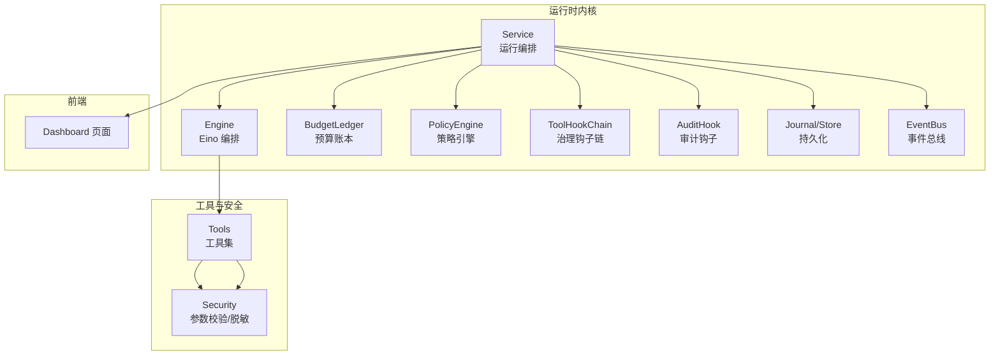
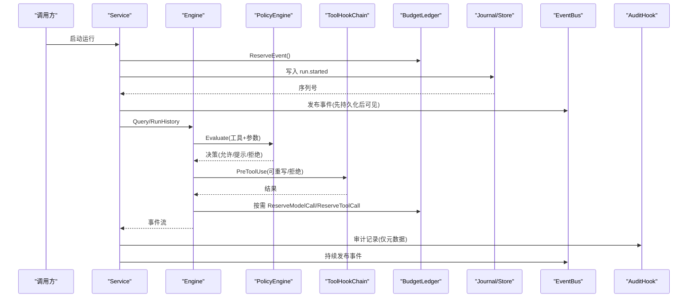
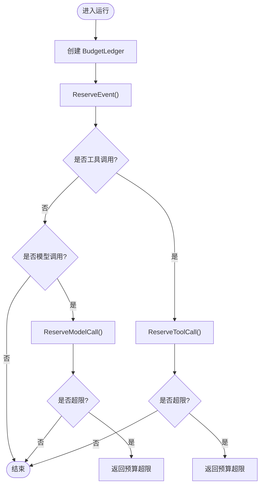
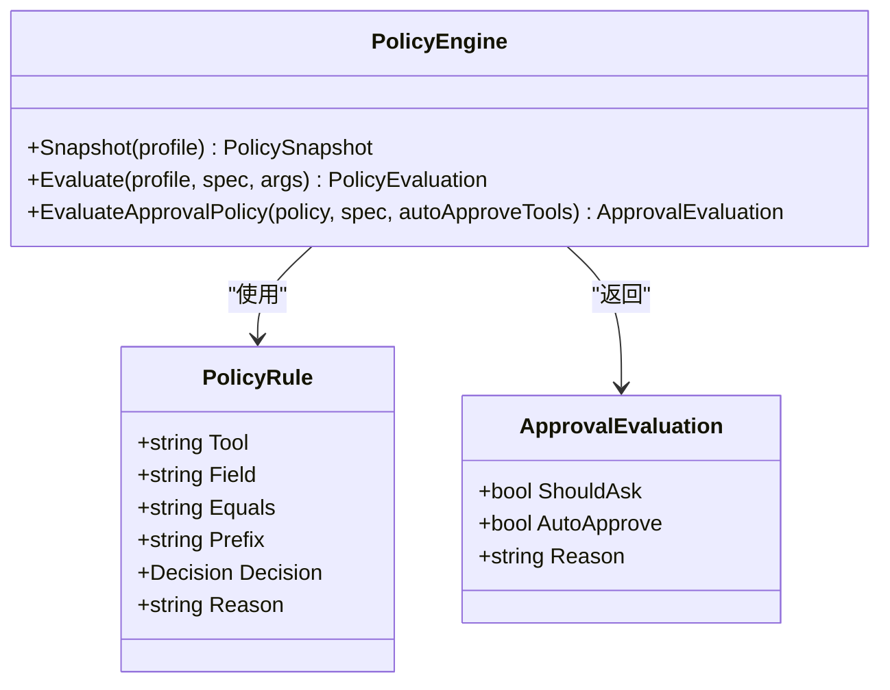
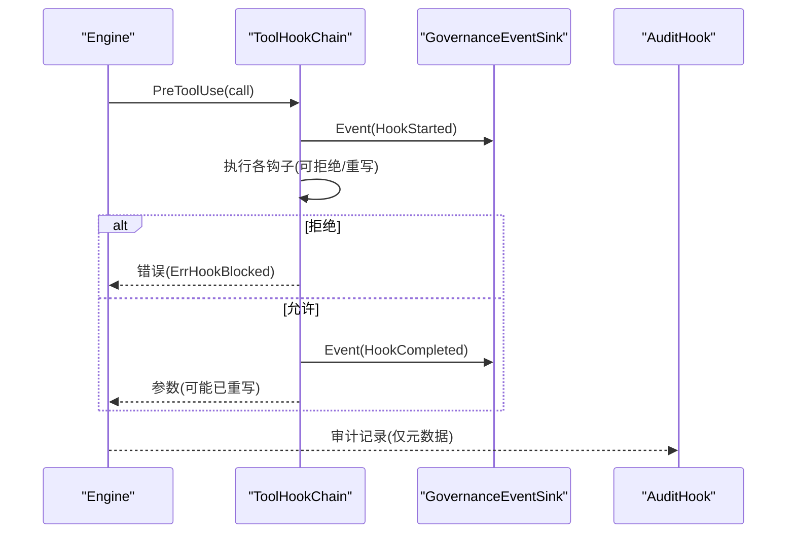
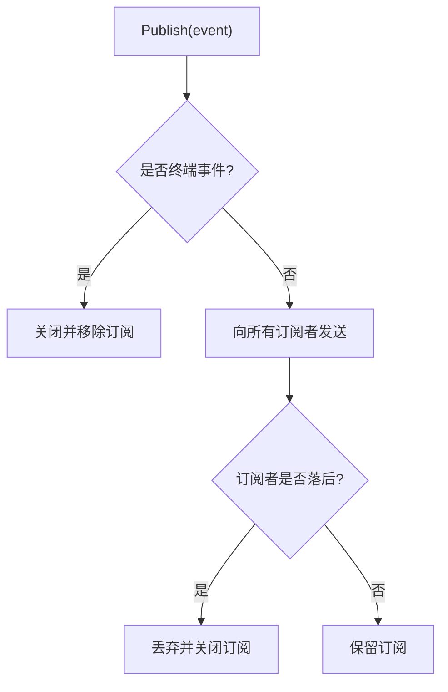
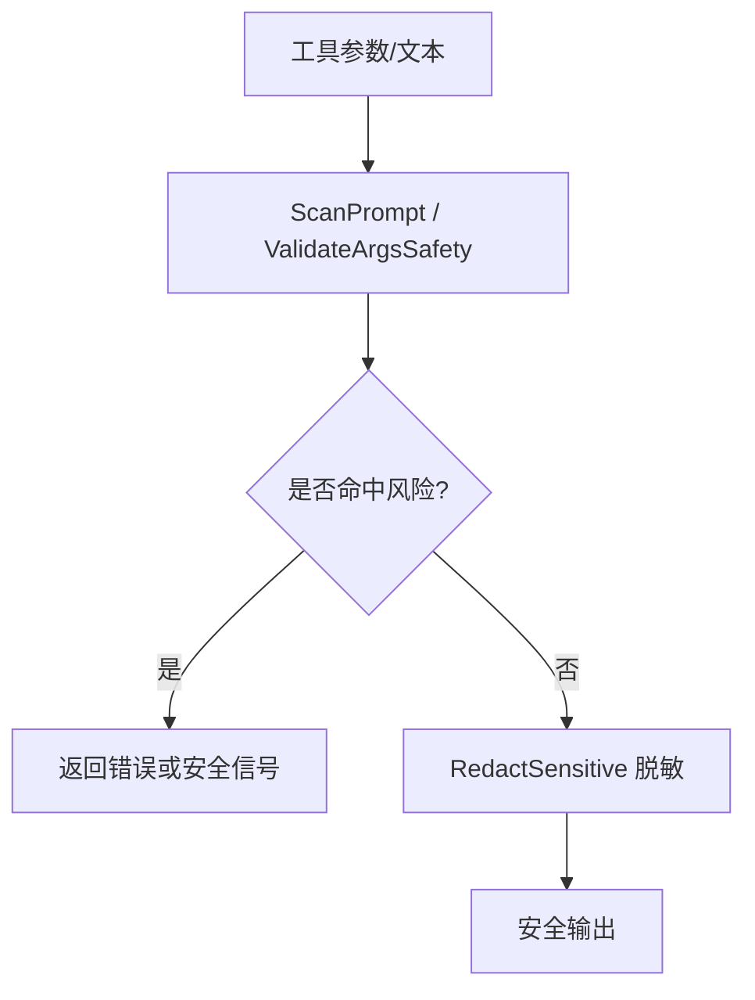
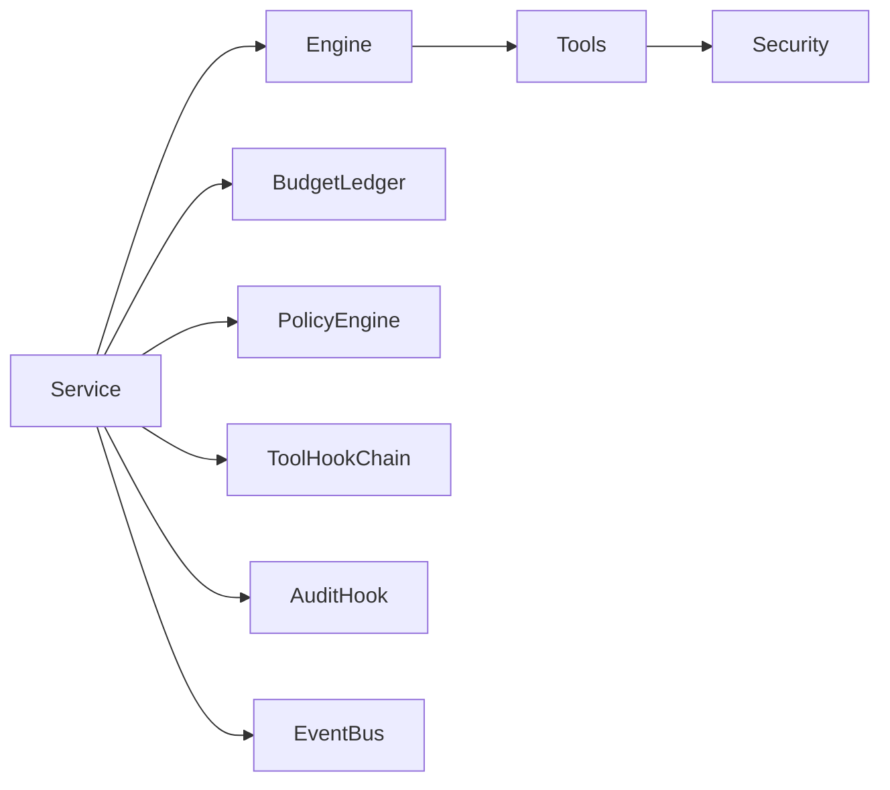

# 安全监控与告警

<cite>
**本文引用的文件**
- [budget.go](file://internal/runtime/budget.go)
- [audit.go](file://internal/runtime/audit.go)
- [bus.go](file://internal/events/bus.go)
- [config.go](file://internal/config/config.go)
- [security.go](file://internal/tools/security.go)
- [engine.go](file://internal/runtime/engine.go)
- [policy.go](file://internal/runtime/policy.go)
- [service.go](file://internal/runtime/service.go)
- [hooks.go](file://internal/runtime/hooks.go)
- [_layout.dashboard.tsx](file://ui/src/routes/_layout.dashboard.tsx)
- [DashboardDemoView.tsx](file://ui/src/components/demo/DashboardDemoView.tsx)
</cite>

## 目录
1. [简介](#简介)
2. [项目结构](#项目结构)
3. [核心组件](#核心组件)
4. [架构总览](#架构总览)
5. [详细组件分析](#详细组件分析)
6. [依赖关系分析](#依赖关系分析)
7. [性能考量](#性能考量)
8. [故障排查指南](#故障排查指南)
9. [结论](#结论)
10. [附录](#附录)

## 简介
本文件面向“安全监控与告警系统”的落地实现，围绕以下目标展开：
- 实时威胁检测：基于工具参数与安全扫描、策略引擎与沙箱配置，拦截注入、越权与敏感信息泄露。
- 异常行为识别：通过预算控制（事件、模型调用、工具调用、重试）与策略评估，快速发现并阻断异常循环或滥用。
- 性能指标监控：以审计记录、治理钩子事件与运行状态快照作为可观测性基础，支撑仪表板展示与历史分析。
- 告警系统：结合策略拒绝、预算超限、交互超时等信号，形成可配置的告警规则与通知渠道集成点。
- 预算控制监控：资源使用限制、成本超支预警、配额管理（事件/调用/重试上限）。
- 安全仪表板：可视化运行状态、Token 用量与审计日志。
- 应急响应流程：自动化响应（钩子/策略）、人工干预（审批/问答）、故障恢复（重启恢复、清理过期交互）。
- 监控最佳实践：阈值设置、误报处理、监控优化策略。

## 项目结构
本项目在 Go 后端中实现了运行时安全与可观测性的关键能力：
- 运行时服务编排与事件持久化、发布、恢复
- 预算账本与配额控制
- 策略引擎与审批/问答流
- 审计与治理钩子
- 前端仪表板（演示态）用于运行状态、Token 统计与审计日志查看

图表来源
- [service.go:96-169](file://internal/runtime/service.go#L96-L169)
- [engine.go:48-117](file://internal/runtime/engine.go#L48-L117)
- [budget.go:103-196](file://internal/runtime/budget.go#L103-L196)
- [policy.go:35-135](file://internal/runtime/policy.go#L35-L135)
- [hooks.go:46-129](file://internal/runtime/hooks.go#L46-L129)
- [audit.go:12-61](file://internal/runtime/audit.go#L12-L61)
- [bus.go:10-115](file://internal/events/bus.go#L10-L115)
- [security.go:12-79](file://internal/tools/security.go#L12-L79)
- [_layout.dashboard.tsx:1-5](file://ui/src/routes/_layout.dashboard.tsx#L1-L5)

章节来源
- [service.go:96-169](file://internal/runtime/service.go#L96-L169)
- [engine.go:48-117](file://internal/runtime/engine.go#L48-L117)
- [budget.go:103-196](file://internal/runtime/budget.go#L103-L196)
- [policy.go:35-135](file://internal/runtime/policy.go#L35-L135)
- [hooks.go:46-129](file://internal/runtime/hooks.go#L46-L129)
- [audit.go:12-61](file://internal/runtime/audit.go#L12-L61)
- [bus.go:10-115](file://internal/events/bus.go#L10-L115)
- [security.go:12-79](file://internal/tools/security.go#L12-L79)
- [_layout.dashboard.tsx:1-5](file://ui/src/routes/_layout.dashboard.tsx#L1-L5)

## 核心组件
- 预算控制（BudgetLedger）：对事件、模型调用、工具调用、重试进行配额计量与熔断，支持父子作用域嵌套与重启回放恢复。
- 策略引擎（PolicyEngine）：按策略画像与规则决定允许、提示或拒绝；支持默认决策与匹配优先级。
- 治理钩子（ToolHookChain）：工具执行前后钩子，支持重写参数、拒绝执行、记录治理事件。
- 审计（AuditHook/SlogAuditSink）：对持久化事件输出仅元数据（大小、摘要），避免泄露敏感内容。
- 事件总线（EventBus）：将持久化的运行事件广播给订阅者，慢消费者会被丢弃并由 Journal 重放。
- 配置（Config）：集中承载运行时边界、沙箱策略、网络白名单、审批超时等安全相关开关。
- 工具安全（Security）：参数安全校验、指令注入信号检测、敏感信息脱敏。
- 前端仪表板（Dashboard）：展示运行状态、Token 用量与审计日志。

章节来源
- [budget.go:103-196](file://internal/runtime/budget.go#L103-L196)
- [policy.go:35-135](file://internal/runtime/policy.go#L35-L135)
- [hooks.go:46-129](file://internal/runtime/hooks.go#L46-L129)
- [audit.go:12-61](file://internal/runtime/audit.go#L12-L61)
- [bus.go:10-115](file://internal/events/bus.go#L10-L115)
- [config.go:110-192](file://internal/config/config.go#L110-L192)
- [security.go:12-79](file://internal/tools/security.go#L12-L79)
- [DashboardDemoView.tsx:10-115](file://ui/src/components/demo/DashboardDemoView.tsx#L10-L115)

## 架构总览
下图展示了从请求到事件落盘、再到实时广播与审计的全链路，以及预算与策略在其中的约束点。

图表来源
- [service.go:212-299](file://internal/runtime/service.go#L212-L299)
- [engine.go:144-165](file://internal/runtime/engine.go#L144-L165)
- [policy.go:96-135](file://internal/runtime/policy.go#L96-L135)
- [hooks.go:58-103](file://internal/runtime/hooks.go#L58-L103)
- [budget.go:142-186](file://internal/runtime/budget.go#L142-L186)
- [audit.go:35-61](file://internal/runtime/audit.go#L35-L61)
- [bus.go:42-75](file://internal/events/bus.go#L42-L75)

## 详细组件分析

### 预算控制与配额管理
- 能力要点
  - 四类配额：事件数、模型调用次数、工具调用次数、重试次数。
  - 父子作用域：子范围可收紧但不能放宽父级限额，防止绕过。
  - 原子预留：并发下对作用域链加锁，保证检查与计数一致。
  - 重启恢复：根据已持久化事件回放重建使用量，避免重启后重置配额。
- 典型流程
  - 启动时创建根账本；每次运行开始时预留一个事件。
  - 工具调用前尝试预留模型调用与工具调用；失败则返回预算超限错误。
  - 快照接口暴露当前策略与实际用量，便于监控与告警。

图表来源
- [budget.go:103-196](file://internal/runtime/budget.go#L103-L196)
- [budget.go:198-220](file://internal/runtime/budget.go#L198-L220)

章节来源
- [budget.go:103-196](file://internal/runtime/budget.go#L103-L196)
- [budget.go:198-220](file://internal/runtime/budget.go#L198-L220)

### 策略引擎与审批/问答流
- 能力要点
  - 策略画像：内置 default/plan/read_only/full_auto，支持自定义规则。
  - 规则匹配：按工具名与字段（命令/路径）精确或前缀匹配，最高优先级决策生效。
  - 默认决策：只读或问答类工具默认允许；其他按画像默认值。
  - 审批策略：ask/never/auto，auto 支持白名单自动批准。
- 与运行集成
  - 启动时计算策略快照（含哈希），随 run.started 持久化。
  - 工具调用前评估策略，必要时进入审批/问答挂起。

图表来源
- [policy.go:19-33](file://internal/runtime/policy.go#L19-L33)
- [policy.go:35-135](file://internal/runtime/policy.go#L35-L135)
- [policy.go:204-274](file://internal/runtime/policy.go#L204-L274)

章节来源
- [policy.go:35-135](file://internal/runtime/policy.go#L35-L135)
- [policy.go:204-274](file://internal/runtime/policy.go#L204-L274)

### 治理钩子与审计
- 治理钩子
  - 前置钩子：可拒绝执行、重写参数、记录治理事件（开始/完成/阻塞）。
  - 后置钩子：失败不改变工具结果（fail-open），但记录告警。
  - 超时保护：每个钩子带超时上下文，避免阻塞主流程。
- 审计
  - 仅记录事件元数据（运行ID、序列号、类型、负载大小、SHA256），不携带用户内容。
  - 可通过 Slog 输出，便于接入外部日志系统。

图表来源
- [hooks.go:58-129](file://internal/runtime/hooks.go#L58-L129)
- [audit.go:35-61](file://internal/runtime/audit.go#L35-L61)

章节来源
- [hooks.go:58-129](file://internal/runtime/hooks.go#L58-L129)
- [audit.go:35-61](file://internal/runtime/audit.go#L35-L61)

### 事件总线与可观测性
- 事件总线
  - 以 RunID 为键向订阅者广播事件；终端事件关闭通道并清理订阅。
  - 慢消费者会被丢弃，后续通过 Journal 从最后序列号重放，确保不丢失。
- 可观测性
  - 审计记录提供稳定元数据，便于关联事件与追踪。
  - 治理事件提供钩子执行耗时、决策与原因，便于定位问题。

图表来源
- [bus.go:42-75](file://internal/events/bus.go#L42-L75)

章节来源
- [bus.go:42-75](file://internal/events/bus.go#L42-L75)

### 工具安全与输入防护
- 指令注入检测：识别试图覆盖系统指令的文本模式，产出安全信号供上层处理。
- 参数安全校验：禁止 NUL 字节、危险命令语法、路径穿越与 UNC 路径。
- 敏感信息脱敏：对常见密钥与邮箱形式进行替换，避免进入模型上下文或持久化负载。

图表来源
- [security.go:25-79](file://internal/tools/security.go#L25-L79)

章节来源
- [security.go:25-79](file://internal/tools/security.go#L25-L79)

### 配置驱动的安全边界
- 运行时边界：事件载荷上限、上下文大小、历史消息条数、工具结果大小等。
- 沙箱策略：默认模式、工作区根、审批策略（ask/never/auto）、网络白名单与私有 IP 屏蔽。
- 工具启用与审批过期：最小化攻击面，限制效果型工具与审批有效期。
- 密钥隔离：配置中不保存密钥，仅引用环境变量名。

章节来源
- [config.go:110-192](file://internal/config/config.go#L110-L192)
- [config.go:254-314](file://internal/config/config.go#L254-L314)
- [config.go:341-528](file://internal/config/config.go#L341-L528)

### 前端安全仪表板
- 概览：会话数、活跃运行数、待处理审查数。
- Token 统计：总量、分组、时间线、会话明细（由后端聚合接口提供）。
- 审计日志：按类型查看审计条目。

章节来源
- [_layout.dashboard.tsx:1-5](file://ui/src/routes/_layout.dashboard.tsx#L1-L5)
- [DashboardDemoView.tsx:10-115](file://ui/src/components/demo/DashboardDemoView.tsx#L10-L115)

## 依赖关系分析
- Service 依赖 Engine、存储、事件总线、预算、策略与钩子，负责运行生命周期与事件持久化顺序（先持久化再发布）。
- Engine 仅依赖 Eino 与工具集，封装 Agent 编排与迭代上限。
- PolicyEngine 与 ToolHookChain 为横切关注点，贯穿工具调用全链路。
- BudgetLedger 被 Service 与 Worker 共享，确保父子作用域一致性。
- EventBus 与 AuditHook 提供可观测性与审计能力，不改变业务状态。

图表来源
- [service.go:96-169](file://internal/runtime/service.go#L96-L169)
- [engine.go:48-117](file://internal/runtime/engine.go#L48-L117)
- [budget.go:103-196](file://internal/runtime/budget.go#L103-L196)
- [policy.go:35-135](file://internal/runtime/policy.go#L35-L135)
- [hooks.go:46-129](file://internal/runtime/hooks.go#L46-L129)
- [audit.go:12-61](file://internal/runtime/audit.go#L12-L61)
- [bus.go:10-115](file://internal/events/bus.go#L10-L115)
- [security.go:12-79](file://internal/tools/security.go#L12-L79)

章节来源
- [service.go:96-169](file://internal/runtime/service.go#L96-L169)
- [engine.go:48-117](file://internal/runtime/engine.go#L48-L117)
- [budget.go:103-196](file://internal/runtime/budget.go#L103-L196)
- [policy.go:35-135](file://internal/runtime/policy.go#L35-L135)
- [hooks.go:46-129](file://internal/runtime/hooks.go#L46-L129)
- [audit.go:12-61](file://internal/runtime/audit.go#L12-L61)
- [bus.go:10-115](file://internal/events/bus.go#L10-L115)
- [security.go:12-79](file://internal/tools/security.go#L12-L79)

## 性能考量
- 事件总线缓冲：订阅通道具备缓冲，避免瞬时峰值阻塞；慢消费者丢弃并通过 Journal 重放，保障吞吐。
- 钩子超时：Pre/Post 钩子带超时上下文，防止外部钩子拖垮主流程。
- 预算限制：对事件/调用/重试设定上限，避免无限循环与资源耗尽。
- 审计轻量：仅记录元数据与摘要，降低 I/O 压力与隐私风险。
- 配置边界：事件载荷、上下文、历史消息、工具结果大小等均有上限，防止内存膨胀。

[本节为通用指导，不直接分析具体文件]

## 故障排查指南
- 预算超限
  - 现象：运行提前终止，返回预算超限错误。
  - 排查：检查对应配额（事件/模型/工具/重试）的使用快照与策略；确认是否存在异常循环或重复重试。
  - 参考：预算预留与回放逻辑。
- 策略拒绝
  - 现象：工具调用被拒绝或需要审批。
  - 排查：查看策略画像与规则匹配结果；确认工具是否只读、是否在白名单内。
  - 参考：策略评估与默认决策。
- 钩子阻塞
  - 现象：工具执行被前置钩子拒绝或超时。
  - 排查：查看治理事件中的 HookName、Phase、Reason、DurationMs；确认钩子实现与超时配置。
  - 参考：钩子链与治理事件。
- 审计缺失
  - 现象：审计日志未出现或延迟。
  - 排查：确认审计 Sink 是否就绪；检查事件是否已持久化；核对日志级别。
  - 参考：审计钩子与日志输出。
- 事件丢失
  - 现象：订阅端未收到事件。
  - 排查：确认是否为慢消费者；通过 Journal 从最后序列号重放。
  - 参考：事件总线发布与丢弃策略。

章节来源
- [budget.go:142-196](file://internal/runtime/budget.go#L142-L196)
- [policy.go:96-135](file://internal/runtime/policy.go#L96-L135)
- [hooks.go:58-129](file://internal/runtime/hooks.go#L58-L129)
- [audit.go:35-61](file://internal/runtime/audit.go#L35-L61)
- [bus.go:42-75](file://internal/events/bus.go#L42-L75)

## 结论
本系统在运行时层面构建了完整的安全监控与告警闭环：以策略与沙箱为入口，以预算为熔断器，以治理钩子与审计为可观测性抓手，以事件总线与 Journal 为可靠传输层，最终在前端仪表板呈现运行状态、Token 用量与审计日志。通过配置驱动的边界与重启恢复机制，系统在保证安全的同时兼顾了可用性与可维护性。

[本节为总结，不直接分析具体文件]

## 附录

### 告警规则与通知渠道集成建议
- 规则来源
  - 策略拒绝：当策略评估结果为 deny 或 prompt 且长时间未决时触发。
  - 预算超限：任一配额达到上限时触发。
  - 钩子阻塞：前置钩子拒绝或超时时触发。
  - 交互超时：审批/问答过期未决时触发。
- 通知渠道
  - 日志：通过审计与治理事件输出至统一日志系统。
  - 外部系统：可在审计 Sink 或治理事件 Sink 处对接告警平台（如 Webhook、邮件、IM）。
- 告警级别
  - 严重：策略拒绝、预算超限、注入检测、路径不允许。
  - 警告：钩子超时、慢消费者丢弃、审批即将过期。
  - 信息：正常运行事件、Token 用量变化。

[本节为通用指导，不直接分析具体文件]

### 预算控制最佳实践
- 阈值设置
  - 事件上限：根据典型任务复杂度设定，避免过长对话导致资源占用。
  - 模型/工具调用：结合模型上下文与工具副作用强度设定合理上限。
  - 重试上限：限制重试次数，防止雪崩。
- 误报处理
  - 若正常任务频繁触发预算限制，优先调整策略与配额，而非放宽安全边界。
- 监控优化
  - 定期分析预算使用快照，识别热点任务与异常模式。
  - 结合审计与治理事件，定位具体工具与钩子瓶颈。

[本节为通用指导，不直接分析具体文件]

### 应急响应流程
- 自动化响应
  - 策略拒绝与预算超限立即中断，避免扩散。
  - 钩子超时自动降级，不影响工具结果。
- 人工干预
  - 审批/问答流程提供人机协同点，支持白名单自动批准。
- 故障恢复
  - 启动时恢复非终态运行：有有效审批/问答且可读取检查点则重建挂起；否则标记失败。
  - 清理过期交互：后台轮询过期审批/问答并关闭。

章节来源
- [service.go:389-463](file://internal/runtime/service.go#L389-L463)
- [service.go:465-576](file://internal/runtime/service.go#L465-L576)